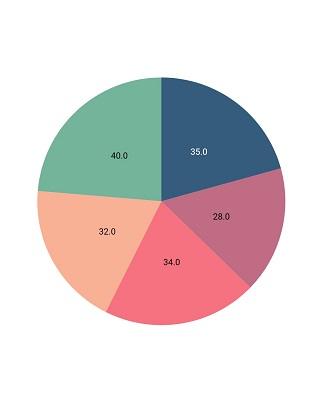
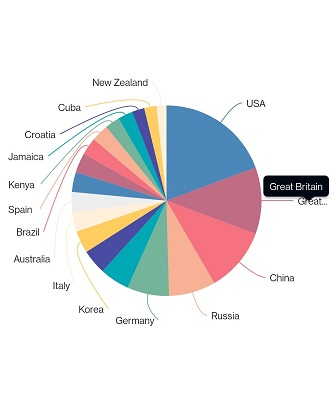
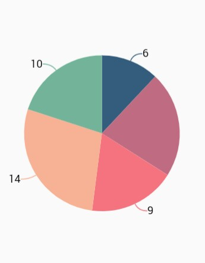
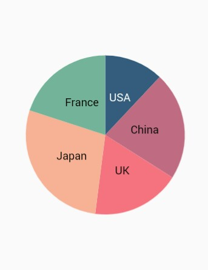
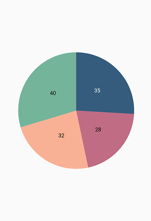
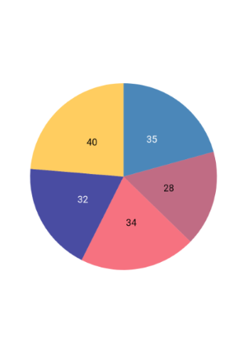

# Data label in Flutter Circular Charts (SfCircularChart)

Data label can be added to a chart series by enabling the [`isVisible`](https://pub.dev/documentation/syncfusion_flutter_charts/latest/charts/DataLabelSettings/isVisible.html) property in the [`dataLabelSettings`](https://pub.dev/documentation/syncfusion_flutter_charts/latest/charts/CircularSeries/dataLabelSettings.html). You can use the following properties to customize the appearance.

* [`color`](https://pub.dev/documentation/syncfusion_flutter_charts/latest/charts/DataLabelSettings/color.html) - used to change the background color of the data label shape.
* [`borderWidth`](https://pub.dev/documentation/syncfusion_flutter_charts/latest/charts/DataLabelSettings/borderWidth.html) - used to change the stroke width of the data label shape.
* [`borderColor`](https://pub.dev/documentation/syncfusion_flutter_charts/latest/charts/DataLabelSettings/borderColor.html) - used to change the stroke color of the data label shape.
* [`alignment`](https://pub.dev/documentation/syncfusion_flutter_charts/latest/charts/DataLabelSettings/alignment.html) - aligns the data label text to [`ChartAlignment.near`](https://pub.dev/documentation/syncfusion_flutter_charts/latest/charts/ChartAlignment-class.html), [`ChartAlignment.center`](https://pub.dev/documentation/syncfusion_flutter_charts/latest/charts/ChartAlignment-class.html) and [`ChartAlignment.far`](https://pub.dev/documentation/syncfusion_flutter_charts/latest/charts/ChartAlignment-class.html).
* [`textStyle`](https://pub.dev/documentation/syncfusion_flutter_charts/latest/charts/DataLabelSettings/textStyle.html) - used to change the data label text color, size, font family, font style, and font weight.
* [`color`](https://pub.dev/documentation/syncfusion_flutter_charts/latest/charts/DataLabelSettings/color.html) - used to change the color of the data label.
* [`fontFamily`](https://api.flutter.dev/flutter/painting/TextStyle/fontFamily.html) - used to change the font family for the data label.
* [`fontStyle`](https://api.flutter.dev/flutter/painting/TextStyle/fontStyle.html) - used to change the font style for the data label.
* [`fontWeight`](https://api.flutter.dev/flutter/painting/TextStyle/fontWeight.html) - used to change the font weight for the data label.
* [`fontSize`](https://api.flutter.dev/flutter/painting/TextStyle/fontSize.html) - used to change the font size for the data label.
* [`margin`](https://pub.dev/documentation/syncfusion_flutter_charts/latest/charts/DataLabelSettings/margin.html) - used to change the margin size for data labels.
* [`opacity`](https://pub.dev/documentation/syncfusion_flutter_charts/latest/charts/DataLabelSettings/opacity.html) - used to control the transparency of the data label.
* [`labelAlignment`](https://pub.dev/documentation/syncfusion_flutter_charts/latest/charts/DataLabelSettings/labelAlignment.html) - used to align the Circular data label positions. The available options to customize the positions are [`ChartDataLabelAlignment.outer`](https://pub.dev/documentation/syncfusion_flutter_charts/latest/charts/ChartDataLabelAlignment.html), [`ChartDataLabelAlignment.auto`](https://pub.dev/documentation/syncfusion_flutter_charts/latest/charts/ChartDataLabelAlignment.html), [`ChartDataLabelAlignment.top`](https://pub.dev/documentation/syncfusion_flutter_charts/latest/charts/ChartDataLabelAlignment.html), [`ChartDataLabelAlignment.bottom`](https://pub.dev/documentation/syncfusion_flutter_charts/latest/charts/ChartDataLabelAlignment.html) and [`ChartDataLabelAlignment.middle`](https://pub.dev/documentation/syncfusion_flutter_charts/latest/charts/ChartDataLabelAlignment.html).
* [`borderRadius`](https://pub.dev/documentation/syncfusion_flutter_charts/latest/charts/DataLabelSettings/borderRadius.html) - used to add the rounded corners to the data label shape.
* [`angle`](https://pub.dev/documentation/syncfusion_flutter_charts/latest/charts/DataLabelSettings/angle.html) - used to rotate the labels.
* [`offset`](https://pub.dev/documentation/syncfusion_flutter_charts/latest/charts/DataLabelSettings/offset.html) - used to move the data label vertically or horizontally from its position.
* [`showCumulativeValues`](https://pub.dev/documentation/syncfusion_flutter_charts/latest/charts/DataLabelSettings/showCumulativeValues.html) - to show the cumulative values in stacked type series charts.
* [`labelIntersectAction`](https://pub.dev/documentation/syncfusion_flutter_charts/latest/charts/DataLabelSettings/labelIntersectAction.html) - action on data labels intersection. The intersecting data labels can be hidden.

 

    @override
    Widget build(BuildContext context) {
        return Scaffold(
            body: Center(
                child: Container(
                    child: SfCircularChart(
                        series: <CircularSeries>[
                            PieSeries<ChartData, double>(
                                dataSource: chartData,
                                pointColorMapper: (ChartData data, _) => data.color,
                                xValueMapper: (ChartData data, _) => data.x,
                                yValueMapper: (ChartData data, _) => data.y,
                                dataLabelSettings: DataLabelSettings(
                                    // Renders the data label
                                    isVisible: true
                                )
                            )
                        ]
                    )
                )
            )
        );
    }



## Formatting label content

Data label considers the format used in the Circular series by default. In the below code snippet, we have specified format for the data label in the [`dataLabelMapper`](https://pub.dev/documentation/syncfusion_flutter_charts/latest/charts/CircularSeries/dataLabelMapper.html) and you can see that the same format is applied to the data label.

 

    @override
    Widget build(BuildContext context) {
        return Scaffold(
            body: Center(
                child: Container(
                    child: SfCircularChart(
                        series: <CircularSeries>[
                            PieSeries<ChartData, double>(
                                dataSource: [
                                    // Bind data source
                                   ChartData('Jan', 35, '35%'),
                                   ChartData('Feb', 28, '28%'),
                                   ChartData('Mar', 34, '34%'),
                                   ChartData('Apr', 32,  '32%'),
                                   ChartData('May', 40, '40%')
                                ],
                                color: Colors.red,
                                xValueMapper: (ChartData data, _) => data.x,
                                yValueMapper: (ChartData data, _) => data.y,
                                dataLabelMapper: (ChartData data, _) => data.text,
                                dataLabelSettings: DataLabelSettings(
                                    isVisible: true
                                )
                            )
                        ]
                    )
                )
            )
        );
    }



## Positioning the labels

The [`labelAlignment`](https://pub.dev/documentation/syncfusion_flutter_charts/latest/charts/DataLabelSettings/labelAlignment.html) property is used to position the Circular chart type data labels at [`ChartDataLabelAlignment.top`](https://pub.dev/documentation/syncfusion_flutter_charts/latest/charts/ChartDataLabelAlignment.html), [`ChartDataLabelAlignment.bottom`](https://pub.dev/documentation/syncfusion_flutter_charts/latest/charts/ChartDataLabelAlignment.html), [`ChartDataLabelAlignment.auto`](https://pub.dev/documentation/syncfusion_flutter_charts/latest/charts/ChartDataLabelAlignment.html), [`ChartDataLabelAlignment.outer`](https://pub.dev/documentation/syncfusion_flutter_charts/latest/charts/ChartDataLabelAlignment.html) and [`ChartDataLabelAlignment.middle`](https://pub.dev/documentation/syncfusion_flutter_charts/latest/charts/ChartDataLabelAlignment.html) position of the actual data point position. By default, labels are [`ChartDataLabelAlignment.auto`](https://pub.dev/documentation/syncfusion_flutter_charts/latest/charts/ChartDataLabelAlignment.html) positioned. You can move the labels horizontally and vertically using OffsetX and OffsetY properties respectively.

The [`labelPosition`](https://pub.dev/documentation/syncfusion_flutter_charts/latest/charts/DataLabelSettings/labelPosition.html) property is used to place the circular series data labels either [`ChartDataLabelPosition.inside`](https://pub.dev/documentation/syncfusion_flutter_charts/latest/charts/ChartDataLabelPosition.html) or [`ChartDataLabelPosition.outside`](https://pub.dev/documentation/syncfusion_flutter_charts/latest/charts/ChartDataLabelPosition.html). By default the label of circular chart is placed [`ChartDataLabelPosition.inside`](https://pub.dev/documentation/syncfusion_flutter_charts/latest/charts/ChartDataLabelPosition.html) the series.

 

    @override
    Widget build(BuildContext context) {
        return Scaffold(
            body: Center(
                child: Container(
                    child: SfCircularChart(
                        series: <CircularSeries>[
                            PieSeries<ChartData, double>(
                                dataSource: chartData,
                                xValueMapper: (ChartData data, _) => data.x,
                                yValueMapper: (ChartData data, _) => data.y,
                                dataLabelSettings: DataLabelSettings(
                                    isVisible: true,
                                    // Positioning the data label
                                    labelPosition: ChartDataLabelPosition.outside
                                )
                            )
                        ]
                    )
                )
            )
        );
    }



N>  The [`labelAlignment`](https://pub.dev/documentation/syncfusion_flutter_charts/latest/charts/DataLabelSettings/labelAlignment.html) property is used to position the Cartesian chart labels whereas [`labelPosition`](https://pub.dev/documentation/syncfusion_flutter_charts/latest/charts/DataLabelSettings/labelPosition.html) property is used to position the circular chart labels.

## Smart labels

This feature is used to arrange the data labels smartly and avoid the intersection when there is overlapping of labels. The enum property called the [`LabelIntersectAction.shift`](https://pub.dev/documentation/syncfusion_flutter_charts/latest/charts/LabelIntersectAction.html) in [`labelIntersectAction`](https://pub.dev/documentation/syncfusion_flutter_charts/latest/charts/DataLabelSettings/labelIntersectAction.html) is used to arrange the data labels smartly when labels get intersect. By default, the label intersection action property is [`LabelIntersectAction.shift`](https://pub.dev/documentation/syncfusion_flutter_charts/latest/charts/LabelIntersectAction.html).

If the [`labelPosition`](https://pub.dev/documentation/syncfusion_flutter_charts/latest/charts/DataLabelSettings/labelPosition.html) is [`ChartDataLabelPosition.inside`](https://pub.dev/documentation/syncfusion_flutter_charts/latest/charts/DataLabelSettings/labelPosition.html) and the [`labelIntersectAction`](https://pub.dev/documentation/syncfusion_flutter_charts/latest/charts/DataLabelSettings/labelIntersectAction.html) is [`LabelIntersectAction.shift`](https://pub.dev/documentation/syncfusion_flutter_charts/latest/charts/LabelIntersectAction.html), then the overlapped labels will shift to outside the slices and arrange smartly. If the [`labelPosition`](https://pub.dev/documentation/syncfusion_flutter_charts/latest/charts/DataLabelSettings/labelPosition.html) is [`ChartDataLabelPosition.inside`](https://pub.dev/documentation/syncfusion_flutter_charts/latest/charts/DataLabelSettings/labelPosition.html) and the [`labelIntersectAction`](https://pub.dev/documentation/syncfusion_flutter_charts/latest/charts/DataLabelSettings/labelIntersectAction.html) is [`LabelIntersectAction.hide`](https://pub.dev/documentation/syncfusion_flutter_charts/latest/charts/LabelIntersectAction.html), then the overlapped labels will be hidden.

If the [`labelPosition`](https://pub.dev/documentation/syncfusion_flutter_charts/latest/charts/DataLabelSettings/labelPosition.html) is [`ChartDataLabelPosition.outside`](https://pub.dev/documentation/syncfusion_flutter_charts/latest/charts/DataLabelSettings/labelPosition.html) and the [`labelIntersectAction`](https://pub.dev/documentation/syncfusion_flutter_charts/latest/charts/DataLabelSettings/labelIntersectAction.html) is [`LabelIntersectAction.shift`](https://pub.dev/documentation/syncfusion_flutter_charts/latest/charts/LabelIntersectAction.html), then the overlapped labels arrange smartly. If the [`labelPosition`](https://pub.dev/documentation/syncfusion_flutter_charts/latest/charts/DataLabelSettings/labelPosition.html) is [`ChartDataLabelPosition.outside`](https://pub.dev/documentation/syncfusion_flutter_charts/latest/charts/DataLabelSettings/labelPosition.html) and the [`labelIntersectAction`](https://pub.dev/documentation/syncfusion_flutter_charts/latest/charts/DataLabelSettings/labelIntersectAction.html) is [`LabelIntersectAction.hide`](https://pub.dev/documentation/syncfusion_flutter_charts/latest/charts/LabelIntersectAction.html), then the overlapped labels will be hidden.

If the [`labelIntersectAction`](https://pub.dev/documentation/syncfusion_flutter_charts/latest/charts/DataLabelSettings/labelIntersectAction.html) is [`LabelIntersectAction.none`](https://pub.dev/documentation/syncfusion_flutter_charts/latest/charts/LabelIntersectAction.html), then the overlapped labels will be visible irrespective of [`labelPosition`](https://pub.dev/documentation/syncfusion_flutter_charts/latest/charts/DataLabelSettings/labelPosition.html).

When the [`labelIntersectAction`](https://pub.dev/documentation/syncfusion_flutter_charts/latest/charts/DataLabelSettings/labelIntersectAction.html) is [`LabelIntersectAction.shift`](https://pub.dev/documentation/syncfusion_flutter_charts/latest/charts/LabelIntersectAction.html), and if the data label goes out of the chart area, then the labels got trimmed and the tooltip is shown when clicking/tapping the data label. The values of the [`labelIntersectAction`](https://pub.dev/documentation/syncfusion_flutter_charts/latest/charts/DataLabelSettings/labelIntersectAction.html) are listed below.
* [`LabelIntersectAction.hide`](https://pub.dev/documentation/syncfusion_flutter_charts/latest/charts/LabelIntersectAction.html) - hides the intersected data labels.
* [`LabelIntersectAction.none`](https://pub.dev/documentation/syncfusion_flutter_charts/latest/charts/LabelIntersectAction.html) - intersected data labels will be visible.
* [`LabelIntersectAction.shift`](https://pub.dev/documentation/syncfusion_flutter_charts/latest/charts/LabelIntersectAction.html) - smartly arranges the overlapped data labels.

N>  The smart label positioning is applicable only for the pie and doughnut series.

 

    @override
    Widget build(BuildContext context) {
      final List<ChartData> chartData = <ChartData>[
          ChartData(x: 'USA', y: 46),
          ChartData(x: 'Great Britain', y: 27),
          ChartData(x: 'China', y: 26),
          ChartData(x: 'Russia', y: 19),
          ChartData(x: 'Germany', y: 17),
          ChartData(x: 'Japan', y: 12),
          ChartData(x: 'France', y: 10),
          ChartData(x: 'Korea', y: 9),
          ChartData(x: 'Italy', y: 8),
          ChartData(x: 'Australia', y: 8),
          ChartData(x: 'Netherlands', y: 8),
          ChartData(x: 'Hungary', y: 8),
          ChartData(x: 'Brazil', y: 7),
          ChartData(x: 'Spain', y: 7),
          ChartData(x: 'Kenya', y: 6),
          ChartData(x: 'Jamaica', y: 6),
          ChartData(x: 'Croatia', y: 5),
          ChartData(x: 'Cuba', y: 5),
          ChartData(x: 'New Zealand', y: 4)
      ];
      return SfCircularChart(
        series: <CircularSeries<ChartData, String>>[
          PieSeries<ChartData, String>(
            dataSource: chartData,
            xValueMapper: (ChartData data, _) => data.x,
            yValueMapper: (ChartData data, _) => data.y,
            dataLabelMapper: (ChartData data, _) => data.x,
            radius: '60%',
            dataLabelSettings: DataLabelSettings(
              isVisible: true,
              // Avoid labels intersection
              labelIntersectAction: LabelIntersectAction.shift,
              labelPosition: ChartDataLabelPosition.outside,
              connectorLineSettings: ConnectorLineSettings(
                type: ConnectorType.curve, length: '25%')
              )
          )
        ]);
    }

    class ChartData {
      ChartData({this.x, this.y});
      final String? x;
      final num? y;
    }



## Apply series color

The [`useSeriesColor`](https://pub.dev/documentation/syncfusion_flutter_charts/latest/charts/DataLabelSettings/useSeriesColor.html) property is used to apply the series color to background color of the data labels. The default value of this property is 'false'.

 

    @override
    Widget build(BuildContext context) {
        return Scaffold(
            body: Center(
                child: Container(
                    child:SfCircularChart(
                        series: <CircularSeries>[
                            PieSeries<ChartData, double>(
                                dataSource: chartData,
                                xValueMapper: (ChartData data, _) => data.x,
                                yValueMapper: (ChartData data, _) => data.y,
                                dataLabelMapper: (ChartData data, _) => data.x,
                                dataLabelSettings: DataLabelSettings(
                                    isVisible: true, 
                                    labelPosition: ChartDataLabelPosition.outside,
                                    // Renders background rectangle and fills it with series color
                                    useSeriesColor: true
                                )
                            )
                        ]
                    )
                )
            )
        );
    }



## Connector line

This feature is used to connect label and data point using a line. It is applicable only for [`PieSeries`](https://pub.dev/documentation/syncfusion_flutter_charts/latest/charts/PieSeries-class.html) and [`DoughnutSeries`](https://pub.dev/documentation/syncfusion_flutter_charts/latest/charts/DoughnutSeries-class.html) chart types. The [`connectorLineSettings`](https://pub.dev/documentation/syncfusion_flutter_charts/latest/charts/DataLabelSettings/connectorLineSettings.html) property can be used to customize the connector line.

* [`color`](https://pub.dev/documentation/syncfusion_flutter_charts/latest/charts/ConnectorLineSettings/color.html) - used to change the color of the line
* [`width`](https://pub.dev/documentation/syncfusion_flutter_charts/latest/charts/ConnectorLineSettings/width.html) - used to change the stroke thickness of the line
* [`length`](https://pub.dev/documentation/syncfusion_flutter_charts/latest/charts/ConnectorLineSettings/length.html) - specifies the length of the connector line.
* [`type`](https://pub.dev/documentation/syncfusion_flutter_charts/latest/charts/ConnectorLineSettings/type.html) - specifies the shape of connector line either [`ConnectorType.curve`](https://pub.dev/documentation/syncfusion_flutter_charts/latest/charts/ConnectorType.html) or [`ConnectorType.line`](https://pub.dev/documentation/syncfusion_flutter_charts/latest/charts/ConnectorType.html). 

 

    @override
    Widget build(BuildContext context) {
        return Scaffold(
            body: Center(
                child: Container(
                    child: SfCircularChart(
                        series: <CircularSeries>[
                            PieSeries<ChartData, double>(
                                enableSmartLabels: true,
                                dataSource: chartData,
                                xValueMapper: (ChartData data, _) => data.x,
                                yValueMapper: (ChartData data, _) => data.y,
                                dataLabelSettings: DataLabelSettings(
                                    isVisible: true,
                                    labelPosition: ChartDataLabelPosition.outside,
                                    connectorLineSettings: ConnectorLineSettings(
                                        // Type of the connector line
                                        type: ConnectorType.curve
                                    )
                                )
                            )
                        ]
                    )
                )
            )
        );
    }



## Point text mapping

The [`dataLabelMapper`](https://pub.dev/documentation/syncfusion_flutter_charts/latest/charts/CircularSeries/dataLabelMapper.html) property is used to map the text from data source. 

 

    @override
    Widget build(BuildContext context) {
        final List<ChartData> chartData = [
            ChartData('USA', 17, '17%'),
            ChartData('China', 34, '34%'),
            ChartData('Japan', 24, '24%'),
            ChartData('Africa', 30, '30%'),
            ChartData('UK', 10, '10%')
        ];

        return Scaffold(
            body: Center(
                child: Container(
                    child:SfCircularChart(
                        series: <CircularSeries>[
                            PieSeries<ChartData, String>(
                                dataSource: chartData,
                                xValueMapper: (ChartData data, _) => data.x,
                                yValueMapper: (ChartData data, _) => data.y,
                                // Map the data label text for each point from the data source
                                dataLabelMapper: (ChartData data, _) => data.text,
                                dataLabelSettings: DataLabelSettings(
                                    isVisible: true
                                )
                            )
                        ]
                    )
                )
            )
        );
    }

    class ChartData {
        ChartData(this.x, this.y, this.text);
        final String x;
        final double y;
        final String text;
    }



## Templating the labels

You can customize the appearance of the data label with your own template using the [`builder`](https://pub.dev/documentation/syncfusion_flutter_charts/latest/charts/DataLabelSettings/builder.html) property of [`dataLabelSettings`](https://pub.dev/documentation/syncfusion_flutter_charts/latest/charts/CircularSeries/dataLabelSettings.html).

 

    @override
    Widget build(BuildContext context) {
        return Scaffold(
            body: Center(
                child: Container(
                    child:SfCircularChart(
                        series: <CircularSeries>[
                            PieSeries<ChartData, String>(
                                dataSource: chartData,
                                xValueMapper: (ChartData data, _) => data.x,
                                yValueMapper: (ChartData data, _) => data.y,
                                dataLabelMapper: (ChartData data, _) => data.text,
                                dataLabelSettings: DataLabelSettings(
                                    isVisible: true,
                                    // Templating the data label
                                    builder: (dynamic data, dynamic point, dynamic series, int pointIndex, int seriesIndex) {
                                        return Container(
                                        height: 30,
                                        width: 30,
                                        child: Image.asset('images/livechart.png')
                                        );
                                    }
                                )
                            )
                        ]
                    )
                )
            )
        );
    }



## Hide data label for 0 value

Data label and its connector line in the Circular charts for the point value 0 can be hidden using the [`showZeroValue`](https://pub.dev/documentation/syncfusion_flutter_charts/latest/charts/DataLabelSettings/showZeroValue.html) property. This defaults to true.

 

    final List<SalesData> chartData = <SalesData>[
        SalesData('Jan', 35),
        SalesData('Feb', 28),
        SalesData('March', 0),
        SalesData('April', 32),
        SalesData('May', 40)
    ];
    
    @override
    Widget build(BuildContext context) {
        return Scaffold(
            body: Center(
                child: Container(
                    child:SfCircularChart(
                        series: <CircularSeries<SalesData, String>>[
                            PieSeries<SalesData, String>(
                                dataSource: chartData,
                                xValueMapper: (SalesData sales, _) => sales.xValue,
                                yValueMapper: (SalesData sales, _) => sales.yValue,
                                dataLabelSettings: DataLabelSettings(
                                    showZeroValue : false, 
                                    isVisible: true
                                )
                            )
                        ],
                    )
                )
            )
        );
    }



## Data label saturation color

If the user didn’t provide text color to the data label, then by default, the saturation color is applied to the data label text. i.e., if the data points background color intensity is dark, then the data label will render in white color (#FFFFFF) and if the data points background color intensity is light, data label will render in black color (#000000).

