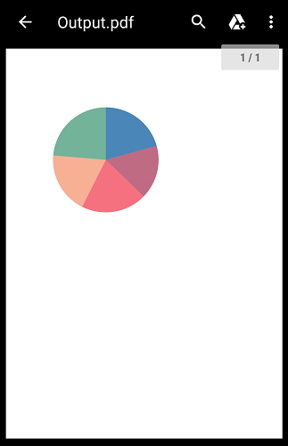

# Exporting in Flutter Circular Charts (SfCircularChart)

[`SfCircularChart`](https://pub.dev/documentation/syncfusion_flutter_charts/latest/charts/SfCircularChart-class.html) provides support to export the circular chart as a PNG image or as PDF document.

## Export image

To export the circular chart as a PNG image, we can get the image by calling [`toImage`](https://api.flutter.dev/flutter/rendering/RenderRepaintBoundary/toImage.html) method in repaint boundary.



    import 'dart:typed_data';
    import 'dart:ui' as ui;
    import 'package:flutter/material.dart';
    import 'package:syncfusion_flutter_charts/charts.dart';

    
    class ExportCircular extends StatefulWidget {
      
      const ExportCircular({Key? key}) : super(key: key);

      @override
      _ExportState createState() => _ExportState();
    }

    class _ExportState extends State<ExportCircular> {
      _ExportState();

      late GlobalKey<SfCircularChartState> _circularChartKey;
      late List<ChartSampleData> _chartData;

      @override
      void initState() {
        _circularChartKey = GlobalKey();
        _chartData = <ChartSampleData>[
          ChartSampleData(x: 'Jan', y: 12),
          ChartSampleData(x: 'Feb', y: 28),
          ChartSampleData(x: 'Mar', y: 35),
          ChartSampleData(x: 'Apr', y: 47),
          ChartSampleData(x: 'May', y: 56),
          ChartSampleData(x: 'Jun', y: 70),
        ];
        super.initState();
      }

      @override
      Widget build(BuildContext context) {
        return Scaffold(
          body: Column(
            mainAxisAlignment: MainAxisAlignment.spaceEvenly,
            children: <Widget>[
              SfCircularChart(
                key: _circularChartKey,
                series: <CircularSeries<ChartSampleData, String>>[
                  PieSeries<ChartSampleData, String>(
                    dataSource: _chartData,
                    xValueMapper: (ChartSampleData data, _) => data.x,
                    yValueMapper: (ChartSampleData data, _) => data.y,
                  )
                ]
              ),
              TextButton(
                child: const Text('Export as image'),
                onPressed: () {
                  _renderCircularImage();
                },
              )
            ]
          ),
        );
      }

      Future<void> _renderCircularImage() async {
        final ui.Image data =
          await _circularChartKey.currentState!.toImage(pixelRatio: 3.0);
        final ByteData? bytes =
          await data.toByteData(format: ui.ImageByteFormat.png);
        final Uint8List imageBytes =
          bytes!.buffer.asUint8List(bytes.offsetInBytes, bytes.lengthInBytes);
        await Navigator.of(context).push<dynamic>(
          MaterialPageRoute<dynamic>(
            builder: (BuildContext context) {
              return Scaffold(body: Image.memory(imageBytes));
            },
          ),
        );
      }
    }

    class ChartSampleData {
      ChartSampleData({this.x, this.y});
        final String? x;
        final num? y;
    }

  

## Export PDF

Similar to the above way, we can also export the rendered chart as a PDF document. We create the pdf document using pdf component. This can be done in the application level itself and please find the code snippet below.It is necessary to include the platform-specific file generating codes to save the file as a PDF document. So, create two dart files ([`save_file_mobile`](https://github.com/syncfusion/flutter-examples/blob/master/lib/samples/pdf/helper/save_file_mobile.dart) and [`save_file_web`](https://github.com/syncfusion/flutter-examples/blob/master/lib/samples/pdf/helper/save_file_web.dart)) to save and launch the file in different platforms.

 

    import 'dart:typed_data';
    import 'dart:ui' as ui;
    import 'package:flutter/material.dart';
    import '../save_file_mobile.dart'
      if (dart.library.html) '../save_file_web.dart';
    import 'dart:async';

    /// Chart import.
    import 'package:syncfusion_flutter_charts/charts.dart';
    /// Pdf import.
    import 'package:syncfusion_flutter_pdf/pdf.dart';

    class Export extends StatefulWidget {
      
      const Export({Key? key}) : super(key: key);

      @override
      _ExportState createState() => _ExportState();
    }

    class _ExportState extends State<Export> {
      _ExportState();
      late GlobalKey<SfCircularChartState> _circularChartKey;
      late List<ChartSampleData> _chartData;

      @override
      void initState() {
        _cartesianChartKey = GlobalKey();
        _chartData = <ChartSampleData>[
          ChartSampleData(x: 'Jan', y: 35),
          ChartSampleData(x: 'Feb', y: 28),
          ChartSampleData(x: 'Mar', y: 33),
          ChartSampleData(x: 'Apr', y: 32),
          ChartSampleData(x: 'May', y: 40),
        ];
        super.initState();
      }

      @override
      Widget build(BuildContext context) {
        return Column(
          children: <Widget>[
            SfCircularChart(
              key: _circularChartKey,
              series: <PieSeries<ChartSampleData, String>>[
                PieSeries<ChartSampleData, String>(
                  dataSource: _chartData,
                  xValueMapper: (ChartSampleData data, _) => data.x,
                  yValueMapper: (ChartSampleData data, _) => data.y,
                )
              ]
            ),
            TextButton(
              child: const Text('Export as PDF'),
              onPressed: () {
                _renderPDF();
              },
            )
          ]
        );
      }

      Future<void> _renderPDF() async {
        final List<int> imageBytes = await _readImageData();
        final PdfBitmap bitmap = PdfBitmap(imageBytes);
        final PdfDocument document = PdfDocument();
        document.pageSettings.size =
          Size(bitmap.width.toDouble(), bitmap.height.toDouble());
        final PdfPage page = document.pages.add();
        final Size pageSize = page.getClientSize();
        page.graphics.drawImage(
          bitmap, Rect.fromLTWH(0, 0, pageSize.width, pageSize.height));
        await FileSaveHelper.saveAndLaunchFile(
          document.save(), 'cartesian_chart.pdf');
        ScaffoldMessenger.of(context).showSnackBar(const SnackBar(
          behavior: SnackBarBehavior.floating,
          shape: RoundedRectangleBorder(
          borderRadius: BorderRadius.all(Radius.circular(5))),
          duration: Duration(milliseconds: 2000),
          content: Text('Chart has been exported as PDF document.'),
        ));
      }

      Future<List<int>> _readImageData() async {
        final ui.Image data =
          await _circularChartKey.currentState!.toImage(pixelRatio: 3.0);
        final ByteData? bytes =
          await data.toByteData(format: ui.ImageByteFormat.png);
        return bytes!.buffer.asUint8List(bytes.offsetInBytes, bytes.lengthInBytes);
      }
    }

    class ChartSampleData {
      ChartSampleData({this.x, this.y});
        final String? x;
        final num? y;
    }

  

  