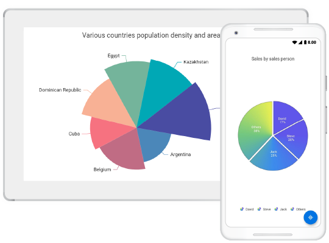
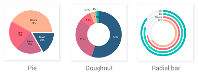
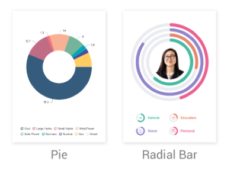

# Flutter Circular Charts (SfCircularChart) Overview

Syncfusion&reg; Flutter Circular Charts (SfCircularChart) widget is written natively in Dart for creating beautiful and high-performance Circular charts, which are used to craft high-quality applications using Flutter.

To get started quickly with our Flutter circular chart widget, you can check out this video.

<iframe id='flutterChartVideoTutorial' src='https://www.youtube.com/embed/FwUSJtv-3NY'></iframe>

## Key Features

* **Chart types** - Supports 3 different series types such as [`pie`](https://www.syncfusion.com/flutter-widgets/flutter-charts/chart-types/pie-chart), [`doughnut`](https://www.syncfusion.com/flutter-widgets/flutter-charts/chart-types/doughnut-chart), and [`radial bar`](https://www.syncfusion.com/flutter-widgets/flutter-charts/chart-types/radial-bar-chart) series. Each type represents data in a unique style. These charts are user-friendly and provide enhanced UI visualization.

  

* **User interaction** - The end-user experience is greatly enhanced by including the user interaction features such as callbacks, selection, tooltip, and explode in chart. 

* **Legends** - Display additional information about the chart series. The chart legend can also be used to collapse the series. The legends can be wrapped or scrolled if an item exceeds the available bounds. 

  

* **Dynamic update** - Updates the chart dynamically or lazily with live data that changes over seconds or minutes like stock prices, temperature, speed, etc.

