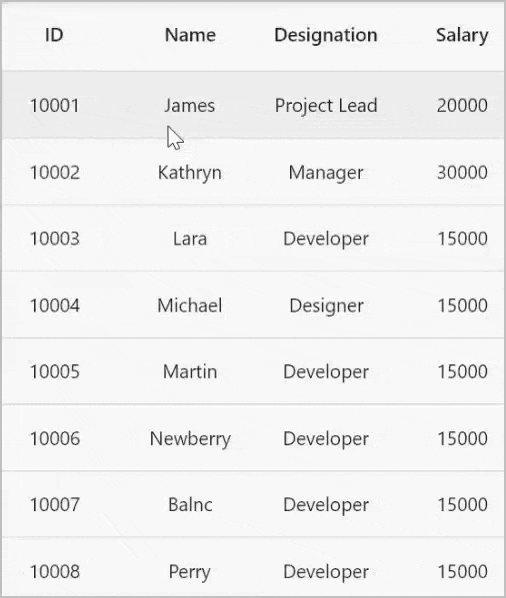
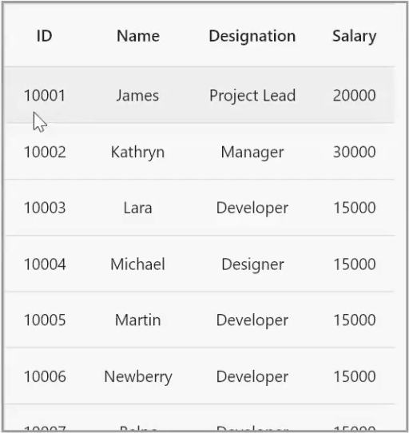
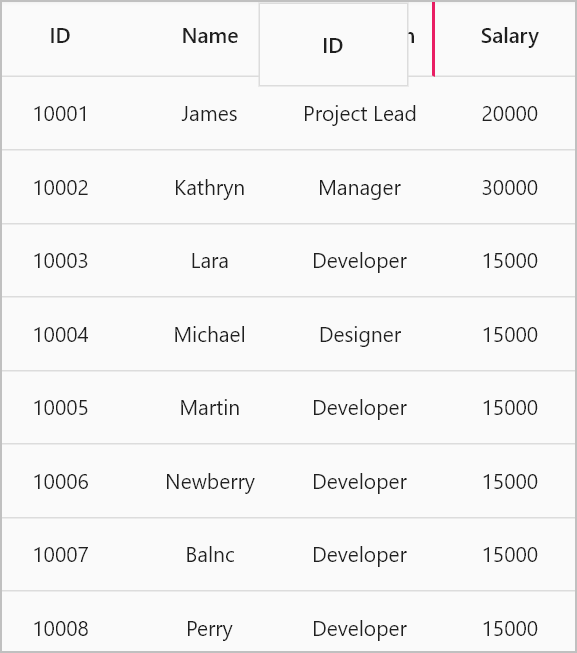

---
layout: post
title: Column drag and drop in Flutter DataGrid | DataTable | Syncfusion
description: Learn all about how to drag and drop the columns in Syncfusion Flutter DataGrid (SfDataGrid) widget and more here.
platform: flutter
control: SfDataGrid
documentation: ug
--- 

# Column drag and drop in Flutter DataGrid (SfDataGrid)

The SfDataGrid enables columns to be dragged and dropped by setting the [SfDataGrid.allowColumnsDragging](https://pub.dev/documentation/syncfusion_flutter_datagrid/latest/datagrid/SfDataGrid/allowColumnsDragging.html) property to `true` and returning `true` from the [SfDataGrid.onColumnDragging](https://pub.dev/documentation/syncfusion_flutter_datagrid/latest/datagrid/SfDataGrid/onColumnDragging.html) callback. During the column-dragging process, a drag feedback widget is displayed. By utilizing the `SfDataGrid.onColumnDragging` callback, you can handle drag and drop operations to reorder columns dynamically.

The DataGrid provides the rearranged index of the dragged column, indicating its new position after being dropped. Inside the `onColumnDragging` callback, you can utilize this index to reorder the columns to the desired position. This allows you to handle the column reordering directly within the callback at the sample level.

## Prerequisites

The following code example demonstrates the basic setup required for column drag and drop functionality:




import 'package:syncfusion_flutter_datagrid/datagrid.dart';
import 'package:flutter/material.dart';

class Employee {
  Employee(this.id, this.name, this.designation, this.salary);
  final int id;
  final String name;
  final String designation;
  final double salary;
  
  dynamic operator  {
    switch (key) {
      case 'id':
        return id;
      case 'name':
        return name;
      case 'designation':
        return designation;
      case 'salary':
        return salary;
      default:
        return '';
    }
  }
}




## Enable column drag and drop

The following code example shows how to enable column drag and drop functionality:


 

late List<GridColumn> columns;
late EmployeeDataSource employeeDataSource;

@override
void initState() {
  super.initState();
  List<Employee> employees = [
    Employee(10001, 'James', 'Project Lead', 20000),
    Employee(10002, 'Kathryn', 'Manager', 30000),
    Employee(10003, 'Lara', 'Developer', 15000),
    Employee(10004, 'Michael', 'Designer', 15000),
  ];
  
  columns = <GridColumn>[
    GridColumn(columnName: 'id', label: const Center(child: Text('ID'))),
    GridColumn(columnName: 'name', label: const Center(child: Text('Name'))),
    GridColumn(columnName: 'designation', label: const Center(child: Text('Designation'))),
    GridColumn(columnName: 'salary', label: const Center(child: Text('Salary'))),
  ];
  
  employeeDataSource = EmployeeDataSource(employees: employees, columns: columns);
}

@override
Widget build(BuildContext context) {
  return Scaffold(
    appBar: AppBar(title: const Text('Syncfusion Flutter DataGrid')),
    body: SfDataGrid(
      source: employeeDataSource,
      allowColumnsDragging: true,
      columns: columns,
      onColumnDragging: (DataGridColumnDragDetails details) {
        if (details.action == DataGridColumnDragAction.dropped &&
            details.to != null &&
            details.from >= 0 &&
            details.from < columns.length) {
          final GridColumn rearrangeColumn = columns[details.from];
          columns.removeAt(details.from);
          columns.insert(details.to!, rearrangeColumn);
          employeeDataSource.buildDataGridRows();
          employeeDataSource.notifyListeners();
        }
        return true;
      },
    ),
  );
}

class EmployeeDataSource extends DataGridSource {
  EmployeeDataSource({required List<Employee> employees, required this.columns}) {
    _employees = employees;
    buildDataGridRows();
  }

  late List<Employee> _employees;
  late List<GridColumn> columns;
  late List<DataGridRow> dataGridRows;

  void buildDataGridRows() {
    dataGridRows = _employees.map<DataGridRow>((employee) {
      return DataGridRow(
        cells: columns.map<DataGridCell>((column) {
          return DataGridCell(
            columnName: column.columnName,
            value: employee[column.columnName],
          );
        }).toList());
    }).toList();
  }

  @override
  List<DataGridRow> get rows => dataGridRows;

  @override
  DataGridRowAdapter? buildRow(DataGridRow row) {
    return DataGridRowAdapter(
      cells: row.getCells().map<Widget>((dataGridCell) {
        return Container(
          alignment: Alignment.center,
          padding: const EdgeInsets.symmetric(horizontal: 8.0),
          child: Text(
            dataGridCell.value.toString(),
          ));
      }).toList());
  }
}




>**NOTE**:  
* To reorder the columns in the DataGrid, create an instance variable to hold the columns and then assign that instance to the [SfDataGrid.columns](https://pub.dev/documentation/syncfusion_flutter_datagrid/latest/datagrid/SfDataGrid/columns.html) property instead of directly assigning a list literal. This allows you to reorder the collection within the callback, maintaining the desired column order.
* After reordering columns, rebuild the rows based on the updated columns collection by calling `buildDataGridRows()` and `notifyListeners()`. This is necessary because the column index may change after reordering. By rebuilding the rows, you ensure that the row data aligns correctly with the reordered columns.
* Download the complete sample application from [GitHub](https://github.com/SyncfusionExamples/how-to-perform-column-drag-and-drop-in-flutter-datatable-sfdatagrid).

## onColumnDragging callback

The [SfDataGrid.onColumnDragging](https://pub.dev/documentation/syncfusion_flutter_datagrid/latest/datagrid/SfDataGrid/onColumnDragging.html) callback is triggered during column drag operations. This callback provides the following properties in the [DataGridColumnDragDetails](https://pub.dev/documentation/syncfusion_flutter_datagrid/latest/datagrid/DataGridColumnDragDetails-class.html):

* [from](https://pub.dev/documentation/syncfusion_flutter_datagrid/latest/datagrid/DataGridColumnDragDetails/from.html): The index of the currently dragging column. Use this to identify which column is being moved.
* [to](https://pub.dev/documentation/syncfusion_flutter_datagrid/latest/datagrid/DataGridColumnDragDetails/to.html): The index where the column will be dropped. This is null during drag updates and populated when the column is dropped.
* [action](https://pub.dev/documentation/syncfusion_flutter_datagrid/latest/datagrid/DataGridColumnDragDetails/action.html): Indicates the drag action as a [DataGridColumnDragAction](https://pub.dev/documentation/syncfusion_flutter_datagrid/latest/datagrid/DataGridColumnDragAction.html) enum. The `update` action fires while dragging, and `dropped` fires when the column is released.
* [offset](https://pub.dev/documentation/syncfusion_flutter_datagrid/latest/datagrid/DataGridColumnDragDetails/offset.html): The current offset of the dragging column during the drag operation. Use this to calculate the drag position if needed.

## Cancel the column dropping for a specific column

You can cancel the column dropping at a specific target column by returning `false` from the [SfDataGrid.onColumnDragging](https://pub.dev/documentation/syncfusion_flutter_datagrid/latest/datagrid/SfDataGrid/onColumnDragging.html) callback. This allows you to prevent columns from being dropped at certain positions or restrict specific columns from being dropped.

In the following example, columns cannot be dropped at index 2 (the third column position):




@override
Widget build(BuildContext context) {
  return Scaffold(
    appBar: AppBar(title: const Text('Syncfusion Flutter DataGrid')),
    body: SfDataGrid(
      source: employeeDataSource,
      allowColumnsDragging: true,
      columns: columns,
      onColumnDragging: (DataGridColumnDragDetails details) {
        // Prevent dropping at column index 2
        if (details.action == DataGridColumnDragAction.update &&
            details.to == 2) {
          return false;
        }
        // Handle the drop action
        if (details.action == DataGridColumnDragAction.dropped &&
            details.to != null &&
            details.from >= 0 &&
            details.from < columns.length) {
          final GridColumn rearrangeColumn = columns[details.from];
          columns.removeAt(details.from);
          columns.insert(details.to!, rearrangeColumn);
          employeeDataSource.buildDataGridRows();
          employeeDataSource.notifyListeners();
        }
        return true;
      },
    ),
  );
}




## Changing the feedback widget

The DataGrid allows you to customize the feedback widget displayed during column dragging by using the [SfDataGrid.columnDragFeedbackBuilder](https://pub.dev/documentation/syncfusion_flutter_datagrid/latest/datagrid/SfDataGrid/columnDragFeedbackBuilder.html) builder. This builder is called during drag operations and allows you to return a custom widget that represents the dragged column.




@override
Widget build(BuildContext context) {
  return Scaffold(
    appBar: AppBar(title: const Text('Syncfusion Flutter DataGrid')),
    body: SfDataGrid(
      source: employeeDataSource,
      allowColumnsDragging: true,
      columns: columns,
      columnDragFeedbackBuilder: (BuildContext context, GridColumn column) {
        return Container(
          height: 50,
          width: column.actualWidth,
          color: Colors.grey,
          child: const Center(
            child: DefaultTextStyle(
              style: TextStyle(
                fontSize: 14,
                color: Colors.pink,
                fontWeight: FontWeight.bold),
              child: Text('Drag View'),
            ),
          ),
        );
      },
      onColumnDragging: (DataGridColumnDragDetails details) {
        if (details.action == DataGridColumnDragAction.dropped &&
            details.to != null &&
            details.from >= 0 &&
            details.from < columns.length) {
          final GridColumn rearrangeColumn = columns[details.from];
          columns.removeAt(details.from);
          columns.insert(details.to!, rearrangeColumn);
          employeeDataSource.buildDataGridRows();
          employeeDataSource.notifyListeners();
        }
        return true;
      },
    ),
  );
}




## Drag indicator customization

The color and thickness of the drag indicator displayed during column dragging can be customized using the [SfDataGridThemeData.columnDragIndicatorColor](https://pub.dev/documentation/syncfusion_flutter_core/latest/theme/SfDataGridThemeData/columnDragIndicatorColor.html) and [SfDataGridThemeData.columnDragIndicatorStrokeWidth](https://pub.dev/documentation/syncfusion_flutter_core/latest/theme/SfDataGridThemeData/columnDragIndicatorStrokeWidth.html) properties. These properties are available in the `syncfusion_flutter_core` package through the [SfDataGridTheme](https://pub.dev/documentation/syncfusion_flutter_core/latest/theme/SfDataGridTheme-class.html) widget.

>**NOTE**: 
* The `SfDataGridThemeData` and `SfDataGridTheme` classes are available in the `syncfusion_flutter_core` package.
* Import the theme package: `import 'package:syncfusion_flutter_core/theme.dart';`

The following code demonstrates how to customize the drag indicator appearance:




import 'package:syncfusion_flutter_core/theme.dart';

@override
Widget build(BuildContext context) {
  return Scaffold(
    appBar: AppBar(title: const Text('Syncfusion Flutter DataGrid')),
    body: SfDataGridTheme(
      data: SfDataGridThemeData(
        columnDragIndicatorColor: Colors.pink,
        columnDragIndicatorStrokeWidth: 3,
      ),
      child: SfDataGrid(
        source: employeeDataSource,
        allowColumnsDragging: true,
        columns: columns,
        onColumnDragging: (DataGridColumnDragDetails details) {
          if (details.action == DataGridColumnDragAction.dropped &&
              details.to != null &&
              details.from >= 0 &&
              details.from < columns.length) {
            final GridColumn rearrangeColumn = columns[details.from];
            columns.removeAt(details.from);
            columns.insert(details.to!, rearrangeColumn);
            employeeDataSource.buildDataGridRows();
            employeeDataSource.notifyListeners();
          }
          return true;
        },
      ),
    ),
  );
}




