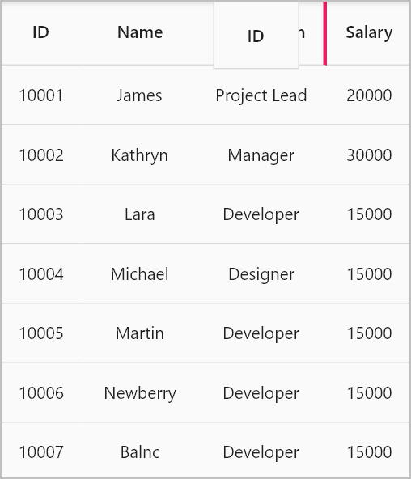

---
layout: post
title: Column drag and drop in Flutter DataGrid | DataTable | Syncfusion
description: Learn all about how to drag and drop the columns in Syncfusion Flutter DataGrid (SfDataGrid) widget and more here.
platform: flutter
control: SfDataGrid
documentation: ug
--- 

# Column drag and drop in Flutter DataGrid (SfDataGrid)

The SfDataGrid allows column header dragging and dropping by setting the [SfDataGrid.allowColumnsDragging](https://pub.dev/documentation/syncfusion_flutter_datagrid/latest/datagrid/SfDataGrid/allowColumnsDragging.html) property to `true` and returning `true` from the [SfDataGrid.onColumnDragging](https://pub.dev/documentation/syncfusion_flutter_datagrid/latest/datagrid/SfDataGrid/onColumnDragging.html) callback. During the column-dragging process, a drag feedback widget is displayed. By utilizing the `SfDataGrid.onColumnDragging` event, you can handle drag and drop operations according to your requirements.

The DataGrid provides the rearranged index of the dragged column, indicating its new position after being dropped. Inside the `onColumnDragging` callback, you can utilize this index to reorder the columns according to the desired position. This allows you to handle the column reordering directly within the callback at the sample level.


 

  @override
  Widget build(BuildContext context) {
    return Scaffold(
      appBar: AppBar(title: const Text('Syncfusion Flutter DataGrid')),
      body: SfDataGrid(
        source: employeeDataSource,
        allowColumnsDragging: true,
        columns: columns,
        onColumnDragging: (DataGridColumnDragDetails details) {
          if (details.action == DataGridColumnDragAction.dropped &&
              details.to != null) {
            final GridColumn rearrangeColumn = columns[details.from];
            columns.removeAt(details.from);
            columns.insert(details.to!, rearrangeColumn);
            employeeDataSource.buildDataGridRows();
            employeeDataSource.refreshDataGrid();
          }
          return true;
        },
      ),
    );
  }

class EmployeeDataSource extends DataGridSource {
  EmployeeDataSource({required this.employees, required this.columns}) {
    buildDataGridRows();
  }

  void buildDataGridRows() {
    dataGridRows = employees.map<DataGridRow>((employee) {
      return DataGridRow(
        cells: columns.map<DataGridCell>((column) {
          return DataGridCell(
            columnName: column.columnName,
            value: employee[column.columnName],
          );
        }).toList());
    }).toList();
  }

  List<Employee> employees = [];
  List<GridColumn> columns = [];
  List<DataGridRow> dataGridRows = [];

  @override
  List<DataGridRow> get rows => dataGridRows;

  @override
  DataGridRowAdapter? buildRow(DataGridRow row) {
    return DataGridRowAdapter(
      cells: row.getCells().map((dataGridCell) {
        return Container(
          alignment: Alignment.center,
          padding: const EdgeInsets.symmetric(horizontal: 8.0),
          child: Text(
            dataGridCell.value.toString(),
          ));
      }).toList());
  }

  refreshDataGrid() {
    notifyListeners();
  }
}




>**NOTE**:  
* You can download the demo application from [GitHub](https://github.com/SyncfusionExamples/how-to-perform-column-drag-and-drop-in-flutter-datatable-sfdatagrid).
* To reorder the columns in the DataGrid, you should create an instance to hold the columns and then assign that instance to 
the [SfDataGrid.columns](https://pub.dev/documentation/syncfusion_flutter_datagrid/latest/datagrid/SfDataGrid/columns.html) property instead of directly assigning the list of GridColumn. This allows you to reorder the collection within the callback, maintaining the desired column order.
* Additionally, it is important to build the rows based on the columns collection after reordering. This is necessary because
the column index may change after the columns have been rearranged. By rebuilding the rows based on the updated columns collection, you ensure that the row data aligns correctly with the reordered columns.

## onColumnDragging callback

The `SfDataGrid.onColumnDragging` callback is triggered when the column drags. This callback provides the following properties in the [DataGridColumnDragDetails](https://pub.dev/documentation/syncfusion_flutter_datagrid/latest/datagrid/DataGridColumnDragDetails-class.html).

* [from](https://pub.dev/documentation/syncfusion_flutter_datagrid/latest/datagrid/DataGridColumnDragDetails/from.html): Returns index of the currently dragging column.
* [to](https://pub.dev/documentation/syncfusion_flutter_datagrid/latest/datagrid/DataGridColumnDragDetails/to.html): Returns index of the column after being dropped.
* [action](https://pub.dev/documentation/syncfusion_flutter_datagrid/latest/datagrid/DataGridColumnDragDetails/action.html): Returns the column dragging details as the [DataGridColumnDragAction](https://pub.dev/documentation/syncfusion_flutter_datagrid/latest/datagrid/DataGridColumnDragAction.html) enum.
* [offset](https://pub.dev/documentation/syncfusion_flutter_datagrid/latest/datagrid/DataGridColumnDragDetails/offset.html): Returns the current offset of the dragging column.

## Cancel the column dropping for a specific column

You can cancel the column dropping at a specific column by returning `false` from the `SfDataGrid.onColumnDragging` callback. This allows you to restrict the column dropping for a specific column.




  @override
  Widget build(BuildContext context) {
    return Scaffold(
      appBar: AppBar(title: const Text('Syncfusion Flutter DataGrid')),
      body: SfDataGrid(
        source: employeeDataSource,
        allowColumnsDragging: true,
        columns: columns,
        onColumnDragging: (DataGridColumnDragDetails details) {
          if (details.action == DataGridColumnDragAction.update &&
              details.to == 2) {
            return false;
          }
          if (details.action == DataGridColumnDragAction.dropped &&
              details.to != null) {
            final GridColumn rearrangeColumn = columns[details.from];
            columns.removeAt(details.from);
            columns.insert(details.to!, rearrangeColumn);
            employeeDataSource.buildDataGridRows();
            employeeDataSource.refreshDataGrid();
          }
          return true;
        },
      ),
    );
  }




## Changing the feedback widget

The DataGrid allows you to change the drag feedback widget by returning a custom widget from the [SfDataGrid.columnDragFeedbackBuilder](https://pub.dev/documentation/syncfusion_flutter_datagrid/latest/datagrid/SfDataGrid/columnDragFeedbackBuilder.html) builder. This allows you to change the drag feedback widget according to your requirements.




  @override
  Widget build(BuildContext context) {
    return Scaffold(
      appBar: AppBar(title: const Text('Syncfusion Flutter DataGrid')),
      body: SfDataGrid(
        source: employeeDataSource,
        allowColumnsDragging: true,
        columns: columns,
        columnDragFeedbackBuilder: (context, column) {
          return Container(
            height: 50,
            width: column.actualWidth,
            color: Colors.grey,
            child: const Center(
              child: DefaultTextStyle(
                style: TextStyle(
                  fontSize: 14,
                  color: Colors.pink,
                  fontWeight: FontWeight.bold),
                child: Text('Drag View'),
              ),
            ),
          );
        },
        onColumnDragging: (DataGridColumnDragDetails details) {
          if (details.action == DataGridColumnDragAction.dropped &&
              details.to != null) {
            final GridColumn rearrangeColumn = columns[details.from];
            columns.removeAt(details.from);
            columns.insert(details.to!, rearrangeColumn);
            employeeDataSource.buildDataGridRows();
            employeeDataSource.refreshDataGrid();
          }
          return true;
        },
      ),
    );
  }




## Drag indicator customization

The color and thickness of the drag indicator can be customized by the [SfDataGridThemeData.columnDragIndicatorColor](https://pub.dev/documentation/syncfusion_flutter_core/latest/theme/SfDataGridThemeData/columnDragIndicatorColor.html) and [SfDataGridThemeData.columnDragIndicatorStrokeWidth](https://pub.dev/documentation/syncfusion_flutter_core/latest/theme/SfDataGridThemeData/columnDragIndicatorStrokeWidth.html) properties.

The `SfDataGridThemeData` and `SfDataGridTheme` classes are available in the `syncfusion_flutter_core` package. So, import the following file.




import 'package:syncfusion_flutter_core/theme.dart';




The following code describes how to change the drag indicator color and thickness by using [SfDataGridTheme](https://pub.dev/documentation/syncfusion_flutter_core/latest/theme/SfDataGridTheme-class.html). 


 

  @override
  Widget build(BuildContext context) {
    return Scaffold(
      appBar: AppBar(title: const Text('Syncfusion Flutter DataGrid')),
      body: SfDataGridTheme(
        data: SfDataGridThemeData(
          columnDragIndicatorColor: Colors.pink,
          columnDragIndicatorStrokeWidth: 3),
        child: SfDataGrid(
          source: employeeDataSource,
          allowColumnsDragging: true,
          columns: columns,
          onColumnDragging: (DataGridColumnDragDetails details) {
            if (details.action == DataGridColumnDragAction.dropped &&
                details.to != null) {
              final GridColumn rearrangeColumn = columns[details.from];
              columns.removeAt(details.from);
              columns.insert(details.to!, rearrangeColumn);
              employeeDataSource.buildDataGridRows();
              employeeDataSource.refreshDataGrid();
            }
            return true;
          },
        ),
      ),
    );
  }




