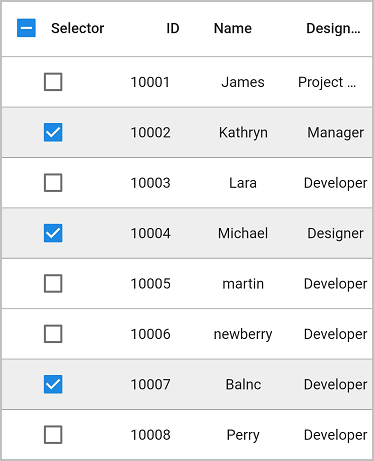
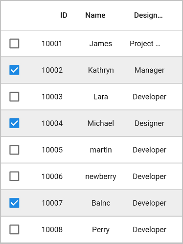
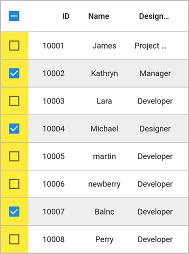
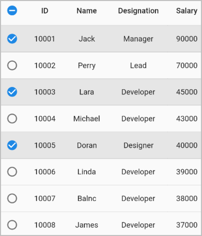

# Column Types in Flutter DataGrid (SfDataGrid)

[SfDataGrid](https://pub.dev/documentation/syncfusion_flutter_datagrid/latest/datagrid/SfDataGrid-class.html) provides support for loading any type of widget in each column.

## GridColumn

GridColumn is a class that provides base functionalities for all the column types in `SfDataGrid`.

### Mapping column to a property

The column can be bound to a property in a data object using the [GridColumn.columnName](https://pub.dev/documentation/syncfusion_flutter_datagrid/latest/datagrid/GridColumn/columnName.html) property. The [label](https://pub.dev/documentation/syncfusion_flutter_datagrid/latest/datagrid/GridColumn/label.html) is used to display the required widget in a column header. 


 
 
@override
Widget build(BuildContext context) {
  return Scaffold(
      body: SfDataGrid(source: _employeeDataSource, columns: <GridColumn>[
    GridColumn(
        columnName: 'id',
        label: Container(
            padding: EdgeInsets.symmetric(horizontal: 16.0),
            alignment: Alignment.centerRight,
            child: Text(
              'ID',
              overflow: TextOverflow.ellipsis,
            ))),
    GridColumn(
        columnName: 'name',
        label: Container(
            padding: EdgeInsets.symmetric(horizontal: 16.0),
            alignment: Alignment.centerLeft,
            child: Text(
              'Name',
              overflow: TextOverflow.ellipsis,
            ))),
    GridColumn(
        columnName: 'designation',
        label: Container(
            padding: EdgeInsets.symmetric(horizontal: 16.0),
            alignment: Alignment.centerLeft,
            child: Text(
              'Designation',
              overflow: TextOverflow.ellipsis,
            ))),
    GridColumn(
        columnName: 'salary',
        label: Container(
            padding: EdgeInsets.symmetric(horizontal: 16.0),
            alignment: Alignment.centerRight,
            child: Text(
              'Salary',
              overflow: TextOverflow.ellipsis,
            )))
  ]));
}




### Hiding a column

[GridColumn.visible](https://pub.dev/documentation/syncfusion_flutter_datagrid/latest/datagrid/GridColumn/visible.html) property can be used to set a column as hidden. The default value of the `visible` property is true.

>**NOTE**  
   Set the `visible` property to `false` instead of setting column width as `0` to hide a column.


 
 
@override
Widget build(BuildContext context) {
  return Scaffold(
      body: SfDataGrid(source: _employeeDataSource, columns: <GridColumn>[
    GridColumn(
        columnName: 'id',
        label: Container(
            padding: EdgeInsets.symmetric(horizontal: 16.0),
            alignment: Alignment.centerRight,
            child: Text(
              'ID',
              overflow: TextOverflow.ellipsis,
            ))),
    GridColumn(
        columnName: 'name',
        label: Container(
            padding: EdgeInsets.symmetric(horizontal: 16.0),
            alignment: Alignment.centerLeft,
            child: Text(
              'Name',
              overflow: TextOverflow.ellipsis,
            ))),
    GridColumn(
        columnName: 'designation',
        visible: false,
        label: Container(
            padding: EdgeInsets.symmetric(horizontal: 16.0),
            alignment: Alignment.centerLeft,
            child: Text(
              'Designation',
              overflow: TextOverflow.ellipsis,
            ))),
    GridColumn(
        columnName: 'salary',
        label: Container(
            padding: EdgeInsets.symmetric(horizontal: 16.0),
            alignment: Alignment.centerRight,
            child: Text(
              'Salary',
              overflow: TextOverflow.ellipsis,
            )))
  ]));
}




### Set manual width for a column

`SfDataGrid` allows you to customize the width of each [GridColumn](https://pub.dev/documentation/syncfusion_flutter_datagrid/latest/datagrid/GridColumn-class.html) in the [SfDataGrid.Columns](https://pub.dev/documentation/syncfusion_flutter_datagrid/latest/datagrid/SfDataGrid/columns.html) collection. To customize column width, use the [GridColumn.width](https://pub.dev/documentation/syncfusion_flutter_datagrid/latest/datagrid/GridColumn/width.html) property. By default, this property will not be assigned any value. The GridColumn renders in view based on the value of the [defaultColumnWidth](https://pub.dev/documentation/syncfusion_flutter_datagrid/latest/datagrid/SfDataGrid/defaultColumnWidth.html) property.

>**NOTE**  
   Set the `visible` property to `false` instead of setting column width as `0` to hide a column.


 
 
@override
Widget build(BuildContext context) {
  return Scaffold(
      body: SfDataGrid(source: _employeeDataSource, columns: <GridColumn>[
    GridColumn(
        columnName: 'id',
        label: Container(
            padding: EdgeInsets.symmetric(horizontal: 16.0),
            alignment: Alignment.centerRight,
            child: Text(
              'ID',
              overflow: TextOverflow.ellipsis,
            ))),
    GridColumn(
        columnName: 'name',
        width: 100.0,
        label: Container(
            padding: EdgeInsets.symmetric(horizontal: 16.0),
            alignment: Alignment.centerLeft,
            child: Text(
              'Name',
              overflow: TextOverflow.ellipsis,
            ))),
    GridColumn(
        columnName: 'designation',
        label: Container(
            padding: EdgeInsets.symmetric(horizontal: 16.0),
            alignment: Alignment.centerLeft,
            child: Text(
              'Designation',
              overflow: TextOverflow.ellipsis,
            ))),
    GridColumn(
        columnName: 'salary',
        label: Container(
            padding: EdgeInsets.symmetric(horizontal: 16.0),
            alignment: Alignment.centerRight,
            child: Text(
              'Salary',
              overflow: TextOverflow.ellipsis,
            )))
  ]));
}




## Checkbox column

By setting the [showCheckboxColumn](https://pub.dev/documentation/syncfusion_flutter_datagrid/latest/datagrid/SfDataGrid/showCheckboxColumn.html) property to `true`, you can select or deselect individual rows using checkboxes in each row. The checkbox column will be added as the first column.

The selection is applied to rows only if you set the [SfDataGrid.selectionMode](https://pub.dev/documentation/syncfusion_flutter_datagrid/latest/datagrid/SfDataGrid/selectionMode.html) property other than `none.`


 
 
@override
Widget build(BuildContext context) {
  return Scaffold(
      body: SfDataGrid(
          source: _employeeDataSource,
          showCheckboxColumn: true,
          selectionMode: SelectionMode.multiple,
          columns: [
        GridColumn(
            columnName: 'id',
            label: Container(
                padding: EdgeInsets.symmetric(horizontal: 16.0),
                alignment: Alignment.centerRight,
                child: Text(
                  'ID',
                  overflow: TextOverflow.ellipsis,
                ))),
        GridColumn(
            columnName: 'name',
            label: Container(
                padding: EdgeInsets.symmetric(horizontal: 16.0),
                alignment: Alignment.centerLeft,
                child: Text(
                  'Name',
                  overflow: TextOverflow.ellipsis,
                ))),
        GridColumn(
            columnName: 'designation',
            label: Container(
                padding: EdgeInsets.symmetric(horizontal: 16.0),
                alignment: Alignment.centerLeft,
                child: Text(
                  'Designation',
                  overflow: TextOverflow.ellipsis,
                ))),
        GridColumn(
            columnName: 'salary',
            label: Container(
                padding: EdgeInsets.symmetric(horizontal: 16.0),
                alignment: Alignment.centerRight,
                child: Text(
                  'Salary',
                  overflow: TextOverflow.ellipsis,
                ))),
      ]));
}




### Show text in the header cell

Display widgets along with the checkbox in the header cell by adding a widget to the [SfDataGrid.checkboxColumnSettings.label](https://pub.dev/documentation/syncfusion_flutter_datagrid/latest/datagrid/DataGridCheckboxColumnSettings/label.html) property.


 
 
@override
Widget build(BuildContext context) {
  return Scaffold(
      body: SfDataGrid(
          source: _employeeDataSource,
          showCheckboxColumn: true,
          checkboxColumnSettings: DataGridCheckboxColumnSettings(
              label: Text('Selector'), width: 100),
          selectionMode: SelectionMode.multiple,
          columns: [
        GridColumn(
            columnName: 'id',
            label: Container(
                padding: EdgeInsets.symmetric(horizontal: 16.0),
                alignment: Alignment.centerRight,
                child: Text(
                  'ID',
                  overflow: TextOverflow.ellipsis,
                ))),
        GridColumn(
            columnName: 'name',
            label: Container(
                padding: EdgeInsets.symmetric(horizontal: 16.0),
                alignment: Alignment.centerLeft,
                child: Text(
                  'Name',
                  overflow: TextOverflow.ellipsis,
                ))),
        GridColumn(
            columnName: 'designation',
            label: Container(
                padding: EdgeInsets.symmetric(horizontal: 16.0),
                alignment: Alignment.centerLeft,
                child: Text(
                  'Designation',
                  overflow: TextOverflow.ellipsis,
                ))),
        GridColumn(
            columnName: 'salary',
            label: Container(
                padding: EdgeInsets.symmetric(horizontal: 16.0),
                alignment: Alignment.centerRight,
                child: Text(
                  'Salary',
                  overflow: TextOverflow.ellipsis,
                ))),
      ]));
}




### Disable the checkbox in the header cell

By default, checkBox gets displayed in the header cell. By disabling the [SfDataGrid.checkboxColumnSettings.showCheckboxOnHeader](https://pub.dev/documentation/syncfusion_flutter_datagrid/latest/datagrid/DataGridCheckboxColumnSettings/showCheckboxOnHeader.html) property, checkBox can be disappeared in the header cell.


 
 
@override
Widget build(BuildContext context) {
  return Scaffold(
      body: SfDataGrid(
          source: _employeeDataSource,
          showCheckboxColumn: true,
          checkboxColumnSettings:
              DataGridCheckboxColumnSettings(showCheckboxOnHeader: false),
          selectionMode: SelectionMode.multiple,
          columns: [
        GridColumn(
            columnName: 'id',
            label: Container(
                padding: EdgeInsets.symmetric(horizontal: 16.0),
                alignment: Alignment.centerRight,
                child: Text(
                  'ID',
                  overflow: TextOverflow.ellipsis,
                ))),
        GridColumn(
            columnName: 'name',
            label: Container(
                padding: EdgeInsets.symmetric(horizontal: 16.0),
                alignment: Alignment.centerLeft,
                child: Text(
                  'Name',
                  overflow: TextOverflow.ellipsis,
                ))),
        GridColumn(
            columnName: 'designation',
            label: Container(
                padding: EdgeInsets.symmetric(horizontal: 16.0),
                alignment: Alignment.centerLeft,
                child: Text(
                  'Designation',
                  overflow: TextOverflow.ellipsis,
                ))),
        GridColumn(
            columnName: 'salary',
            label: Container(
                padding: EdgeInsets.symmetric(horizontal: 16.0),
                alignment: Alignment.centerRight,
                child: Text(
                  'Salary',
                  overflow: TextOverflow.ellipsis,
                ))),
      ]));
}




### Change the background color of the checkbox column

The background color of the checkbox column can be customized by using the [SfDataGrid.checkboxColumnSettings.backgroundColor](https://pub.dev/documentation/syncfusion_flutter_datagrid/latest/datagrid/DataGridCheckboxColumnSettings/backgroundColor.html) property.


 
 
@override
Widget build(BuildContext context) {
  return Scaffold(
      body: SfDataGrid(
          source: _employeeDataSource,
          showCheckboxColumn: true,
          checkboxColumnSettings:
              DataGridCheckboxColumnSettings(backgroundColor: Colors.yellow),
          selectionMode: SelectionMode.multiple,
          columns: [
        GridColumn(
            columnName: 'id',
            label: Container(
                padding: EdgeInsets.symmetric(horizontal: 16.0),
                alignment: Alignment.centerRight,
                child: Text(
                  'ID',
                  overflow: TextOverflow.ellipsis,
                ))),
        GridColumn(
            columnName: 'name',
            label: Container(
                padding: EdgeInsets.symmetric(horizontal: 16.0),
                alignment: Alignment.centerLeft,
                child: Text(
                  'Name',
                  overflow: TextOverflow.ellipsis,
                ))),
        GridColumn(
            columnName: 'designation',
            label: Container(
                padding: EdgeInsets.symmetric(horizontal: 16.0),
                alignment: Alignment.centerLeft,
                child: Text(
                  'Designation',
                  overflow: TextOverflow.ellipsis,
                ))),
        GridColumn(
            columnName: 'salary',
            label: Container(
                padding: EdgeInsets.symmetric(horizontal: 16.0),
                alignment: Alignment.centerRight,
                child: Text(
                  'Salary',
                  overflow: TextOverflow.ellipsis,
                ))),
      ]));
}




### Get checked items

Get the checked items by using the [DataGridController.selectedRows](https://pub.dev/documentation/syncfusion_flutter_datagrid/latest/datagrid/DataGridController/selectedRows.html) property because the selection and checkbox's checked states are the same.




final DataGridController _dataGridController = DataGridController();

@override
Widget build(BuildContext context) {
  return Scaffold(
      body: Column(children: [
    TextButton(
        child: Text('Get Checked Items Information'),
        onPressed: () {
          //Index of the checked item
          var _selectedIndex = _dataGridController.selectedIndex;

          //CheckedRow
          var _selectedRow = _dataGridController.selectedRow;

          //Collection of checkedRows
          var _selectedRows = _dataGridController.selectedRows;

          print(_selectedIndex);
          print(_selectedRow);
          print(_selectedRows);
        }),
    Expanded(
        child: SfDataGrid(
            source: _employeeDataSource,
            showCheckboxColumn: true,
            controller: _dataGridController,
            selectionMode: SelectionMode.multiple,
            columns: [
          GridColumn(
              columnName: 'id',
              label: Container(
                  padding: EdgeInsets.symmetric(horizontal: 16.0),
                  alignment: Alignment.centerRight,
                  child: Text(
                    'ID',
                    overflow: TextOverflow.ellipsis,
                  ))),
          GridColumn(
              columnName: 'name',
              label: Container(
                  padding: EdgeInsets.symmetric(horizontal: 16.0),
                  alignment: Alignment.centerLeft,
                  child: Text(
                    'Name',
                    overflow: TextOverflow.ellipsis,
                  ))),
          GridColumn(
              columnName: 'designation',
              label: Container(
                  padding: EdgeInsets.symmetric(horizontal: 16.0),
                  alignment: Alignment.centerLeft,
                  child: Text(
                    'Designation',
                    overflow: TextOverflow.ellipsis,
                  ))),
          GridColumn(
              columnName: 'salary',
              label: Container(
                  padding: EdgeInsets.symmetric(horizontal: 16.0),
                  alignment: Alignment.centerRight,
                  child: Text(
                    'Salary',
                    overflow: TextOverflow.ellipsis,
                  ))),
        ]))
  ]));
}




### Change the shape of the checkbox column

By default, the checkbox shows in the DataGrid as a square shape. Change the checkbox shape by setting the required shape in the [SfDataGrid.checkboxShape](https://pub.dev/documentation/syncfusion_flutter_datagrid/latest/datagrid/SfDataGrid/checkboxShape.html) property.


 
 
@override
Widget build(BuildContext context) {
  return Scaffold(
    appBar: AppBar(title: const Text('Syncfusion Flutter DataGrid')),
    body: SfDataGrid(
      source: employeeDataSource,
      showCheckboxColumn: true,
      checkboxShape: CircleBorder(),
      selectionMode: SelectionMode.multiple,
      columns: [
        GridColumn(
            columnName: 'ID',
            label: Container(
                padding: EdgeInsets.symmetric(horizontal: 8.0),
                alignment: Alignment.center,
                  child: Text('ID'))),
        GridColumn(
            columnName: 'Name',
            label: Container(
                padding: EdgeInsets.symmetric(horizontal: 8.0),
                alignment: Alignment.center,
                child: Text('Name'))),
        GridColumn(
            columnName: 'Designation',
            label: Container(
                padding: EdgeInsets.symmetric(horizontal: 8.0),
                alignment: Alignment.center,
                child: Text('Designation'))),
        GridColumn(
            columnName: 'Salary',
            label: Container(
                padding: EdgeInsets.symmetric(horizontal: 8.0),
                alignment: Alignment.center,
                child: Text('Salary')))
      ],
    ),
  );
}




### Callbacks

The `SfDataGrid` provides the following callback for checkbox interactions:

* [onCheckboxValueChanged]() : This callback is triggered when the checkbox is selected or deselected, either by tapping on the checkbox or by selecting or deselecting a row (i.e., when the value of the checkbox changes).

The checkbox callbacks provide the following properties in their arguments:

* [value]() : Represents the current state of the checkbox.
* [row]() : Refers to the DataGridRow linked to the checkbox in the checkbox column. If the checkbox is part of a column header, the value will be null, indicating that it is not linked to any specific data row.
* [rowType]() : Defines the type of row associated with the checkbox. It indicates whether the checkbox value in a data row or header row has been modified.


 
 
@override  
Widget build(BuildContext context) {  
  return Scaffold(  
    appBar: AppBar(title: const Text('Syncfusion Flutter DataGrid')),  
    body: SfDataGrid(  
      source: employeeDataSource,  
      showCheckboxColumn: true,  
      onCheckboxValueChanged: (details) {  
        print(details);  
      },  
      selectionMode: SelectionMode.multiple,  
      columns: [  
        GridColumn(  
          columnName: 'ID',  
          label: Container(  
            padding: const EdgeInsets.symmetric(horizontal: 8.0),  
            alignment: Alignment.center,  
            child: const Text('ID'),  
          ),  
        ),  
        GridColumn(  
          columnName: 'Name',  
          label: Container(  
            padding: const EdgeInsets.symmetric(horizontal: 8.0),  
            alignment: Alignment.center,  
            child: const Text('Name'),  
          ),  
        ),  
        GridColumn(  
          columnName: 'Designation',  
          label: Container(  
            padding: const EdgeInsets.symmetric(horizontal: 8.0),  
            alignment: Alignment.center,  
            child: const Text('Designation'),  
          ),  
        ),  
        GridColumn(  
          columnName: 'Salary',  
          label: Container(  
            padding: const EdgeInsets.symmetric(horizontal: 8.0),  
            alignment: Alignment.center,  
            child: const Text('Salary'),  
          ),  
        ),  
      ],  
    ),  
  );  
}




### Limitations

The following are the limitations of GridCheckboxColumn:

* The checkbox column does not support data operations such as sorting.
* The checkbox column does not support adding the stacked headers along with other columns.
* The checkbox column will be excluded in exporting operations.

## Show the column header icons on hover

To display column header icons, such as sort and filter icons, when the mouse hovers over a column header, set the [SfDataGrid.showColumnHeaderIconOnHover](https://pub.dev/documentation/syncfusion_flutter_datagrid/latest/datagrid/SfDataGrid/showColumnHeaderIconOnHover.html) property to true. This feature is available only on web and desktop platforms.


 

@override
Widget build(BuildContext context) {
  return Scaffold(
    appBar: AppBar(
      title: const Text('Syncfusion Flutter DataGrid'),
    ),
    body: SfDataGrid(
      source: employeeDataSource,
      allowSorting: true,
      allowFiltering: true,
      showColumnHeaderIconOnHover: true,
      columnWidthMode: ColumnWidthMode.fill,
      columns: <GridColumn>[
        GridColumn(
            columnName: 'id',
            label: Container(
                padding: EdgeInsets.all(16.0),
                alignment: Alignment.centerRight,
                child: Text(
                  'ID',
                ))),
        GridColumn(
            columnName: 'name',
            label: Container(
                padding: EdgeInsets.all(8.0),
                alignment: Alignment.centerLeft,
                child: Text('Name'))),
        GridColumn(
            columnName: 'company',
            label: Container(
                padding: EdgeInsets.all(8.0),
                alignment: Alignment.center,
                child: Text(
                  'Company',
                  overflow: TextOverflow.ellipsis,
                ))),
        GridColumn(
            columnName: 'city',
            label: Container(
                padding: EdgeInsets.all(8.0),
                alignment: Alignment.center,
                child: Text('City'))),
        GridColumn(
            columnName: 'country',
            label: Container(
                padding: EdgeInsets.all(8.0),
                alignment: Alignment.center,
                child: Text('Country'))),
      ],
    ),
  );
}
  



