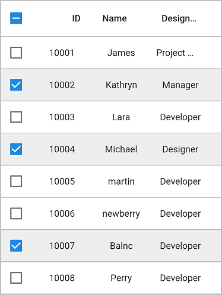

# Column Types in Flutter DataGrid (SfDataGrid)

[SfDataGrid](https://pub.dev/documentation/syncfusion_flutter_datagrid/latest/datagrid/SfDataGrid-class.html) provides support for load any type of widget in each column.

## GridColumn

GridColumn is a class that provides base functionalities for all the column types in `SfDataGrid`.

### Mapping column to a property

Column can be bound to a property in data object using [GridColumn.columnName](https://pub.dev/documentation/syncfusion_flutter_datagrid/latest/datagrid/GridColumn/columnName.html) property. [label](https://pub.dev/documentation/syncfusion_flutter_datagrid/latest/datagrid/GridColumn/label.html) is used to display the required widget in a column header. 


 
 
@override
Widget build(BuildContext context) {
  return Scaffold(
      body: SfDataGrid(source: _employeeDataSource, columns: <GridColumn>[
    GridColumn(
        columnName: 'id',
        label: Container(
            padding: EdgeInsets.symmetric(horizontal: 16.0),
            alignment: Alignment.centerRight,
            child: Text(
              'ID',
              overflow: TextOverflow.ellipsis,
            ))),
    GridColumn(
        columnName: 'name',
        label: Container(
            padding: EdgeInsets.symmetric(horizontal: 16.0),
            alignment: Alignment.centerLeft,
            child: Text(
              'Name',
              overflow: TextOverflow.ellipsis,
            ))),
    GridColumn(
        columnName: 'designation',
        label: Container(
            padding: EdgeInsets.symmetric(horizontal: 16.0),
            alignment: Alignment.centerLeft,
            child: Text(
              'Designation',
              overflow: TextOverflow.ellipsis,
            ))),
    GridColumn(
        columnName: 'salary',
        label: Container(
            padding: EdgeInsets.symmetric(horizontal: 16.0),
            alignment: Alignment.centerRight,
            child: Text(
              'Salary',
              overflow: TextOverflow.ellipsis,
            )))
  ]));
}




### Hiding a column

[GridColumn.visible](https://pub.dev/documentation/syncfusion_flutter_datagrid/latest/datagrid/GridColumn/visible.html) property can be used to set a column as hidden. The default value of the `visible` property is true.

>**NOTE**  
   Set the `visible` property to `false` instead of setting column width as `0` to hide a column.


 
 
@override
Widget build(BuildContext context) {
  return Scaffold(
      body: SfDataGrid(source: _employeeDataSource, columns: <GridColumn>[
    GridColumn(
        columnName: 'id',
        label: Container(
            padding: EdgeInsets.symmetric(horizontal: 16.0),
            alignment: Alignment.centerRight,
            child: Text(
              'ID',
              overflow: TextOverflow.ellipsis,
            ))),
    GridColumn(
        columnName: 'name',
        label: Container(
            padding: EdgeInsets.symmetric(horizontal: 16.0),
            alignment: Alignment.centerLeft,
            child: Text(
              'Name',
              overflow: TextOverflow.ellipsis,
            ))),
    GridColumn(
        columnName: 'designation',
        visible: false,
        label: Container(
            padding: EdgeInsets.symmetric(horizontal: 16.0),
            alignment: Alignment.centerLeft,
            child: Text(
              'Designation',
              overflow: TextOverflow.ellipsis,
            ))),
    GridColumn(
        columnName: 'salary',
        label: Container(
            padding: EdgeInsets.symmetric(horizontal: 16.0),
            alignment: Alignment.centerRight,
            child: Text(
              'Salary',
              overflow: TextOverflow.ellipsis,
            )))
  ]));
}




### Set manual width for column

`SfDataGrid` allows you to customize the width of each [GridColumn](https://pub.dev/documentation/syncfusion_flutter_datagrid/latest/datagrid/GridColumn-class.html) in the [SfDataGrid.Columns](https://pub.dev/documentation/syncfusion_flutter_datagrid/latest/datagrid/SfDataGrid/columns.html) collection. To customize column width, use the [GridColumn.width](https://pub.dev/documentation/syncfusion_flutter_datagrid/latest/datagrid/GridColumn/width.html) property. By default, this property will not be assigned any value. The GridColumn renders in view based on the value of the [defaultColumnWidth](https://pub.dev/documentation/syncfusion_flutter_datagrid/latest/datagrid/SfDataGrid/defaultColumnWidth.html) property.

>**NOTE**  
   Set the `visible` property to `false` instead of setting column width as `0` to hide a column.


 
 
@override
Widget build(BuildContext context) {
  return Scaffold(
      body: SfDataGrid(source: _employeeDataSource, columns: <GridColumn>[
    GridColumn(
        columnName: 'id',
        label: Container(
            padding: EdgeInsets.symmetric(horizontal: 16.0),
            alignment: Alignment.centerRight,
            child: Text(
              'ID',
              overflow: TextOverflow.ellipsis,
            ))),
    GridColumn(
        columnName: 'name',
        width: 100.0,
        label: Container(
            padding: EdgeInsets.symmetric(horizontal: 16.0),
            alignment: Alignment.centerLeft,
            child: Text(
              'Name',
              overflow: TextOverflow.ellipsis,
            ))),
    GridColumn(
        columnName: 'designation',
        label: Container(
            padding: EdgeInsets.symmetric(horizontal: 16.0),
            alignment: Alignment.centerLeft,
            child: Text(
              'Designation',
              overflow: TextOverflow.ellipsis,
            ))),
    GridColumn(
        columnName: 'salary',
        label: Container(
            padding: EdgeInsets.symmetric(horizontal: 16.0),
            alignment: Alignment.centerRight,
            child: Text(
              'Salary',
              overflow: TextOverflow.ellipsis,
            )))
  ]));
}




### Checkbox column

SfDataGrid allows you to select or deselect individual rows through `checkbox` by setting `showCheckboxColumn` property to `true`. Selection in checkbox column works based on the `SelectionMode`. 

You can change the appearance of the checkbox column by using the `checkboxColumnSettings` property. `DataGridCheckboxColumnSettings` holds the following properties.

  * `showCheckboxOnHeader`: Decides to enable or disable checkbox on header.
  * `label`: Allows to add widget in the header checkbox column.
  * `width`: Defines width for the checkbox column.
  * `backgroundColor`: Allows to apply background color for the checkbox column.


 
 
@override
Widget build(BuildContext context) {
  return Scaffold(
      body: SfDataGrid(
          source: _employeeDataSource,
          showCheckboxColumn: true,
          selectionMode: SelectionMode.multiple,
          columns: [
        GridColumn(
            columnName: 'id',
            label: Container(
                padding: EdgeInsets.symmetric(horizontal: 16.0),
                alignment: Alignment.centerRight,
                child: Text(
                  'ID',
                  overflow: TextOverflow.ellipsis,
                ))),
        GridColumn(
            columnName: 'name',
            label: Container(
                padding: EdgeInsets.symmetric(horizontal: 16.0),
                alignment: Alignment.centerLeft,
                child: Text(
                  'Name',
                  overflow: TextOverflow.ellipsis,
                ))),
        GridColumn(
            columnName: 'designation',
            label: Container(
                padding: EdgeInsets.symmetric(horizontal: 16.0),
                alignment: Alignment.centerLeft,
                child: Text(
                  'Designation',
                  overflow: TextOverflow.ellipsis,
                ))),
        GridColumn(
            columnName: 'salary',
            label: Container(
                padding: EdgeInsets.symmetric(horizontal: 16.0),
                alignment: Alignment.centerRight,
                child: Text(
                  'Salary',
                  overflow: TextOverflow.ellipsis,
                ))),
      ]));
}




Checkbox in the header cell supports three checked states, when the `SelectionMode` is `multiple`. The states are checked, unchecked and intermediate. You can change the header checkbox state and all the grid checkboxes state by tapping the checkBox in header.

When the `SelectionMode` is `single` or `singleDeselect`, selection gets disabled in the header checkbox. But the header checkbox state has been changed to `intermediate`, if a row is selected.

#### Show text in header cell

You can display widgets along with the checkbox in the header cell. This can be achieved by adding widget to the `label` property.


 
 
@override
Widget build(BuildContext context) {
  return Scaffold(
      body: SfDataGrid(
          source: _employeeDataSource,
          showCheckboxColumn: true,
          checkboxColumnSettings: DataGridCheckboxColumnSettings(
              label: Text('Selector'), width: 100),
          selectionMode: SelectionMode.multiple,
          columns: [
        GridColumn(
            columnName: 'id',
            label: Container(
                padding: EdgeInsets.symmetric(horizontal: 16.0),
                alignment: Alignment.centerRight,
                child: Text(
                  'ID',
                  overflow: TextOverflow.ellipsis,
                ))),
        GridColumn(
            columnName: 'name',
            label: Container(
                padding: EdgeInsets.symmetric(horizontal: 16.0),
                alignment: Alignment.centerLeft,
                child: Text(
                  'Name',
                  overflow: TextOverflow.ellipsis,
                ))),
        GridColumn(
            columnName: 'designation',
            label: Container(
                padding: EdgeInsets.symmetric(horizontal: 16.0),
                alignment: Alignment.centerLeft,
                child: Text(
                  'Designation',
                  overflow: TextOverflow.ellipsis,
                ))),
        GridColumn(
            columnName: 'salary',
            label: Container(
                padding: EdgeInsets.symmetric(horizontal: 16.0),
                alignment: Alignment.centerRight,
                child: Text(
                  'Salary',
                  overflow: TextOverflow.ellipsis,
                ))),
      ]));
}




#### Disable the checkbox in header cell

By default, checkBox gets displayed in header cell. By disabling the `showCheckboxOnHeader` property, checkBox can be disappeared in header cell of GridCheckBoxColumn.


 
 
@override
Widget build(BuildContext context) {
  return Scaffold(
      body: SfDataGrid(
          source: _employeeDataSource,
          showCheckboxColumn: true,
          checkboxColumnSettings:
              DataGridCheckboxColumnSettings(showCheckboxOnHeader: false),
          selectionMode: SelectionMode.multiple,
          columns: [
        GridColumn(
            columnName: 'id',
            label: Container(
                padding: EdgeInsets.symmetric(horizontal: 16.0),
                alignment: Alignment.centerRight,
                child: Text(
                  'ID',
                  overflow: TextOverflow.ellipsis,
                ))),
        GridColumn(
            columnName: 'name',
            label: Container(
                padding: EdgeInsets.symmetric(horizontal: 16.0),
                alignment: Alignment.centerLeft,
                child: Text(
                  'Name',
                  overflow: TextOverflow.ellipsis,
                ))),
        GridColumn(
            columnName: 'designation',
            label: Container(
                padding: EdgeInsets.symmetric(horizontal: 16.0),
                alignment: Alignment.centerLeft,
                child: Text(
                  'Designation',
                  overflow: TextOverflow.ellipsis,
                ))),
        GridColumn(
            columnName: 'salary',
            label: Container(
                padding: EdgeInsets.symmetric(horizontal: 16.0),
                alignment: Alignment.centerRight,
                child: Text(
                  'Salary',
                  overflow: TextOverflow.ellipsis,
                ))),
      ]));
}




#### Change the background color of checkbox column

The background color of the checkbox column can be customized by using `backgroundColor` property in `DataGridCheckboxColumnSettings`.


 
 
@override
Widget build(BuildContext context) {
  return Scaffold(
      body: SfDataGrid(
          source: _employeeDataSource,
          showCheckboxColumn: true,
          checkboxColumnSettings:
              DataGridCheckboxColumnSettings(backgroundColor: Colors.yellow),
          selectionMode: SelectionMode.multiple,
          columns: [
        GridColumn(
            columnName: 'id',
            label: Container(
                padding: EdgeInsets.symmetric(horizontal: 16.0),
                alignment: Alignment.centerRight,
                child: Text(
                  'ID',
                  overflow: TextOverflow.ellipsis,
                ))),
        GridColumn(
            columnName: 'name',
            label: Container(
                padding: EdgeInsets.symmetric(horizontal: 16.0),
                alignment: Alignment.centerLeft,
                child: Text(
                  'Name',
                  overflow: TextOverflow.ellipsis,
                ))),
        GridColumn(
            columnName: 'designation',
            label: Container(
                padding: EdgeInsets.symmetric(horizontal: 16.0),
                alignment: Alignment.centerLeft,
                child: Text(
                  'Designation',
                  overflow: TextOverflow.ellipsis,
                ))),
        GridColumn(
            columnName: 'salary',
            label: Container(
                padding: EdgeInsets.symmetric(horizontal: 16.0),
                alignment: Alignment.centerRight,
                child: Text(
                  'Salary',
                  overflow: TextOverflow.ellipsis,
                ))),
      ]));
}




#### Get checked items

You can get the information of checked items by using [controller](https://pub.dev/documentation/syncfusion_flutter_datagrid/latest/datagrid/SfDataGrid/controller.html) property. Create an instance of [DataGridController](https://pub.dev/documentation/syncfusion_flutter_datagrid/latest/datagrid/DataGridController-class.html) and set to controller property. The [selectedRows](https://pub.dev/documentation/syncfusion_flutter_datagrid/latest/datagrid/DataGridController/selectedRows.html) property returns the collection of checked DataGridRows and the [selectedIndex](https://pub.dev/documentation/syncfusion_flutter_datagrid/latest/datagrid/DataGridController/selectedIndex.html) property returns the index of the [selectedRow](https://pub.dev/documentation/syncfusion_flutter_datagrid/latest/datagrid/DataGridController/selectedRow.html) in SfDataGrid. [selectedRow](https://pub.dev/documentation/syncfusion_flutter_datagrid/latest/datagrid/DataGridController/selectedRow.html) denotes the last selected row in multiple selection.




final DataGridController _dataGridController = DataGridController();

@override
Widget build(BuildContext context) {
  return Scaffold(
      body: Column(children: [
    TextButton(
        child: Text('Get Checked Items Information'),
        onPressed: () {
          //Index of the checked item
          var _selectedIndex = _dataGridController.selectedIndex;

          //CheckedRow
          var _selectedRow = _dataGridController.selectedRow;

          //Collection of checkedRows
          var _selectedRows = _dataGridController.selectedRows;

          print(_selectedIndex);
          print(_selectedRow);
          print(_selectedRows);
        }),
    Expanded(
        child: SfDataGrid(
            source: _employeeDataSource,
            showCheckboxColumn: true,
            controller: _dataGridController,
            selectionMode: SelectionMode.multiple,
            columns: [
          GridColumn(
              columnName: 'id',
              label: Container(
                  padding: EdgeInsets.symmetric(horizontal: 16.0),
                  alignment: Alignment.centerRight,
                  child: Text(
                    'ID',
                    overflow: TextOverflow.ellipsis,
                  ))),
          GridColumn(
              columnName: 'name',
              label: Container(
                  padding: EdgeInsets.symmetric(horizontal: 16.0),
                  alignment: Alignment.centerLeft,
                  child: Text(
                    'Name',
                    overflow: TextOverflow.ellipsis,
                  ))),
          GridColumn(
              columnName: 'designation',
              label: Container(
                  padding: EdgeInsets.symmetric(horizontal: 16.0),
                  alignment: Alignment.centerLeft,
                  child: Text(
                    'Designation',
                    overflow: TextOverflow.ellipsis,
                  ))),
          GridColumn(
              columnName: 'salary',
              label: Container(
                  padding: EdgeInsets.symmetric(horizontal: 16.0),
                  alignment: Alignment.centerRight,
                  child: Text(
                    'Salary',
                    overflow: TextOverflow.ellipsis,
                  ))),
        ]))
  ]));
}




#### Limitations

The following are the limitations of GridCheckboxColumn:

* Checkbox column does not support data operations such as sorting.
* Checkbox column does not support cell selection.
* checkbox column does not support to add stacked header.
* Checkbox column will be excluded in exporting operations.