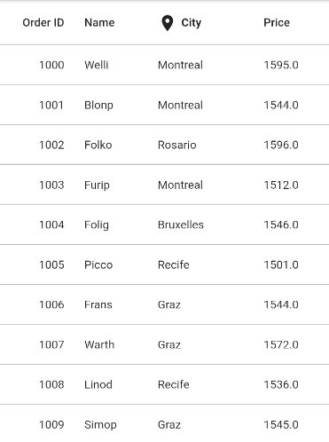
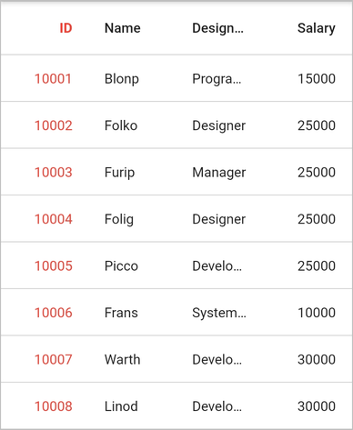
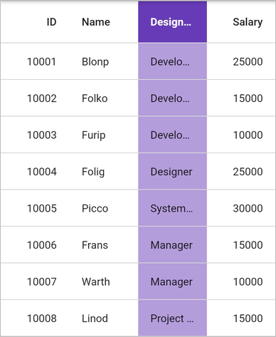
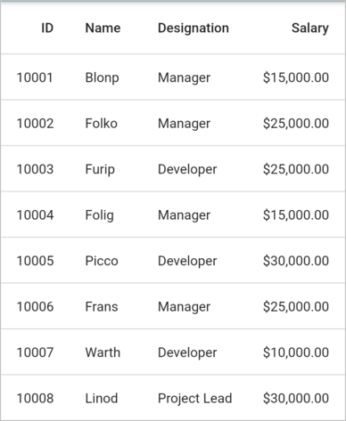
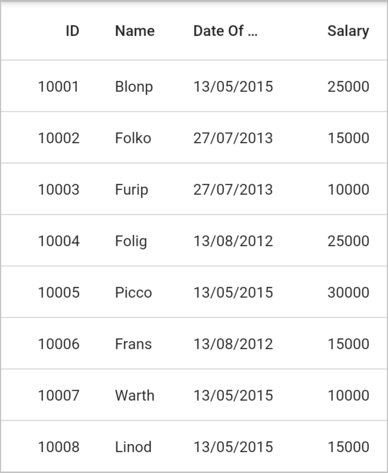
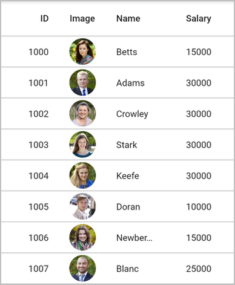

# Column Types in Flutter DataGrid

[SfDataGrid](https://pub.dev/documentation/syncfusion_flutter_datagrid/latest/datagrid/SfDataGrid-class.html) provides support for various built-in column types. Each column has its own properties and renderer to handle different types of data. Based on the requirements, any column can be used.

The following table describes the types of columns and its usage:

| Column Type           | Renderer                        | Description                            |
|-----------------------|---------------------------------|----------------------------------------|
| GridTextColumn        | GridCellTextFieldRenderer       | Use to display the String data         |
| GridNumericColumn     | GridCellNumericTextFieldRenderer| Use to display the Numeric data        |
| GridDateTimeColumn    | GridCellDateTimeRenderer        | Use to display the DateTime value      |
| GridWidgetColumn      | GridCellWidgetRenderer          | Use to display the Widget in each row  |

## GridColumn

GridColumn is a class that provides base functionalities for all the column types in `SfDataGrid`.

### Mapping column to a property

Column can be bound to a property in data object using [GridColumn.mappingName](https://pub.dev/documentation/syncfusion_flutter_datagrid/latest/datagrid/GridColumn/mappingName.html) property. [headerText](https://pub.dev/documentation/syncfusion_flutter_datagrid/latest/datagrid/GridColumn/headerText.html) is used to display the required text in a column header. If the `headerText` is not mentioned, `mappingName` is considered.


 
 
@override
Widget build(BuildContext context) {
  return Scaffold(
    body: SfDataGrid(
      source: _employeeDataSource,
      columns: [
        GridNumericColumn(mappingName: 'id', headerText: 'ID'),
        GridTextColumn(mappingName: 'name', headerText: 'Name'),
        GridTextColumn(mappingName: 'designation', headerText: 'Designation'),
        GridNumericColumn(mappingName: 'salary', headerText: 'Salary'),
      ],
    ),
  );
}




### Set padding for column

[GridColumn.padding](https://pub.dev/documentation/syncfusion_flutter_datagrid/latest/datagrid/GridColumn/padding.html) property can be used to set the padding for the cells in the column. It is also applicable to the column header cell except [GridWidgetColumn](https://pub.dev/documentation/syncfusion_flutter_datagrid/latest/datagrid/GridWidgetColumn-class.html). The default value of padding is 16.0.


 
 
@override
Widget build(BuildContext context) {
  return Scaffold(
    body: SfDataGrid(
      source: _employeeDataSource,
      columns: [
        GridNumericColumn(mappingName: 'id', headerText: 'ID')
          ..padding = EdgeInsets.all(20.0),
        GridTextColumn(mappingName: 'name', headerText: 'Name'),
        GridTextColumn(mappingName: 'designation', headerText: 'Designation'),
        GridNumericColumn(mappingName: 'salary', headerText: 'Salary')
      ],
    ),
  );
}




### Hiding a column

[GridColumn.visible](https://pub.dev/documentation/syncfusion_flutter_datagrid/latest/datagrid/GridColumn/visible.html) property can be used to set a column as hidden. The default value of the `visible` property is true.

>**NOTE**  
   Set the `visible` property to `false` instead of setting column width as `0` to hide a column.


 
 
@override
Widget build(BuildContext context) {
  return Scaffold(
    body: SfDataGrid(
      source: _employeeDataSource,
      columns: [
        GridNumericColumn(mappingName: 'id', headerText: 'ID'),
        GridTextColumn(mappingName: 'name', headerText: 'Name'),
        GridTextColumn(mappingName: 'designation', headerText: 'Designation'),
        GridNumericColumn(mappingName: 'salary', headerText: 'Salary')
          ..visible = false,
      ],
    ),
  );
}




### Set manual width for column

`SfDataGrid` allows you to customize the width of each [GridColumn](https://pub.dev/documentation/syncfusion_flutter_datagrid/latest/datagrid/GridColumn-class.html) in the [SfDataGrid.Columns](https://pub.dev/documentation/syncfusion_flutter_datagrid/latest/datagrid/SfDataGrid/columns.html) collection. To customize column width, use the [GridColumn.width](https://pub.dev/documentation/syncfusion_flutter_datagrid/latest/datagrid/GridColumn/width.html) property. By default, this property will not be assigned any value. The GridColumn renders in view based on the value of the [defaultColumnWidth](https://pub.dev/documentation/syncfusion_flutter_datagrid/latest/datagrid/SfDataGrid/defaultColumnWidth.html) property.

>**NOTE**  
   Set the `visible` property to `false` instead of setting column width as `0` to hide a column.


 
 
@override
Widget build(BuildContext context) {
  return Scaffold(
    body: SfDataGrid(
      source: _employeeDataSource,
      columns: [
        GridNumericColumn(mappingName: 'id', headerText: 'ID'),
        GridTextColumn(mappingName: 'name', headerText: 'Name')
          ..width = 100.0,
        GridTextColumn(mappingName: 'designation', headerText: 'Designation'),
        GridNumericColumn(mappingName: 'salary', headerText: 'Salary')
      ],
    ),
  );
}




### Set alignment for column

[GridColumn.textAlignment](https://pub.dev/documentation/syncfusion_flutter_datagrid/latest/datagrid/GridColumn/textAlignment.html) and [GridColumn.headerTextAlignment](https://pub.dev/documentation/syncfusion_flutter_datagrid/latest/datagrid/GridColumn/headerTextAlignment.html) can be used to customize the alignment for the cells and header cells in the column.


 
 
@override
Widget build(BuildContext context) {
  return Scaffold(
    body: SfDataGrid(
      source: _employeeDataSource,
      columns: [
        GridNumericColumn(mappingName: 'id', headerText: 'ID')
          ..textAlignment = Alignment.center
          ..headerTextAlignment = Alignment.center,
        GridTextColumn(mappingName: 'name', headerText: 'Name'),
        GridTextColumn(mappingName: 'designation', headerText: 'Designation'),
        GridNumericColumn(mappingName: 'salary', headerText: 'Salary')
      ],
    ),
  );
}




### Set text wrapping for column

When the text for the record and header cells exceeds the content area, wrap the record and header cells by setting the [GridColumn.softWrap](https://pub.dev/documentation/syncfusion_flutter_datagrid/latest/datagrid/GridColumn/softWrap.html) and [GridColumn.headerTextSoftWrap](https://pub.dev/documentation/syncfusion_flutter_datagrid/latest/datagrid/GridColumn/headerTextSoftWrap.html) as `true` respectively. The default values of `softWrap` and `headerTextSoftWrap` are false.


 
 
@override
Widget build(BuildContext context) {
  return Scaffold(
    body: SfDataGrid(
      source: _employeeDataSource,
      columns: [
        GridNumericColumn(mappingName: 'id', headerText: 'ID'),
        GridTextColumn(mappingName: 'name', headerText: 'Name'),
        GridTextColumn(mappingName: 'designation', headerText: 'Designation')
          ..softWrap = true
          ..headerTextSoftWrap = true,
        GridNumericColumn(mappingName: 'salary', headerText: 'Salary')
        
      ],
    ),
  );
}




### Change text overflow behavior

[GridColumn.overflow](https://pub.dev/documentation/syncfusion_flutter_datagrid/latest/datagrid/GridColumn/overflow.html) and [GridColumn.headerTextOverflow](https://pub.dev/documentation/syncfusion_flutter_datagrid/latest/datagrid/GridColumn/headerTextOverflow.html) properties can be used to change the behavior of the record and header cells text overflow respectively. The default values of `overflow` and `headerTextOverfow` are ellipsis.


 

@override
Widget build(BuildContext context) {
  return Scaffold(
    body: SfDataGrid(
      source: _employeeDataSource,
      columns: [
        GridNumericColumn(mappingName: 'id', headerText: 'ID')
          ..overflow = TextOverflow.fade,
        GridTextColumn(mappingName: 'name', headerText: 'Name')
          ..overflow = TextOverflow.clip
          ..headerTextOverflow = TextOverflow.clip,
        GridTextColumn(mappingName: 'designation', headerText: 'Designation'),
        GridNumericColumn(mappingName: 'salary', headerText: 'Salary')
      ],
    ),
  );
}




## Load widget in header

The SfDataGrid allows you to load any widget in header cell using [headerCellBuilder](https://pub.dev/documentation/syncfusion_flutter_datagrid/latest/datagrid/SfDataGrid/headerCellBuilder.html) callback. You can return a required widget in a callback.


 

@override
Widget build(BuildContext context) {
  return Scaffold(
    body: SfDataGrid(
      source: _employeeDataSource,
      headerCellBuilder: (BuildContext context, GridColumn column) {
        if (column.mappingName == 'city')
          return Row(
            children: <Widget>[
              Icon(Icons.location_on),
              SizedBox(width: 5),
              Flexible(
                child: Text(
                        column.headerText,
                        style: TextStyle(fontWeight: FontWeight.bold),
                      )
                )
            ],
          );
        else
          return null;
      },
      columns: [
      GridNumericColumn(mappingName: 'id')..headerText = 'ID',
      GridTextColumn(mappingName: 'name')..headerText = 'Name',
      GridTextColumn(mappingName: 'city')..headerText = 'City',
      GridTextColumn(mappingName: 'price')..headerText = 'Price'
      ],
    ),
  );
}




## Column styling

GridColumn provides support to customize the style of column using [GridColumn.cellStyle](https://pub.dev/documentation/syncfusion_flutter_datagrid/latest/datagrid/GridColumn/cellStyle.html) and [GridColumn.headerStyle](https://pub.dev/documentation/syncfusion_flutter_datagrid/latest/datagrid/GridColumn/headerStyle.html) properties. The type of `cellStyle` and `headerStyle` property is `DataGridCellStyle` and `DataGridHeaderCellStyle`. For more information, refer [Styling](styles.md\#styling-in-flutter-dataGrid) section.

All the style classes such as [DataGridCellStyle](https://pub.dev/documentation/syncfusion_flutter_core/latest/theme/DataGridCellStyle-class.html), [DataGridHeaderCellStyle](https://pub.dev/documentation/syncfusion_flutter_core/latest/theme/DataGridHeaderCellStyle-class.html) related to `SfDataGrid` are available in the [syncfusion_flutter_core](https://pub.dev/packages/syncfusion_flutter_core) package. To access those classes, import the below file in your application,


 

import 'package:syncfusion_flutter_core/theme.dart';




### Change column text style

`GridColumn.cellStyle.textStyle` and `GridColumn.headerStyle.textStyle` properties can be used to change the text style for the column's cells.


 

import 'package:syncfusion_flutter_datagrid/datagrid.dart';
import 'package:syncfusion_flutter_core/theme.dart';

@override
Widget build(BuildContext context) {
  return Scaffold(
    body: SfDataGrid(
      source: _employeeDataSource,
      columns: [
        GridNumericColumn(mappingName: 'id', headerText: 'ID')
          ..headerStyle = DataGridHeaderCellStyle(
              textStyle:
                  TextStyle(color: Colors.red, fontWeight: FontWeight.bold))
          ..cellStyle =
              DataGridCellStyle(textStyle: TextStyle(color: Colors.red)),
        GridTextColumn(mappingName: 'name', headerText: 'Name'),
        GridTextColumn(mappingName: 'designation', headerText: 'Designation'),
        GridNumericColumn(mappingName: 'salary', headerText: 'Salary')
      ],
    ),
  );
}




### Change column background color

`GridColumn.cellStyle.backgroundColor` and `GridColumn.headerStyle.backgroundColor` properties can be used to change the background color for the column's cells.


 

import 'package:syncfusion_flutter_datagrid/datagrid.dart';
import 'package:syncfusion_flutter_core/theme.dart';
 
@override
Widget build(BuildContext context) {
  return Scaffold(
    body: SfDataGrid(
      source: _employeeDataSource,
      columns: [
        GridNumericColumn(mappingName: 'id', headerText: 'ID'),
        GridTextColumn(mappingName: 'name', headerText: 'Name'),
        GridTextColumn(mappingName: 'designation', headerText: 'Designation')
          ..headerStyle = DataGridHeaderCellStyle(
              textStyle:
                  TextStyle(color: Colors.white, fontWeight: FontWeight.bold),
              backgroundColor: Colors.deepPurple)
          ..cellStyle =
              DataGridCellStyle(backgroundColor: Colors.deepPurple[200]),
        GridNumericColumn(mappingName: 'salary', headerText: 'Salary')
      ],
    ),
  );
}




## GridTextColumn

[GridTextColumn](https://pub.dev/documentation/syncfusion_flutter_datagrid/latest/datagrid/GridTextColumn-class.html) inherits all the properties of GridColumn. It is used to display the textual content to the column's cells.


 
 
@override
Widget build(BuildContext context) {
  return Scaffold(
    body: SfDataGrid(
      source: _employeeDataSource,
      columns: [
        GridNumericColumn(mappingName: 'id', headerText: 'ID'),
        GridTextColumn(mappingName: 'name', headerText: 'Name'),
        GridTextColumn(mappingName: 'designation', headerText: 'Designation'),
        GridNumericColumn(mappingName: 'salary', headerText: 'Salary')
      ],
    ),
  );
}




## GridNumericColumn

[GridNumericColumn](https://pub.dev/documentation/syncfusion_flutter_datagrid/latest/datagrid/GridNumericColumn-class.html) inherits all the properties of GridColumn. It is used to display the columns data as numeric values.


 

@override
Widget build(BuildContext context) {
  return Scaffold(
    body: SfDataGrid(
      source: _employeeDataSource,
      columns: [
        GridNumericColumn(mappingName: 'id', headerText: 'ID'),
        GridTextColumn(mappingName: 'name', headerText: 'Name'),
        GridTextColumn(mappingName: 'designation', headerText: 'Designation'),
        GridNumericColumn(mappingName: 'salary', headerText: 'Salary')
      ],
    ),
  );
}




### Number formatting

The numeric value can be formatted by using [GridNumericColumn.numberFormat](https://pub.dev/documentation/syncfusion_flutter_datagrid/latest/datagrid/GridNumericColumn/numberFormat.html) property, which contains the set of predefined number patterns. For more information about predefined patterns, refer [NumberFormat](https://api.flutter.dev/flutter/intl/NumberFormat-class.html) class.


 
 
@override
Widget build(BuildContext context) {
  return Scaffold(
    body: SfDataGrid(
      source: _employeeDataSource,
      columns: [
        GridNumericColumn(mappingName: 'id', headerText: 'ID'),
        GridTextColumn(mappingName: 'name', headerText: 'Name'),
        GridTextColumn(mappingName: 'designation', headerText: 'Designation'),
        GridNumericColumn(mappingName: 'salary', headerText: 'Salary')
          ..numberFormat = 
            NumberFormat.currency(locale: 'en_US', symbol: '\$')
      ],
    ),
  );
}




## GridDateTimeColumn

[GridDateTimeColumn](https://pub.dev/documentation/syncfusion_flutter_datagrid/latest/datagrid/GridDateTimeColumn-class.html) inherits all the properties of GridColumn. It is used to display the columns data as datetime values.


 
 
@override
Widget build(BuildContext context) {
  return Scaffold(
    body: SfDataGrid(
      source: _employeeDataSource,
      columns: [
        GridNumericColumn(mappingName: 'id', headerText: 'ID'),
        GridTextColumn(mappingName: 'name', headerText: 'Name'),
        GridNumericColumn(mappingName: 'salary', headerText: 'Salary')
        GridDateTimeColumn(
            mappingName: 'dateOfJoining', headerText: 'Date of Joining')
      ],
    ),
  );
}




### Date formatting

The datetime value can be formatted by using [GridDateTimeColumn.dateFormat](https://pub.dev/documentation/syncfusion_flutter_datagrid/latest/datagrid/GridDateTimeColumn/dateFormat.html) property, which contains the set of predefined datetime patterns. The default format of a date is `dd-MM-yyyy`. For more information about predefined patterns, refer [DateFormat](https://api.flutter.dev/flutter/intl/DateFormat-class.html) class.


 
 
@override
Widget build(BuildContext context) {
  return Scaffold(
    body: SfDataGrid(
      source: _employeeDataSource,
      columns: [
        GridNumericColumn(mappingName: 'id', headerText: 'ID'),
        GridTextColumn(mappingName: 'name', headerText: 'Name'),
        GridDateTimeColumn(
            mappingName: 'dateOfJoining', headerText: 'Date of Joining')
          ..dateFormat = DateFormat('dd/MM/yyyy'),
        GridNumericColumn(mappingName: 'salary', headerText: 'Salary'),
      ],
    ),
  );
}




## GridWidgetColumn

[GridWidgetColumn](https://pub.dev/documentation/syncfusion_flutter_datagrid/latest/datagrid/GridWidgetColumn-class.html) is used to load any custom widget or multiple widgets to the column's cells. Any widget can be loaded using the [cellBuilder](https://pub.dev/documentation/syncfusion_flutter_datagrid/latest/datagrid/SfDataGrid/cellBuilder.html) callback. You can simply return a required widget in a callback.

In the below example, image is returned in `cellBuilder` callback. Image is already added in the Employee class.


 

@override
Widget build(BuildContext context) {
  return Scaffold(
    body: SfDataGrid(
      source: _employeeDataSource,
      cellBuilder: (BuildContext context, GridColumn column, int rowindex) {
        return employees[rowIndex].image;
      },
      columns: [
        GridNumericColumn(mappingName: 'id', headerText: 'ID'),
        GridWidgetColumn(mappingName: 'image', headerText: 'Image'),
        GridTextColumn(mappingName: 'name', headerText: 'Name'),
        GridNumericColumn(mappingName: 'salary', headerText: 'Salary')
      ],
    ),
  );
}




