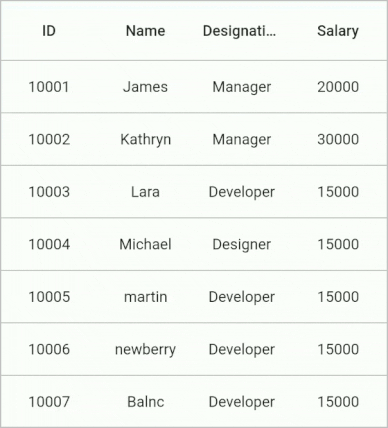
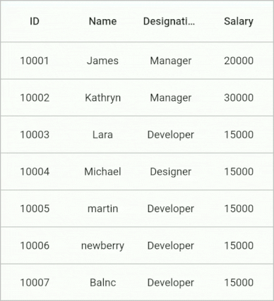
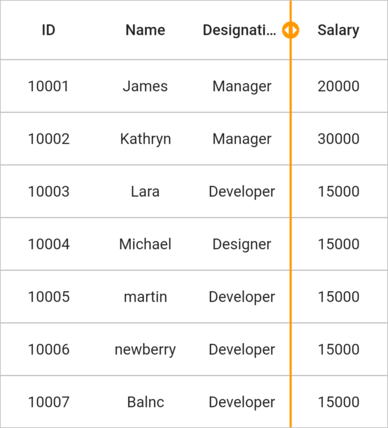

# Columns Resizing in Flutter DataGrid (SfDataGrid)

The [SfDataGrid](https://pub.dev/documentation/syncfusion_flutter_datagrid/latest/datagrid/SfDataGrid-class.html) provides support to resize the columns by dragging the right end of the column header. The column resizing can be enabled by setting the `SfDataGrid.allowColumnsResizing` property to `true`. 

`SfDataGrid` does not automatically resize the columns when you perform column resizing. You should maintain the column width collection at the application level and set the column width of the corresponding column using the `SfDataGrid.onColumnResizeUpdate` callback.

 The column resizing indicator comes to view based on the platform. In web and desktop platforms, the indicator appears when you hover over the right end of the column and drag it. In mobile platforms, the indicator comes into view when you long-press the corresponding column header.

> **NOTE:**
    Column resizing considers the [GridColumn.minimumWidth](https://pub.dev/documentation/syncfusion_flutter_datagrid/latest/datagrid/GridColumn/minimumWidth.html) and [GridColumn.maximumWidth](https://pub.dev/documentation/syncfusion_flutter_datagrid/latest/datagrid/GridColumn/maximumWidth.html) properties.


 

late Map<String, double> columnWidths = {
  'id': double.nan,
  'name': double.nan,
  'designation': double.nan,
  'salary': double.nan
};

@override
Widget build(BuildContext context) {
  return Scaffold(
    appBar: AppBar(
      title: const Text('Syncfusion Flutter DataGrid'),
    ),
    body: SfDataGrid(
      source: _employeeDataSource,
      allowColumnsResizing: true,
      onColumnResizeUpdate: (ColumnResizeUpdateDetails details) {
        setState(() {
          columnWidths[details.column.columnName] = details.width;
        });
        return true;
      },
      columns: <GridColumn>[
        GridColumn(
            width: columnWidths['id']!,
            columnName: 'id',
            label: Container(
                padding: EdgeInsets.all(16.0),
                alignment: Alignment.center,
                child: Text(
                  'ID',
                ))),
        GridColumn(
            width: columnWidths['name']!,
            columnName: 'name',
            label: Container(
                padding: EdgeInsets.all(8.0),
                alignment: Alignment.center,
                child: Text('Name'))),
        GridColumn(
            width: columnWidths['designation']!,
            columnName: 'designation',
            label: Container(
                padding: EdgeInsets.all(8.0),
                alignment: Alignment.center,
                child: Text(
                  'Designation',
                  overflow: TextOverflow.ellipsis,
                ))),
        GridColumn(
            width: columnWidths['salary']!,
            columnName: 'salary',
            label: Container(
                padding: EdgeInsets.all(8.0),
                alignment: Alignment.center,
                child: Text('Salary'))),
      ],
    ),
  );
}




## Column resizing modes

By default, the columns are resized by dragging the right end of the columns. `SfDataGrid` provided the two modes to perform the column resizing:

* `onResize`: The resizing indicator is moved based on the dragging gesture. `onColumnResizeUpdate` callback is called when a column is resized.
* `onResizeEnd`: The resizing indicator is moved based on the dragging gesture. `onColumnResizeUpdate` callback is called when you release the pointer.

The following example demonstrates how to resize a column by setting the `SfDataGrid.columnResizeMode` property to `onResizeEnd`.


 

late Map<String, double> columnWidths = {
  'id': double.nan,
  'name': double.nan,
  'designation': double.nan,
  'salary': double.nan
};

@override
Widget build(BuildContext context) {
  return Scaffold(
    appBar: AppBar(
      title: const Text('Syncfusion Flutter DataGrid'),
    ),
    body: SfDataGrid(
      source: _employeeDataSource,
      allowColumnsResizing: true,
      columnResizeMode: ColumnResizeMode.onResizeEnd,
      onColumnResizeUpdate: (ColumnResizeUpdateDetails details) {
        setState(() {
          columnWidths[details.column.columnName] = details.width;
        });
        return true;
      },
      columns: <GridColumn>[
        GridColumn(
            width: columnWidths['id']!,
            columnName: 'id',
            label: Container(
                padding: EdgeInsets.all(16.0),
                alignment: Alignment.center,
                child: Text(
                  'ID',
                ))),
        GridColumn(
            width: columnWidths['name']!,
            columnName: 'name',
            label: Container(
                padding: EdgeInsets.all(8.0),
                alignment: Alignment.center,
                child: Text('Name'))),
        GridColumn(
            width: columnWidths['designation']!,
            columnName: 'designation',
            label: Container(
                padding: EdgeInsets.all(8.0),
                alignment: Alignment.center,
                child: Text(
                  'Designation',
                  overflow: TextOverflow.ellipsis,
                ))),
        GridColumn(
            width: columnWidths['salary']!,
            columnName: 'salary',
            label: Container(
                padding: EdgeInsets.all(8.0),
                alignment: Alignment.center,
                child: Text('Salary'))),
      ],
    ),
  );
}




## Callbacks

The following callbacks are called when you perform the column resizing:

* `onColumnResizeStart`: Called when column resizing is started. In Mobile platforms, it will be called when the resizing indicator appears after you long-press the corresponding column header. In Web and Windows platforms, it will be called when you click and drag the right end of the columns.
* `onColumnResizeUpdate`: Called when a column is being resized. Typically, you should set the column width here.
* `onColumnResizeEnd`: Called when a column resizing is ended. Typically, this will be called when you release the pointer.




late Map<String, double> columnWidths = {
  'id': double.nan,
  'name': double.nan,
  'designation': double.nan,
  'salary': double.nan
};

@override
Widget build(BuildContext context) {
  return Scaffold(
    appBar: AppBar(
      title: const Text('Syncfusion Flutter DataGrid'),
    ),
    body: SfDataGrid(
      source: _employeeDataSource,
      allowColumnsResizing: true,
      onColumnResizeStart: (ColumnResizeStartDetails details) {
        return true;
      },
      onColumnResizeUpdate: (ColumnResizeUpdateDetails details) {
        setState(() {
          columnWidths[details.column.columnName] = details.width;
        });
        return true;
      },
      onColumnResizeEnd: (ColumnResizeEndDetails details) {
        print('Column resizing is ended for the ${details.column.columnName}');
      },
      columns: <GridColumn>[
        GridColumn(
            width: columnWidths['id']!,
            columnName: 'id',
            label: Container(
                padding: EdgeInsets.all(16.0),
                alignment: Alignment.center,
                child: Text(
                  'ID',
                ))),
        GridColumn(
            width: columnWidths['name']!,
            columnName: 'name',
            label: Container(
                padding: EdgeInsets.all(8.0),
                alignment: Alignment.center,
                child: Text('Name'))),
        GridColumn(
            width: columnWidths['designation']!,
            columnName: 'designation',
            label: Container(
                padding: EdgeInsets.all(8.0),
                alignment: Alignment.center,
                child: Text(
                  'Designation',
                  overflow: TextOverflow.ellipsis,
                ))),
        GridColumn(
            width: columnWidths['salary']!,
            columnName: 'salary',
            label: Container(
                padding: EdgeInsets.all(8.0),
                alignment: Alignment.center,
                child: Text('Salary'))),
      ],
    ),
  );
}




## Disable resizing for a particular column

To disable resizing for a particular column, use the `SfDataGrid.onColumnResizeStart` callback and return `false` to the corresponding column. Return `true` for all other columns.




late Map<String, double> columnWidths = {
  'id': double.nan,
  'name': double.nan,
  'designation': double.nan,
  'salary': double.nan
};

@override
Widget build(BuildContext context) {
  return Scaffold(
    appBar: AppBar(
      title: const Text('Syncfusion Flutter DataGrid'),
    ),
    body: SfDataGrid(
      source: _employeeDataSource,
      allowColumnsResizing: true,
      onColumnResizeStart: (ColumnResizeStartDetails details) {
        // Disable resizing for the `id` column.
        if (details.column.columnName == 'id') {
          return false;
        }
        return true;
      },
      onColumnResizeUpdate: (ColumnResizeUpdateDetails details) {
        setState(() {
          columnWidths[details.column.columnName] = details.width;
        });
        return true;
      },
      columns: <GridColumn>[
        GridColumn(
            width: columnWidths['id']!,
            columnName: 'id',
            label: Container(
                padding: EdgeInsets.all(16.0),
                alignment: Alignment.center,
                child: Text(
                  'ID',
                ))),
        GridColumn(
            width: columnWidths['name']!,
            columnName: 'name',
            label: Container(
                padding: EdgeInsets.all(8.0),
                alignment: Alignment.center,
                child: Text('Name'))),
        GridColumn(
            width: columnWidths['designation']!,
            columnName: 'designation',
            label: Container(
                padding: EdgeInsets.all(8.0),
                alignment: Alignment.center,
                child: Text(
                  'Designation',
                  overflow: TextOverflow.ellipsis,
                ))),
        GridColumn(
            width: columnWidths['salary']!,
            columnName: 'salary',
            label: Container(
                padding: EdgeInsets.all(8.0),
                alignment: Alignment.center,
                child: Text('Salary'))),
      ],
    ),
  );
}




## Prevent column from being hidden on resizing

To prevent a column from being hidden while resizing, use the `GridColumn.minimumWidth` property to set the columns’ minimum width. The column will not be resized below the minimum width.




late Map<String, double> columnWidths = {
  'id': double.nan,
  'name': double.nan,
  'designation': double.nan,
  'salary': double.nan
};

@override
Widget build(BuildContext context) {
  return Scaffold(
    appBar: AppBar(
      title: const Text('Syncfusion Flutter DataGrid'),
    ),
    body: SfDataGrid(
      source: _employeeDataSource,
      allowColumnsResizing: true,
      onColumnResizeUpdate: (ColumnResizeUpdateDetails details) {
        setState(() {
          columnWidths[details.column.columnName] = details.width;
        });
        return true;
      },
      columns: <GridColumn>[
        GridColumn(
            width: columnWidths['id']!,
            columnName: 'id',
            label: Container(
                padding: EdgeInsets.all(16.0),
                alignment: Alignment.center,
                child: Text(
                  'ID',
                ))),
        GridColumn(
            width: columnWidths['name']!,
            minimumWidth: 30.0,
            columnName: 'name',
            label: Container(
                padding: EdgeInsets.all(8.0),
                alignment: Alignment.center,
                child: Text('Name'))),
        GridColumn(
            width: columnWidths['designation']!,
            columnName: 'designation',
            label: Container(
                padding: EdgeInsets.all(8.0),
                alignment: Alignment.center,
                child: Text(
                  'Designation',
                  overflow: TextOverflow.ellipsis,
                ))),
        GridColumn(
            width: columnWidths['salary']!,
            columnName: 'salary',
            label: Container(
                padding: EdgeInsets.all(8.0),
                alignment: Alignment.center,
                child: Text('Salary'))),
      ],
    ),
  );
}




## Customize indicator appearance

The column resizing indicator color and its width can be customized by using the `SfDataGridThemeData.columnResizeIndicatorColor` and `SfDataGridThemeData.columnResizeIndicatorStrokeWidth` properties.




late Map<String, double> columnWidths = {
  'id': double.nan,
  'name': double.nan,
  'designation': double.nan,
  'salary': double.nan
};

@override
Widget build(BuildContext context) {
  return Scaffold(
    appBar: AppBar(
      title: const Text('Syncfusion Flutter DataGrid'),
    ),
    body: SfDataGridTheme(
      data: SfDataGridThemeData(
        columnResizeIndicatorColor: Colors.orange,
        columnResizeIndicatorStrokeWidth: 2.0,
      ),
      child: SfDataGrid(
        source: _employeeDataSource,
        allowColumnsResizing: true,
        onColumnResizeUpdate: (ColumnResizeUpdateDetails details) {
          setState(() {
            columnWidths[details.column.columnName] = details.width;
          });
          return true;
        },
        columns: <GridColumn>[
          GridColumn(
              width: columnWidths['id']!,
              columnName: 'id',
              label: Container(
                  padding: EdgeInsets.all(16.0),
                  alignment: Alignment.center,
                  child: Text(
                    'ID',
                  ))),
          GridColumn(
              width: columnWidths['name']!,
              columnName: 'name',
              label: Container(
                  padding: EdgeInsets.all(8.0),
                  alignment: Alignment.center,
                  child: Text('Name'))),
          GridColumn(
              width: columnWidths['designation']!,
              columnName: 'designation',
              label: Container(
                  padding: EdgeInsets.all(8.0),
                  alignment: Alignment.center,
                  child: Text(
                    'Designation',
                    overflow: TextOverflow.ellipsis,
                  ))),
          GridColumn(
              width: columnWidths['salary']!,
              columnName: 'salary',
              label: Container(
                  padding: EdgeInsets.all(8.0),
                  alignment: Alignment.center,
                  child: Text('Salary'))),
        ],
      ),
    ),
  );
}




