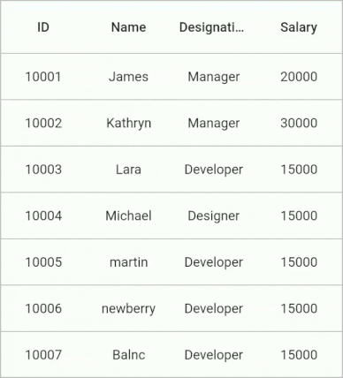
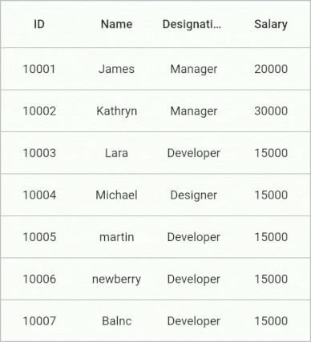
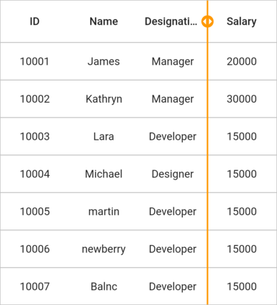

# Columns Resizing in Flutter DataGrid (SfDataGrid)

The [SfDataGrid](https://pub.dev/documentation/syncfusion_flutter_datagrid/latest/datagrid/SfDataGrid-class.html) provides support to resize the columns by dragging the right end of the column header. The column resizing can be enabled by setting the [SfDataGrid.allowColumnsResizing](https://pub.dev/documentation/syncfusion_flutter_datagrid/latest/datagrid/SfDataGrid/allowColumnsResizing.html) property to `true`.

`SfDataGrid` does not automatically resize the columns when you perform column resizing. You should maintain the column width collection at the application level and set the column width of the corresponding column using the [SfDataGrid.onColumnResizeUpdate](https://pub.dev/documentation/syncfusion_flutter_datagrid/latest/datagrid/SfDataGrid/onColumnResizeUpdate.html) callback.

The column resizing indicator appears based on the platform. In web and desktop platforms, the indicator appears when you hover over the right end of the column and drag it. In mobile platforms, the indicator comes into view when you long-press the corresponding column header.

> **Note:** Column resizing considers the [GridColumn.minimumWidth](https://pub.dev/documentation/syncfusion_flutter_datagrid/latest/datagrid/GridColumn/minimumWidth.html) and [GridColumn.maximumWidth](https://pub.dev/documentation/syncfusion_flutter_datagrid/latest/datagrid/GridColumn/maximumWidth.html) properties. These limits are enforced to prevent columns from becoming too small or too large during resizing.

## Basic Column Resizing

The following example demonstrates the basic column resizing setup. The `columnWidths` map stores the width of each column. Using `double.nan` as initial values allows the DataGrid to use default column width sizing until the user manually resizes a column.


 

  late Map<String, double> columnWidths = {
    'id': double.nan,          // double.nan means use default width until resized
    'name': double.nan,
    'designation': double.nan,
    'salary': double.nan
  };

  @override
  Widget build(BuildContext context) {
    return Scaffold(
      appBar: AppBar(
        title: const Text('Syncfusion Flutter DataGrid'),
      ),
      body: SfDataGrid(
        source: _employeeDataSource,
        allowColumnsResizing: true,
        onColumnResizeUpdate: (ColumnResizeUpdateDetails details) {
          setState(() {
            columnWidths[details.column.columnName] = details.width;
          });
          return true;
        },
        columns: <GridColumn>[
          GridColumn(
            width: columnWidths['id']!,
            columnName: 'id',
            label: Container(
              padding: EdgeInsets.all(16.0),
              alignment: Alignment.center,
              child: Text(
                'ID',
              )
            )
          ),
          GridColumn(
            width: columnWidths['name']!,
            columnName: 'name',
            label: Container(
              padding: EdgeInsets.all(8.0),
              alignment: Alignment.center,
              child: Text('Name')
            )
          ),
          GridColumn(
            width: columnWidths['designation']!,
            columnName: 'designation',
            label: Container(
              padding: EdgeInsets.all(8.0),
              alignment: Alignment.center,
              child: Text(
                'Designation',
                overflow: TextOverflow.ellipsis,
              )
            )
          ),
          GridColumn(
            width: columnWidths['salary']!,
            columnName: 'salary',
            label: Container(
              padding: EdgeInsets.all(8.0),
              alignment: Alignment.center,
              child: Text('Salary')
            )
          ),
        ],
      ),
    );
  }




## Column resizing modes

By default, the columns are resized by dragging the right end of the columns. `SfDataGrid` provides two modes to perform column resizing:

* `onResize`: The resizing indicator moves based on the dragging gesture. `onColumnResizeUpdate` callback is called continuously as the user drags. Use this mode when you want real-time column width updates.
* `onResizeEnd`: The resizing indicator moves based on the dragging gesture. `onColumnResizeUpdate` callback is called only when you release the pointer. Use this mode for better performance when handling expensive operations like persisting changes.

The following example demonstrates how to resize a column by setting the [SfDataGrid.columnResizeMode](https://pub.dev/documentation/syncfusion_flutter_datagrid/latest/datagrid/SfDataGrid/columnResizeMode.html) property to `onResizeEnd`.


 

  late Map<String, double> columnWidths = {
    'id': double.nan,
    'name': double.nan,
    'designation': double.nan,
    'salary': double.nan
  };

  @override
  Widget build(BuildContext context) {
    return Scaffold(
      appBar: AppBar(
        title: const Text('Syncfusion Flutter DataGrid'),
      ),
      body: SfDataGrid(
        source: _employeeDataSource,
        allowColumnsResizing: true,
        columnResizeMode: ColumnResizeMode.onResizeEnd,
        onColumnResizeUpdate: (ColumnResizeUpdateDetails details) {
          setState(() {
            columnWidths[details.column.columnName] = details.width;
          });
          return true;
        },
        columns: <GridColumn>[
          GridColumn(
            width: columnWidths['id']!,
            columnName: 'id',
            label: Container(
              padding: EdgeInsets.all(16.0),
              alignment: Alignment.center,
              child: Text(
                'ID',
              )
            )
          ),
          GridColumn(
            width: columnWidths['name']!,
            columnName: 'name',
            label: Container(
              padding: EdgeInsets.all(8.0),
              alignment: Alignment.center,
              child: Text('Name')
            )
          ),
          GridColumn(
            width: columnWidths['designation']!,
            columnName: 'designation',
            label: Container(
              padding: EdgeInsets.all(8.0),
              alignment: Alignment.center,
              child: Text(
                'Designation',
                overflow: TextOverflow.ellipsis,
              )
            )
          ),
          GridColumn(
            width: columnWidths['salary']!,
            columnName: 'salary',
            label: Container(
              padding: EdgeInsets.all(8.0),
              alignment: Alignment.center,
              child: Text('Salary')
            )
          ),
        ],
      ),
    );
  }




## Callbacks

The following callbacks are called when you perform column resizing:

* [onColumnResizeStart](https://pub.dev/documentation/syncfusion_flutter_datagrid/latest/datagrid/SfDataGrid/onColumnResizeStart.html): Called when column resizing is started. In mobile platforms, it will be called when the resizing indicator appears after you long-press the corresponding column header. In web and desktop platforms, it will be called when you click and drag the right end of the columns. Return `true` to allow resizing, or `false` to prevent it.
* `onColumnResizeUpdate`: Called when a column is being resized. Typically, you should set the column width here. The callback provides `ColumnResizeUpdateDetails` with properties: `column` (the GridColumn being resized) and `width` (the new width). Return `true` to apply the change.
* [onColumnResizeEnd](https://pub.dev/documentation/syncfusion_flutter_datagrid/latest/datagrid/SfDataGrid/onColumnResizeEnd.html): Called when column resizing is ended. This will be called when you release the pointer. The callback provides `ColumnResizeEndDetails` with the final column and width information.




  late Map<String, double> columnWidths = {
    'id': double.nan,
    'name': double.nan,
    'designation': double.nan,
    'salary': double.nan
  };

  @override
  Widget build(BuildContext context) {
    return Scaffold(
      appBar: AppBar(
        title: const Text('Syncfusion Flutter DataGrid'),
      ),
      body: SfDataGrid(
        source: _employeeDataSource,
        allowColumnsResizing: true,
        onColumnResizeStart: (ColumnResizeStartDetails details) {
          return true;
        },
        onColumnResizeUpdate: (ColumnResizeUpdateDetails details) {
          setState(() {
            columnWidths[details.column.columnName] = details.width;
          });
          return true;
        },
        onColumnResizeEnd: (ColumnResizeEndDetails details) {
          print('Column resizing is ended for the ${details.column.columnName}');
        },
        columns: <GridColumn>[
          GridColumn(
            width: columnWidths['id']!,
            columnName: 'id',
            label: Container(
              padding: EdgeInsets.all(16.0),
              alignment: Alignment.center,
              child: Text(
                'ID',
              )
            )
          ),
          GridColumn(
            width: columnWidths['name']!,
            columnName: 'name',
            label: Container(
              padding: EdgeInsets.all(8.0),
              alignment: Alignment.center,
              child: Text('Name')
            )
          ),
          GridColumn(
            width: columnWidths['designation']!,
            columnName: 'designation',
            label: Container(
              padding: EdgeInsets.all(8.0),
              alignment: Alignment.center,
              child: Text(
                'Designation',
                overflow: TextOverflow.ellipsis,
              )
            )
          ),
          GridColumn(
            width: columnWidths['salary']!,
            columnName: 'salary',
            label: Container(
              padding: EdgeInsets.all(8.0),
              alignment: Alignment.center,
              child: Text('Salary')
            )
          ),
        ],
      ),
    );
  }




## Disable resizing for a particular column

To disable resizing for a particular column, return `false` in the `onColumnResizeStart` callback for that column. Return `true` for all other columns to allow resizing.




  late Map<String, double> columnWidths = {
    'id': double.nan,
    'name': double.nan,
    'designation': double.nan,
    'salary': double.nan
  };

  @override
  Widget build(BuildContext context) {
    return Scaffold(
      appBar: AppBar(
        title: const Text('Syncfusion Flutter DataGrid'),
      ),
      body: SfDataGrid(
        source: _employeeDataSource,
        allowColumnsResizing: true,
        onColumnResizeStart: (ColumnResizeStartDetails details) {
          // Disable resizing for the `id` column.
          if (details.column.columnName == 'id') {
            return false;
          }
          return true;
        },
        onColumnResizeUpdate: (ColumnResizeUpdateDetails details) {
          setState(() {
            columnWidths[details.column.columnName] = details.width;
          });
          return true;
        },
        columns: <GridColumn>[
          GridColumn(
            width: columnWidths['id']!,
            columnName: 'id',
            label: Container(
              padding: EdgeInsets.all(16.0),
              alignment: Alignment.center,
              child: Text(
                'ID',
              )
            )
          ),
          GridColumn(
            width: columnWidths['name']!,
            columnName: 'name',
            label: Container(
              padding: EdgeInsets.all(8.0),
              alignment: Alignment.center,
              child: Text('Name')
            )
          ),
          GridColumn(
            width: columnWidths['designation']!,
            columnName: 'designation',
            label: Container(
              padding: EdgeInsets.all(8.0),
              alignment: Alignment.center,
              child: Text(
                'Designation',
                overflow: TextOverflow.ellipsis,
              )
            )
          ),
          GridColumn(
            width: columnWidths['salary']!,
            columnName: 'salary',
            label: Container(
              padding: EdgeInsets.all(8.0),
              alignment: Alignment.center,
              child: Text('Salary')
            )
          ),
        ],
      ),
    );
  }




## Disable resizing for the checkbox column

When checkbox selection is enabled (`showCheckboxColumn: true`), the checkbox column is always added as the first column (index 0). To disable resizing for the checkbox column, return `false` in the `onColumnResizeStart` callback when the [ColumnResizeStartDetails.columnIndex](https://pub.dev/documentation/syncfusion_flutter_datagrid/latest/datagrid/ColumnResizeStartDetails/columnIndex.html) is `0`. 




  late Map<String, double> columnWidths = {
    'id': double.nan,
    'name': double.nan,
    'designation': double.nan,
    'salary': double.nan,
    'checkbox': double.nan
  };

  @override
  Widget build(BuildContext context) {
    return Scaffold(
      appBar: AppBar(
        title: const Text('Syncfusion Flutter DataGrid'),
      ),
      body: SfDataGrid(
        source: _employeeDataSource,
        allowColumnsResizing: true,
        onColumnResizeStart: (ColumnResizeStartDetails details) {
          // Disable resizing for the `checkbox` column.
          if (details.columnIndex == 0) {
            return false;
          }
          return true;
        },
        onColumnResizeUpdate: (ColumnResizeUpdateDetails details) {
          setState(() {
            columnWidths[details.column.columnName] = details.width;
          });
          return true;
        },
        columns: <GridColumn>[
          GridColumn(
            width: columnWidths['id']!,
            columnName: 'id',
            label: Container(
              padding: EdgeInsets.all(16.0),
              alignment: Alignment.center,
              child: Text(
                'ID',
              )
            )
          ),
          GridColumn(
            width: columnWidths['name']!,
            columnName: 'name',
            label: Container(
              padding: EdgeInsets.all(8.0),
              alignment: Alignment.center,
              child: Text('Name')
            )
          ),
          GridColumn(
            width: columnWidths['designation']!,
            columnName: 'designation',
            label: Container(
              padding: EdgeInsets.all(8.0),
              alignment: Alignment.center,
              child: Text(
                'Designation',
                overflow: TextOverflow.ellipsis,
              )
            )
          ),
          GridColumn(
            width: columnWidths['salary']!,
            columnName: 'salary',
            label: Container(
              padding: EdgeInsets.all(8.0),
              alignment: Alignment.center,
              child: Text('Salary')
            )
          ),
        ],
      ),
    );
  }




## Prevent column from being hidden on resizing

To prevent a column from being hidden while resizing, use the `GridColumn.minimumWidth` property to set the column's minimum width. The column will not be resized below the minimum width.




  late Map<String, double> columnWidths = {
    'id': double.nan,
    'name': double.nan,
    'designation': double.nan,
    'salary': double.nan
  };

  @override
  Widget build(BuildContext context) {
    return Scaffold(
      appBar: AppBar(
        title: const Text('Syncfusion Flutter DataGrid'),
      ),
      body: SfDataGrid(
        source: _employeeDataSource,
        allowColumnsResizing: true,
        onColumnResizeUpdate: (ColumnResizeUpdateDetails details) {
          setState(() {
            columnWidths[details.column.columnName] = details.width;
          });
          return true;
        },
        columns: <GridColumn>[
          GridColumn(
            width: columnWidths['id']!,
            columnName: 'id',
            label: Container(
              padding: EdgeInsets.all(16.0),
              alignment: Alignment.center,
              child: Text(
                'ID',
              )
            )
          ),
          GridColumn(
            width: columnWidths['name']!,
            minimumWidth: 30.0,
            columnName: 'name',
            label: Container(
              padding: EdgeInsets.all(8.0),
              alignment: Alignment.center,
              child: Text('Name')
            )
          ),
          GridColumn(
            width: columnWidths['designation']!,
            columnName: 'designation',
            label: Container(
              padding: EdgeInsets.all(8.0),
              alignment: Alignment.center,
              child: Text(
                'Designation',
                overflow: TextOverflow.ellipsis,
              )
            )
          ),
          GridColumn(
            width: columnWidths['salary']!,
            columnName: 'salary',
            label: Container(
              padding: EdgeInsets.all(8.0),
              alignment: Alignment.center,
              child: Text('Salary')
            )
          ),
        ],
      ),
    );
  }




## Customize indicator appearance

The column resizing indicator color and its width can be customized by using the [SfDataGridThemeData.columnResizeIndicatorColor](https://pub.dev/documentation/syncfusion_flutter_core/latest/theme/SfDataGridThemeData/columnResizeIndicatorColor.html) and [SfDataGridThemeData.columnResizeIndicatorStrokeWidth](https://pub.dev/documentation/syncfusion_flutter_core/latest/theme/SfDataGridThemeData/columnResizeIndicatorStrokeWidth.html) properties.

> **Note:** The `SfDataGridThemeData` and `SfDataGridTheme` classes are available in the [syncfusion_flutter_core](https://pub.dev/packages/syncfusion_flutter_core) package. Ensure this package is added to your project dependencies.

Import the following file:




import 'package:syncfusion_flutter_core/theme.dart';







  import 'package:syncfusion_flutter_core/theme.dart';
  import 'package:syncfusion_flutter_datagrid/datagrid.dart';

  late Map<String, double> columnWidths = {
    'id': double.nan,
    'name': double.nan,
    'designation': double.nan,
    'salary': double.nan
  };

  @override
  Widget build(BuildContext context) {
    return Scaffold(
      appBar: AppBar(
        title: const Text('Syncfusion Flutter DataGrid'),
      ),
      body: SfDataGridTheme(
        data: SfDataGridThemeData(
          columnResizeIndicatorColor: Colors.orange,
          columnResizeIndicatorStrokeWidth: 2.0,
        ),
        child: SfDataGrid(
          source: _employeeDataSource,
          allowColumnsResizing: true,
          onColumnResizeUpdate: (ColumnResizeUpdateDetails details) {
            setState(() {
              columnWidths[details.column.columnName] = details.width;
            });
            return true;
          },
          columns: <GridColumn>[
            GridColumn(
              width: columnWidths['id']!,
              columnName: 'id',
              label: Container(
                padding: EdgeInsets.all(16.0),
                alignment: Alignment.center,
                child: Text(
                  'ID',
                )
              )
            ),
            GridColumn(
              width: columnWidths['name']!,
              columnName: 'name',
              label: Container(
                padding: EdgeInsets.all(8.0),
                alignment: Alignment.center,
                child: Text('Name')
              )
            ),
            GridColumn(
              width: columnWidths['designation']!,
              columnName: 'designation',
              label: Container(
                padding: EdgeInsets.all(8.0),
                alignment: Alignment.center,
                child: Text(
                  'Designation',
                  overflow: TextOverflow.ellipsis,
                )
              )
            ),
            GridColumn(
              width: columnWidths['salary']!,
              columnName: 'salary',
              label: Container(
                padding: EdgeInsets.all(8.0),
                alignment: Alignment.center,
                child: Text('Salary')
              )
            ),
          ],
        ),
      ),
    );
  }




