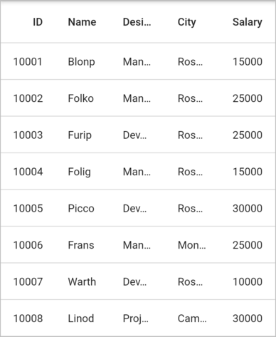
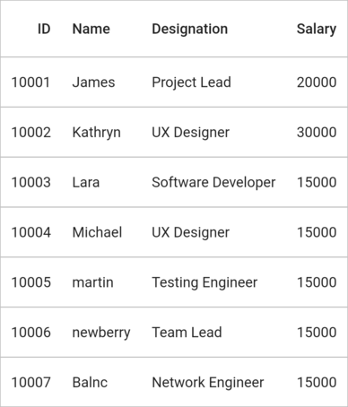
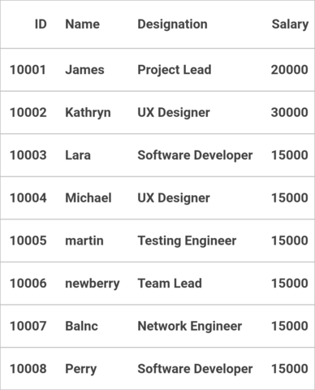
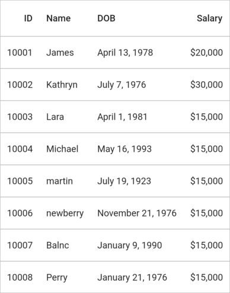
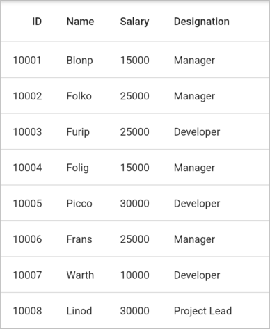
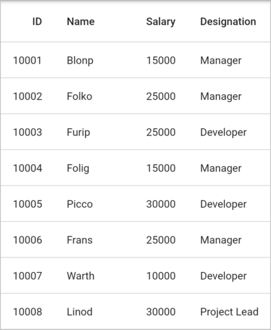

# Column sizing in Flutter DataGrid (SfDataGrid)

[SfDataGrid](https://pub.dev/documentation/syncfusion_flutter_datagrid/latest/datagrid/SfDataGrid-class.html) allows to set the column widths based on certain logic using [SfDataGrid.columnWidthMode](https://pub.dev/documentation/syncfusion_flutter_datagrid/latest/datagrid/SfDataGrid/columnWidthMode.html) or [GridColumn.columnWidthMode](https://pub.dev/documentation/syncfusion_flutter_datagrid/latest/datagrid/GridColumn/columnWidthMode.html) property. Below are the list of predefined column sizing options available.

| Mode                      | Description                                         |
|---------------------------|-----------------------------------------------------|
| ColumnWidthMode.auto      | Calculates the width of column based on [GridColumn.columName](https://pub.dev/documentation/syncfusion_flutter_datagrid/latest/datagrid/GridColumn/columnName.html) and [DataGridCell.value](https://pub.dev/documentation/syncfusion_flutter_datagrid/latest/datagrid/DataGridCell/value.html) properties. So, the header and cell contents are not truncated. |
| ColumnWidthMode.fitByCellValue | Calculates the width of column based on `DataGridCell.value` property. So, the cell contents are not truncated. |
| ColumnWidthMode.fitByColumnName | Calculates the width of column based on `GridColumn.columName` property. So, the header contents are not truncated. |
| ColumnWidthMode.lastColumnFill | Applies default Column width to all the columns except last column which is visible and the remaining width from total width of SfDataGrid is set to last column. |
| ColumnWidthMode.fill      | Divides the total width equally for columns.         |
| ColumnWidthMode.none      | No sizing. Default column width or defined width set to column. |

> **NOTE**  
    [ColumnWidthMode](https://pub.dev/documentation/syncfusion_flutter_datagrid/latest/datagrid/ColumnWidthMode.html) will not work when the column width defined explicitly. `columnWidthMode` calculates column width based on miniumWidth and maximumWidth properties.

The following example shows how to set the width equally for column based on the view port size.


 

@override
Widget build(BuildContext context) {
  return Scaffold(
      body: SfDataGrid(
          source: _employeeDataSource,
          columnWidthMode: ColumnWidthMode.fill,
          columns: <GridColumn>[
        GridColumn(
            columnName: 'id',
            label: Container(
                padding: EdgeInsets.symmetric(horizontal: 16.0),
                alignment: Alignment.centerRight,
                child: Text(
                  'ID',
                  overflow: TextOverflow.ellipsis,
                ))),
        GridColumn(
            columnName: 'name',
            label: Container(
                padding: EdgeInsets.symmetric(horizontal: 16.0),
                alignment: Alignment.centerLeft,
                child: Text(
                  'Name',
                  overflow: TextOverflow.ellipsis,
                ))),
        GridColumn(
            columnName: 'designation',
            label: Container(
                padding: EdgeInsets.symmetric(horizontal: 16.0),
                alignment: Alignment.centerLeft,
                child: Text(
                  'Designation',
                  overflow: TextOverflow.ellipsis,
                ))),
        GridColumn(
            columnName: 'city',
            label: Container(
                padding: EdgeInsets.symmetric(horizontal: 16.0),
                alignment: Alignment.centerLeft,
                child: Text(
                  'city',
                  overflow: TextOverflow.ellipsis,
                ))),
        GridColumn(
            columnName: 'salary',
            label: Container(
                padding: EdgeInsets.symmetric(horizontal: 16.0),
                alignment: Alignment.centerRight,
                child: Text(
                  'Salary',
                  overflow: TextOverflow.ellipsis,
                )))
      ]));
}
  



> **NOTE**  
    The `GridColumn.columnWidthMode` takes higher priority than the `SfDataGrid.columnWidthMode`.

## Consider all the rows to calculate the autofit size

By default, the autofit calculation is performed for only visible rows. You can use the [SfDataGrid.columnWidthCalculationRange](https://pub.dev/documentation/syncfusion_flutter_datagrid/latest/datagrid/SfDataGrid/columnWidthCalculationRange.html) property as [ColumnWidthCalculationRange.allRows](https://pub.dev/documentation/syncfusion_flutter_datagrid/latest/datagrid/ColumnWidthCalculationRange.html) to perform the autofit calculation for all the available rows.


 

@override
Widget build(BuildContext context) {
  return SfDataGrid(
      source: _employeeDataSource,
      columnWidthMode: ColumnWidthMode.auto,
      columnWidthCalculationRange: ColumnWidthCalculationRange.allRows,
      columns: <GridColumn>[
        GridColumn(
            columnName: 'ID',
            label: Container(
                padding: EdgeInsets.all(16.0),
                alignment: Alignment.centerRight,
                child: Text(
                  'ID',
                  softWrap: false,
                ))),
        GridColumn(
            columnName: 'Name',
            label: Container(
                padding: EdgeInsets.all(16.0),
                alignment: Alignment.centerLeft,
                child: Text(
                  'Name',
                  softWrap: false,
                ))),
        GridColumn(
            columnName: 'Designation',
            label: Container(
                padding: EdgeInsets.all(16.0),
                alignment: Alignment.centerLeft,
                child: Text(
                  'Designation',
                  softWrap: false,
                ))),
        GridColumn(
            columnName: 'Salary',
            label: Container(
                padding: EdgeInsets.all(16.0),
                alignment: Alignment.centerRight,
                child: Text(
                  'Salary',
                  softWrap: false,
                )))
      ]);
}




## Change the padding value for autofit calculation

By default, the EdgeInsets.all(16.0) is added with the auto width or height value. You can change the padding for specific columns by using the [GridColumn.autoFitPadding](https://pub.dev/documentation/syncfusion_flutter_datagrid/latest/datagrid/GridColumn/autoFitPadding.html) property.

>**Note** 
  `GridColumn.autoFitPadding` is applicable for header cell also.


 

@override
Widget build(BuildContext context) {
  return SfDataGrid(
      source: _employeeDataSource,
      columnWidthMode: ColumnWidthMode.auto,
      columns: <GridColumn>[
        GridColumn(
            columnName: 'id',
            autoFitPadding: EdgeInsets.all(10.0),
            label: Container(
                padding: EdgeInsets.all(10.0),
                alignment: Alignment.centerRight,
                child: Text(
                  'ID',
                  softWrap: false,
                ))),
        GridColumn(
            columnName: 'name',
            autoFitPadding: EdgeInsets.all(10.0),
            label: Container(
                padding: EdgeInsets.all(10.0),
                alignment: Alignment.centerLeft,
                child: Text(
                  'Name',
                  softWrap: false,
                ))),
        GridColumn(
            columnName: 'designation',
            autoFitPadding: EdgeInsets.all(10.0),
            label: Container(
                padding: EdgeInsets.all(10.0),
                alignment: Alignment.centerLeft,
                child: Text(
                  'Designation',
                  softWrap: false,
                ))),
        GridColumn(
            columnName: 'salary',
            autoFitPadding: EdgeInsets.all(10.0),
            label: Container(
                padding: EdgeInsets.all(10.0),
                alignment: Alignment.centerRight,
                child: Text(
                  'Salary',
                  softWrap: false,
                )))
      ]);
}

class EmployeeDataSource extends DataGridSource {
  EmployeeDataSource({required List<Employee> employees}) {
    _employeeData = employees
        .map<DataGridRow>((e) => DataGridRow(cells: [
              DataGridCell<int>(columnName: 'ID', value: e.id),
              DataGridCell<String>(columnName: 'Name', value: e.name),
              DataGridCell<String>(
                  columnName: 'Designation', value: e.designation),
              DataGridCell<int>(columnName: 'Salary', value: e.salary),
            ]))
        .toList();
  }

  List<DataGridRow> _employeeData = [];

  @override
  List<DataGridRow> get rows => _employeeData;

  @override
  DataGridRowAdapter buildRow(DataGridRow row) {
    return DataGridRowAdapter(
        cells: row.getCells().map<Widget>((cell) {
      return Container(
        alignment: Alignment.center,
        // The autoFitPadding and the cell padding value should be same.
        padding: EdgeInsets.all(10.0),
        child: Text(cell.value.toString()),
      );
    }).toList());
  }
}




## Autofit calculation based on different TextStyle

By default, the cell width is calculated based on the default text style. To calculate the cell width based on different [TextStyle](https://api.flutter.dev/flutter/painting/TextStyle-class.html), just override the [computeHeaderCellWidth](https://pub.dev/documentation/syncfusion_flutter_datagrid/latest/datagrid/ColumnSizer/computeHeaderCellWidth.html) method for header and [computeCellWidth](https://pub.dev/documentation/syncfusion_flutter_datagrid/latest/datagrid/ColumnSizer/computeCellWidth.html) method for cell and return the super method with the required `TextStyle`.


 

final CustomColumnSizer _customColumnSizer = CustomColumnSizer();

@override
Widget build(BuildContext context) {
  return SfDataGrid(
      source: _employeeDataSource,
      columnSizer: _customColumnSizer,
      columnWidthMode: ColumnWidthMode.auto,
      columns: <GridColumn>[
        GridColumn(
            columnName: 'ID',
            autoFitPadding: EdgeInsets.all(12.0),
            label: Container(
                padding: EdgeInsets.all(12.0),
                alignment: Alignment.center,
                child: Text(
                  'ID',
                ))),
        GridColumn(
            columnName: 'Name',
            autoFitPadding: EdgeInsets.all(12.0),
            label: Container(
                padding: EdgeInsets.all(12.0),
                alignment: Alignment.center,
                child: Text(
                  'Name',
                  style: TextStyle(
                      fontWeight: FontWeight.bold, fontStyle: FontStyle.italic),
                ))),
        GridColumn(
            columnName: 'Designation',
            autoFitPadding: EdgeInsets.all(12.0),
            label: Container(
                padding: EdgeInsets.all(12.0),
                alignment: Alignment.center,
                child: Text(
                  'Designation',
                  overflow: TextOverflow.ellipsis,
                  style: TextStyle(
                      fontWeight: FontWeight.bold, fontStyle: FontStyle.italic),
                ))),
        GridColumn(
            columnName: 'Salary',
            autoFitPadding: EdgeInsets.all(12.0),
            label: Container(
                padding: EdgeInsets.all(12.0),
                alignment: Alignment.center,
                child: Text('Salary'))),
      ]);
}

class EmployeeDataSource extends DataGridSource {
  EmployeeDataSource({required List<Employee> employees}) {
    _employeeData = employees
        .map<DataGridRow>((e) => DataGridRow(cells: [
              DataGridCell<int>(columnName: 'ID', value: e.id),
              DataGridCell<String>(columnName: 'Name', value: e.name),
              DataGridCell<String>(
                  columnName: 'Designation', value: e.designation),
              DataGridCell<int>(columnName: 'Salary', value: e.salary),
            ]))
        .toList();
  }

  List<DataGridRow> _employeeData = [];

  @override
  List<DataGridRow> get rows => _employeeData;

  @override
  DataGridRowAdapter buildRow(DataGridRow row) {
    return DataGridRowAdapter(
        cells: row.getCells().map<Widget>((e) {
      return Container(
          alignment: Alignment.center,
          padding: EdgeInsets.all(12.0),
          child: Text(e.value.toString(),
              style: (e.columnName == 'Name' || e.columnName == 'Designation')
                  ? TextStyle(
                      fontWeight: FontWeight.bold, fontStyle: FontStyle.italic)
                  : null));
    }).toList());
  }
}

class CustomColumnSizer extends ColumnSizer {
  @override
  double computeHeaderCellWidth(GridColumn column, TextStyle style) {
    if (column.columnName == 'Name' || column.columnName == 'Designation') {
      style =
          TextStyle(fontWeight: FontWeight.bold, fontStyle: FontStyle.italic);
    }
    return super.computeHeaderCellWidth(column, style);
  }

  @override
  double computeCellWidth(GridColumn column, DataGridRow row, Object? cellValue,
      TextStyle textStyle) {
    if (column.columnName == 'Name' || column.columnName == 'Designation') {
      textStyle =
          TextStyle(fontWeight: FontWeight.bold, fontStyle: FontStyle.italic);
    }
    return super.computeCellWidth(column, row, cellValue, textStyle);
  }
}


 

**NOTE**  
  Download demo application from [GitHub](https://github.com/SyncfusionExamples/how-to-fit-the-column-based-on-the-different-text-style-in-Flutter-DataTable-sfdatagrid).

## Autofit calculation based on the formatted value 

By default, the cell width is calculated based on the `DataGridCell.value` property. To autofit the cell width based on the displayed formatted value (i.e, DateFormat and NumberFormat), simply override the `computeCellWidth` method and return the super method with the required `cellValue`.




import 'package:intl/intl.dart';

final CustomColumnSizer _customColumnSizer = CustomColumnSizer();

@override
Widget build(BuildContext context) {
  return SfDataGrid(
      source: _employeeDataSource,
      columnSizer: _customColumnSizer,
      columnWidthMode: ColumnWidthMode.fitByCellValue,
      columns: <GridColumn>[
        GridColumn(
            columnName: 'ID',
            label: Container(
                padding: EdgeInsets.all(16.0),
                alignment: Alignment.centerRight,
                child: Text(
                  'ID',
                  softWrap: false,
                ))),
        GridColumn(
            columnName: 'Name',
            label: Container(
                padding: EdgeInsets.all(16.0),
                alignment: Alignment.centerLeft,
                child: Text(
                  'Name',
                  softWrap: false,
                ))),
        GridColumn(
            columnName: 'DOB',
            label: Container(
                padding: EdgeInsets.all(16.0),
                alignment: Alignment.centerLeft,
                child: Text(
                  'DOB',
                  softWrap: false,
                ))),
        GridColumn(
            columnName: 'Salary',
            label: Container(
                padding: EdgeInsets.all(16.0),
                alignment: Alignment.centerRight,
                child: Text(
                  'Salary',
                  softWrap: false,
                )))
      ]);
}

class EmployeeDataSource extends DataGridSource {
  EmployeeDataSource({required List<Employee> employees}) {
    _employeeData = employees
        .map<DataGridRow>((e) => DataGridRow(cells: [
              DataGridCell<int>(columnName: 'ID', value: e.id),
              DataGridCell<String>(columnName: 'Name', value: e.name),
              DataGridCell<DateTime>(columnName: 'DOB', value: e.dob),
              DataGridCell<int>(columnName: 'Salary', value: e.salary),
            ]))
        .toList();
  }

  List<DataGridRow> _employeeData = [];

  @override
  List<DataGridRow> get rows => _employeeData;

  @override
  DataGridRowAdapter buildRow(DataGridRow row) {
    return DataGridRowAdapter(
        cells: row.getCells().map<Widget>((e) {
      late String cellValue;
      if (e.columnName == 'DOB') {
        cellValue = DateFormat.yMMMMd('en_US').format(e.value);
      } else if (e.columnName == 'Salary') {
        cellValue =
            NumberFormat.simpleCurrency(decimalDigits: 0).format(e.value);
      } else {
        cellValue = e.value.toString();
      }

      return Container(
        alignment: Alignment.center,
        padding: EdgeInsets.all(16.0),
        child: Text(cellValue),
      );
    }).toList());
  }
}

class CustomColumnSizer extends ColumnSizer {
  @override
  double computeCellWidth(GridColumn column, DataGridRow row, Object? cellValue,
      TextStyle textStyle) {
    if (column.columnName == 'DOB') {
      cellValue = DateFormat.yMMMMd('en_US').format(cellValue as DateTime);
    } else if (column.columnName == 'Salary') {
      cellValue =
          NumberFormat.simpleCurrency(decimalDigits: 0).format(cellValue);
    }

    return super.computeCellWidth(column, row, cellValue, textStyle);
  }
}


 

**NOTE**  
  Download demo application from [GitHub](https://github.com/SyncfusionExamples/how-to-fit-the-columns-based-on-the-formatted-value-in-Flutter-datatable-sfdatagrid).

## Fill remaining width for any column

While setting `SfDataGrid.columnWidthMode` as `lastColumnFill` remaining width is applied to last column. The remaining width to specific column can be applied by setting `GridColumn.columnWidthMode` property.


 

@override
Widget build(BuildContext context) {
  return Scaffold(
      body: SfDataGrid(
          source: _employeeDataSource,
          columnWidthMode: ColumnWidthMode.lastColumnFill,
          columns: <GridColumn>[
        GridColumn(
            columnName: 'id',
            label: Container(
                padding: EdgeInsets.symmetric(horizontal: 16.0),
                alignment: Alignment.centerRight,
                child: Text(
                  'ID',
                  overflow: TextOverflow.ellipsis,
                ))),
        GridColumn(
            columnName: 'name',
            label: Container(
                padding: EdgeInsets.symmetric(horizontal: 16.0),
                alignment: Alignment.centerLeft,
                child: Text(
                  'Name',
                  overflow: TextOverflow.ellipsis,
                ))),
        GridColumn(
            columnName: 'salary',
            label: Container(
                padding: EdgeInsets.symmetric(horizontal: 16.0),
                alignment: Alignment.centerRight,
                child: Text(
                  'Salary',
                  overflow: TextOverflow.ellipsis,
                ))),
        GridColumn(
            columnName: 'designation',
            label: Container(
                padding: EdgeInsets.symmetric(horizontal: 16.0),
                alignment: Alignment.centerLeft,
                child: Text(
                  'Designation',
                  overflow: TextOverflow.ellipsis,
                )))
      ]));
}




The below example shows Name column is set as `lastColumnFill` mode.


 
 
@override
Widget build(BuildContext context) {
  return Scaffold(
      body: SfDataGrid(
          source: _employeeDataSource,
          columns: <GridColumn>[
        GridColumn(
            columnName: 'id',
            label: Container(
                padding: EdgeInsets.symmetric(horizontal: 16.0),
                alignment: Alignment.centerRight,
                child: Text(
                  'ID',
                  overflow: TextOverflow.ellipsis,
                ))),
        GridColumn(
            columnName: 'name',
            columnWidthMode: ColumnWidthMode.lastColumnFill,
            label: Container(
                padding: EdgeInsets.symmetric(horizontal: 16.0),
                alignment: Alignment.centerLeft,
                child: Text(
                  'Name',
                  overflow: TextOverflow.ellipsis,
                ))),
        GridColumn(
            columnName: 'salary',
            label: Container(
                padding: EdgeInsets.symmetric(horizontal: 16.0),
                alignment: Alignment.centerRight,
                child: Text(
                  'Salary',
                  overflow: TextOverflow.ellipsis,
                ))),
        GridColumn(
            columnName: 'designation',
            label: Container(
                padding: EdgeInsets.symmetric(horizontal: 16.0),
                alignment: Alignment.centerLeft,
                child: Text(
                  'Designation',
                  overflow: TextOverflow.ellipsis,
                )))
      ]));
}




## Recalculating column widths when datasource is changed

By default, column widths are calculated based on the `columnWidthMode` property on initial loading of datagrid. When the datasource is changed for same datagrid at run time, datagrid does not recalculate the column widths. To recalculate the column widths at run time when datasource is changed or data is updated, you can override the [shouldRecalculateColumnWidths](https://pub.dev/documentation/syncfusion_flutter_datagrid/latest/datagrid/DataGridSource/shouldRecalculateColumnWidths.html) method and return `true`. 
 
Returning true may impact performance as the column widths are recalculated again (whenever the notifyListeners is called). If you are aware that column widths are going to be same whenever underlying data changes, return `false` from this method.


 

class EmployeeDataSource extends DataGridSource {
  EmployeeDataSource({required List<Employee> employees}) {
    dataGridRows = employees
        .map<DataGridRow>((dataGridRow) => DataGridRow(cells: [
              DataGridCell<int>(columnName: 'id', value: dataGridRow.id),
              DataGridCell<String>(columnName: 'name', value: dataGridRow.name),
              DataGridCell<String>(
                  columnName: 'designation', value: dataGridRow.designation),
              DataGridCell<int>(
                  columnName: 'salary', value: dataGridRow.salary),
            ]))
        .toList();
  }

  List<DataGridRow> dataGridRows = [];

  @override
  List<DataGridRow> get rows => dataGridRows;

  @override
  DataGridRowAdapter? buildRow(DataGridRow row) {
    return DataGridRowAdapter(
        cells: row.getCells().map<Widget>((dataGridCell) {
      return Container(
          alignment: (dataGridCell.columnName == 'id' ||
                  dataGridCell.columnName == 'salary')
              ? Alignment.centerRight
              : Alignment.centerLeft,
          padding: EdgeInsets.symmetric(horizontal: 16.0),
          child: Text(
            dataGridCell.value.toString(),
            overflow: TextOverflow.ellipsis,
          ));
    }).toList());
  }

  @override
  bool shouldRecalculateColumnWidths() {
    return true;
  }
}


