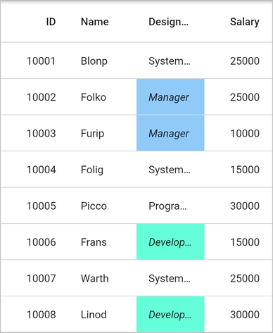
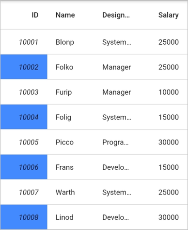
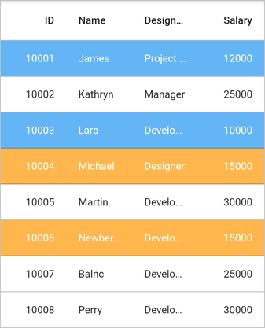
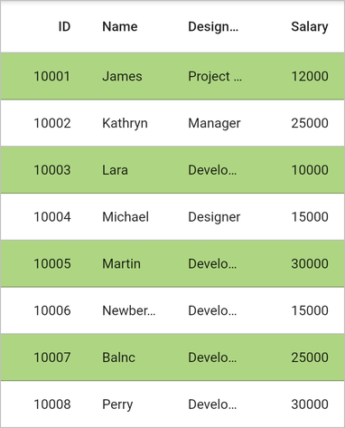

# Conditional Styling in Flutter DataGrid (SfDataGrid)

The [SfDataGrid](https://pub.dev/documentation/syncfusion_flutter_datagrid/latest/datagrid/SfDataGrid-class.html) allows customizing the style of individual cells and rows based on your requirements. You can customize your widget in the `DataGridSource.buildRow` method with the help of `DataGridRowAdapter`.

## Employee Model Class

The following examples use an `Employee` model class. Define it as shown below:

```dart
class Employee {
  Employee({
    required this.id,
    required this.name,
    required this.designation,
    required this.salary,
  });

  final int id;
  final String name;
  final String designation;
  final int salary;
}
```

## When to Use Cell-Level vs Row-Level Styling

- **Cell-level styling:** Use when you need to style specific cells based on their individual content or column type. This allows fine-grained control over individual cell appearance.
- **Row-level styling:** Use when you want to apply consistent styling across an entire row based on row data. This is more efficient for styling multiple cells at once.

## Cells

### Styling based on content

Customize the appearance of cells conditionally based on their content by defining custom widgets in the `DataGridRowAdapter.cells` property. In the example below, cells in the designation column are styled with different background colors and text styles based on their values.


 

  import 'package:syncfusion_flutter_datagrid/datagrid.dart';

  @override
  Widget build(BuildContext context) {
    return Scaffold(
      body: SfDataGrid(
        source: _employeeDataSource,
        columnWidthMode: ColumnWidthMode.lastColumnFill,
        columns: <GridColumn>[
          GridColumn(
            columnName: 'id',
            label: Container(
              padding: EdgeInsets.symmetric(horizontal: 16.0),
              alignment: Alignment.centerRight,
              child: Text(
                'ID',
                overflow: TextOverflow.ellipsis,
              )
            )
          ),
          GridColumn(
            columnName: 'name',
            label: Container(
              padding: EdgeInsets.symmetric(horizontal: 16.0),
              alignment: Alignment.centerLeft,
              child: Text(
                'Name',
                overflow: TextOverflow.ellipsis,
              )
            )
          ),
          GridColumn(
            columnName: 'designation',
            label: Container(
              padding: EdgeInsets.symmetric(horizontal: 16.0),
              alignment: Alignment.centerLeft,
              child: Text(
                'Designation',
                overflow: TextOverflow.ellipsis,
              )
            )
          ),
          GridColumn(
            columnName: 'salary',
            label: Container(
              padding: EdgeInsets.symmetric(horizontal: 16.0),
              alignment: Alignment.centerRight,
              child: Text(
                'Salary',
                overflow: TextOverflow.ellipsis,
              )
            )
          )
        ]
      )
    );
  }

class EmployeeDataSource extends DataGridSource {
  EmployeeDataSource(List<Employee> employees) {
    dataGridRows = employees
      .map<DataGridRow>((dataGridRow) => DataGridRow(cells: [
        DataGridCell<int>(columnName: 'id', value: dataGridRow.id),
        DataGridCell<String>(columnName: 'name', value: dataGridRow.name),
        DataGridCell<String>(
          columnName: 'designation', value: dataGridRow.designation),
        DataGridCell<int>(
          columnName: 'salary', value: dataGridRow.salary),
      ]))
      .toList();
  }

  List<DataGridRow> dataGridRows = [];

  @override
  List<DataGridRow> get rows => dataGridRows;

  @override
  DataGridRowAdapter? buildRow(DataGridRow row) {
    return DataGridRowAdapter(
      cells: row.getCells().map<Widget>((dataGridCell) {
        Color getColor() {
          if (dataGridCell.columnName == 'designation') {
            if (dataGridCell.value == 'Developer') {
              return Colors.tealAccent;
            } else if (dataGridCell.value == 'Manager') {
              return Colors.blue[200]!;
            }
          }
          return Colors.transparent;
        }

        TextStyle? getTextStyle() {
          if (dataGridCell.columnName == 'designation') {
            if (dataGridCell.value == 'Developer') {
              return TextStyle(fontStyle: FontStyle.italic);
            } else if (dataGridCell.value == 'Manager') {
              return TextStyle(fontStyle: FontStyle.italic);
            }
          }
          return null;
        }

        return Container(
          color: getColor(),
          alignment: (dataGridCell.columnName == 'id' ||
                    dataGridCell.columnName == 'salary')
              ? Alignment.centerRight
              : Alignment.centerLeft,
          padding: EdgeInsets.symmetric(horizontal: 16.0),
          child: Text(
            dataGridCell.value.toString(),
            overflow: TextOverflow.ellipsis,
            style: getTextStyle(),
          )
        );
      }).toList()
    );
  }
}






### Styling alternate cells

Customize the appearance of alternating cells in a column by using the `DataGridSource.buildRow` method and the `effectiveRows` property to determine the row index. The `effectiveRows` property contains the sorted collection of rows if sorting is applied.


 

class EmployeeDataSource extends DataGridSource {
  EmployeeDataSource(List<Employee> employees) {
    dataGridRows = employees
      .map<DataGridRow>((dataGridRow) => DataGridRow(cells: [
        DataGridCell<int>(columnName: 'id', value: dataGridRow.id),
        DataGridCell<String>(columnName: 'name', value: dataGridRow.name),
        DataGridCell<String>(
          columnName: 'designation', value: dataGridRow.designation),
        DataGridCell<int>(
          columnName: 'salary', value: dataGridRow.salary),
      ]))
      .toList();
  }

  List<DataGridRow> dataGridRows = [];

  @override
  List<DataGridRow> get rows => dataGridRows;

  @override
  DataGridRowAdapter? buildRow(DataGridRow row) {
    return DataGridRowAdapter(
      cells: row.getCells().map<Widget>((dataGridCell) {
        if (dataGridCell.columnName == 'id') {
          final int index = effectiveRows.indexOf(row);
          return Container(
            color: (index % 2 != 0) ? Colors.blueAccent : Colors.transparent,
            alignment: Alignment.centerRight,
            padding: EdgeInsets.symmetric(horizontal: 16.0),
            child: Text(
              dataGridCell.value.toString(),
              overflow: TextOverflow.ellipsis,
              style: (index % 2 != 0)
                ? TextStyle(fontStyle: FontStyle.italic)
                : null,
            )
          );
        }
        return Container(
          alignment: (dataGridCell.columnName == 'salary')
              ? Alignment.centerRight
              : Alignment.centerLeft,
          padding: EdgeInsets.symmetric(horizontal: 16.0),
          child: Text(
            dataGridCell.value.toString(),
            overflow: TextOverflow.ellipsis,
          )
        );
      }).toList()
    );
  }
}






## Rows

### Styling based on content

Customize the appearance of rows conditionally based on their content using the `DataGridRowAdapter.color` property. In the example below, rows are styled with different background and text colors based on salary values.


 

import 'package:syncfusion_flutter_datagrid/datagrid.dart';

class EmployeeDataSource extends DataGridSource {
  EmployeeDataSource(List<Employee> employees) {
    dataGridRows = employees
      .map<DataGridRow>((dataGridRow) => DataGridRow(cells: [
        DataGridCell<int>(columnName: 'id', value: dataGridRow.id),
        DataGridCell<String>(columnName: 'name', value: dataGridRow.name),
        DataGridCell<String>(
          columnName: 'designation', value: dataGridRow.designation),
        DataGridCell<int>(
          columnName: 'salary', value: dataGridRow.salary),
      ]))
      .toList();
  }

  List<DataGridRow> dataGridRows = [];

  @override
  List<DataGridRow> get rows => dataGridRows;

  @override
  DataGridRowAdapter buildRow(DataGridRow row) {
    Color getRowBackgroundColor() {
      final int salary = row.getCells()[3].value;
      if (salary >= 10000 && salary < 15000) {
        return Colors.blue[300]!;
      } else if (salary <= 15000) {
        return Colors.orange[300]!;
      }
      return Colors.transparent;
    }

    TextStyle? getTextStyle() {
      final int salary = row.getCells()[3].value;
      if (salary >= 10000 && salary < 15000) {
        return TextStyle(color: Colors.white);
      } else if (salary <= 15000) {
        return TextStyle(color: Colors.white);
      }
      return null;
    }

    return DataGridRowAdapter(
      color: getRowBackgroundColor(),
      cells: row.getCells().map<Widget>((dataGridCell) {
        return Container(
          alignment: (dataGridCell.columnName == 'id' ||
                     dataGridCell.columnName == 'salary')
              ? Alignment.centerRight
              : Alignment.centerLeft,
          padding: EdgeInsets.symmetric(horizontal: 16.0),
          child: Text(
            dataGridCell.value.toString(),
            overflow: TextOverflow.ellipsis,
            style: getTextStyle(),
          )
        );
      }).toList()
    );
  }
}






### Styling alternate rows

Customize the appearance of alternating rows in `SfDataGrid` using the `DataGridRowAdapter.color` property. Use the [effectiveRows](https://pub.dev/documentation/syncfusion_flutter_datagrid/latest/datagrid/DataGridSource/effectiveRows.html) property to get the row index. The `effectiveRows` collection contains sorted rows when sorting is applied, ensuring alternate row styling works correctly with sorted data.


 

import 'package:syncfusion_flutter_datagrid/datagrid.dart';

class EmployeeDataSource extends DataGridSource {
  EmployeeDataSource(List<Employee> employees) {
    dataGridRows = employees
        .map<DataGridRow>((dataGridRow) => DataGridRow(cells: [
              DataGridCell<int>(columnName: 'id', value: dataGridRow.id),
              DataGridCell<String>(columnName: 'name', value: dataGridRow.name),
              DataGridCell<String>(
                  columnName: 'designation', value: dataGridRow.designation),
              DataGridCell<int>(
                  columnName: 'salary', value: dataGridRow.salary),
            ]))
        .toList();
  }

  List<DataGridRow> dataGridRows = [];

  @override
  List<DataGridRow> get rows => dataGridRows;

  @override
  DataGridRowAdapter? buildRow(DataGridRow row) {
    Color getRowBackgroundColor() {
      final int index = effectiveRows.indexOf(row);
      if (index % 2 != 0) {
        return Colors.lightGreen[300]!;
      }

      return Colors.transparent;
    }

    return DataGridRowAdapter(
        color: getRowBackgroundColor(),
        cells: row.getCells().map<Widget>((dataGridCell) {
          return Container(
              alignment: (dataGridCell.columnName == 'id' ||
                      dataGridCell.columnName == 'salary')
                  ? Alignment.centerRight
                  : Alignment.centerLeft,
              padding: EdgeInsets.symmetric(horizontal: 16.0),
              child: Text(
                dataGridCell.value.toString(),
                overflow: TextOverflow.ellipsis,
              ));
        }).toList());
  }
}





