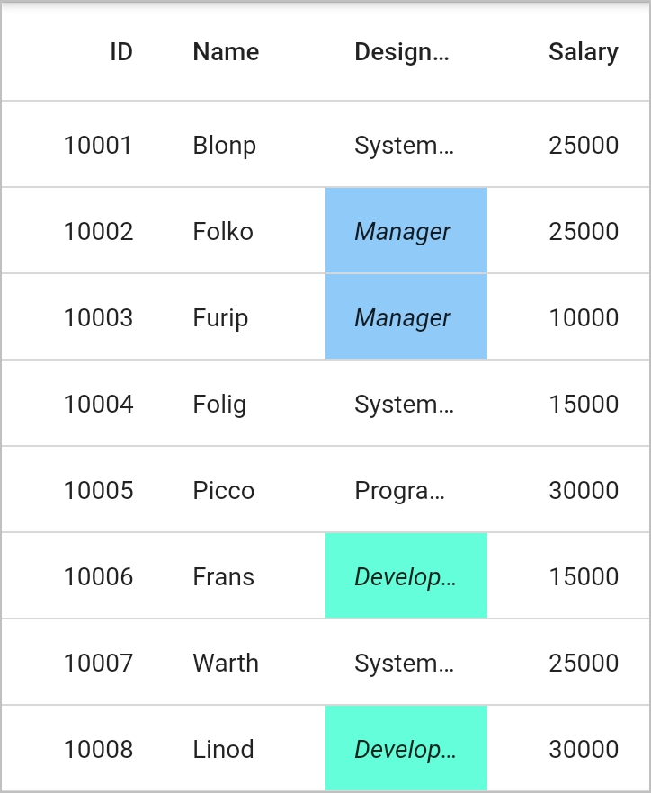
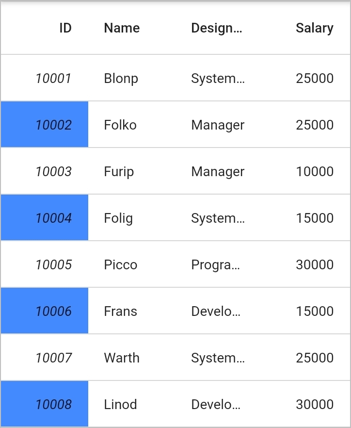
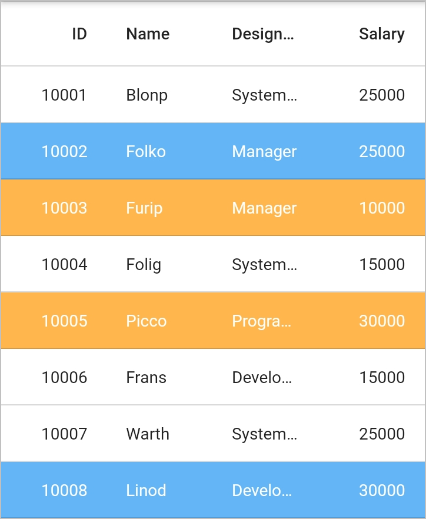
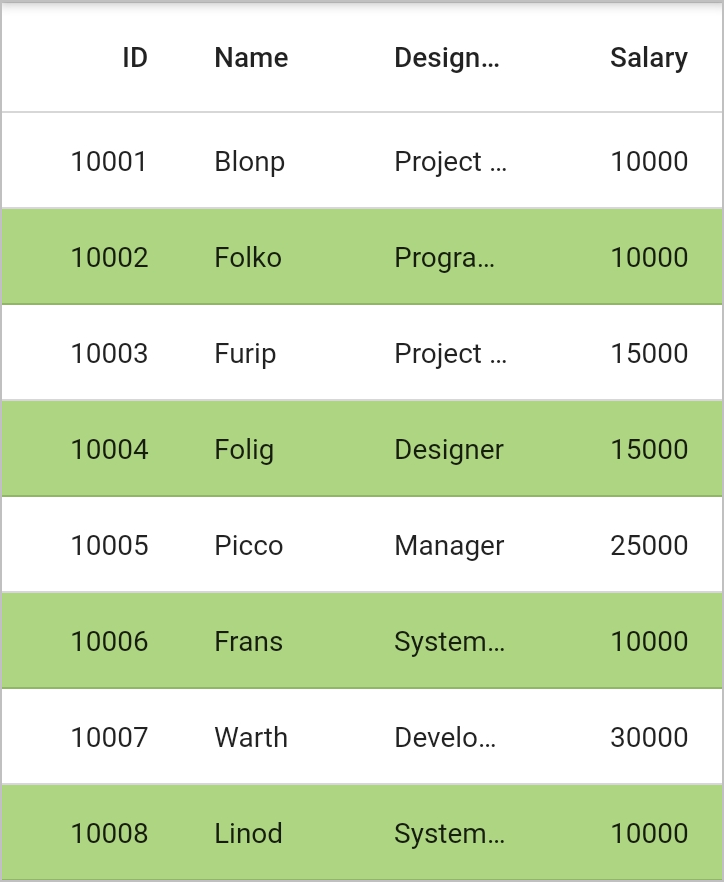

# Conditional Styling

The SfDataGrid allows to customize the style of the individual cells and rows based on the requirements. It can be customized in the following ways:

* Using `onQueryCellStyle` Callback
* Using `onQueryRowStyle` Callback

## Cells

### Styling based on Content

The appearance of the cells in SfDataGrid can be customized conditionally based on the content by handling the `SfDataGrid.onQueryCellStyle` callback.


 

    final EmployeeDataSource _employeeDataSource = EmployeeDataSource();

    @override
    Widget build(BuildContext context) {
      return Scaffold(
        body: SfDataGrid(
            source: _employeeDataSource,
            columns: <GridColumn>[
              GridNumericColumn(mappingName: 'id')..headerText = 'Order ID',
              GridTextColumn(mappingName: 'name')..headerText = 'Name',
              GridTextColumn(mappingName: 'designation')
                ..headerText = 'Designation',
              GridNumericColumn(mappingName: 'salary')..headerText = 'Salary'
            ],
            onQueryCellStyle: (QueryCellStyleArgs args) {
              if (args.column.mappingName == 'designation') {
                if (args.cellValue == 'Developer') {
                  return DataGridCellStyle(
                      textStyle: TextStyle(fontStyle: FontStyle.italic),
                      backgroundColor: Colors.tealAccent);
                } else if (args.cellValue == 'Manager') {
                  return DataGridCellStyle(
                      textStyle: TextStyle(fontStyle: FontStyle.italic),
                      backgroundColor: Colors.blue[200]);
                }
              }
              return null;
            }),
      );
    }
    



### Styling Alternate Cells

The appearance of the alternating cells in a column can be customized conditionally by using the `SfDataGrid.onQueryCellStyle` callback.


 

    final EmployeeDataSource _employeeDataSource = EmployeeDataSource();

    @override
    Widget build(BuildContext context) {
      return Scaffold(
        body: SfDataGrid(
            source: _employeeDataSource,
            columns: <GridColumn>[
              GridNumericColumn(mappingName: 'id')..headerText = 'Order ID',
              GridTextColumn(mappingName: 'name')..headerText = 'Name',
              GridTextColumn(mappingName: 'designation')
                ..headerText = 'Designation',
              GridNumericColumn(mappingName: 'salary')..headerText = 'Salary',
            ],
            onQueryCellStyle: (QueryCellStyleArgs args) {
              if (args.column.mappingName == 'id') {
                if (args.rowIndex % 2 == 0) {
                  return DataGridCellStyle(
                      textStyle: TextStyle(fontStyle: FontStyle.italic),
                      backgroundColor: Colors.blueAccent);
                } else {
                  return DataGridCellStyle(
                      textStyle: TextStyle(fontStyle: FontStyle.italic),
                      backgroundColor: Colors.white);
                }
              }
              return null;
            }),
      );
    }
    



## Rows

### Styling based on Content

The appearance of the rows in SfDataGrid can be customized conditionally based on the content by handling the `SfDataGrid.onQueryRowStyle` callback.


 

    final EmployeeDataSource _employeeDataSource = EmployeeDataSource();
      
    @override
    Widget build(BuildContext context) {
      return Scaffold(
        body: SfDataGrid(
          source: _employeeDataSource,
          columns: <GridColumn>[
             GridNumericColumn(mappingName: 'id')..headerText = 'Order ID',
             GridTextColumn(mappingName: 'name')..headerText = 'Name',
             GridTextColumn(mappingName: 'designation')
               ..headerText = 'Designation',
             GridNumericColumn(mappingName: 'salary')..headerText = 'Salary',                
          ],
          onQueryRowStyle: (QueryRowStyleArgs args) {
          Employee employee = _employeeCollection[args.rowIndex];
          if (employee.salary >= 10000 && employee.salary < 15000) {
            return DataGridCellStyle(
                textStyle: TextStyle(color: Colors.white)
                backgroundColor: Colors.blue[300]);
          } else if (employee.salary <= 15000) {
            return DataGridCellStyle(
                textStyle: TextStyle(color: Colors.white)
                backgroundColor: Colors.orange[300]);
          }
          return null;
        }),
      );
    }
    



### Styling Alternate Rows

The appearance of the alternating rows in SfDataGrid can be customized by using the `SfDataGrid.onQueryRowStyle` callback.


 
    
    final EmployeeDataSource _employeeDataSource = EmployeeDataSource();

    @override
    Widget build(BuildContext context) {
      return Scaffold(
        body: SfDataGrid(
            source: _employeeDataSource,
            columns: <GridColumn>[
              GridNumericColumn(mappingName: 'id')..headerText = 'Order ID',
              GridTextColumn(mappingName: 'name')..headerText = 'Name',
              GridNumericColumn(mappingName: 'salary')..headerText = 'Salary',
              GridTextColumn(mappingName: 'designation')
                ..headerText = 'Designation',
            ],
            onQueryRowStyle: (QueryRowStyleArgs args) {
              if (args.rowIndex >= 0 && args.rowIndex <= 10) {
                if (args.rowIndex % 2 == 0) {
                  return DataGridCellStyle(
                      backgroundColor: Colors.lightGreen[300]);
                } else {
                  return DataGridCellStyle(backgroundColor: Colors.white);
                }
              }
              return null;
            }),
      );
    }




