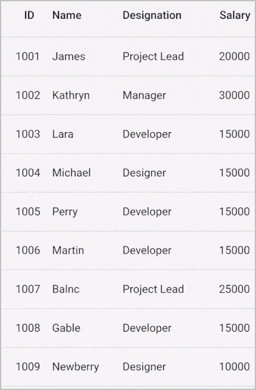
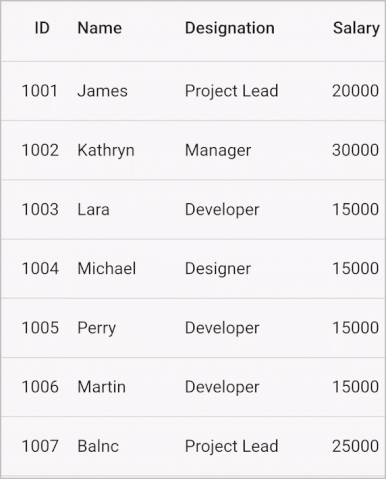
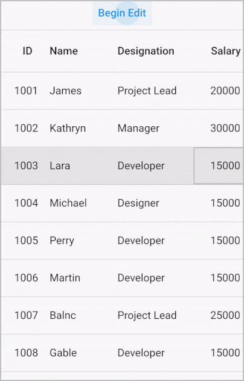

# Editing in Flutter DataGrid

The [SfDataGrid](https://pub.dev/documentation/syncfusion_flutter_datagrid/latest/datagrid/SfDataGrid-class.html) supports editing the cell values by setting the [SfDataGrid.allowEditing](https://pub.dev/documentation/syncfusion_flutter_datagrid/latest/datagrid/SfDataGrid/allowEditing.html) property to true, [SfDataGrid.navigationMode](https://pub.dev/documentation/syncfusion_flutter_datagrid/latest/datagrid/SfDataGrid/navigationMode.html) to cell, and [SfDataGrid.selectionMode](https://pub.dev/documentation/syncfusion_flutter_datagrid/latest/datagrid/SfDataGrid/selectionMode.html) to a value other than none.

By default, the [SfDataGrid](https://pub.dev/documentation/syncfusion_flutter_datagrid/latest/datagrid/SfDataGrid-class.html) does not load any widget when a cell enters edit mode. You must provide the required widget when a cell enters edit mode by returning it through the [DataGridSource.buildEditWidget](https://pub.dev/documentation/syncfusion_flutter_datagrid/latest/datagrid/DataGridSource/buildEditWidget.html) method in the [DataGridSource](https://pub.dev/documentation/syncfusion_flutter_datagrid/latest/datagrid/DataGridSource/DataGridSource.html) class.

The following arguments are passed in the `buildEditWidget` method.

* [row](https://pub.dev/documentation/syncfusion_flutter_datagrid/latest/datagrid/DataGridRow-class.html): Gets the DataGridRow of the SfDataGrid.
* [rowColumnIndex](https://pub.dev/documentation/syncfusion_flutter_datagrid/latest/datagrid/RowColumnIndex-class.html): Gets the current row and column index of the DataGrid.
* [column](https://pub.dev/documentation/syncfusion_flutter_datagrid/latest/datagrid/GridColumn-class.html): Gets the Grid Column of the SfDataGrid.
* [submitCell](https://pub.dev/documentation/syncfusion_flutter_datagrid/latest/datagrid/CellSubmit.html): Programmatically call to end the editing. Typically, this method can be called when the widget completes its editing. For example, `TextField.onSubmitted` method is called whenever TextField ends its editing. So, you can simply call submitCell method. This will automatically call the DataGridSource.

We recommend saving the edited value through the editor widgets in the [DataGridSource.onCellSubmit](https://pub.dev/documentation/syncfusion_flutter_datagrid/latest/datagrid/DataGridSource/onCellSubmit.html) method. The `onCellSubmit` method will be called whenever the [submitCell](https://pub.dev/documentation/syncfusion_flutter_datagrid/latest/datagrid/CellSubmit.html) method from the [buildEditWidget](https://pub.dev/documentation/syncfusion_flutter_datagrid/latest/datagrid/DataGridSource/buildEditWidget.html) method is called, or when other cells are navigated while a cell is in edit mode.

The following example shows how to enable editing in Datagrid and commit the edited cell value in the `onCellSubmit` method.

> **Note:** The `firstWhereOrNull` method is from the [collection](https://pub.dev/packages/collection) package. Add it to your `pubspec.yaml` dependencies and import with `import 'package:collection/collection.dart';`




import 'package:flutter/material.dart';
import 'package:syncfusion_flutter_datagrid/datagrid.dart';
import 'package:collection/collection.dart';

  @override
  Widget build(BuildContext context) {
    return Scaffold(
      body: SfDataGrid(
        source: _employeeDataSource,
        allowEditing: true,
        selectionMode: SelectionMode.single,
        navigationMode: GridNavigationMode.cell,
        columns: [
          GridColumn(
            columnName: 'id',
            label: Container(
              padding: EdgeInsets.symmetric(horizontal: 16.0),
              alignment: Alignment.centerRight,
              child: Text('ID', overflow: TextOverflow.ellipsis),
            ),
          ),
          GridColumn(
            columnName: 'name',
            label: Container(
              padding: EdgeInsets.symmetric(horizontal: 16.0),
              alignment: Alignment.centerLeft,
              child: Text('Name', overflow: TextOverflow.ellipsis),
            ),
          ),
          GridColumn(
            columnName: 'designation',
            label: Container(
              padding: EdgeInsets.symmetric(horizontal: 16.0),
              alignment: Alignment.centerLeft,
              child: Text('Designation', overflow: TextOverflow.ellipsis),
            ),
          ),
          GridColumn(
            columnName: 'salary',
            label: Container(
              padding: EdgeInsets.symmetric(horizontal: 16.0),
              alignment: Alignment.centerRight,
              child: Text('Salary', overflow: TextOverflow.ellipsis),
            ),
          ),
        ],
      ),
    );
  }

class EmployeeDataSource extends DataGridSource {
  /// Holds the underlying data for the DataGrid
  late List<Employee> _employees;

  /// Stores the new value of the edited cell
  dynamic newCellValue;

  /// Controls the editable text in the [TextField] widget
  TextEditingController editingController = TextEditingController();

  EmployeeDataSource({required List<Employee> employeeData}) {
    _employees = employeeData;

    dataGridRows = _employees.map<DataGridRow>((Employee employee) {
      return DataGridRow(
        cells: <DataGridCell>[
          DataGridCell<int>(columnName: 'id', value: employee.id),
          DataGridCell<String>(columnName: 'name', value: employee.name),
          DataGridCell<String>(
            columnName: 'designation',
            value: employee.designation,
          ),
          DataGridCell<int>(columnName: 'salary', value: employee.salary),
        ],
      );
    }).toList();
  }

  /// List to store DataGridRow objects
  late List<DataGridRow> dataGridRows;

  @override
  Future<void> onCellSubmit(
    DataGridRow dataGridRow,
    RowColumnIndex rowColumnIndex,
    GridColumn column,
  ) async {
    final dynamic oldValue =
        dataGridRow
            .getCells()
            .firstWhereOrNull(
              (DataGridCell dataGridCell) =>
                  dataGridCell.columnName == column.columnName,
            )
            ?.value ??
        '';
    final int dataRowIndex = dataGridRows.indexOf(dataGridRow);

    if (newCellValue == null || oldValue == newCellValue) {
      return;
    }

    if (column.columnName == 'id') {
      dataGridRows[dataRowIndex].getCells()[rowColumnIndex.columnIndex] =
          DataGridCell<int>(columnName: 'id', value: newCellValue);
      _employees[dataRowIndex].id = newCellValue as int;
    } else if (column.columnName == 'name') {
      dataGridRows[dataRowIndex].getCells()[rowColumnIndex.columnIndex] =
          DataGridCell<String>(columnName: 'name', value: newCellValue);
      _employees[dataRowIndex].name = newCellValue.toString();
    } else if (column.columnName == 'designation') {
      dataGridRows[dataRowIndex].getCells()[rowColumnIndex.columnIndex] =
          DataGridCell<String>(columnName: 'designation', value: newCellValue);
      _employees[dataRowIndex].designation = newCellValue.toString();
    } else {
      dataGridRows[dataRowIndex].getCells()[rowColumnIndex.columnIndex] =
          DataGridCell<int>(columnName: 'salary', value: newCellValue);
      _employees[dataRowIndex].salary = newCellValue as int;
    }
  }

  @override
  List<DataGridRow> get rows => dataGridRows;

  @override
  DataGridRowAdapter buildRow(DataGridRow row) {
    return DataGridRowAdapter(
      cells: row.getCells().map<Widget>((DataGridCell cell) {
        return Container(
          padding: const EdgeInsets.symmetric(horizontal: 16.0),
          alignment: (cell.columnName == 'id' || cell.columnName == 'salary')
              ? Alignment.centerRight
              : Alignment.centerLeft,
          child: Text(cell.value.toString()),
        );
      }).toList(),
    );
  }

  @override
  Widget? buildEditWidget(
    DataGridRow dataGridRow,
    RowColumnIndex rowColumnIndex,
    GridColumn column,
    CellSubmit submitCell,
  ) {
    // Text going to display on editable widget
    final String displayText =
        dataGridRow
            .getCells()
            .firstWhereOrNull(
              (DataGridCell dataGridCell) =>
                  dataGridCell.columnName == column.columnName,
            )
            ?.value
            ?.toString() ??
        '';

    // The new cell value must be reset.
    // To avoid committing the [DataGridCell] value that was previously edited
    // into the current non-modified [DataGridCell].
    newCellValue = null;

    final bool isNumericType =
        column.columnName == 'id' || column.columnName == 'salary';

    return Container(
      padding: const EdgeInsets.all(8.0),
      alignment: isNumericType ? Alignment.centerRight : Alignment.centerLeft,
      child: TextField(
        autofocus: true,
        controller: editingController..text = displayText,
        textAlign: isNumericType ? TextAlign.right : TextAlign.left,
        decoration: InputDecoration(
          contentPadding: const EdgeInsets.fromLTRB(0, 0, 0, 16.0),
        ),
        keyboardType: isNumericType ? TextInputType.number : TextInputType.text,
        onChanged: (String value) {
          if (value.isNotEmpty) {
            if (isNumericType) {
              newCellValue = int.parse(value);
            } else {
              newCellValue = value;
            }
          } else {
            newCellValue = null;
          }
        },
        onSubmitted: (String value) {
          // In Mobile Platform.
          // Call [CellSubmit] callback to fire the canSubmitCell and
          // onCellSubmit to commit the new value in single place.
          submitCell();
        },
      ),
    );
  }
}




> **Note:** The `TextEditingController` used in the example should be disposed to free up resources. Consider implementing disposal in your State class: `@override void dispose() { editingController.dispose(); super.dispose(); }`

> **Reference:** Download demo application from [GitHub](https://github.com/SyncfusionExamples/how-to-perform-editing-in-flutter-datatable-sfdatagrid).

## Disable the editing for the specific column

To disable the editing for a particular column, set the [GridColumn.allowEditing](https://pub.dev/documentation/syncfusion_flutter_datagrid/latest/datagrid/GridColumn/allowEditing.html) property as `false`.




  @override
  Widget build(BuildContext context) {
    return Scaffold(
      body: SfDataGrid(
        source: _employeeDataSource,
        allowEditing: true,
        selectionMode: SelectionMode.single,
        navigationMode: GridNavigationMode.cell,
        columns: [
          GridColumn(
            columnName: 'id',
            allowEditing: false,
            label: Container(
              padding: EdgeInsets.symmetric(horizontal: 16.0),
              alignment: Alignment.centerRight,
              child: Text(
                'ID',
                overflow: TextOverflow.ellipsis,
              )
            )
          ),
          GridColumn(
            columnName: 'name',
            label: Container(
              padding: EdgeInsets.symmetric(horizontal: 16.0),
              alignment: Alignment.centerLeft,
              child: Text(
                'Name',
                overflow: TextOverflow.ellipsis,
              )
            )
          ),
          GridColumn(
            columnName: 'designation',
            label: Container(
              padding: EdgeInsets.symmetric(horizontal: 16.0),
              alignment: Alignment.centerLeft,
              child: Text(
                'Designation',
                overflow: TextOverflow.ellipsis,
              )
            )
          ),
          GridColumn(
            columnName: 'salary',
            label: Container(
              padding: EdgeInsets.symmetric(horizontal: 16.0),
              alignment: Alignment.centerRight,
              child: Text(
                'Salary',
                overflow: TextOverflow.ellipsis,
              )
            )
          )
        ]
      )
    );
  }




> **Note:** Download demo application from [GitHub](https://github.com/SyncfusionExamples/how-to-perform-editing-in-flutter-datatable-sfdatagrid).

## Entering edit mode

The [SfDataGrid.editingGestureType](https://pub.dev/documentation/syncfusion_flutter_datagrid/latest/datagrid/SfDataGrid/editingGestureType.html) property controls how a cell enters edit mode. The available options are:

* **doubleTap**: Cell enters edit mode on double-tap (default behavior)
* **tap**: Cell enters edit mode on single tap
* **longPress**: Cell enters edit mode on long press

By default, a cell will enter edit mode when you double-tap it. To enable editing with a single tap, set the [SfDataGrid.editingGestureType](https://pub.dev/documentation/syncfusion_flutter_datagrid/latest/datagrid/SfDataGrid/editingGestureType.html) property to tap.




  @override
  Widget build(BuildContext context) {
    return Scaffold(
      body: SfDataGrid(
        source: _employeeDataSource,
        allowEditing: true,
        selectionMode: SelectionMode.single,
        navigationMode: GridNavigationMode.cell,
        editingGestureType: EditingGestureType.tap,
        columns: [
          GridColumn(
            columnName: 'id',
            label: Container(
              padding: EdgeInsets.symmetric(horizontal: 16.0),
              alignment: Alignment.centerRight,
              child: Text(
                'ID',
                overflow: TextOverflow.ellipsis,
              )
            )
          ),
          GridColumn(
            columnName: 'name',
            label: Container(
              padding: EdgeInsets.symmetric(horizontal: 16.0),
              alignment: Alignment.centerLeft,
              child: Text(
                'Name',
                overflow: TextOverflow.ellipsis,
              )
            )
          ),
          GridColumn(
            columnName: 'designation',
            label: Container(
              padding: EdgeInsets.symmetric(horizontal: 16.0),
              alignment: Alignment.centerLeft,
              child: Text(
                'Designation',
                overflow: TextOverflow.ellipsis,
              )
            )
          ),
          GridColumn(
            columnName: 'salary',
            label: Container(
              padding: EdgeInsets.symmetric(horizontal: 16.0),
              alignment: Alignment.centerRight,
              child: Text(
                'Salary',
                overflow: TextOverflow.ellipsis,
              )
            )
          )
        ]
      )
    );
  }




## Methods

> **Note:** The editing life cycle consists of three key methods: `onCellBeginEdit` (called when entering edit mode), `canSubmitCell` (called before exiting edit mode for validation), and `onCellSubmit` (called when changes are confirmed). All methods are asynchronous-capable.

### onCellBeginEdit

The [DataGridSource.onCellBeginEdit](https://pub.dev/documentation/syncfusion_flutter_datagrid/latest/datagrid/DataGridSource/onCellBeginEdit.html) method is called when a cell enters edit mode. This is a synchronous method where you can prevent specific cells from entering edit mode by returning `false`. The following arguments are passed in this method:

* [row](https://pub.dev/documentation/syncfusion_flutter_datagrid/latest/datagrid/DataGridRow-class.html): Gets the DataGridRow of the SfDataGrid.
* [rowColumnIndex](https://pub.dev/documentation/syncfusion_flutter_datagrid/latest/datagrid/RowColumnIndex-class.html): Gets the current row and column index of the DataGrid.
* [column](https://pub.dev/documentation/syncfusion_flutter_datagrid/latest/datagrid/GridColumn-class.html): Gets the Grid Column of the SfDataGrid.




class EmployeeDataSource extends DataGridSource {
  @override
  bool onCellBeginEdit(
      DataGridRow dataGridRow, RowColumnIndex rowColumnIndex, GridColumn column) {
    if (column.columnName == 'id') {
      // Return false, to restrict entering into the editing.
      return false;
    } else {
      return true;
    }
  }
}




### canSubmitCell

The [DataGridSource.canSubmitCell](https://pub.dev/documentation/syncfusion_flutter_datagrid/latest/datagrid/DataGridSource/canSubmitCell.html) method is called before the cell exits edit mode. This is an asynchronous method used for validating the edited value. If validation fails, return `false` to retain the cell in edit mode. The [onCellSubmit](https://pub.dev/documentation/syncfusion_flutter_datagrid/latest/datagrid/DataGridSource/onCellSubmit.html) method will only be called if `canSubmitCell` returns `true`. The following arguments are passed in this method:

* [row](https://pub.dev/documentation/syncfusion_flutter_datagrid/latest/datagrid/DataGridRow-class.html): Gets the DataGridRow of the SfDataGrid.
* [rowColumnIndex](https://pub.dev/documentation/syncfusion_flutter_datagrid/latest/datagrid/RowColumnIndex-class.html): Gets the current row and column index of the DataGrid.
* [column](https://pub.dev/documentation/syncfusion_flutter_datagrid/latest/datagrid/GridColumn-class.html): Gets the Grid Column of the SfDataGrid.




class EmployeeDataSource extends DataGridSource {
  @override
  Future<bool> canSubmitCell(DataGridRow dataGridRow, RowColumnIndex rowColumnIndex,
      GridColumn column) async {
    if (column.columnName == 'id' && newCellValue == null) {
      // Return false to retain in edit mode and prevent null values
      return false;
    } 
    if (column.columnName == 'salary' && newCellValue is int) {
      // Validate salary value is within acceptable range
      if (newCellValue < 0 || newCellValue > 1000000) {
        return false; // Invalid salary, retain edit mode
      }
    }
    return true;
  }
}




> **Note:** To display validation error messages to users, consider showing a snackbar or dialog in the `canSubmitCell` method when returning `false`, or use a validation field overlay on the edit widget in `buildEditWidget`.

### onCellSubmit

The [DataGridSource.onCellSubmit](https://pub.dev/documentation/syncfusion_flutter_datagrid/latest/datagrid/DataGridSource/onCellSubmit.html) method is called when the editing is completed and validation passes. This is an asynchronous method where you should save the edited values to your underlying data collection. The UI automatically refreshes after changes are committed.

> **Note:** There is no need to call the `notifyListeners` after you update the DataGridRows. DataGrid will refresh the UI automatically.




class EmployeeDataSource extends DataGridSource {
  @override
  Future<void> onCellSubmit(DataGridRow dataGridRow, RowColumnIndex rowColumnIndex,
      GridColumn column) {
    final dynamic oldValue = dataGridRow
            .getCells()
            .firstWhereOrNull((DataGridCell dataGridCell) =>
                dataGridCell.columnName == column.columnName)
            ?.value ??
        '';

    final int dataRowIndex = dataGridRows.indexOf(dataGridRow);

    if (newCellValue == null || oldValue == newCellValue) {
      return;
    }

    if (column.columnName == 'id') {
      dataGridRows[dataRowIndex].getCells()[rowColumnIndex.columnIndex] =
          DataGridCell<int>(columnName: 'id', value: newCellValue);
      _employees[dataRowIndex].id = newCellValue as int;
    } else if (column.columnName == 'name') {
      dataGridRows[dataRowIndex].getCells()[rowColumnIndex.columnIndex] =
          DataGridCell<String>(columnName: 'name', value: newCellValue);
      _employees[dataRowIndex].name = newCellValue.toString();
    } else if (column.columnName == 'designation') {
      dataGridRows[dataRowIndex].getCells()[rowColumnIndex.columnIndex] =
          DataGridCell<String>(columnName: 'designation', value: newCellValue);
      _employees[dataRowIndex].designation = newCellValue.toString();
    } else {
      dataGridRows[dataRowIndex].getCells()[rowColumnIndex.columnIndex] =
          DataGridCell<int>(columnName: 'salary', value: newCellValue);
      _employees[dataRowIndex].salary = newCellValue as int;
    }
  }
}




### onCellCancelEdit

The [DataGridSource.onCellCancelEdit](https://pub.dev/documentation/syncfusion_flutter_datagrid/latest/datagrid/DataGridSource/onCellCancelEdit.html) method is called when editing is canceled. This occurs when the `Esc` key is pressed on Web and Desktop platforms. When this method is called, the [canSubmitCell](https://pub.dev/documentation/syncfusion_flutter_datagrid/latest/datagrid/DataGridSource/canSubmitCell.html) and [onCellSubmit](https://pub.dev/documentation/syncfusion_flutter_datagrid/latest/datagrid/DataGridSource/onCellSubmit.html) methods are not called. Focus returns to the DataGrid after cancellation.

> **Note:** You do not need to call `notifyListeners` inside this method as the UI automatically handles state updates.




class EmployeeDataSource extends DataGridSource {
  @override
  void onCellCancelEdit(DataGridRow dataGridRow, RowColumnIndex rowColumnIndex,
      GridColumn column) {
    // handle the cancel editing code here
  }
}




## Programmatic editing

### BeginEdit

The SfDataGrid allows moving the cell into edit mode programmatically by calling the [DataGridController.beginEdit](https://pub.dev/documentation/syncfusion_flutter_datagrid/latest/datagrid/DataGridController/beginEdit.html) method.




  final DataGridController _dataGridController = DataGridController();

  @override
  Widget build(BuildContext context) {
    return Scaffold(
      body: Column(
        children: [
          TextButton(
            child: Text("Begin Edit"),
            onPressed: () {
              _dataGridController.beginEdit(RowColumnIndex(2, 3));
            }
          ),
          Expanded(
            child: SfDataGrid(
              source: _employeeDataSource,
              allowEditing: true,
              selectionMode: SelectionMode.single,
              navigationMode: GridNavigationMode.cell,
              controller: _dataGridController,
              columns: [
                GridColumn(
                  columnName: 'id',
                  label: Container(
                    padding: EdgeInsets.symmetric(horizontal: 16.0),
                    alignment: Alignment.centerRight,
                    child: Text(
                      'ID',
                      overflow: TextOverflow.ellipsis,
                    )
                  )
                ),
                GridColumn(
                  columnName: 'name',
                  label: Container(
                    padding: EdgeInsets.symmetric(horizontal: 16.0),
                    alignment: Alignment.centerLeft,
                    child: Text(
                      'Name',
                      overflow: TextOverflow.ellipsis,
                    )
                  )
                ),
                GridColumn(
                  columnName: 'designation',
                  label: Container(
                    padding: EdgeInsets.symmetric(horizontal: 16.0),
                    alignment: Alignment.centerLeft,
                    child: Text(
                      'Designation',
                      overflow: TextOverflow.ellipsis,
                    )
                  )
                ),
                GridColumn(
                  columnName: 'salary',
                  label: Container(
                    padding: EdgeInsets.symmetric(horizontal: 16.0),
                    alignment: Alignment.centerRight,
                    child: Text(
                      'Salary',
                      overflow: TextOverflow.ellipsis,
                    )
                  )
                )
              ]
            )
          )
        ]
      )
    );
  }




> **Note:** Download the complete programmatic editing demo from [GitHub](https://github.com/SyncfusionExamples/how-to-perform-editing-in-flutter-datatable-sfdatagrid).

### EndEdit

The [SfDataGrid.endEdit](https://pub.dev/documentation/syncfusion_flutter_datagrid/latest/datagrid/DataGridController/endEdit.html) method can be called to programmatically end the editing for a specific cell.




  final DataGridController _dataGridController = DataGridController();

  @override
  Widget build(BuildContext context) {
    return Scaffold(
      body: Column(
        children: [
          TextButton(
            child: Text("End Edit"),
            onPressed: () {
              _dataGridController.endEdit();
            }
          ),
          Expanded(
            child: SfDataGrid(
              source: _employeeDataSource,
              allowEditing: true,
              selectionMode: SelectionMode.single,
              navigationMode: GridNavigationMode.cell,
              controller: _dataGridController,
              columns: [
                GridColumn(
                  columnName: 'id',
                  label: Container(
                    padding: EdgeInsets.symmetric(horizontal: 16.0),
                    alignment: Alignment.centerRight,
                    child: Text(
                      'ID',
                      overflow: TextOverflow.ellipsis,
                    )
                  )
                ),
                GridColumn(
                  columnName: 'name',
                  label: Container(
                    padding: EdgeInsets.symmetric(horizontal: 16.0),
                    alignment: Alignment.centerLeft,
                    child: Text(
                      'Name',
                      overflow: TextOverflow.ellipsis,
                    )
                  )
                ),
                GridColumn(
                  columnName: 'designation',
                  label: Container(
                    padding: EdgeInsets.symmetric(horizontal: 16.0),
                    alignment: Alignment.centerLeft,
                    child: Text(
                      'Designation',
                      overflow: TextOverflow.ellipsis,
                    )
                  )
                ),
                GridColumn(
                  columnName: 'salary',
                  label: Container(
                    padding: EdgeInsets.symmetric(horizontal: 16.0),
                    alignment: Alignment.centerRight,
                    child: Text(
                      'Salary',
                      overflow: TextOverflow.ellipsis,
                    )
                  )
                )
              ]
            )
          )
        ]
      )
    );
  }




## How to check whether the current cell is in editing mode

You can check whether the current cell is in editing mode by using the [DataGridController.isCurrentCellInEditing](https://pub.dev/documentation/syncfusion_flutter_datagrid/latest/datagrid/DataGridController/isCurrentCellInEditing.html) property. This read-only boolean property returns `true` if a cell is currently in edit mode, and `false` otherwise.




  final DataGridController _dataGridController = DataGridController();

  @override
  Widget build(BuildContext context) {
    return Scaffold(
      appBar: AppBar(
        title: const Text('SfDataGrid Editing'),
      ),
      body: Column(
        children: [
          TextButton(
            onPressed: () {
              showDialog(
                context: context,
                builder: (context) => AlertDialog(
                  content: Text(
                    'Cell is in Edit Mode: ${_dataGridController.isCurrentCellInEditing}'),
                )
              );
            },
            child: const Text('In Edit Mode')
          ),
          Expanded(
            child: SfDataGrid(
              source: _employeeDataSource,
              allowEditing: true,
              controller: _dataGridController,
              selectionMode: SelectionMode.single,
              navigationMode: GridNavigationMode.cell,
              columnWidthMode: ColumnWidthMode.fitByCellValue,
              editingGestureType: EditingGestureType.tap,
              columns: [
                GridColumn(
                  columnName: 'id',
                  label: Container(
                    padding: const EdgeInsets.symmetric(horizontal: 16.0),
                    alignment: Alignment.center,
                    child: const Text(
                      'ID',
                      overflow: TextOverflow.ellipsis,
                    )
                  )
                ),
                GridColumn(
                  columnName: 'name',
                  label: Container(
                    padding: const EdgeInsets.symmetric(horizontal: 16.0),
                    alignment: Alignment.center,
                    child: const Text(
                      'Name',
                      overflow: TextOverflow.ellipsis,
                    )
                  )
                ),
                GridColumn(
                  columnName: 'designation',
                  label: Container(
                    padding: const EdgeInsets.symmetric(horizontal: 16.0),
                    alignment: Alignment.center,
                    child: const Text(
                      'Designation',
                      overflow: TextOverflow.ellipsis,
                    )
                  )
                ),
                GridColumn(
                  columnName: 'salary',
                  label: Container(
                    padding: const EdgeInsets.symmetric(horizontal: 16.0),
                    alignment: Alignment.center,
                    child: const Text(
                      'Salary',
                      overflow: TextOverflow.ellipsis,
                    )
                  )
                )
              ],
            ),
          ),
        ],
      ),
    );
  }




## Prevent editing for specific cells or columns

To prevent editing for specific cells or columns at runtime, override the [onCellBeginEdit](https://pub.dev/documentation/syncfusion_flutter_datagrid/latest/datagrid/DataGridSource/onCellBeginEdit.html) method in the `DataGridSource` class and return `false` for the cells or columns you want to protect.




class EmployeeDataSource extends DataGridSource {
  @override
  bool onCellBeginEdit(DataGridRow dataGridRow, RowColumnIndex rowColumnIndex,
      GridColumn column) {

    // Editing prevented for the cell at RowColumnIndex(2,2).
    if (rowColumnIndex.equals(RowColumnIndex(2, 2))) {
      return false;
    } else {
      return true;
    }
  }
}




The following code example shows how to prevent a specific column from being entered into edit mode:




class EmployeeDataSource extends DataGridSource {
  @override
  bool onCellBeginEdit(DataGridRow dataGridRow, RowColumnIndex rowColumnIndex,
      GridColumn column) {
    if (column.columnName == 'id' || column.columnName == 'salary') {
      return false;
    } else {
      return true;
    }
  }
}




## Cancel edited cell value from being committed

You can override the [canSubmitCell](https://pub.dev/documentation/syncfusion_flutter_datagrid/latest/datagrid/DataGridSource/canSubmitCell.html) method from the [DataGridSource](https://pub.dev/documentation/syncfusion_flutter_datagrid/latest/datagrid/DataGridSource-class.html) class and return `false` based on your validation criteria. When `canSubmitCell` returns `false`, the edited cell retains focus and edit mode, preventing the user from navigating away until the input is corrected.




class EmployeeDataSource extends DataGridSource {
  @override
  Future<bool> canSubmitCell(DataGridRow dataGridRow, RowColumnIndex rowColumnIndex,
      GridColumn column) {
    if (newCellValue == null || newCellValue == '') {
      // Editing widget will retain in view.
      // onCellSubmit method will not fire.
      return false;
    } else {
      // Allow to call the onCellSubmit.
      return true;
    }
  }
}




## Perform editing asynchronously

Editing can be performed asynchronously by implementing the [DataGridSource.canSubmitCell](https://pub.dev/documentation/syncfusion_flutter_datagrid/latest/datagrid/DataGridSource/canSubmitCell.html) method for validation and [DataGridSource.onCellSubmit](https://pub.dev/documentation/syncfusion_flutter_datagrid/latest/datagrid/DataGridSource/onCellSubmit.html) method for saving data. Both methods support `async` operations, allowing you to perform network requests or database operations.

The following example shows how to display a loading indicator during asynchronous validation and data persistence operations:


 

import 'package:flutter/material.dart';
import 'package:syncfusion_flutter_datagrid/datagrid.dart';
import 'dart:async';
import 'package:collection/collection.dart';

/// Global StreamController to manage loading state during async operations
StreamController<bool> loadingController = StreamController<bool>();
List<Employee> employees = <Employee>[];

class _MyHomePageState extends State<MyHomePage> {
  late EmployeeDataSource employeeDataSource;

  @override
  void initState() {
    super.initState();
    employees = getEmployeeData();
    employeeDataSource = EmployeeDataSource(employeeData: employees);
  }

  @override
  Widget build(BuildContext context) {
    return Scaffold(
        appBar: AppBar(
          title: const Text('Syncfusion Flutter DataGrid'),
        ),
        body: StreamBuilder(
            stream: loadingController.stream,
            builder: (BuildContext context, AsyncSnapshot<bool> snapshot) {
              return Stack(children: [
                SfDataGrid(
                  source: employeeDataSource,
                  columnWidthMode: ColumnWidthMode.fill,
                  allowEditing: true,
                  gridLinesVisibility: GridLinesVisibility.both,
                  headerGridLinesVisibility: GridLinesVisibility.both,
                  navigationMode: GridNavigationMode.cell,
                  editingGestureType: EditingGestureType.doubleTap,
                  selectionMode: SelectionMode.single,
                  columns: <GridColumn>[
                    GridColumn(
                        columnName: 'id',
                        label: Container(
                            padding: const EdgeInsets.all(16.0),
                            alignment: Alignment.centerRight,
                            child: const Text(
                              'ID',
                            ))),
                    GridColumn(
                        columnName: 'name',
                        label: Container(
                            padding: const EdgeInsets.all(8.0),
                            alignment: Alignment.centerLeft,
                            child: const Text('Name'))),
                    GridColumn(
                        columnName: 'designation',
                        label: Container(
                            padding: const EdgeInsets.all(8.0),
                            alignment: Alignment.centerLeft,
                            child: const Text(
                              'Designation',
                              overflow: TextOverflow.ellipsis,
                            ))),
                    GridColumn(
                        columnName: 'salary',
                        label: Container(
                            padding: const EdgeInsets.all(8.0),
                            alignment: Alignment.centerRight,
                            child: const Text('Salary'))),
                  ],
                ),
                if (snapshot.data == true)
                  const Center(
                    child: CircularProgressIndicator(),
                  ),
              ]);
            }));
  }
}

  @override
  Future<void> onCellSubmit(DataGridRow dataGridRow,
      RowColumnIndex rowColumnIndex, GridColumn column) async {
      loadingController.add(true);
      await Future<void>.delayed(const Duration(seconds: 2));
      loadingController.add(false);
      final dynamic oldValue = dataGridRow
            .getCells()
            .firstWhereOrNull((DataGridCell dataGridCell) =>
                dataGridCell.columnName == column.columnName)
            ?.value ??
        '';

    final int dataRowIndex = _employeeData.indexOf(dataGridRow);

    if (newCellValue == null || oldValue == newCellValue) {
      return;
    }
    if (column.columnName == 'id') {
      _employeeData[dataRowIndex].getCells()[rowColumnIndex.columnIndex] =
          DataGridCell<int>(columnName: 'id', value: newCellValue);
      employees[dataRowIndex].id = newCellValue as int;
    } else if (column.columnName == 'name') {
        _employeeData[dataRowIndex].getCells()[rowColumnIndex.columnIndex] =
            DataGridCell<String>(columnName: 'name', value: newCellValue);
        employees[dataRowIndex].name = newCellValue.toString();
    
    } else if (column.columnName == 'designation') {
      _employeeData[dataRowIndex].getCells()[rowColumnIndex.columnIndex] =
          DataGridCell<String>(columnName: 'designation', value: newCellValue);
      employees[dataRowIndex].designation = newCellValue.toString();
    } else {
      _employeeData[dataRowIndex].getCells()[rowColumnIndex.columnIndex] =
          DataGridCell<int>(columnName: 'salary', value: newCellValue);
      employees[dataRowIndex].salary = newCellValue as int;
    }
  }
  @override
  Future<bool> canSubmitCell(DataGridRow dataGridRow,
      RowColumnIndex rowColumnIndex, GridColumn column) async {
    if (column.columnName == 'id' && newCellValue == 104) {
      // Show loading indicator during validation
      loadingController.add(true);
      // Simulate server-side validation
      await Future<void>.delayed(const Duration(seconds: 2));
      loadingController.add(false);
      return false; // Reject this specific value
    } else {
      return true; // Allow submission for other values
    }
  }
  


