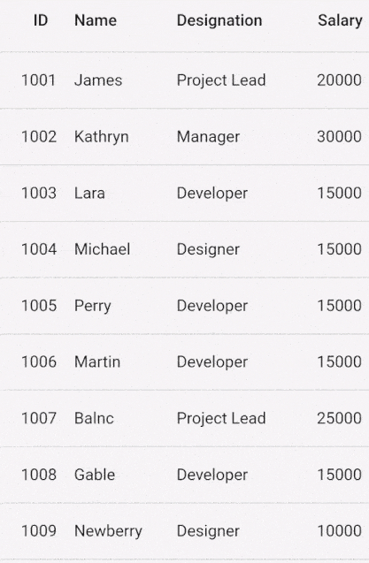

# Editing in Flutter DataGrid

[SfDataGrid](https://pub.dev/documentation/syncfusion_flutter_datagrid/latest/datagrid/SfDataGrid-class.html) supports to edit the cell values by setting the [SfDataGrid.allowEditing](https://pub.dev/documentation/syncfusion_flutter_datagrid/latest/datagrid/SfDataGrid/allowEditing.html) property as true and [SfDataGrid.navigationMode](https://pub.dev/documentation/syncfusion_flutter_datagrid/latest/datagrid/SfDataGrid/navigationMode.html) as cell, [SfDataGrid.selectionMode](https://pub.dev/documentation/syncfusion_flutter_datagrid/latest/datagrid/SfDataGrid/selectionMode.html) as other than none.

By default, [SfDataGrid](https://pub.dev/documentation/syncfusion_flutter_datagrid/latest/datagrid/SfDataGrid-class.html) does not load any widget when cell is moved into edit mode. Users must load any widget when cell is moved into edit mode by returning the required widget through [DataGridSource.buildEditWidget](https://pub.dev/documentation/syncfusion_flutter_datagrid/latest/datagrid/DataGridSource/buildEditWidget.html) method in [DataGridSource](https://pub.dev/documentation/syncfusion_flutter_datagrid/latest/datagrid/DataGridSource/DataGridSource.html) class.

The following arguments are passed in `buildEditWidget` method,

* [row](https://pub.dev/documentation/syncfusion_flutter_datagrid/latest/datagrid/DataGridRow-class.html): Gets the DataGridRow of the SfDataGrid.
* [rowColumnIndex](https://pub.dev/documentation/syncfusion_flutter_datagrid/latest/datagrid/RowColumnIndex-class.html): Gets the current row and column index of the DataGrid.
* [column](https://pub.dev/documentation/syncfusion_flutter_datagrid/latest/datagrid/GridColumn-class.html): Gets the Grid Column of the SfDataGrid.
* [submitCell](https://pub.dev/documentation/syncfusion_flutter_datagrid/latest/datagrid/CellSubmit.html): Programmatically call to end the editing. Typically, this method can be called when the widget completes its editing. For example, `TextField.onSubmitted` method is called whenever TextField ends its editing. So, you can simply call submitCell method. This will automatically call the DataGridSource.

We recommend you save the edited value through editors in [DataGridSource.onCellSubmit](https://pub.dev/documentation/syncfusion_flutter_datagrid/latest/datagrid/DataGridSource/onCellSubmit.html) method. The `onCellSubmit` method will be called whenever the [submitCell](https://pub.dev/documentation/syncfusion_flutter_datagrid/latest/datagrid/CellSubmit.html) method from [buildEditWidget](https://pub.dev/documentation/syncfusion_flutter_datagrid/latest/datagrid/DataGridSource/buildEditWidget.html) method is called or other cells are navigated when a cell is in edit mode.

The following example show how to enable editing in datagrid and committing the edited cell value in `onCellSubmit` method.




@override
Widget build(BuildContext context) {
  return Scaffold(
      body: SfDataGrid(
          source: _employeeDataSource,
          allowEditing: true,
          selectionMode: SelectionMode.single,
          navigationMode: GridNavigationMode.cell,
          columns: [
        GridColumn(
            columnName: 'id',
            label: Container(
                padding: EdgeInsets.symmetric(horizontal: 16.0),
                alignment: Alignment.centerRight,
                child: Text(
                  'ID',
                  overflow: TextOverflow.ellipsis,
                ))),
        GridColumn(
            columnName: 'name',
            label: Container(
                padding: EdgeInsets.symmetric(horizontal: 16.0),
                alignment: Alignment.centerLeft,
                child: Text(
                  'Name',
                  overflow: TextOverflow.ellipsis,
                ))),
        GridColumn(
            columnName: 'designation',
            label: Container(
                padding: EdgeInsets.symmetric(horizontal: 16.0),
                alignment: Alignment.centerLeft,
                child: Text(
                  'Designation',
                  overflow: TextOverflow.ellipsis,
                ))),
        GridColumn(
            columnName: 'salary',
            label: Container(
                padding: EdgeInsets.symmetric(horizontal: 16.0),
                alignment: Alignment.centerRight,
                child: Text(
                  'Salary',
                  overflow: TextOverflow.ellipsis,
                ))),
      ]));
}

class EmployeeDataSource extends DataGridSource {
  /// Helps to hold the new value of all editable widget.
  /// Based on the new value we will commit the new value into the corresponding
  /// DataGridCell on onCellSubmit method.
  dynamic newCellValue;

  /// Help to control the editable text in [TextField] widget.
  TextEditingController editingController = TextEditingController();

  @override
  void onCellSubmit(DataGridRow dataGridRow, RowColumnIndex rowColumnIndex,
      GridColumn column) {
    final dynamic oldValue = dataGridRow
            .getCells()
            .firstWhereOrNull((DataGridCell dataGridCell) =>
                dataGridCell.columnName == column.columnName)
            ?.value ??
        '';

    final int dataRowIndex = dataGridRows.indexOf(dataGridRow);

    if (newCellValue == null || oldValue == newCellValue) {
      return;
    }

    if (column.columnName == 'id') {
      dataGridRows[dataRowIndex].getCells()[rowColumnIndex.columnIndex] =
          DataGridCell<int>(columnName: 'id', value: newCellValue);
      _employees[dataRowIndex].id = newCellValue as int;
    } else if (column.columnName == 'name') {
      dataGridRows[dataRowIndex].getCells()[rowColumnIndex.columnIndex] =
          DataGridCell<String>(columnName: 'name', value: newCellValue);
      _employees[dataRowIndex].name = newCellValue.toString();
    } else if (column.columnName == 'designation') {
      dataGridRows[dataRowIndex].getCells()[rowColumnIndex.columnIndex] =
          DataGridCell<String>(columnName: 'designation', value: newCellValue);
      _employees[dataRowIndex].designation = newCellValue.toString();
    } else {
      dataGridRows[dataRowIndex].getCells()[rowColumnIndex.columnIndex] =
          DataGridCell<int>(columnName: 'salary', value: newCellValue);
      _employees[dataRowIndex].salary = newCellValue as int;
    }
  }

  @override
  Widget? buildEditWidget(DataGridRow dataGridRow,
      RowColumnIndex rowColumnIndex, GridColumn column, CellSubmit submitCell) {
    // Text going to display on editable widget
    final String displayText = dataGridRow
            .getCells()
            .firstWhereOrNull((DataGridCell dataGridCell) =>
                dataGridCell.columnName == column.columnName)
            ?.value
            ?.toString() ??
        '';

    // The new cell value must be reset.
    // To avoid committing the [DataGridCell] value that was previously edited
    // into the current non-modified [DataGridCell].
    newCellValue = null;

    final bool isNumericType =
        column.columnName == 'id' || column.columnName == 'salary';

    return Container(
      padding: const EdgeInsets.all(8.0),
      alignment: isNumericType ? Alignment.centerRight : Alignment.centerLeft,
      child: TextField(
        autofocus: true,
        controller: editingController..text = displayText,
        textAlign: isNumericType ? TextAlign.right : TextAlign.left,
        decoration: InputDecoration(
          contentPadding: const EdgeInsets.fromLTRB(0, 0, 0, 16.0),
        ),
        keyboardType: isNumericType ? TextInputType.number : TextInputType.text,
        onChanged: (String value) {
          if (value.isNotEmpty) {
            if (isNumericType) {
              newCellValue = int.parse(value);
            } else {
              newCellValue = value;
            }
          } else {
            newCellValue = null;
          }
        },
        onSubmitted: (String value) {
          // In Mobile Platform.
          // Call [CellSubmit] callback to fire the canSubmitCell and
          // onCellSubmit to commit the new value in single place.
          submitCell();
        },
      ),
    );
  }
}




>**NOTE**  
  Download demo application from [GitHub](https://github.com/SyncfusionExamples/how-to-perform-editing-in-flutter-datatable-sfdatagrid).

## Disable the editing for specific column

To disable the editing for a particular column, set the [GridColumn.allowEditing](https://pub.dev/documentation/syncfusion_flutter_datagrid/latest/datagrid/GridColumn/allowEditing.html) property as `false`.




@override
Widget build(BuildContext context) {
  return Scaffold(
      body: SfDataGrid(
          source: _employeeDataSource,
          allowEditing: true,
          selectionMode: SelectionMode.single,
          navigationMode: GridNavigationMode.cell,
          columns: [
        GridColumn(
            columnName: 'id',
            allowEditing: false,
            label: Container(
                padding: EdgeInsets.symmetric(horizontal: 16.0),
                alignment: Alignment.centerRight,
                child: Text(
                  'ID',
                  overflow: TextOverflow.ellipsis,
                ))),
        GridColumn(
            columnName: 'name',
            label: Container(
                padding: EdgeInsets.symmetric(horizontal: 16.0),
                alignment: Alignment.centerLeft,
                child: Text(
                  'Name',
                  overflow: TextOverflow.ellipsis,
                ))),
        GridColumn(
            columnName: 'designation',
            label: Container(
                padding: EdgeInsets.symmetric(horizontal: 16.0),
                alignment: Alignment.centerLeft,
                child: Text(
                  'Designation',
                  overflow: TextOverflow.ellipsis,
                ))),
        GridColumn(
            columnName: 'salary',
            label: Container(
                padding: EdgeInsets.symmetric(horizontal: 16.0),
                alignment: Alignment.centerRight,
                child: Text(
                  'Salary',
                  overflow: TextOverflow.ellipsis,
                )))
      ]));
}




## Entering edit mode

By default, cell will be moved to edit mode when you double tap the cells. You can enable the editing to be performed on tapping, set the [SfDataGrid.editingGestureType](https://pub.dev/documentation/syncfusion_flutter_datagrid/latest/datagrid/SfDataGrid/editingGestureType.html) property as tap.




@override
Widget build(BuildContext context) {
  return Scaffold(
      body: SfDataGrid(
          source: _employeeDataSource,
          allowEditing: true,
          selectionMode: SelectionMode.single,
          navigationMode: GridNavigationMode.cell,
          editingGestureType: EditingGestureType.tap,
          columns: [
        GridColumn(
            columnName: 'id',
            label: Container(
                padding: EdgeInsets.symmetric(horizontal: 16.0),
                alignment: Alignment.centerRight,
                child: Text(
                  'ID',
                  overflow: TextOverflow.ellipsis,
                ))),
        GridColumn(
            columnName: 'name',
            label: Container(
                padding: EdgeInsets.symmetric(horizontal: 16.0),
                alignment: Alignment.centerLeft,
                child: Text(
                  'Name',
                  overflow: TextOverflow.ellipsis,
                ))),
        GridColumn(
            columnName: 'designation',
            label: Container(
                padding: EdgeInsets.symmetric(horizontal: 16.0),
                alignment: Alignment.centerLeft,
                child: Text(
                  'Designation',
                  overflow: TextOverflow.ellipsis,
                ))),
        GridColumn(
            columnName: 'salary',
            label: Container(
                padding: EdgeInsets.symmetric(horizontal: 16.0),
                alignment: Alignment.centerRight,
                child: Text(
                  'Salary',
                  overflow: TextOverflow.ellipsis,
                )))
      ]));
}




## Methods

### onCellBeginEdit

The [DataGridSource.onCellBeginEdit](https://pub.dev/documentation/syncfusion_flutter_datagrid/latest/datagrid/DataGridSource/onCellBeginEdit.html) method is called when the cell enters into edit mode. You can return false if you don’t want to move any specific cells to edit mode. The following arguments are passed in this method,

* [row](https://pub.dev/documentation/syncfusion_flutter_datagrid/latest/datagrid/DataGridRow-class.html): Gets the DataGridRow of the SfDataGrid.
* [rowColumnIndex](https://pub.dev/documentation/syncfusion_flutter_datagrid/latest/datagrid/RowColumnIndex-class.html): Gets the current row and column index of the DataGrid.
* [column](https://pub.dev/documentation/syncfusion_flutter_datagrid/latest/datagrid/GridColumn-class.html): Gets the Grid Column of the SfDataGrid.




class EmployeeDataSource extends DataGridSource {
  @override
  bool onCellBeginEdit(
      DataGridRow dataGridRow, RowColumnIndex rowColumnIndex, GridColumn column) {
    if (column.columnName == 'id') {
      // Return false, to restrict entering into the editing.
      return false;
    } else {
      return true;
    }
  }
}




### canSubmitCell

The [DataGridSource.canSubmitCell](https://pub.dev/documentation/syncfusion_flutter_datagrid/latest/datagrid/DataGridSource/canSubmitCell.html) is called before the cell is ending its editing. If you want to restrict the cell from being end its editing, you can return false. [onCellSubmit](https://pub.dev/documentation/syncfusion_flutter_datagrid/latest/datagrid/DataGridSource/onCellSubmit.html) will be called only if the `canSubmitCell` returns true. The following arguments are passed in this method,

* [row](https://pub.dev/documentation/syncfusion_flutter_datagrid/latest/datagrid/DataGridRow-class.html): Gets the DataGridRow of the SfDataGrid.
* [rowColumnIndex](https://pub.dev/documentation/syncfusion_flutter_datagrid/latest/datagrid/RowColumnIndex-class.html): Gets the current row and column index of the DataGrid.
* [column](https://pub.dev/documentation/syncfusion_flutter_datagrid/latest/datagrid/GridColumn-class.html): Gets the Grid Column of the SfDataGrid.




class EmployeeDataSource extends DataGridSource {
  @override
  bool canSubmitCell(DataGridRow dataGridRow, RowColumnIndex rowColumnIndex,
      GridColumn column) {
    if (column.columnName == 'id' && newCellValue == null) {
      // Return false, to retain in edit mode.
      // To avoid null value for cell
      return false;
    } else {
      return true;
    }
  }
}




### onCellSubmit

The [DataGridSource.onCellSubmit](https://pub.dev/documentation/syncfusion_flutter_datagrid/latest/datagrid/DataGridSource/onCellSubmit.html) method is called when the editing is completed. We recommend you save the edited values to underlying collection in this method. It makes sense to handle the entire editing operation in this single method.

>**NOTE**     
   There is no need to call the `notifyListeners` after you update the DataGridRows. DataGrid will refresh the UI automatically.




class EmployeeDataSource extends DataGridSource {
  @override
  void onCellSubmit(DataGridRow dataGridRow, RowColumnIndex rowColumnIndex,
      GridColumn column) {
    final dynamic oldValue = dataGridRow
            .getCells()
            .firstWhereOrNull((DataGridCell dataGridCell) =>
                dataGridCell.columnName == column.columnName)
            ?.value ??
        '';

    final int dataRowIndex = dataGridRows.indexOf(dataGridRow);

    if (newCellValue == null || oldValue == newCellValue) {
      return;
    }

    if (column.columnName == 'id') {
      dataGridRows[dataRowIndex].getCells()[rowColumnIndex.columnIndex] =
          DataGridCell<int>(columnName: 'id', value: newCellValue);
      _employees[dataRowIndex].id = newCellValue as int;
    } else if (column.columnName == 'name') {
      dataGridRows[dataRowIndex].getCells()[rowColumnIndex.columnIndex] =
          DataGridCell<String>(columnName: 'name', value: newCellValue);
      _employees[dataRowIndex].name = newCellValue.toString();
    } else if (column.columnName == 'designation') {
      dataGridRows[dataRowIndex].getCells()[rowColumnIndex.columnIndex] =
          DataGridCell<String>(columnName: 'designation', value: newCellValue);
      _employees[dataRowIndex].designation = newCellValue.toString();
    } else {
      dataGridRows[dataRowIndex].getCells()[rowColumnIndex.columnIndex] =
          DataGridCell<int>(columnName: 'salary', value: newCellValue);
      _employees[dataRowIndex].salary = newCellValue as int;
    }
  }
}




### onCellCancelEdit

The [DataGridSource.onCellCancelEdit](https://pub.dev/documentation/syncfusion_flutter_datagrid/latest/datagrid/DataGridSource/onCellCancelEdit.html) method is called when you press the `Esc` key from Web and Desktop platforms. The [canSubmitCell](https://pub.dev/documentation/syncfusion_flutter_datagrid/latest/datagrid/DataGridSource/canSubmitCell.html) and [onCellSubmit](https://pub.dev/documentation/syncfusion_flutter_datagrid/latest/datagrid/DataGridSource/onCellSubmit.html) will not be called when `Esc` key is pressed.

>**NOTE**    
   No need to call the notifyListener inside it.




class EmployeeDataSource extends DataGridSource {
  @override
  void onCellCancelEdit(DataGridRow dataGridRow, RowColumnIndex rowColumnIndex,
      GridColumn column) {
    // handle the cancel editing code here
  }
}




## Programmatic editing

### BeginEdit

The SfDataGrid allows to move the cell into edit mode programmatically by calling the [DataGridController.beginEdit](https://pub.dev/documentation/syncfusion_flutter_datagrid/latest/datagrid/DataGridController/beginEdit.html) method.




final DataGridController _dataGridController = DataGridController();

@override
Widget build(BuildContext context) {
  return Scaffold(
      body: Column(children: [
    TextButton(
        child: Text("Begin Edit"),
        onPressed: () {
          _dataGridController.beginEdit(RowColumnIndex(2, 3));
        }),
    Expanded(
        child: SfDataGrid(
            source: _employeeDataSource,
            allowEditing: true,
            selectionMode: SelectionMode.single,
            navigationMode: GridNavigationMode.cell,
            controller: _dataGridController,
            columns: [
          GridColumn(
              columnName: 'id',
              label: Container(
                  padding: EdgeInsets.symmetric(horizontal: 16.0),
                  alignment: Alignment.centerRight,
                  child: Text(
                    'ID',
                    overflow: TextOverflow.ellipsis,
                  ))),
          GridColumn(
              columnName: 'name',
              label: Container(
                  padding: EdgeInsets.symmetric(horizontal: 16.0),
                  alignment: Alignment.centerLeft,
                  child: Text(
                    'Name',
                    overflow: TextOverflow.ellipsis,
                  ))),
          GridColumn(
              columnName: 'designation',
              label: Container(
                  padding: EdgeInsets.symmetric(horizontal: 16.0),
                  alignment: Alignment.centerLeft,
                  child: Text(
                    'Designation',
                    overflow: TextOverflow.ellipsis,
                  ))),
          GridColumn(
              columnName: 'salary',
              label: Container(
                  padding: EdgeInsets.symmetric(horizontal: 16.0),
                  alignment: Alignment.centerRight,
                  child: Text(
                    'Salary',
                    overflow: TextOverflow.ellipsis,
                  )))
        ]))
  ]));
}




### EndEdit

The [SfDataGrid.endEdit](https://pub.dev/documentation/syncfusion_flutter_datagrid/latest/datagrid/DataGridController/endEdit.html) method can be called to programmatically end the editing for specific cell.




final DataGridController _dataGridController = DataGridController();

@override
Widget build(BuildContext context) {
  return Scaffold(
      body: Column(children: [
    TextButton(
        child: Text("End Edit"),
        onPressed: () {
          _dataGridController.endEdit();
        }),
    Expanded(
        child: SfDataGrid(
            source: _employeeDataSource,
            allowEditing: true,
            selectionMode: SelectionMode.single,
            navigationMode: GridNavigationMode.cell,
            controller: _dataGridController,
            columns: [
          GridColumn(
              columnName: 'id',
              label: Container(
                  padding: EdgeInsets.symmetric(horizontal: 16.0),
                  alignment: Alignment.centerRight,
                  child: Text(
                    'ID',
                    overflow: TextOverflow.ellipsis,
                  ))),
          GridColumn(
              columnName: 'name',
              label: Container(
                  padding: EdgeInsets.symmetric(horizontal: 16.0),
                  alignment: Alignment.centerLeft,
                  child: Text(
                    'Name',
                    overflow: TextOverflow.ellipsis,
                  ))),
          GridColumn(
              columnName: 'designation',
              label: Container(
                  padding: EdgeInsets.symmetric(horizontal: 16.0),
                  alignment: Alignment.centerLeft,
                  child: Text(
                    'Designation',
                    overflow: TextOverflow.ellipsis,
                  ))),
          GridColumn(
              columnName: 'salary',
              label: Container(
                  padding: EdgeInsets.symmetric(horizontal: 16.0),
                  alignment: Alignment.centerRight,
                  child: Text(
                    'Salary',
                    overflow: TextOverflow.ellipsis,
                  )))
        ]))
  ]));
}




## How to check whether the current cell is in editing mode

You can check whether the current cell is in editing mode or not by using the [DataGridController.isCurrentCellInEditing](https://pub.dev/documentation/syncfusion_flutter_datagrid/latest/datagrid/DataGridController/isCurrentCellInEditing.html) property.




 final DataGridController _dataGridController = DataGridController();
 
 @override
  Widget build(BuildContext context) {
    return Scaffold(
      appBar: AppBar(
        title: const Text('SfDataGrid Editing'),
      ),
      body: Column(
        children: [
          TextButton(
              onPressed: () {
                showDialog(
                    context: context,
                    builder: (context) => AlertDialog(
                          content: Text(
                              'Cell is in Edit Mode: ${_dataGridController.isCurrentCellInEditing}'),
                        ));
              },
              child: const Text('In Edit Mode')),
          Expanded(
            child: SfDataGrid(
              source: _employeeDataSource,
              allowEditing: true,
              controller: _dataGridController,
              selectionMode: SelectionMode.single,
              navigationMode: GridNavigationMode.cell,
              columnWidthMode: ColumnWidthMode.fitByCellValue,
              editingGestureType: EditingGestureType.tap,
              columns: [
                GridColumn(
                    columnName: 'id',
                    label: Container(
                        padding: const EdgeInsets.symmetric(horizontal: 16.0),
                        alignment: Alignment.center,
                        child: const Text(
                          'ID',
                          overflow: TextOverflow.ellipsis,
                        ))),
                GridColumn(
                    columnName: 'name',
                    label: Container(
                        padding: const EdgeInsets.symmetric(horizontal: 16.0),
                        alignment: Alignment.center,
                        child: const Text(
                          'Name',
                          overflow: TextOverflow.ellipsis,
                        ))),
                GridColumn(
                    columnName: 'designation',
                    label: Container(
                        padding: const EdgeInsets.symmetric(horizontal: 16.0),
                        alignment: Alignment.center,
                        child: const Text(
                          'Designation',
                          overflow: TextOverflow.ellipsis,
                        ))),
                GridColumn(
                    columnName: 'salary',
                    label: Container(
                        padding: const EdgeInsets.symmetric(horizontal: 16.0),
                        alignment: Alignment.center,
                        child: const Text(
                          'Salary',
                          overflow: TextOverflow.ellipsis,
                        )))
              ],
            ),
          ),
        ],
      ),
    );
  }




## Restrict specific cell or column from being entered into edit mode at run time

In order to cancel the editing for specific cell or column at run time, you can override the [onCellBeginEdit](https://pub.dev/documentation/syncfusion_flutter_datagrid/latest/datagrid/DataGridSource/onCellBeginEdit.html) method in `DataGridSource` class and return false for specific cell or column.




class EmployeeDataSource extends DataGridSource {
  @override
  bool onCellBeginEdit(DataGridRow dataGridRow, RowColumnIndex rowColumnIndex,
      GridColumn column) {

    // Editing prevented for the cell at RowColumnIndex(2,2).
    if (rowColumnIndex.equals(RowColumnIndex(2, 2))) {
      return false;
    } else {
      return true;
    }
  }
}




The following code example shows how to cancel the specific column from being entered into edit mode,




class EmployeeDataSource extends DataGridSource {
  @override
  bool onCellBeginEdit(DataGridRow dataGridRow, RowColumnIndex rowColumnIndex,
      GridColumn column) {
    if (column.columnName == 'id' || column.columnName == 'salary') {
      return false;
    } else {
      return true;
    }
  }
}




## Cancel edited cell value from being committed

You can override the [canSubmitCell](https://pub.dev/documentation/syncfusion_flutter_datagrid/latest/datagrid/DataGridSource/canSubmitCell.html) from [DataGridSource](https://pub.dev/documentation/syncfusion_flutter_datagrid/latest/datagrid/DataGridSource-class.html) class and return false based on your criteria.

If you return a false from the `canSubmitCell` method, the Datagrid doesn't allow the focus to the other widget, which is added outside the DataGrid. The focus would always be on the `currentCell`.




class EmployeeDataSource extends DataGridSource {
  @override
  bool canSubmitCell(DataGridRow dataGridRow, RowColumnIndex rowColumnIndex,
      GridColumn column) {
    if (newCellValue == null || newCellValue == '') {
      // Editing widget will retain in view.
      // onCellSubmit method will not fire.
      return false;
    } else {
      // Allow to call the onCellSumbit.
      return true;
    }
  }
}




## Perfrom editing asynchronously

The [DataGridSource.canSubmitCell](https://pub.dev/documentation/syncfusion_flutter_datagrid/latest/datagrid/DataGridSource/canSubmitCell.html) is called before the cell is ending its editing.The [DataGridSource.onCellSubmit](https://pub.dev/documentation/syncfusion_flutter_datagrid/latest/datagrid/DataGridSource/onCellSubmit.html) method is called when the editing is completed.To postpone the completion of editing in a cell, use asynchronous implementation,

The following code shows how to make perfrom editing as asynchronously.


 

import 'package:syncfusion_flutter_datagrid/datagrid.dart';

  @override
  Future<void> onCellSubmit(DataGridRow dataGridRow,
      RowColumnIndex rowColumnIndex, GridColumn column) async {
      loadingController.add(true);
      await Future<void>.delayed(const Duration(seconds: 2));
          loadingController.add(false);
    final dynamic oldValue = dataGridRow
            .getCells()
            .firstWhereOrNull((DataGridCell dataGridCell) =>
                dataGridCell.columnName == column.columnName)
            ?.value ??
        '';

    final int dataRowIndex = _employeeData.indexOf(dataGridRow);

    if (newCellValue == null || oldValue == newCellValue) {
      return;
    }
    if (column.columnName == 'id') {
      _employeeData[dataRowIndex].getCells()[rowColumnIndex.columnIndex] =
          DataGridCell<int>(columnName: 'id', value: newCellValue);
      employees[dataRowIndex].id = newCellValue as int;
    } else if (column.columnName == 'name') {
        _employeeData[dataRowIndex].getCells()[rowColumnIndex.columnIndex] =
            DataGridCell<String>(columnName: 'name', value: newCellValue);
        employees[dataRowIndex].name = newCellValue.toString();
    
    } else if (column.columnName == 'designation') {
      _employeeData[dataRowIndex].getCells()[rowColumnIndex.columnIndex] =
          DataGridCell<String>(columnName: 'designation', value: newCellValue);
      employees[dataRowIndex].designation = newCellValue.toString();
    } else {
      _employeeData[dataRowIndex].getCells()[rowColumnIndex.columnIndex] =
          DataGridCell<int>(columnName: 'salary', value: newCellValue);
      employees[dataRowIndex].salary = newCellValue as int;
    }
  }
  @override
  Future<bool> canSubmitCell(DataGridRow dataGridRow,
      RowColumnIndex rowColumnIndex, GridColumn column) async {
    if (column.columnName == 'id' && newCellValue == 104) {
      loadingController.add(true);
      await Future<void>.delayed(const Duration(seconds: 2));
      loadingController.add(false);
      return false;
    } else {
      return true;
    }
  }
  


