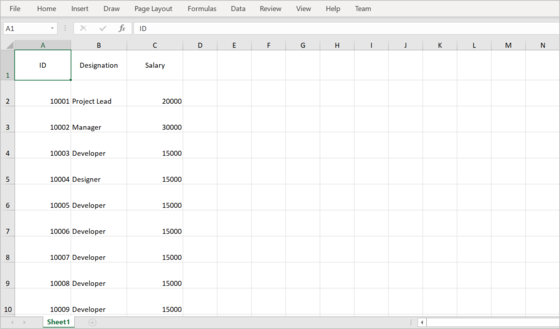
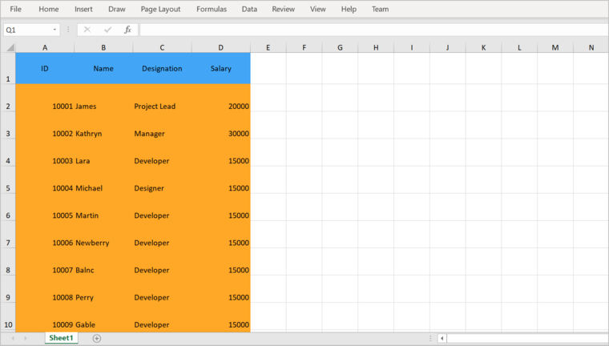
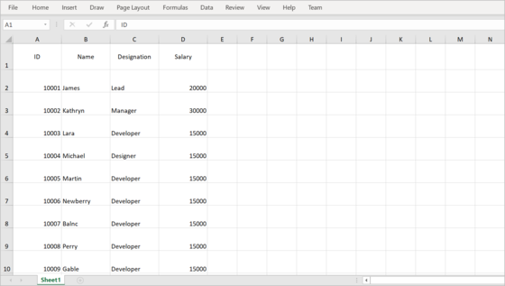

# Export to Excel in Flutter DataGrid (SfDataGrid)

The [SfDataGrid](https://pub.dev/documentation/syncfusion_flutter_datagrid/latest/datagrid/SfDataGrid-class.html) provides support to export the content to Excel with several customization options.

**Add dependency**

The following dependencies must be added to your pubspec.yaml file for exporting to Excel.
  
 

dependencies:

syncfusion_flutter_datagrid_export: ^24.1.41



> **Note:** The version numbers shown above are examples. Refer to [pub.dev](https://pub.dev/packages/syncfusion_flutter_datagrid_export) for the latest stable version of `Syncfusion Flutter DataGrid Export` package.

**Import required packages**

Import the following packages in your Dart code.


 

import 'package:syncfusion_flutter_datagrid_export/export.dart';




Export SfDataGrid by using the following extension methods present in the [SfDataGridState](https://pub.dev/documentation/syncfusion_flutter_datagrid/latest/datagrid/SfDataGridState-class.html) class:

* [exportToExcelWorkbook](https://pub.dev/documentation/syncfusion_flutter_datagrid_export/latest/syncfusion_flutter_datagrid_export/DataGridExcelExportExtensions/exportToExcelWorkbook.html) - Exports the grid to an Excel workbook
* [exportToExcelWorksheet](https://pub.dev/documentation/syncfusion_flutter_datagrid_export/latest/syncfusion_flutter_datagrid_export/DataGridExcelExportExtensions/exportToExcelWorksheet.html) - Exports the grid to an existing Excel worksheet

> **Note:** 
>- File export requires platform-specific permissions. Ensure write permissions are configured in AndroidManifest.xml (Android), the iOS app configuration file, and the macOS entitlements file.
>- For web platforms, use web APIs instead of the `File` class. Consider using the `universal_html` package or browser download methods.
>- Refer to [getting-started](https://help.syncfusion.com/flutter/xlsio/getting-started) for platform-specific file generation code.

**Add GlobalKey for SfDataGrid**
 
Create the [GlobalKey](https://api.flutter.dev/flutter/widgets/GlobalKey-class.html) using the `SfDataGridState` class. Exporting related methods are available in the `SfDataGridState` class.

Set the created `GlobalKey` to the `SfDataGrid`.




final GlobalKey<SfDataGridState> key = GlobalKey<SfDataGridState>();
    



The following code illustrates how to create and export a `SfDataGrid` to Excel using the global key.

 
 

final GlobalKey<SfDataGridState> key = GlobalKey<SfDataGridState>();

@override
Widget build(BuildContext context) {
  return Scaffold(
    appBar: AppBar(
      title: const Text(
        'Syncfusion Flutter DataGrid Export',
        overflow: TextOverflow.ellipsis,
      ),
    ),
    body: Column(
      crossAxisAlignment: CrossAxisAlignment.start,
      children: <Widget>[
        Container(
          height: 50.0,
          width: 150.0,
          padding: const EdgeInsets.all(10.0),
          child: MaterialButton(
              color: Colors.blue,
              child: const Center(
                  child: Text(
                'Export to Excel',
                style: TextStyle(color: Colors.white),
              )),
              onPressed: () async {
                final Workbook workbook =
                    key.currentState!.exportToExcelWorkbook();
                final List<int> bytes = workbook.saveAsStream();
                workbook.dispose();
                await helper.saveAndLaunchFile(bytes, 'DataGrid.xlsx');
              }),
        ),
        Expanded(
          child: SfDataGrid(
            key: key,
            source: employeeDataSource,
            columns: <GridColumn>[
              GridColumn(
                  columnName: 'ID',
                  label: Container(
                      padding: const EdgeInsets.all(16.0),
                      alignment: Alignment.center,
                      child: const Text(
                        'ID',
                      ))),
              GridColumn(
                  columnName: 'Name',
                  label: Container(
                      padding: const EdgeInsets.all(8.0),
                      alignment: Alignment.center,
                      child: const Text('Name'))),
              GridColumn(
                  columnName: 'Designation',
                  label: Container(
                      padding: const EdgeInsets.all(8.0),
                      alignment: Alignment.center,
                      child: const Text(
                        'Designation',
                        overflow: TextOverflow.ellipsis,
                      ))),
              GridColumn(
                  columnName: 'Salary',
                  label: Container(
                      padding: const EdgeInsets.all(8.0),
                      alignment: Alignment.center,
                      child: const Text('Salary'))),
            ],
          ),
        ),
      ],
    ),
  );
}




## Save the Excel document as a file

Include platform-specific code to save the Excel document. Refer to the following sections for implementation details:

* [Mobile (Android/iOS) file saving](https://help.syncfusion.com/flutter/xlsio/getting-started#create-an-excel-document-in-mobile)
* [Web file saving](https://help.syncfusion.com/flutter/xlsio/getting-started#create-an-excel-document-in-web)
* [Desktop (Windows/macOS/Linux) file saving](https://help.syncfusion.com/flutter/xlsio/getting-started#create-an-excel-document-in-desktop)

## Export DataGrid to Excel workbook

Export data to an [Excel Workbook](https://pub.dev/documentation/syncfusion_flutter_xlsio/latest/xlsio/Workbook-class.html) using the `exportToExcelWorkbook` method from the DataGrid's state. This creates a new workbook with the grid data.




final Workbook workbook = key.currentState!.exportToExcelWorkbook();
final List<int> bytes = workbook.saveAsStream();
File('DataGrid.xlsx').writeAsBytes(bytes, flush: true);
  



## Export DataGrid to Excel sheet

Export data to an [Excel Worksheet](https://pub.dev/documentation/syncfusion_flutter_xlsio/latest/xlsio/Worksheet-class.html) using the `exportToExcelWorksheet` method. This appends grid data to an existing or new worksheet within a workbook.




final Workbook workbook = Workbook();
final Worksheet worksheet = workbook.worksheets[0];
key.currentState!.exportToExcelWorksheet(worksheet);
final List<int> bytes = workbook.saveAsStream();
File('DataGrid.xlsx').writeAsBytes(bytes, flush: true);
  



## Exporting options

> **Note:** Export methods use XLSX format by default. Large datasets may consume significant memory during export—consider exporting selected rows for better performance with large grids.

### Exclude columns when exporting

By default, all columns in SfDataGrid are exported to Excel. Exclude specific columns by adding their names to the [excludeColumns](https://pub.dev/documentation/syncfusion_flutter_datagrid_export/latest/syncfusion_flutter_datagrid_export/DataGridToExcelConverter/excludeColumns.html) parameter.




Workbook workbook = key.currentState!
    .exportToExcelWorkbook(excludeColumns: ['Name']);
final List<int> bytes = workbook.saveAsStream();
     



### Exclude table summaries when exporting

By default, table summaries in SfDataGrid are exported to Excel. Set the [exportTableSummaries](https://pub.dev/documentation/syncfusion_flutter_datagrid_export/latest/syncfusion_flutter_datagrid_export/DataGridToExcelConverter/exportTableSummaries.html) parameter to `false` to exclude table summaries from the export.




Workbook workbook = key.currentState!
    .exportToExcelWorkbook(exportTableSummaries: false);
final List<int> bytes = workbook.saveAsStream();




### Exclude stacked headers when exporting

By default, stacked headers in SfDataGrid are exported to Excel. Set the [exportStackedHeaders](https://pub.dev/documentation/syncfusion_flutter_datagrid_export/latest/syncfusion_flutter_datagrid_export/DataGridToExcelConverter/exportStackedHeaders.html) parameter to `false` to exclude stacked headers from the export.




Workbook workbook = key.currentState!
    .exportToExcelWorkbook(exportStackedHeaders: false);
final List<int> bytes = workbook.saveAsStream();




### Change the start row and column index when exporting

By default, the DataGrid is exported starting at cell (0,0) in the Excel sheet. Export data starting from a specific row and column by setting the [startRowIndex](https://pub.dev/documentation/syncfusion_flutter_datagrid_export/latest/syncfusion_flutter_datagrid_export/DataGridToExcelConverter/startRowIndex.html) and [startColumnIndex](https://pub.dev/documentation/syncfusion_flutter_datagrid_export/latest/syncfusion_flutter_datagrid_export/DataGridToExcelConverter/startColumnIndex.html) properties.




Workbook workbook = key.currentState!
    .exportToExcelWorkbook(startRowIndex: 3, startColumnIndex: 2);
final List<int> bytes = workbook.saveAsStream();




## Export the selected rows to Excel

By default, the entire grid is exported to Excel. Export only selected rows by passing the [dataGridController.selectedRows](https://pub.dev/documentation/syncfusion_flutter_datagrid/latest/datagrid/DataGridController/selectedRows.html) list to the `rows` parameter in the `exportToExcelWorksheet` or `exportToExcelWorkbook` methods. This parameter is optional; if omitted, all rows are exported.




Workbook workbook = key.currentState!
    .exportToExcelWorkbook(rows: dataGridController.selectedRows);
final List<int> bytes = workbook.saveAsStream();




## Row height and column width customization

By default, the exported Excel cells use the [rowHeight](https://pub.dev/documentation/syncfusion_flutter_datagrid/latest/datagrid/SfDataGrid/rowHeight.html) and [defaultColumnWidth](https://pub.dev/documentation/syncfusion_flutter_datagrid/latest/datagrid/SfDataGrid/defaultColumnWidth.html) properties from SfDataGrid.

To use custom dimensions instead, set the [exportRowHeight](https://pub.dev/documentation/syncfusion_flutter_datagrid_export/latest/syncfusion_flutter_datagrid_export/DataGridToExcelConverter/exportRowHeight.html) and [exportColumnWidth](https://pub.dev/documentation/syncfusion_flutter_datagrid_export/latest/syncfusion_flutter_datagrid_export/DataGridToExcelConverter/exportColumnWidth.html) properties to `false`, then specify [defaultRowHeight](https://pub.dev/documentation/syncfusion_flutter_datagrid_export/latest/syncfusion_flutter_datagrid_export/DataGridToExcelConverter/defaultRowHeight.html) and [defaultColumnWidth](https://pub.dev/documentation/syncfusion_flutter_datagrid_export/latest/syncfusion_flutter_datagrid_export/DataGridToExcelConverter/defaultColumnWidth.html).

When `exportRowHeight` and `exportColumnWidth` are `true`, the grid's [headerRowHeight](https://pub.dev/documentation/syncfusion_flutter_datagrid/latest/datagrid/SfDataGrid/headerRowHeight.html), `rowHeight`, and actual column widths are exported to Excel.




Workbook workbook = key.currentState!.exportToExcelWorkbook(
    exportRowHeight: false,
    exportColumnWidth: false,
    defaultRowHeight: 35,
    defaultColumnWidth: 120);
final List<int> bytes = workbook.saveAsStream();




## Styling cells based on the cell type in Excel

Customize cell styles during export using the [cellExport](https://pub.dev/documentation/syncfusion_flutter_datagrid_export/latest/syncfusion_flutter_datagrid_export/DataGridToExcelConverter/cellExport.html) callback parameter in the `exportToExcelWorkbook` or `exportToExcelWorksheet` methods. The callback provides access to [DataGridCellExcelExportDetails](https://pub.dev/documentation/syncfusion_flutter_datagrid_export/latest/syncfusion_flutter_datagrid_export/DataGridCellExcelExportDetails-class.html) with cell type information:

* `DataGridExportCellType.columnHeader` - Header cells
* `DataGridExportCellType.stackedHeaderCell` - Stacked header cells
* `DataGridExportCellType.row` - Data row cells
* `DataGridExportCellType.tableSummaryRow` - Summary row cells




final Workbook workbook = key.currentState!.exportToExcelWorkbook(
    cellExport: (DataGridCellExcelExportDetails details) {
  if (details.cellType == DataGridExportCellType.columnHeader) {
    details.excelRange.cellStyle.backColor = '#42A5F5';
  } else if (details.cellType == DataGridExportCellType.row) {
    details.excelRange.cellStyle.backColor = '#FFA726';
  }
});
final List<int> bytes = workbook.saveAsStream();




## Cell customization when exporting

### Customize cell values while exporting

Customize cell values during export by setting the [excelRange.value](https://pub.dev/documentation/syncfusion_flutter_datagrid_export/latest/syncfusion_flutter_datagrid_export/DataGridCellExcelExportDetails/excelRange.html) property in the `cellExport` callback. The supported value types include strings, numbers, dates, and booleans. Complex types are converted to their string representation.




final Workbook workbook = key.currentState!.exportToExcelWorkbook(
    cellExport: (DataGridCellExcelExportDetails details) {
  if (details.cellType == DataGridExportCellType.row &&
      details.cellValue == 'Project Lead') {
    details.excelRange.value = 'Lead';
  }
});
final List<int> bytes = workbook.saveAsStream();




### Customize cells based on the column

Customize cell styling by column using the [cellExport](https://pub.dev/documentation/syncfusion_flutter_datagrid_export/latest/syncfusion_flutter_datagrid_export/DataGridToExcelConverter/cellExport.html) callback. Access the column name via [details.columnName](https://pub.dev/documentation/syncfusion_flutter_datagrid_export/latest/syncfusion_flutter_datagrid_export/DataGridCellExcelExportDetails/columnName.html) to apply styles to specific columns.




final Workbook workbook = key.currentState!.exportToExcelWorkbook(
    cellExport: (DataGridCellExcelExportDetails details) {
  if (details.cellType == DataGridExportCellType.row &&
      details.columnName == 'Name') {
    details.excelRange.cellStyle
      ..bold = true
      ..fontColor = '#F44336';
  }
});
final List<int> bytes = workbook.saveAsStream();




## Customize Exporting Behavior

Customize export behavior by extending the [DataGridToExcelConverter](https://pub.dev/documentation/syncfusion_flutter_datagrid_export/latest/syncfusion_flutter_datagrid_export/DataGridToExcelConverter-class.html) class and overriding specific methods. Pass your custom converter to the `converter` parameter in the `exportToExcelWorksheet` or `exportToExcelWorkbook` method.

> **Note:** Use `getCellValue` to transform cell data before export. Override `exportColumnHeader`, `exportRow`, or other export methods for advanced customization of specific row/column types.




class CustomDataGridToExcelConverter extends DataGridToExcelConverter {
  /// Customize export of individual column header cells
  @override
  void exportColumnHeader(SfDataGrid dataGrid, GridColumn column,
      String columnName, Worksheet worksheet) {
    super.exportColumnHeader(dataGrid, column, columnName, worksheet);
  }

  /// Customize export of all column headers
  @override
  void exportColumnHeaders(SfDataGrid dataGrid, Worksheet worksheet) {
    super.exportColumnHeaders(dataGrid, worksheet);
  }

  /// Customize export of individual row cells for each column
  @override
  void exportRow(SfDataGrid dataGrid, DataGridRow row, GridColumn column,
      Worksheet worksheet) {
    super.exportRow(dataGrid, row, column, worksheet);
  }

  /// Customize export of all data rows
  @override
  void exportRows(
      SfDataGrid dataGrid, List<DataGridRow> rows, Worksheet worksheet) {
    super.exportRows(dataGrid, rows, worksheet);
  }

  /// Customize export of individual stacked header rows
  @override
  void exportStackedHeaderRow(SfDataGrid dataGrid,
      StackedHeaderRow stackedHeaderRow, Worksheet worksheet) {
    super.exportStackedHeaderRow(dataGrid, stackedHeaderRow, worksheet);
  }

  /// Customize export of all stacked header rows
  @override
  void exportStackedHeaderRows(SfDataGrid dataGrid, Worksheet worksheet) {
    super.exportStackedHeaderRows(dataGrid, worksheet);
  }

  /// Customize export of individual table summary rows
  @override
  void exportTableSummaryRow(SfDataGrid dataGrid,
      GridTableSummaryRow summaryRow, Worksheet worksheet) {
    super.exportTableSummaryRow(dataGrid, summaryRow, worksheet);
  }

  /// Customize export of all table summary rows at specified positions
  @override
  void exportTableSummaryRows(SfDataGrid dataGrid,
      GridTableSummaryRowPosition position, Worksheet worksheet) {
    super.exportTableSummaryRows(dataGrid, position, worksheet);
  }

  /// Transform cell values before export (e.g., formatting, type conversion)
  @override
  Object? getCellValue(DataGridRow row, GridColumn column) {
    return super.getCellValue(row, column);
  }
}




The following code sample illustrates how to create an instance of the `CustomDataGridToExcelConverter` class and set the instance to the `converter` parameter in the `exportToExcelWorksheet` or `exportToExcelWorkbook` method.




CustomDataGridToExcelConverter converter = CustomDataGridToExcelConverter();
Workbook workbook = key.currentState!.exportToExcelWorkbook(converter: converter);
final List<int> bytes = workbook.saveAsStream();


