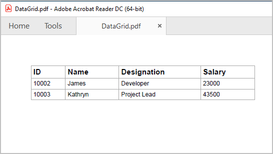

# Export to PDF in Flutter DataGrid (SfDataGrid)

The [SfDataGrid] (https://pub.dev/documentation/syncfusion_flutter_datagrid/latest/datagrid/SfDataGrid-class.html) provides support to export the content to PDF document with several customization options. 

**Add dependency**

The following dependencies should be added to your pubspec.yaml file for exporting to PDF.
  
   

    dependencies:

    syncfusion_flutter_datagrid_export: ^xx.x.xx

    syncfusion_flutter_pdf

  

  >**NOTE** Here **xx.x.xx** denotes the current version of `Syncfusion Flutter DataGrid Export` package.

**Get packages**

Run the following command to get the required packages.

  

    $ flutter pub get

 

**Import package**

Import the following package in your Dart code.

 
  

    import 'package:syncfusion_flutter_datagrid_export/export.dart';

    import 'package:syncfusion_flutter_pdf/pdf.dart';

 
 

You can export the SfDataGrid to PDF by using the following extension methods present in the DataGridToPdfConverter class.

   * `exportToPdfDocument`
   * `exportToPdfGrid`

**Add GlobalKey for the DataGrid**
 
Create the GlobalKey with the [SfDataGridState](https://pub.dev/documentation/syncfusion_flutter_datagrid/latest/datagrid/SfDataGridState-class.html) class. Exporting related methods is available via the SfDataGridState class.

Set the created `GlobalKey` to the `DataGrid`.

 
 

    final GlobalKey<SfDataGridState> key = GlobalKey<SfDataGridState>();
     ...
      child: SfDataGrid(
      key: key,
     ...

 
 

The following code illustrates how to create and display a SfDataGrid in view.

 
 

    GlobalKey<SfDataGridState> key = GlobalKey<SfDataGridState>();

    @override
    Widget build(BuildContext context) {
       return Scaffold(
        body: Column(
         children: [
            ElevatedButton(
              child: Text('Export To Pdf'),
               onPressed: () {
                 PdfDocument document = key.currentState!.exportToPdfDocument();
              }),
            Expanded(
              child: SfDataGrid(
                source: _employeeDataSource,
                allowEditing: true,
                key: key,
                columns: getcolumns,
                selectionMode: SelectionMode.multiple,
                navigationMode: GridNavigationMode.cell),
              ),
            ],
          ),
        );
      }

 
 

## Export DataGrid to PDF document

You can export the data to PDF by using the `exportToPdfDocument` method and from `key.currentState` of the datagrid.




    PdfDocument document = key.currentState!.exportToPdfDocument();

    final List<int> bytes = document.save();
    File('DataGrid.pdf').writeAsBytes(bytes);
  



## Export DataGrid to PDF Grid

You can export the data to PDF by using the `exportToPdfGrid`  method and from `key.currentState` of the datagrid.




    PdfDocument document = PdfDocument();
    PdfGrid pdfGrid = key.currentState!.exportToPdfGrid();

    final List<int> bytes = document.save();
    File('DataGrid.pdf').writeAsBytes(bytes);
  



## Exporting options 

### Exclude columns when exporting

By default, all the columns in the SfDataGrid will be exported to PDF. To exclude some particular columns when exporting to PDF, add those columns to `excludeColumns` list.




     PdfDocument document = key.currentState!.exportToPdfDocument( excludeColumns: getExcludecolumns());

      final List<int> bytes = document.save();
     
     List<String> getExcludecolumns() {
     return [
      'Name'
     ];
    }
  



### Disable column headers on each page

You can disable the column headers on each page of the exported PDF document by set the `canRepeatHeaders` parameter as `false`.




     PdfDocument document = key.currentState!.exportToPdfDocument(canRepeatHeaders:true);

    final List<int> bytes = document.save();




### Export all columns in one page

While exporting to PDF, you can fit all columns in one page by setting `fitAllColumnsInOnePage` parameter as `true`.




     PdfDocument document = key.currentState!.exportToPdfDocument(fitAllColumnsInOnePage:true);

    final List<int> bytes = document.save();




### Exclude table summaries when exporting

By default, table summaries in SfDataGrid will be exported to PDF. If you want to export without table summaries, you need to set `exportTableSummaries` parameter as `false`.




     PdfDocument document = key.currentState!.exportToPdfDocument(exportTableSummaries:false);

    final List<int> bytes = document.save();




### Exclude stacked headers when exporting

By default, stacked headers in SfDataGrid will be exported to PDF. You can set `exportStackedHeaders` parameter as `false` to export the SfDataGrid without stacked headers.




     PdfDocument document = key.currentState!.exportToPdfDocument(exportStackedHeaders:false);

     
    final List<int> bytes = document.save();




### Auto size column widths in PDF

In order to export the actual column width from SfDataGrid instead of the auto column width, set the `autoColumnWidth` parameter as `false`.




     PdfDocument document = key.currentState!.exportToPdfDocument(autoColumnWidth:false);

     
    final List<int> bytes = document.save();




>**NOTE**
    If you disabled the `autoColumnWidth`, then you must set `fitAllColumnsInOnePage` as false. Then only, the overflowing columns are drawn in next page. Because, `fitAllColumnsInOnePage` has top most priority.

## Change the orientation of the PDF document

You can change the page orientation of PDF while exporting by using `PdfDocument.pageSettings.orientation` property.

To change the page orientation, you need to get the exported PdfGrid by using `exportToPdfGrid` method and then draw that PdfGrid into a PdfDocument by changing the `PageSettings.Orientation` property of PdfDocument.




    PdfDocument pdfDocument = PdfDocument();
    pdfDocument.pageSettings.orientation = PdfPageOrientation.landscape;
    PdfPage pdfPage = pdfDocument.pages.add();
    PdfGrid pdfGrid = _key.currentState!.exportToPdfGrid();

    pdfGrid.draw(
     page: pdfPage,
     bounds: Rect.fromLTWH(0, 0, 0, 0));

    final List<int> bytes = document.save();
  



## Export the selected rows to PDF

By default, entire grid will be exported to PDF. You can export selected items only by passing `dataGridController.selectedRows` to `rows` parameter in `exportToPdfDocument` and `exportToPdfGrid` methods.




    PdfDocument document = key.currentState!.exportToPdfDocument(rows: dataGridController.selectedRows,);

    
    final List<int> bytes = document.save();




## Setting header and footer in PDF document

SfDataGrid provides a way to display additional content at the top (Header) and bottom (Footer) of the PDF page while exporting to PDF. This can be achieved by using `headerFooterExport` parameter in `exportToPdfDocument` or `exportToPdfGrid` methods.

Setting the `PdfPageTemplateElement` to `headerFooterExport.pdfDocumentTemplate.top` loads the content at top of the page and setting the `PdfPageTemplateElement` to `headerFooterExport.pdfDocumentTemplate.bottom` loads the content at bottom of the page.




    PdfDocument document = key.currentState!.exportToPdfDocument(
         headerFooterExport:
          (DataGridPdfHeaderFooterExportDetails headerFooterExport) {
        final double width = headerFooterExport.pdfPage.getClientSize().width;
        final PdfPageTemplateElement header =
            PdfPageTemplateElement(Rect.fromLTWH(0, 0, width, 65));
        header.graphics.drawString(
          'Company Details',
          PdfStandardFont(PdfFontFamily.helvetica, 13,
              style: PdfFontStyle.bold),
          bounds: const Rect.fromLTWH(0, 25, 200, 60),
        );
        headerFooterExport.pdfDocumentTemplate.top = header;
      },
      );

      
      final List<int> bytes = document.save();




## Styling cells based on cell type in PDF

You can customize the cell styles based on cell type using `cellExport` parameter in `exportToPdfDocument` or `exportToPdfGrid` methods.




    PdfDocument document = key.currentState!.exportToPdfDocument(
      cellExport:(cellExport){
           if (cellExport.cellType == DataGridExportCellType.columnHeader) {
            cellExport.pdfCell.style.backgroundBrush = PdfBrushes.pink;
           }
            if (cellExport.cellType == DataGridExportCellType.row) {
            cellExport.pdfCell.style.backgroundBrush = PdfBrushes.lightCyan;
           }
      },
      );
    
    
    final List<int> bytes = document.save();




## Cell customization when exporting

### Customize cell values while exporting

The cell value can be customized while exporting to PDF by using the `cellExport` parameter.




    PdfDocument document = key.currentState!.exportToPdfDocument(
      cellExport:(cellExport){
          if (cellExport.cellType == DataGridExportCellType.row &&
            cellExport.columnName == 'Designation') {
          if (cellExport.cellValue == 'Project Lead') {
            cellExport.pdfCell.value = 'Lead';
          } 
        }
      }
      );

      
    final List<int> bytes = document.save();




### Customize the Cells based on Column Name

You can customize the column style based on the column name when exporting to PDF by using the `cellExporting` parameter.




    PdfDocument document = key.currentState!.exportToPdfDocument(
      cellExport:(cellExport){
         if (details.cellType == DataGridExportCellType.row && details.columnName == 'Customer Name') {
          details.pdfCell.style.textBrush = PdfBrushes.red;
        }
      }
    );
    
    final List<int> bytes = document.save();




## Customize Exporting Behavior 

You can customize the exporting behavior by overriding the available methods in `DataGridToPdfConverter` class and setting the instance of custom pdf converter to converter parameter in `exportToPdfDocument` or `exportToPdfGrid` methods.

    CustomDataGridToPdfConverter _customDataGridToPdfConverter = CustomDataGridToPdfConverter();

    PdfDocument document = key.currentState!.exportToPdfDocument(
      converter: _customDataGridToPdfConverter,
    );

    
    final List<int> bytes = document.save();

    Class CustomDataGridToPdfConverter extends DataGridToPdfConverter{
     
     @override
      PdfDocument exportToPdfDocument(SfDataGrid dataGrid, List<DataGridRow>? rows) {

            // TODO: Add your requirements in pdfDocument

       return super.exportToPdfDocument(dataGrid, rows);
      }

      @override
      PdfDocument exportToPdfGrid(SfDataGrid dataGrid, List<DataGridRow>? rows) {

            // TODO: Add your requirements in pdfGrid

        return super.exportToPdfGrid(dataGrid, rows);
      }

      @override
      void exportColumnHeader(SfDataGrid dataGrid, GridColumn column,
      String columnName, PdfGrid pdfGrid) {

            // TODO: Add your requirements column headers

       super.exportColumnHeader(dataGrid, column, columnName, pdfGrid);
    }

     @override
     void exportRows(
       List<GridColumn> columns, List<DataGridRow> rows,    PdfGrid pdfGrid) {

            // TODO: Add your requirements in exportRows
       
        super.exportRows(columns, rows, pdfGrid);
      }
      @override
      void exportRow(List<GridColumn> columns, DataGridRow row, PdfGrid pdfGrid) {
        
            // TODO: Add your requirements

        super.exportRow(columns, row, pdfGrid);
      } 
    }

