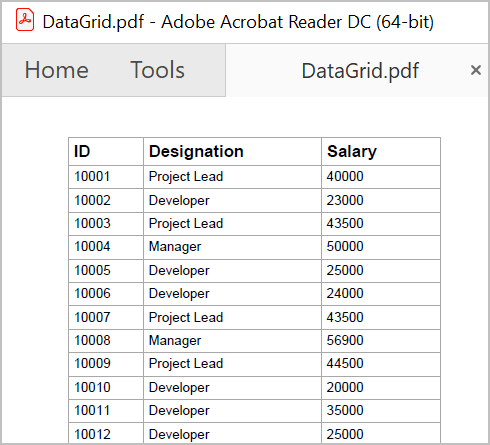
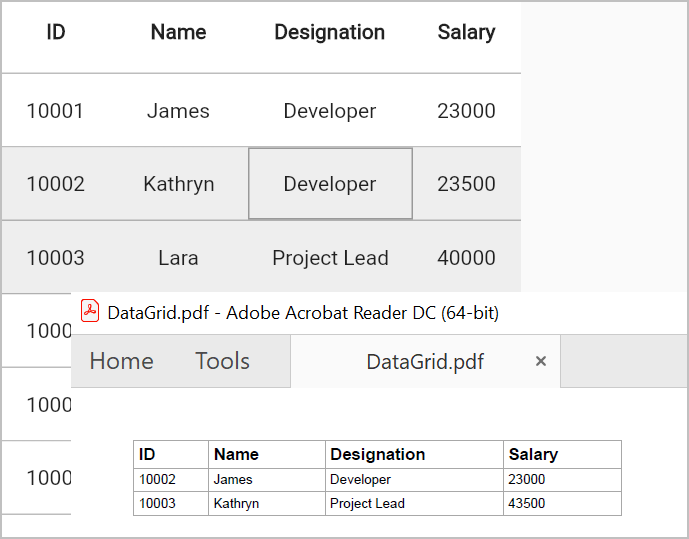
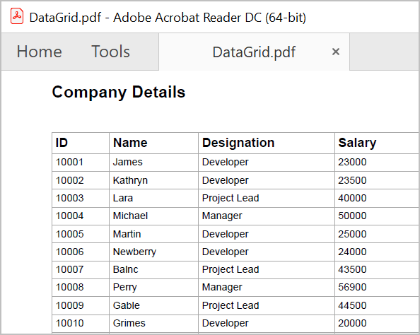
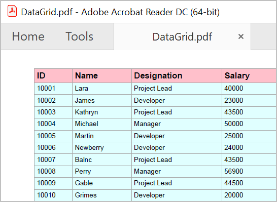
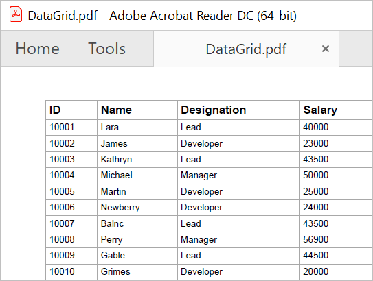

# Export to PDF in Flutter DataGrid (SfDataGrid)

The [SfDataGrid] (https://pub.dev/documentation/syncfusion_flutter_datagrid/latest/datagrid/SfDataGrid-class.html) supports exporting the data grid to PDF with several customization options like  excluding specific columns, repeated headers, fit all columns in one page, stacked headers, exporting table summary rows and so on.

The following dependencies should be added to your pubspec.yaml file for exporting to PDF.

   * syncfusion_flutter_datagrid_export/export.dart

   * syncfusion_flutter_pdf/pdf.dart

You can export the SfDataGrid to PDF by using the following extension methods present in the DataGridToPdfConverter class.

   * [exportToPdfDocument]
   * [exportToPdfGrid]

The following code illustrates how to create and display a SfDataGrid in view.




 GlobalKey<SfDataGridState> key = GlobalKey<SfDataGridState>();

@override
  Widget build(BuildContext context) {
    return Scaffold(
      body: Column(
        children: [
          ElevatedButton(
              child: Text('Export To Pdf'),
              onPressed: () {
                exportToPdf();
              }),
          Expanded(
            child: SfDataGrid(
                source: _employeeDataSource,
                allowEditing: true,
                key: key,
                columns: getcolumns,
                selectionMode: SelectionMode.multiple,
                navigationMode: GridNavigationMode.cell),
          ),
        ],
      ),
    );
  }




## Export DataGrid to PDF document

You can export the data to PDF by using the [exportToPdfDocument] method and from `key.currentState` of the datagrid.




    PdfDocument document = key.currentState!.exportToPdfDocument();

    final List<int> bytes = document.save();
    document.dispose();
  



## Export DataGrid to PDF Grid

You can export the data to PDF by using the [exportToPdfGrid]  method and from `key.currentState` of the datagrid.




    PdfDocument document = PdfDocument();
    PdfGrid pdfGrid = key.currentState!.exportToPdfGrid();

    final List<int> bytes = document.save();
    document.dispose();
  



## Exporting options 

### Exclude columns when exporting

By default, all the columns in the SfDataGrid will be exported to PDF. To exclude some particular columns when exporting to PDF, add those columns to [excludeColumns] list.




     PdfDocument document = key.currentState!.exportToPdfDocument( excludeColumns: getExcludecolumns());

      final List<int> bytes = document.save();
      document.dispose();

     List<String> getExcludecolumns() {
     return [
      'Name'
     ];
    }
  



### Repeat column headers on each page

You can show  the column headers on each page of the exported PDF document by using the [canRepeatHeaders] parameter. The default value is `true`.




     PdfDocument document = key.currentState!.exportToPdfDocument(canRepeatHeaders:true);

    final List<int> bytes = document.save();
    document.dispose();




### Export all columns in one page

While exporting to PDF, you can fit all columns in one page by setting [fitAllColumnsInOnePage] parameter as `true`.The default value is`false`




     PdfDocument document = key.currentState!.exportToPdfDocument(fitAllColumnsInOnePage:true);

    final List<int> bytes = document.save();
    document.dispose();




### Exclude table summaries when exporting

By default, table summaries in SfDataGrid will be exported to PDF. If you want to export without table summaries, you need to set [exportTableSummaries] parameter as `false`.




     PdfDocument document = key.currentState!.exportToPdfDocument(exportTableSummaries:false);

    final List<int> bytes = document.save();
    document.dispose();




### Exclude stacked headers when exporting

By default, stacked headers in SfDataGrid will be exported to PDF. If you want to export without table summaries, you need to set [exportStackedHeaders] parameter as `false`.




     PdfDocument document = key.currentState!.exportToPdfDocument(exportStackedHeaders:false);

    final List<int> bytes = document.save();
    document.dispose();




### Auto size column widths in PDF

By default, columns are exported with auto column width size. In order to export the actual value instead of the auto width, set the [autoColumnWidth] parameter as `false`.




     PdfDocument document = key.currentState!.exportToPdfDocument(autoColumnWidth:false);

    final List<int> bytes = document.save();
    document.dispose();




>**NOTE**
    if you set `autoColumnWidth` as false for actual column width then you must set `fitAllColumnsInOnePage` as false. Then only, the   overflowing columns are drawn in next page.

## Change the orientation of the PDF document

You can change the page orientation of PDF while exporting. The default page orientation is Portrait.

To change the page orientation, you need to get the exported PdfGrid by using [exportToPdfGrid] method and then draw that PdfGrid into a PdfDocument by changing the `PageSettings.Orientation` property of PdfDocument.




    PdfDocument pdfDocument = PdfDocument();
    pdfDocument.pageSettings.orientation = PdfPageOrientation.landscape;
    PdfPage pdfPage = pdfDocument.pages.add();
    PdfGrid pdfGrid = _key.currentState!.exportToPdfGrid();

    pdfGrid.draw(
     page: pdfPage,
     bounds: Rect.fromLTWH(0, 0, 0, 0));
    final List<int> bytes = document.save();
    document.dispose();
  




## Export the selected rows to PDF

By default, entire grid will be exported to PDF. You can export selected items only by passing `dataGridController.selectedRows` to [rows] in [exportToPdfDocument] and [exportToPdfGrid] methods.




    PdfDocument document = key.currentState!.exportToPdfDocument(rows: dataGridController.selectedRows,);

    final List<int> bytes = document.save();
    document.dispose();




## Setting header and footer in PDF document

SfDataGrid provides a way to display additional content at the top (Header) and bottom (Footer) of the page while exporting to PDF. This can be achieved by setting [headerFooterExport].

You can insert string, image or any drawing in header and footer in [headerFooterExport]. Setting `PdfPageTemplateElement` to `headerFooterExport.pdfDocumentTemplate.top` loads the content at top of the page and setting the `PdfPageTemplateElement` to `headerFooterExport.pdfDocumentTemplate.bottom` loads the content at bottom of the page.




    PdfDocument document = key.currentState!.exportToPdfDocument(
         headerFooterExport:
          (DataGridPdfHeaderFooterExportDetails headerFooterExport) {
        final double width = headerFooterExport.pdfPage.getClientSize().width;
        final PdfPageTemplateElement header =
            PdfPageTemplateElement(Rect.fromLTWH(0, 0, width, 65));
        header.graphics.drawString(
          'Company Details',
          PdfStandardFont(PdfFontFamily.helvetica, 13,
              style: PdfFontStyle.bold),
          bounds: const Rect.fromLTWH(0, 25, 200, 60),
        );
        headerFooterExport.pdfDocumentTemplate.top = header;
      },
      );




## Styling cells based on cell type in PDF

You can customize the cell styles based on CellType by using [cellExport].




    PdfDocument document = key.currentState!.exportToPdfDocument(
      cellExport:(cellExport){
           if (cellExport.cellType == DataGridExportCellType.columnHeader) {
            cellExport.pdfCell.style.backgroundBrush = PdfBrushes.pink;
           }
            if (cellExport.cellType == DataGridExportCellType.row) {
            cellExport.pdfCell.style.backgroundBrush = PdfBrushes.lightCyan;
           }
      },
      );




## Cell customization when exporting

### Customize cell values while exporting

The cell value can be customized while exporting to PDF by using the [cellExport].




    PdfDocument document = key.currentState!.exportToPdfDocument(
      cellExport:(cellExport){
          if (cellExport.cellType == DataGridExportCellType.row &&
            cellExport.columnName == 'Designation') {
          if (cellExport.cellValue == 'Project Lead') {
            cellExport.pdfCell.value = 'Lead';
          } 
        }
      }
      );




### Customize the Cells based on Column Name

You can customize the column style based on the row data when exporting to PDF by using the [cellExporting] callback.




    PdfDocument document = key.currentState!.exportToPdfDocument(
      cellExport:(cellExport){
         if (details.cellType == DataGridExportCellType.row && details.columnName == 'Customer Name') {
          details.pdfCell.style.textBrush = PdfBrushes.red;
        }
      }
    );




## Customize Exporting Behavior 

You can customize the Exporting Behavior by override the following methods in [DataGridToPdfConverter]

    Custom _custom=Custom();

    PdfDocument document = key.currentState!.exportToPdfDocument(
      converter: _custom,
    );

    Class Custom extends DataGridToPdfConverter{
     
      // TODO: override methods

    }

* [exportToPdfDocument]: by Override this method, you can change the behavior of the pdfDocument. 

 
 

    Class Custom extends DataGridToPdfConverter{
     @override
      PdfDocument exportToPdfDocument(SfDataGrid dataGrid, List<DataGridRow>? rows) {

      // TODO: Add your requirements

      return super.exportToPdfDocument(dataGrid, rows);
      }
    }




* [exportToPdfGrid]: by Override this method, you can change the behavior of the pdfGrid style,background color and so on.

  
 

    Class Custom extends DataGridToPdfConverter{
     @override
      PdfDocument exportToPdfGrid(SfDataGrid dataGrid, List<DataGridRow>? rows) {

      // TODO: Add your requirements

      return super.exportToPdfGrid(dataGrid, rows);
      }
      }




* [exportColumnHeader]: By Override this method, you can change the column header behaviors like changing name,style and so on.




    Class Custom extends DataGridToPdfConverter{
     
      @override
      void exportColumnHeader(SfDataGrid dataGrid, GridColumn column,
      String columnName, PdfGrid pdfGrid) {

         // TODO: Add your requirements

      super.exportColumnHeader(dataGrid, column, columnName, pdfGrid);
    }
  }




* [exportRows]:  By Override this method, you can export the data grid with your customized rows collection.




    Class Custom extends DataGridToPdfConverter{
       @override
       void exportRows(
       List<GridColumn> columns, List<DataGridRow> rows,    PdfGrid pdfGrid) {

          // TODO: Add your requirements
       
       super.exportRows(columns, rows, pdfGrid);
      }
    }




* [exportRow]: By Override this method, you can you can change the row data behaviors.




    Class Custom extends DataGridToPdfConverter{
     @override
     void exportRow(List<GridColumn> columns, DataGridRow row, PdfGrid pdfGrid) {
        
        // TODO: Add your requirements

        super.exportRow(columns, row, pdfGrid);
      } 
    }




* [getCellValue]:  By Override this method, you can change the row data.




    Class Custom extends DataGridToPdfConverter{
      @override
      Object? getCellValue(GridColumn column, DataGridRow row) {
        
        // TODO: Add your requirements
 
         return super.getCellValue(column, row);
      }
    }




