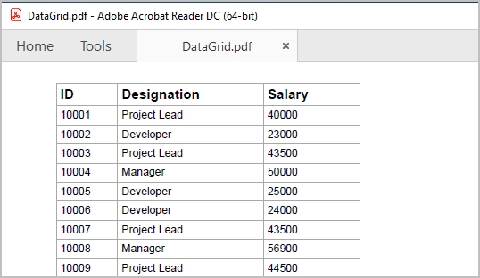
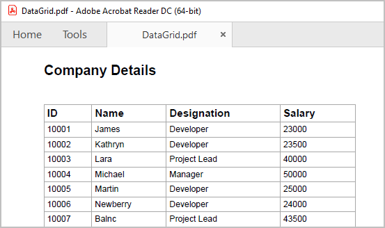
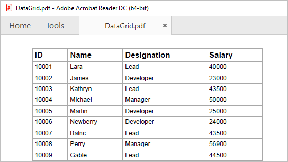

# Export to PDF in Flutter DataGrid (SfDataGrid)

The [SfDataGrid] (https://pub.dev/documentation/syncfusion_flutter_datagrid/latest/datagrid/SfDataGrid-class.html) provides support to export the content to PDF document with several customization options. 

**Add dependency**

The following dependencies should be added to your pubspec.yaml file for exporting to PDF.
  
   

    dependencies:

    syncfusion_flutter_datagrid_export: ^xx.x.xx

  

  >**NOTE** Here **xx.x.xx** denotes the current version of `Syncfusion Flutter DataGrid Export` package.

**Import package**

Import the following package in your Dart code.

 
  

    import 'package:syncfusion_flutter_datagrid_export/export.dart';

    import 'package:syncfusion_flutter_pdf/pdf.dart';

 
 

You can export the `SfDataGrid` to PDF by using the following extension methods present in the `SfDataGridState` class.

   * `exportToPdfDocument`
   * `exportToPdfGrid`

**Add GlobalKey for the DataGrid**
 
Create the [GlobalKey](https://api.flutter.dev/flutter/widgets/GlobalKey-class.html) with the [SfDataGridState](https://pub.dev/documentation/syncfusion_flutter_datagrid/latest/datagrid/SfDataGridState-class.html) class. Exporting related methods is available via the `SfDataGridState` class.

Set the created `GlobalKey` to the `SfDataGrid`.

 
 

    final GlobalKey<SfDataGridState> key = GlobalKey<SfDataGridState>();
    
 
 

The following code illustrates how to create and display a `SfDataGrid` with the global key.

 
 

    GlobalKey<SfDataGridState> key = GlobalKey<SfDataGridState>();

    @override
    Widget build(BuildContext context) {
       return Scaffold(
        body: Column(
         children: [
            ElevatedButton(
              child: Text('Export To Pdf'),
               onPressed: () {
                 PdfDocument document = key.currentState!.exportToPdfDocument();
              }),
            Expanded(
              child: SfDataGrid(
                source: _employeeDataSource,
                key: key,
                columns: [ 
                  GridColumn(
                    columnName: 'ID',
                    label: Container(
                    padding: EdgeInsets.symmetric(horizontal: 16.0),
                    alignment: Alignment.center,
                    child: Text(
                    'ID',
                    style: TextStyle(
                    fontWeight: FontWeight.bold, fontStyle: FontStyle.normal),
                   overflow: TextOverflow.ellipsis,
                  ))),
                 GridColumn(
                   columnName: 'Name',
                   label: Container(
                   padding: EdgeInsets.symmetric(horizontal: 16.0),
                   alignment: Alignment.center,
                   child: Text(
                   'Name',
                   style: TextStyle(
                   fontWeight: FontWeight.bold, fontStyle: FontStyle.normal),
                    overflow: TextOverflow.ellipsis,
                  ))),
                 GridColumn(
                  columnName: 'Designation',
                  label: Container(
                  padding: EdgeInsets.symmetric(horizontal: 16.0),
                  alignment: Alignment.center,
                  child: Text(
                  'Designation',
                  style: TextStyle(
                  fontWeight: FontWeight.bold, fontStyle: FontStyle.normal),
                  overflow: TextOverflow.ellipsis,
                 ))),
                 GridColumn(
                  columnName: 'Salary',
                  visible: true,
                  label: Container(
                  padding: EdgeInsets.symmetric(horizontal: 16.0),
                  alignment: Alignment.center,
                  child: Text(
                  'Salary',
                   style: TextStyle(
                   fontWeight: FontWeight.bold, fontStyle: FontStyle.normal),
                   overflow: TextOverflow.ellipsis,
                ))),
              ],
              )),
            ],
          ));
      }

 
 

## Export DataGrid to PDF document

You can export the data to [PdfDocument](https://pub.dev/documentation/syncfusion_flutter_pdf/latest/pdf/PdfDocument-class.html) by using the `exportToPdfDocument` method from `key.currentState` of the datagrid.




    PdfDocument document = key.currentState!.exportToPdfDocument();
    final List<int> bytes = document.save();
    File('DataGrid.pdf').writeAsBytes(bytes);
  



## Export DataGrid to PDF Grid

You can export the data to [PdfGrid](https://pub.dev/documentation/syncfusion_flutter_pdf/latest/pdf/PdfGrid-class.html) by using the `exportToPdfGrid` method from `key.currentState` of the datagrid.




    PdfDocument document = PdfDocument();
    PdfPage pdfPage = document.pages.add();
    PdfGrid pdfGrid = key.currentState!.exportToPdfGrid();
    pdfGrid.draw(
     page: pdfPage,
      bounds: Rect.fromLTWH(0, 0, 0, 0),
    );
    final List<int> bytes = document.save();
    File('DataGrid.pdf').writeAsBytes(bytes);
  



## Exporting options 

### Exclude columns when exporting

By default, all the columns in the SfDataGrid will be exported to PDF. To exclude some particular columns when exporting to PDF, add those column names to `excludeColumns` parameter.




     PdfDocument document = key.currentState!.exportToPdfDocument( excludeColumns: ['Name']);
     final List<int> bytes = document.save();
     



### Disable column headers on each page

You can disable the column headers on each page by setting the `canRepeatHeaders` parameter as `false`.




     PdfDocument document = key.currentState!.exportToPdfDocument(canRepeatHeaders:false);
     final List<int> bytes = document.save();




### Export all columns in one page

You can fit all the columns in one page by setting `fitAllColumnsInOnePage` parameter as `true`.




     PdfDocument document = key.currentState!.exportToPdfDocument(fitAllColumnsInOnePage:true);
     final List<int> bytes = document.save();




### Exclude table summaries when exporting

By default, table summaries in `SfDataGrid` will be exported to PDF. You can set `exportTableSummaries` parameter as `false` to export the `SfDataGrid` without table summaries.




     PdfDocument document = key.currentState!.exportToPdfDocument(exportTableSummaries:false);
     final List<int> bytes = document.save();




### Exclude stacked headers when exporting

By default, stacked headers in `SfDataGrid` will be exported to PDF. You can set `exportStackedHeaders` parameter as `false` to export the `SfDataGrid` without stacked headers.




     PdfDocument document = key.currentState!.exportToPdfDocument(exportStackedHeaders:false);
     final List<int> bytes = document.save();




### Auto size column widths in PDF

In order to export the actual column width from `SfDataGrid` instead of the auto column width, set the `autoColumnWidth` parameter as `false`.




     PdfDocument document = key.currentState!.exportToPdfDocument(autoColumnWidth:false);
     final List<int> bytes = document.save();




>**NOTE**
    If you disabled the `autoColumnWidth`, then you must set `fitAllColumnsInOnePage` as false. Then only, the overflowing columns are drawn in next page. Because, `fitAllColumnsInOnePage` has top most priority.

## Change the orientation of the PDF document

You can change the orientation of a page in PDF document by using `PdfDocument.pageSettings.orientation` property.

To change the page orientation, you need to export the `SfDataGrid` to `PdfGrid` using `exportToPdfGrid` method and draw the exported `PdfGrid` into a `PdfDocument`.




    PdfDocument pdfDocument = PdfDocument();
    pdfDocument.pageSettings.orientation = PdfPageOrientation.landscape;
    PdfPage pdfPage = pdfDocument.pages.add();
    PdfGrid pdfGrid = key.currentState!.exportToPdfGrid();
    pdfGrid.draw(
     page: pdfPage,
     bounds: Rect.fromLTWH(0, 0, 0, 0));
    final List<int> bytes = document.save();
  



## Export the selected rows to PDF

By default, entire grid will be exported to PDF. You can export selected rows only by passing `dataGridController.selectedRows` to `rows` parameter in `exportToPdfDocument` and `exportToPdfGrid` methods.




    PdfDocument document = key.currentState!.exportToPdfDocument(rows: dataGridController.selectedRows,);
    final List<int> bytes = document.save();




## Setting header and footer in PDF document

`SfDataGrid` provides a way to display additional content at the top (Header) and bottom (Footer) of the PDF page while exporting to PDF. This can be achieved by using `headerFooterExport` parameter in `exportToPdfDocument` or `exportToPdfGrid` methods.

Setting the `PdfPageTemplateElement` to `headerFooterExport.pdfDocumentTemplate.top` loads the content at top of the page and setting the `PdfPageTemplateElement` to `headerFooterExport.pdfDocumentTemplate.bottom` loads the content at bottom of the page.




    PdfDocument document = key.currentState!.exportToPdfDocument(
         headerFooterExport:
          (DataGridPdfHeaderFooterExportDetails headerFooterExport) {
        final double width = headerFooterExport.pdfPage.getClientSize().width;
        final PdfPageTemplateElement header =
            PdfPageTemplateElement(Rect.fromLTWH(0, 0, width, 65));
        header.graphics.drawString(
          'Company Details',
          PdfStandardFont(PdfFontFamily.helvetica, 13,
              style: PdfFontStyle.bold),
          bounds: const Rect.fromLTWH(0, 25, 200, 60),
        );
        headerFooterExport.pdfDocumentTemplate.top = header;
      },
      );
      final List<int> bytes = document.save();




## Styling cells based on cell type in PDF

You can customize the cell styles based on cell type using `cellExport` parameter which is a callback in `exportToPdfDocument` or `exportToPdfGrid` methods.




    PdfDocument document = key.currentState!.exportToPdfDocument(
      cellExport:(details){
           if (details.cellType == DataGridExportCellType.columnHeader) {
            details.pdfCell.style.backgroundBrush = PdfBrushes.pink;
           }
            if (details.cellType == DataGridExportCellType.row) {
            details.pdfCell.style.backgroundBrush = PdfBrushes.lightCyan;
           }
      },
    );
    final List<int> bytes = document.save();




## Cell customization when exporting

### Customize cell values while exporting

The cell value can be customized while exporting to PDF by directly setting the cell value of a cell in `PdfGrid` via `PdfCell` property available in argument of `cellExport` callback.




    PdfDocument document = key.currentState!.exportToPdfDocument(
      cellExport:(details){
          if (details.cellType == DataGridExportCellType.row &&
            details.columnName == 'Designation') {
          if (details.cellValue == 'Project Lead') {
            details.pdfCell.value = 'Lead';
          } 
        }
      }
    );
    final List<int> bytes = document.save();




### Customize the Cells based on Column Name

You can customize the column style based on the column name when exporting to PDF by using the `cellExport` parameter.




    PdfDocument document = key.currentState!.exportToPdfDocument(
      cellExport:(details){
         if (details.cellType == DataGridExportCellType.row && details.columnName == 'Customer Name') {
          details.pdfCell.style.textBrush = PdfBrushes.red;
        }
      }
    );
    final List<int> bytes = document.save();




## Customize Exporting Behavior 

You can customize the exporting behavior by overriding the available methods in `DataGridToPdfConverter` class and setting the instance of custom pdf converter to `converter` parameter in `exportToPdfDocument` or `exportToPdfGrid` method.




    Class CustomDataGridToPdfConverter extends DataGridToPdfConverter{
     
      @override
      void exportColumnHeader(SfDataGrid dataGrid, GridColumn column,
      String columnName, PdfGrid pdfGrid) {

            // TODO: Add your requirements column header

       super.exportColumnHeader(dataGrid, column, columnName, pdfGrid);
     }

     @override
     void exportColumnHeaders(
      SfDataGrid dataGrid, List<GridColumn> columns, PdfGrid pdfGrid) {

            // TODO: Add your requirements column headers

       super.exportColumnHeaders(dataGrid, columns, pdfGrid);
     }

     @override
     void exportRows(
       List<GridColumn> columns, List<DataGridRow> rows, PdfGrid pdfGrid) {

            // TODO: Add your requirements in exportRows
       
        super.exportRows(columns, rows, pdfGrid);
     }

      @override
      void exportRow(List<GridColumn> columns, DataGridRow row, PdfGrid pdfGrid) {
        
            // TODO: Add your requirements in exportRow

        super.exportRow(columns, row, pdfGrid);
      } 
    }



The following code snippet illustrates how to create a instance of `customDataGridToPdfConverter` class and  setting the instance to `converter` parameter in `exportToPdfDocument` or `exportToPdfGrid` method.




    CustomDataGridToPdfConverter customDataGridToPdfConverter = CustomDataGridToPdfConverter();

    PdfDocument document = key.currentState!.exportToPdfDocument(
      converter: customDataGridToPdfConverter,
    );
    final List<int> bytes = document.save();



