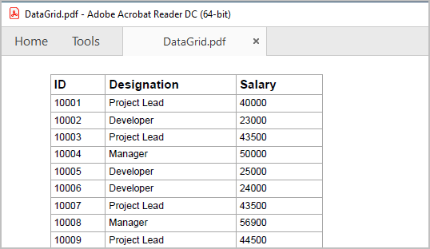
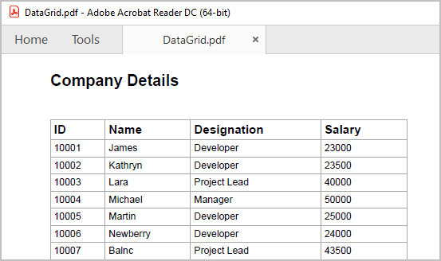
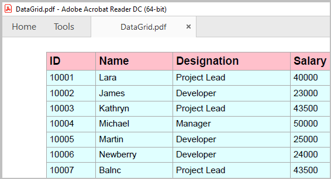
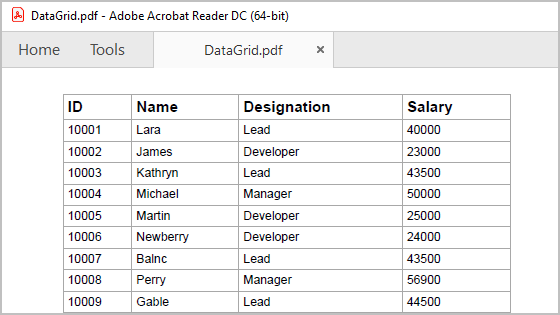

# Export Flutter DataGrid to PDF (SfDataGrid)

The [SfDataGrid](https://pub.dev/documentation/syncfusion_flutter_datagrid/latest/datagrid/SfDataGrid-class.html) provides support to export the content to PDF document with several customization options. 

**Add dependency**

The following dependencies must be added to your `pubspec.yaml` file for exporting to PDF.
  
 

dependencies:

syncfusion_flutter_datagrid_export: ^xx.x.xx



> **Note:** 
>- Here, **xx.x.xx** denotes the current version of `Syncfusion® Flutter DataGrid Export` package. Find the latest version on [pub.dev](https://pub.dev/packages/syncfusion_flutter_datagrid_export).
>- Supported on Android, iOS, web, macOS, and Windows platforms.

**Import package**

Import the following packages in your Dart code.


 

import 'package:syncfusion_flutter_datagrid_export/export.dart';

import 'package:syncfusion_flutter_pdf/pdf.dart';




You can export the `SfDataGrid` to PDF by using the following extension methods present in the [SfDataGridState](https://pub.dev/documentation/syncfusion_flutter_datagrid/latest/datagrid/SfDataGridState-class.html) class:

   * [exportToPdfDocument](https://pub.dev/documentation/syncfusion_flutter_datagrid_export/latest/syncfusion_flutter_datagrid_export/DataGridPdfExportExtensions/exportToPdfDocument.html)
   * [exportToPdfGrid](https://pub.dev/documentation/syncfusion_flutter_datagrid_export/latest/syncfusion_flutter_datagrid_export/DataGridPdfExportExtensions/exportToPdfGrid.html)

**Add GlobalKey for the DataGrid**
 
Create a [GlobalKey](https://api.flutter.dev/flutter/widgets/GlobalKey-class.html) using the `SfDataGridState` class. Exporting related methods are available via `SfDataGridState` class.

> **Note:** The GlobalKey must be assigned to the SfDataGrid widget to access export functionality. Without it, the export methods will not be available.

Set the created `GlobalKey` to the `SfDataGrid`.




  final GlobalKey<SfDataGridState> key = GlobalKey<SfDataGridState>();
    



The following code illustrates how to create and display a `SfDataGrid` using the global key.




  GlobalKey<SfDataGridState> key = GlobalKey<SfDataGridState>();

  @override
  Widget build(BuildContext context) {
    return Scaffold(
      body: Column(
        children: [
          ElevatedButton(
              child: Text('Export To Pdf'),
              onPressed: () {
                PdfDocument document = key.currentState!.exportToPdfDocument()
                final List<int> bytes = document.saveSync();
              }),
          Expanded(
            child: SfDataGrid(
              source: _employeeDataSource,
              columns: [
                GridColumn(
                    columnName: 'ID',
                    label: Container(
                        padding: EdgeInsets.symmetric(horizontal: 16.0),
                        alignment: Alignment.center,
                        child: Text(
                          'ID',
                          overflow: TextOverflow.ellipsis,
                        ))),
                GridColumn(
                    columnName: 'Name',
                    label: Container(
                        padding: EdgeInsets.symmetric(horizontal: 16.0),
                        alignment: Alignment.center,
                        child: Text(
                          'Name',
                          overflow: TextOverflow.ellipsis,
                        ))),
                GridColumn(
                    columnName: 'Designation',
                    label: Container(
                        padding: EdgeInsets.symmetric(horizontal: 16.0),
                        alignment: Alignment.center,
                        child: Text(
                          'Designation',
                          overflow: TextOverflow.ellipsis,
                        ))),
                GridColumn(
                    columnName: 'Salary',
                    label: Container(
                        padding: EdgeInsets.symmetric(horizontal: 16.0),
                        alignment: Alignment.center,
                        child: Text(
                          'Salary',
                          overflow: TextOverflow.ellipsis,
                        ))),
              ],
            ),
          ),
        ],
      ),
    );
  }




## Save the PDF document as a file

To save the file as a PDF document, it’s necessary to include [mobile](https://help.syncfusion.com/flutter/pdf/getting-started#save-and-open-a-pdf-document-in-mobile), [web](https://help.syncfusion.com/flutter/pdf/getting-started#save-and-download-a-pdf-document-in-web) and desktop platform-specific file generating code.

## Export DataGrid to PDF document

Export the data to the [PdfDocument](https://pub.dev/documentation/syncfusion_flutter_pdf/latest/pdf/PdfDocument-class.html) by using the `exportToPdfDocument` method from the `key.currentState` of the DataGrid.




PdfDocument document = key.currentState!.exportToPdfDocument();
final List<int> bytes = document.saveSync();
File('DataGrid.pdf').writeAsBytes(bytes);
  



## Export DataGrid to PDF Grid

Export the data to the [PdfGrid](https://pub.dev/documentation/syncfusion_flutter_pdf/latest/pdf/PdfGrid-class.html) by using the `exportToPdfGrid` method from the `key.currentState` of the DataGrid.




PdfDocument document = PdfDocument();
PdfPage pdfPage = document.pages.add();
PdfGrid pdfGrid = key.currentState!.exportToPdfGrid();
pdfGrid.draw(
 page: pdfPage,
 bounds: Rect.fromLTWH(0, 0, 0, 0),
);
final List<int> bytes = document.saveSync();
File('DataGrid.pdf').writeAsBytes(bytes);
  



## Exporting options 

### Exclude columns when exporting

By default, all the columns in the `SfDataGrid` are exported to PDF. To exclude some particular columns while exporting to PDF, add those column names to the [excludeColumns](https://pub.dev/documentation/syncfusion_flutter_datagrid_export/latest/syncfusion_flutter_datagrid_export/DataGridToPdfConverter/excludeColumns.html) parameter of the `exportToPdfDocument` or `exportToPdfGrid` method.




PdfDocument document = key.currentState!.exportToPdfDocument( excludeColumns: ['Name']);
final List<int> bytes = document.saveSync();
     



### Disable column headers on each page

You can disable the column headers on each page by setting the [canRepeatHeaders](https://pub.dev/documentation/syncfusion_flutter_datagrid_export/latest/syncfusion_flutter_datagrid_export/DataGridToPdfConverter/canRepeatHeaders.html) parameter as `false`.




PdfDocument document = key.currentState!.exportToPdfDocument(canRepeatHeaders: false);
final List<int> bytes = document.saveSync();




### Export all columns on one page

Fit all the columns on one page by setting the [fitAllColumnsInOnePage](https://pub.dev/documentation/syncfusion_flutter_datagrid_export/latest/syncfusion_flutter_datagrid_export/DataGridToPdfConverter/fitAllColumnsInOnePage.html) parameter as `true`.




PdfDocument document = key.currentState!.exportToPdfDocument(fitAllColumnsInOnePage: true);
final List<int> bytes = document.saveSync();




> **Note:** When `fitAllColumnsInOnePage` is enabled, it takes priority over `autoColumnWidth`. If you need to use actual column widths, ensure `fitAllColumnsInOnePage` is `false`.

### Exclude table summaries when exporting

By default, table summaries in `SfDataGrid` are exported to PDF. Set the [exportTableSummaries](https://pub.dev/documentation/syncfusion_flutter_datagrid_export/latest/syncfusion_flutter_datagrid_export/DataGridToPdfConverter/exportTableSummaries.html) parameter as `false` to export the `SfDataGrid` without table summaries (if applicable to your data source).




PdfDocument document = key.currentState!.exportToPdfDocument(exportTableSummaries: false);
final List<int> bytes = document.saveSync();




### Exclude stacked headers when exporting

By default, stacked headers in `SfDataGrid` are exported to PDF. Set the [exportStackedHeaders](https://pub.dev/documentation/syncfusion_flutter_datagrid_export/latest/syncfusion_flutter_datagrid_export/DataGridToPdfConverter/exportStackedHeaders.html) parameter as `false` to export the `SfDataGrid` without stacked headers (if applicable to your data source).




PdfDocument document = key.currentState!.exportToPdfDocument(exportStackedHeaders: false);
final List<int> bytes = document.saveSync();




### Auto-size column widths in PDF

In order to export the actual column width from `SfDataGrid` instead of the auto column width, set the [autoColumnWidth](https://pub.dev/documentation/syncfusion_flutter_datagrid_export/latest/syncfusion_flutter_datagrid_export/DataGridToPdfConverter/autoColumnWidth.html) parameter as `false`.




PdfDocument document = key.currentState!.exportToPdfDocument(autoColumnWidth: false, fitAllColumnsInOnePage: false);
final List<int> bytes = document.saveSync();




> **Note:** If you disable `autoColumnWidth`, you must also set `fitAllColumnsInOnePage` as `false` to allow overflowing columns to be drawn on subsequent pages.

## Change the orientation of the PDF document

Change the orientation of a page in a PDF document by using the [PdfPageSettings.orientation](https://pub.dev/documentation/syncfusion_flutter_pdf/latest/pdf/PdfPageSettings/orientation.html) property.

To change the page orientation, you need to export the `SfDataGrid` to `PdfGrid` using the `exportToPdfGrid` method and draw the exported `PdfGrid` into a `PdfDocument`.




PdfDocument document = PdfDocument();
document.pageSettings.orientation = PdfPageOrientation.landscape;
PdfPage pdfPage = document.pages.add();
PdfGrid pdfGrid = key.currentState!.exportToPdfGrid();
pdfGrid.draw(
  page: pdfPage,
  bounds: Rect.fromLTWH(0, 0, 0, 0));
final List<int> bytes = document.saveSync();
  



## Export the selected rows to PDF

By default, the entire grid is exported to PDF. Export the selected rows only by passing the [dataGridController.selectedRows](https://pub.dev/documentation/syncfusion_flutter_datagrid/latest/datagrid/DataGridController/selectedRows.html) collection to the [rows](https://pub.dev/documentation/syncfusion_flutter_datagrid/latest/datagrid/DataGridSource/rows.html) parameter in `exportToPdfDocument` and `exportToPdfGrid` methods.

> **Note:** If no rows are selected, the entire grid will be exported. Ensure rows are selected before calling the export method if you only want selected data.




PdfDocument document = key.currentState!.exportToPdfDocument(rows: dataGridController.selectedRows,);
final List<int> bytes = document.saveSync();




## Setting header and footer in PDF document

`SfDataGrid` provides a way to display additional content at the top (Header) and bottom (Footer) of the PDF page while exporting to PDF. This can be achieved by using the [headerFooterExport](https://pub.dev/documentation/syncfusion_flutter_datagrid_export/latest/syncfusion_flutter_datagrid_export/DataGridToPdfConverter/headerFooterExport.html) parameter in the `exportToPdfDocument` or `exportToPdfGrid` methods.

Setting the [PdfPageTemplateElement](https://pub.dev/documentation/syncfusion_flutter_pdf/latest/pdf/PdfPageTemplateElement-class.html) to [headerFooterExport.pdfDocumentTemplate.top](https://pub.dev/documentation/syncfusion_flutter_pdf/latest/pdf/PdfDocumentTemplate/top.html) loads the content at the top of the page, while setting the `PdfPageTemplateElement` to [headerFooterExport.pdfDocumentTemplate.bottom](https://pub.dev/documentation/syncfusion_flutter_pdf/latest/pdf/PdfDocumentTemplate/bottom.html) loads the content at the bottom of the page.

> **Note:** Headers and footers defined via templates will be repeated on every page of the multi-page PDF document.




PdfDocument document = key.currentState!.exportToPdfDocument(
    headerFooterExport: (DataGridPdfHeaderFooterExportDetails headerFooterExport) {
      final double width = headerFooterExport.pdfPage.getClientSize().width;
      final PdfPageTemplateElement header = PdfPageTemplateElement(Rect.fromLTWH(0, 0, width, 65));
      header.graphics.drawString(
        'Company Details',
        PdfStandardFont(PdfFontFamily.helvetica, 13, style: PdfFontStyle.bold),
        bounds: const Rect.fromLTWH(0, 25, 200, 60),
      );
      headerFooterExport.pdfDocumentTemplate.top = header;
    },
);
final List<int> bytes = document.saveSync();




## Styling cells based on the cell type in PDF

You can customize the cell styles based on cell type using the [cellExport](https://pub.dev/documentation/syncfusion_flutter_datagrid_export/latest/syncfusion_flutter_datagrid_export/DataGridToPdfConverter/cellExport.html) parameter, which is a callback function in `exportToPdfDocument` or `exportToPdfGrid` methods. This callback is invoked for each cell during export, allowing you to modify styles and values dynamically.

> **Note:** When both cell value and cell style properties are modified in the `cellExport` callback, both modifications are applied to the exported PDF cell.




PdfDocument document = key.currentState!.exportToPdfDocument(cellExport: (details) {
    if (details.cellType == DataGridExportCellType.columnHeader) {
      details.pdfCell.style.backgroundBrush = PdfBrushes.pink;
    }
    if (details.cellType == DataGridExportCellType.row) {
      details.pdfCell.style.backgroundBrush = PdfBrushes.lightCyan;
    }
});
final List<int> bytes = document.saveSync();




## Cell customization when exporting

### Customize cell values while exporting

The cell value can be customized while exporting to PDF by directly setting the cell value of a cell in the `PdfGrid` via the [PdfCell](https://pub.dev/documentation/syncfusion_flutter_datagrid_export/latest/syncfusion_flutter_datagrid_export/DataGridCellPdfExportDetails/pdfCell.html) property available in the argument of the `cellExport` callback.




PdfDocument document = key.currentState!.exportToPdfDocument(cellExport: (details) {
   if (details.cellType == DataGridExportCellType.row &&
       details.columnName == 'Designation') {
     if (details.cellValue == 'Project Lead') {
       details.pdfCell.value = 'Lead';
     }
   }    
});
final List<int> bytes = document.saveSync();




### Customize the Cells based on Column Name

You can customize the column style based on the column name while exporting to PDF by using the `cellExport` parameter.




PdfDocument document = key.currentState!.exportToPdfDocument(cellExport: (details) {
    if (details.cellType == DataGridExportCellType.row && details.columnName == 'Customer Name') {
     details.pdfCell.style.textBrush = PdfBrushes.red;
    }
  }
);
final List<int> bytes = document.saveSync();




## Customize Exporting Behavior 

For advanced export scenarios beyond the standard customization options, customize the exporting behavior by overriding the available methods in the [DataGridToPdfConverter](https://pub.dev/documentation/syncfusion_flutter_datagrid_export/latest/syncfusion_flutter_datagrid_export/DataGridToPdfConverter-class.html) class. Use the `converter` parameter in the `exportToPdfDocument` or `exportToPdfGrid` method.

> **Note:** Use custom converters when you need to modify the export logic for column headers, rows, or data formatting beyond what the standard parameters provide.




class CustomDataGridToPdfConverter extends DataGridToPdfConverter {
  @override
  void exportColumnHeader(SfDataGrid dataGrid, GridColumn column,
      String columnName, PdfGrid pdfGrid) {
    // Custom implementation for individual column header export
    super.exportColumnHeader(dataGrid, column, columnName, pdfGrid);
  }

  @override
  void exportColumnHeaders(
      SfDataGrid dataGrid, List<GridColumn> columns, PdfGrid pdfGrid) {
    // Custom implementation for all column headers export
    super.exportColumnHeaders(dataGrid, columns, pdfGrid);
  }

  @override
  void exportRows(
      List<GridColumn> columns, List<DataGridRow> rows, PdfGrid pdfGrid) {
    // Custom implementation for exporting multiple rows
    super.exportRows(columns, rows, pdfGrid);
  }

  @override
  void exportRow(List<GridColumn> columns, DataGridRow row, PdfGrid pdfGrid) {
    // Custom implementation for exporting individual row
    super.exportRow(columns, row, pdfGrid);
  }
}



The following code sample illustrates how to create an instance of the `CustomDataGridToPdfConverter` class and set the instance to the `converter` parameter in the `exportToPdfDocument` or `exportToPdfGrid` method.




CustomDataGridToPdfConverter customDataGridToPdfConverter = CustomDataGridToPdfConverter();

PdfDocument document = key.currentState!.exportToPdfDocument(converter: customDataGridToPdfConverter);
final List<int> bytes = document.saveSync();



