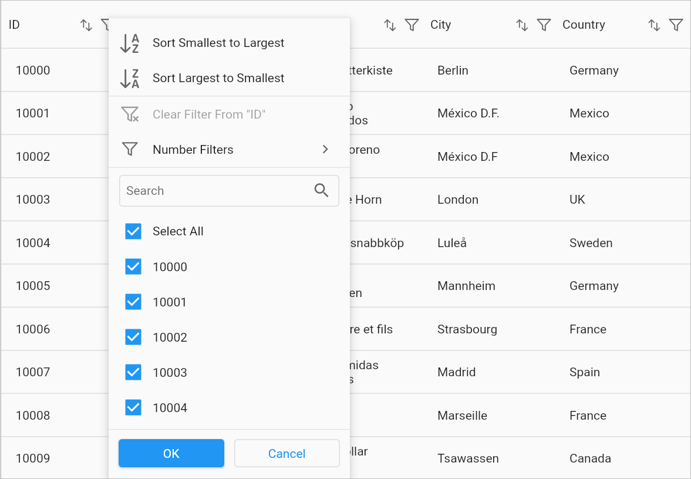

---
layout: post
title: Filtering in Flutter DataGrid | DataTable | Syncfusion
description: Learn all about how to filter the data rows in Syncfusion Flutter DataGrid (SfDataGrid) widget and more here.
platform: flutter
control: SfDataGrid
documentation: ug
--- 

# Filtering in Flutter DataGrid (SfDataGrid)

Filtering is the process of fetching the values from a collection that satisfies a specified condition. In the `SfDataGrid`, filtering can be applied through the UI and programmatically.

## Programmatical Filtering

The SfDataGrid allows you to filter the data rows programmatically by adding the filter conditions along with the respective column name to the `DataGridSource.filterConditions` map collection. In the map collection, the `key` defines the `columnName` and the `values` defines the list of `FilterCondition`.

`DataGridSource.filterConditions` is an unmodifiable map collection. So, it doesn't allow us to perform CRUD operations directly in the `DataGridSource.filterConditions` property. However, it can be done by the following public methods:

### Add filter

A filter condition to the specific column can be added by the `DataGridSource.addFilter` method.


 

@override
Widget build(BuildContext context) {
  return Column(
    children: [
      Expanded(
        child: SfDataGrid(source: _employeeDataSource, columns: [
          GridColumn(
              columnName: 'ID',
              label: Container(
                  padding: EdgeInsets.symmetric(horizontal: 16.0),
                  alignment: Alignment.centerRight,
                  child: Text(
                    'ID',
                    overflow: TextOverflow.ellipsis,
                  ))),
          GridColumn(
              columnName: 'Name',
              label: Container(
                  padding: EdgeInsets.symmetric(horizontal: 16.0),
                  alignment: Alignment.centerLeft,
                  child: Text(
                    'Name',
                    overflow: TextOverflow.ellipsis,
                  ))),
          GridColumn(
              columnName: 'Designation',
              label: Container(
                  padding: EdgeInsets.symmetric(horizontal: 16.0),
                  alignment: Alignment.centerLeft,
                  child: Text(
                    'Designation',
                    overflow: TextOverflow.ellipsis,
                  ))),
          GridColumn(
              columnName: 'Salary',
              label: Container(
                  padding: EdgeInsets.symmetric(horizontal: 16.0),
                  alignment: Alignment.centerRight,
                  child: Text(
                    'Salary',
                    overflow: TextOverflow.ellipsis,
                  ))),
        ]),
      ),
      MaterialButton(
          child: Text('Add Filter'),
          onPressed: () {
            _employeeDataSource.addFilter('ID',
                FilterCondition(type: FilterType.lessThan, value: 1005));
          }),
    ],
  );
}




### Remove filter

A filter condition to the specific column can be removed by the `DataGridSource.removeFilter` method.


 

@override
Widget build(BuildContext context) {
  return Column(
    children: [
      Expanded(
        child: SfDataGrid(source: _employeeDataSource, columns: [
          GridColumn(
              columnName: 'ID',
              label: Container(
                  padding: EdgeInsets.symmetric(horizontal: 16.0),
                  alignment: Alignment.centerRight,
                  child: Text(
                    'ID',
                    overflow: TextOverflow.ellipsis,
                  ))),
          GridColumn(
              columnName: 'Name',
              label: Container(
                  padding: EdgeInsets.symmetric(horizontal: 16.0),
                  alignment: Alignment.centerLeft,
                  child: Text(
                    'Name',
                    overflow: TextOverflow.ellipsis,
                  ))),
          GridColumn(
              columnName: 'Designation',
              label: Container(
                  padding: EdgeInsets.symmetric(horizontal: 16.0),
                  alignment: Alignment.centerLeft,
                  child: Text(
                    'Designation',
                    overflow: TextOverflow.ellipsis,
                  ))),
          GridColumn(
              columnName: 'Salary',
              label: Container(
                  padding: EdgeInsets.symmetric(horizontal: 16.0),
                  alignment: Alignment.centerRight,
                  child: Text(
                    'Salary',
                    overflow: TextOverflow.ellipsis,
                  ))),
        ]),
      ),
      MaterialButton(
          child: Text('Remove Filter'),
          onPressed: () {
            _employeeDataSource.removeFilter('Name',
                FilterCondition(type: FilterType.equals, value: 'James'));
          }),
    ],
  );
}




### Clear filter

The filter conditions from the entire column can be cleared by the `DataGridSource.clearFilters` method. The filter conditions in the specific column can also be cleared by invoking the `DataGridSource.clearFilters` method along with the corresponding `columnName` as an argument.


 

@override
Widget build(BuildContext context) {
  return Column(
    children: [
      Expanded(
        child: SfDataGrid(source: _employeeDataSource, columns: [
          GridColumn(
              columnName: 'ID',
              label: Container(
                  padding: EdgeInsets.symmetric(horizontal: 16.0),
                  alignment: Alignment.centerRight,
                  child: Text(
                    'ID',
                    overflow: TextOverflow.ellipsis,
                  ))),
          GridColumn(
              columnName: 'Name',
              label: Container(
                  padding: EdgeInsets.symmetric(horizontal: 16.0),
                  alignment: Alignment.centerLeft,
                  child: Text(
                    'Name',
                    overflow: TextOverflow.ellipsis,
                  ))),
          GridColumn(
              columnName: 'Designation',
              label: Container(
                  padding: EdgeInsets.symmetric(horizontal: 16.0),
                  alignment: Alignment.centerLeft,
                  child: Text(
                    'Designation',
                    overflow: TextOverflow.ellipsis,
                  ))),
          GridColumn(
              columnName: 'Salary',
              label: Container(
                  padding: EdgeInsets.symmetric(horizontal: 16.0),
                  alignment: Alignment.centerRight,
                  child: Text(
                    'Salary',
                    overflow: TextOverflow.ellipsis,
                  ))),
        ]),
      ),
      MaterialButton(
          child: Text('Clear Filters'),
          onPressed: () {
            _employeeDataSource.clearFilters();
          }),
    ],
  );
}




### Filter behavior

The `FilterBehavior` property is used to specify whether filtering should consider the value of a cell as the string or its data type

* **stringDataType** - It converts the cell value as string data type and compares the condition.
* **strongDataType** - It compares the cell value with its actual data type.


 

@override
Widget build(BuildContext context) {
  return Column(
    children: [
      Expanded(
        child: SfDataGrid(source: _employeeDataSource, columns: [
          GridColumn(
              columnName: 'ID',
              label: Container(
                  padding: EdgeInsets.symmetric(horizontal: 16.0),
                  alignment: Alignment.centerRight,
                  child: Text(
                    'ID',
                    overflow: TextOverflow.ellipsis,
                  ))),
          GridColumn(
              columnName: 'Name',
              label: Container(
                  padding: EdgeInsets.symmetric(horizontal: 16.0),
                  alignment: Alignment.centerLeft,
                  child: Text(
                    'Name',
                    overflow: TextOverflow.ellipsis,
                  ))),
          GridColumn(
              columnName: 'Designation',
              label: Container(
                  padding: EdgeInsets.symmetric(horizontal: 16.0),
                  alignment: Alignment.centerLeft,
                  child: Text(
                    'Designation',
                    overflow: TextOverflow.ellipsis,
                  ))),
          GridColumn(
              columnName: 'Salary',
              label: Container(
                  padding: EdgeInsets.symmetric(horizontal: 16.0),
                  alignment: Alignment.centerRight,
                  child: Text(
                    'Salary',
                    overflow: TextOverflow.ellipsis,
                  ))),
        ]),
      ),
      MaterialButton(
          child: Text('Add Filter'),
          onPressed: () {
            _employeeDataSource.addFilter(
              'ID',
              FilterCondition(
                value: 1005,
                type: FilterType.contains,
                filterBehavior: FilterBehavior.stringDataType,
              ),
            );
          }),
    ],
  );
}




### Filter operator

The `FilterOperator` property is used to decide how a logical operator is to be applied between multiple filter conditions.

* **and** - `AND` logical operator applies between multiple filter conditions. 
* **or** - `OR` logical operator applies between multiple filter conditions.


 

@override
Widget build(BuildContext context) {
  return Column(
    children: [
      Expanded(
        child: SfDataGrid(source: _employeeDataSource, columns: [
          GridColumn(
              columnName: 'ID',
              label: Container(
                  padding: EdgeInsets.symmetric(horizontal: 16.0),
                  alignment: Alignment.centerRight,
                  child: Text(
                    'ID',
                    overflow: TextOverflow.ellipsis,
                  ))),
          GridColumn(
              columnName: 'Name',
              label: Container(
                  padding: EdgeInsets.symmetric(horizontal: 16.0),
                  alignment: Alignment.centerLeft,
                  child: Text(
                    'Name',
                    overflow: TextOverflow.ellipsis,
                  ))),
          GridColumn(
              columnName: 'Designation',
              label: Container(
                  padding: EdgeInsets.symmetric(horizontal: 16.0),
                  alignment: Alignment.centerLeft,
                  child: Text(
                    'Designation',
                    overflow: TextOverflow.ellipsis,
                  ))),
          GridColumn(
              columnName: 'Salary',
              label: Container(
                  padding: EdgeInsets.symmetric(horizontal: 16.0),
                  alignment: Alignment.centerRight,
                  child: Text(
                    'Salary',
                    overflow: TextOverflow.ellipsis,
                  ))),
        ]),
      ),
      MaterialButton(
          child: Text('Add Filter'),
          onPressed: () {
            _employeeDataSource.addFilter(
              'ID',
              FilterCondition(
                value: 1005,
                filterOperator: FilterOperator.and,
                type: FilterType.greaterThanOrEqual,
              ),
            );

            _employeeDataSource.addFilter(
              'ID',
              FilterCondition(
                value: 1010,
                filterOperator: FilterOperator.and,
                type: FilterType.lessThanOrEqual,
              ),
            );
          }),
    ],
  );
}




### Filter rows with a range between two dates

The column which holds the `DateTime` type data can be filtered with a range between two dates by applying the two filter conditions to the same column. The `FilterType` for the filter condition with the start date should be `GreaterThanOrEqual` and the end date should be `LessThanOrEqual` and the `FilterOperator` for the filter condition should be `and`.


 

@override
Widget build(BuildContext context) {
  return Column(
    children: [
      Expanded(
        child: SfDataGrid(source: _employeeDataSource, columns: [
          GridColumn(
              columnName: 'ID',
              label: Container(
                  padding: EdgeInsets.symmetric(horizontal: 16.0),
                  alignment: Alignment.centerRight,
                  child: Text(
                    'ID',
                    overflow: TextOverflow.ellipsis,
                  ))),
          GridColumn(
              columnName: 'Name',
              label: Container(
                  padding: EdgeInsets.symmetric(horizontal: 16.0),
                  alignment: Alignment.centerLeft,
                  child: Text(
                    'Name',
                    overflow: TextOverflow.ellipsis,
                  ))),
          GridColumn(
              columnName: 'Date of Joining',
              label: Container(
                  padding: EdgeInsets.symmetric(horizontal: 16.0),
                  alignment: Alignment.centerRight,
                  child: Text(
                    'Date of Joining',
                    overflow: TextOverflow.ellipsis,
                  ))),
          GridColumn(
              columnName: 'Salary',
              label: Container(
                  padding: EdgeInsets.symmetric(horizontal: 16.0),
                  alignment: Alignment.centerRight,
                  child: Text(
                    'Salary',
                    overflow: TextOverflow.ellipsis,
                  ))),
        ]),
      ),
      MaterialButton(
          child: Text('Filter rows with a range'),
          onPressed: () {
            _employeeDataSource.addFilter(
              'Date of Joining',
              FilterCondition(
                value: DateTime(2000, 07, 12),
                filterOperator: FilterOperator.and,
                type: FilterType.greaterThanOrEqual,
              ),
            );

            _employeeDataSource.addFilter(
              'Date of Joining',
              FilterCondition(
                value: DateTime(2022, 03, 24),
                filterOperator: FilterOperator.and,
                type: FilterType.lessThanOrEqual,
              ),
            );
          }),
    ],
  );
}




### Retrieving the filtered rows

After filtering, the rows can be retrieved in the same order as displayed in the view by using the [DataGridSource.effectiveRows](https://pub.dev/documentation/syncfusion_flutter_datagrid/latest/datagrid/DataGridSource/effectiveRows.html) property. It holds the filtered collection if the filtering is applied in the data grid.

## UI Filtering

The `SfDataGrid` provides an excel-like filtering UI and an advanced filter UI to filter the data easily. UI filtering can be enabled by setting the `SfDataGrid.allowFiltering` property to `true`. This allows the filter UI to be opened by clicking on the filter icon in the column header. The filtering UI will be shown as a popup menu on the desktop and web platforms, and it will be shown as a new page on the mobile platforms.

The `SfDataGrid` provides the following types of filter popup modes:

* **Checkbox Filter** - Provides excel like filter interface with a list of checkboxes.
* **Advanced Filter** - Provides advanced filter options to filter the data with multiple conditions.

### Checkbox filtering

The Checkbox filtering is like the Excel-like filter popup that shows the checked list box of the unique items with the search text field. The items which are in the checked state will be visible in the view. Other items will be filtered out from the view.

### Advanced filtering

Advanced filter UI provides multiple filter options to filter the data rows. The filter menu options are loaded based on advanced filter type by automatically detecting the underlying data type of the current column.
Below are the built-in filter types supported:

* **Text Filters** – Loads various menu options to filter the display text effectively.
* **Number Filters** – Loads various menu options to filter the numeric data.
* **Date Filters** – Loads various menu options and `DatePicker` to filter DateTime type column.

<table>
<tr>
<th>Text Filters </th>
<th>Number Filters </th>
<th>Date Filters </th>
</tr>
<tr>
<td>When the string value is loaded to the <code>GridColumn</code>, then <code>TextFilters</code> options are loaded in <code>advanced filter view</code>. </td>
<td>When the numeric value is loaded to the <code>GridColumn</code>, then <code>NumberFilters</code> options are loaded in <code>advanced filter view</code>. </td>
<td> When the DateTime type value is loaded to the <code>GridColumn</code>, then <code>DateFilters</code> options are loaded in <code>advanced filter view</code>. </td>
</tr>
<tr>
<td>  </td>
<td>  </td>
<td>  </td>
</tr>
<tr>
<td align="left" valign="top"><b>Filter menu options</b> <ul><li>Equals</li> <li>Does Not Equal</li> <li>Begins With</li> <li>Does Not Begin With</li> <li>Ends With</li> <li>Does Not End With</li> <li>Contains</li> <li>Does Not Contain</li> <li>Empty</li> <li>Not Empty</li> <li>Null</li> <li>Not Null</li></ul> </td>
<td align="left" valign="top"><b>Filter menu options</b> <li>Equals</li> <li>Does Not Equal</li> <li>Less Than</li> <li>Less Than Or Equal</li> <li>Greater Than</li> <li>Greater Than Or Equal</li> <li>Null</li> <li>Not Null</li></ul> </td>
<td align="left" valign="top"><b>Filter menu options</b> <li>Equals</li> <li>Does Not Equal</li> <li>Before</li> <li>Before Or Equal</li> <li>After</li> <li>After Or Equal</li> <li>Null</li> <li>Not Null</li></ul> </td>
</tr>
<table>

#### Case sensitive filtering

Case-sensitive filtering can be enabled for the column using the casing icon available in the advanced filter UI. This is available only for the `TextFilters` filter view. If the icon is active, the filtering will be applied with the case sensitive with the filter text. The case-sensitive icon will be shown only to the string-type columns.

### Disable filtering for an individual column

The `GridColumn.allowFiltering` has a higher priority than the `SfDataGrid.allowFiltering` property. So, you can disable the filtering for any particular column by setting the `GridColumn.allowFiltering` property to `false`.


 

@override
Widget build(BuildContext context) {
  return SfDataGrid(
      allowFiltering: true,
      source: _employeeDataSource,
      columns: [
        GridColumn(
            allowFiltering: false,
            columnName: 'ID',
            label: Container(
                padding: EdgeInsets.symmetric(horizontal: 16.0),
                alignment: Alignment.centerRight,
                child: Text(
                  'ID',
                  overflow: TextOverflow.ellipsis,
                ))),
        GridColumn(
            columnName: 'Name',
            label: Container(
                padding: EdgeInsets.symmetric(horizontal: 16.0),
                alignment: Alignment.centerLeft,
                child: Text(
                  'Name',
                  overflow: TextOverflow.ellipsis,
                ))),
        GridColumn(
            columnName: 'Designation',
            label: Container(
                padding: EdgeInsets.symmetric(horizontal: 16.0),
                alignment: Alignment.centerLeft,
                child: Text(
                  'Designation',
                  overflow: TextOverflow.ellipsis,
                ))),
        GridColumn(
            columnName: 'Salary',
            label: Container(
                padding: EdgeInsets.symmetric(horizontal: 16.0),
                alignment: Alignment.centerRight,
                child: Text(
                  'Salary',
                  overflow: TextOverflow.ellipsis,
                ))),
      ]);
}




## Callbacks

The SfDataGrid provides the following callbacks to notify the filtering stages:

### OnFilterChanging callback

`onFilterChanging` callback invokes when the filtering is being applied to the particular column through UI filtering. You can return `false` from this callback to restrict the column from being filtered.


 

@override
Widget build(BuildContext context) {
  return SfDataGrid(
      allowFiltering: true,
      source: _employeeDataSource,
      onFilterChanging: (DataGridFilterChangeDetails details) {
        if (details.column.columnName == 'Salary') {
          return false;
        }
        return true;
      },
      columns: [
        GridColumn(
            columnName: 'ID',
            label: Container(
                padding: EdgeInsets.symmetric(horizontal: 16.0),
                alignment: Alignment.centerRight,
                child: Text(
                  'ID',
                  overflow: TextOverflow.ellipsis,
                ))),
        GridColumn(
            columnName: 'Name',
            label: Container(
                padding: EdgeInsets.symmetric(horizontal: 16.0),
                alignment: Alignment.centerLeft,
                child: Text(
                  'Name',
                  overflow: TextOverflow.ellipsis,
                ))),
        GridColumn(
            columnName: 'Designation',
            label: Container(
                padding: EdgeInsets.symmetric(horizontal: 16.0),
                alignment: Alignment.centerLeft,
                child: Text(
                  'Designation',
                  overflow: TextOverflow.ellipsis,
                ))),
        GridColumn(
            columnName: 'Salary',
            label: Container(
                padding: EdgeInsets.symmetric(horizontal: 16.0),
                alignment: Alignment.centerRight,
                child: Text(
                  'Salary',
                  overflow: TextOverflow.ellipsis,
                ))),
      ]);
}




### OnFilterChanged callback

`onFilterChanged` callback invokes after the filtering is applied to the particular column through UI filtering. You can use this callback to get filter conditions.


 

@override
Widget build(BuildContext context) {
  return SfDataGrid(
      allowFiltering: true,
      source: _employeeDataSource,
      onFilterChanged: (DataGridFilterChangeDetails details) {
        print('Column Name: ${details.column.columnName}');
        print('Filter Type: ${details.filterConditions.last.type}');
        print('Filter Value : ${details.filterConditions.last.value}');
      },
      columns: [
        GridColumn(
            columnName: 'ID',
            label: Container(
                padding: EdgeInsets.symmetric(horizontal: 16.0),
                alignment: Alignment.centerRight,
                child: Text(
                  'ID',
                  overflow: TextOverflow.ellipsis,
                ))),
        GridColumn(
            columnName: 'Name',
            label: Container(
                padding: EdgeInsets.symmetric(horizontal: 16.0),
                alignment: Alignment.centerLeft,
                child: Text(
                  'Name',
                  overflow: TextOverflow.ellipsis,
                ))),
        GridColumn(
            columnName: 'Designation',
            label: Container(
                padding: EdgeInsets.symmetric(horizontal: 16.0),
                alignment: Alignment.centerLeft,
                child: Text(
                  'Designation',
                  overflow: TextOverflow.ellipsis,
                ))),
        GridColumn(
            columnName: 'Salary',
            label: Container(
                padding: EdgeInsets.symmetric(horizontal: 16.0),
                alignment: Alignment.centerRight,
                child: Text(
                  'Salary',
                  overflow: TextOverflow.ellipsis,
                ))),
      ]);
}


