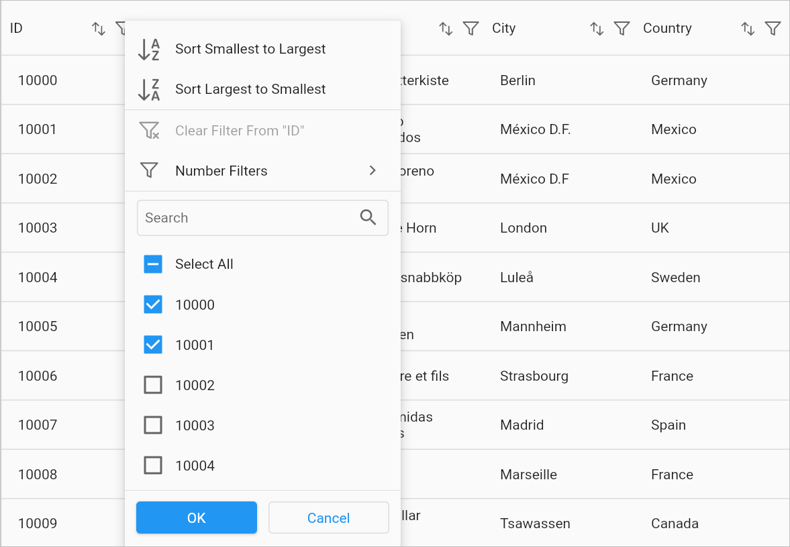
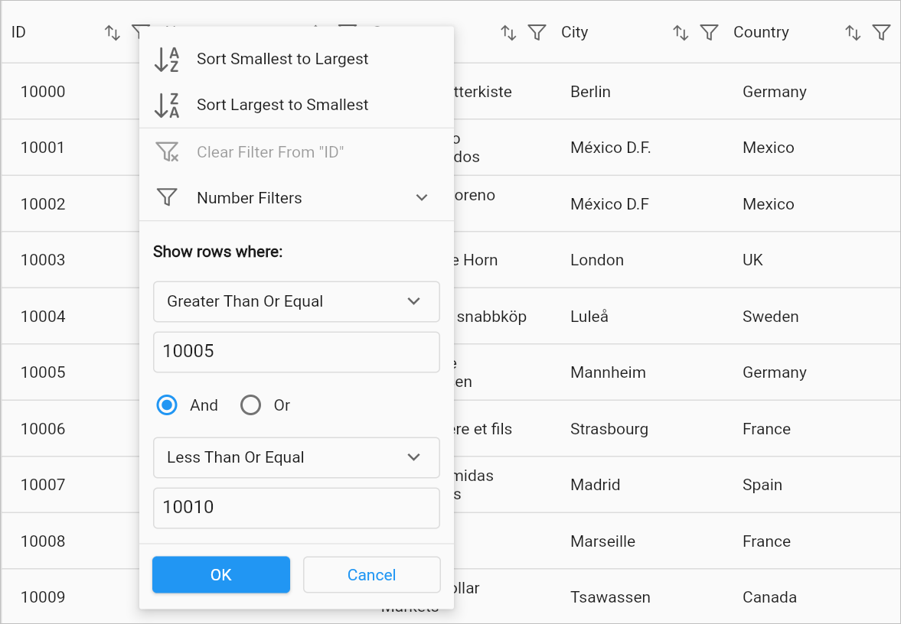
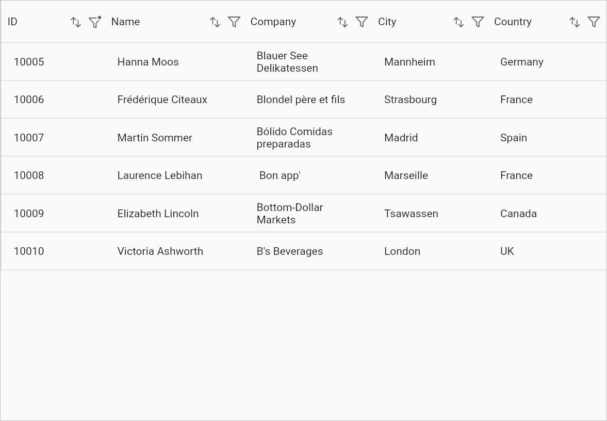
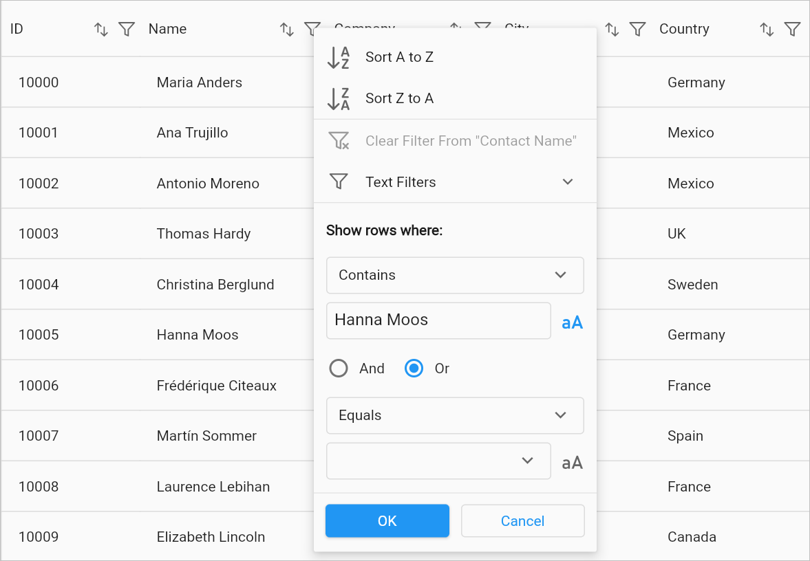
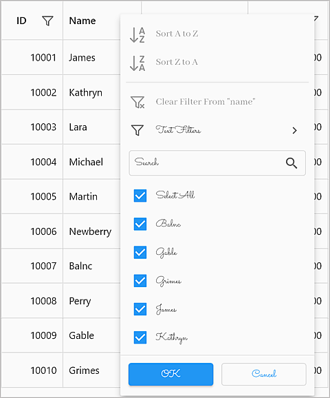
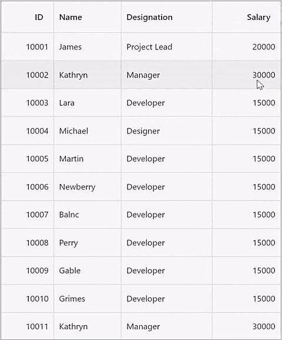

---
layout: post
title: Filtering in Flutter DataGrid | DataTable | Syncfusion
description: Learn all about how to filter the data rows in Syncfusion Flutter DataGrid (SfDataGrid) widget and more here.
platform: flutter
control: SfDataGrid
documentation: ug
--- 

# Filtering in Flutter DataGrid (SfDataGrid)

Filtering is the process of fetching the values from a collection that satisfy specified condition. In the [SfDataGrid](https://pub.dev/documentation/syncfusion_flutter_datagrid/latest/datagrid/SfDataGrid-class.html), filtering can be applied both through the UI and programmatically.

## Programmatic Filtering

The SfDataGrid allows you to filter the data rows programmatically by adding filter conditions along with their respective column names to the [DataGridSource.filterConditions](https://pub.dev/documentation/syncfusion_flutter_datagrid/latest/datagrid/DataGridSource/filterConditions.html) map collection. In the map collection, the `key` defines the [columnName](https://pub.dev/documentation/syncfusion_flutter_datagrid/latest/datagrid/GridColumn/columnName.html) and the `values` define the list of [FilterCondition](https://pub.dev/documentation/syncfusion_flutter_datagrid/latest/datagrid/FilterCondition-class.html).

`DataGridSource.filterConditions` is an unmodifiable map collection. So, it doesn't allow us to perform CRUD operations directly in the `DataGridSource.filterConditions` property. However, it can be done by the following public methods:

### Add filter

A filter condition to the specific column can be added by the [DataGridSource.addFilter](https://pub.dev/documentation/syncfusion_flutter_datagrid/latest/datagrid/DataGridSource/addFilter.html) method.


 

  @override
  Widget build(BuildContext context) {
    return Column(
      children: [
        Expanded(
          child: SfDataGrid(
            source: _employeeDataSource, 
            columns: [
              GridColumn(
                columnName: 'ID',
                label: Container(
                  padding: EdgeInsets.symmetric(horizontal: 16.0),
                  alignment: Alignment.centerRight,
                  child: Text(
                    'ID',
                    overflow: TextOverflow.ellipsis,
                  )
                )
              ),
              GridColumn(
                columnName: 'Name',
                label: Container(
                  padding: EdgeInsets.symmetric(horizontal: 16.0),
                  alignment: Alignment.centerLeft,
                  child: Text(
                    'Name',
                    overflow: TextOverflow.ellipsis,
                  )
                )
              ),
              GridColumn(
                columnName: 'Designation',
                label: Container(
                  padding: EdgeInsets.symmetric(horizontal: 16.0),
                  alignment: Alignment.centerLeft,
                  child: Text(
                    'Designation',
                    overflow: TextOverflow.ellipsis,
                  )
                )
              ),
              GridColumn(
                columnName: 'Salary',
                label: Container(
                  padding: EdgeInsets.symmetric(horizontal: 16.0),
                  alignment: Alignment.centerRight,
                  child: Text(
                    'Salary',
                    overflow: TextOverflow.ellipsis,
                  )
                )
              ),
            ]
          ),
        ),
        MaterialButton(
          child: Text('Add Filter'),
          onPressed: () {
            _employeeDataSource.addFilter(
              'ID',
              FilterCondition(type: FilterType.lessThan, value: 1005)
            );
          }
        ),
      ],
    );
  }




### Remove filter

A filter condition can be removed from a specific column using the [DataGridSource.removeFilter](https://pub.dev/documentation/syncfusion_flutter_datagrid/latest/datagrid/DataGridSource/removeFilter.html) method.


 

  @override
  Widget build(BuildContext context) {
    return Column(
      children: [
        Expanded(
          child: SfDataGrid(
            source: _employeeDataSource, 
            columns: [
              GridColumn(
                columnName: 'ID',
                label: Container(
                  padding: EdgeInsets.symmetric(horizontal: 16.0),
                  alignment: Alignment.centerRight,
                  child: Text(
                    'ID',
                    overflow: TextOverflow.ellipsis,
                  )
                )
              ),
              GridColumn(
                columnName: 'Name',
                label: Container(
                  padding: EdgeInsets.symmetric(horizontal: 16.0),
                  alignment: Alignment.centerLeft,
                  child: Text(
                    'Name',
                    overflow: TextOverflow.ellipsis,
                  )
                )
              ),
              GridColumn(
                columnName: 'Designation',
                label: Container(
                  padding: EdgeInsets.symmetric(horizontal: 16.0),
                  alignment: Alignment.centerLeft,
                  child: Text(
                    'Designation',
                    overflow: TextOverflow.ellipsis,
                  )
                )
              ),
              GridColumn(
                columnName: 'Salary',
                label: Container(
                  padding: EdgeInsets.symmetric(horizontal: 16.0),
                  alignment: Alignment.centerRight,
                  child: Text(
                    'Salary',
                    overflow: TextOverflow.ellipsis,
                  )
                )
              ),
            ]
          ),
        ),
        MaterialButton(
          child: Text('Remove Filter'),
          onPressed: () {
            if (_employeeDataSource.filterConditions.keys.contains('Name')) {
              final FilterCondition? condition = _employeeDataSource
                  .filterConditions['Name']!
                  .firstWhereOrNull((item) =>
                      item.value == 'James' && item.type == FilterType.equals);
              if (condition != null) {
                _employeeDataSource.removeFilter('Name', condition);
              }
            }
          }
        ),
      ],
    );
  }




### Clear filter

Filter conditions can be cleared from all columns using the [DataGridSource.clearFilters](https://pub.dev/documentation/syncfusion_flutter_datagrid/latest/datagrid/DataGridSource/clearFilters.html) method. To clear filters from a specific column, provide the corresponding `columnName` as an argument.


 

  @override
  Widget build(BuildContext context) {
    return Column(
      children: [
        Expanded(
          child: SfDataGrid(
            source: _employeeDataSource, 
            columns: [
              GridColumn(
                columnName: 'ID',
                label: Container(
                  padding: EdgeInsets.symmetric(horizontal: 16.0),
                  alignment: Alignment.centerRight,
                  child: Text(
                    'ID',
                    overflow: TextOverflow.ellipsis,
                  )
                )
              ),
              GridColumn(
                columnName: 'Name',
                label: Container(
                  padding: EdgeInsets.symmetric(horizontal: 16.0),
                  alignment: Alignment.centerLeft,
                  child: Text(
                    'Name',
                    overflow: TextOverflow.ellipsis,
                  )
                )
              ),
              GridColumn(
                columnName: 'Designation',
                label: Container(
                  padding: EdgeInsets.symmetric(horizontal: 16.0),
                  alignment: Alignment.centerLeft,
                  child: Text(
                    'Designation',
                    overflow: TextOverflow.ellipsis,
                  )
                )
              ),
              GridColumn(
                columnName: 'Salary',
                label: Container(
                  padding: EdgeInsets.symmetric(horizontal: 16.0),
                  alignment: Alignment.centerRight,
                  child: Text(
                    'Salary',
                    overflow: TextOverflow.ellipsis,
                  )
                )
              ),
            ]
          ),
        ),
        MaterialButton(
          child: Text('Clear Filters'),
          onPressed: () {
            _employeeDataSource.clearFilters();
          }
        ),
      ],
    );
  }




### Filter behavior

The [FilterBehavior](https://pub.dev/documentation/syncfusion_flutter_datagrid/latest/datagrid/FilterBehavior.html) property specifies whether filtering should consider cell values as strings or by their actual data types.

* **stringDataType** - Converts the cell value to a string data type before comparing.
* **strongDataType** - Compares the cell value using its actual data type.


 

  @override
  Widget build(BuildContext context) {
    return Column(
      children: [
        Expanded(
          child: SfDataGrid(
            source: _employeeDataSource, 
            columns: [
              GridColumn(
                columnName: 'ID',
                label: Container(
                  padding: EdgeInsets.symmetric(horizontal: 16.0),
                  alignment: Alignment.centerRight,
                  child: Text(
                    'ID',
                    overflow: TextOverflow.ellipsis,
                  )
                )
              ),
              GridColumn(
                columnName: 'Name',
                label: Container(
                  padding: EdgeInsets.symmetric(horizontal: 16.0),
                  alignment: Alignment.centerLeft,
                  child: Text(
                    'Name',
                    overflow: TextOverflow.ellipsis,
                  )
                )
              ),
              GridColumn(
                columnName: 'Designation',
                label: Container(
                  padding: EdgeInsets.symmetric(horizontal: 16.0),
                  alignment: Alignment.centerLeft,
                  child: Text(
                    'Designation',
                    overflow: TextOverflow.ellipsis,
                  )
                )
              ),
              GridColumn(
                columnName: 'Salary',
                label: Container(
                  padding: EdgeInsets.symmetric(horizontal: 16.0),
                  alignment: Alignment.centerRight,
                  child: Text(
                    'Salary',
                    overflow: TextOverflow.ellipsis,
                  )
                )
              ),
            ]
          ),
        ),
        MaterialButton(
          child: Text('Add Filter'),
          onPressed: () {
            _employeeDataSource.addFilter(
              'ID',
              FilterCondition(
                value: 1005,
                type: FilterType.contains,
                filterBehavior: FilterBehavior.stringDataType,
              ),
            );
          }
        ),
      ],
    );
  }




### Filter operator

The [FilterOperator](https://pub.dev/documentation/syncfusion_flutter_datagrid/latest/datagrid/FilterOperator.html) property determines which logical operator to apply between multiple filter conditions:

* **and** - Applies the `AND` logical operator between multiple filter conditions. 
* **or** - Applies the `OR` logical operator between multiple filter conditions.


 

  @override
  Widget build(BuildContext context) {
    return Column(
      children: [
        Expanded(
          child: SfDataGrid(
            source: _employeeDataSource, 
            columns: [
              GridColumn(
                columnName: 'ID',
                label: Container(
                  padding: EdgeInsets.symmetric(horizontal: 16.0),
                  alignment: Alignment.centerRight,
                  child: Text(
                    'ID',
                    overflow: TextOverflow.ellipsis,
                  )
                )
              ),
              GridColumn(
                columnName: 'Name',
                label: Container(
                  padding: EdgeInsets.symmetric(horizontal: 16.0),
                  alignment: Alignment.centerLeft,
                  child: Text(
                    'Name',
                    overflow: TextOverflow.ellipsis,
                  )
                )
              ),
              GridColumn(
                columnName: 'Designation',
                label: Container(
                  padding: EdgeInsets.symmetric(horizontal: 16.0),
                  alignment: Alignment.centerLeft,
                  child: Text(
                    'Designation',
                    overflow: TextOverflow.ellipsis,
                  )
                )
              ),
              GridColumn(
                columnName: 'Salary',
                label: Container(
                  padding: EdgeInsets.symmetric(horizontal: 16.0),
                  alignment: Alignment.centerRight,
                  child: Text(
                    'Salary',
                    overflow: TextOverflow.ellipsis,
                  )
                )
              ),
            ]
          ),
        ),
        MaterialButton(
          child: Text('Add Filter'),
          onPressed: () {
            _employeeDataSource.addFilter(
              'ID',
              FilterCondition(
                value: 1005,
                filterOperator: FilterOperator.and,
                type: FilterType.greaterThanOrEqual,
              ),
            );
            _employeeDataSource.addFilter(
              'ID',
              FilterCondition(
                value: 1010,
                filterOperator: FilterOperator.and,
                type: FilterType.lessThanOrEqual,
              ),
            );
          }
        ),
      ],
    );
  }




### Filter rows with a range between two dates

The column which holds the [DateTime](https://api.flutter.dev/flutter/dart-core/DateTime-class.html) type data can be filtered with a range between two dates by applying the two filter conditions to the same column. The [FilterType](https://pub.dev/documentation/syncfusion_flutter_datagrid/latest/datagrid/FilterType.html) for the filter condition with the start date should be `GreaterThanOrEqual` and the end date should be `LessThanOrEqual` and the `FilterOperator` for the filter condition should be `and`.


 

  @override
  Widget build(BuildContext context) {
    return Column(
      children: [
        Expanded(
          child: SfDataGrid(
            source: _employeeDataSource, 
            columns: [
              GridColumn(
                columnName: 'ID',
                label: Container(
                  padding: EdgeInsets.symmetric(horizontal: 16.0),
                  alignment: Alignment.centerRight,
                  child: Text(
                    'ID',
                    overflow: TextOverflow.ellipsis,
                  )
                )
              ),
              GridColumn(
                columnName: 'Name',
                label: Container(
                  padding: EdgeInsets.symmetric(horizontal: 16.0),
                  alignment: Alignment.centerLeft,
                  child: Text(
                    'Name',
                    overflow: TextOverflow.ellipsis,
                  )
                )
              ),
              GridColumn(
                columnName: 'Date of Joining',
                label: Container(
                  padding: EdgeInsets.symmetric(horizontal: 16.0),
                  alignment: Alignment.centerRight,
                  child: Text(
                    'Date of Joining',
                    overflow: TextOverflow.ellipsis,
                  )
                )
              ),
              GridColumn(
                columnName: 'Salary',
                label: Container(
                  padding: EdgeInsets.symmetric(horizontal: 16.0),
                  alignment: Alignment.centerRight,
                  child: Text(
                    'Salary',
                    overflow: TextOverflow.ellipsis,
                  )
                )
              ),
            ]
          ),
        ),
        MaterialButton(
          child: Text('Filter rows with a date range'),
          onPressed: () {
            _employeeDataSource.addFilter(
              'Date of Joining',
              FilterCondition(
                value: DateTime(2000, 07, 12),
                filterOperator: FilterOperator.and,
                type: FilterType.greaterThanOrEqual,
              ),
            );
            _employeeDataSource.addFilter(
              'Date of Joining',
              FilterCondition(
                value: DateTime(2022, 03, 24),
                filterOperator: FilterOperator.and,
                type: FilterType.lessThanOrEqual,
              ),
            );
          }
        ),
      ],
    );
  }




### Retrieving the filtered rows

After filtering, you can retrieve the rows in the same order as displayed in the view using the [DataGridSource.effectiveRows](https://pub.dev/documentation/syncfusion_flutter_datagrid/latest/datagrid/DataGridSource/effectiveRows.html) property. This property holds the filtered collection when filtering is applied to the data grid.

## UI Filtering

`SfDataGrid` provides an Excel-like filtering UI and an advanced filter UI for easy data filtering. UI filtering can be enabled by setting the [SfDataGrid.allowFiltering](https://pub.dev/documentation/syncfusion_flutter_datagrid/latest/datagrid/SfDataGrid/allowFiltering.html) property to `true.` This allows the filter UI to be opened by clicking the filter icon in the column header. The filtering UI appears as a popup menu on desktop and web platforms, and as a new page on mobile platforms.

The `SfDataGrid` provides the following types of filter popup modes:

* **Checkbox Filter** - Provides excel like filter interface with a list of checkboxes.
* **Advanced Filter** - Provides advanced filter options to filter the data with multiple conditions.

The following image shows the checkbox filter popup menu on the web and desktop platforms,

The following image shows the advanced filter popup menu on the web and desktop platforms,

The following images show the checkbox and advanced filter popup menu on the mobile platform,

### Checkbox filtering

The Checkbox filtering is like the Excel-like filter popup that shows the checked list box of the unique items with the search text field. The items which are in the checked state will be visible in the view. Other items will be filtered out from the view.

The following image shows the checkbox filter popup menu with some selected rows in the checkbox list view in order to filter,

The following image shows the filtered data rows which are filtered by the checkbox filter popup menu,

### Advanced filtering

Advanced filter UI provides multiple filter options to filter data rows. The filter menu options are loaded based on the advanced filter type, which is automatically determined by detecting the underlying data type of the current column.

Below are the built-in filter types supported:

* **Text Filters** – Loads various menu options to filter the display text effectively.
* **Number Filters** – Loads various menu options to filter the numeric data.
* **Date Filters** – Loads various menu options and [DatePicker](https://api.flutter.dev/flutter/material/showDatePicker.html) to filter the DateTime type column.

<table>
<tr>
<th>Text Filters </th>
<th>Number Filters </th>
<th>Date Filters </th>
</tr>
<tr>
<td>When the string value is loaded to the <code>GridColumn</code>, then <code>TextFilters</code> options are loaded in <code>advanced filter view</code>. </td>
<td>When the numeric value is loaded to the <code>GridColumn</code>, then <code>NumberFilters</code> options are loaded in <code>advanced filter view</code>. </td>
<td> When the DateTime type value is loaded to the <code>GridColumn</code>, then <code>DateFilters</code> options are loaded in <code>advanced filter view</code>. </td>
</tr>
<tr>
<td>  </td>
<td>  </td>
<td>  </td>
</tr>
<tr>
<td align="left" valign="top"><b>Filter menu options</b> <ul><li>Equals</li> <li>Does Not Equal</li> <li>Begins With</li> <li>Does Not Begin With</li> <li>Ends With</li> <li>Does Not End With</li> <li>Contains</li> <li>Does Not Contain</li> <li>Empty</li> <li>Not Empty</li> <li>Null</li> <li>Not Null</li></ul> </td>
<td align="left" valign="top"><b>Filter menu options</b> <ul><li>Equals</li> <li>Does Not Equal</li> <li>Less Than</li> <li>Less Than Or Equal</li> <li>Greater Than</li> <li>Greater Than Or Equal</li> <li>Null</li> <li>Not Null</li></ul> </td>
<td align="left" valign="top"><b>Filter menu options</b> <ul><li>Equals</li> <li>Does Not Equal</li> <li>Before</li> <li>Before Or Equal</li> <li>After</li> <li>After Or Equal</li> <li>Null</li> <li>Not Null</li></ul> </td>
</tr>
</table>

The following image shows the advanced filter popup menu with multiple filter values and types in order to filter the range of data rows,

The following image shows the filtered data rows which are filtered by the advanced filter popup menu,

#### Case sensitive filtering

Case-sensitive filtering can be enabled for the column using the casing icon available in the advanced filter UI. This is available only for the `TextFilters` filter view. If the icon is active, the filtering will be applied with the case sensitive with the filter text. The case-sensitive icon will be shown only to the string-type columns.

The following image shows the advanced filter popup menu with a case-sensitive icon,

### Disable filtering for an individual column

The [GridColumn.allowFiltering](https://pub.dev/documentation/syncfusion_flutter_datagrid/latest/datagrid/GridColumn/allowFiltering.html) has a higher priority than the `SfDataGrid.allowFiltering` property. So, you can disable the filtering for any particular column by setting the `GridColumn.allowFiltering` property to `false`.


 

  @override
  Widget build(BuildContext context) {
    return SfDataGrid(
      allowFiltering: true,
      source: _employeeDataSource,
      columns: [
        GridColumn(
          allowFiltering: false,
          columnName: 'ID',
          label: Container(
            padding: EdgeInsets.symmetric(horizontal: 16.0),
            alignment: Alignment.centerRight,
            child: Text(
              'ID',
              overflow: TextOverflow.ellipsis,
            )
          )
        ),
        GridColumn(
          columnName: 'Name',
          label: Container(
            padding: EdgeInsets.symmetric(horizontal: 16.0),
            alignment: Alignment.centerLeft,
            child: Text(
              'Name',
              overflow: TextOverflow.ellipsis,
            )
          )
        ),
        GridColumn(
          columnName: 'Designation',
          label: Container(
            padding: EdgeInsets.symmetric(horizontal: 16.0),
            alignment: Alignment.centerLeft,
            child: Text(
              'Designation',
              overflow: TextOverflow.ellipsis,
            )
          )
        ),
        GridColumn(
          columnName: 'Salary',
          label: Container(
            padding: EdgeInsets.symmetric(horizontal: 16.0),
            alignment: Alignment.centerRight,
            child: Text(
              'Salary',
              overflow: TextOverflow.ellipsis,
            )
          )
        ),
      ]
    );
  }




## Callbacks

The SfDataGrid provides the following callbacks to notify the filtering stages:

### OnFilterChanging callback

[onFilterChanging](https://pub.dev/documentation/syncfusion_flutter_datagrid/latest/datagrid/SfDataGrid/onFilterChanging.html) callback invokes when the filtering is being applied to the particular column through UI filtering. You can return `false` from this callback to restrict the column from being filtered.


 

  @override
  Widget build(BuildContext context) {
    return SfDataGrid(
      allowFiltering: true,
      source: _employeeDataSource,
      onFilterChanging: (DataGridFilterChangeDetails details) {
        if (details.column.columnName == 'Salary') {
          return false;
        }
        return true;
      },
      columns: [
        GridColumn(
          columnName: 'ID',
          label: Container(
            padding: EdgeInsets.symmetric(horizontal: 16.0),
            alignment: Alignment.centerRight,
            child: Text(
              'ID',
              overflow: TextOverflow.ellipsis,
            )
          )
        ),
        GridColumn(
          columnName: 'Name',
          label: Container(
            padding: EdgeInsets.symmetric(horizontal: 16.0),
            alignment: Alignment.centerLeft,
            child: Text(
              'Name',
              overflow: TextOverflow.ellipsis,
            )
          )
        ),
        GridColumn(
          columnName: 'Designation',
          label: Container(
            padding: EdgeInsets.symmetric(horizontal: 16.0),
            alignment: Alignment.centerLeft,
            child: Text(
              'Designation',
              overflow: TextOverflow.ellipsis,
            )
          )
        ),
        GridColumn(
          columnName: 'Salary',
          label: Container(
            padding: EdgeInsets.symmetric(horizontal: 16.0),
            alignment: Alignment.centerRight,
            child: Text(
              'Salary',
              overflow: TextOverflow.ellipsis,
            )
          )
        ),
      ]
    );
  }




### OnFilterChanged callback

The [onFilterChanged](https://pub.dev/documentation/syncfusion_flutter_datagrid/latest/datagrid/SfDataGrid/onFilterChanged.html) callback is invoked after filtering is applied to a particular column through UI filtering. You can use this callback to access filter conditions.


 

  @override
  Widget build(BuildContext context) {
    return SfDataGrid(
      allowFiltering: true,
      source: _employeeDataSource,
      onFilterChanged: (DataGridFilterChangeDetails details) {
        print('Column Name: ${details.column.columnName}');
        print('Filter Type: ${details.filterConditions.last.type}');
        print('Filter Value: ${details.filterConditions.last.value}');
      },
      columns: [
        GridColumn(
          columnName: 'ID',
          label: Container(
            padding: EdgeInsets.symmetric(horizontal: 16.0),
            alignment: Alignment.centerRight,
            child: Text(
              'ID',
              overflow: TextOverflow.ellipsis,
            )
          )
        ),
        GridColumn(
          columnName: 'Name',
          label: Container(
            padding: EdgeInsets.symmetric(horizontal: 16.0),
            alignment: Alignment.centerLeft,
            child: Text(
              'Name',
              overflow: TextOverflow.ellipsis,
            )
          )
        ),
        GridColumn(
          columnName: 'Designation',
          label: Container(
            padding: EdgeInsets.symmetric(horizontal: 16.0),
            alignment: Alignment.centerLeft,
            child: Text(
              'Designation',
              overflow: TextOverflow.ellipsis,
            )
          )
        ),
        GridColumn(
          columnName: 'Salary',
          label: Container(
            padding: EdgeInsets.symmetric(horizontal: 16.0),
            alignment: Alignment.centerRight,
            child: Text(
              'Salary',
              overflow: TextOverflow.ellipsis,
            )
          )
        ),
      ]
    );
  }




## Customizing the filter popup menu options

The `SfDataGrid` provides support to customize the menu options in the filter popup menu. Please refer to the following topics for more information.

### Show checkbox or advanced filtering mode

By default, both the checkbox and advanced filtering options are shown in the filter popup menu. Show either checkbox or the advanced filtering menu option. Specific columns can be set by using the [FilterPopupMenuOptions.filterMode](https://pub.dev/documentation/syncfusion_flutter_datagrid/latest/datagrid/FilterPopupMenuOptions/filterMode.html) in the [GridColumn.filterPopupMenuOptions](https://pub.dev/documentation/syncfusion_flutter_datagrid/latest/datagrid/GridColumn/filterPopupMenuOptions.html) property.


 

import 'package:syncfusion_flutter_datagrid/datagrid.dart';

  @override
  Widget build(BuildContext context) {
    return Scaffold(
      appBar: AppBar(title: const Text('Syncfusion Flutter DataGrid')),
      body: SfDataGrid(
        source: employeeDataSource,
        columnWidthMode: ColumnWidthMode.auto,
        allowFiltering: true,
        columns: [
          GridColumn(
            columnName: 'ID',
            filterPopupMenuOptions:
              FilterPopupMenuOptions(filterMode: FilterMode.checkboxFilter),
            label: Container(
              padding: EdgeInsets.symmetric(horizontal: 8.0),
              alignment: Alignment.center,
              child: Text('ID')
            )
          ),
          GridColumn(
            columnName: 'Name',
            label: Container(
              padding: EdgeInsets.symmetric(horizontal: 8.0),
              alignment: Alignment.center,
              child: Text('Name')
            )
          ),
          GridColumn(
            columnName: 'Designation',
            label: Container(
              padding: EdgeInsets.symmetric(horizontal: 8.0),
              alignment: Alignment.center,
              child: Text('Designation')
            )
          ),
          GridColumn(
            columnName: 'Salary',
            label: Container(
              padding: EdgeInsets.symmetric(horizontal: 8.0),
              alignment: Alignment.center,
              child: Text('Salary')
            )
          )
        ],
      ),
    );
  }




### Hiding sort options

The sort options in the filter popup menu can be hidden by setting the [FilterPopupMenuOptions.canShowSortingOptions](https://pub.dev/documentation/syncfusion_flutter_datagrid/latest/datagrid/FilterPopupMenuOptions/canShowSortingOptions.html) property to `false` in the `GridColumn.filterPopupMenuOptions.`


 

import 'package:syncfusion_flutter_datagrid/datagrid.dart';

  @override
  Widget build(BuildContext context) {
    return Scaffold(
      appBar: AppBar(title: const Text('Syncfusion Flutter DataGrid')),
      body: SfDataGrid(
        source: employeeDataSource,
        columnWidthMode: ColumnWidthMode.auto,
        allowFiltering: true,
        columns: [
          GridColumn(
              columnName: 'ID',
              filterPopupMenuOptions:
                  FilterPopupMenuOptions(canShowSortingOptions: false),
              label: Container(
                  padding: EdgeInsets.symmetric(horizontal: 8.0),
                  alignment: Alignment.center,
                  child: Text('ID'))),
          GridColumn(
              columnName: 'Name',
              label: Container(
                  padding: EdgeInsets.symmetric(horizontal: 8.0),
                  alignment: Alignment.center,
                  child: Text('Name'))),
          GridColumn(
              columnName: 'Designation',
              label: Container(
                  padding: EdgeInsets.symmetric(horizontal: 8.0),
                  alignment: Alignment.center,
                  child: Text('Designation'))),
          GridColumn(
              columnName: 'Salary',
              label: Container(
                  padding: EdgeInsets.symmetric(horizontal: 8.0),
                  alignment: Alignment.center,
                  child: Text('Salary')))
        ],
      ),
    );
  }




### Hiding clear filter option

The `Clear Filter From {Column Name}` menu option from the filter popup menu can be hidden by setting the [FilterPopupMenuOptions.canShowClearFilterOption](https://pub.dev/documentation/syncfusion_flutter_datagrid/latest/datagrid/FilterPopupMenuOptions/canShowClearFilterOption.html) property to false in the `GridColumn.filterPopupMenuOptions.`


 

import 'package:syncfusion_flutter_datagrid/datagrid.dart';

  @override
  Widget build(BuildContext context) {
    return Scaffold(
      appBar: AppBar(title: const Text('Syncfusion Flutter DataGrid')),
      body: SfDataGrid(
        source: employeeDataSource,
        columnWidthMode: ColumnWidthMode.auto,
        allowFiltering: true,
        columns: [
          GridColumn(
              columnName: 'ID',
              filterPopupMenuOptions:
                  FilterPopupMenuOptions(canShowClearFilterOption: false),
              label: Container(
                  padding: EdgeInsets.symmetric(horizontal: 8.0),
                  alignment: Alignment.center,
                  child: Text('ID'))),
          GridColumn(
              columnName: 'Name',
              label: Container(
                  padding: EdgeInsets.symmetric(horizontal: 8.0),
                  alignment: Alignment.center,
                  child: Text('Name'))),
          GridColumn(
              columnName: 'Designation',
              label: Container(
                  padding: EdgeInsets.symmetric(horizontal: 8.0),
                  alignment: Alignment.center,
                  child: Text('Designation'))),
          GridColumn(
              columnName: 'Salary',
              label: Container(
                  padding: EdgeInsets.symmetric(horizontal: 8.0),
                  alignment: Alignment.center,
                  child: Text('Salary')))
        ],
      ),
    );
  }




### Hiding column name from "clear filter" option

The name of the column which is showing along with the `Clear Filter From {Column Name}` menu option in the filter popup menu can be hidden by setting the [FilterPopupMenuOptions.showColumnName](https://pub.dev/documentation/syncfusion_flutter_datagrid/latest/datagrid/FilterPopupMenuOptions/showColumnName.html) property to false in the `GridColumn.filterPopupMenuOptions.`


 

import 'package:syncfusion_flutter_datagrid/datagrid.dart';

  @override
  Widget build(BuildContext context) {
    return Scaffold(
      appBar: AppBar(title: const Text('Syncfusion Flutter DataGrid')),
      body: SfDataGrid(
        source: employeeDataSource,
        columnWidthMode: ColumnWidthMode.auto,
        allowFiltering: true,
        columns: [
          GridColumn(
              columnName: 'ID',
              filterPopupMenuOptions:
                  FilterPopupMenuOptions(showColumnName: false),
              label: Container(
                  padding: EdgeInsets.symmetric(horizontal: 8.0),
                  alignment: Alignment.center,
                  child: Text('ID'))),
          GridColumn(
              columnName: 'Name',
              label: Container(
                  padding: EdgeInsets.symmetric(horizontal: 8.0),
                  alignment: Alignment.center,
                  child: Text('Name'))),
          GridColumn(
              columnName: 'Designation',
              label: Container(
                  padding: EdgeInsets.symmetric(horizontal: 8.0),
                  alignment: Alignment.center,
                  child: Text('Designation'))),
          GridColumn(
              columnName: 'Salary',
              label: Container(
                  padding: EdgeInsets.symmetric(horizontal: 8.0),
                  alignment: Alignment.center,
                  child: Text('Salary')))
        ],
      ),
    );
  }




### Change the color of the filter Icon

The color and hover color of the filter icon can be customized by using the [SfDataGridThemeData.filterIconColor](https://pub.dev/documentation/syncfusion_flutter_core/latest/theme/SfDataGridThemeData/filterIconColor.html) and [SfDataGridThemeData.filterIconHoverColor](https://pub.dev/documentation/syncfusion_flutter_core/latest/theme/SfDataGridThemeData/filterIconHoverColor.html) properties respectively.


 

import 'package:syncfusion_flutter_core/theme.dart';
import 'package:syncfusion_flutter_datagrid/datagrid.dart';

  @override
  Widget build(BuildContext context) {
    return Scaffold(
      appBar: AppBar(title: const Text('Syncfusion Flutter DataGrid')),
      body: SfDataGridTheme(
        data: SfDataGridThemeData(
          filterIconColor: Colors.pink,
          filterIconHoverColor: Colors.purple,
        ),
        child: SfDataGrid(
          source: employeeDataSource,
          allowFiltering: true,
          columns: [
            GridColumn(
                columnName: 'ID',
                label: Container(
                    padding: EdgeInsets.symmetric(horizontal: 8.0),
                    alignment: Alignment.center,
                      child: Text('ID'))),
            GridColumn(
                columnName: 'Name',
                label: Container(
                    padding: EdgeInsets.symmetric(horizontal: 8.0),
                    alignment: Alignment.center,
                    child: Text('Name'))),
            GridColumn(
                columnName: 'Designation',
                label: Container(
                    padding: EdgeInsets.symmetric(horizontal: 8.0),
                    alignment: Alignment.center,
                    child: Text('Designation'))),
            GridColumn(
                columnName: 'Salary',
                label: Container(
                    padding: EdgeInsets.symmetric(horizontal: 8.0),
                    alignment: Alignment.center,
                    child: Text('Salary')))
          ],
        ),
      ),
    );
  }
    



### Change the padding of the filter icon

The padding around the filter icon can be changed by using the [GridColumn.filterIconPadding](https://pub.dev/documentation/syncfusion_flutter_datagrid/latest/datagrid/GridColumn/filterIconPadding.html) property.


 

import 'package:syncfusion_flutter_datagrid/datagrid.dart';

  @override
  Widget build(BuildContext context) {
    return Scaffold(
      appBar: AppBar(title: const Text('Syncfusion Flutter DataGrid')),
      body: SfDataGrid(
        source: employeeDataSource,
        columnWidthMode: ColumnWidthMode.auto,
        allowFiltering: true,
        columns: [
          GridColumn(
              columnName: 'ID',
              filterIconPadding: EdgeInsets.fromLTRB(0, 0, 40, 0),
              label: Container(
                  padding: EdgeInsets.symmetric(horizontal: 8.0),
                  alignment: Alignment.center,
                  child: Text('ID'))),
          GridColumn(
              columnName: 'Name',
              filterIconPadding: EdgeInsets.fromLTRB(0, 0, 30, 0),
              label: Container(
                  padding: EdgeInsets.symmetric(horizontal: 8.0),
                  alignment: Alignment.center,
                  child: Text('Name'))),
          GridColumn(
              columnName: 'Designation',
              label: Container(
                  padding: EdgeInsets.symmetric(horizontal: 8.0),
                  alignment: Alignment.center,
                  child: Text('Designation'))),
          GridColumn(
              columnName: 'Salary',
              label: Container(
                  padding: EdgeInsets.symmetric(horizontal: 8.0),
                  alignment: Alignment.center,
                  child: Text('Salary')))
        ],
      ),
    );
  }




### Set a custom filter icon

The `SfDataGrid` allows you to change the filter icon by using the [SfDataGridThemeData.filterIcon](https://pub.dev/documentation/syncfusion_flutter_core/latest/theme/SfDataGridThemeData/filterIcon.html) property. The DataGrid should be wrapped inside the `SfDataGridTheme.` 

The `SfDataGridThemeData` and `SfDataGridTheme` classes are available in the [syncfusion_flutter_core](https://pub.dev/packages/syncfusion_flutter_core) package. So, import the following file.

By using the [Builder](https://api.flutter.dev/flutter/widgets/Builder-class.html) widget, change the icon based on each state of the filtering, that is, the filter and filtered states. You must return the icons for two states even if you want to change the icon for a specific state.




import 'package:syncfusion_flutter_core/theme.dart';
import 'package:syncfusion_flutter_datagrid/datagrid.dart';

  @override
  Widget build(BuildContext context) {
    return Scaffold(
      appBar: AppBar(title: const Text('Syncfusion Flutter DataGrid')),
      body: SfDataGridTheme(
        data: SfDataGridThemeData(filterIcon: Builder(
          builder: (context) {
            Widget? icon;
            String columnName = '';
            context.visitAncestorElements((element) {
              if (element is GridHeaderCellElement) {
                columnName = element.column.columnName;
              }
              return true;
            });
            var column = employeeDataSource.filterConditions.keys
                .where((element) => element == columnName)
                .firstOrNull;
            if (column != null) {
              icon = const Icon(
                Icons.filter_alt_outlined,
                size: 20,
                color: Colors.purple,
              );
            }
            return icon ??
                const Icon(
                  Icons.filter_alt_off_outlined,
                  size: 20,
                  color: Colors.deepOrange,
                );
          },
        )),
        child: SfDataGrid(
          source: employeeDataSource,
          columnWidthMode: ColumnWidthMode.auto,
          allowFiltering: true,
          columns: [
            GridColumn(
                columnName: 'ID',
                label: Container(
                    padding: EdgeInsets.symmetric(horizontal: 8.0),
                    alignment: Alignment.center,
                    child: Text('ID'))),
            GridColumn(
                columnName: 'Name',
                label: Container(
                    padding: EdgeInsets.symmetric(horizontal: 8.0),
                    alignment: Alignment.center,
                    child: Text('Name'))),
            GridColumn(
                columnName: 'Designation',
                label: Container(
                    padding: EdgeInsets.symmetric(horizontal: 8.0),
                    alignment: Alignment.center,
                    child: Text('Designation'))),
            GridColumn(
                columnName: 'Salary',
                label: Container(
                    padding: EdgeInsets.symmetric(horizontal: 8.0),
                    alignment: Alignment.center,
                    child: Text('Salary')))
          ],
        ),
      ),
    );
  }




## Change the position of the filter icon

The position of the filter icon can be changed by using the [GridColumn.filterIconPosition](https://pub.dev/documentation/syncfusion_flutter_datagrid/latest/datagrid/GridColumn/filterIconPosition.html) property.


 

import 'package:syncfusion_flutter_datagrid/datagrid.dart';

  @override
  Widget build(BuildContext context) {
    return Scaffold(
        body: SfDataGrid(
        source: _employeeDataSource,
        allowFiltering: true,
        gridLinesVisibility: GridLinesVisibility.both,
        headerGridLinesVisibility: GridLinesVisibility.both,
        columns: [
          GridColumn(
              filterIconPosition: ColumnHeaderIconPosition.start,
              columnName: 'id',
              label: Container(
                  padding: EdgeInsets.symmetric(horizontal: 8.0),
                  alignment: Alignment.centerRight,
                  child: Text(
                    'ID',
                    overflow: TextOverflow.ellipsis,
                  ))),
          GridColumn(
              columnName: 'name',
              label: Container(
                  padding: EdgeInsets.symmetric(horizontal: 8.0),
                  alignment: Alignment.centerLeft,
                  child: Text(
                    'Name',
                    overflow: TextOverflow.ellipsis,
                  ))),
          GridColumn(
              columnName: 'designation',
              label: Container(
                  padding: EdgeInsets.all(8.0),
                  alignment: Alignment.centerLeft,
                  child: Text(
                    'Designation',
                    overflow: TextOverflow.ellipsis,
                  ))),
          GridColumn(
              columnName: 'salary',
              label: Container(
                  padding: EdgeInsets.all(8.0),
                  alignment: Alignment.centerRight,
                  child: Text('Salary'
                  ))),
        ],
      ),
    );
  }
  



## Change the text style of the filter popup menu

The text style of the filter popup menu can be customized by using the [SfDataGridThemeData.filterPopupTextStyle](https://pub.dev/documentation/syncfusion_flutter_core/latest/theme/SfDataGridThemeData/filterPopupTextStyle.html) and [SfDataGridThemeData.filterPopupDisabledTextStyle](https://pub.dev/documentation/syncfusion_flutter_core/latest/theme/SfDataGridThemeData/filterPopupDisabledTextStyle.html) properties.


 

import 'package:syncfusion_flutter_datagrid/datagrid.dart';
import 'package:syncfusion_flutter_core/theme.dart';

  @override
  Widget build(BuildContext context) {
    return Scaffold(
        body: SfDataGridTheme(
      data: SfDataGridThemeData(
        filterPopupTextStyle:GoogleFonts.sacramento(
          textStyle: const TextStyle(
                fontSize: 25
                )),
            filterPopupDisabledTextStyle: GoogleFonts.abhayaLibre(
                textStyle: const TextStyle(
                    fontSize:25
                    )),),
      child: SfDataGrid(
        source: _employeeDataSource,
        allowFiltering: true,
        columns: [
          GridColumn(
              columnName: 'id',
              label: Container(
                  padding: EdgeInsets.symmetric(horizontal: 8.0),
                  alignment: Alignment.centerRight,
                  child: Text(
                    'ID',
                    overflow: TextOverflow.ellipsis,
                  ))),
          GridColumn(
              columnName: 'name',
              label: Container(
                  padding: EdgeInsets.symmetric(horizontal: 8.0),
                  alignment: Alignment.centerLeft,
                  child: Text(
                    'Name',
                    overflow: TextOverflow.ellipsis,
                  ))),
          GridColumn(
              columnName: 'designation',
              label: Container(
                  padding: EdgeInsets.all(8.0),
                  alignment: Alignment.centerLeft,
                  child: Text(
                    'Designation',
                    overflow: TextOverflow.ellipsis,
                  ))),
          GridColumn(
              columnName: 'salary',
              label: Container(
                  padding: EdgeInsets.all(8.0),
                  alignment: Alignment.centerRight,
                  child: Text('Salary'
                  ))),
        ],
      ),
    ));
  }
  



## Show the filter icon when hovering the header cell

To show a filter icon when the mouse hovers over a column header in a DataGrid, set the [SfDataGrid.showFilterIconOnHover](https://pub.dev/documentation/syncfusion_flutter_datagrid/latest/datagrid/SfDataGrid/showFilterIconOnHover.html) property to true. Note that this feature is only available on web and desktop platforms


 

  @override
  Widget build(BuildContext context) {
    return Scaffold(
      appBar: AppBar(
        title: const Text('Syncfusion Flutter DataGrid'),
      ),
      body: SfDataGrid(
        source: employeeDataSource,
        allowFiltering: true,
        showFilterIconOnHover:true,
        headerGridLinesVisibility: GridLinesVisibility.both,
        gridLinesVisibility: GridLinesVisibility.both,
        columnWidthMode: ColumnWidthMode.auto,
        columns: <GridColumn>[
          GridColumn(
              columnName: 'id',
              label: Container(
                  padding: EdgeInsets.all(16.0),
                  alignment: Alignment.centerRight,
                  child: Text(
                    'ID',
                  ))),
          GridColumn(
              columnName: 'name',
              label: Container(
                  padding: EdgeInsets.all(8.0),
                  alignment: Alignment.centerLeft,
                  child: Text('Name'))),
          GridColumn(
              columnName: 'designation',
              label: Container(
                  padding: EdgeInsets.all(8.0),
                  alignment: Alignment.centerLeft,
                  child: Text(
                    'Designation',
                    overflow: TextOverflow.ellipsis,
                  ))),
          GridColumn(
              columnName: 'salary',
              label: Container(
                  padding: EdgeInsets.all(8.0),
                  alignment: Alignment.centerRight,
                  child: Text('Salary'))),
        ],
      ),
    );
  }
    



## Perform filtering to the user-defined type
By default, the `FilterBehavior.strongDataType` applies to the num, string, and DateTime types. Now, it also applies to the user-defined types also. It can be enabled by extending the user-defined type with the [Comparable](https://api.dart.dev/stable/3.3.1/dart-core/Comparable-class.html) class.


 

  @override
  Widget build(BuildContext context) {
    return Scaffold(
      appBar: AppBar(
        title: const Text('Syncfusion Flutter DataGrid'),
      ),
      body: Column(
        children: [
          MaterialButton(
              child: Text('Filter rows with a range'),
              onPressed: () {
                employeeDataSource.addFilter(
                  'worker',
                  FilterCondition(
                    value: Worker(10001, 'James'),
                    filterBehavior: FilterBehavior.strongDataType,
                    type: FilterType.equals,
                  ),
                );
              }),
          Padding(padding: EdgeInsets.all(5)),
          Expanded(
            child: SfDataGrid(
              allowFiltering: true,
              source: employeeDataSource,
              columnWidthMode: ColumnWidthMode.fill,
              columns: <GridColumn>[
                GridColumn(
                    columnName: 'worker',
                    label: Container(
                        padding: EdgeInsets.all(16.0),
                        alignment: Alignment.center,
                        child: Text(
                          'Worker',
                        ))),
                GridColumn(
                    columnName: 'name',
                    label: Container(
                        padding: EdgeInsets.all(8.0),
                        alignment: Alignment.center,
                        child: Text('Name'))),
                GridColumn(
                    columnName: 'designation',
                    label: Container(
                        padding: EdgeInsets.all(8.0),
                        alignment: Alignment.center,
                        child: Text(
                          'Designation',
                          overflow: TextOverflow.ellipsis,
                        ))),
                GridColumn(
                    columnName: 'shippedDate',
                    label: Container(
                        padding: EdgeInsets.all(8.0),
                        alignment: Alignment.center,
                        child: Text(
                          'shippedDate',
                          overflow: TextOverflow.ellipsis,
                        ))),
                GridColumn(
                    columnName: 'salary',
                    label: Container(
                        padding: EdgeInsets.all(8.0),
                        alignment: Alignment.center,
                        child: Text('Salary'))),
              ],
            ),
          ),
        ],
      ),
    );
  }
 



## Color Customization for Filter Popup Menu Options

The `SfDataGrid` provides complete color customization support for the filter popup menu, allowing you to personalize its appearance and enhance its visual appeal. This enables you to define the look and feel of the filter popup menu more effectively and in a user-friendly manner.

You can apply custom colors and personalize the filter popup menu by configuring the properties listed below through the `SfDataGridTheme.` To enable this, ensure that the `SfDataGrid` is wrapped inside an `SfDataGridTheme` widget.

The `SfDataGridThemeData` and `SfDataGridTheme` classes are available in the [syncfusion_flutter_core](https://pub.dev/packages/syncfusion_flutter_core) package. So, make sure to import the following file.

| Properties                      | Description                                         |
|---------------------------|-----------------------------------------------------|
| `advancedFilterPopupDropdownColor`      | You can customize the background color of the dropdown in the advanced filter popup using the [SfDataGridThemeData.advancedFilterPopupDropdownColor]() property. |
| `advancedFilterPopupDropdownIconColor` | The color of the dropdown icon in the advanced filter popup can be customized using the [SfDataGridThemeData.advancedFilterPopupDropdownIconColor]() property. |
| `advancedFilterTypeDropdownFocusedBorderColor` | You can customize the focused border color of the advanced filter type dropdown by using the [SfDataGridThemeData.advancedFilterTypeDropdownFocusedBorderColor]() property. |
| `advancedFilterTypeDropdownIconColor` | The background color of the advanced filter type dropdown icon in the `SfDataGrid` can be customized using the [SfDataGridThemeData.advancedFilterTypeDropdownIconColor]() property. |
| `advancedFilterValueDropdownFocusedBorderColor`      | The focused border color of the advanced filter value dropdown can be customized using the [SfDataGridThemeData.advancedFilterValueDropdownFocusedBorderColor]() property.         |
| `advancedFilterValueDropdownIconColor`     | Customize the background color of the advanced filter value dropdown icon using the [SfDataGridThemeData.advancedFilterValueDropdownIconColor]() property. |
| `advancedFilterValueTextAreaCursorColor`     | The cursor color in the advanced filter value text area can be customized using the [SfDataGridThemeData.advancedFilterValueTextAreaCursorColor]() property. |
| `andRadioActiveColor`     | The active (selected) color of the "AND" radio button in the advanced filter can be customized using the [SfDataGridThemeData.andRadioActiveColor]() property. |
| `andRadioFillColor`     | The fill color of the "AND" radio button in the advanced filter can be customized using the [SfDataGridThemeData.andRadioFillColor]() property. |
| `appBarBottomBorderColor`     | You can customize the color of the bottom border of the AppBar by using the [SfDataGridThemeData.appBarBottomBorderColor]() property. |
| `calendarIconColor`     | The color of the calendar icon in the filter popup menu can be customized using the [SfDataGridThemeData.calendarIconColor]() property. |
| `cancelFilteringLabelButtonColor`     | The color of the cancel button in the filter popup can be customized using the [SfDataGridThemeData.cancelFilteringLabelButtonColor]() property. |
| `cancelFilteringLabelColor`     | You can customize the color of the cancel label text in the filter popup menu by using the [SfDataGridThemeData.cancelFilteringLabelColor]() property. |
| `captionSummaryRowColor`     | The background color of the caption summary row in the `SfDataGrid` can be customized using the [SfDataGridThemeData.captionSummaryRowColor]() property. |
| `caseSensitiveIconActiveColor`     | The active (selected) color of the case-sensitive icon in the filter popup menu can be customized using the [SfDataGridThemeData.caseSensitiveIconActiveColor]() property. |
| `caseSensitiveIconColor`     | The default color of the case-sensitive icon in the filter popup menu can be customized using the [SfDataGridThemeData.caseSensitiveIconColor]() property. |
| `closeIconColor`     | The color of the close icon, which is used to clear the input text in the search area of the filter popup's TextField, can be customized using the [SfDataGridThemeData.closeIconColor]() property. |
| `filterPopupBackgroundColor`     | You can customize the background color of the filter popup menu by using the [SfDataGridThemeData.filterPopupBackgroundColor]() property. |
| `filterPopupBottomDividerColor`     | The [SfDataGridThemeData.filterPopupBottomDividerColor]() property allows you to define a custom color for the bottom divider in the filter popup, helping to match your application's theme. |
| `filterPopupCheckColor`     | The checkmark color of the checkbox in the filter popup menu can be customized using the [SfDataGridThemeData.filterPopupCheckColor]() property. |
| `filterPopupCheckboxFillColor`     | You can customize the fill color of checkboxes within the filter popup menu by using the [SfDataGridThemeData.filterPopupCheckboxFillColor]() property. |
| `filterPopupDisabledIconColor`     | Use the [SfDataGridThemeData.filterPopupDisabledIconColor]() property to define a custom color for disabled icons in the filter popup menu. |
| `filterPopupIconColor`     | The color of icons displayed in the filter popup menu can be customized using the [SfDataGridThemeData.filterPopupIconColor]() property. |
| `filterPopupInputBorderColor`     | You can customize the border color of the input field in the filter popup menu by using the [SfDataGridThemeData.filterPopupInputBorderColor]() property. |
| `filterPopupTopDividerColor`     | The color of the top divider in the filter popup menu can be customized using the [SfDataGridThemeData.filterPopupTopDividerColor]() property. |
| `noMatchesFilteringLabelColor`     | The color of the 'No Matches' label, displayed when no results are found in the filter popup menu, can be customized using the [SfDataGridThemeData.noMatchesFilteringLabelColor]() property. |
| `okFilteringLabelButtonColor`     | The color of the OK button in the filter popup menu can be customized using the [SfDataGridThemeData.okFilteringLabelButtonColor]() property. |
| `okFilteringLabelColor`     | You can customize the color of the OK label text in the filter popup menu by using the [SfDataGridThemeData.okFilteringLabelColor]() property |
| `okFilteringLabelDisabledButtonColor`     | The color of the disabled OK button in the filter popup menu can be customized using the [SfDataGridThemeData.okFilteringLabelDisabledButtonColor]() property |
| `orRadioActiveColor`     | The active (selected) color of the 'OR' radio button in the advanced filter can be customized using the [SfDataGridThemeData.orRadioActiveColor]() property. |
| `orRadioFillColor`     | The fill color of the 'OR' radio button in the advanced filter can be customized using the [SfDataGridThemeData.orRadioFillColor]() property. |
| `searchAreaCursorColor`     | The cursor color in the search area of the filter popup menu can be customized using the [SfDataGridThemeData.searchAreaCursorColor]() property. |
| `searchAreaFocusedBorderColor`     | Use the [SfDataGridThemeData.searchAreaFocusedBorderColor]() property to define the focused border color of the search area in the filter popup menu |
| `searchIconColor`     | The color of the search icon in the search area of the filter popup menu can be customized using the [SfDataGridThemeData.searchIconColor]() property. |
| 

> **NOTE**  
    The `cancelFilteringLabelColor`, `filterPopupBottomDividerColor`, and `okFilteringLabelColor` properties are supported only on desktop platforms.

The following example demonstrates how to customize the color of disabled icons in the filter popup menu using the `filterPopupDisabledIconColor` property.


 

import 'package:syncfusion_flutter_datagrid/datagrid.dart';
import 'package:syncfusion_flutter_core/theme.dart';

  @override
  Widget build(BuildContext context) {
    return Scaffold(
      appBar: AppBar(title: const Text('Syncfusion Flutter DataGrid')),
      body: SfDataGridTheme(
        data: SfDataGridThemeData(
          filterPopupCheckboxFillColor: WidgetStatePropertyAll(
            Colors.purple[600],
          ),
          filterPopupDisabledIconColor: Colors.pink,
        ),
        child: SfDataGrid(
          source: employeeDataSource,
          allowFiltering: true,
          columnWidthMode: ColumnWidthMode.fill,
          columns: <GridColumn>[
            GridColumn(
              columnName: 'id',
              label: Container(
                padding: EdgeInsets.all(16.0),
                alignment: Alignment.centerRight,
                child: Text('ID'),
              ),
            ),
            GridColumn(
              columnName: 'name',
              label: Container(
                padding: EdgeInsets.all(8.0),
                alignment: Alignment.centerLeft,
                child: Text('Name'),
              ),
            ),
            GridColumn(
              columnName: 'designation',
              label: Container(
                padding: EdgeInsets.all(8.0),
                alignment: Alignment.centerLeft,
                child: Text('Designation', overflow: TextOverflow.ellipsis),
              ),
            ),
            GridColumn(
              columnName: 'salary',
              label: Container(
                padding: EdgeInsets.all(8.0),
                alignment: Alignment.centerRight,
                child: Text('Salary'),
              ),
            ),
          ],
        ),
      ),
    );
  }
 



