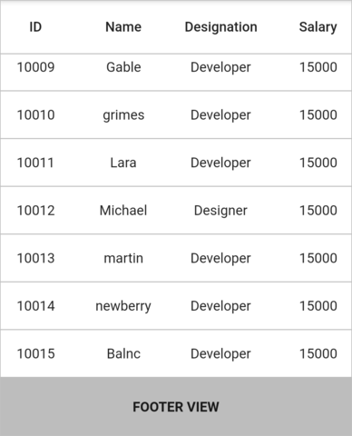
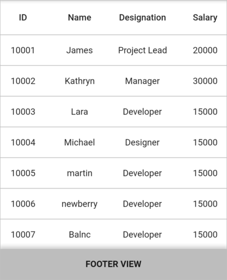

# Footer view in Flutter DataGrid

The `SfDataGrid` provides support to load additional row to the datagrid rows collection. It is called footer view. The footer view can be displayed below to the last data row and it has a single cell that is filled to the parent width of `SfDataGrid`. You can allow the footer view by setting any type of widget to the `SfDataGrid.footer` property. The default value of the footer is `null`.


 

@override
Widget build(BuildContext context) {
  return SfDataGrid(
    source: _employeeDataSource,
    footer: Container(
      color: Colors.grey[400],
      child: Center(
        child: Text(
          'FOOTER VIEW',
          style: TextStyle(fontWeight: FontWeight.bold),
        ),
      ),
    ),
    columns: <GridColumn>[
      GridColumn(
          columnName: 'id',
          label: Container(
              padding: EdgeInsets.all(8.0),
              alignment: Alignment.center,
              child: Text(
                'ID',
              ))),
      GridColumn(
          columnName: 'name',
          label: Container(
              padding: EdgeInsets.all(8.0),
              alignment: Alignment.center,
              child: Text('Name'))),
      GridColumn(
          columnName: 'designation',
          label: Container(
              padding: EdgeInsets.all(8.0),
              alignment: Alignment.center,
              child: Text(
                'Designation',
                overflow: TextOverflow.ellipsis,
              ))),
      GridColumn(
          columnName: 'salary',
          label: Container(
              padding: EdgeInsets.all(8.0),
              alignment: Alignment.center,
              child: Text('Salary'))),
    ],
  );
}




## Change the footer row height

The footer view height can be customized by using the `SfDataGrid.footerHeight` property. The default value of the footer view height is 49.0.


 

@override
Widget build(BuildContext context) {
  return SfDataGrid(
    source: _employeeDataSource,
    footerHeight: 60.0,
    footer: Container(
      color: Colors.grey[400],
      child: Center(
        child: Text(
          'FOOTER VIEW',
          style: TextStyle(fontWeight: FontWeight.bold),
        ),
      ),
    ),
    columns: <GridColumn>[
      GridColumn(
          columnName: 'id',
          label: Container(
              padding: EdgeInsets.all(8.0),
              alignment: Alignment.center,
              child: Text(
                'ID',
              ))),
      GridColumn(
          columnName: 'name',
          label: Container(
              padding: EdgeInsets.all(8.0),
              alignment: Alignment.center,
              child: Text('Name'))),
      GridColumn(
          columnName: 'designation',
          label: Container(
              padding: EdgeInsets.all(8.0),
              alignment: Alignment.center,
              child: Text(
                'Designation',
                overflow: TextOverflow.ellipsis,
              ))),
      GridColumn(
          columnName: 'salary',
          label: Container(
              padding: EdgeInsets.all(8.0),
              alignment: Alignment.center,
              child: Text('Salary'))),
    ],
  );
}




## Show footer row always

The footer can be displayed at bottom of the last data row. If you want to show the footer view always on the view bottom, you can simply set the `SfDataGrid.frozenFooterRowsCount` property to 1. 


 

@override
Widget build(BuildContext context) {
  return SfDataGrid(
    source: _employeeDataSource,
    footerFrozenRowsCount: 1,
    footer: Container(
      color: Colors.grey[400],
      child: Center(
        child: Text(
          'FOOTER VIEW',
          style: TextStyle(fontWeight: FontWeight.bold),
        ),
      ),
    ),
    columns: <GridColumn>[
      GridColumn(
          columnName: 'id',
          label: Container(
              padding: EdgeInsets.all(8.0),
              alignment: Alignment.center,
              child: Text(
                'ID',
              ))),
      GridColumn(
          columnName: 'name',
          label: Container(
              padding: EdgeInsets.all(8.0),
              alignment: Alignment.center,
              child: Text('Name'))),
      GridColumn(
          columnName: 'designation',
          label: Container(
              padding: EdgeInsets.all(8.0),
              alignment: Alignment.center,
              child: Text(
                'Designation',
                overflow: TextOverflow.ellipsis,
              ))),
      GridColumn(
          columnName: 'salary',
          label: Container(
              padding: EdgeInsets.all(8.0),
              alignment: Alignment.center,
              child: Text('Salary'))),
    ],
  );
}




