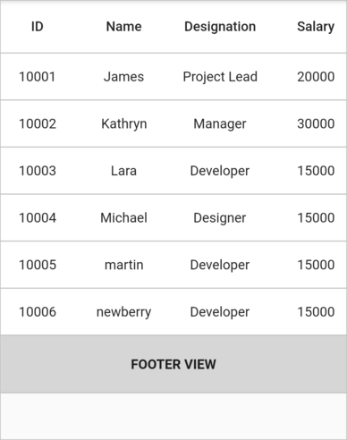
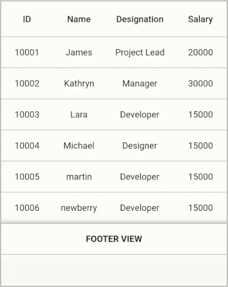

# Footer in Flutter DataGrid (SfDataGrid)

Creates an additional row that can be displayed below to the last row. Widgets can be displayed to the additional row by setting the [SfDataGrid.footer](https://pub.dev/documentation/syncfusion_flutter_datagrid/latest/datagrid/SfDataGrid/footer.html) property.




@override
Widget build(BuildContext context) {
  return SfDataGrid(
      source: _employeeDataSource,
      footer: Container(
          color: Colors.grey[400],
          child: Center(
              child: Text(
            'FOOTER VIEW',
            style: TextStyle(fontWeight: FontWeight.bold),
          ))),
      columns: <GridColumn>[
        GridColumn(
            columnName: 'id',
            label: Container(
                padding: EdgeInsets.all(8.0),
                alignment: Alignment.center,
                child: Text(
                  'ID',
                ))),
        GridColumn(
            columnName: 'name',
            label: Container(
                padding: EdgeInsets.all(8.0),
                alignment: Alignment.center,
                child: Text('Name'))),
        GridColumn(
            columnName: 'designation',
            label: Container(
                padding: EdgeInsets.all(8.0),
                alignment: Alignment.center,
                child: Text(
                  'Designation',
                  overflow: TextOverflow.ellipsis,
                ))),
        GridColumn(
            columnName: 'salary',
            label: Container(
                padding: EdgeInsets.all(8.0),
                alignment: Alignment.center,
                child: Text('Salary'))),
      ]);
}




## Change the footer row height

An additional row height can be personalized by using the [SfDataGrid.footerHeight](https://pub.dev/documentation/syncfusion_flutter_datagrid/latest/datagrid/SfDataGrid/footerHeight.html) property. The default value of the additional row is 49.0.




@override
Widget build(BuildContext context) {
  return SfDataGrid(
      source: _employeeDataSource,
      footerHeight: 60.0,
      footer: Container(
          color: Colors.grey[400],
          child: Center(
              child: Text(
            'FOOTER VIEW',
            style: TextStyle(fontWeight: FontWeight.bold),
          ))),
      columns: <GridColumn>[
        GridColumn(
            columnName: 'id',
            label: Container(
                padding: EdgeInsets.all(8.0),
                alignment: Alignment.center,
                child: Text(
                  'ID',
                ))),
        GridColumn(
            columnName: 'name',
            label: Container(
                padding: EdgeInsets.all(8.0),
                alignment: Alignment.center,
                child: Text('Name'))),
        GridColumn(
            columnName: 'designation',
            label: Container(
                padding: EdgeInsets.all(8.0),
                alignment: Alignment.center,
                child: Text(
                  'Designation',
                  overflow: TextOverflow.ellipsis,
                ))),
        GridColumn(
            columnName: 'salary',
            label: Container(
                padding: EdgeInsets.all(8.0),
                alignment: Alignment.center,
                child: Text('Salary'))),
      ]);
}




## Show the footer row always

By default, the additional row will be displayed below the last row. To show the additional row always on the view bottom, simply set the [SfDataGrid.footerFrozenRowsCount](https://pub.dev/documentation/syncfusion_flutter_datagrid/latest/datagrid/SfDataGrid/footerFrozenRowsCount.html) property to 1.




@override
Widget build(BuildContext context) {
  return SfDataGrid(
      source: _employeeDataSource,
      footerFrozenRowsCount: 1,
      footer: Container(
          color: Colors.grey[400],
          child: Center(
              child: Text(
            'FOOTER VIEW',
            style: TextStyle(fontWeight: FontWeight.bold),
          ))),
      columns: <GridColumn>[
        GridColumn(
            columnName: 'id',
            label: Container(
                padding: EdgeInsets.all(8.0),
                alignment: Alignment.center,
                child: Text(
                  'ID',
                ))),
        GridColumn(
            columnName: 'name',
            label: Container(
                padding: EdgeInsets.all(8.0),
                alignment: Alignment.center,
                child: Text('Name'))),
        GridColumn(
            columnName: 'designation',
            label: Container(
                padding: EdgeInsets.all(8.0),
                alignment: Alignment.center,
                child: Text(
                  'Designation',
                  overflow: TextOverflow.ellipsis,
                ))),
        GridColumn(
            columnName: 'salary',
            label: Container(
                padding: EdgeInsets.all(8.0),
                alignment: Alignment.center,
                child: Text('Salary'))),
      ]);
}




