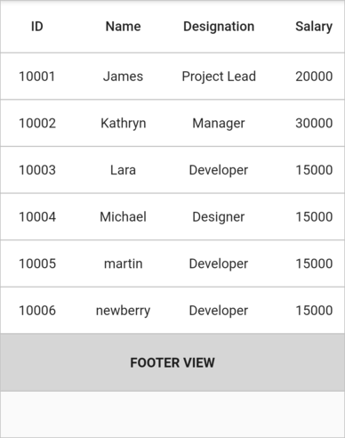
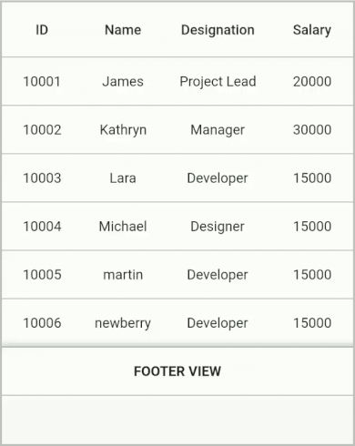

# Footer in Flutter DataGrid (SfDataGrid)

The footer row is an additional row that displays below the last data row in the grid. Widgets can be displayed in the footer row by setting the [SfDataGrid.footer](https://pub.dev/documentation/syncfusion_flutter_datagrid/latest/datagrid/SfDataGrid/footer.html) property.

> **NOTE:** Before implementing the footer functionality, ensure you have set up the SfDataGrid with a valid [DataGridSource](https://pub.dev/documentation/syncfusion_flutter_datagrid/latest/datagrid/DataGridSource-class.html) and configured the necessary columns.




  @override
  Widget build(BuildContext context) {
    return SfDataGrid(
      source: _employeeDataSource,
      footer: Container(
        color: Colors.grey[400],
        child: Center(
          child: Text(
            'FOOTER VIEW',
            style: TextStyle(fontWeight: FontWeight.bold),
          )
        )
      ),
      columns: <GridColumn>[
        GridColumn(
          columnName: 'id',
          label: Container(
            padding: EdgeInsets.all(8.0),
            alignment: Alignment.center,
            child: Text('ID')
          )
        ),
        GridColumn(
          columnName: 'name',
          label: Container(
            padding: EdgeInsets.all(8.0),
            alignment: Alignment.center,
            child: Text('Name')
          )
        ),
        GridColumn(
          columnName: 'designation',
          label: Container(
            padding: EdgeInsets.all(8.0),
            alignment: Alignment.center,
            child: Text(
              'Designation',
              overflow: TextOverflow.ellipsis,
            )
          )
        ),
        GridColumn(
          columnName: 'salary',
          label: Container(
            padding: EdgeInsets.all(8.0),
            alignment: Alignment.center,
            child: Text('Salary')
          )
        ),
      ]
    );
  }




## Change the footer row height

The footer row height can be customized by using the [SfDataGrid.footerHeight](https://pub.dev/documentation/syncfusion_flutter_datagrid/latest/datagrid/SfDataGrid/footerHeight.html) property. The default height of the footer row is 49.0 logical pixels.

> **NOTE:** When setting a custom footer height, ensure it is sufficient to display all the content without text overflow or clipping.




  @override
  Widget build(BuildContext context) {
    return SfDataGrid(
        source: _employeeDataSource,
        footerHeight: 60.0,
        footer: Container(
            color: Colors.grey[400],
            child: Center(
                child: Text(
              'FOOTER VIEW',
              style: TextStyle(fontWeight: FontWeight.bold),
            ))),
        columns: <GridColumn>[
          GridColumn(
              columnName: 'id',
              label: Container(
                  padding: EdgeInsets.all(8.0),
                  alignment: Alignment.center,
                  child: Text(
                    'ID',
                  ))),
          GridColumn(
              columnName: 'name',
              label: Container(
                  padding: EdgeInsets.all(8.0),
                  alignment: Alignment.center,
                  child: Text('Name'))),
          GridColumn(
              columnName: 'designation',
              label: Container(
                  padding: EdgeInsets.all(8.0),
                  alignment: Alignment.center,
                  child: Text(
                    'Designation',
                    overflow: TextOverflow.ellipsis,
                  ))),
          GridColumn(
              columnName: 'salary',
              label: Container(
                  padding: EdgeInsets.all(8.0),
                  alignment: Alignment.center,
                  child: Text('Salary'))),
        ]);
  }




## Show the footer row always

By default, the footer row is displayed below the last data row. To keep the footer visible at the bottom of the grid while scrolling vertically, set the [SfDataGrid.footerFrozenRowsCount](https://pub.dev/documentation/syncfusion_flutter_datagrid/latest/datagrid/SfDataGrid/footerFrozenRowsCount.html) property to 1.

> **NOTE:** Setting `footerFrozenRowsCount` to 1 freezes the footer row, ensuring it remains visible when users scroll through the data, similar to freezing header rows.




  @override
  Widget build(BuildContext context) {
    return SfDataGrid(
        source: _employeeDataSource,
        footerFrozenRowsCount: 1,
        footer: Container(
            color: Colors.grey[400],
            child: Center(
                child: Text(
              'FOOTER VIEW',
              style: TextStyle(fontWeight: FontWeight.bold),
            ))),
        columns: <GridColumn>[
          GridColumn(
              columnName: 'id',
              label: Container(
                  padding: EdgeInsets.all(8.0),
                  alignment: Alignment.center,
                  child: Text(
                    'ID',
                  ))),
          GridColumn(
              columnName: 'name',
              label: Container(
                  padding: EdgeInsets.all(8.0),
                  alignment: Alignment.center,
                  child: Text('Name'))),
          GridColumn(
              columnName: 'designation',
              label: Container(
                  padding: EdgeInsets.all(8.0),
                  alignment: Alignment.center,
                  child: Text(
                    'Designation',
                    overflow: TextOverflow.ellipsis,
                  ))),
          GridColumn(
              columnName: 'salary',
              label: Container(
                  padding: EdgeInsets.all(8.0),
                  alignment: Alignment.center,
                  child: Text('Salary'))),
        ]);
  }




## Updating footer content dynamically

The footer content can be updated dynamically by rebuilding the widget when the data changes. Use a [StreamBuilder](https://api.flutter.dev/flutter/widgets/StreamBuilder-class.html) or [ValueListenableBuilder](https://api.flutter.dev/flutter/foundation/ValueListenableBuilder-class.html) to reactively update the footer display based on data changes.




  @override
  Widget build(BuildContext context) {
    return SfDataGrid(
        source: _employeeDataSource,
        footer: StreamBuilder<int>(
            stream: _employeeDataSource.rowCountStream,
            builder: (context, snapshot) {
              return Container(
                  color: Colors.grey[400],
                  child: Padding(
                      padding: EdgeInsets.all(8.0),
                      child: Text(
                        'Total Employees: ${snapshot.data ?? 0}',
                        style: TextStyle(fontWeight: FontWeight.bold),
                      )));
            }),
        columns: <GridColumn>[
          GridColumn(
              columnName: 'id',
              label: Container(
                  padding: EdgeInsets.all(8.0),
                  alignment: Alignment.center,
                  child: Text('ID'))),
          GridColumn(
              columnName: 'name',
              label: Container(
                  padding: EdgeInsets.all(8.0),
                  alignment: Alignment.center,
                  child: Text('Name'))),
          GridColumn(
              columnName: 'designation',
              label: Container(
                  padding: EdgeInsets.all(8.0),
                  alignment: Alignment.center,
                  child: Text('Designation'))),
          GridColumn(
              columnName: 'salary',
              label: Container(
                  padding: EdgeInsets.all(8.0),
                  alignment: Alignment.center,
                  child: Text('Salary'))),
        ]);
  }




## API reference

Refer to the following API documentation for footer-related properties:

* [SfDataGrid.footer](https://pub.dev/documentation/syncfusion_flutter_datagrid/latest/datagrid/SfDataGrid/footer.html) — Sets the widget to display as the footer row.
* [SfDataGrid.footerHeight](https://pub.dev/documentation/syncfusion_flutter_datagrid/latest/datagrid/SfDataGrid/footerHeight.html) — Sets the height of the footer row. Default value is 49.0.
* [SfDataGrid.footerFrozenRowsCount](https://pub.dev/documentation/syncfusion_flutter_datagrid/latest/datagrid/SfDataGrid/footerFrozenRowsCount.html) — Sets the number of frozen footer rows. Set to 1 to keep the footer visible during vertical scrolling.
* [DataGridSource](https://pub.dev/documentation/syncfusion_flutter_datagrid/latest/datagrid/DataGridSource-class.html) — Base class for providing rows to SfDataGrid.

## See also

* [Header in Flutter DataGrid](https://help.syncfusion.com/flutter/datagrid/header)
* [Frozen rows and columns in Flutter DataGrid](https://help.syncfusion.com/flutter/datagrid/frozen-pane)
