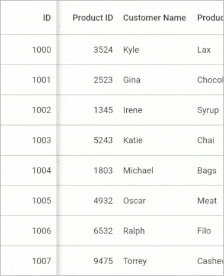
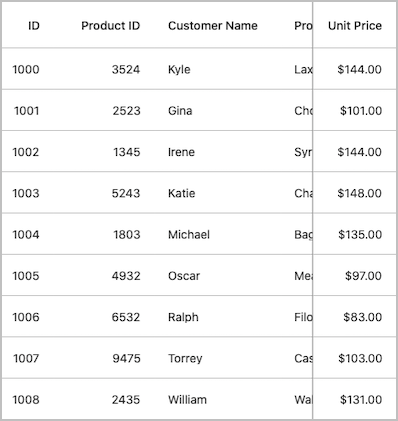
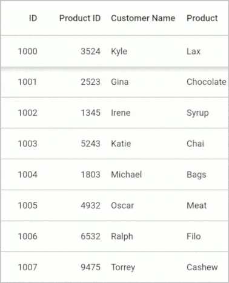
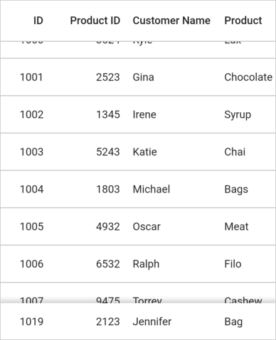
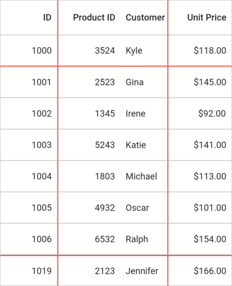
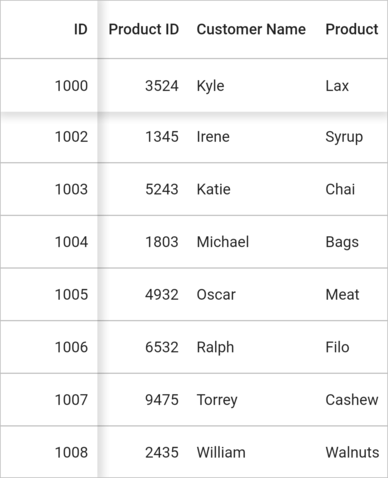
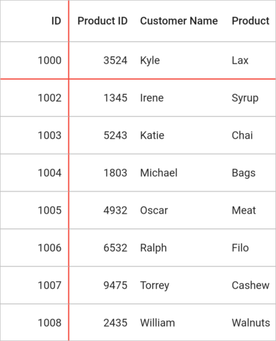

# Freeze Panes in Flutter DataGrid (SfDataGrid)

The rows and columns can freeze in view like in Excel. The rows and columns can be frozen by setting the following properties,

<table>
<tr>
<th> Property Name </th>
<th> Description </th>
</tr>
<tr>
<td>
frozenRowsCount
</td>
<td>
Set the frozen rows count at the top of the <code>SfDataGrid</code>.
</td>
</tr>
<tr>
<td>
footerFrozenRowsCount
</td>
<td>
Set the footer rows count at the bottom of the <code>SfDataGrid</code>.
</td>
</tr>
<tr>
<td>
frozenColumnsCount
</td>
<td>
Set the frozen columns count on the left side of the <code>SfDataGrid</code>.
</td>
</tr>
<tr>
<td>
footerFrozenColumnsCount
</td>
<td>
Set the footer columns on the right side of the <code>SfDataGrid</code>.
</td>
</tr>
</table>

## Freeze columns

The columns can be frozen in view at left and right like Excel by setting the [frozenColumnsCount](https://pub.dev/documentation/syncfusion_flutter_datagrid/latest/datagrid/SfDataGrid/frozenColumnsCount.html) and [footerFrozenColumnsCount](https://pub.dev/documentation/syncfusion_flutter_datagrid/latest/datagrid/SfDataGrid/footerFrozenColumnsCount.html) properties.

The following code example shows how to freeze a column at left using `frozenColumnsCount`,




@override
Widget build(BuildContext context) {
  return Scaffold(
      body: SfDataGrid(
          source: _orderDataGridSource,
          frozenColumnsCount: 1,
          columns: <GridColumn>[
        GridColumn(
            columnName: 'id',
            label: Container(
                alignment: Alignment.centerRight,
                padding: EdgeInsets.symmetric(horizontal: 16.0),
                child: Text(
                  'ID',
                  overflow: TextOverflow.ellipsis,
                ))),
        GridColumn(
            columnName: 'productId',
            label: Container(
                padding: EdgeInsets.symmetric(horizontal: 16.0),
                alignment: Alignment.centerRight,
                child: Text(
                  'Product ID',
                  overflow: TextOverflow.ellipsis,
                ))),
        GridColumn(
            columnName: 'name',
            label: Container(
                padding: EdgeInsets.symmetric(horizontal: 16.0),
                alignment: Alignment.centerLeft,
                child: Text(
                  'Customer Name',
                  overflow: TextOverflow.ellipsis,
                ))),
        GridColumn(
            columnName: 'product',
            label: Container(
                padding: EdgeInsets.symmetric(horizontal: 16.0),
                alignment: Alignment.centerLeft,
                child: Text(
                  'Product',
                  overflow: TextOverflow.ellipsis,
                ))),
        GridColumn(
            columnName: 'orderDate',
            label: Container(
                padding: EdgeInsets.symmetric(horizontal: 16.0),
                alignment: Alignment.center,
                child: Text(
                  'Order Date',
                  overflow: TextOverflow.ellipsis,
                ))),
        GridColumn(
            columnName: 'quantity',
            label: Container(
                padding: EdgeInsets.symmetric(horizontal: 16.0),
                alignment: Alignment.centerRight,
                child: Text(
                  'Quantity',
                  overflow: TextOverflow.ellipsis,
                ))),
        GridColumn(
            columnName: 'city',
            label: Container(
                padding: EdgeInsets.symmetric(horizontal: 16.0),
                alignment: Alignment.centerLeft,
                child: Text(
                  'City',
                  overflow: TextOverflow.ellipsis,
                ))),
        GridColumn(
            columnName: 'unitPrice',
            label: Container(
                padding: EdgeInsets.symmetric(horizontal: 16.0),
                alignment: Alignment.centerRight,
                child: Text(
                  'Unit Price',
                  overflow: TextOverflow.ellipsis,
                )))
      ]));
}




The following code example shows how to freeze a column at right using the `footerFrozenColumnsCount`,




@override
Widget build(BuildContext context) {
  return Scaffold(
      body: SfDataGrid(
          source: _orderDataGridSource,
          footerFrozenColumnsCount: 1,
          columns: <GridColumn>[
        GridColumn(
            columnName: 'id',
            label: Container(
                alignment: Alignment.centerRight,
                padding: EdgeInsets.symmetric(horizontal: 16.0),
                child: Text(
                  'ID',
                  overflow: TextOverflow.ellipsis,
                ))),
        GridColumn(
            columnName: 'productId',
            label: Container(
                padding: EdgeInsets.symmetric(horizontal: 16.0),
                alignment: Alignment.centerRight,
                child: Text(
                  'Product ID',
                  overflow: TextOverflow.ellipsis,
                ))),
        GridColumn(
            columnName: 'name',
            label: Container(
                padding: EdgeInsets.symmetric(horizontal: 16.0),
                alignment: Alignment.centerLeft,
                child: Text(
                  'Customer Name',
                  overflow: TextOverflow.ellipsis,
                ))),
        GridColumn(
            columnName: 'product',
            label: Container(
                padding: EdgeInsets.symmetric(horizontal: 16.0),
                alignment: Alignment.centerLeft,
                child: Text(
                  'Product',
                  overflow: TextOverflow.ellipsis,
                ))),
        GridColumn(
            columnName: 'orderDate',
            label: Container(
                padding: EdgeInsets.symmetric(horizontal: 16.0),
                alignment: Alignment.center,
                child: Text(
                  'Order Date',
                  overflow: TextOverflow.ellipsis,
                ))),
        GridColumn(
            columnName: 'quantity',
            label: Container(
                padding: EdgeInsets.symmetric(horizontal: 16.0),
                alignment: Alignment.centerRight,
                child: Text(
                  'Quantity',
                  overflow: TextOverflow.ellipsis,
                ))),
        GridColumn(
            columnName: 'city',
            label: Container(
                padding: EdgeInsets.symmetric(horizontal: 16.0),
                alignment: Alignment.centerLeft,
                child: Text(
                  'City',
                  overflow: TextOverflow.ellipsis,
                ))),
        GridColumn(
            columnName: 'unitPrice',
            label: Container(
                padding: EdgeInsets.symmetric(horizontal: 16.0),
                alignment: Alignment.centerRight,
                child: Text(
                  'Unit Price',
                  overflow: TextOverflow.ellipsis,
                )))
      ]));
}




### Limitation

* `frozenColumnsCount` or `footerFrozenColumnsCount` should be lesser than the number of columns displayed in the view. For example, If you have 5 columns in the view, then you can set `frozenColumnsCount` to a maximum value of 4.

## Freeze rows

The rows can be frozen in view at the top and bottom like in Excel by setting the [frozenRowsCount](https://pub.dev/documentation/syncfusion_flutter_datagrid/latest/datagrid/SfDataGrid/frozenRowsCount.html) and [footerFrozenRowsCount](https://pub.dev/documentation/syncfusion_flutter_datagrid/latest/datagrid/SfDataGrid/footerFrozenRowsCount.html) properties.

The following code example shows how to freeze a row at the top using `frozenRowsCount`,




@override
Widget build(BuildContext context) {
  return Scaffold(
      body: SfDataGrid(
          source: _orderDataGridSource,
          frozenRowsCount: 1,
          columns: <GridColumn>[
        GridColumn(
            columnName: 'id',
            label: Container(
                alignment: Alignment.centerRight,
                padding: EdgeInsets.symmetric(horizontal: 16.0),
                child: Text(
                  'ID',
                  overflow: TextOverflow.ellipsis,
                ))),
        GridColumn(
            columnName: 'productId',
            label: Container(
                padding: EdgeInsets.symmetric(horizontal: 16.0),
                alignment: Alignment.centerRight,
                child: Text(
                  'Product ID',
                  overflow: TextOverflow.ellipsis,
                ))),
        GridColumn(
            columnName: 'name',
            label: Container(
                padding: EdgeInsets.symmetric(horizontal: 16.0),
                alignment: Alignment.centerLeft,
                child: Text(
                  'Customer Name',
                  overflow: TextOverflow.ellipsis,
                ))),
        GridColumn(
            columnName: 'product',
            label: Container(
                padding: EdgeInsets.symmetric(horizontal: 16.0),
                alignment: Alignment.centerLeft,
                child: Text(
                  'Product',
                  overflow: TextOverflow.ellipsis,
                ))),
        GridColumn(
            columnName: 'orderDate',
            label: Container(
                padding: EdgeInsets.symmetric(horizontal: 16.0),
                alignment: Alignment.center,
                child: Text(
                  'Order Date',
                  overflow: TextOverflow.ellipsis,
                ))),
        GridColumn(
            columnName: 'quantity',
            label: Container(
                padding: EdgeInsets.symmetric(horizontal: 16.0),
                alignment: Alignment.centerRight,
                child: Text(
                  'Quantity',
                  overflow: TextOverflow.ellipsis,
                ))),
        GridColumn(
            columnName: 'city',
            label: Container(
                padding: EdgeInsets.symmetric(horizontal: 16.0),
                alignment: Alignment.centerLeft,
                child: Text(
                  'City',
                  overflow: TextOverflow.ellipsis,
                ))),
        GridColumn(
            columnName: 'unitPrice',
            label: Container(
                padding: EdgeInsets.symmetric(horizontal: 16.0),
                alignment: Alignment.centerRight,
                child: Text(
                  'Unit Price',
                  overflow: TextOverflow.ellipsis,
                )))
      ]));
}




The following code example shows how to freeze a row at the bottom using the `footerFrozenRowsCount`,




@override
Widget build(BuildContext context) {
  return Scaffold(
      body: SfDataGrid(
          source: _orderDataGridSource,
          footerFrozenRowsCount: 1,
          columns: <GridColumn>[
        GridColumn(
            columnName: 'id',
            label: Container(
                alignment: Alignment.centerRight,
                padding: EdgeInsets.symmetric(horizontal: 16.0),
                child: Text(
                  'ID',
                  overflow: TextOverflow.ellipsis,
                ))),
        GridColumn(
            columnName: 'productId',
            label: Container(
                padding: EdgeInsets.symmetric(horizontal: 16.0),
                alignment: Alignment.centerRight,
                child: Text(
                  'Product ID',
                  overflow: TextOverflow.ellipsis,
                ))),
        GridColumn(
            columnName: 'name',
            label: Container(
                padding: EdgeInsets.symmetric(horizontal: 16.0),
                alignment: Alignment.centerLeft,
                child: Text(
                  'Customer Name',
                  overflow: TextOverflow.ellipsis,
                ))),
        GridColumn(
            columnName: 'product',
            label: Container(
                padding: EdgeInsets.symmetric(horizontal: 16.0),
                alignment: Alignment.centerLeft,
                child: Text(
                  'Product',
                  overflow: TextOverflow.ellipsis,
                ))),
        GridColumn(
            columnName: 'orderDate',
            label: Container(
                padding: EdgeInsets.symmetric(horizontal: 16.0),
                alignment: Alignment.center,
                child: Text(
                  'Order Date',
                  overflow: TextOverflow.ellipsis,
                ))),
        GridColumn(
            columnName: 'quantity',
            label: Container(
                padding: EdgeInsets.symmetric(horizontal: 16.0),
                alignment: Alignment.centerRight,
                child: Text(
                  'Quantity',
                  overflow: TextOverflow.ellipsis,
                ))),
        GridColumn(
            columnName: 'city',
            label: Container(
                padding: EdgeInsets.symmetric(horizontal: 16.0),
                alignment: Alignment.centerLeft,
                child: Text(
                  'City',
                  overflow: TextOverflow.ellipsis,
                ))),
        GridColumn(
            columnName: 'unitPrice',
            label: Container(
                padding: EdgeInsets.symmetric(horizontal: 16.0),
                alignment: Alignment.centerRight,
                child: Text(
                  'Unit Price',
                  overflow: TextOverflow.ellipsis,
                )))
      ]));
}




### Limitation

* `frozenRowsCount` or `footerFrozenRowsCount` should be lesser than the number of rows displayed in the view. For example, If you have 10 rows in view, then you set `frozenRowsCount` to a maximum value of 9.

N> Header row is frozen by default and works regardless of the `frozenRowsCount` property.

## Appearance

`SfDataGrid` allows customizing the appearance of the freeze pane through the [SfDataGridTheme.SfDataGridThemeData](https://pub.dev/documentation/syncfusion_flutter_core/latest/theme/SfDataGridThemeData-class.html) property. The DataGrid should be wrapped inside the `SfDataGridTheme`. 

The `SfDataGridThemeData` and `SfDataGridTheme` classes are available in the [syncfusion_flutter_core](https://pub.dev/packages/syncfusion_flutter_core) package. So, import the below file,




import 'package:syncfusion_flutter_core/theme.dart';




The frozen line will be shown only the [SfDataGridThemeData.frozenPaneElevation](https://pub.dev/documentation/syncfusion_flutter_core/latest/theme/SfDataGridThemeData/frozenPaneElevation.html) property to 0. The freeze pane line and freeze pane width can be changed by [frozenPaneLineColor](https://pub.dev/documentation/syncfusion_flutter_core/latest/theme/SfDataGridThemeData/frozenPaneLineColor.html) and [frozenPaneLineWidth](https://pub.dev/documentation/syncfusion_flutter_core/latest/theme/SfDataGridThemeData/frozenPaneLineWidth.html). 




import 'package:syncfusion_flutter_core/theme.dart';
import 'package:syncfusion_flutter_datagrid/datagrid.dart';

@override
Widget build(BuildContext context) {
  return Scaffold(
      body: SfDataGridTheme(
    data: SfDataGridThemeData(
        frozenPaneElevation: 0.0,
        frozenPaneLineColor: Colors.red,
        frozenPaneLineWidth: 1.5),
    child: SfDataGrid(
        source: _orderDataGridSource,
        frozenRowsCount: 1,
        footerFrozenRowsCount: 1,
        frozenColumnsCount: 1,
        footerFrozenColumnsCount: 1,
        columns: <GridColumn>[
          GridColumn(
              columnName: 'id',
              label: Container(
                  alignment: Alignment.centerRight,
                  padding: EdgeInsets.symmetric(horizontal: 16.0),
                  child: Text(
                    'ID',
                    overflow: TextOverflow.ellipsis,
                  ))),
          GridColumn(
              columnName: 'productId',
              label: Container(
                  padding: EdgeInsets.symmetric(horizontal: 16.0),
                  alignment: Alignment.centerRight,
                  child: Text(
                    'Product ID',
                    overflow: TextOverflow.ellipsis,
                  ))),
          GridColumn(
              columnName: 'name',
              label: Container(
                  padding: EdgeInsets.symmetric(horizontal: 16.0),
                  alignment: Alignment.centerLeft,
                  child: Text(
                    'Customer Name',
                    overflow: TextOverflow.ellipsis,
                  ))),
          GridColumn(
              columnName: 'product',
              label: Container(
                  padding: EdgeInsets.symmetric(horizontal: 16.0),
                  alignment: Alignment.centerLeft,
                  child: Text(
                    'Product',
                    overflow: TextOverflow.ellipsis,
                  ))),
          GridColumn(
              columnName: 'orderDate',
              label: Container(
                  padding: EdgeInsets.symmetric(horizontal: 16.0),
                  alignment: Alignment.center,
                  child: Text(
                    'Order Date',
                    overflow: TextOverflow.ellipsis,
                  ))),
          GridColumn(
              columnName: 'quantity',
              label: Container(
                  padding: EdgeInsets.symmetric(horizontal: 16.0),
                  alignment: Alignment.centerRight,
                  child: Text(
                    'Quantity',
                    overflow: TextOverflow.ellipsis,
                  ))),
          GridColumn(
              columnName: 'city',
              label: Container(
                  padding: EdgeInsets.symmetric(horizontal: 16.0),
                  alignment: Alignment.centerLeft,
                  child: Text(
                    'City',
                    overflow: TextOverflow.ellipsis,
                  ))),
          GridColumn(
              columnName: 'unitPrice',
              label: Container(
                  padding: EdgeInsets.symmetric(horizontal: 16.0),
                  alignment: Alignment.centerRight,
                  child: Text(
                    'Unit Price',
                    overflow: TextOverflow.ellipsis,
                  )))
        ]),
  ));
}




`SfDataGrid` allows customizing the appearance of the freeze pane elevation by using the `SfDataGridThemeData.frozenPaneElevation`. The default value of frozenPaneElevation is 5.0.




@override
Widget build(BuildContext context) {
  return Scaffold(
      body: SfDataGridTheme(
    data: SfDataGridThemeData(frozenPaneElevation: 7.0),
    child: SfDataGrid(
        source: _orderDataGridSource,
        frozenRowsCount: 1,
        frozenColumnsCount: 1,
        columns: <GridColumn>[
          GridColumn(
              columnName: 'id',
              label: Container(
                  alignment: Alignment.centerRight,
                  padding: EdgeInsets.symmetric(horizontal: 16.0),
                  child: Text(
                    'ID',
                    overflow: TextOverflow.ellipsis,
                  ))),
          GridColumn(
              columnName: 'productId',
              label: Container(
                  padding: EdgeInsets.symmetric(horizontal: 16.0),
                  alignment: Alignment.centerRight,
                  child: Text(
                    'Product ID',
                    overflow: TextOverflow.ellipsis,
                  ))),
          GridColumn(
              columnName: 'name',
              label: Container(
                  padding: EdgeInsets.symmetric(horizontal: 16.0),
                  alignment: Alignment.centerLeft,
                  child: Text(
                    'Customer Name',
                    overflow: TextOverflow.ellipsis,
                  ))),
          GridColumn(
              columnName: 'product',
              label: Container(
                  padding: EdgeInsets.symmetric(horizontal: 16.0),
                  alignment: Alignment.centerLeft,
                  child: Text(
                    'Product',
                    overflow: TextOverflow.ellipsis,
                  ))),
          GridColumn(
              columnName: 'orderDate',
              label: Container(
                  padding: EdgeInsets.symmetric(horizontal: 16.0),
                  alignment: Alignment.center,
                  child: Text(
                    'Order Date',
                    overflow: TextOverflow.ellipsis,
                  ))),
          GridColumn(
              columnName: 'quantity',
              label: Container(
                  padding: EdgeInsets.symmetric(horizontal: 16.0),
                  alignment: Alignment.centerRight,
                  child: Text(
                    'Quantity',
                    overflow: TextOverflow.ellipsis,
                  ))),
          GridColumn(
              columnName: 'city',
              label: Container(
                  padding: EdgeInsets.symmetric(horizontal: 16.0),
                  alignment: Alignment.centerLeft,
                  child: Text(
                    'City',
                    overflow: TextOverflow.ellipsis,
                  ))),
          GridColumn(
              columnName: 'unitPrice',
              label: Container(
                  padding: EdgeInsets.symmetric(horizontal: 16.0),
                  alignment: Alignment.centerRight,
                  child: Text(
                    'Unit Price',
                    overflow: TextOverflow.ellipsis,
                  )))
        ]),
  ));
}




## Hide freeze pane elevation

By default, the elevation effect is applied to frozen panes. If you want to hide the freeze pane elevation and show only the frozen pane line, you can simply set `SfDataGridThemeData.frozenPaneElevation` property to 0. You can customize the appearance of the frozen line by using `SfDataGridThemeData.frozenPaneLineColor` and `SfDataGridThemeData.frozenPaneLineWidth` properties.




@override
Widget build(BuildContext context) {
  return Scaffold(
      body: SfDataGridTheme(
    data: SfDataGridThemeData(
        frozenPaneElevation: 0.0,
        frozenPaneLineColor: Colors.red,
        frozenPaneLineWidth: 1.5),
    child: SfDataGrid(
        source: _orderDataGridSource,
        frozenRowsCount: 1,
        frozenColumnsCount: 1,
        columns: <GridColumn>[
          GridColumn(
              columnName: 'id',
              label: Container(
                  alignment: Alignment.centerRight,
                  padding: EdgeInsets.symmetric(horizontal: 16.0),
                  child: Text(
                    'ID',
                    overflow: TextOverflow.ellipsis,
                  ))),
          GridColumn(
              columnName: 'productId',
              label: Container(
                  padding: EdgeInsets.symmetric(horizontal: 16.0),
                  alignment: Alignment.centerRight,
                  child: Text(
                    'Product ID',
                    overflow: TextOverflow.ellipsis,
                  ))),
          GridColumn(
              columnName: 'name',
              label: Container(
                  padding: EdgeInsets.symmetric(horizontal: 16.0),
                  alignment: Alignment.centerLeft,
                  child: Text(
                    'Customer Name',
                    overflow: TextOverflow.ellipsis,
                  ))),
          GridColumn(
              columnName: 'product',
              label: Container(
                  padding: EdgeInsets.symmetric(horizontal: 16.0),
                  alignment: Alignment.centerLeft,
                  child: Text(
                    'Product',
                    overflow: TextOverflow.ellipsis,
                  ))),
          GridColumn(
              columnName: 'orderDate',
              label: Container(
                  padding: EdgeInsets.symmetric(horizontal: 16.0),
                  alignment: Alignment.center,
                  child: Text(
                    'Order Date',
                    overflow: TextOverflow.ellipsis,
                  ))),
          GridColumn(
              columnName: 'quantity',
              label: Container(
                  padding: EdgeInsets.symmetric(horizontal: 16.0),
                  alignment: Alignment.centerRight,
                  child: Text(
                    'Quantity',
                    overflow: TextOverflow.ellipsis,
                  ))),
          GridColumn(
              columnName: 'city',
              label: Container(
                  padding: EdgeInsets.symmetric(horizontal: 16.0),
                  alignment: Alignment.centerLeft,
                  child: Text(
                    'City',
                    overflow: TextOverflow.ellipsis,
                  ))),
          GridColumn(
              columnName: 'unitPrice',
              label: Container(
                  padding: EdgeInsets.symmetric(horizontal: 16.0),
                  alignment: Alignment.centerRight,
                  child: Text(
                    'Unit Price',
                    overflow: TextOverflow.ellipsis,
                  )))
        ]),
  ));
}




