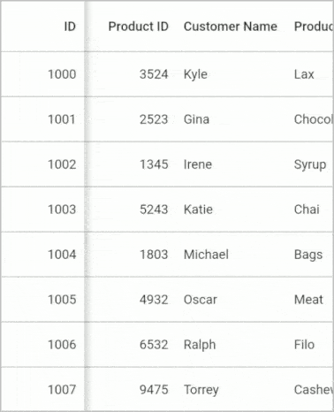
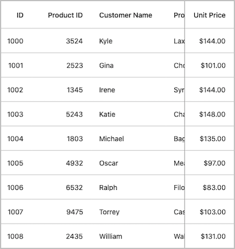
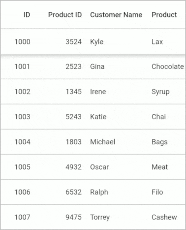
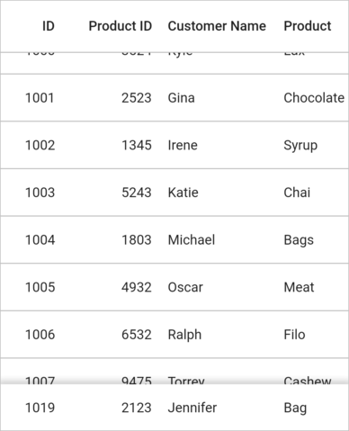
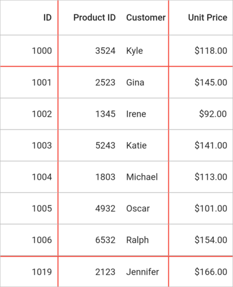
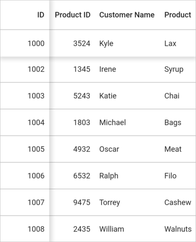
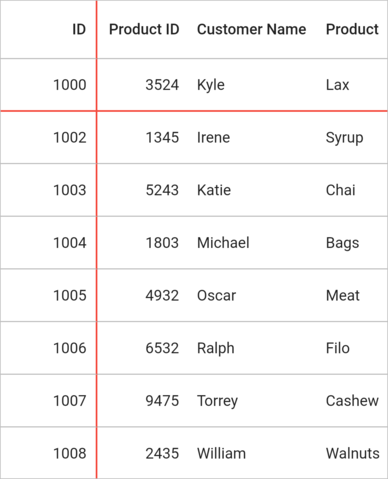

# Freeze Panes in Flutter DataGrid (SfDataGrid)

The rows and columns can freeze in view like in Excel. They can be frozen by setting the following properties.

<table>
<tr>
<th> Property Name </th>
<th> Description </th>
</tr>
<tr>
<td>
frozenRowsCount
</td>
<td>
Set the frozen rows count at the top of the <code>SfDataGrid</code>.
</td>
</tr>
<tr>
<td>
footerFrozenRowsCount
</td>
<td>
Set the footer frozen rows count at the bottom of the <code>SfDataGrid</code>.
</td>
</tr>
<tr>
<td>
frozenColumnsCount
</td>
<td>
Set the frozen columns count on the left side of the <code>SfDataGrid</code>.
</td>
</tr>
<tr>
<td>
footerFrozenColumnsCount
</td>
<td>
Set the footer frozen columns on the right side of the <code>SfDataGrid</code>.
</td>
</tr>
<tr>
<td>
frozenPaneElevation
</td>
<td>
Customize the elevation effect applied to frozen panes. Default value is 5.0. Set to 0.0 to remove elevation and display only the frozen pane line.
</td>
</tr>
<tr>
<td>
frozenPaneLineColor
</td>
<td>
Customize the color of the line displayed at the edge of frozen panes.
</td>
</tr>
<tr>
<td>
frozenPaneLineWidth
</td>
<td>
Customize the width of the line displayed at the edge of frozen panes.
</td>
</tr>
</table>

## Freeze columns

The columns can be frozen in view at left and right like Excel by setting the [frozenColumnsCount](https://pub.dev/documentation/syncfusion_flutter_datagrid/latest/datagrid/SfDataGrid/frozenColumnsCount.html) and [footerFrozenColumnsCount](https://pub.dev/documentation/syncfusion_flutter_datagrid/latest/datagrid/SfDataGrid/footerFrozenColumnsCount.html) properties.

The following code example shows how to freeze a column at left using `frozenColumnsCount`:




import 'package:flutter/material.dart';
import 'package:syncfusion_flutter_datagrid/datagrid.dart';

  @override
  Widget build(BuildContext context) {
    return Scaffold(
        body: SfDataGrid(
            source: _orderDataGridSource,
            frozenColumnsCount: 1,
            columns: <GridColumn>[
          GridColumn(
              columnName: 'id',
              label: Container(
                  alignment: Alignment.centerRight,
                  padding: EdgeInsets.symmetric(horizontal: 16.0),
                  child: Text(
                    'ID',
                    overflow: TextOverflow.ellipsis,
                  ))),
          GridColumn(
              columnName: 'productId',
              label: Container(
                  padding: EdgeInsets.symmetric(horizontal: 16.0),
                  alignment: Alignment.centerRight,
                  child: Text(
                    'Product ID',
                    overflow: TextOverflow.ellipsis,
                  ))),
          GridColumn(
              columnName: 'name',
              label: Container(
                  padding: EdgeInsets.symmetric(horizontal: 16.0),
                  alignment: Alignment.centerLeft,
                  child: Text(
                    'Customer Name',
                    overflow: TextOverflow.ellipsis,
                  ))),
          GridColumn(
              columnName: 'product',
              label: Container(
                  padding: EdgeInsets.symmetric(horizontal: 16.0),
                  alignment: Alignment.centerLeft,
                  child: Text(
                    'Product',
                    overflow: TextOverflow.ellipsis,
                  ))),
          GridColumn(
              columnName: 'orderDate',
              label: Container(
                  padding: EdgeInsets.symmetric(horizontal: 16.0),
                  alignment: Alignment.center,
                  child: Text(
                    'Order Date',
                    overflow: TextOverflow.ellipsis,
                  ))),
          GridColumn(
              columnName: 'quantity',
              label: Container(
                  padding: EdgeInsets.symmetric(horizontal: 16.0),
                  alignment: Alignment.centerRight,
                  child: Text(
                    'Quantity',
                    overflow: TextOverflow.ellipsis,
                  ))),
          GridColumn(
              columnName: 'city',
              label: Container(
                  padding: EdgeInsets.symmetric(horizontal: 16.0),
                  alignment: Alignment.centerLeft,
                  child: Text(
                    'City',
                    overflow: TextOverflow.ellipsis,
                  ))),
          GridColumn(
              columnName: 'unitPrice',
              label: Container(
                  padding: EdgeInsets.symmetric(horizontal: 16.0),
                  alignment: Alignment.centerRight,
                  child: Text(
                    'Unit Price',
                    overflow: TextOverflow.ellipsis,
                  )))
        ]));
  }




The following code example shows how to freeze a column at right using the `footerFrozenColumnsCount`:




import 'package:flutter/material.dart';
import 'package:syncfusion_flutter_datagrid/datagrid.dart';

  @override
  Widget build(BuildContext context) {
    return Scaffold(
        body: SfDataGrid(
            source: _orderDataGridSource,
            footerFrozenColumnsCount: 1,
            columns: <GridColumn>[
          GridColumn(
              columnName: 'id',
              label: Container(
                  alignment: Alignment.centerRight,
                  padding: EdgeInsets.symmetric(horizontal: 16.0),
                  child: Text(
                    'ID',
                    overflow: TextOverflow.ellipsis,
                  ))),
          GridColumn(
              columnName: 'productId',
              label: Container(
                  padding: EdgeInsets.symmetric(horizontal: 16.0),
                  alignment: Alignment.centerRight,
                  child: Text(
                    'Product ID',
                    overflow: TextOverflow.ellipsis,
                  ))),
          GridColumn(
              columnName: 'name',
              label: Container(
                  padding: EdgeInsets.symmetric(horizontal: 16.0),
                  alignment: Alignment.centerLeft,
                  child: Text(
                    'Customer Name',
                    overflow: TextOverflow.ellipsis,
                  ))),
          GridColumn(
              columnName: 'product',
              label: Container(
                  padding: EdgeInsets.symmetric(horizontal: 16.0),
                  alignment: Alignment.centerLeft,
                  child: Text(
                    'Product',
                    overflow: TextOverflow.ellipsis,
                  ))),
          GridColumn(
              columnName: 'orderDate',
              label: Container(
                  padding: EdgeInsets.symmetric(horizontal: 16.0),
                  alignment: Alignment.center,
                  child: Text(
                    'Order Date',
                    overflow: TextOverflow.ellipsis,
                  ))),
          GridColumn(
              columnName: 'quantity',
              label: Container(
                  padding: EdgeInsets.symmetric(horizontal: 16.0),
                  alignment: Alignment.centerRight,
                  child: Text(
                    'Quantity',
                    overflow: TextOverflow.ellipsis,
                  ))),
          GridColumn(
              columnName: 'city',
              label: Container(
                  padding: EdgeInsets.symmetric(horizontal: 16.0),
                  alignment: Alignment.centerLeft,
                  child: Text(
                    'City',
                    overflow: TextOverflow.ellipsis,
                  ))),
          GridColumn(
              columnName: 'unitPrice',
              label: Container(
                  padding: EdgeInsets.symmetric(horizontal: 16.0),
                  alignment: Alignment.centerRight,
                  child: Text(
                    'Unit Price',
                    overflow: TextOverflow.ellipsis,
                  )))
        ]));
  }




### Limitation

* The `frozenColumnsCount` or `footerFrozenColumnsCount` should be less than the total number of columns displayed in the view. For example, If you have 5 columns in the view, you can set `frozenColumnsCount` to a maximum value of 4.

* [SfDataGrid](https://pub.dev/documentation/syncfusion_flutter_datagrid/latest/datagrid/SfDataGrid/SfDataGrid.html) supports freezing a specific number of columns from the left or right. but not freezing specific columns by name or index.

## Freeze rows

The rows can be frozen in view at the top and bottom like in Excel by setting the [frozenRowsCount](https://pub.dev/documentation/syncfusion_flutter_datagrid/latest/datagrid/SfDataGrid/frozenRowsCount.html) and [footerFrozenRowsCount](https://pub.dev/documentation/syncfusion_flutter_datagrid/latest/datagrid/SfDataGrid/footerFrozenRowsCount.html) properties.

The following code example shows how to freeze a row at the top using the `frozenRowsCount`:




import 'package:flutter/material.dart';
import 'package:syncfusion_flutter_datagrid/datagrid.dart';

  @override
  Widget build(BuildContext context) {
    return Scaffold(
        body: SfDataGrid(
            source: _orderDataGridSource,
            frozenRowsCount: 1,
            columns: <GridColumn>[
          GridColumn(
              columnName: 'id',
              label: Container(
                  alignment: Alignment.centerRight,
                  padding: EdgeInsets.symmetric(horizontal: 16.0),
                  child: Text(
                    'ID',
                    overflow: TextOverflow.ellipsis,
                  ))),
          GridColumn(
              columnName: 'productId',
              label: Container(
                  padding: EdgeInsets.symmetric(horizontal: 16.0),
                  alignment: Alignment.centerRight,
                  child: Text(
                    'Product ID',
                    overflow: TextOverflow.ellipsis,
                  ))),
          GridColumn(
              columnName: 'name',
              label: Container(
                  padding: EdgeInsets.symmetric(horizontal: 16.0),
                  alignment: Alignment.centerLeft,
                  child: Text(
                    'Customer Name',
                    overflow: TextOverflow.ellipsis,
                  ))),
          GridColumn(
              columnName: 'product',
              label: Container(
                  padding: EdgeInsets.symmetric(horizontal: 16.0),
                  alignment: Alignment.centerLeft,
                  child: Text(
                    'Product',
                    overflow: TextOverflow.ellipsis,
                  ))),
          GridColumn(
              columnName: 'orderDate',
              label: Container(
                  padding: EdgeInsets.symmetric(horizontal: 16.0),
                  alignment: Alignment.center,
                  child: Text(
                    'Order Date',
                    overflow: TextOverflow.ellipsis,
                  ))),
          GridColumn(
              columnName: 'quantity',
              label: Container(
                  padding: EdgeInsets.symmetric(horizontal: 16.0),
                  alignment: Alignment.centerRight,
                  child: Text(
                    'Quantity',
                    overflow: TextOverflow.ellipsis,
                  ))),
          GridColumn(
              columnName: 'city',
              label: Container(
                  padding: EdgeInsets.symmetric(horizontal: 16.0),
                  alignment: Alignment.centerLeft,
                  child: Text(
                    'City',
                    overflow: TextOverflow.ellipsis,
                  ))),
          GridColumn(
              columnName: 'unitPrice',
              label: Container(
                  padding: EdgeInsets.symmetric(horizontal: 16.0),
                  alignment: Alignment.centerRight,
                  child: Text(
                    'Unit Price',
                    overflow: TextOverflow.ellipsis,
                  )))
        ]));
  }




The following code example shows how to freeze a row at the bottom using the `footerFrozenRowsCount`:




import 'package:flutter/material.dart';
import 'package:syncfusion_flutter_datagrid/datagrid.dart';

  @override
  Widget build(BuildContext context) {
    return Scaffold(
        body: SfDataGrid(
            source: _orderDataGridSource,
            footerFrozenRowsCount: 1,
            columns: <GridColumn>[
          GridColumn(
              columnName: 'id',
              label: Container(
                  alignment: Alignment.centerRight,
                  padding: EdgeInsets.symmetric(horizontal: 16.0),
                  child: Text(
                    'ID',
                    overflow: TextOverflow.ellipsis,
                  ))),
          GridColumn(
              columnName: 'productId',
              label: Container(
                  padding: EdgeInsets.symmetric(horizontal: 16.0),
                  alignment: Alignment.centerRight,
                  child: Text(
                    'Product ID',
                    overflow: TextOverflow.ellipsis,
                  ))),
          GridColumn(
              columnName: 'name',
              label: Container(
                  padding: EdgeInsets.symmetric(horizontal: 16.0),
                  alignment: Alignment.centerLeft,
                  child: Text(
                    'Customer Name',
                    overflow: TextOverflow.ellipsis,
                  ))),
          GridColumn(
              columnName: 'product',
              label: Container(
                  padding: EdgeInsets.symmetric(horizontal: 16.0),
                  alignment: Alignment.centerLeft,
                  child: Text(
                    'Product',
                    overflow: TextOverflow.ellipsis,
                  ))),
          GridColumn(
              columnName: 'orderDate',
              label: Container(
                  padding: EdgeInsets.symmetric(horizontal: 16.0),
                  alignment: Alignment.center,
                  child: Text(
                    'Order Date',
                    overflow: TextOverflow.ellipsis,
                  ))),
          GridColumn(
              columnName: 'quantity',
              label: Container(
                  padding: EdgeInsets.symmetric(horizontal: 16.0),
                  alignment: Alignment.centerRight,
                  child: Text(
                    'Quantity',
                    overflow: TextOverflow.ellipsis,
                  ))),
          GridColumn(
              columnName: 'city',
              label: Container(
                  padding: EdgeInsets.symmetric(horizontal: 16.0),
                  alignment: Alignment.centerLeft,
                  child: Text(
                    'City',
                    overflow: TextOverflow.ellipsis,
                  ))),
          GridColumn(
              columnName: 'unitPrice',
              label: Container(
                  padding: EdgeInsets.symmetric(horizontal: 16.0),
                  alignment: Alignment.centerRight,
                  child: Text(
                    'Unit Price',
                    overflow: TextOverflow.ellipsis,
                  )))
        ]));
  }




### Limitation

* `frozenRowsCount` or `footerFrozenRowsCount` should be lesser than the number of rows displayed in the view. For example, If you have 10 rows in view, then you set `frozenRowsCount` to a maximum value of 9.

* SfDataGrid has support to freeze the number of rows from top or bottom. There is no support to freeze a specific row.

> **Note:** Header row is frozen by default and works regardless of the `frozenRowsCount` property.

## Appearance

The `SfDataGrid` allows customizing the appearance of frozen panes through the [SfDataGridThemeData](https://pub.dev/documentation/syncfusion_flutter_core/latest/theme/SfDataGridThemeData-class.html) property. The DataGrid should be wrapped inside the [SfDataGridTheme](https://pub.dev/documentation/syncfusion_flutter_core/latest/theme/SfDataGridTheme-class.html) widget. 

The `SfDataGridThemeData` and `SfDataGridTheme` classes are available in the [syncfusion_flutter_core](https://pub.dev/packages/syncfusion_flutter_core) package. Import the required packages:




import 'package:syncfusion_flutter_core/theme.dart';
import 'package:syncfusion_flutter_datagrid/datagrid.dart';




The frozen pane line will be shown only when the [frozenPaneElevation](https://pub.dev/documentation/syncfusion_flutter_core/latest/theme/SfDataGridThemeData/frozenPaneElevation.html) property is set to 0. The frozen pane line color and width can be customized using the [frozenPaneLineColor](https://pub.dev/documentation/syncfusion_flutter_core/latest/theme/SfDataGridThemeData/frozenPaneLineColor.html) and [frozenPaneLineWidth](https://pub.dev/documentation/syncfusion_flutter_core/latest/theme/SfDataGridThemeData/frozenPaneLineWidth.html) properties. 




import 'package:syncfusion_flutter_core/theme.dart';
import 'package:syncfusion_flutter_datagrid/datagrid.dart';

  @override
  Widget build(BuildContext context) {
    return Scaffold(
      body: SfDataGridTheme(
        data: SfDataGridThemeData(
          frozenPaneElevation: 0.0,
          frozenPaneLineColor: Colors.red,
          frozenPaneLineWidth: 1.5,
        ),
        child: SfDataGrid(
          source: _orderDataGridSource,
          frozenRowsCount: 1,
          footerFrozenRowsCount: 1,
          frozenColumnsCount: 1,
          footerFrozenColumnsCount: 1,
          columns: <GridColumn>[
            GridColumn(
              columnName: 'id',
              label: Container(
                alignment: Alignment.centerRight,
                padding: EdgeInsets.symmetric(horizontal: 16.0),
                child: Text('ID', overflow: TextOverflow.ellipsis),
              ),
            ),
            GridColumn(
              columnName: 'productId',
              label: Container(
                padding: EdgeInsets.symmetric(horizontal: 16.0),
                alignment: Alignment.centerRight,
                child: Text('Product ID', overflow: TextOverflow.ellipsis),
              ),
            ),
            GridColumn(
              columnName: 'name',
              label: Container(
                padding: EdgeInsets.symmetric(horizontal: 16.0),
                alignment: Alignment.centerLeft,
                child: Text('Customer Name', overflow: TextOverflow.ellipsis),
              ),
            ),
            GridColumn(
              columnName: 'product',
              label: Container(
                padding: EdgeInsets.symmetric(horizontal: 16.0),
                alignment: Alignment.centerLeft,
                child: Text('Product', overflow: TextOverflow.ellipsis),
              ),
            ),
            GridColumn(
              columnName: 'orderDate',
              label: Container(
                padding: EdgeInsets.symmetric(horizontal: 16.0),
                alignment: Alignment.center,
                child: Text('Order Date', overflow: TextOverflow.ellipsis),
              ),
            ),
            GridColumn(
              columnName: 'quantity',
              label: Container(
                padding: EdgeInsets.symmetric(horizontal: 16.0),
                alignment: Alignment.centerRight,
                child: Text('Quantity', overflow: TextOverflow.ellipsis),
              ),
            ),
            GridColumn(
              columnName: 'city',
              label: Container(
                padding: EdgeInsets.symmetric(horizontal: 16.0),
                alignment: Alignment.centerLeft,
                child: Text('City', overflow: TextOverflow.ellipsis),
              ),
            ),
            GridColumn(
              columnName: 'unitPrice',
              label: Container(
                padding: EdgeInsets.symmetric(horizontal: 16.0),
                alignment: Alignment.centerRight,
                child: Text('Unit Price', overflow: TextOverflow.ellipsis),
              ),
            ),
          ],
        ),
      ),
    );
  }




### Customize frozen pane elevation

The `SfDataGrid` allows customizing the appearance of the frozen pane elevation by using the [frozenPaneElevation](https://pub.dev/documentation/syncfusion_flutter_core/latest/theme/SfDataGridThemeData/frozenPaneElevation.html) property. The default value is 5.0.




  @override
  Widget build(BuildContext context) {
    return Scaffold(
        body: SfDataGridTheme(
      data: SfDataGridThemeData(frozenPaneElevation: 7.0),
      child: SfDataGrid(
          source: _orderDataGridSource,
          frozenRowsCount: 1,
          frozenColumnsCount: 1,
          columns: <GridColumn>[
            GridColumn(
                columnName: 'id',
                label: Container(
                    alignment: Alignment.centerRight,
                    padding: EdgeInsets.symmetric(horizontal: 16.0),
                    child: Text(
                      'ID',
                      overflow: TextOverflow.ellipsis,
                    ))),
            GridColumn(
                columnName: 'productId',
                label: Container(
                    padding: EdgeInsets.symmetric(horizontal: 16.0),
                    alignment: Alignment.centerRight,
                    child: Text(
                      'Product ID',
                      overflow: TextOverflow.ellipsis,
                    ))),
            GridColumn(
                columnName: 'name',
                label: Container(
                    padding: EdgeInsets.symmetric(horizontal: 16.0),
                    alignment: Alignment.centerLeft,
                    child: Text(
                      'Customer Name',
                      overflow: TextOverflow.ellipsis,
                    ))),
            GridColumn(
                columnName: 'product',
                label: Container(
                    padding: EdgeInsets.symmetric(horizontal: 16.0),
                    alignment: Alignment.centerLeft,
                    child: Text(
                      'Product',
                      overflow: TextOverflow.ellipsis,
                    ))),
            GridColumn(
                columnName: 'orderDate',
                label: Container(
                    padding: EdgeInsets.symmetric(horizontal: 16.0),
                    alignment: Alignment.center,
                    child: Text(
                      'Order Date',
                      overflow: TextOverflow.ellipsis,
                    ))),
            GridColumn(
                columnName: 'quantity',
                label: Container(
                    padding: EdgeInsets.symmetric(horizontal: 16.0),
                    alignment: Alignment.centerRight,
                    child: Text(
                      'Quantity',
                      overflow: TextOverflow.ellipsis,
                    ))),
            GridColumn(
                columnName: 'city',
                label: Container(
                    padding: EdgeInsets.symmetric(horizontal: 16.0),
                    alignment: Alignment.centerLeft,
                    child: Text(
                      'City',
                      overflow: TextOverflow.ellipsis,
                    ))),
            GridColumn(
                columnName: 'unitPrice',
                label: Container(
                    padding: EdgeInsets.symmetric(horizontal: 16.0),
                    alignment: Alignment.centerRight,
                    child: Text(
                      'Unit Price',
                      overflow: TextOverflow.ellipsis,
                    )))
          ]),
    ));
  }




### Customize frozen pane line appearance

By default, the elevation effect is applied to frozen panes. To hide the elevation and display only the frozen pane line, set the [frozenPaneElevation](https://pub.dev/documentation/syncfusion_flutter_core/latest/theme/SfDataGridThemeData/frozenPaneElevation.html) property to 0. Customize the line appearance using the [frozenPaneLineColor](https://pub.dev/documentation/syncfusion_flutter_core/latest/theme/SfDataGridThemeData/frozenPaneLineColor.html) and [frozenPaneLineWidth](https://pub.dev/documentation/syncfusion_flutter_core/latest/theme/SfDataGridThemeData/frozenPaneLineWidth.html) properties.




import 'package:flutter/material.dart';
import 'package:syncfusion_flutter_core/theme.dart';
import 'package:syncfusion_flutter_datagrid/datagrid.dart';

  @override
  Widget build(BuildContext context) {
    return Scaffold(
        body: SfDataGridTheme(
      data: SfDataGridThemeData(
          frozenPaneElevation: 0.0,
          frozenPaneLineColor: Colors.red,
          frozenPaneLineWidth: 1.5),
      child: SfDataGrid(
          source: _orderDataGridSource,
          frozenRowsCount: 1,
          frozenColumnsCount: 1,
          columns: <GridColumn>[
            GridColumn(
                columnName: 'id',
                label: Container(
                    alignment: Alignment.centerRight,
                    padding: EdgeInsets.symmetric(horizontal: 16.0),
                    child: Text(
                      'ID',
                      overflow: TextOverflow.ellipsis,
                    ))),
            GridColumn(
                columnName: 'productId',
                label: Container(
                    padding: EdgeInsets.symmetric(horizontal: 16.0),
                    alignment: Alignment.centerRight,
                    child: Text(
                      'Product ID',
                      overflow: TextOverflow.ellipsis,
                    ))),
            GridColumn(
                columnName: 'name',
                label: Container(
                    padding: EdgeInsets.symmetric(horizontal: 16.0),
                    alignment: Alignment.centerLeft,
                    child: Text(
                      'Customer Name',
                      overflow: TextOverflow.ellipsis,
                    ))),
            GridColumn(
                columnName: 'product',
                label: Container(
                    padding: EdgeInsets.symmetric(horizontal: 16.0),
                    alignment: Alignment.centerLeft,
                    child: Text(
                      'Product',
                      overflow: TextOverflow.ellipsis,
                    ))),
            GridColumn(
                columnName: 'orderDate',
                label: Container(
                    padding: EdgeInsets.symmetric(horizontal: 16.0),
                    alignment: Alignment.center,
                    child: Text(
                      'Order Date',
                      overflow: TextOverflow.ellipsis,
                    ))),
            GridColumn(
                columnName: 'quantity',
                label: Container(
                    padding: EdgeInsets.symmetric(horizontal: 16.0),
                    alignment: Alignment.centerRight,
                    child: Text(
                      'Quantity',
                      overflow: TextOverflow.ellipsis,
                    ))),
            GridColumn(
                columnName: 'city',
                label: Container(
                    padding: EdgeInsets.symmetric(horizontal: 16.0),
                    alignment: Alignment.centerLeft,
                    child: Text(
                      'City',
                      overflow: TextOverflow.ellipsis,
                    ))),
            GridColumn(
                columnName: 'unitPrice',
                label: Container(
                    padding: EdgeInsets.symmetric(horizontal: 16.0),
                    alignment: Alignment.centerRight,
                    child: Text(
                      'Unit Price',
                      overflow: TextOverflow.ellipsis,
                    )))
          ]),
    ));
  }




> **Note:** 
>- **Header row behavior** — The header row is frozen by default and remains frozen regardless of the `frozenRowsCount` property. This ensures the column headers remain visible while scrolling through data.
>- **Interaction with other features** — Frozen panes work seamlessly with other DataGrid features including sorting, filtering, selection, and styling. Frozen rows and columns maintain their visual separation during these operations.
>- **Sample applications** — Refer to the [DataGrid freeze panes sample](https://support.syncfusion.com/kb/article/10748/how-to-add-fixed-header-freeze-panes-in-flutter-datatable-sfdatagrid) in the Syncfusion Flutter Examples repository for a complete working implementation.
