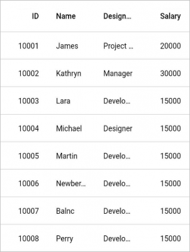
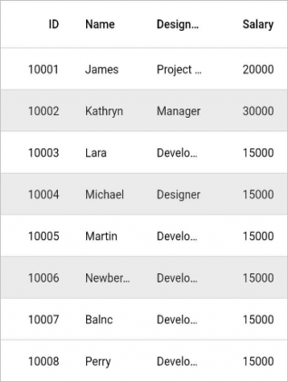

# Getting started with Flutter DataGrid (SfDataGrid)

This section explains the steps required to add the SfDataGrid widget and its features. This section covers only the basic features needed to get started with the Syncfusion® Flutter DataGrid widget.

**Note:** Ensure you have Flutter SDK installed. For detailed setup instructions, refer to the [Getting Started with your first Flutter app](https://docs.flutter.dev/get-started/test-drive#choose-your-ide) documentation.

To get started quickly with Flutter SfDataGrid, check out this video:

<iframe id='FlutterDataGridVideoTutorial' src='https://www.youtube.com/embed/-ULsEfjxFuY'></iframe>

## Add Flutter SfDataGrid to an application

Create a simple project using the instruction given in the [Getting Started with your first Flutter app](https://docs.flutter.dev/get-started/test-drive#choose-your-ide) documentation.

**Add dependency**

Add the Syncfusion® Flutter DataGrid dependency to your `pubspec.yaml` file.

 

    dependencies:

    syncfusion_flutter_datagrid: ^xx.x.xx



**Note:** Here **xx.x.xx** denotes the current version of the [`Syncfusion® Flutter DataGrid`](https://pub.dev/packages/syncfusion_flutter_datagrid/versions) package. Refer to the [pub.dev](https://pub.dev/packages/syncfusion_flutter_datagrid/versions) page to check the latest available version.

**Get packages**

Run the following command to get the required packages.

 

    $ flutter pub get



**Import package**

Import the following package in your Dart code.


 

    import 'package:syncfusion_flutter_datagrid/datagrid.dart';




## Initialize SfDataGrid

Add the [SfDataGrid](https://pub.dev/documentation/syncfusion_flutter_datagrid/latest/datagrid/SfDataGrid-class.html) widget as a child of any widget. The `SfDataGrid` widget requires the [source](https://pub.dev/documentation/syncfusion_flutter_datagrid/latest/datagrid/SfDataGrid/source.html) and [columns](https://pub.dev/documentation/syncfusion_flutter_datagrid/latest/datagrid/SfDataGrid/columns.html) properties. The `source` property is required to provide the data to display, and `columns` is required to define the grid structure. Find more details on these properties in further topics.


 

  @override
  Widget build(BuildContext context) {
    return Scaffold(
      body: SfDataGrid(
        source: _employeeDataSource,
        columns: [
          GridColumn(
            columnName: 'id',
            label: Container(
              padding: EdgeInsets.symmetric(horizontal: 16.0),
              alignment: Alignment.centerRight,
              child: Text(
                'ID',
                overflow: TextOverflow.ellipsis,
              )
            )
          ),
          GridColumn(
            columnName: 'name',
            label: Container(
              padding: EdgeInsets.symmetric(horizontal: 16.0),
              alignment: Alignment.centerLeft,
              child: Text(
                'Name',
                overflow: TextOverflow.ellipsis,
              )
            )
          ),
          GridColumn(
            columnName: 'designation',
            label: Container(
              padding: EdgeInsets.symmetric(horizontal: 16.0),
              alignment: Alignment.centerLeft,
              child: Text(
                'Designation',
                overflow: TextOverflow.ellipsis,
              )
            )
          ),
          GridColumn(
            columnName: 'salary',
            label: Container(
              padding: EdgeInsets.symmetric(horizontal: 16.0),
              alignment: Alignment.centerRight,
              child: Text(
                'Salary',
                overflow: TextOverflow.ellipsis,
              )
            )
          ),
        ],
      ),
    );
  }



## Creating data for an application

The `SfDataGrid` requires data to display. Create a data model class and populate it with sample data as shown in the following code example.

**Create the Employee model class:**


 

class Employee {
  Employee(this.id, this.name, this.designation, this.salary);
  final int id;
  final String name;
  final String designation;
  final int salary;
}




**Create sample employee collection:**

Create a collection of `Employee` objects in your StatefulWidget. The following code example shows how to initialize the employee data collection in `initState()` method. You will use this data source in the next step.


 

late EmployeeDataSource _employeeDataSource;

List<Employee> _employees = <Employee>[];

@override
void initState() {
  super.initState();
  _employees = getEmployeeData();
  _employeeDataSource = EmployeeDataSource(employees: _employees);
}
  
List<Employee> getEmployeeData() {
  return [
    Employee(10001, 'James', 'Project Lead', 20000),
    Employee(10002, 'Kathryn', 'Manager', 30000),
    Employee(10003, 'Lara', 'Developer', 15000),
    Employee(10004, 'Michael', 'Designer', 15000),
    Employee(10005, 'Martin', 'Developer', 15000),
    Employee(10006, 'Newberry', 'Developer', 15000),
    Employee(10007, 'Balnc', 'Developer', 15000),
    Employee(10008, 'Perry', 'Developer', 15000),
    Employee(10009, 'Gable', 'Developer', 15000),
    Employee(10010, 'Grimes', 'Developer', 15000)
  ];
}




## Creating data source for SfDataGrid

[DataGridSource](https://pub.dev/documentation/syncfusion_flutter_datagrid/latest/datagrid/DataGridSource-class.html) is used to obtain the row data for the `SfDataGrid`. Create a custom `DataGridSource` by extending `DataGridSource` and override the following required properties:

* **`rows`** - Returns a list of [DataGridRow](https://pub.dev/documentation/syncfusion_flutter_datagrid/latest/datagrid/DataGridRow-class.html) objects. Each `DataGridRow` contains a collection of [DataGridCell](https://pub.dev/documentation/syncfusion_flutter_datagrid/latest/datagrid/DataGridCell-class.html) objects with cell values. The cell `value` property is used for sorting and selection operations.

* **`buildRow`** - Returns a [DataGridRowAdapter](https://pub.dev/documentation/syncfusion_flutter_datagrid/latest/datagrid/DataGridRowAdapter-class.html) that builds the widget for each cell in the row.

**Note:** `DataGridSource` objects are expected to be long-lived, not recreated with each build. Initialize the `DataGridSource` once in the `initState()` method and reuse it.


 

class EmployeeDataSource extends DataGridSource {
  EmployeeDataSource({required List<Employee> employees}) {
    dataGridRows = employees
        .map<DataGridRow>((dataGridRow) => DataGridRow(cells: [
              DataGridCell<int>(columnName: 'id', value: dataGridRow.id),
              DataGridCell<String>(columnName: 'name', value: dataGridRow.name),
              DataGridCell<String>(
                  columnName: 'designation', value: dataGridRow.designation),
              DataGridCell<int>(
                  columnName: 'salary', value: dataGridRow.salary),
            ]))
        .toList();
  }

  List<DataGridRow> dataGridRows = [];

  @override
  List<DataGridRow> get rows => dataGridRows;

  @override
  DataGridRowAdapter? buildRow(DataGridRow row) {
    return DataGridRowAdapter(
        cells: row.getCells().map<Widget>((dataGridCell) {
      return Container(
          alignment: (dataGridCell.columnName == 'id' ||
                  dataGridCell.columnName == 'salary')
              ? Alignment.centerRight
              : Alignment.centerLeft,
          padding: EdgeInsets.symmetric(horizontal: 16.0),
          child: Text(
            dataGridCell.value.toString(),
            overflow: TextOverflow.ellipsis,
          ));
    }).toList());
  }
}




**Use the data source in SfDataGrid:**

Set the initialized `DataGridSource` to the `source` property of the `SfDataGrid` widget in the `build()` method.


 

late EmployeeDataSource _employeeDataSource;

@override
Widget build(BuildContext context) {
  return Scaffold(
    body: SfDataGrid(
      source: _employeeDataSource,
      columns: [
        // Define columns here
      ],
    ),
  );
}




**Note:** You can download the demo application from [GitHub](https://github.com/SyncfusionExamples/getting-started-with-flutter-datagrid).

## Defining columns

The `SfDataGrid` supports adding any widget in a column using the [GridColumn](https://pub.dev/documentation/syncfusion_flutter_datagrid/latest/datagrid/GridColumn-class.html) widget. Add the column collection to the `columns` property. Each `GridColumn` requires a `columnName` that matches the cell names in your data source and a `label` widget to display the column header.


 
  
  @override
  Widget build(BuildContext context) {
    return Scaffold(
        body: SfDataGrid(source: _employeeDataSource, columns: [
      GridColumn(
          columnName: 'id',
          label: Container(
              padding: EdgeInsets.symmetric(horizontal: 16.0),
              alignment: Alignment.centerRight,
              child: Text(
                'ID',
                overflow: TextOverflow.ellipsis,
              ))),
      GridColumn(
          columnName: 'name',
          label: Container(
              padding: EdgeInsets.symmetric(horizontal: 16.0),
              alignment: Alignment.centerLeft,
              child: Text(
                'Name',
                overflow: TextOverflow.ellipsis,
              ))),
      GridColumn(
          columnName: 'designation',
          label: Container(
              padding: EdgeInsets.symmetric(horizontal: 16.0),
              alignment: Alignment.centerLeft,
              child: Text(
                'Designation',
                overflow: TextOverflow.ellipsis,
              ))),
      GridColumn(
          columnName: 'salary',
          label: Container(
              padding: EdgeInsets.symmetric(horizontal: 16.0),
              alignment: Alignment.centerRight,
              child: Text(
                'Salary',
                overflow: TextOverflow.ellipsis,
              )))
    ]));
  }




## Selection

The `SfDataGrid` allows you to select one or more rows. Use the [selectionMode](https://pub.dev/documentation/syncfusion_flutter_datagrid/latest/datagrid/SfDataGrid/selectionMode.html) property to specify the selection behavior: single row or multiple rows.

**Enable row selection:**




@override
Widget build(BuildContext context) {
  return Scaffold(
    body: SfDataGrid(
      source: _employeeDataSource,
      columns: [
        GridColumn(
          columnName: 'id',
          label: Container(
            padding: EdgeInsets.symmetric(horizontal: 16.0),
            alignment: Alignment.centerRight,
            child: Text(
              'ID',
              overflow: TextOverflow.ellipsis,
            ),
          ),
        ),
        GridColumn(
          columnName: 'name',
          label: Container(
            padding: EdgeInsets.symmetric(horizontal: 16.0),
            alignment: Alignment.centerLeft,
            child: Text(
              'Name',
              overflow: TextOverflow.ellipsis,
            ),
          ),
        ),
        GridColumn(
          columnName: 'designation',
          label: Container(
            padding: EdgeInsets.symmetric(horizontal: 16.0),
            alignment: Alignment.centerLeft,
            child: Text(
              'Designation',
              overflow: TextOverflow.ellipsis,
            ),
          ),
        ),
        GridColumn(
          columnName: 'salary',
          label: Container(
            padding: EdgeInsets.symmetric(horizontal: 16.0),
            alignment: Alignment.centerRight,
            child: Text(
              'Salary',
              overflow: TextOverflow.ellipsis,
            ),
          ),
        ),
      ],
      selectionMode: SelectionMode.multiple,
    ),
  );
}




**Retrieve selection information:**

You can retrieve information about the selected rows using the [DataGridController](https://pub.dev/documentation/syncfusion_flutter_datagrid/latest/datagrid/DataGridController-class.html). Initialize a `DataGridController` and assign it to the [controller](https://pub.dev/documentation/syncfusion_flutter_datagrid/latest/datagrid/SfDataGrid/controller.html) property of `SfDataGrid` to access selection properties:

* [selectedIndex](https://pub.dev/documentation/syncfusion_flutter_datagrid/latest/datagrid/DataGridController/selectedIndex.html) - Gets the index of the selected row
* [selectedRow](https://pub.dev/documentation/syncfusion_flutter_datagrid/latest/datagrid/DataGridController/selectedRow.html) - Gets the currently selected row
* [selectedRows](https://pub.dev/documentation/syncfusion_flutter_datagrid/latest/datagrid/DataGridController/selectedRows.html) - Gets all selected rows

**Note:** `DataGridController` objects are expected to be long-lived, not recreated with each build. Initialize the `DataGridController` once in your State class and reuse it.


 

final DataGridController _controller = DataGridController();

@override
Widget build(BuildContext context) {
  return Scaffold(
    body: Column(
      children: [
        TextButton(
          onPressed: () {
            int selectedIndex = _controller.selectedIndex;
            DataGridRow? selectedRow = _controller.selectedRow;
            List<DataGridRow> selectedRows = _controller.selectedRows;
            
            if (selectedRow != null) {
              debugPrint('Selected Index: $selectedIndex');
              debugPrint('Selected Row: $selectedRow');
              debugPrint('All Selected Rows: $selectedRows');
            } else {
              debugPrint('No row selected');
            }
          },
          child: const Text('Get Selection Information'),
        ),
        Expanded(
          child: SfDataGrid(
            source: _employeeDataSource,
            columns: [
              GridColumn(
                columnName: 'id',
                label: Container(
                  padding: const EdgeInsets.symmetric(horizontal: 16.0),
                  alignment: Alignment.centerRight,
                  child: const Text(
                    'ID',
                    overflow: TextOverflow.ellipsis,
                  ),
                ),
              ),
              GridColumn(
                columnName: 'name',
                label: Container(
                  padding: const EdgeInsets.symmetric(horizontal: 16.0),
                  alignment: Alignment.centerLeft,
                  child: const Text(
                    'Name',
                    overflow: TextOverflow.ellipsis,
                  ),
                ),
              ),
              GridColumn(
                columnName: 'designation',
                label: Container(
                  padding: const EdgeInsets.symmetric(horizontal: 16.0),
                  alignment: Alignment.centerLeft,
                  child: const Text(
                    'Designation',
                    overflow: TextOverflow.ellipsis,
                  ),
                ),
              ),
              GridColumn(
                columnName: 'salary',
                label: Container(
                  padding: const EdgeInsets.symmetric(horizontal: 16.0),
                  alignment: Alignment.centerRight,
                  child: const Text(
                    'Salary',
                    overflow: TextOverflow.ellipsis,
                  ),
                ),
              ),
            ],
            controller: _controller,
            selectionMode: SelectionMode.multiple,
          ),
        ),
      ],
    ),
  );
}




**Note:** `SfDataGrid` supports selection via keyboard interaction for the Web and Desktop platform when `selectionMode` is not `none`.

## Next steps

* [Styling](https://pub.dev/documentation/syncfusion_flutter_datagrid/latest/datagrid/SfDataGrid-class.html) - Customize the appearance of SfDataGrid
* [Sorting](https://pub.dev/documentation/syncfusion_flutter_datagrid/latest/datagrid/SfDataGrid-class.html) - Enable sorting on columns
* [Filtering](https://pub.dev/documentation/syncfusion_flutter_datagrid/latest/datagrid/SfDataGrid-class.html) - Filter rows based on conditions
* [Editing](https://pub.dev/documentation/syncfusion_flutter_datagrid/latest/datagrid/SfDataGrid-class.html) - Enable cell editing functionality
* [Export](https://pub.dev/documentation/syncfusion_flutter_datagrid/latest/datagrid/SfDataGrid-class.html) - Export data to various formats

For more information, refer to the complete [SfDataGrid documentation](https://pub.dev/documentation/syncfusion_flutter_datagrid/latest/datagrid/SfDataGrid-class.html) and the [GitHub samples repository](https://github.com/SyncfusionExamples/getting-started-with-flutter-datagrid).
