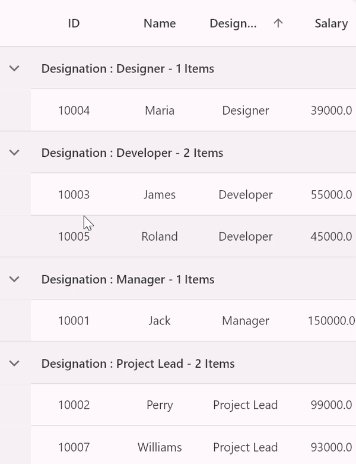
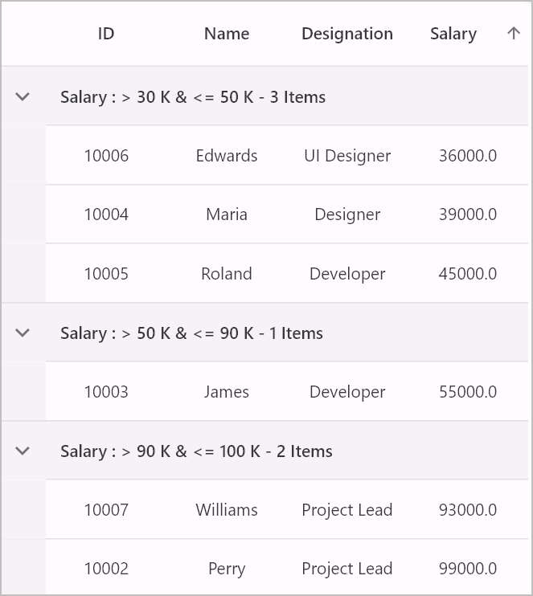
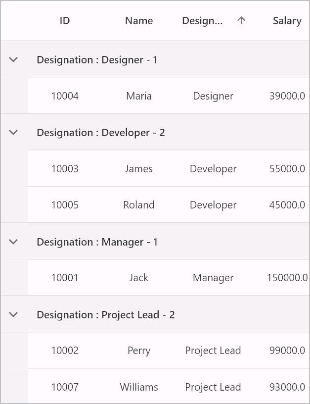
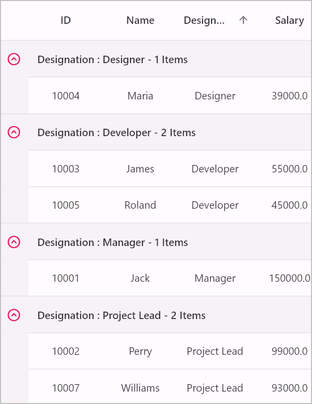

---
layout: post
title: Grouping in Flutter DataGrid | DataTable | Syncfusion
description: Learn all about how to perform grouping and multi-grouping to the data source through column in the Syncfusion Flutter DataGrid (SfDataGrid) widget and more here.
platform: flutter
control: SfDataGrid
documentation: ug
--- 

# Grouping in Flutter DataGrid (SfDataGrid)

Grouping in a DataGrid involves organizing and categorizing data based on specific criteria or field values. This feature enables the grouping of related records together, forming a hierarchical structure within the [SfDataGrid](https://pub.dev/documentation/syncfusion_flutter_datagrid/latest/datagrid/SfDataGrid-class.html). Each group is represented by the `CaptionSummaryRow `that displays at the top of each group and holds the caption summary value of that group.

By default, the DataGrid doesn't show the group's caption summary value. To showcase the caption summary value, it is necessary to override the [DataGridSource.buildGroupCaptionCellWidget](https://pub.dev/documentation/syncfusion_flutter_datagrid/latest/datagrid/DataGridSource/buildGroupCaptionCellWidget.html) method. This method receives the caption summary value as a parameter. Consequently, you will be required to return the necessary widget containing the summary value.

## Programmatic grouping

### Add column group

To enable column grouping, add the `ColumnGroup` instance through the `[DataGridSource.addColumnGroup](https://pub.dev/documentation/syncfusion_flutter_datagrid/latest/datagrid/DataGridSource/addColumnGroup.html) method.

The `ColumnGroup` object consists of the following properties:

* `name`: The column name of the `GridColumn` to be grouped.
* `sortGroupRows`: Determines whether to group the column with ascending sorting or not.

The following code demonstrates how to apply grouping to a column


 

class SfDataGridDemoState extends State<SfDataGridDemo> {
  List<Employee> employees = <Employee>[];
  late EmployeeDataSource employeeDataSource;

  @override
  void initState() {
    super.initState();
    employees = getEmployeeData();
    employeeDataSource = EmployeeDataSource(employeeData: employees);
    employeeDataSource
        .addColumnGroup(ColumnGroup(name: 'Designation', sortGroupRows: true));
  }

  @override
  Widget build(BuildContext context) {
    return Scaffold(
      appBar: AppBar(title: const Text('Syncfusion Flutter DataGrid')),
      body: SfDataGrid(
          source: employeeDataSource,
          allowExpandCollapseGroup: true,
          columns: <GridColumn>[
            GridColumn(
                columnName: 'ID',
                label: Container(
                    padding: EdgeInsets.all(8),
                    alignment: Alignment.center,
                    child: Text(
                      'ID'))),
            GridColumn(
                columnName: 'Name',
                label: Container(
                    padding: EdgeInsets.all(8),
                    alignment: Alignment.center,
                    child: Text('Name'))),
            GridColumn(
                columnName: 'Designation',
                label: Container(
                    padding: EdgeInsets.all(8),
                    alignment: Alignment.center,
                    child:
                        Text('Designation', overflow: TextOverflow.ellipsis))),
            GridColumn(
                columnName: 'Salary',
                label: Container(
                    padding: EdgeInsets.all(8),
                    alignment: Alignment.center,
                    child: Text('Salary'))),
          ]),
    );
  }
}

class EmployeeDataSource extends DataGridSource {
  EmployeeDataSource({required List<Employee> employeeData}) {
    dataGridRows = employeeData
        .map<DataGridRow>((e) => DataGridRow(cells: [
              DataGridCell<int>(columnName: 'ID', value: e.id),
              DataGridCell<String>(columnName: 'Name', value: e.name),
              DataGridCell<String>(
                  columnName: 'Designation', value: e.designation),
              DataGridCell<double>(columnName: 'Salary', value: e.salary),
            ]))
        .toList();
  }

  List<DataGridRow> dataGridRows = [];

  @override
  List<DataGridRow> get rows => dataGridRows;

  @override
  DataGridRowAdapter buildRow(DataGridRow row) {
    return DataGridRowAdapter(
        cells: row.getCells().map<Widget>((e) {
      return Container(
        alignment: Alignment.center,
        padding: EdgeInsets.all(8),
        child: Text(
          e.value.toString(),
        ),
      );
    }).toList());
  }

  @override
  Widget? buildGroupCaptionCellWidget(
      RowColumnIndex rowColumnIndex, String summaryValue) {
    return Container(
        padding: EdgeInsets.symmetric(horizontal: 12, vertical: 15),
        child: Text(summaryValue));
  }
}




### Remove column group

To disable column grouping for a particular column, remove that `ColumnGroup` instance using the `DataGridSource.removeColumnGroup`` method.


 

  @override
  void initState() {
    super.initState();
    employees = getEmployeeData();
    employeeDataSource = EmployeeDataSource(employeeData: employees);
    employeeDataSource
        .addColumnGroup(ColumnGroup(name: 'Designation', sortGroupRows: true));
    employeeDataSource
        .addColumnGroup(ColumnGroup(name: 'Salary', sortGroupRows: false));
  }

  @override
  Widget build(BuildContext context) {
    return Scaffold(
      appBar: AppBar(title: const Text('Syncfusion Flutter DataGrid')),
      body: Column(children: [
        ElevatedButton(
            onPressed: () {
              setState(() {});
              ColumnGroup? group = employeeDataSource.groupedColumns
                  .firstWhereOrNull((element) => element.name == 'Salary');
              if (group != null) {
                employeeDataSource.removeColumnGroup(group);
              }
            },
            child: Text('Remove Salary Column Group')),
        Expanded(
            child: SfDataGrid(
                source: employeeDataSource,
                allowExpandCollapseGroup: true,
                columns: <GridColumn>[
              GridColumn(
                  columnName: 'ID',
                  label: Container(
                      padding: EdgeInsets.all(8),
                      alignment: Alignment.center,
                      child: Text('ID'))),
              GridColumn(
                  columnName: 'Name',
                  label: Container(
                      padding: EdgeInsets.all(8),
                      alignment: Alignment.center,
                      child: Text('Name'))),
              GridColumn(
                  columnName: 'Designation',
                  label: Container(
                      padding: EdgeInsets.all(8),
                      alignment: Alignment.center,
                      child: Text('Designation',
                          overflow: TextOverflow.ellipsis))),
              GridColumn(
                  columnName: 'Salary',
                  label: Container(
                      padding: EdgeInsets.all(8),
                      alignment: Alignment.center,
                      child: Text('Salary'))),
            ])),
      ]),
    );
  }




### Clear all column groups

To clear all the column groups, simply call the [DataGridSource.clearColumnGroups](https://pub.dev/documentation/syncfusion_flutter_datagrid/latest/datagrid/DataGridSource/clearColumnGroups.html) method.


 

  @override
  Widget build(BuildContext context) {
    return Scaffold(
      appBar: AppBar(title: const Text('Syncfusion Flutter DataGrid')),
      body: Column(children: [
        ElevatedButton(
            onPressed: () {
              setState(() {});
              employeeDataSource.clearColumnGroups();
            },
            child: Text('Clear all column groups')),
        Expanded(
            child: SfDataGrid(
                source: employeeDataSource,
                allowExpandCollapseGroup: true,
                columns: <GridColumn>[
              GridColumn(
                  columnName: 'ID',
                  label: Container(
                      padding: EdgeInsets.all(8),
                      alignment: Alignment.center,
                      child: Text('ID'))),
              GridColumn(
                  columnName: 'Name',
                  label: Container(
                      padding: EdgeInsets.all(8),
                      alignment: Alignment.center,
                      child: Text('Name'))),
              GridColumn(
                  columnName: 'Designation',
                  label: Container(
                      padding: EdgeInsets.all(8),
                      alignment: Alignment.center,
                      child: Text('Designation',
                          overflow: TextOverflow.ellipsis))),
              GridColumn(
                  columnName: 'Salary',
                  label: Container(
                      padding: EdgeInsets.all(8),
                      alignment: Alignment.center,
                      child: Text('Salary'))),
            ])),
      ]),
    );
  }




## Multi-level grouping

The `SfDataGrid` allows grouping of data against one or more columns by adding multiple columns to the [DataGridSource.addColumnGroup](https://pub.dev/documentation/syncfusion_flutter_datagrid/latest/datagrid/DataGridSource/addColumnGroup.html) property. This feature organizes data into a hierarchical tree structure based on identical values within those columns.

Initially, data is grouped according to the first column added to the `DataGridSource.addColumnGroup` property. Subsequently, when additional columns are included in `DataGridSource.addColumnGroup,` each new column is grouped in consideration of the existing group(s). This process creates a tree-like hierarchy. To enable multi-grouping, please refer to the following code snippet:
    



  @override
  void initState() {
    super.initState();
    employees = getEmployeeData();
    employeeDataSource = EmployeeDataSource(employeeData: employees);
    employeeDataSource
        .addColumnGroup(ColumnGroup(name: 'Designation', sortGroupRows: true));
    employeeDataSource
        .addColumnGroup(ColumnGroup(name: 'Salary', sortGroupRows: false));
  }

  @override
  Widget build(BuildContext context) {
    return Scaffold(
      appBar: AppBar(title: const Text('Syncfusion Flutter DataGrid')),
      body: SfDataGrid(
          source: employeeDataSource,
          allowExpandCollapseGroup: true,
          columns: <GridColumn>[
            GridColumn(
                columnName: 'ID',
                label: Container(
                    padding: EdgeInsets.all(8),
                    alignment: Alignment.center,
                    child: Text(
                      'ID'))),
            GridColumn(
                columnName: 'Name',
                label: Container(
                    padding: EdgeInsets.all(8),
                    alignment: Alignment.center,
                    child: Text('Name'))),
            GridColumn(
                columnName: 'Designation',
                label: Container(
                    padding: EdgeInsets.all(8),
                    alignment: Alignment.center,
                    child:
                        Text('Designation', overflow: TextOverflow.ellipsis))),
            GridColumn(
                columnName: 'Salary',
                label: Container(
                    padding: EdgeInsets.all(8),
                    alignment: Alignment.center,
                    child: Text('Salary'))),
          ]),
    );
  }
        



## Callbacks

The `SfDataGrid` provides the following callbacks to notify the grouping stages:

### GroupExpanding

The [SfDataGrid.groupExpanding](https://pub.dev/documentation/syncfusion_flutter_datagrid/latest/datagrid/SfDataGrid/groupExpanding.html) callback is invoked when the group is being expanded. You can return false from this callback to restrict the group from being expanded.




  @override
  void initState() {
    super.initState();
    employees = getEmployeeData();
    employeeDataSource = EmployeeDataSource(employeeData: employees);
    employeeDataSource
        .addColumnGroup(ColumnGroup(name: 'Designation', sortGroupRows: true));
  }

  @override
  Widget build(BuildContext context) {
    return Scaffold(
      appBar: AppBar(title: const Text('Syncfusion Flutter DataGrid')),
      body: SfDataGrid(
          source: employeeDataSource,
          allowExpandCollapseGroup: true,
          groupExpanding: (group) {
            print('Group expanding: ${group.key}');
            print('Group level: ${group.groupLevel}');
            return true;
          },
          columns: <GridColumn>[
            GridColumn(
                columnName: 'ID',
                label: Container(
                    padding: EdgeInsets.all(8),
                    alignment: Alignment.center,
                    child: Text('ID'))),
            GridColumn(
                columnName: 'Name',
                label: Container(
                    padding: EdgeInsets.all(8),
                    alignment: Alignment.center,
                    child: Text('Name'))),
            GridColumn(
                columnName: 'Designation',
                label: Container(
                    padding: EdgeInsets.all(8),
                    alignment: Alignment.center,
                    child:
                        Text('Designation', overflow: TextOverflow.ellipsis))),
            GridColumn(
                columnName: 'Salary',
                label: Container(
                    padding: EdgeInsets.all(8),
                    alignment: Alignment.center,
                    child: Text('Salary'))),
          ]),
    );
  }
        



### GroupExpanded

The [SfDataGrid.groupExpanded](https://pub.dev/documentation/syncfusion_flutter_datagrid/latest/datagrid/SfDataGrid/groupExpanded.html) callback is invoked when the group is expanded.




  @override
  Widget build(BuildContext context) {
    return Scaffold(
      appBar: AppBar(title: const Text('Syncfusion Flutter DataGrid')),
      body: SfDataGrid(
          source: employeeDataSource,
          allowExpandCollapseGroup: true,
          groupExpanded: (group) {
            print('Group expanding: ${group.key}');
            print('Group level: ${group.groupLevel}');
          },
          columns: <GridColumn>[
            GridColumn(
                columnName: 'ID',
                label: Container(
                    padding: EdgeInsets.all(8),
                    alignment: Alignment.center,
                    child: Text('ID'))),
            GridColumn(
                columnName: 'Name',
                label: Container(
                    padding: EdgeInsets.all(8),
                    alignment: Alignment.center,
                    child: Text('Name'))),
            GridColumn(
                columnName: 'Designation',
                label: Container(
                    padding: EdgeInsets.all(8),
                    alignment: Alignment.center,
                    child:
                        Text('Designation', overflow: TextOverflow.ellipsis))),
            GridColumn(
                columnName: 'Salary',
                label: Container(
                    padding: EdgeInsets.all(8),
                    alignment: Alignment.center,
                    child: Text('Salary'))),
          ]),
    );
  }




### GroupCollapsing

The [SfDataGrid.groupCollapsing](https://pub.dev/documentation/syncfusion_flutter_datagrid/latest/datagrid/SfDataGrid/groupCollapsing.html) callback is invoked when the group is being collapsed. You can return false from this callback to restrict the group from being collapsed.




  @override
  Widget build(BuildContext context) {
    return Scaffold(
      appBar: AppBar(title: const Text('Syncfusion Flutter DataGrid')),
      body: SfDataGrid(
          source: employeeDataSource,
          allowExpandCollapseGroup: true,
          groupCollapsing: (group) {
            print('Group expanding: ${group.key}');
            print('Group level: ${group.groupLevel}');
            return true;
          },
          columns: <GridColumn>[
            GridColumn(
                columnName: 'ID',
                label: Container(
                    padding: EdgeInsets.all(8),
                    alignment: Alignment.center,
                    child: Text('ID'))),
            GridColumn(
                columnName: 'Name',
                label: Container(
                    padding: EdgeInsets.all(8),
                    alignment: Alignment.center,
                    child: Text('Name'))),
            GridColumn(
                columnName: 'Designation',
                label: Container(
                    padding: EdgeInsets.all(8),
                    alignment: Alignment.center,
                    child:
                        Text('Designation', overflow: TextOverflow.ellipsis))),
            GridColumn(
                columnName: 'Salary',
                label: Container(
                    padding: EdgeInsets.all(8),
                    alignment: Alignment.center,
                    child: Text('Salary'))),
          ]),
    );
  }
        



### GroupCollapsed

The [SfDataGrid.groupCollapsed](https://pub.dev/documentation/syncfusion_flutter_datagrid/latest/datagrid/SfDataGrid/groupCollapsed.html) callback is invoked when the group is collapsed.




  @override
  Widget build(BuildContext context) {
    return Scaffold(
      appBar: AppBar(title: const Text('Syncfusion Flutter DataGrid')),
      body: SfDataGrid(
          source: employeeDataSource,
          allowExpandCollapseGroup: true,
          groupCollapsed: (group) {
            print('Group expanding: ${group.key}');
            print('Group level: ${group.groupLevel}');
          },
          columns: <GridColumn>[
            GridColumn(
                columnName: 'ID',
                label: Container(
                    padding: EdgeInsets.all(8),
                    alignment: Alignment.center,
                    child: Text('ID'))),
            GridColumn(
                columnName: 'Name',
                label: Container(
                    padding: EdgeInsets.all(8),
                    alignment: Alignment.center,
                    child: Text('Name'))),
            GridColumn(
                columnName: 'Designation',
                label: Container(
                    padding: EdgeInsets.all(8),
                    alignment: Alignment.center,
                    child:
                        Text('Designation', overflow: TextOverflow.ellipsis))),
            GridColumn(
                columnName: 'Salary',
                label: Container(
                    padding: EdgeInsets.all(8),
                    alignment: Alignment.center,
                    child: Text('Salary'))),
          ]),
    );
  }
        



## Custom grouping

The `SfDataGrid` provides support to group a column using custom logic when standard grouping techniques aren't sufficient for specific requirements. This can be accomplished by overriding the [DataGridSource.performGrouping](https://pub.dev/documentation/syncfusion_flutter_datagrid/latest/datagrid/DataGridSource/performGrouping.html) method. 

The `DataGridSource.performGrouping` method is invoked when grouping is applied to the `SfDataGrid`. Within this method, you can implement custom logic to return a `String` based on your specific requirements.




  @override
  void initState() {
    super.initState();
    employees = getEmployeeData();
    employeeDataSource = EmployeeDataSource(employeeData: employees);
    employeeDataSource
        .addColumnGroup(ColumnGroup(name: 'Salary', sortGroupRows: true));
  }

  @override
  Widget build(BuildContext context) {
    return Scaffold(
      appBar: AppBar(title: const Text('Syncfusion Flutter DataGrid')),
      body: SfDataGrid(
          source: employeeDataSource,
          allowExpandCollapseGroup: true,
          groupExpanded: (group) {
            print('Group expanding: ${group.key}');
            print('Group level: ${group.groupLevel}');
          },
          columns: <GridColumn>[
            GridColumn(
                columnName: 'ID',
                label: Container(
                    padding: EdgeInsets.all(8),
                    alignment: Alignment.center,
                    child: Text('ID'))),
            GridColumn(
                columnName: 'Name',
                label: Container(
                    padding: EdgeInsets.all(8),
                    alignment: Alignment.center,
                    child: Text('Name'))),
            GridColumn(
                columnName: 'Designation',
                label: Container(
                    padding: EdgeInsets.all(8),
                    alignment: Alignment.center,
                    child:
                        Text('Designation', overflow: TextOverflow.ellipsis))),
            GridColumn(
                columnName: 'Salary',
                label: Container(
                    padding: EdgeInsets.all(8),
                    alignment: Alignment.center,
                    child: Text('Salary'))),
          ]),
    );
  }
}

class EmployeeDataSource extends DataGridSource {
  EmployeeDataSource({required List<Employee> employeeData}) {
    dataGridRows = employeeData
        .map<DataGridRow>((e) => DataGridRow(cells: [
              DataGridCell<int>(columnName: 'ID', value: e.id),
              DataGridCell<String>(columnName: 'Name', value: e.name),
              DataGridCell<String>(
                  columnName: 'Designation', value: e.designation),
              DataGridCell<double>(columnName: 'Salary', value: e.salary),
            ]))
        .toList();
  }

  List<DataGridRow> dataGridRows = [];

  @override
  List<DataGridRow> get rows => dataGridRows;

  @override
  DataGridRowAdapter buildRow(DataGridRow row) {
    return DataGridRowAdapter(
        cells: row.getCells().map<Widget>((e) {
      return Container(
        alignment: Alignment.center,
        padding: EdgeInsets.all(8),
        child: Text(
          e.value.toString(),
        ),
      );
    }).toList());
  }

  @override
  Widget? buildGroupCaptionCellWidget(
      RowColumnIndex rowColumnIndex, String summaryValue) {
    return Container(
        padding: EdgeInsets.symmetric(horizontal: 12, vertical: 15),
        child: Text(summaryValue));
  }

  @override
  String performGrouping(String columnName, DataGridRow row) {
    if (columnName == 'Salary') {
      final double total = row
          .getCells()
          .firstWhereOrNull(
              (DataGridCell cell) => cell.columnName == columnName)!
          .value;
      if (total > 100000 && total <= 200000) {
        return '> 100 K & <= 150 K';
      } else if (total > 90000 && total <= 100000) {
        return '> 90 K & <= 100 K';
      } else if (total > 50000 && total <= 90000) {
        return '> 50 K & <= 90 K';
      } else if (total > 30000 && total <= 50000) {
        return '> 30 K & <= 50 K';
      } else {
        return '<= 30 K';
      }
    }
    return super.performGrouping(columnName, row);
  }
}
        



## Enable group expand and collapse 

The group expand and collapse functionality can be enabled by setting the [SfDataGrid.allowExpandCollapseGroup](https://pub.dev/documentation/syncfusion_flutter_datagrid/latest/datagrid/SfDataGrid/allowExpandCollapseGroup.html) property to `true`. The default value of this property is `false.`




  @override
  void initState() {
    super.initState();
    employees = getEmployeeData();
    employeeDataSource = EmployeeDataSource(employeeData: employees);
    employeeDataSource
        .addColumnGroup(ColumnGroup(name: 'Salary', sortGroupRows: true));
  }

  @override
  Widget build(BuildContext context) {
    return Scaffold(
      appBar: AppBar(title: const Text('Syncfusion Flutter DataGrid')),
      body: SfDataGrid(
          source: employeeDataSource,
          allowExpandCollapseGroup: true,
          columns: <GridColumn>[
            GridColumn(
                columnName: 'ID',
                label: Container(
                    padding: EdgeInsets.all(8),
                    alignment: Alignment.center,
                    child: Text('ID'))),
            GridColumn(
                columnName: 'Name',
                label: Container(
                    padding: EdgeInsets.all(8),
                    alignment: Alignment.center,
                    child: Text('Name'))),
            GridColumn(
                columnName: 'Designation',
                label: Container(
                    padding: EdgeInsets.all(8),
                    alignment: Alignment.center,
                    child:
                        Text('Designation', overflow: TextOverflow.ellipsis))),
            GridColumn(
                columnName: 'Salary',
                label: Container(
                    padding: EdgeInsets.all(8),
                    alignment: Alignment.center,
                    child: Text('Salary'))),
          ]),
    );
  }
        



## Disable group expanding on the initial loading

By default, the SfDataGrid always expands all the groups. All the groups can be collapsed intially by setting the [SfDataGrid.autoExpandGroups](https://pub.dev/documentation/syncfusion_flutter_datagrid/latest/datagrid/SfDataGrid/autoExpandGroups.html) property to false.




  @override
  Widget build(BuildContext context) {
    return Scaffold(
      appBar: AppBar(title: const Text('Syncfusion Flutter DataGrid')),
      body: SfDataGrid(
          source: employeeDataSource,
          autoExpandGroups: false,
          allowExpandCollapseGroup: true,
          columns: <GridColumn>[
            GridColumn(
                columnName: 'ID',
                label: Container(
                    padding: EdgeInsets.all(8),
                    alignment: Alignment.center,
                    child: Text('ID'))),
            GridColumn(
                columnName: 'Name',
                label: Container(
                    padding: EdgeInsets.all(8),
                    alignment: Alignment.center,
                    child: Text('Name'))),
            GridColumn(
                columnName: 'Designation',
                label: Container(
                    padding: EdgeInsets.all(8),
                    alignment: Alignment.center,
                    child:
                        Text('Designation', overflow: TextOverflow.ellipsis))),
            GridColumn(
                columnName: 'Salary',
                label: Container(
                    padding: EdgeInsets.all(8),
                    alignment: Alignment.center,
                    child: Text('Salary'))),
          ]),
    );
  }
        



## Programmatically expand and collapse groups

Expanding and collapsing groups programmatically can be achieved using the following `DataGridController` methods,

<table>
<tr>
<th>Method </th>
<th>Description </th>
</tr>
<tr>
<td><code>DataGridController.expandAllGroup</code> </td>
<td>Expands all the groups in the SfDataGrid </td>
</tr>
<tr>
<td><code>DataGridController.collapseAllGroup</code>. </td>
<td>Collapses all the groups in the SfDataGrid </td>
</tr>
<tr>
<td><code>DataGridController.expandGroupsAtLevel</code>. </td>
<td>Expands the group based on the group level </td>
</tr>
<tr>
<td><code>DataGridController.collapseGroupsAtLevel</code>. </td>
<td>Collapses the group based on the group level </td>
</tr>
</table>

## Customize the group caption summary row format

The caption summary value is displayed in a caption summary row by the default format `'{ColumnName} : {Key} - {ItemsCount} Items'.` The `{ColumnName}` defines the name of the grouped column, {Key} defines the identical cell value of the group, and `{ItemsCount}` defines the length of the rows in the group.

The format can be customized by using the [SfDataGrid.groupCaptionTitleFormat](https://pub.dev/documentation/syncfusion_flutter_datagrid/latest/datagrid/SfDataGrid/groupCaptionTitleFormat.html) property.




  @override
  Widget build(BuildContext context) {
    return Scaffold(
      appBar: AppBar(title: const Text('Syncfusion Flutter DataGrid')),
      body: SfDataGrid(
          source: employeeDataSource,
          allowExpandCollapseGroup: true,
          groupCaptionTitleFormat: '{ColumnName} : {Key} - {ItemsCount}',
          columns: <GridColumn>[
            GridColumn(
                columnName: 'ID',
                label: Container(
                    padding: EdgeInsets.all(8),
                    alignment: Alignment.center,
                    child: Text('ID'))),
            GridColumn(
                columnName: 'Name',
                label: Container(
                    padding: EdgeInsets.all(8),
                    alignment: Alignment.center,
                    child: Text('Name'))),
            GridColumn(
                columnName: 'Designation',
                label: Container(
                    padding: EdgeInsets.all(8),
                    alignment: Alignment.center,
                    child:
                        Text('Designation', overflow: TextOverflow.ellipsis))),
            GridColumn(
                columnName: 'Salary',
                label: Container(
                    padding: EdgeInsets.all(8),
                    alignment: Alignment.center,
                    child: Text('Salary'))),
          ]),
    );
  }
        



## Customize the indent column appearance

The width and color of the indent column can be personalized using the [SfDataGridThemeData.indentColumnWidth](https://pub.dev/documentation/syncfusion_flutter_core/latest/theme/SfDataGridThemeData/indentColumnWidth.html) and [SfDataGridThemeData.indentColumnColor](https://pub.dev/documentation/syncfusion_flutter_core/latest/theme/SfDataGridThemeData/indentColumnColor.html) properties. The default values for these properties are `40.0` and `null,` respectively.




 import 'package:syncfusion_flutter_core/theme.dart';
 import 'package:syncfusion_flutter_datagrid/datagrid.dart';

  @override
  Widget build(BuildContext context) {
    return Scaffold(
      appBar: AppBar(title: const Text('Syncfusion Flutter DataGrid')),
      body: SfDataGridTheme(
        data: SfDataGridThemeData(
            indentColumnWidth: 100, indentColumnColor: Colors.amber),
        child: SfDataGrid(
            source: employeeDataSource,
            allowExpandCollapseGroup: true,
            columns: <GridColumn>[
              GridColumn(
                  columnName: 'ID',
                  label: Container(
                      padding: EdgeInsets.all(8),
                      alignment: Alignment.center,
                      child: Text('ID'))),
              GridColumn(
                  columnName: 'Name',
                  label: Container(
                      padding: EdgeInsets.all(8),
                      alignment: Alignment.center,
                      child: Text('Name'))),
              GridColumn(
                  columnName: 'Designation',
                  label: Container(
                      padding: EdgeInsets.all(8),
                      alignment: Alignment.center,
                      child: Text('Designation',
                          overflow: TextOverflow.ellipsis))),
              GridColumn(
                  columnName: 'Salary',
                  label: Container(
                      padding: EdgeInsets.all(8),
                      alignment: Alignment.center,
                      child: Text('Salary'))),
            ]),
      ),
    );
  }
        



## Customize the group expander icon

The group expander icon is used to indicate the state of a group. It is displayed only when the [SfDataGrid.allowExpandCollapseGroup](https://pub.dev/documentation/syncfusion_flutter_datagrid/latest/datagrid/SfDataGrid/allowExpandCollapseGroup.html) option is enabled. The icon can be customized by using the [SfDataGridThemeData.groupExpanderIcon](https://pub.dev/documentation/syncfusion_flutter_core/latest/theme/SfDataGridThemeData/groupExpanderIcon.html) property.

The `SfDataGridThemeData` and `SfDataGridTheme` classes are available in the [syncfusion_flutter_core](https://pub.dev/packages/syncfusion_flutter_core) package.




  @override
  Widget build(BuildContext context) {
    return Scaffold(
      appBar: AppBar(title: const Text('Syncfusion Flutter DataGrid')),
      body: SfDataGridTheme(
        data: SfDataGridThemeData(
            groupExpanderIcon: Icon(Icons.expand_circle_down_outlined,
                size: 20, color: Colors.pink)),
        child: SfDataGrid(
            source: employeeDataSource,
            allowExpandCollapseGroup: true,
            columns: <GridColumn>[
              GridColumn(
                  columnName: 'ID',
                  label: Container(
                      padding: EdgeInsets.all(8),
                      alignment: Alignment.center,
                      child: Text('ID'))),
              GridColumn(
                  columnName: 'Name',
                  label: Container(
                      padding: EdgeInsets.all(8),
                      alignment: Alignment.center,
                      child: Text('Name'))),
              GridColumn(
                  columnName: 'Designation',
                  label: Container(
                      padding: EdgeInsets.all(8),
                      alignment: Alignment.center,
                      child: Text('Designation',
                          overflow: TextOverflow.ellipsis))),
              GridColumn(
                  columnName: 'Salary',
                  label: Container(
                      padding: EdgeInsets.all(8),
                      alignment: Alignment.center,
                      child: Text('Salary'))),
            ]),
      ),
    );
  }
        



## Limitations

* The grouping will be refreshed when performing CRUD operations on the [DataGridSource.rows](https://pub.dev/documentation/syncfusion_flutter_datagrid/latest/datagrid/DataGridSource/rows.html) and the [SfDataGrid.columns](https://pub.dev/documentation/syncfusion_flutter_datagrid/latest/datagrid/SfDataGrid/columns.html).` Consequently, this action resets the expand and collapse states of the groups based on the [SfDataGrid.autoExpandGroups](https://pub.dev/documentation/syncfusion_flutter_datagrid/latest/datagrid/SfDataGrid/autoExpandGroups.html) property.
* To prevent unnecessary grouping refresh, ensure that the `SfDataGrid.columns` property is set as an instance.