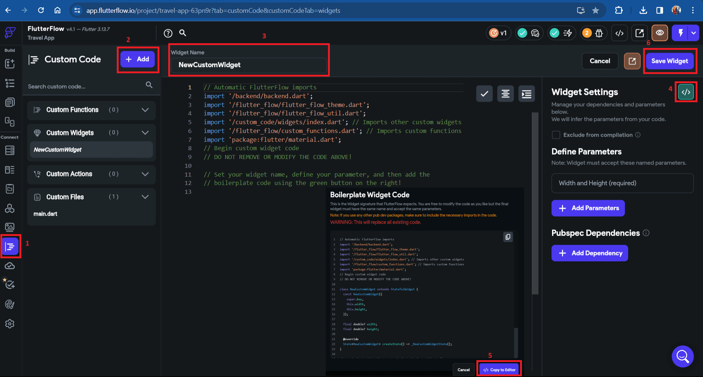
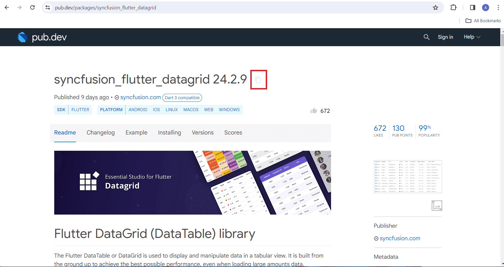
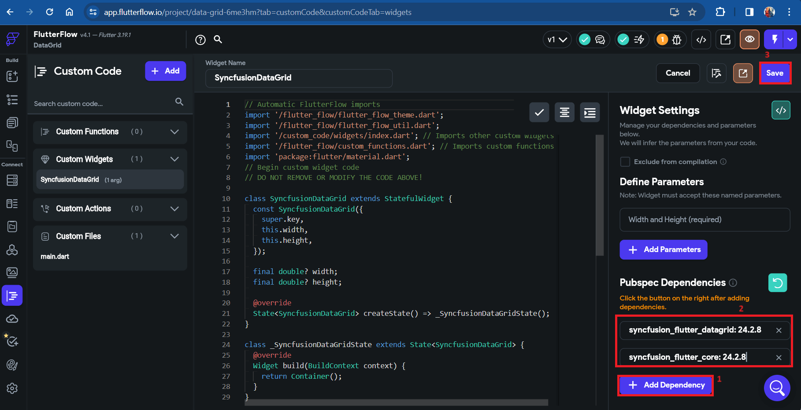
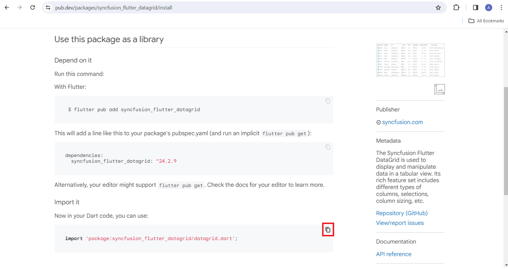
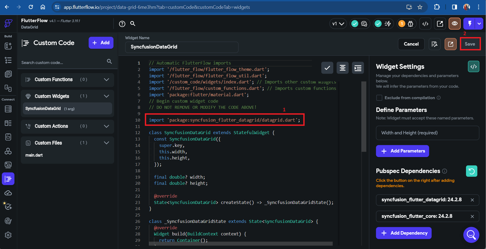
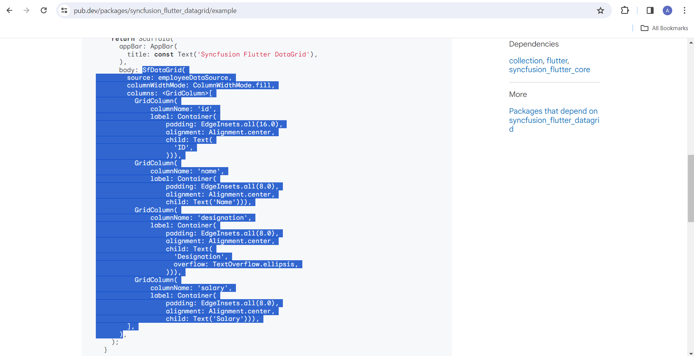
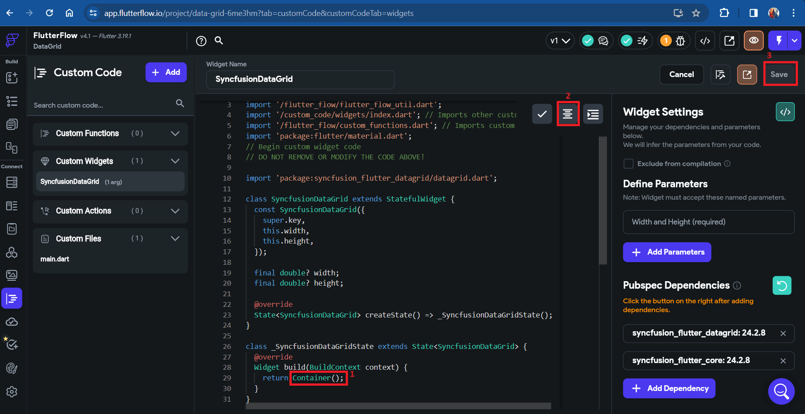
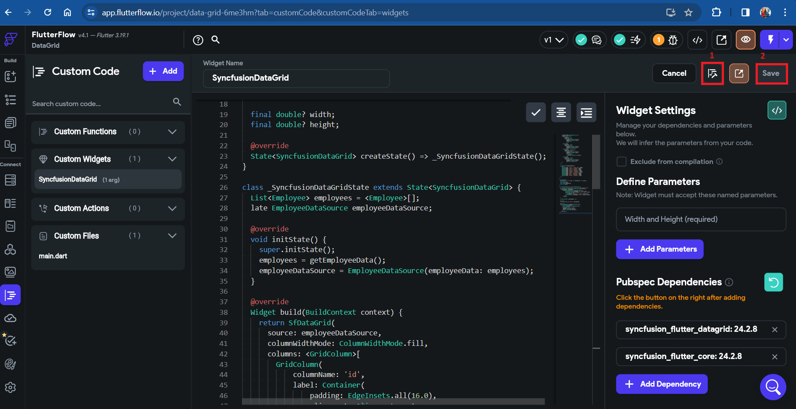
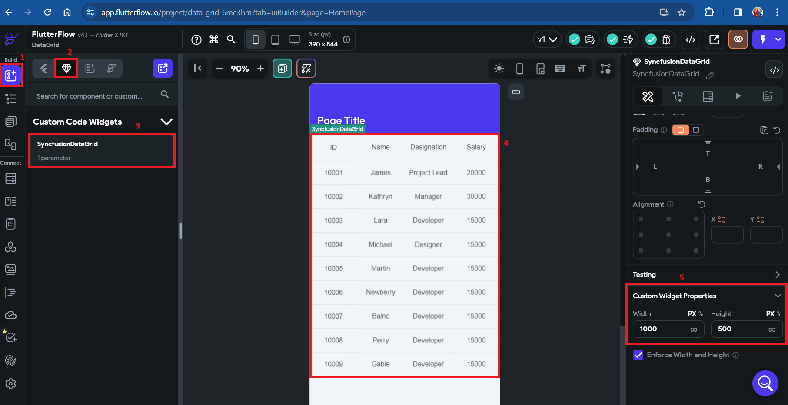

# How to add Syncfusion DataGrid widget in FlutterFlow?

## Overview

[FlutterFlow](https://app.flutterflow.io/dashboard) enables you to create native applications using its graphical interface, reducing the need to write extensive amounts of code. Additionally, it offers the capability to include custom widgets that are not included in the default [FlutterFlow](https://app.flutterflow.io/dashboard) widget collection. This article explains how to incorporate the SfDataGrid widget as a custom widget in FlutterFlow.

> **Note:** You need an active FlutterFlow account and basic knowledge of Flutter development to follow this guide. Refer to the [SDK version compatibility](https://help.syncfusion.com/flutter/system-requirements#sdk-version-compatibility) to ensure your FlutterFlow's Flutter version is compatible with the Syncfusion Flutter DataGrid package.

### Create a new project

Navigate to the [FlutterFlow dashboard](https://app.flutterflow.io/dashboard) and click the `+ Create New` button to create a new project.

### Creating the custom widget

1. Navigate to the `Custom Code` section in the left side navigation menu.
2. Click on the `+ Add` button to open a dropdown menu, then select `Widget`.
3. Update the widget name as desired.
4. Click the `View Boilerplate Code` button on the right side, represented by the code icon (`</>`).
5. A popup will appear with startup code. Locate the button labeled `</> Copy to Editor` and click on it to load the boilerplate code into the editor.
6. Click `Save` to save the custom widget.

### Add DataGrid widget as a dependency

1. Click on `+ Add Dependency`, a text editor will appear.
2. Navigate to the [Syncfusion Flutter DataGrid package](https://pub.dev/packages/syncfusion_flutter_DataGrid) on pub.dev and copy the dependency name and version using the `Copy to Clipboard` option.

3. Paste the copied dependency into the text editor, then click `Refresh` and `Save` it.

>**Note**: 
>- If you need a specific version instead of the latest, remove the caret (^) prefix in the version number. For example, change `^21.3.0` to `21.3.0` to lock to that exact version.
>- The SfDataGrid package depends on the [Syncfusion Flutter Core](https://pub.dev/packages/syncfusion_flutter_core) package. Make sure to add it as a dependency using the same steps above.

### Import the package

1. Navigate to the **Installing** tab on the [Syncfusion Flutter DataGrid package](https://pub.dev/packages/syncfusion_flutter_DataGrid) page. Under the **Import it** section, copy the package import statement.

2. Paste the copied import statement into the code editor and click `Save`.

### Add widget code snippet in code editor

1. Navigate to the **Example** tab in the [Syncfusion Flutter DataGrid package](https://pub.dev/packages/syncfusion_flutter_DataGrid/example) page and copy the widget code example.

2. Paste the copied code into the editor, click `Format Code` to format it to standard style, and then click `Save`.

### Compiling the code

1. Click the **Compile Code** button located in the top right corner.
2. Wait for the compilation to complete (typically 2-3 minutes). The status will display at the top of the editor.
3. Once compilation succeeds, a confirmation message will appear. If errors occur, review the error messages, fix the code, and compile again.
4. Click `Save` after successful compilation.

>**Note**: Compilation typically takes 2 to 3 minutes. The editor will display compilation status and any errors encountered during the build process.

### Using the custom widget in your app

1. Navigate to **Widget Palette** in the left side navigation menu.
2. Click on the **Components** tab.
3. Locate your custom widget under **Custom Code Widgets**. Drag and drop it onto your page.
4. Configure the SfDataGrid properties and data source as needed. Refer to the [SfDataGrid API documentation](https://pub.dev/documentation/syncfusion_flutter_datagrid/latest/) for detailed configuration options.
5. Run your FlutterFlow app to verify the SfDataGrid widget displays correctly.

