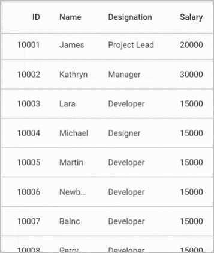
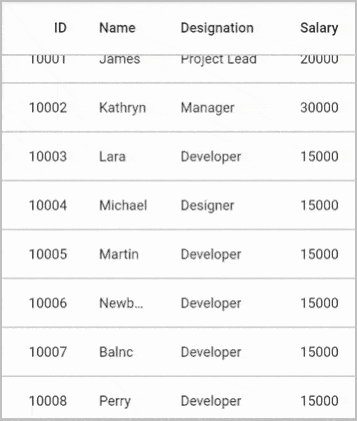

# Load more in Flutter Datagrid (SfDataGrid)

The datagrid provides support to display an interactive view when the grid reaches its maximum offset while scrolling down. You can use [loadMoreViewBuilder](https://pub.dev/documentation/syncfusion_flutter_datagrid/latest/datagrid/SfDataGrid/loadMoreViewBuilder.html) builder to display the view at bottom of datagrid. 

You should override the [DataGridSource.handleLoadMoreRows](https://pub.dev/documentation/syncfusion_flutter_datagrid/latest/datagrid/DataGridSource/handleLoadMoreRows.html) method to load more rows and then notify the datagrid about the changes. The `DataGridSource.handleLoadMoreRows` can be called to load more rows from this builder by using the [loadMoreRows](https://pub.dev/documentation/syncfusion_flutter_datagrid/latest/datagrid/LoadMoreRows.html) function which is passed as a parameter to `loadMoreViewBuilder`.

## Infinite scrolling

Infinite Scrolling is an approach that can be used to load more rows to the datagrid whenever the datagrid reaches the bottom.

The following example demonstrates infinite scrolling by showing the circular progress indicator until the rows are loaded when the datagrid reaches the bottom,


 

import 'package:syncfusion_flutter_datagrid/datagrid.dart';

@override
Widget build(BuildContext context) {
  return SfDataGrid(
      source: _employeeDataSource,
      loadMoreViewBuilder: (BuildContext context, LoadMoreRows loadMoreRows) {
        Future<String> loadRows() async {
          // Call the loadMoreRows function to call the
          // DataGridSource.handleLoadMoreRows method. So, additional
          // rows can be added from handleLoadMoreRows method.
          await loadMoreRows();
          return Future<String>.value('Completed');
        }

        return FutureBuilder<String>(
            initialData: 'loading',
            future: loadRows(),
            builder: (context, snapShot) {
              if (snapShot.data == 'loading') {
                return Container(
                    height: 60.0,
                    width: double.infinity,
                    decoration: BoxDecoration(
                        color: Colors.white,
                        border: BorderDirectional(
                            top: BorderSide(
                                width: 1.0,
                                color: Color.fromRGBO(0, 0, 0, 0.26)))),
                    alignment: Alignment.center,
                    child: CircularProgressIndicator(
                        valueColor: AlwaysStoppedAnimation(Colors.deepPurple)));
              } else {
                return SizedBox.fromSize(size: Size.zero);
              }
            });
      },
      columns: <GridColumn>[
        GridColumn(
            columnName: 'id',
            label: Container(
                padding: EdgeInsets.symmetric(horizontal: 16.0),
                alignment: Alignment.centerRight,
                child: Text(
                  'ID',
                  overflow: TextOverflow.ellipsis,
                ))),
        GridColumn(
            columnName: 'name',
            label: Container(
                padding: EdgeInsets.symmetric(horizontal: 16.0),
                alignment: Alignment.centerLeft,
                child: Text(
                  'Name',
                  overflow: TextOverflow.ellipsis,
                ))),
        GridColumn(
            columnName: 'designation',
            label: Container(
                padding: EdgeInsets.symmetric(horizontal: 16.0),
                alignment: Alignment.centerLeft,
                child: Text(
                  'Designation',
                  overflow: TextOverflow.ellipsis,
                ))),
        GridColumn(
            columnName: 'salary',
            label: Container(
                padding: EdgeInsets.symmetric(horizontal: 16.0),
                alignment: Alignment.centerRight,
                child: Text(
                  'Salary',
                  overflow: TextOverflow.ellipsis,
                )))
      ]);
}

class EmployeeDataSource extends DataGridSource {
  EmployeeDataSource() {
    buildDataGridRows();
  }

  List<DataGridRow> dataGridRows = [];

  @override
  List<DataGridRow> get rows => dataGridRows;

  @override
  DataGridRowAdapter? buildRow(DataGridRow row) {
    return DataGridRowAdapter(
        cells: row.getCells().map<Widget>((dataGridCell) {
      return Container(
          alignment: (dataGridCell.columnName == 'id' ||
                  dataGridCell.columnName == 'salary')
              ? Alignment.centerRight
              : Alignment.centerLeft,
          padding: EdgeInsets.symmetric(horizontal: 16.0),
          child: Text(
            dataGridCell.value.toString(),
            overflow: TextOverflow.ellipsis,
          ));
    }).toList());
  }

  @override
  Future<void> handleLoadMoreRows() async {
    await Future.delayed(Duration(seconds: 5));
    _addMoreRows(_employees, 15);
    buildDataGridRows();
    notifyListeners();
  }

  void buildDataGridRows() {
    dataGridRows = _employees
        .map<DataGridRow>((dataGridRow) => DataGridRow(cells: [
              DataGridCell<int>(columnName: 'id', value: dataGridRow.id),
              DataGridCell<String>(columnName: 'name', value: dataGridRow.name),
              DataGridCell<String>(
                  columnName: 'designation', value: dataGridRow.designation),
              DataGridCell<int>(
                  columnName: 'salary', value: dataGridRow.salary),
            ]))
        .toList();
  }

  void _addMoreRows(List<Employee> employees, int count) {
    final Random _random = Random();
    final startIndex = employees.isNotEmpty ? employees.length : 0,
        endIndex = startIndex + count;
    for (int i = startIndex; i < endIndex; i++) {
      employees.add(Employee(
        1000 + i,
        _names[_random.nextInt(_names.length - 1)],
        _designation[_random.nextInt(_designation.length - 1)],
        10000 + _random.nextInt(10000),
      ));
    }
  }

  final List<String> _names = <String>[
    'Welli',
    'Blonp',
    'Folko',
    'Furip',
    'Folig',
    'Picco',
    'Frans',
    'Warth',
    'Linod',
    'Simop',
    'Merep',
    'Riscu',
    'Seves',
    'Vaffe',
    'Alfki'
  ];

  final List<String> _designation = <String>[
    'Project Lead',
    'Developer',
    'Manager',
    'Designer',
    'System Analyst',
    'CEO'
  ];
}




**NOTE**  
  Download demo application from [GitHub](https://github.com/SyncfusionExamples/how-to-do-the-infinite-scrolling-in-syncfusion-flutter-datatable).

## Load more button

Showing load more button is an approach that can be used to load more rows to the datagrid by tapping a button that you load from the `SfDataGrid.loadMoreViewBuilder` builder. The button will be loaded when vertical scrolling is reached at the end of the datagrid.

The following example demonstrates how to show the button when vertical scrolling is reached at the end of the datagrid and display the circular indicator until the rows are loaded when you tap that button. In the onPressed flat button callback, you can call the `loadMoreRows` function to add more rows,


 

import 'package:syncfusion_flutter_datagrid/datagrid.dart';

@override
Widget build(BuildContext context) {
  return SfDataGrid(
      source: _employeeDataSource,
      loadMoreViewBuilder: (BuildContext context, LoadMoreRows loadMoreRows) {
        bool showIndicator = false;
        return StatefulBuilder(
            builder: (BuildContext context, StateSetter setState) {
          if (showIndicator) {
            return Container(
                height: 60.0,
                width: double.infinity,
                alignment: Alignment.center,
                decoration: BoxDecoration(
                    color: Colors.white,
                    border: BorderDirectional(
                        top: BorderSide(
                            width: 1.0, color: Color.fromRGBO(0, 0, 0, 0.26)))),
                child: CircularProgressIndicator(
                    valueColor: AlwaysStoppedAnimation(Colors.deepPurple)));
          } else {
            return Container(
                height: 60.0,
                width: double.infinity,
                alignment: Alignment.center,
                decoration: BoxDecoration(
                    color: Colors.white,
                    border: BorderDirectional(
                        top: BorderSide(
                            width: 1.0, color: Color.fromRGBO(0, 0, 0, 0.26)))),
                child: Container(
                    height: 36.0,
                    width: 142.0,
                    child: TextButton(
                        style: ButtonStyle(
                            backgroundColor:
                                MaterialStateProperty.all(Colors.purple)),
                        child: Text('LOAD MORE',
                            style: TextStyle(color: Colors.white)),
                        onPressed: () async {
                          // To avoid the "Error: setState() called after dispose():"
                          // while scrolling the datagrid vertically and displaying the
                          // load more view, current load more view is checked whether
                          // loaded widget is mounted or not.
                          if (context is StatefulElement &&
                              context.state.mounted) {
                            setState(() {
                              showIndicator = true;
                            });
                          }
                          // Call the loadMoreRows function to call the
                          // DataGridSource.handleLoadMoreRows method. So, additional
                          // rows can be added from handleLoadMoreRows method.
                          await loadMoreRows();
                          // To avoid the "Error: setState() called after dispose():"
                          // while scrolling the datagrid vertically and displaying the
                          // load more view, current load more view is checked whether
                          // loaded widget is mounted or not.
                          if (context is StatefulElement &&
                              context.state.mounted) {
                            setState(() {
                              showIndicator = false;
                            });
                          }
                        })));
          }
        });
      },
      columns: <GridColumn>[
        GridColumn(
            columnName: 'id',
            label: Container(
                padding: EdgeInsets.symmetric(horizontal: 16.0),
                alignment: Alignment.centerRight,
                child: Text(
                  'ID',
                  overflow: TextOverflow.ellipsis,
                ))),
        GridColumn(
            columnName: 'name',
            label: Container(
                padding: EdgeInsets.symmetric(horizontal: 16.0),
                alignment: Alignment.centerLeft,
                child: Text(
                  'Name',
                  overflow: TextOverflow.ellipsis,
                ))),
        GridColumn(
            columnName: 'designation',
            label: Container(
                padding: EdgeInsets.symmetric(horizontal: 16.0),
                alignment: Alignment.centerLeft,
                child: Text(
                  'Designation',
                  overflow: TextOverflow.ellipsis,
                ))),
        GridColumn(
            columnName: 'salary',
            label: Container(
                padding: EdgeInsets.symmetric(horizontal: 16.0),
                alignment: Alignment.centerRight,
                child: Text(
                  'Salary',
                  overflow: TextOverflow.ellipsis,
                )))
      ]);
}

class EmployeeDataSource extends DataGridSource {
  EmployeeDataSource() {
    buildDataGridRows();
  }

  List<DataGridRow> dataGridRows = [];

  @override
  List<DataGridRow> get rows => dataGridRows;

  @override
  DataGridRowAdapter? buildRow(DataGridRow row) {
    return DataGridRowAdapter(
        cells: row.getCells().map<Widget>((dataGridCell) {
      return Container(
          alignment: (dataGridCell.columnName == 'id' ||
                  dataGridCell.columnName == 'salary')
              ? Alignment.centerRight
              : Alignment.centerLeft,
          padding: EdgeInsets.symmetric(horizontal: 16.0),
          child: Text(
            dataGridCell.value.toString(),
            overflow: TextOverflow.ellipsis,
          ));
    }).toList());
  }

  @override
  Future<void> handleLoadMoreRows() async {
    await Future.delayed(Duration(seconds: 5));
    _addMoreRows(_employees, 15);
    buildDataGridRows();
    notifyListeners();
  }

  void buildDataGridRows() {
    dataGridRows = _employees
        .map<DataGridRow>((dataGridRow) => DataGridRow(cells: [
              DataGridCell<int>(columnName: 'id', value: dataGridRow.id),
              DataGridCell<String>(columnName: 'name', value: dataGridRow.name),
              DataGridCell<String>(
                  columnName: 'designation', value: dataGridRow.designation),
              DataGridCell<int>(
                  columnName: 'salary', value: dataGridRow.salary),
            ]))
        .toList();
  }

  void _addMoreRows(List<Employee> employees, int count) {
    final Random _random = Random();
    final startIndex = employees.isNotEmpty ? employees.length : 0,
        endIndex = startIndex + count;
    for (int i = startIndex; i < endIndex; i++) {
      employees.add(Employee(
        1000 + i,
        _names[_random.nextInt(_names.length - 1)],
        _designation[_random.nextInt(_designation.length - 1)],
        10000 + _random.nextInt(10000),
      ));
    }
  }

  final List<String> _names = <String>[
    'Welli',
    'Blonp',
    'Folko',
    'Furip',
    'Folig',
    'Picco',
    'Frans',
    'Warth',
    'Linod',
    'Simop',
    'Merep',
    'Riscu',
    'Seves',
    'Vaffe',
    'Alfki'
  ];

  final List<String> _designation = <String>[
    'Project Lead',
    'Developer',
    'Manager',
    'Designer',
    'System Analyst',
    'CEO'
  ];
}




**NOTE**  
  Download demo application from [GitHub](https://github.com/SyncfusionExamples/how-to-load-rows-on-demand-in-Syncfusion-Flutter-datatable).

