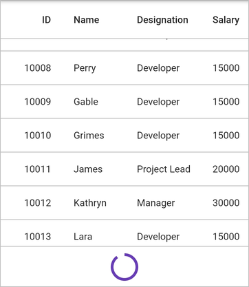
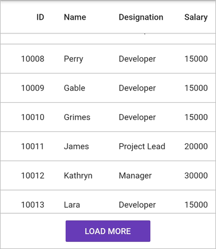

# Load more

The datagrid provides load more support to load a subset of data to the [DataGridSource](https://pub.dev/documentation/syncfusion_flutter_datagrid/latest/datagrid/DataGridSource-class.html) at runtime. You can load more rows to the datagrid by calling the `SfDataGrid.loadMoreViewBuilder` builder. When `SfDataGrid.loadMoreViewBuilder` builder is enabled, that sets the widget to display at the bottom of the datagrid when vertical scrolling reaches the end of the datagrid.

You should override the `DataGridSource.handleLoadMoreRows` method to load more rows and then notify the datagrid about the changes. The `DataGridSource.handleLoadMoreRows` can be called to load more rows from this builder by using the `loadMoreRows` function which is passed as a parameter to this builder.

## Infinite scrolling

Infinite Scrolling is an approach that can be used to load more rows to the datagrid whenever the datagrid reaches the bottom without user interaction.

The following example demonstrates infinite scrolling by showing the circular progress indicator until the rows are loaded when the datagrid reaches the bottom,


 

import 'package:syncfusion_flutter_datagrid/datagrid.dart';

@override
Widget build(BuildContext context) {
  return SfDataGrid(
    source: employeeDataSource,
    loadMoreViewBuilder: (BuildContext context, LoadMoreRows loadMoreRows) {
      Future<String> loadRows() async {
        await loadMoreRows();
        return Future<String>.value('Completed');
      }

      return FutureBuilder<String>(
        initialData: 'loading',
        future: loadRows(),
        builder: (context, snapShot) {
          if (snapShot.data == 'loading') {
            return Container(
                height: 60.0,
                width: double.infinity,
                decoration: BoxDecoration(
                    color: Colors.white,
                    border: BorderDirectional(
                        top: BorderSide(
                            width: 1.0,
                            color: Color.fromRGBO(0, 0, 0, 0.26)))),
                alignment: Alignment.center,
                child: CircularProgressIndicator(
                    valueColor: AlwaysStoppedAnimation(Colors.deepPurple)));
          } else {
            return SizedBox.fromSize(size: Size.zero);
          }
        },
      );
    },
    columns: <GridColumn>[
      GridNumericColumn(mappingName: 'id', headerText: 'ID'),
      GridTextColumn(mappingName: 'name', headerText: 'Name'),
      GridTextColumn(mappingName: 'designation', headerText: 'Designation'),
      GridNumericColumn(mappingName: 'salary', headerText: 'Salary'),
    ],
  );
}




## Load more button

Load more button is an approach that can be used to load more rows to the datagrid by tapping a button that you load from the `SfDataGrid.loadMoreViewBuilder` builder. The button will be loaded when vertical scrolling is reached at the end of the datagrid.

The following example demonstrates how to show the button when vertical scrolling is reached at the end of the datagrid and display the circular indicator until the rows are loaded when you tap that button. In the onPressed flatbutton callback, you can call the `loadMoreRows` function to add more rows,


 

import 'package:syncfusion_flutter_datagrid/datagrid.dart';

@override
Widget build(BuildContext context) {
  return SfDataGrid(
    source: employeeDataSource,
    loadMoreViewBuilder: (BuildContext context, LoadMoreRows loadMoreRows) {
      bool showIndicator = false;
      return StatefulBuilder(
          builder: (BuildContext context, StateSetter setState) {
        if (showIndicator) {
          return Container(
              height: 60.0,
              width: double.infinity,
              alignment: Alignment.center,
              decoration: BoxDecoration(
                  color: Colors.white,
                  border: BorderDirectional(
                      top: BorderSide(
                          width: 1.0, color: Color.fromRGBO(0, 0, 0, 0.26)))),
              child: CircularProgressIndicator(
                  valueColor: AlwaysStoppedAnimation(Colors.deepPurple)));
        } else {
          return Container(
            height: 60.0,
            width: double.infinity,
            alignment: Alignment.center,
            decoration: BoxDecoration(
                color: Colors.white,
                border: BorderDirectional(
                    top: BorderSide(
                        width: 1.0, color: Color.fromRGBO(0, 0, 0, 0.26)))),
            child: Container(
              height: 36.0,
              width: 142.0,
              child: FlatButton(
                color: Colors.deepPurple,
                child:
                    Text('LOAD MORE', style: TextStyle(color: Colors.white)),
                onPressed: () async {
                  if (context is StatefulElement &&
                      context.state != null &&
                      context.state.mounted) {
                    setState(() {
                      showIndicator = true;
                    });
                  }
                  await loadMoreRows();
                  if (context is StatefulElement &&
                      context.state != null &&
                      context.state.mounted) {
                    setState(() {
                      showIndicator = false;
                    });
                  }
                },
              ),
            ),
          );
        }
      });
    },
    columns: <GridColumn>[
      GridNumericColumn(mappingName: 'id', headerText: 'ID'),
      GridTextColumn(mappingName: 'name', headerText: 'Name'),
      GridTextColumn(mappingName: 'designation', headerText: 'Designation'),
      GridNumericColumn(mappingName: 'salary', headerText: 'Salary'),
    ],
  );
}




