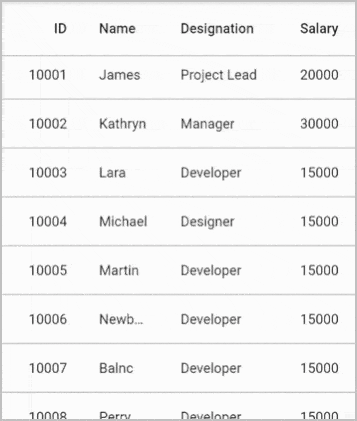
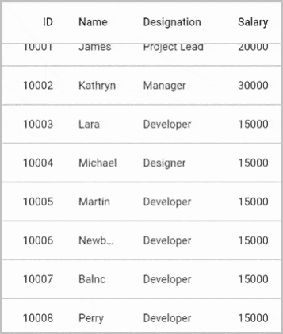

# Load more in Flutter DataGrid (SfDataGrid)

The SfDataGrid widget provides support to display an interactive view when the grid reaches its maximum offset while scrolling down. You can use the [loadMoreViewBuilder](https://pub.dev/documentation/syncfusion_flutter_datagrid/latest/datagrid/SfDataGrid/loadMoreViewBuilder.html) property to display a custom view at the bottom of the grid. 

To implement load more functionality, override the [DataGridSource.handleLoadMoreRows](https://pub.dev/documentation/syncfusion_flutter_datagrid/latest/datagrid/DataGridSource/handleLoadMoreRows.html) method to load additional rows and notify the grid about the changes. The `handleLoadMoreRows` method is automatically called when the user scrolls to the bottom of the grid. Use the [LoadMoreRows](https://pub.dev/documentation/syncfusion_flutter_datagrid/latest/datagrid/LoadMoreRows.html) function, passed as a parameter to `loadMoreViewBuilder`, to trigger row loading.

## Infinite scrolling

Infinite scrolling automatically loads more rows as the user scrolls to the bottom of the grid, creating a seamless continuous data experience. This approach is ideal when you have a large dataset and want to load data progressively without user interaction.

The following example demonstrates infinite scrolling by displaying a circular progress indicator while rows are being loaded:


 

import 'package:flutter/material.dart';
import 'package:syncfusion_flutter_datagrid/datagrid.dart';
import 'dart:math';

class Employee {
  Employee(this.id, this.name, this.designation, this.salary);

  final int id;
  final String name;
  final String designation;
  final int salary;
}

class MyHomePageState extends State<MyHomePage> {
  List<Employee> _employees = <Employee>[];
  late EmployeeDataSource _employeeDataSource;

  @override
  void initState() {
    super.initState();
    _employees = getEmployeeData();
    _employeeDataSource = EmployeeDataSource(employeeData: _employees);
  }

  @override
  Widget build(BuildContext context) {
    return Scaffold(
      body: SfDataGrid(
        source: _employeeDataSource,
        loadMoreViewBuilder: (BuildContext context, LoadMoreRows loadMoreRows) {
          Future<String> loadRows() async {
            // Call the loadMoreRows function to call the
            // DataGridSource.handleLoadMoreRows method. So, additional
            // rows can be added from handleLoadMoreRows method.
            await loadMoreRows();
            return Future<String>.value('Completed');
          }

          return FutureBuilder<String>(
            initialData: 'loading',
            future: loadRows(),
            builder: (context, snapShot) {
              if (snapShot.data == 'loading') {
                return Container(
                  height: 60.0,
                  width: double.infinity,
                  decoration: BoxDecoration(
                    color: Colors.white,
                    border: BorderDirectional(
                      top: BorderSide(
                        width: 1.0,
                        color: Color.fromRGBO(0, 0, 0, 0.26),
                      ),
                    ),
                  ),
                  alignment: Alignment.center,
                  child: CircularProgressIndicator(
                    valueColor: AlwaysStoppedAnimation(Colors.deepPurple),
                  ),
                );
              } else {
                return SizedBox.fromSize(size: Size.zero);
              }
            },
          );
        },
        columns: <GridColumn>[
          GridColumn(
            columnName: 'id',
            label: Container(
              padding: EdgeInsets.symmetric(horizontal: 16.0),
              alignment: Alignment.centerRight,
              child: Text('ID', overflow: TextOverflow.ellipsis),
            ),
          ),
          GridColumn(
            columnName: 'name',
            label: Container(
              padding: EdgeInsets.symmetric(horizontal: 16.0),
              alignment: Alignment.centerLeft,
              child: Text('Name', overflow: TextOverflow.ellipsis),
            ),
          ),
          GridColumn(
            columnName: 'designation',
            label: Container(
              padding: EdgeInsets.symmetric(horizontal: 16.0),
              alignment: Alignment.centerLeft,
              child: Text('Designation', overflow: TextOverflow.ellipsis),
            ),
          ),
          GridColumn(
            columnName: 'salary',
            label: Container(
              padding: EdgeInsets.symmetric(horizontal: 16.0),
              alignment: Alignment.centerRight,
              child: Text('Salary', overflow: TextOverflow.ellipsis),
            ),
          ),
        ],
      ),
    );
  }
}

List<Employee> getEmployeeData() {
  return [
    Employee(10001, 'James', 'Project Lead', 20000),
    Employee(10002, 'Kathryn', 'Manager', 30000),
    Employee(10003, 'Lara', 'Developer', 15000),
    Employee(10004, 'Michael', 'Designer', 15000),
    Employee(10005, 'Martin', 'Developer', 15000),
    Employee(10006, 'Newberry', 'Developer', 15000),
    Employee(10007, 'Balnc', 'Developer', 15000),
    Employee(10008, 'Perry', 'Developer', 15000),
    Employee(10009, 'Gable', 'Developer', 15000),
    Employee(10010, 'Grimes', 'Developer', 15000),
  ];
}

class EmployeeDataSource extends DataGridSource {
  static final List<Employee> _employees = <Employee>[];

  EmployeeDataSource({required List<Employee> employeeData}) {
    _employees.addAll(employeeData);
    buildDataGridRows();
  }

  List<DataGridRow> dataGridRows = [];

  @override
  List<DataGridRow> get rows => dataGridRows;

  @override
  DataGridRowAdapter? buildRow(DataGridRow row) {
    return DataGridRowAdapter(
      cells: row.getCells().map<Widget>((dataGridCell) {
        return Container(
          alignment:
              (dataGridCell.columnName == 'id' ||
                  dataGridCell.columnName == 'salary')
              ? Alignment.centerRight
              : Alignment.centerLeft,
          padding: const EdgeInsets.symmetric(horizontal: 16.0),
          child: Text(
            dataGridCell.value.toString(),
            overflow: TextOverflow.ellipsis,
          ),
        );
      }).toList(),
    );
  }

  @override
  Future<void> handleLoadMoreRows() async {
    // Simulate network delay for loading data
    await Future.delayed(const Duration(seconds: 2));
    _addMoreRows(_employees, 15);
    buildDataGridRows();
    notifyListeners();
  }

  void buildDataGridRows() {
    dataGridRows = _employees
        .map<DataGridRow>(
          (dataGridRow) => DataGridRow(
            cells: [
              DataGridCell<int>(columnName: 'id', value: dataGridRow.id),
              DataGridCell<String>(columnName: 'name', value: dataGridRow.name),
              DataGridCell<String>(
                columnName: 'designation',
                value: dataGridRow.designation,
              ),
              DataGridCell<int>(
                columnName: 'salary',
                value: dataGridRow.salary,
              ),
            ],
          ),
        )
        .toList();
  }

  void _addMoreRows(List<Employee> employees, int count) {
    final Random random = Random();
    final startIndex = employees.isNotEmpty ? employees.length : 0,
        endIndex = startIndex + count;
    for (int i = startIndex; i < endIndex; i++) {
      employees.add(
        Employee(
          1000 + i,
          _names[random.nextInt(_names.length)],
          _designation[random.nextInt(_designation.length)],
          10000 + random.nextInt(10000),
        ),
      );
    }
  }

  final List<String> _names = <String>[
    'Welli',
    'Blonp',
    'Folko',
    'Furip',
    'Folig',
    'Picco',
    'Frans',
    'Warth',
    'Linod',
    'Simop',
    'Merep',
    'Riscu',
    'Seves',
    'Vaffe',
    'Alfki',
  ];

  final List<String> _designation = <String>[
    'Project Lead',
    'Developer',
    'Manager',
    'Designer',
    'System Analyst',
    'CEO',
  ];
}




> **Note:** Download the demo application from [GitHub](https://github.com/SyncfusionExamples/how-to-do-the-infinite-scrolling-in-syncfusion-flutter-datatable).



## Load more button

You can display a load more button that the user can tap to load additional rows on demand. This approach gives users explicit control over data loading rather than automatic loading as with infinite scrolling.

The following example demonstrates how to display a button when vertical scrolling reaches the end of the grid, show a loading indicator while rows are being fetched, and load more rows when the button is tapped by calling the `loadMoreRows` function:


 

import 'package:flutter/material.dart';
import 'package:syncfusion_flutter_datagrid/datagrid.dart';
import 'dart:math';

class Employee {
  Employee(this.id, this.name, this.designation, this.salary);

  final int id;
  final String name;
  final String designation;
  final int salary;
}

class MyHomePageState extends State<MyHomePage> {
  List<Employee> _employees = <Employee>[];
  late EmployeeDataSource _employeeDataSource;

  @override
  void initState() {
    super.initState();
    _employees = getEmployeeData();
    _employeeDataSource = EmployeeDataSource(employeeData: _employees);
  }

  @override
  Widget build(BuildContext context) {
    return Scaffold(
      body: SfDataGrid(
        source: _employeeDataSource,
        loadMoreViewBuilder: (BuildContext context, LoadMoreRows loadMoreRows) {
          bool showIndicator = false;
          return StatefulBuilder(
            builder: (BuildContext context, StateSetter setState) {
              if (showIndicator) {
                return Container(
                  height: 60.0,
                  width: double.infinity,
                  alignment: Alignment.center,
                  decoration: BoxDecoration(
                    color: Colors.white,
                    border: const BorderDirectional(
                      top: BorderSide(
                        width: 1.0,
                        color: Color.fromRGBO(0, 0, 0, 0.26),
                      ),
                    ),
                  ),
                  child: const CircularProgressIndicator(
                    valueColor: AlwaysStoppedAnimation(Colors.deepPurple),
                  ),
                );
              } else {
                return Container(
                  height: 60.0,
                  width: double.infinity,
                  alignment: Alignment.center,
                  decoration: BoxDecoration(
                    color: Colors.white,
                    border: const BorderDirectional(
                      top: BorderSide(
                        width: 1.0,
                        color: Color.fromRGBO(0, 0, 0, 0.26),
                      ),
                    ),
                  ),
                  child: SizedBox(
                    height: 36.0,
                    width: 142.0,
                    child: TextButton(
                      style: ButtonStyle(
                        backgroundColor: WidgetStateProperty.all(Colors.purple),
                      ),
                      child: const Text(
                        'LOAD MORE',
                        style: TextStyle(color: Colors.white),
                      ),
                      onPressed: () async {
                        // Check if the widget is still mounted to avoid
                        // "setState() called after dispose()" errors
                        if (context is StatefulElement &&
                            context.state.mounted) {
                          setState(() {
                            showIndicator = true;
                          });
                        }
                        // Call the loadMoreRows function to trigger
                        // DataGridSource.handleLoadMoreRows method
                        await loadMoreRows();
                        // Reset the indicator state when loading completes
                        if (context is StatefulElement &&
                            context.state.mounted) {
                          setState(() {
                            showIndicator = false;
                          });
                        }
                      },
                    ),
                  ),
                );
              }
            },
          );
        },
        columns: <GridColumn>[
          GridColumn(
            columnName: 'id',
            label: Container(
              padding: EdgeInsets.symmetric(horizontal: 16.0),
              alignment: Alignment.centerRight,
              child: Text('ID', overflow: TextOverflow.ellipsis),
            ),
          ),
          GridColumn(
            columnName: 'name',
            label: Container(
              padding: EdgeInsets.symmetric(horizontal: 16.0),
              alignment: Alignment.centerLeft,
              child: Text('Name', overflow: TextOverflow.ellipsis),
            ),
          ),
          GridColumn(
            columnName: 'designation',
            label: Container(
              padding: EdgeInsets.symmetric(horizontal: 16.0),
              alignment: Alignment.centerLeft,
              child: Text('Designation', overflow: TextOverflow.ellipsis),
            ),
          ),
          GridColumn(
            columnName: 'salary',
            label: Container(
              padding: EdgeInsets.symmetric(horizontal: 16.0),
              alignment: Alignment.centerRight,
              child: Text('Salary', overflow: TextOverflow.ellipsis),
            ),
          ),
        ],
      ),
    );
  }
}

List<Employee> getEmployeeData() {
  return [
    Employee(10001, 'James', 'Project Lead', 20000),
    Employee(10002, 'Kathryn', 'Manager', 30000),
    Employee(10003, 'Lara', 'Developer', 15000),
    Employee(10004, 'Michael', 'Designer', 15000),
    Employee(10005, 'Martin', 'Developer', 15000),
    Employee(10006, 'Newberry', 'Developer', 15000),
    Employee(10007, 'Balnc', 'Developer', 15000),
    Employee(10008, 'Perry', 'Developer', 15000),
    Employee(10009, 'Gable', 'Developer', 15000),
    Employee(10010, 'Grimes', 'Developer', 15000),
  ];
}

class EmployeeDataSource extends DataGridSource {
  static final List<Employee> _employees = <Employee>[];

  EmployeeDataSource({required List<Employee> employeeData}) {
    _employees.addAll(employeeData);
    buildDataGridRows();
  }

  List<DataGridRow> dataGridRows = [];

  @override
  List<DataGridRow> get rows => dataGridRows;

  @override
  DataGridRowAdapter? buildRow(DataGridRow row) {
    return DataGridRowAdapter(
      cells: row.getCells().map<Widget>((dataGridCell) {
        return Container(
          alignment:
              (dataGridCell.columnName == 'id' ||
                  dataGridCell.columnName == 'salary')
              ? Alignment.centerRight
              : Alignment.centerLeft,
          padding: const EdgeInsets.symmetric(horizontal: 16.0),
          child: Text(
            dataGridCell.value.toString(),
            overflow: TextOverflow.ellipsis,
          ),
        );
      }).toList(),
    );
  }

  @override
  Future<void> handleLoadMoreRows() async {
    // Simulate network delay for loading data
    await Future.delayed(const Duration(seconds: 2));
    _addMoreRows(_employees, 15);
    buildDataGridRows();
    notifyListeners();
  }

  void buildDataGridRows() {
    dataGridRows = _employees
        .map<DataGridRow>(
          (dataGridRow) => DataGridRow(
            cells: [
              DataGridCell<int>(columnName: 'id', value: dataGridRow.id),
              DataGridCell<String>(columnName: 'name', value: dataGridRow.name),
              DataGridCell<String>(
                columnName: 'designation',
                value: dataGridRow.designation,
              ),
              DataGridCell<int>(
                columnName: 'salary',
                value: dataGridRow.salary,
              ),
            ],
          ),
        )
        .toList();
  }

  void _addMoreRows(List<Employee> employees, int count) {
    final Random random = Random();
    final startIndex = employees.isNotEmpty ? employees.length : 0,
        endIndex = startIndex + count;
    for (int i = startIndex; i < endIndex; i++) {
      employees.add(
        Employee(
          1000 + i,
          _names[random.nextInt(_names.length)],
          _designation[random.nextInt(_designation.length)],
          10000 + random.nextInt(10000),
        ),
      );
    }
  }

  final List<String> _names = <String>[
    'Welli',
    'Blonp',
    'Folko',
    'Furip',
    'Folig',
    'Picco',
    'Frans',
    'Warth',
    'Linod',
    'Simop',
    'Merep',
    'Riscu',
    'Seves',
    'Vaffe',
    'Alfki',
  ];

  final List<String> _designation = <String>[
    'Project Lead',
    'Developer',
    'Manager',
    'Designer',
    'System Analyst',
    'CEO',
  ];
}




> **Note:** Download the demo application from [GitHub](https://github.com/SyncfusionExamples/how-to-load-rows-on-demand-in-Syncfusion-Flutter-datatable).



## Choosing between infinite scrolling and button approach

- **Infinite scrolling**: Best for continuous data browsing experiences where users don't need explicit control. Data loads automatically when they reach the bottom, creating a seamless experience.
- **Load more button**: Best when you want to give users explicit control over when data loads, or when automatic loading might consume excessive network bandwidth.

## Best practices

- **Batch size**: Load rows in reasonable batches (e.g., 10-20 rows) to balance performance and user experience.
- **Loading state**: Always provide visual feedback while loading to indicate that data is being fetched.
- **Handling completion**: When all data is loaded, modify your data source to stop triggering load operations. You can implement a flag to track this:

  ```dart
  @override
  Future<void> handleLoadMoreRows() async {
    if (_hasMoreData) {
      // Load rows
      _hasMoreData = _employees.length < _totalRecords;
    }
  }
  ```

- **Error handling**: Implement proper error handling in your load more logic to gracefully handle network failures and retry options.
