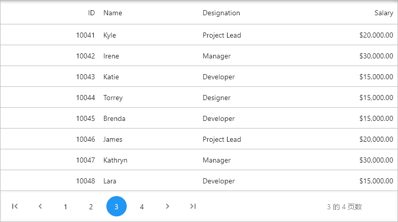

# Localization in Flutter DataPager (SfDataPager)

By default, the `SfDataPager` widget supports US English localizations. You can change the other languages by specifying the `MaterialApp` properties and adding the `flutter_localizations` package to your application.

As of February 2020, [flutter package](https://flutter.dev/docs/development/accessibility-and-localization/internationalization) supports 77 languages.

To use `flutter_localizations`, add the package as dependency to `pubspec.yaml` file.



dependencies:
flutter_localizations:
  sdk: flutter



Next, import the `flutter_localizations` library and specify `localizationsDelegates` and `supportedLocales` for `MaterialApp`.




import 'package:flutter_localizations/flutter_localizations.dart';

@override
Widget build(BuildContext context) {
  return MaterialApp(
    localizationsDelegates: [
      GlobalMaterialLocalizations.delegate,
      GlobalWidgetsLocalizations.delegate,
    ],
    supportedLocales: [
      const Locale('zh'),
      const Locale('ar'),
      const Locale('ja'),
    ],
    locale: const Locale('zh'),
    home: Scaffold(
      appBar: AppBar(
        title: Text('DataPager'),
      ),
      body: LayoutBuilder(
        builder: (context, constraints) {
          return Column(
            children: [
              SizedBox(
                  height: constraints.maxHeight - 60,
                  width: constraints.maxWidth,
                  child: SfDataGrid(
                      source: _employeeDataSource,
                      columns: <GridColumn>[
                        GridNumericColumn(mappingName: 'id', headerText: 'ID'),
                        GridTextColumn(mappingName: 'name', headerText: 'Name'),
                        GridTextColumn(
                            mappingName: 'designation',
                            headerText: 'Designation'),
                        GridNumericColumn(
                            mappingName: 'salary', headerText: 'Salary')
                      ])),
              Container(
                height: 60,
                width: constraints.maxWidth,
                child: SfDataPager(
                  delegate: _employeeDataSource,
                  rowsPerPage: 20,
                  visibleItemsCount: 5,
                  direction: Axis.horizontal,
                ),
              )
            ],
          );
        },
      ),
    ),
  );
}




## Localize the static string in DataPager

Static strings in the datapager can be localized using the `syncfusion_localizations` package and specifying `localizationsDelegates` in `MaterialApp`.

To use `syncfusion_localizations`, add the package as dependency to `pubspec.yaml` file.



dependencies:
syncfusion_localizations: ^18.3.35



Next, import the `syncfusion_localizations` library.



import 'package:syncfusion_localizations/syncfusion_localizations.dart';



Then, declare the `SfGlobalLocalizations.delegate` in the `localizationsDelegates`, which is used to localize the static string available in datapager and specify the `supportedLocales` as well.




@override
Widget build(BuildContext context) {
  return MaterialApp(
    localizationsDelegates: [
      GlobalMaterialLocalizations.delegate,
      GlobalWidgetsLocalizations.delegate,
      SfGlobalLocalizations.delegate
    ],
    supportedLocales: [
      const Locale('zh'),
      const Locale('ar'),
      const Locale('ja'),
    ],
    locale: const Locale('zh'),
    home: Scaffold(
      appBar: AppBar(
        title: Text('DataPager'),
      ),
      body: LayoutBuilder(
        builder: (context, constraints) {
          return Column(
            children: [
              SizedBox(
                  height: constraints.maxHeight - 60,
                  width: constraints.maxWidth,
                  child: SfDataGrid(
                      source: _employeeDataSource,
                      columns: <GridColumn>[
                        GridNumericColumn(mappingName: 'id', headerText: 'ID'),
                        GridTextColumn(mappingName: 'name', headerText: 'Name'),
                        GridTextColumn(
                            mappingName: 'designation',
                            headerText: 'Designation'),
                        GridNumericColumn(
                            mappingName: 'salary', headerText: 'Salary')
                      ])),
              Container(
                height: 60,
                width: constraints.maxWidth,
                child: SfDataPager(
                  delegate: _employeeDataSource,
                  rowsPerPage: 20,
                  visibleItemsCount: 5,
                  direction: Axis.horizontal,
                ),
              )
            ],
          );
        },
      ),
    ),
  );
}




