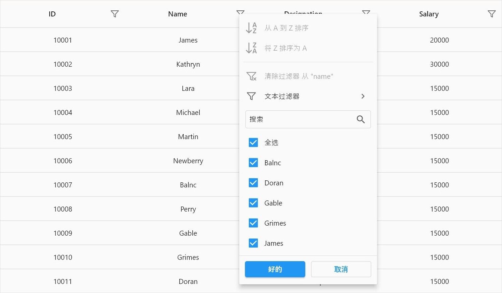
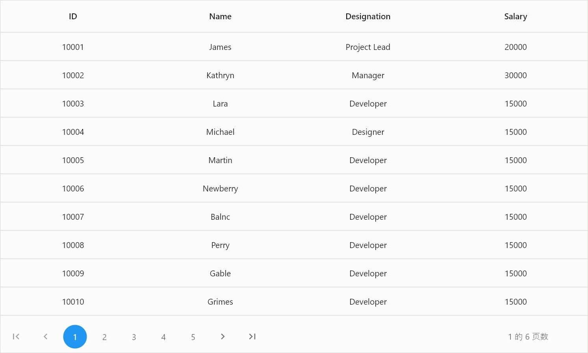

# Localization in Flutter DataGrid and DataPager

## Localization in Flutter DataGrid (SfDataGrid)

### Localization in filter pop-up menu
By default, the [SfDataGrid](https://pub.dev/documentation/syncfusion_flutter_datagrid/latest/datagrid/SfDataGrid-class.html) filter popup menu supports US English localizations. You can change the other languages by specifying the `MaterialApp` properties and adding the `flutter_localizations` and [syncfusion_localizations](https://pub.dev/packages/syncfusion_localizations) package to your application.

The following locales are supported: Chinese (zh), Arabic (ar), Japanese (ja), Hindi (hi), French (fr), German (de), Spanish (es), Portuguese (pt), Russian (ru), and more. If a locale is not specified in `supportedLocales`, the app defaults to the first supported locale.

To use `flutter_localizations` and `syncfusion_localizations`, add the package as a dependency to the `pubspec.yaml` file.



dependencies:
flutter_localizations:
  sdk: flutter
syncfusion_localizations: ^34.1.29



> **Note:** Run `flutter pub get` to fetch the newly added dependencies.

Next, import the `flutter_localizations` and `syncfusion_localizations` library.



import 'package:flutter_localizations/flutter_localizations.dart';
import 'package:syncfusion_localizations/syncfusion_localizations.dart';



Then, declare the [SfGlobalLocalizations.delegate](https://pub.dev/documentation/syncfusion_localizations/latest/syncfusion_localizations/SfGlobalLocalizations/delegate-constant.html) in the `localizationsDelegates,` which is used to localize the static strings available in the filter popup and specify the `supportedLocales` as well.




  @override
  Widget build(BuildContext context) {
    return MaterialApp(
      localizationsDelegates: const [
        GlobalMaterialLocalizations.delegate,
        GlobalWidgetsLocalizations.delegate,
        SfGlobalLocalizations.delegate,
      ],
      supportedLocales: const [Locale('zh'), Locale('ar'), Locale('ja')],
      locale: const Locale('ar'),
      home: Scaffold(
        appBar: AppBar(
          elevation: 0,
          title: const Text('Syncfusion Flutter DataGrid'),
        ),
        body: SfDataGrid(
          source: _employeeDataSource,
          columnWidthMode: ColumnWidthMode.fill,
          gridLinesVisibility: GridLinesVisibility.both,
          headerGridLinesVisibility: GridLinesVisibility.both,
          allowFiltering: true,
          columns: <GridColumn>[
            GridColumn(
              columnName: 'id',
              label: Container(
                padding: const EdgeInsets.all(16.0),
                alignment: Alignment.center,
                child: const Text('ID'),
              ),
            ),
            GridColumn(
              columnName: 'name',
              label: Container(
                padding: const EdgeInsets.all(8.0),
                alignment: Alignment.center,
                child: const Text('Name'),
              ),
            ),
            GridColumn(
              columnName: 'designation',
              label: Container(
                padding: const EdgeInsets.all(8.0),
                alignment: Alignment.center,
                child: const Text(
                  'Designation',
                  overflow: TextOverflow.ellipsis,
                ),
              ),
            ),
            GridColumn(
              columnName: 'salary',
              label: Container(
                padding: const EdgeInsets.all(8.0),
                alignment: Alignment.center,
                child: const Text('Salary'),
              ),
            ),
          ],
        ),
      ),
    );
  }




> **Note:** After adding the packages, hot reload or restart your app to apply the localization changes.

## Localization in Flutter DataPager (SfDataPager)

By default, the [SfDataPager](https://pub.dev/documentation/syncfusion_flutter_datagrid/latest/datagrid/SfDataPager-class.html) widget supports US English localizations. You can change the language by specifying the `MaterialApp` properties and adding the necessary localization packages to your application.

The [SfDataPager](https://pub.dev/documentation/syncfusion_flutter_datagrid/latest/datagrid/SfDataPager-class.html) supports two localization scenarios:

1. **Basic localization (UI labels)** - Using `flutter_localizations`
2. **Complete localization (static strings)** - Using both `flutter_localizations` and `syncfusion_localizations`

### Basic DataPager Localization

To localize the basic UI elements, add `flutter_localizations` to your `pubspec.yaml` file:



dependencies:
flutter_localizations:
  sdk: flutter



> **Note:** Run `flutter pub get` to fetch the newly added dependency.

Next, import the `flutter_localizations` library and specify [localizationsDelegates](https://api.flutter.dev/flutter/widgets/LocalizationsDelegate-class.html) and `supportedLocales` for `MaterialApp`:




import 'package:flutter_localizations/flutter_localizations.dart';

  List<Employee> _employees = <Employee>[];
  late EmployeeDataSource _employeeDataSource;
  final int rowsPerPage = 15;

  @override
  void initState() {
    super.initState();
    _employees = getEmployeeData();
    _employeeDataSource = EmployeeDataSource(employeeData: _employees);
  }

  @override
  Widget build(BuildContext context) {
    return MaterialApp(
      localizationsDelegates: const [
        GlobalMaterialLocalizations.delegate,
        GlobalWidgetsLocalizations.delegate,
      ],
      supportedLocales: const [Locale('zh'), Locale('ar'), Locale('ja')],
      locale: const Locale('ar'),
      home: Scaffold(
        appBar: AppBar(title: const Text('DataPager')),
        body: LayoutBuilder(
          builder: (context, constraints) {
            return Column(
              children: [
                SizedBox(
                  height: constraints.maxHeight - 60,
                  width: constraints.maxWidth,
                  child: SfDataGrid(
                    source: _employeeDataSource,
                    allowFiltering: true,
                    columns: <GridColumn>[
                      GridColumn(
                        columnName: 'id',
                        label: Center(child: Text('ID')),
                      ),
                      GridColumn(
                        columnName: 'name',
                        label: Center(child: Text('Name')),
                      ),
                      GridColumn(
                        columnName: 'designation',
                        label: Center(child: Text('Designation')),
                      ),
                      GridColumn(
                        columnName: 'salary',
                        label: Center(child: Text('Salary')),
                      ),
                    ],
                  ),
                ),
                SizedBox(
                  height: 60,
                  width: constraints.maxWidth,
                  child: SfDataPager(
                    delegate: _employeeDataSource,
                    pageCount: _employeeDataSource.rows.length / rowsPerPage,
                    visibleItemsCount: 5,
                    direction: Axis.horizontal,
                  ),
                ),
              ],
            );
          },
        ),
      ),
    );
  }

class EmployeeDataSource extends DataGridSource {
  EmployeeDataSource({required List<Employee> employeeData}) {
    _employeeData = employeeData;
  }

  late List<Employee> _employeeData;

  @override
  List<DataGridRow> get rows => _employeeData
      .map<DataGridRow>(
        (dataRow) => DataGridRow(
          cells: [
            DataGridCell<int>(columnName: 'id', value: dataRow.id),
            DataGridCell<String>(columnName: 'name', value: dataRow.name),
            DataGridCell<String>(
              columnName: 'designation',
              value: dataRow.designation,
            ),
            DataGridCell<int>(columnName: 'salary', value: dataRow.salary),
          ],
        ),
      )
      .toList();

  @override
  DataGridRowAdapter? buildRow(DataGridRow row) {
    return DataGridRowAdapter(
      cells: row.getCells().map<Widget>((dataCell) {
        return Container(
          alignment: Alignment.center,
          padding: const EdgeInsets.all(8.0),
          child: Text(dataCell.value.toString()),
        );
      }).toList(),
    );
  }
}




> **Note:** After adding the packages, hot reload or restart your app to apply the localization changes.

### Localize Static Strings in DataPager

Static strings in the [SfDataPager](https://pub.dev/documentation/syncfusion_flutter_datagrid/latest/datagrid/SfDataPager-class.html) (such as pagination labels and navigation text) can be localized using the [syncfusion_localizations](https://pub.dev/packages/syncfusion_localizations) package.

To use `syncfusion_localizations`, add it as a dependency to the `pubspec.yaml` file:



dependencies:
flutter_localizations:
  sdk: flutter
syncfusion_localizations: ^34.1.29



> **Note:** Run `flutter pub get` to fetch the newly added dependencies.

Next, import both `flutter_localizations` and `syncfusion_localizations` libraries:



import 'package:flutter_localizations/flutter_localizations.dart';
import 'package:syncfusion_localizations/syncfusion_localizations.dart';



Then, declare the [SfGlobalLocalizations.delegate](https://pub.dev/documentation/syncfusion_localizations/latest/syncfusion_localizations/SfGlobalLocalizations/delegate-constant.html) in the `localizationsDelegates,` which is used to localize the static strings available in the DataPager and specify the `supportedLocales` as well:




final int rowsPerPage = 15;

class Employee {
  Employee(this.id, this.name, this.designation, this.salary);

  final int id;
  final String name;
  final String designation;
  final int salary;
}

  @override
  Widget build(BuildContext context) {
    return MaterialApp(
      localizationsDelegates: const [
        GlobalMaterialLocalizations.delegate,
        GlobalWidgetsLocalizations.delegate,
        SfGlobalLocalizations.delegate,
      ],
      supportedLocales: const [Locale('zh'), Locale('ar'), Locale('ja')],
      locale: const Locale('zh'),
      home: Scaffold(
        appBar: AppBar(title: const Text('DataPager')),
        body: LayoutBuilder(
          builder: (context, constraints) {
            return Column(
              children: [
                SizedBox(
                  height: constraints.maxHeight - 60,
                  width: constraints.maxWidth,
                  child: SfDataGrid(
                    source: _employeeDataSource,
                    columns: <GridColumn>[
                      GridColumn(
                        columnName: 'id',
                        label: Center(child: Text('ID')),
                      ),
                      GridColumn(
                        columnName: 'name',
                        label: Center(child: Text('Name')),
                      ),
                      GridColumn(
                        columnName: 'designation',
                        label: Center(child: Text('Designation')),
                      ),
                      GridColumn(
                        columnName: 'salary',
                        label: Center(child: Text('Salary')),
                      ),
                    ],
                  ),
                ),
                SizedBox(
                  height: 60,
                  width: constraints.maxWidth,
                  child: SfDataPager(
                    delegate: _employeeDataSource,
                    pageCount: _employeeDataSource.rows.length / rowsPerPage,
                    visibleItemsCount: 5,
                    direction: Axis.horizontal,
                  ),
                ),
              ],
            );
          },
        ),
      ),
    );
  }

class EmployeeDataSource extends DataGridSource {
  EmployeeDataSource({required List<Employee> employeeData}) {
    _employeeData = employeeData;
  }

  late List<Employee> _employeeData;

  @override
  List<DataGridRow> get rows => _employeeData
      .map<DataGridRow>(
        (dataRow) => DataGridRow(
          cells: [
            DataGridCell<int>(columnName: 'id', value: dataRow.id),
            DataGridCell<String>(columnName: 'name', value: dataRow.name),
            DataGridCell<String>(
              columnName: 'designation',
              value: dataRow.designation,
            ),
            DataGridCell<int>(columnName: 'salary', value: dataRow.salary),
          ],
        ),
      )
      .toList();

  @override
  DataGridRowAdapter? buildRow(DataGridRow row) {
    return DataGridRowAdapter(
      cells: row.getCells().map<Widget>((dataCell) {
        return Container(
          alignment: Alignment.center,
          padding: const EdgeInsets.all(8.0),
          child: Text(dataCell.value.toString()),
        );
      }).toList(),
    );
  }
}




> **Note:** After adding the packages, hot reload or restart your app to apply the localization changes. Supported locales include Chinese (zh), Arabic (ar), Japanese (ja), Hindi (hi), French (fr), German (de), Spanish (es), Portuguese (pt), Russian (ru), and more. See [SfGlobalLocalizations](https://pub.dev/documentation/syncfusion_localizations/latest/syncfusion_localizations/SfGlobalLocalizations-class.html) for the complete list.

## See also

* [SfDataGrid API Documentation](https://pub.dev/documentation/syncfusion_flutter_datagrid/latest/datagrid/SfDataGrid-class.html)
* [SfDataPager API Documentation](https://pub.dev/documentation/syncfusion_flutter_datagrid/latest/datagrid/SfDataPager-class.html)
* [Syncfusion Localizations Package](https://pub.dev/packages/syncfusion_localizations)
* [Flutter Localizations Documentation](https://api.flutter.dev/flutter/widgets/LocalizationsDelegate-class.html)
