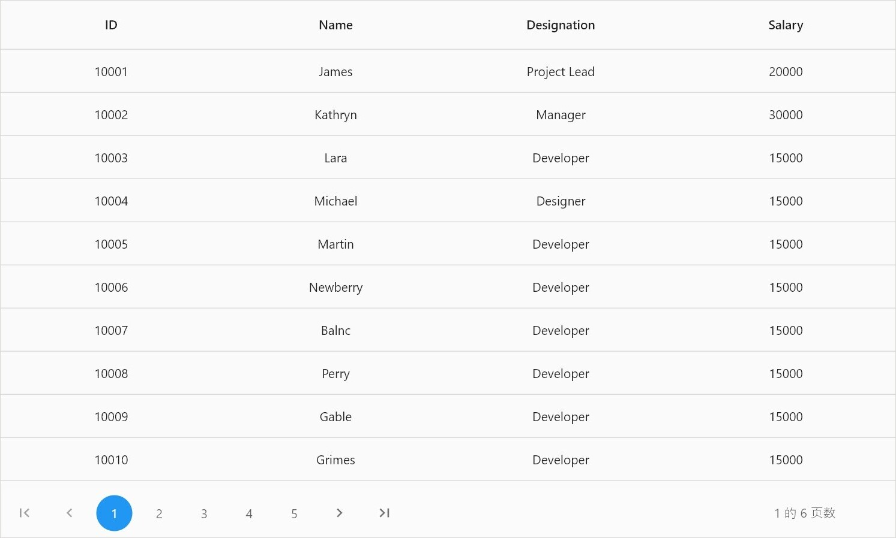

# Localization in Flutter DataGrid and DataPager

## Localization in Flutter DataGrid (SfDataGrid)

### Localization in filter pop-up menu
By default, the [SfDataGrid](https://pub.dev/documentation/syncfusion_flutter_datagrid/latest/datagrid/SfDataGrid-class.html) filter popup menu supports US English localizations. You can change the other languages by specifying the `MaterialApp` properties and adding the `flutter_localizations` and [syncfusion_localizations](https://pub.dev/packages/syncfusion_localizations) package to your application.

To use `flutter_localizations` and `syncfusion_localizations`, add the package as a dependency to the `pubspec.yaml` file.



dependencies:
flutter_localizations:
  sdk: flutter
syncfusion_localizations: ^24.2.7



Next, import the `flutter_localizations` and `syncfusion_localizations` library.



import 'package:flutter_localizations/flutter_localizations.dart';
import 'package:syncfusion_localizations/syncfusion_localizations.dart';



Then, declare the [SfGlobalLocalizations.delegate](https://pub.dev/documentation/syncfusion_localizations/latest/syncfusion_localizations/SfGlobalLocalizations/delegate-constant.html) in the `localizationsDelegates,` which is used to localize the static string available in the data pager and specify the `supportedLocales` as well.




@override
Widget build(BuildContext context) {
    return MaterialApp(
      localizationsDelegates: const [
        GlobalMaterialLocalizations.delegate,
        GlobalWidgetsLocalizations.delegate,
        SfGlobalLocalizations.delegate
      ],
      supportedLocales: const [
        Locale('zh'),
        Locale('ar'),
        Locale('ja'),
      ],
      locale: const Locale('ar'),
      home: Scaffold(
        appBar: AppBar(
          elevation: 0,
          title: const Text('Syncfusion Flutter DataGrid'),
        ),
        body: SfDataGrid(
          source: employeeDataSource,
          columnWidthMode: ColumnWidthMode.fill,
          gridLinesVisibility: GridLinesVisibility.both,
          headerGridLinesVisibility: GridLinesVisibility.both,
          allowFiltering: true,
          columns: <GridColumn>[
            GridColumn(
                columnName: 'id',
                label: Container(
                    padding: const EdgeInsets.all(16.0),
                    alignment: Alignment.center,
                    child: const Text(
                      'ID',
                    ))),
            GridColumn(
                columnName: 'name',
                label: Container(
                    padding: const EdgeInsets.all(8.0),
                    alignment: Alignment.center,
                    child: const Text('Name'))),
            GridColumn(
                columnName: 'designation',
                label: Container(
                    padding: const EdgeInsets.all(8.0),
                    alignment: Alignment.center,
                    child: const Text(
                      'Designation',
                      overflow: TextOverflow.ellipsis,
                    ))),
            GridColumn(
                columnName: 'salary',
                label: Container(
                    padding: const EdgeInsets.all(8.0),
                    alignment: Alignment.center,
                    child: const Text('Salary'))),
          ],
        ),
      ),
    );
}




## Localization in Flutter DataPager (SfDataPager)

By default, the [SfDataPager](https://pub.dev/documentation/syncfusion_flutter_datagrid/latest/datagrid/SfDataPager-class.html) widget supports US English localizations. You can change the other languages by specifying the `MaterialApp` properties and adding the `flutter_localizations` package to your application.

To use `flutter_localizations`, add the package as a dependency to the `pubspec.yaml` file.



dependencies:
flutter_localizations:
  sdk: flutter



Next, import the `flutter_localizations` library and specify [localizationsDelegates](https://api.flutter.dev/flutter/widgets/LocalizationsDelegate-class.html) and `supportedLocales` for `MaterialApp`.




import 'package:flutter_localizations/flutter_localizations.dart';

final int rowsPerPage = 15;

@override
Widget build(BuildContext context) {
  return MaterialApp(
      localizationsDelegates: [
        GlobalMaterialLocalizations.delegate,
        GlobalWidgetsLocalizations.delegate,
      ],
      supportedLocales: [
        const Locale('zh'),
        const Locale('ar'),
        const Locale('ja'),
      ],
      locale: const Locale('zh'),
      home: Scaffold(
          appBar: AppBar(
            title: Text('DataPager'),
          ),
          body: LayoutBuilder(builder: (context, constraints) {
            return Column(children: [
              SizedBox(
                  height: constraints.maxHeight - 60,
                  width: constraints.maxWidth,
                  child: SfDataGrid(
                      source: _employeeDataSource,
                      columns: <GridColumn>[
                        GridColumn(
                            columnName: 'id',
                            label: Container(
                                padding: EdgeInsets.symmetric(horizontal: 16.0),
                                alignment: Alignment.centerRight,
                                child: Text(
                                  'ID',
                                  overflow: TextOverflow.ellipsis,
                                ))),
                        GridColumn(
                            columnName: 'name',
                            label: Container(
                                padding: EdgeInsets.symmetric(horizontal: 16.0),
                                alignment: Alignment.centerLeft,
                                child: Text(
                                  'Name',
                                  overflow: TextOverflow.ellipsis,
                                ))),
                        GridColumn(
                            columnName: 'designation',
                            label: Container(
                                padding: EdgeInsets.symmetric(horizontal: 16.0),
                                alignment: Alignment.centerLeft,
                                child: Text(
                                  'Designation',
                                  overflow: TextOverflow.ellipsis,
                                ))),
                        GridColumn(
                            columnName: 'salary',
                            label: Container(
                                padding: EdgeInsets.symmetric(horizontal: 16.0),
                                alignment: Alignment.centerRight,
                                child: Text(
                                  'Salary',
                                  overflow: TextOverflow.ellipsis,
                                )))
                      ])),
              Container(
                  height: 60,
                  width: constraints.maxWidth,
                  child: SfDataPager(
                    delegate: _employeeDataSource,
                    pageCount: _employees.length / rowsPerPage,
                    visibleItemsCount: 5,
                    direction: Axis.horizontal,
                  ))
            ]);
          })));
}




## Localize the static string in DataPager

Static strings in the data pager can be localized using the [syncfusion_localizations](https://pub.dev/packages/syncfusion_localizations) package and specifying `localizationsDelegates` in `MaterialApp`.

To use `syncfusion_localizations`, add the package as a dependency to the `pubspec.yaml` file.



dependencies:
syncfusion_localizations: ^18.3.35



Next, import the `syncfusion_localizations` library.



import 'package:syncfusion_localizations/syncfusion_localizations.dart';



Then, declare the [SfGlobalLocalizations.delegate](https://pub.dev/documentation/syncfusion_localizations/latest/syncfusion_localizations/SfGlobalLocalizations/delegate-constant.html) in the `localizationsDelegates,` which is used to localize the static string available in the data pager and specify the `supportedLocales` as well.




final int rowsPerPage = 15;

@override
Widget build(BuildContext context) {
  return MaterialApp(
      localizationsDelegates: [
        GlobalMaterialLocalizations.delegate,
        GlobalWidgetsLocalizations.delegate,
        SfGlobalLocalizations.delegate
      ],
      supportedLocales: [
        const Locale('zh'),
        const Locale('ar'),
        const Locale('ja'),
      ],
      locale: const Locale('zh'),
      home: Scaffold(
          appBar: AppBar(
            title: Text('DataPager'),
          ),
          body: LayoutBuilder(builder: (context, constraints) {
            return Column(children: [
              SizedBox(
                  height: constraints.maxHeight - 60,
                  width: constraints.maxWidth,
                  child: SfDataGrid(
                      source: _employeeDataSource,
                      columns: <GridColumn>[
                        GridColumn(
                            columnName: 'id',
                            label: Container(
                                padding: EdgeInsets.symmetric(horizontal: 16.0),
                                alignment: Alignment.centerRight,
                                child: Text(
                                  'ID',
                                  overflow: TextOverflow.ellipsis,
                                ))),
                        GridColumn(
                            columnName: 'name',
                            label: Container(
                                padding: EdgeInsets.symmetric(horizontal: 16.0),
                                alignment: Alignment.centerLeft,
                                child: Text(
                                  'Name',
                                  overflow: TextOverflow.ellipsis,
                                ))),
                        GridColumn(
                            columnName: 'designation',
                            label: Container(
                                padding: EdgeInsets.symmetric(horizontal: 16.0),
                                alignment: Alignment.centerLeft,
                                child: Text(
                                  'Designation',
                                  overflow: TextOverflow.ellipsis,
                                ))),
                        GridColumn(
                            columnName: 'salary',
                            label: Container(
                                padding: EdgeInsets.symmetric(horizontal: 16.0),
                                alignment: Alignment.centerRight,
                                child: Text(
                                  'Salary',
                                  overflow: TextOverflow.ellipsis,
                                )))
                      ])),
              Container(
                  height: 60,
                  width: constraints.maxWidth,
                  child: SfDataPager(
                    delegate: _employeeDataSource,
                    pageCount: _employees.length / rowsPerPage,
                    visibleItemsCount: 5,
                    direction: Axis.horizontal,
                  ))
            ]);
          })));
}




