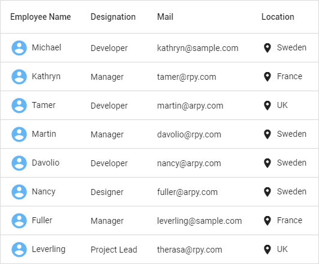

# Flutter DataGrid (SfDataGrid) Overview 

The Syncfusion® Flutter DataGrid is used to display and manipulate data in a tabular view. It is built from the ground up to achieve the best possible performance even when loading large amounts of data.         

## Key Features

* **Column types** - Supports loading any widget in each column.
* **Column sizing** - Set the width of columns with various sizing options. Fit the columns based on the value of the cells to improve readability.
* **Row height** - Set the height for header and data rows. Fit the rows based on the value of the cells to improve readability. Also, set the different heights for specific rows.
* **Editing** - Allows users to edit cell values. An editor widget can be loaded based on the column type to edit cell values.
* **Sorting** - Sort one or more columns in ascending or descending order. 
* **Selection** - Select one or more rows. Keyboard navigation is supported for web platforms.
* **Filtering** - Interactive support to filter data as like Excel. Filter data by text, numbers, and date-time values. Also, supports programmatic filtering.
* **Column Drag and Drop** - Supports reordering columns by dragging and dropping them at the required position.
* **Column resizing** - Resize columns by dragging the right edge of the column header.
* **Exporting** - Support to export the data to Excel and PDF.
* **Styling** - Customize the appearance of cells and headers. Conditional styling is also supported.
* **Stacked headers** - Show unbound header rows. Unbound header rows span stacked header columns across multiple rows and columns.
* **Load more** - Display an interactive view when the grid reaches its maximum offset while scrolling down. Tapping the interactive view triggers a callback to add more data from the data source of the grid at run time.
* **Paging** - Load data in segments. It is useful when loading huge amounts of data.
* **Freeze Panes** - Freeze the rows and columns when scrolling the grid. 
* **Swiping** - Swipe a row right to left or left to right for custom actions such as deleting, editing, and so on. When the user swipes a row, the row will be moved and the swipe view will show the custom actions.
* **Footer** - Show an additional row that can be displayed under the last row. Widgets can also be displayed in the footer row.
* **Pull to refresh** - Allows users to refresh data when the DataGrid is pulled down.
* **Theme** - Use a dark or light theme.
* **Accessibility** - The DataGrid can easily be accessed by screen readers.
* **Right to Left (RTL)** - Right-to-left direction support for users working in RTL languages like Hebrew and Arabic.