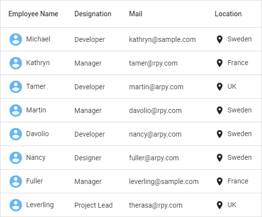

# About Syncfusion Flutter Data Grid Control

The Syncfusion® Flutter Data Grid is used to display and manipulate data in a tabular view. It is built from the ground up to achieve the best possible performance, even when loading large amounts of data.

## Key Features

### Data Presentation
* [**Column types**](column-types) - Display any widget in each column, allowing for flexible content presentation.
* [**Column sizing**](columns-sizing) - Configure column widths with various sizing options. Automatically adjust columns based on cell content to enhance readability.
* [**Row height**](row-height-customization) - Customize heights for header and data rows. Automatically adjust row heights based on cell content. Set different heights for specific rows as needed.
* [**Styling**](styles) - Customize the appearance of cells and headers with support for conditional styling.
* [**Stacked headers**](stacked-headers) - Create unbound header rows that span across multiple rows and columns.
* [**Footer**](footer) - Show an additional row that can be displayed under the last row. Widgets can also be displayed in the footer row.

### Data Manipulation
* [**Editing**](editing) - Enable users to modify cell values with support for custom editor widgets based on column types.
* [**Sorting**](sorting) - Sort data in ascending or descending order across single or multiple columns. 
* [**Filtering**](filtering) - Filter data interactively similar to Excel with support for text, numeric, and date-time filtering. Programmatic filtering is also available.
* [**Selection**](selection) - Select one or more rows with keyboard navigation support for web platforms.
* [**Swiping**](swiping) - Implement swipe actions (left-to-right or right-to-left) for operations like deleting or editing rows.

### Layout and Navigation
* [**Column Drag and Drop**](column-drag-and-drop) - Reorder columns by dragging and dropping them to desired positions.
* [**Column resizing**](columns-resizing) - Adjust column widths by dragging the right edge of column headers.
* [**Freeze Panes**](freeze-panes) - Freeze the rows and columns when scrolling the grid.
* [**Scrolling**](scrolling) - Scroll through large datasets efficiently with optimized rendering.

### Data Loading and Performance
* [**Load more**](load-more) - Display an interactive view when scrolling reaches the bottom of the grid, enabling on-demand data loading.
* [**Paging**](paging) - Load data in segments. It is useful when loading huge amounts of data.
* [**Pull to refresh**](pull-to-refresh) - Allows users to refresh data when the DataGrid is pulled down.

### Export and Integration
* [**Exporting**](export-to-excel) - Export data to [Excel](export-to-excel) and [PDF](export-to-pdf) formats.
* [**Grouping**](grouping) - Group rows by one or more columns for better data organization.
* [**Summaries**](summaries) - Display aggregate values for grouped or all data.

### Customization and Accessibility
* [**Theme**](https://help.syncfusion.com/flutter/themes) - Use a dark or light theme.
* [**Accessibility**](accessibility) - Ensure screen readers can properly access and navigate the DataGrid.
* [**Right to Left (RTL)**](right-to-left) - Support right-to-left layouts for languages like Hebrew and Arabic.
* [**Localization**](localization) - Support multiple languages and regional formats.

## Getting Started

To start using the SfDataGrid widget in your Flutter application, refer to the [Getting Started with Flutter Data Grid](getting-started) documentation.

## API Reference

For a complete list of properties, methods, and events of the SfDataGrid widget, refer to the [SfDataGrid API documentation](https://pub.dev/documentation/syncfusion_flutter_datagrid/latest/datagrid/SfDataGrid-class.html).

## Sample GitHub Repository

You can download a complete working sample from the [GitHub repository](https://github.com/SyncfusionExamples/getting-started-with-flutter-datagrid) to explore the SfDataGrid widget with various features implemented.
