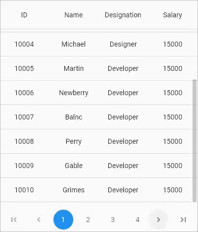
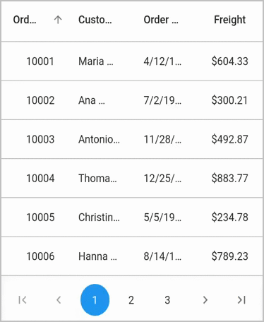

# Paging in Flutter DataGrid (SfDataGrid)

The datagrid interactively supports the manipulation of data using [SfDataPager](https://pub.dev/documentation/syncfusion_flutter_datagrid/latest/datagrid/SfDataPager-class.html) control. This provides support to load data in segments when dealing with large volumes of data. `SfDataPager` can be placed above or below based on the requirement to easily manage data paging.

The datagrid performs paging of data using the `SfDataPager`. To enable paging, follow below procedure

* Create a new `SfDataPager` widget, and set the [SfDataGrid.DataGridSource](https://pub.dev/documentation/syncfusion_flutter_datagrid/latest/datagrid/DataGridSource-class.html) to the [SfDataPager.delegate](https://pub.dev/documentation/syncfusion_flutter_datagrid/latest/datagrid/SfDataPager/delegate.html) property.
* Set the number of pages required to be displayed in data pager by setting the [SfDataPager.pageCount](https://pub.dev/documentation/syncfusion_flutter_datagrid/latest/datagrid/SfDataPager/pageCount.html) property.
* Set the number of buttons that should be displayed in view by setting the [SfDataPager.visibleItemsCount](https://pub.dev/documentation/syncfusion_flutter_datagrid/latest/datagrid/SfDataPager/visibleItemsCount.html) property.
* You can load the data for a specific page in [handlePageChange](https://pub.dev/documentation/syncfusion_flutter_datagrid/latest/datagrid/DataGridSource/handlePageChange.html) method. This method is called for every page navigation from data pager.

N> The `SfDataPager.visibleItemsCount` property default value is 5.

The following code example illustrates using `SfDataPager` with the datagrid control:




import 'package:intl/intl.dart';

final int _rowsPerPage = 15;

final double _dataPagerHeight = 60.0;

List<OrderInfo> _orders = [];

List<OrderInfo> _paginatedOrders = [];

final OrderInfoDataSource _orderInfoDataSource = OrderInfoDataSource();

@override
Widget build(BuildContext context) {
  return LayoutBuilder(builder: (context, constraint) {
    return Column(children: [
      SizedBox(
          height: constraint.maxHeight - _dataPagerHeight,
          width: constraint.maxWidth,
          child: _buildDataGrid(constraint)),
      Container(
          height: _dataPagerHeight,
          child: SfDataPager(
            delegate: _orderInfoDataSource,
            pageCount: _orders.length / _rowsPerPage,
            direction: Axis.horizontal,
          ))
    ]);
  });
}
Widget _buildDataGrid(BoxConstraints constraint) {
  return SfDataGrid(
      source: _orderInfoDataSource,
      columnWidthMode: ColumnWidthMode.fill,
      columns: <GridColumn>[
        GridColumn(
            columnName: 'orderID',
            label: Container(
                padding: EdgeInsets.symmetric(horizontal: 16.0),
                alignment: Alignment.centerRight,
                child: Text(
                  'Order ID',
                  overflow: TextOverflow.ellipsis,
                ))),
        GridColumn(
            columnName: 'customerID',
            label: Container(
                padding: EdgeInsets.symmetric(horizontal: 16.0),
                alignment: Alignment.centerLeft,
                child: Text(
                  'Customer Name',
                  overflow: TextOverflow.ellipsis,
                ))),
        GridColumn(
            columnName: 'orderDate',
            label: Container(
                padding: EdgeInsets.symmetric(horizontal: 16.0),
                alignment: Alignment.centerRight,
                child: Text(
                  'Order Date',
                  overflow: TextOverflow.ellipsis,
                ))),
        GridColumn(
            columnName: 'freight',
            label: Container(
                padding: EdgeInsets.symmetric(horizontal: 16.0),
                alignment: Alignment.center,
                child: Text(
                  'Freight',
                  overflow: TextOverflow.ellipsis,
                )))
      ]);
}

class OrderInfoDataSource extends DataGridSource {
  OrderInfoDataSource() {
    _paginatedOrders = _orders.getRange(0, 19).toList(growable: false);
    buildPaginatedDataGridRows();
  }

  List<DataGridRow> dataGridRows = [];

  @override
  List<DataGridRow> get rows => dataGridRows;

  @override
  DataGridRowAdapter? buildRow(DataGridRow row) {
    return DataGridRowAdapter(
        cells: row.getCells().map<Widget>((dataGridCell) {
      if (dataGridCell.columnName == 'orderID') {
        return Container(
          padding: EdgeInsets.symmetric(horizontal: 16.0),
          alignment: Alignment.centerRight,
          child: Text(
            dataGridCell.value.toString(),
            overflow: TextOverflow.ellipsis,
          ),
        );
      } else if (dataGridCell.columnName == 'customerID') {
        return Container(
            padding: EdgeInsets.symmetric(horizontal: 16.0),
            alignment: Alignment.centerLeft,
            child: Text(
              dataGridCell.value.toString(),
              overflow: TextOverflow.ellipsis,
            ));
      } else if (dataGridCell.columnName == 'orderDate') {
        return Container(
            padding: EdgeInsets.symmetric(horizontal: 16.0),
            alignment: Alignment.centerRight,
            child: Text(
              DateFormat.yMd().format(dataGridCell.value).toString(),
              overflow: TextOverflow.ellipsis,
            ));
      } else {
        return Container(
            padding: EdgeInsets.symmetric(horizontal: 16.0),
            alignment: Alignment.center,
            child: Text(
              NumberFormat.currency(locale: 'en_US', symbol: '\$')
                  .format(dataGridCell.value)
                  .toString(),
              overflow: TextOverflow.ellipsis,
            ));
      }
    }).toList());
  }

  @override
  Future<bool> handlePageChange(int oldPageIndex, int newPageIndex) async {
    int startIndex = newPageIndex * _rowsPerPage;
    int endIndex = startIndex + _rowsPerPage;
    if (startIndex < _orders.length && endIndex <= _orders.length) {
      _paginatedOrders =
          _orders.getRange(startIndex, endIndex).toList(growable: false);
      buildPaginatedDataGridRows();
      notifyListeners();
    } else {
      _paginatedOrders = [];
    }

    return true;
  }

  void buildPaginatedDataGridRows() {
    dataGridRows = _paginatedOrders.map<DataGridRow>((dataGridRow) {
      return DataGridRow(cells: [
        DataGridCell(columnName: 'orderID', value: dataGridRow.orderID),
        DataGridCell(columnName: 'customerID', value: dataGridRow.customerID),
        DataGridCell(columnName: 'orderDate', value: dataGridRow.orderDate),
        DataGridCell(columnName: 'freight', value: dataGridRow.freight),
      ]);
    }).toList(growable: false);
  }
}




## Callbacks

The SfDataPager provides [onPageNavigationStart](https://pub.dev/documentation/syncfusion_flutter_datagrid/latest/datagrid/SfDataPager/onPageNavigationStart.html) and [onPageNavigationEnd](https://pub.dev/documentation/syncfusion_flutter_datagrid/latest/datagrid/SfDataPager/onPageNavigationEnd.html) callbacks to listen the page navigation in widget level. 

Typically, these callbacks are used to show and hide loading indicator.




@override
Widget build(BuildContext context) {
  return Scaffold(body: LayoutBuilder(builder: (context, constraints) {
    return Row(children: [
      Column(children: [
        SizedBox(
            height: constraints.maxHeight - 60,
            width: constraints.maxWidth,
            child: _buildDataGrid(constraints)),
        Container(
            height: 60,
            width: constraints.maxWidth,
            child: SfDataPager(
                pageCount: _orders.length / _rowsPerPage,
                direction: Axis.horizontal,
                onPageNavigationStart: (int pageIndex) {
                  //You can do your customization
                },
                delegate: _orderInfoDataSource,
                onPageNavigationEnd: (int pageIndex) {
                  //You can do your customization
                }))
      ])
    ]);
  }));
}




## Asynchronous data loading

You can load the data asynchronously to the `SfDataPager` by overriding the `handlePageChange` method and await the method while loading the data.

You can use `onPageNavigationStart` and `onPageNavigationEnd` callbacks to show and hide the loading indicator when navigating between pages.

In the below example, we have set await for 2000ms and displayed the loading indicator until 2000ms.




import 'package:intl/intl.dart';

bool showLoadingIndicator = true;

@override
Widget build(BuildContext context) {
  return Scaffold(body: LayoutBuilder(builder: (context, constraints) {
    return Row(children: [
      Column(children: [
        SizedBox(
            height: constraints.maxHeight - 60,
            width: constraints.maxWidth,
            child: _buildStack(constraints)),
        Container(
            height: 60,
            width: constraints.maxWidth,
            child: SfDataPager(
                pageCount: _orders.length / _rowsPerPage,
                direction: Axis.horizontal,
                onPageNavigationStart: (int pageIndex) {
                  setState(() {
                    showLoadingIndicator = true;
                  });
                },
                delegate: _orderInfoDataSource,
                onPageNavigationEnd: (int pageIndex) {
                  setState(() {
                    showLoadingIndicator = false;
                  });
                }))
      ])
    ]);
  }));
}

Widget _buildStack(BoxConstraints constraints) {
  List<Widget> _getChildren() {
    final List<Widget> stackChildren = [];
    stackChildren.add(_buildDataGrid(constraints));

    if (showLoadingIndicator) {
      stackChildren.add(Container(
          color: Colors.black12,
          width: constraints.maxWidth,
          height: constraints.maxHeight,
          child: Align(
              alignment: Alignment.center,
              child: CircularProgressIndicator(
                strokeWidth: 3,
              ))));
    }

    return stackChildren;
  }

  return Stack(
    children: _getChildren(),
  );
}

class OrderInfoDataSource extends DataGridSource {
  OrderInfoDataSource() {
    _paginatedOrders = _orders.getRange(0, 19).toList(growable: false);
    buildPaginatedDataGridRows();
  }

  List<DataGridRow> dataGridRows = [];

  @override
  List<DataGridRow> get rows => dataGridRows;

  @override
  DataGridRowAdapter? buildRow(DataGridRow row) {
    return DataGridRowAdapter(
        cells: row.getCells().map<Widget>((dataGridCell) {
      if (dataGridCell.columnName == 'orderID') {
        return Container(
          padding: EdgeInsets.symmetric(horizontal: 16.0),
          alignment: Alignment.centerRight,
          child: Text(
            dataGridCell.value.toString(),
            overflow: TextOverflow.ellipsis,
          ),
        );
      } else if (dataGridCell.columnName == 'customerID') {
        return Container(
            padding: EdgeInsets.symmetric(horizontal: 16.0),
            alignment: Alignment.centerLeft,
            child: Text(
              dataGridCell.value.toString(),
              overflow: TextOverflow.ellipsis,
            ));
      } else if (dataGridCell.columnName == 'orderDate') {
        return Container(
            padding: EdgeInsets.symmetric(horizontal: 16.0),
            alignment: Alignment.centerRight,
            child: Text(
              DateFormat.yMd().format(dataGridCell.value).toString(),
              overflow: TextOverflow.ellipsis,
            ));
      } else {
        return Container(
            padding: EdgeInsets.symmetric(horizontal: 16.0),
            alignment: Alignment.center,
            child: Text(
              NumberFormat.currency(locale: 'en_US', symbol: '\$')
                  .format(dataGridCell.value)
                  .toString(),
              overflow: TextOverflow.ellipsis,
            ));
      }
    }).toList());
  }

  @override
  Future<bool> handlePageChange(int oldPageIndex, int newPageIndex) async {
    int startIndex = newPageIndex * _rowsPerPage;
    int endIndex = startIndex + _rowsPerPage;
    if (startIndex < _orders.length && endIndex <= _orders.length) {
      await Future.delayed(Duration(milliseconds: 2000));
      _paginatedOrders =
          _orders.getRange(startIndex, endIndex).toList(growable: false);
      buildPaginatedDataGridRows();
      notifyListeners();
    } else {
      _paginatedOrders = [];
    }

    return true;
  }

  void buildPaginatedDataGridRows() {
    dataGridRows = _paginatedOrders.map<DataGridRow>((dataGridRow) {
      return DataGridRow(cells: [
        DataGridCell(columnName: 'orderID', value: dataGridRow.orderID),
        DataGridCell(columnName: 'customerID', value: dataGridRow.customerID),
        DataGridCell(columnName: 'orderDate', value: dataGridRow.orderDate),
        DataGridCell(columnName: 'freight', value: dataGridRow.freight),
      ]);
    }).toList(growable: false);
  }
}




>**NOTE**  
  Download demo application from [GitHub](https://github.com/SyncfusionExamples/how-to-show-loading-indicator-on-loading-page-in-flutter-datatable).

## Programmatic page navigation

The `SfDataPager` provides the support to navigate between the pages programmatically using [controller](https://pub.dev/documentation/syncfusion_flutter_datagrid/latest/datagrid/DataGridController-class.html) with following options,

* [nextPage](https://pub.dev/documentation/syncfusion_flutter_datagrid/latest/datagrid/DataPagerController/nextPage.html) 
* [previousPage](https://pub.dev/documentation/syncfusion_flutter_datagrid/latest/datagrid/DataPagerController/previousPage.html) 
* [LastPage](https://pub.dev/documentation/syncfusion_flutter_datagrid/latest/datagrid/DataPagerController/lastPage.html)
* [firstPage](https://pub.dev/documentation/syncfusion_flutter_datagrid/latest/datagrid/DataPagerController/firstPage.html)

The following code example shows how to navigate the previous page programmatically,




DataPagerController _controller = DataPagerController();

@override
Widget build(BuildContext context) {
  return Scaffold(body: LayoutBuilder(builder: (context, constraint) {
    return Column(children: [
      MaterialButton(
        onPressed: () {
          _controller.previousPage();
        },
        child: Text('Move Previous page'),
      ),
      SizedBox(
          height: constraint.maxHeight - 120,
          width: constraint.maxWidth,
          child: _buildDataGrid(constraint)),
      Container(
          height: 60,
          child: Align(
              alignment: Alignment.center,
              child: SfDataPager(
                delegate: _orderInfoDataSource,
                initialPageIndex: 2,
                controller: _controller,
                pageCount: _orders.length / _rowsPerPage,
                direction: Axis.horizontal,
              )))
    ]);
  }));
}




## Show dropdown button to choose rows per page

Show the dropdown button option to select a different number of rows per page by defining the [onRowPerPageChanged](https://pub.dev/documentation/syncfusion_flutter_datagrid/latest/datagrid/SfDataPager/onRowsPerPageChanged.html) callback. If it is null, no option will be provided to select different number of rows per page.

You can use [availableRowsPerPage](https://pub.dev/documentation/syncfusion_flutter_datagrid/latest/datagrid/SfDataPager/availableRowsPerPage.html) property to define the list of numbers to be displayed in drop-down. The default value of `availableRowsPerPage` property is [10,15,20].

>**NOTE** 
  You can view dropdown button option by horizontally scrolling the DataPager. The dropdown button option is not supported, if the [direction](https://pub.dev/documentation/syncfusion_flutter_datagrid/latest/datagrid/SfDataPager/direction.html) is vertical.




  int _rowsPerPage=10;
  List<Employee> employees = <Employee>[];
  late EmployeeDataSource employeeDataSource;
  double datapagerHeight = 70.0;

  @override
  void initState() {
    super.initState();
    employees = getEmployeeData();
    employeeDataSource = EmployeeDataSource(employeeData: employees);
  }

  @override
  Widget build(BuildContext context) {
    return Scaffold(
        appBar: AppBar(
          title: const Text('Syncfusion Flutter DataGrid'),
        ),
        body: LayoutBuilder(
            builder: (BuildContext context, BoxConstraints constraints) {
          return Column(
            children: [
              Container(
                height: constraints.maxHeight - datapagerHeight,
                child: SfDataGrid(
                    source: employeeDataSource,
                    columnWidthMode: ColumnWidthMode.fill,
                    columns: _column),
              ),
              Container(
                  height: datapagerHeight,
                  child: SfDataPager(
                    delegate: employeeDataSource,
                    availableRowsPerPage: [10, 20, 30],
                    onRowsPerPageChanged: (int? rowsPerPage) {
                      setState(() {
                        _rowsPerPage = rowsPerPage!;
                        employeeDataSource.updateDataGriDataSource();
                      });
                    },
                    pageCount:
                        ((employees.length / _rowsPerPage).ceil()).toDouble(),
                  )),
            ],
          );
        }));
  }

  class EmployeeDataSource extends DataGridSource {
  /// Creates the employee data source class with required details.
  EmployeeDataSource({required List<Employee> employeeData}) {
    _employeeData = employeeData;
    _paginatedRows = employeeData;
    buildDataGridRow();
  }

  void buildDataGridRow() {
    _employeeDataGridRows = _paginatedRows
        .map<DataGridRow>((e) => DataGridRow(cells: [
              DataGridCell<int>(columnName: 'id', value: e.id),
              DataGridCell<String>(columnName: 'name', value: e.name),
              DataGridCell<String>(
                  columnName: 'designation', value: e.designation),
              DataGridCell<int>(columnName: 'salary', value: e.salary),
            ]))
        .toList();
  }

  List<DataGridRow> _employeeDataGridRows = [];
  List<Employee> _paginatedRows = [];
  List<Employee> _employeeData = [];

  @override
  List<DataGridRow> get rows => _employeeDataGridRows;

  @override
  DataGridRowAdapter buildRow(DataGridRow row) {
    return DataGridRowAdapter(
        cells: row.getCells().map<Widget>((e) {
      return Container(
        alignment: Alignment.center,
        padding: EdgeInsets.all(8.0),
        child: Text(e.value.toString()),
      );
    }).toList());
  }

  @override
  Future<bool> handlePageChange(int oldPageIndex, int newPageIndex) {
    final int _startIndex = newPageIndex * _rowsPerPage;
    int _endIndex = _startIndex + _rowsPerPage;
    if (_endIndex > _employeeData.length) {
      _endIndex = _employeeData.length;
    }

    /// Get particular range from the sorted collection.
    if (_startIndex < _employeeData.length &&
        _endIndex <= _employeeData.length) {
      _paginatedRows = _employeeData.getRange(_startIndex, _endIndex).toList();
    } else {
      _paginatedRows = <Employee>[];
    }
    buildDataGridRow();
    notifyListeners();
    return Future<bool>.value(true);
  }

  void updateDataGriDataSource() {
    notifyListeners();
  }
  }



## Orientation

`SfDataPager` allows you to arrange the child elements either horizontally or vertically. This can be achieved by using the [direction](https://pub.dev/documentation/syncfusion_flutter_datagrid/latest/datagrid/SfDataPager/direction.html) Property. `direction` is an Enum type.

<table>
<tr>
<th>
Enum 
</th>
<th>
Description</th>
</tr>
<tr>
<td>
horizontal
</td>
<td>
This is the default enum value for direction. Arranges all the navigation buttons and numeric buttons horizontally.{{''|markdownify}}
</td>
</tr>
<tr>
<td>
vertical
</td>
<td>
Arranges all the navigation buttons and numeric buttons vertically by setting Axis.vertical to direction property.{{''|markdownify}}
</td>
</tr>
</table>

## Appearance

SfDataPager allows to customize the appearance of the data pager using the [SfDataPagerThemeData](https://pub.dev/documentation/syncfusion_flutter_core/latest/theme/SfDataPagerThemeData-class.html) in [SfDataPagerTheme](https://pub.dev/documentation/syncfusion_flutter_core/latest/theme/SfDataPagerTheme-class.html). The `SfDataPager` should be wrapped inside the `SfDataPagerTheme`.

Import the following class from the [syncfusion_flutter_core](https://pub.dev/packages/syncfusion_flutter_core) package.




import 'package:syncfusion_flutter_core/theme.dart';




The following code example illustrates using `SfDataPagerThemeData` with the data pager control




@override
Widget build(BuildContext context) {
  return Scaffold(
    body: SfDataPagerTheme(
      data: SfDataPagerThemeData(
        itemColor: Colors.white,
        selectedItemColor: Colors.lightGreen,
        itemBorderRadius: BorderRadius.circular(5),
        backgroundColor: Colors.teal,
      ),
      child: SfDataPager(
        delegate: _orderInfoDataSource,
        pageCount: _orders.length / _rowsPerPage,
        direction: Axis.horizontal,
      ),
    ),
  );
}




### Set the padding between page items

The padding between the page items including navigation page items such as first, last, previous and next can be changed by using the [itemPadding](https://pub.dev/documentation/syncfusion_flutter_datagrid/latest/datagrid/SfDataPager/itemPadding.html) property.




  @override
  Widget build(BuildContext context) {
    return Scaffold(
        appBar: AppBar(
          title: const Text('Syncfusion Flutter DataGrid'),
        ),
        body: SfDataPager(
            itemPadding: EdgeInsets.all(8.0),
            pageCount: 5,
            delegate: employeeDataSource,
          ),
        );
  }




N> The default value of `SfDataPager.itemPadding` is 5.0.

### Set the height and width for the page items

The default width and height of the page items are 50 and 50, respectively. For changing page number items size, use the [itemWidth](https://pub.dev/documentation/syncfusion_flutter_datagrid/latest/datagrid/SfDataPager/itemWidth.html) and [itemHeight](https://pub.dev/documentation/syncfusion_flutter_datagrid/latest/datagrid/SfDataPager/itemHeight.html) properties; for changing navigation items size such as first, last, previous, and next, use the [navigationItemHeight](https://pub.dev/documentation/syncfusion_flutter_datagrid/latest/datagrid/SfDataPager/navigationItemHeight.html) and [navigationItemWidth](https://pub.dev/documentation/syncfusion_flutter_datagrid/latest/datagrid/SfDataPager/navigationItemWidth.html) properties.




  @override
  Widget build(BuildContext context) {
    return Scaffold(
        appBar: AppBar(
          title: const Text('Syncfusion Flutter DataGrid'),
        ),
        body: Center(
            child: SfDataPagerTheme(
          data: SfDataPagerThemeData(
            itemBorderWidth: 0.5,
            itemBorderColor: Colors.grey.shade400,
            itemBorderRadius: BorderRadius.circular(5),
          ),
          child: SfDataPager(
            pageCount: 5,
            visibleItemsCount: 2,
            itemWidth: 70,
            itemHeight: 55,
            navigationItemWidth: 70,
            navigationItemHeight: 55,
            delegate: employeeDataSource,
          ),
        )));
  }




### Hide certain navigation page items

To hide the certain navigation page items, use the following properties:

 * [firstPageItemVisible](https://pub.dev/documentation/syncfusion_flutter_datagrid/latest/datagrid/SfDataPager/firstPageItemVisible.html) 
 * [lastPageItemVisible](https://pub.dev/documentation/syncfusion_flutter_datagrid/latest/datagrid/SfDataPager/lastPageItemVisible.html) 
 * [nextPageItemVisible](https://pub.dev/documentation/syncfusion_flutter_datagrid/latest/datagrid/SfDataPager/nextPageItemVisible.html)
 * [previousPageItemVisible](https://pub.dev/documentation/syncfusion_flutter_datagrid/latest/datagrid/SfDataPager/previousPageItemVisible.html)

 N> Default value of all properties is true.




@override
  Widget build(BuildContext context) {
    return Scaffold(
        appBar: AppBar(
          title: const Text('Syncfusion Flutter DataGrid'),
        ),
        body: SfDataPagerTheme(
          data: SfDataPagerThemeData(
              itemBorderWidth: 0.5,
              itemBorderColor: Colors.grey.shade400,
              itemBorderRadius: BorderRadius.circular(5),
              selectedItemColor: Colors.indigo.shade500),
          child: SfDataPager(
            firstPageItemVisible: false,
            lastPageItemVisible: false,
            pageCount: 5,
            visibleItemsCount: 3,
            navigationItemWidth: 100,
            delegate: employeeDataSource,
            pageItemBuilder: (String itemName) {
              if (itemName == 'Next') {
                return Center(
                  child: Text('Next'),
                );
              }
              if (itemName == 'Previous') {
                return Center(
                  child: Text('Previous'),
                );
              }
            },
            itemPadding: EdgeInsets.all(8.0),
          ),
        ));
  }




## Change the number of visible items (buttons) in view

You can change the number of visible items i.e. page buttons in view by using the [SfDataPager.visibleItemsCount](https://pub.dev/documentation/syncfusion_flutter_datagrid/latest/datagrid/SfDataPager/visibleItemsCount.html).




@override
Widget build(BuildContext context) {
  return Scaffold(
      appBar: AppBar(
        title: Text('Flutter DataGrid Sample'),
      ),
      body: LayoutBuilder(builder: (context, constraint) {
        return Column(
          children: [
            SizedBox(
                height: constraint.maxHeight - _dataPagerHeight,
                width: constraint.maxWidth,
                child: _buildDataGrid(constraint)),
            Container(
              height: _dataPagerHeight,
              child: SfDataPager(
                visibleItemsCount: 1,
                delegate: _orderInfoDataSource,
                pageCount: _orders.length / _rowsPerPage,
                direction: Axis.horizontal,
              ),
            )
          ],
        );
      }));
}




## Load any widget in page button

You can load any widget to page button by using [SfDataPager.pageItemBuilder](https://pub.dev/documentation/syncfusion_flutter_datagrid/latest/datagrid/SfDataPager/pageItemBuilder.html).




@override
Widget build(BuildContext context) {
  return Scaffold(
      appBar: AppBar(
        title: Text('Flutter DataGrid Sample'),
      ),
      body: LayoutBuilder(builder: (context, constraint) {
        return Column(children: [
          SizedBox(
              height: constraint.maxHeight - _dataPagerHeight,
              width: constraint.maxWidth,
              child: _buildDataGrid(constraint)),
          Container(
              height: _dataPagerHeight,
              child: SfDataPagerTheme(
                  data: SfDataPagerThemeData(
                    itemBorderColor: Colors.blue,
                    itemBorderWidth: 1,
                    backgroundColor: Colors.transparent,
                    itemBorderRadius: BorderRadius.circular(0),
                  ),
                  child: SfDataPager(
                    pageItemBuilder: (String value) {
                      return Container(
                          child: Text(
                        value,
                        style: TextStyle(
                            fontSize: 10, fontWeight: FontWeight.w700),
                      ));
                    },
                    delegate: _orderInfoDataSource,
                    pageCount: _orders.length / _rowsPerPage,
                    direction: Axis.horizontal,
                  )))
        ]);
      }));
}



## Sort all the rows instead of rows available in a page

By default, the rows on a page are sorted. To sort all the rows available for paging, do not override the `handlePageChange` method in the `DataGridSource` class. The DataGrid will automatically split the rows required for each page based on the `SfDataPager.pageCount`, i.e. the divided value of the [DataGridRows.rows](https://pub.dev/documentation/syncfusion_flutter_datagrid/latest/datagrid/DataGridSource/rows.html) and `SfDataPager.pageCount`.

If you want to specifically maintain the rows required for a page, you can use the [SfDataGrid.rowsPerPage](https://pub.dev/documentation/syncfusion_flutter_datagrid/latest/datagrid/SfDataGrid/rowsPerPage.html) property. However, make sure that you do not override the `handlePageChange` method in the `DataGridSource` class at the sample level.




final int _rowsPerPage = 15;

final double _dataPagerHeight = 60.0;

List<OrderInfo> _orders = [];

@override
Widget build(BuildContext context) {
  return Scaffold(body: LayoutBuilder(builder: (context, constraint) {
    return Column(children: [
      SizedBox(
          height: constraint.maxHeight - _dataPagerHeight,
          width: constraint.maxWidth,
          child: _buildDataGrid(constraint)),
      Container(
          height: _dataPagerHeight,
          child: SfDataPager(
            delegate: _orderInfoDataSource,
            pageCount: (_orders.length / _rowsPerPage).ceil().toDouble(),
            direction: Axis.horizontal,
          ))
    ]);
  }));
}

Widget _buildDataGrid(BoxConstraints constraint) {
  return SfDataGrid(
      source: _orderInfoDataSource,
      columnWidthMode: ColumnWidthMode.fill,
      rowsPerPage: _rowsPerPage,
      allowSorting: true,
      columns: <GridColumn>[
        GridColumn(
            columnName: 'orderID',
            label: Container(
                padding: EdgeInsets.symmetric(horizontal: 16.0),
                alignment: Alignment.centerRight,
                child: Text(
                  'Order ID',
                  overflow: TextOverflow.ellipsis,
                ))),
        GridColumn(
            columnName: 'customerID',
            label: Container(
                padding: EdgeInsets.symmetric(horizontal: 16.0),
                alignment: Alignment.centerLeft,
                child: Text(
                  'Customer Name',
                  overflow: TextOverflow.ellipsis,
                ))),
        GridColumn(
            columnName: 'orderDate',
            label: Container(
                padding: EdgeInsets.symmetric(horizontal: 16.0),
                alignment: Alignment.centerRight,
                child: Text(
                  'Order Date',
                  overflow: TextOverflow.ellipsis,
                ))),
        GridColumn(
            columnName: 'freight',
            label: Container(
                padding: EdgeInsets.symmetric(horizontal: 16.0),
                alignment: Alignment.center,
                child: Text(
                  'Freight',
                  overflow: TextOverflow.ellipsis,
                )))
      ]);
}

class OrderInfoDataSource extends DataGridSource {
  OrderInfoDataSource() {
    buildDataGridRows();
  }

  List<DataGridRow> dataGridRows = [];

  @override
  List<DataGridRow> get rows => dataGridRows;

  @override
  DataGridRowAdapter? buildRow(DataGridRow row) {
    return DataGridRowAdapter(
        cells: row.getCells().map<Widget>((dataGridCell) {
      if (dataGridCell.columnName == 'orderID') {
        return Container(
          padding: EdgeInsets.symmetric(horizontal: 16.0),
          alignment: Alignment.centerRight,
          child: Text(
            dataGridCell.value.toString(),
            overflow: TextOverflow.ellipsis,
          ),
        );
      } else if (dataGridCell.columnName == 'customerID') {
        return Container(
            padding: EdgeInsets.symmetric(horizontal: 16.0),
            alignment: Alignment.centerLeft,
            child: Text(
              dataGridCell.value.toString(),
              overflow: TextOverflow.ellipsis,
            ));
      } else if (dataGridCell.columnName == 'orderDate') {
        return Container(
            padding: EdgeInsets.symmetric(horizontal: 16.0),
            alignment: Alignment.centerRight,
            child: Text(
              DateFormat.yMd().format(dataGridCell.value).toString(),
              overflow: TextOverflow.ellipsis,
            ));
      } else {
        return Container(
            padding: EdgeInsets.symmetric(horizontal: 16.0),
            alignment: Alignment.center,
            child: Text(
              NumberFormat.currency(locale: 'en_US', symbol: '\$')
                  .format(dataGridCell.value)
                  .toString(),
              overflow: TextOverflow.ellipsis,
            ));
      }
    }).toList());
  }

  void buildDataGridRows() {
    dataGridRows = _orders.map<DataGridRow>((dataGridRow) {
      return DataGridRow(cells: [
        DataGridCell(columnName: 'orderID', value: dataGridRow.orderID),
        DataGridCell(columnName: 'customerID', value: dataGridRow.customerID),
        DataGridCell(columnName: 'orderDate', value: dataGridRow.orderDate),
        DataGridCell(columnName: 'freight', value: dataGridRow.freight),
      ]);
    }).toList(growable: false);
  }
}




