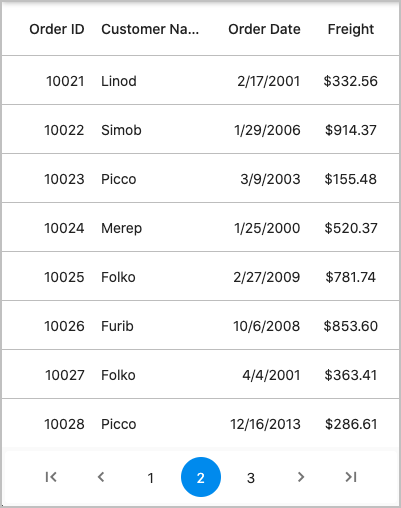
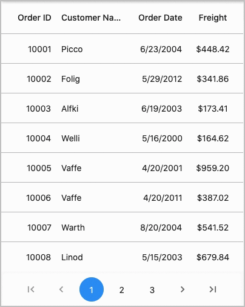
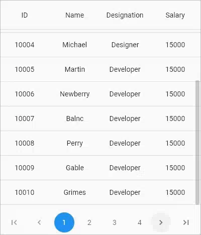
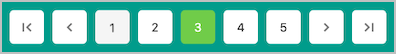
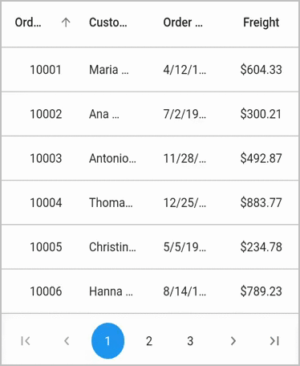

# Paging in Flutter DataGrid (SfDataGrid)

The Datagrid interactively supports the manipulation of data using the [SfDataPager](https://pub.dev/documentation/syncfusion_flutter_datagrid/latest/datagrid/SfDataPager-class.html) control.  This provides support to load data in segments when dealing with large volumes of data. The `SfDataPager` can be placed above or under based on the requirement to easily manage data paging.

The Datagrid performs paging of data using the `SfDataPager`. To enable paging, follow this procedure

* Create a new `SfDataPager` widget, and set the [SfDataGrid.DataGridSource](https://pub.dev/documentation/syncfusion_flutter_datagrid/latest/datagrid/DataGridSource-class.html) to the [SfDataPager.delegate](https://pub.dev/documentation/syncfusion_flutter_datagrid/latest/datagrid/SfDataPager/delegate.html) property.
* Set the number of pages required to be displayed in the data pager by setting the [SfDataPager.pageCount](https://pub.dev/documentation/syncfusion_flutter_datagrid/latest/datagrid/SfDataPager/pageCount.html) property. This is calculated as the total row count divided by rows per page, then rounded up.
* Set the number of buttons that should be displayed in view by setting the [SfDataPager.visibleItemsCount](https://pub.dev/documentation/syncfusion_flutter_datagrid/latest/datagrid/SfDataPager/visibleItemsCount.html) property.
* Load the data for a specific page in the [handlePageChange](https://pub.dev/documentation/syncfusion_flutter_datagrid/latest/datagrid/DataGridSource/handlePageChange.html) method. This method returns a `Future<bool>` and is called when navigating between pages in the data pager.

> **Note:** The `SfDataPager.visibleItemsCount` property default value is 5. Also, ensure that the [syncfusion_flutter_datagrid](https://pub.dev/packages/syncfusion_flutter_datagrid) and [syncfusion_flutter_core](https://pub.dev/packages/syncfusion_flutter_core) packages are added to your `pubspec.yaml` file.

The following code example illustrates using the `SfDataPager` with the Datagrid control:




import 'package:intl/intl.dart';

  final int _rowsPerPage = 15;
  final double _dataPagerHeight = 60.0;
  List<OrderInfo> _orders = [];
  List<OrderInfo> _paginatedOrders = [];
  final OrderInfoDataSource _orderInfoDataSource = OrderInfoDataSource();

  @override
  Widget build(BuildContext context) {
    return LayoutBuilder(builder: (context, constraint) {
      return Column(children: [
        SizedBox(
            height: constraint.maxHeight - _dataPagerHeight,
            width: constraint.maxWidth,
            child: _buildDataGrid(constraint)),
        Container(
            height: _dataPagerHeight,
            child: SfDataPager(
              delegate: _orderInfoDataSource,
              pageCount: _orders.length / _rowsPerPage,
              direction: Axis.horizontal,
            ))
      ]);
    });
  }

  Widget _buildDataGrid(BoxConstraints constraint) {
    return SfDataGrid(
        source: _orderInfoDataSource,
        columnWidthMode: ColumnWidthMode.fill,
        columns: <GridColumn>[
          GridColumn(
              columnName: 'orderID',
              label: Container(
                  padding: EdgeInsets.symmetric(horizontal: 16.0),
                  alignment: Alignment.centerRight,
                  child: Text(
                    'Order ID',
                    overflow: TextOverflow.ellipsis,
                  ))),
          GridColumn(
              columnName: 'customerID',
              label: Container(
                  padding: EdgeInsets.symmetric(horizontal: 16.0),
                  alignment: Alignment.centerLeft,
                  child: Text(
                    'Customer Name',
                    overflow: TextOverflow.ellipsis,
                  ))),
          GridColumn(
              columnName: 'orderDate',
              label: Container(
                  padding: EdgeInsets.symmetric(horizontal: 16.0),
                  alignment: Alignment.centerRight,
                  child: Text(
                    'Order Date',
                    overflow: TextOverflow.ellipsis,
                  ))),
          GridColumn(
              columnName: 'freight',
              label: Container(
                  padding: EdgeInsets.symmetric(horizontal: 16.0),
                  alignment: Alignment.center,
                  child: Text(
                    'Freight',
                    overflow: TextOverflow.ellipsis,
                  )))
        ]);
  }

class OrderInfoDataSource extends DataGridSource {
  OrderInfoDataSource() {
    _paginatedOrders = _orders.getRange(0, 19).toList(growable: false);
    buildPaginatedDataGridRows();
  }

  List<DataGridRow> dataGridRows = [];

  @override
  List<DataGridRow> get rows => dataGridRows;

  @override
  DataGridRowAdapter? buildRow(DataGridRow row) {
    return DataGridRowAdapter(
        cells: row.getCells().map<Widget>((dataGridCell) {
      if (dataGridCell.columnName == 'orderID') {
        return Container(
          padding: EdgeInsets.symmetric(horizontal: 16.0),
          alignment: Alignment.centerRight,
          child: Text(
            dataGridCell.value.toString(),
            overflow: TextOverflow.ellipsis,
          ),
        );
      } else if (dataGridCell.columnName == 'customerID') {
        return Container(
            padding: EdgeInsets.symmetric(horizontal: 16.0),
            alignment: Alignment.centerLeft,
            child: Text(
              dataGridCell.value.toString(),
              overflow: TextOverflow.ellipsis,
            ));
      } else if (dataGridCell.columnName == 'orderDate') {
        return Container(
            padding: EdgeInsets.symmetric(horizontal: 16.0),
            alignment: Alignment.centerRight,
            child: Text(
              DateFormat.yMd().format(dataGridCell.value).toString(),
              overflow: TextOverflow.ellipsis,
            ));
      } else {
        return Container(
            padding: EdgeInsets.symmetric(horizontal: 16.0),
            alignment: Alignment.center,
            child: Text(
              NumberFormat.currency(locale: 'en_US', symbol: '\$')
                  .format(dataGridCell.value)
                  .toString(),
              overflow: TextOverflow.ellipsis,
            ));
      }
    }).toList());
  }

  @override
  Future<bool> handlePageChange(int oldPageIndex, int newPageIndex) async {
    int startIndex = newPageIndex * _rowsPerPage;
    int endIndex = startIndex + _rowsPerPage;
    if (startIndex < _orders.length && endIndex <= _orders.length) {
      _paginatedOrders =
          _orders.getRange(startIndex, endIndex).toList(growable: false);
      buildPaginatedDataGridRows();
      notifyListeners();
    } else {
      _paginatedOrders = [];
    }

    return true;
  }

  void buildPaginatedDataGridRows() {
    dataGridRows = _paginatedOrders.map<DataGridRow>((dataGridRow) {
      return DataGridRow(cells: [
        DataGridCell(columnName: 'orderID', value: dataGridRow.orderID),
        DataGridCell(columnName: 'customerID', value: dataGridRow.customerID),
        DataGridCell(columnName: 'orderDate', value: dataGridRow.orderDate),
        DataGridCell(columnName: 'freight', value: dataGridRow.freight),
      ]);
    }).toList(growable: false);
  }
}




## Asynchronous data loading

You can load the data asynchronously to the `SfDataPager` by overriding the `handlePageChange` method and await the method while loading the data.

The [onPageNavigationStart](https://pub.dev/documentation/syncfusion_flutter_datagrid/latest/datagrid/SfDataPager/onPageNavigationStart.html) and [onPageNavigationEnd](https://pub.dev/documentation/syncfusion_flutter_datagrid/latest/datagrid/SfDataPager/onPageNavigationEnd.html) callbacks can be used to show and hide the loading indicator when navigating between pages.

In the following example, a 2000ms delay is used to simulate asynchronous data loading. Replace this with an actual API call or database query in your application.




import 'package:intl/intl.dart';

  bool showLoadingIndicator = true;

  @override
  Widget build(BuildContext context) {
    return Scaffold(body: LayoutBuilder(builder: (context, constraints) {
      return Row(children: [
        Column(children: [
          SizedBox(
              height: constraints.maxHeight - 60,
              width: constraints.maxWidth,
              child: _buildStack(constraints)),
          Container(
              height: 60,
              width: constraints.maxWidth,
              child: SfDataPager(
                  pageCount: _orders.length / _rowsPerPage,
                  direction: Axis.horizontal,
                  onPageNavigationStart: (int pageIndex) {
                    setState(() {
                      showLoadingIndicator = true;
                    });
                  },
                  delegate: _orderInfoDataSource,
                  onPageNavigationEnd: (int pageIndex) {
                    setState(() {
                      showLoadingIndicator = false;
                    });
                  }))
        ])
      ]);
    }));
  }

  Widget _buildStack(BoxConstraints constraints) {
    List<Widget> _getChildren() {
      final List<Widget> stackChildren = [];
      stackChildren.add(_buildDataGrid(constraints));

      if (showLoadingIndicator) {
        stackChildren.add(Container(
            color: Colors.black12,
            width: constraints.maxWidth,
            height: constraints.maxHeight,
            child: Align(
                alignment: Alignment.center,
                child: CircularProgressIndicator(
                  strokeWidth: 3,
                ))));
      }

      return stackChildren;
    }

    return Stack(
      children: _getChildren(),
    );
  }

class OrderInfoDataSource extends DataGridSource {
  OrderInfoDataSource() {
    int endIndex = _orders.length < _rowsPerPage ? _orders.length : _rowsPerPage;
    _paginatedOrders = _orders.getRange(0, endIndex).toList(growable: false);
    buildPaginatedDataGridRows();
  }

  List<DataGridRow> dataGridRows = [];

  @override
  List<DataGridRow> get rows => dataGridRows;

  @override
  DataGridRowAdapter? buildRow(DataGridRow row) {
    return DataGridRowAdapter(
        cells: row.getCells().map<Widget>((dataGridCell) {
      if (dataGridCell.columnName == 'orderID') {
        return Container(
          padding: EdgeInsets.symmetric(horizontal: 16.0),
          alignment: Alignment.centerRight,
          child: Text(
            dataGridCell.value.toString(),
            overflow: TextOverflow.ellipsis,
          ),
        );
      } else if (dataGridCell.columnName == 'customerID') {
        return Container(
            padding: EdgeInsets.symmetric(horizontal: 16.0),
            alignment: Alignment.centerLeft,
            child: Text(
              dataGridCell.value.toString(),
              overflow: TextOverflow.ellipsis,
            ));
      } else if (dataGridCell.columnName == 'orderDate') {
        return Container(
            padding: EdgeInsets.symmetric(horizontal: 16.0),
            alignment: Alignment.centerRight,
            child: Text(
              DateFormat.yMd().format(dataGridCell.value).toString(),
              overflow: TextOverflow.ellipsis,
            ));
      } else {
        return Container(
            padding: EdgeInsets.symmetric(horizontal: 16.0),
            alignment: Alignment.center,
            child: Text(
              NumberFormat.currency(locale: 'en_US', symbol: '\$')
                  .format(dataGridCell.value)
                  .toString(),
              overflow: TextOverflow.ellipsis,
            ));
      }
    }).toList());
  }

  @override
  Future<bool> handlePageChange(int oldPageIndex, int newPageIndex) async {
    int startIndex = newPageIndex * _rowsPerPage;
    int endIndex = startIndex + _rowsPerPage;
    if (startIndex < _orders.length && endIndex <= _orders.length) {
      // Simulate asynchronous data loading (replace with actual API call)
      await Future.delayed(Duration(milliseconds: 2000));
      _paginatedOrders =
          _orders.getRange(startIndex, endIndex).toList(growable: false);
      buildPaginatedDataGridRows();
      notifyListeners();
    } else {
      _paginatedOrders = [];
    }

    return true;
  }

  void buildPaginatedDataGridRows() {
    dataGridRows = _paginatedOrders.map<DataGridRow>((dataGridRow) {
      return DataGridRow(cells: [
        DataGridCell(columnName: 'orderID', value: dataGridRow.orderID),
        DataGridCell(columnName: 'customerID', value: dataGridRow.customerID),
        DataGridCell(columnName: 'orderDate', value: dataGridRow.orderDate),
        DataGridCell(columnName: 'freight', value: dataGridRow.freight),
      ]);
    }).toList(growable: false);
  }
}




> **Note:** Download demo application from [GitHub](https://github.com/SyncfusionExamples/how-to-show-loading-indicator-on-loading-page-in-flutter-datatable).

## Programmatic page navigation

The [SfDataPager](https://pub.dev/documentation/syncfusion_flutter_datagrid/latest/datagrid/SfDataPager-class.html) provides the support to navigate between the pages programmatically using a [DataPagerController](https://pub.dev/documentation/syncfusion_flutter_datagrid/latest/datagrid/DataPagerController-class.html) with the following options.

* [nextPage](https://pub.dev/documentation/syncfusion_flutter_datagrid/latest/datagrid/DataPagerController/nextPage.html) — Navigate to the next page
* [previousPage](https://pub.dev/documentation/syncfusion_flutter_datagrid/latest/datagrid/DataPagerController/previousPage.html) — Navigate to the previous page
* [lastPage](https://pub.dev/documentation/syncfusion_flutter_datagrid/latest/datagrid/DataPagerController/lastPage.html) — Navigate to the last page
* [firstPage](https://pub.dev/documentation/syncfusion_flutter_datagrid/latest/datagrid/DataPagerController/firstPage.html) — Navigate to the first page

The following code example shows how to navigate the previous page programmatically:




import 'package:syncfusion_flutter_datagrid/datagrid.dart';

  late DataPagerController _controller;
  late OrderInfoDataSource _orderInfoDataSource;

  @override
  void initState() {
    super.initState();
    _controller = DataPagerController();
    _orderInfoDataSource = OrderInfoDataSource();
  }

  @override
  Widget build(BuildContext context) {
    return Scaffold(body: LayoutBuilder(builder: (context, constraint) {
      return Column(children: [
        ElevatedButton(
          onPressed: () {
            _controller.previousPage();
          },
          child: const Text('Move to Previous Page'),
        ),
        SizedBox(
            height: constraint.maxHeight - 120,
            width: constraint.maxWidth,
            child: _buildDataGrid(constraint)),
        Container(
            height: 60,
            child: Align(
                alignment: Alignment.center,
                child: SfDataPager(
                  delegate: _orderInfoDataSource,
                  initialPageIndex: 0,
                  controller: _controller,
                  pageCount: (_orders.length / _rowsPerPage).ceil().toDouble(),
                  direction: Axis.horizontal,
                )))
      ]);
    }));
  }




## Show dropdown button to choose rows per page

Show the dropdown button option to select a different number of rows per page by defining the [onRowsPerPageChanged](https://pub.dev/documentation/syncfusion_flutter_datagrid/latest/datagrid/SfDataPager/onRowsPerPageChanged.html) callback. If it is null, no option will be provided to select a different number of rows per page.

Use the [availableRowsPerPage](https://pub.dev/documentation/syncfusion_flutter_datagrid/latest/datagrid/SfDataPager/availableRowsPerPage.html) property to define the list of numbers to be displayed in the drop-down. The default value of the `availableRowsPerPage` property is [10, 15, 20].

> **Note:** You can view the dropdown button option by horizontally scrolling the DataPager. The dropdown button option is not supported if the [direction](https://pub.dev/documentation/syncfusion_flutter_datagrid/latest/datagrid/SfDataPager/direction.html) is vertical. Also, only values that are present in the `availableRowsPerPage` list can be selected from the dropdown.




import 'package:syncfusion_flutter_datagrid/datagrid.dart';

// Employee model class
class Employee {
  Employee({
    required this.id,
    required this.name,
    required this.designation,
    required this.salary,
  });

  final int id;
  final String name;
  final String designation;
  final int salary;
}

  int _rowsPerPage = 10;
  List<Employee> employees = <Employee>[];
  late EmployeeDataSource employeeDataSource;
  double datapagerHeight = 70.0;

  // Sample data generation
  List<Employee> getEmployeeData() {
    return <Employee>[
      Employee(id: 1001, name: 'James', designation: 'Project Lead', salary: 20000),
      Employee(id: 1002, name: 'Kathryn', designation: 'Manager', salary: 30000),
      Employee(id: 1003, name: 'Lara', designation: 'Developer', salary: 15000),
      Employee(id: 1004, name: 'Michael', designation: 'Developer', salary: 15000),
      Employee(id: 1005, name: 'Martin', designation: 'Developer', salary: 15000),
      // Add more employee records as needed
    ];
  }

  @override
  void initState() {
    super.initState();
    employees = getEmployeeData();
    employeeDataSource = EmployeeDataSource(employeeData: employees);
  }

  @override
  Widget build(BuildContext context) {
    return Scaffold(
        appBar: AppBar(
          title: const Text('Syncfusion Flutter DataGrid'),
        ),
        body: LayoutBuilder(
            builder: (BuildContext context, BoxConstraints constraints) {
          return Column(
            children: [
              Container(
                height: constraints.maxHeight - datapagerHeight,
                child: SfDataGrid(
                    source: employeeDataSource,
                    columnWidthMode: ColumnWidthMode.fill,
                    columns: _column),
              ),
              Container(
                  height: datapagerHeight,
                  child: SfDataPager(
                    delegate: employeeDataSource,
                    availableRowsPerPage: [10, 20, 30],
                    onRowsPerPageChanged: (int? rowsPerPage) {
                      setState(() {
                        _rowsPerPage = rowsPerPage!;
                        employeeDataSource.updateDataGriDataSource();
                      });
                    },
                    pageCount:
                        ((employees.length / _rowsPerPage).ceil()).toDouble(),
                  )),
            ],
          );
        }));
  }

  class EmployeeDataSource extends DataGridSource {
  /// Creates the employee data source class with required details.
  EmployeeDataSource({required List<Employee> employeeData}) {
    _employeeData = employeeData;
    _paginatedRows = employeeData;
    buildDataGridRow();
  }

  void buildDataGridRow() {
    _employeeDataGridRows = _paginatedRows
        .map<DataGridRow>((e) => DataGridRow(cells: [
              DataGridCell<int>(columnName: 'id', value: e.id),
              DataGridCell<String>(columnName: 'name', value: e.name),
              DataGridCell<String>(
                  columnName: 'designation', value: e.designation),
              DataGridCell<int>(columnName: 'salary', value: e.salary),
            ]))
        .toList();
  }

  List<DataGridRow> _employeeDataGridRows = [];
  List<Employee> _paginatedRows = [];
  List<Employee> _employeeData = [];

  @override
  List<DataGridRow> get rows => _employeeDataGridRows;

  @override
  DataGridRowAdapter buildRow(DataGridRow row) {
    return DataGridRowAdapter(
        cells: row.getCells().map<Widget>((e) {
      return Container(
        alignment: Alignment.center,
        padding: EdgeInsets.all(8.0),
        child: Text(e.value.toString()),
      );
    }).toList());
  }

  @override
  Future<bool> handlePageChange(int oldPageIndex, int newPageIndex) {
    final int _startIndex = newPageIndex * _rowsPerPage;
    int _endIndex = _startIndex + _rowsPerPage;
    if (_endIndex > _employeeData.length) {
      _endIndex = _employeeData.length;
    }

    /// Get a particular range from the sorted collection.
    if (_startIndex < _employeeData.length &&
        _endIndex <= _employeeData.length) {
      _paginatedRows = _employeeData.getRange(_startIndex, _endIndex).toList();
    } else {
      _paginatedRows = <Employee>[];
    }
    buildDataGridRow();
    notifyListeners();
    return Future<bool>.value(true);
  }

  void updateDataGriDataSource() {
    notifyListeners();
  }
  }



## Orientation

The [SfDataPager](https://pub.dev/documentation/syncfusion_flutter_datagrid/latest/datagrid/SfDataPager-class.html) allows you to arrange the child elements either horizontally or vertically. This can be achieved by using the [direction](https://pub.dev/documentation/syncfusion_flutter_datagrid/latest/datagrid/SfDataPager/direction.html) property, which accepts `Axis.horizontal` or `Axis.vertical`.

<table>
<tr>
<th>
Value
</th>
<th>
Description</th>
</tr>
<tr>
<td>
Axis.horizontal
</td>
<td>
Default value. Arranges all the navigation buttons and numeric page buttons horizontally.{{''|markdownify}}
</td>
</tr>
<tr>
<td>
Axis.vertical
</td>
<td>
Arranges all the navigation buttons and numeric page buttons vertically.{{''|markdownify}}
</td>
</tr>
</table>

## Appearance

The [SfDataPager](https://pub.dev/documentation/syncfusion_flutter_datagrid/latest/datagrid/SfDataPager-class.html) allows customizing the appearance using the [SfDataPagerThemeData](https://pub.dev/documentation/syncfusion_flutter_core/latest/theme/SfDataPagerThemeData-class.html) in [SfDataPagerTheme](https://pub.dev/documentation/syncfusion_flutter_core/latest/theme/SfDataPagerTheme-class.html). The `SfDataPager` should be wrapped inside the `SfDataPagerTheme` widget.

Import the following class from the [syncfusion_flutter_core](https://pub.dev/packages/syncfusion_flutter_core) package:




import 'package:syncfusion_flutter_core/theme.dart';




The following code example illustrates using `SfDataPagerThemeData` with the data pager control




  @override
  Widget build(BuildContext context) {
    return Scaffold(
      body: SfDataPagerTheme(
        data: SfDataPagerThemeData(
          itemColor: Colors.white,
          selectedItemColor: Colors.lightGreen,
          itemBorderRadius: BorderRadius.circular(5),
          backgroundColor: Colors.teal,
        ),
        child: SfDataPager(
          delegate: _orderInfoDataSource,
          pageCount: _orders.length / _rowsPerPage,
          direction: Axis.horizontal,
        ),
      ),
    );
  }




### Set the padding between page items

The padding between the page items including navigation page items such as first, last, previous and next can be changed by using the [itemPadding](https://pub.dev/documentation/syncfusion_flutter_datagrid/latest/datagrid/SfDataPager/itemPadding.html) property.




  @override
  Widget build(BuildContext context) {
    return Scaffold(
        appBar: AppBar(
          title: const Text('Syncfusion Flutter DataGrid'),
        ),
        body: SfDataPager(
            itemPadding: EdgeInsets.all(8.0),
            pageCount: 5,
            delegate: employeeDataSource,
          ),
        );
  }




**Note:** The default value of `SfDataPager.itemPadding` is `5.0`.

### Set the height and width of the page items

The default width and height of the page items are 50 and 50, respectively. To change the size of page number items, use the [itemWidth](https://pub.dev/documentation/syncfusion_flutter_datagrid/latest/datagrid/SfDataPager/itemWidth.html) and [itemHeight](https://pub.dev/documentation/syncfusion_flutter_datagrid/latest/datagrid/SfDataPager/itemHeight.html) properties. To change the size of navigation items (first, last, previous, and next), use the [navigationItemHeight](https://pub.dev/documentation/syncfusion_flutter_datagrid/latest/datagrid/SfDataPager/navigationItemHeight.html) and [navigationItemWidth](https://pub.dev/documentation/syncfusion_flutter_datagrid/latest/datagrid/SfDataPager/navigationItemWidth.html) properties.




  @override
  Widget build(BuildContext context) {
    return Scaffold(
        appBar: AppBar(
          title: const Text('Syncfusion Flutter DataGrid'),
        ),
        body: Center(
            child: SfDataPagerTheme(
          data: SfDataPagerThemeData(
            itemBorderWidth: 0.5,
            itemBorderColor: Colors.grey.shade400,
            itemBorderRadius: BorderRadius.circular(5),
          ),
          child: SfDataPager(
            pageCount: 5,
            visibleItemsCount: 2,
            itemWidth: 70,
            itemHeight: 55,
            navigationItemWidth: 70,
            navigationItemHeight: 55,
            delegate: employeeDataSource,
          ),
        )));
  }




### Hide certain navigation page items

To hide certain navigation page items, use the following properties:

 * [firstPageItemVisible](https://pub.dev/documentation/syncfusion_flutter_datagrid/latest/datagrid/SfDataPager/firstPageItemVisible.html) 
 * [lastPageItemVisible](https://pub.dev/documentation/syncfusion_flutter_datagrid/latest/datagrid/SfDataPager/lastPageItemVisible.html) 
 * [nextPageItemVisible](https://pub.dev/documentation/syncfusion_flutter_datagrid/latest/datagrid/SfDataPager/nextPageItemVisible.html)
 * [previousPageItemVisible](https://pub.dev/documentation/syncfusion_flutter_datagrid/latest/datagrid/SfDataPager/previousPageItemVisible.html)

**Note:** The default value of all these properties is `true`.




  @override
  Widget build(BuildContext context) {
    return Scaffold(
        appBar: AppBar(
          title: const Text('Syncfusion Flutter DataGrid'),
        ),
        body: SfDataPagerTheme(
          data: SfDataPagerThemeData(
              itemBorderWidth: 0.5,
              itemBorderColor: Colors.grey.shade400,
              itemBorderRadius: BorderRadius.circular(5),
              selectedItemColor: Colors.indigo.shade500),
          child: SfDataPager(
            firstPageItemVisible: false,
            lastPageItemVisible: false,
            pageCount: 5,
            visibleItemsCount: 3,
            navigationItemWidth: 100,
            delegate: employeeDataSource,
            pageItemBuilder: (String itemName) {
              if (itemName == 'Next') {
                return Center(
                  child: Text('Next'),
                );
              }
              if (itemName == 'Previous') {
                return Center(
                  child: Text('Previous'),
                );
              }
            },
            itemPadding: EdgeInsets.all(8.0),
          ),
        ));
  }




## Change the number of visible items (buttons) in the view

You can change the number of visible items i.e. page buttons in view by using the [SfDataPager.visibleItemsCount](https://pub.dev/documentation/syncfusion_flutter_datagrid/latest/datagrid/SfDataPager/visibleItemsCount.html).




  @override
  Widget build(BuildContext context) {
    return Scaffold(
      appBar: AppBar(
        title: Text('Flutter DataGrid Sample'),
      ),
      body: LayoutBuilder(builder: (context, constraint) {
        return Column(
          children: [
            SizedBox(
                height: constraint.maxHeight - _dataPagerHeight,
                width: constraint.maxWidth,
                child: _buildDataGrid(constraint)),
            Container(
              height: _dataPagerHeight,
              child: SfDataPager(
                visibleItemsCount: 1,
                delegate: _orderInfoDataSource,
                pageCount: _orders.length / _rowsPerPage,
                direction: Axis.horizontal,
              ),
            )
          ],
        );
      }));
  }




## Load any widget in the page button

Load any widget to the page button by using the [SfDataPager.pageItemBuilder](https://pub.dev/documentation/syncfusion_flutter_datagrid/latest/datagrid/SfDataPager/pageItemBuilder.html).




  @override
  Widget build(BuildContext context) {
    return Scaffold(
        appBar: AppBar(
          title: Text('Flutter DataGrid Sample'),
        ),
        body: LayoutBuilder(builder: (context, constraint) {
          return Column(children: [
            SizedBox(
                height: constraint.maxHeight - _dataPagerHeight,
                width: constraint.maxWidth,
                child: _buildDataGrid(constraint)),
            Container(
                height: _dataPagerHeight,
                child: SfDataPagerTheme(
                    data: SfDataPagerThemeData(
                      itemBorderColor: Colors.blue,
                      itemBorderWidth: 1,
                      backgroundColor: Colors.transparent,
                      itemBorderRadius: BorderRadius.circular(0),
                    ),
                    child: SfDataPager(
                      pageItemBuilder: (String value) {
                        return Container(
                            child: Text(
                          value,
                          style: TextStyle(
                              fontSize: 10, fontWeight: FontWeight.w700),
                        ));
                      },
                      delegate: _orderInfoDataSource,
                      pageCount: _orders.length / _rowsPerPage,
                      direction: Axis.horizontal,
                    )))
          ]);
        }));
  }




## Sort all the rows instead of rows available on a page

By default, when the `handlePageChange` method is overridden in the `DataGridSource` class, sorting is applied only to the rows available on the current page. To sort all rows available for paging, do not override the `handlePageChange` method. In this case, the DataGrid will automatically split the rows required for each page based on the `SfDataPager.pageCount` after sorting all rows.

Alternatively, if you want to use automatic pagination with sorting, use the [SfDataGrid.rowsPerPage](https://pub.dev/documentation/syncfusion_flutter_datagrid/latest/datagrid/SfDataGrid/rowsPerPage.html) property instead of manually handling pagination. With this approach, do not override the `handlePageChange` method, and the DataGrid will manage pagination automatically while applying sorting to all rows.




  final int _rowsPerPage = 15;
  final double _dataPagerHeight = 60.0;
  List<OrderInfo> _orders = [];

  @override
  Widget build(BuildContext context) {
    return Scaffold(body: LayoutBuilder(builder: (context, constraint) {
      return Column(children: [
        SizedBox(
            height: constraint.maxHeight - _dataPagerHeight,
            width: constraint.maxWidth,
            child: _buildDataGrid(constraint)),
        Container(
            height: _dataPagerHeight,
            child: SfDataPager(
              delegate: _orderInfoDataSource,
              pageCount: (_orders.length / _rowsPerPage).ceil().toDouble(),
              direction: Axis.horizontal,
            ))
      ]);
    }));
  }

  Widget _buildDataGrid(BoxConstraints constraint) {
    return SfDataGrid(
        source: _orderInfoDataSource,
        columnWidthMode: ColumnWidthMode.fill,
        rowsPerPage: _rowsPerPage,
        allowSorting: true,
        columns: <GridColumn>[
          GridColumn(
              columnName: 'orderID',
              label: Container(
                  padding: EdgeInsets.symmetric(horizontal: 16.0),
                  alignment: Alignment.centerRight,
                  child: Text(
                    'Order ID',
                    overflow: TextOverflow.ellipsis,
                  ))),
          GridColumn(
              columnName: 'customerID',
              label: Container(
                  padding: EdgeInsets.symmetric(horizontal: 16.0),
                  alignment: Alignment.centerLeft,
                  child: Text(
                    'Customer Name',
                    overflow: TextOverflow.ellipsis,
                  ))),
          GridColumn(
              columnName: 'orderDate',
              label: Container(
                  padding: EdgeInsets.symmetric(horizontal: 16.0),
                  alignment: Alignment.centerRight,
                  child: Text(
                    'Order Date',
                    overflow: TextOverflow.ellipsis,
                  ))),
          GridColumn(
              columnName: 'freight',
              label: Container(
                  padding: EdgeInsets.symmetric(horizontal: 16.0),
                  alignment: Alignment.center,
                  child: Text(
                    'Freight',
                    overflow: TextOverflow.ellipsis,
                  )))
        ]);
  }

class OrderInfoDataSource extends DataGridSource {
  OrderInfoDataSource() {
    buildDataGridRows();
  }

  List<DataGridRow> dataGridRows = [];

  @override
  List<DataGridRow> get rows => dataGridRows;

  @override
  DataGridRowAdapter? buildRow(DataGridRow row) {
    return DataGridRowAdapter(
        cells: row.getCells().map<Widget>((dataGridCell) {
      if (dataGridCell.columnName == 'orderID') {
        return Container(
          padding: EdgeInsets.symmetric(horizontal: 16.0),
          alignment: Alignment.centerRight,
          child: Text(
            dataGridCell.value.toString(),
            overflow: TextOverflow.ellipsis,
          ),
        );
      } else if (dataGridCell.columnName == 'customerID') {
        return Container(
            padding: EdgeInsets.symmetric(horizontal: 16.0),
            alignment: Alignment.centerLeft,
            child: Text(
              dataGridCell.value.toString(),
              overflow: TextOverflow.ellipsis,
            ));
      } else if (dataGridCell.columnName == 'orderDate') {
        return Container(
            padding: EdgeInsets.symmetric(horizontal: 16.0),
            alignment: Alignment.centerRight,
            child: Text(
              DateFormat.yMd().format(dataGridCell.value).toString(),
              overflow: TextOverflow.ellipsis,
            ));
      } else {
        return Container(
            padding: EdgeInsets.symmetric(horizontal: 16.0),
            alignment: Alignment.center,
            child: Text(
              NumberFormat.currency(locale: 'en_US', symbol: '\$')
                  .format(dataGridCell.value)
                  .toString(),
              overflow: TextOverflow.ellipsis,
            ));
      }
    }).toList());
  }

  void buildDataGridRows() {
    dataGridRows = _orders.map<DataGridRow>((dataGridRow) {
      return DataGridRow(cells: [
        DataGridCell(columnName: 'orderID', value: dataGridRow.orderID),
        DataGridCell(columnName: 'customerID', value: dataGridRow.customerID),
        DataGridCell(columnName: 'orderDate', value: dataGridRow.orderDate),
        DataGridCell(columnName: 'freight', value: dataGridRow.freight),
      ]);
    }).toList(growable: false);
  }
}




