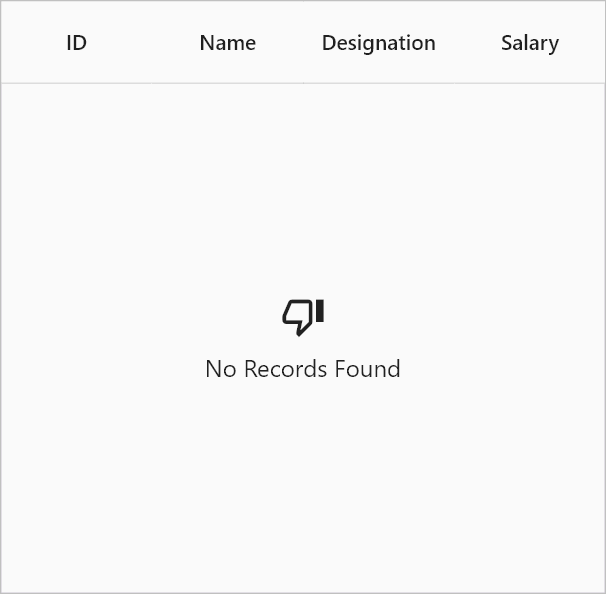

# Placeholder in Flutter Datagrid (SfDataGrid)

The DataGrid provides built-in support for displaying a placeholder when the row count is zero by setting the [SfDataGrid.placeholder]() property. When the `SfDataGrid.placeholder` is set, the DataGrid automatically shows the specified widget when there are no rows.

By default, the DataGrid does not display anything when there are no rows. However, when a `placeholder` is applied, the DataGrid will display the corresponding widget specified in the `placeholder` property.

The following example shows how to add a `placeholder` in DataGrid.


 

@override
Widget build(BuildContext context) {
  return Scaffold(
    appBar: AppBar(
      title: const Text('Syncfusion Flutter DataGrid'),
    ),
    body: SfDataGrid(
      source: employeeDataSource,
      columnWidthMode: ColumnWidthMode.auto,
      columns: <GridColumn>[
        GridColumn(
            columnName: 'id',
            label: Container(
                padding: EdgeInsets.all(16.0),
                alignment: Alignment.center,
                child: Text(
                  'ID',
                ))),
        GridColumn(
            columnName: 'name',
            label: Container(
                padding: EdgeInsets.all(8.0),
                alignment: Alignment.center,
                child: Text('Name'))),
        GridColumn(
            columnName: 'designation',
            label: Container(
                padding: EdgeInsets.all(8.0),
                alignment: Alignment.center,
                child: Text(
                  'Designation',
                  overflow: TextOverflow.ellipsis,
                ))),
        GridColumn(
            columnName: 'salary',
            label: Container(
                padding: EdgeInsets.all(8.0),
                alignment: Alignment.center,
                child: Text('Salary'))),
      ],
      placeholder: Center(
        child: Column(
          mainAxisSize: MainAxisSize.min,
          children: [
            Icon(Icons.thumb_down_alt_outlined, size: 30),
            SizedBox(height: 8),
            Text('No Records Found', style: TextStyle(fontSize: 16)),
          ],
        ),
      ),
    ),
  );
}




