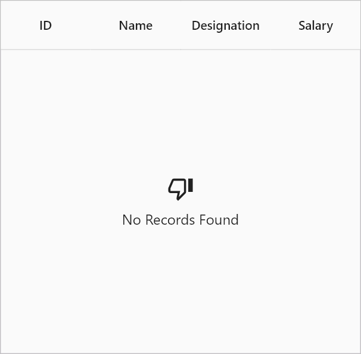

# Placeholder in Flutter Data Grid

The `SfDataGrid` provides built-in support for displaying a placeholder when the data source is empty by setting the [SfDataGrid.placeholder](https://pub.dev/documentation/syncfusion_flutter_datagrid/latest/datagrid/SfDataGrid/placeholder.html) property. When the `SfDataGrid.placeholder` is set, the DataGrid automatically shows the specified widget in the scroll view area. By default, the `SfDataGrid` does not display anything when the data source is empty.

The following example shows how to add a `placeholder` in SfDataGrid:


 

  @override
  Widget build(BuildContext context) {
    return Scaffold(
      appBar: AppBar(
        title: const Text('Syncfusion Flutter Data Grid'),
      ),
      body: SfDataGrid(
        source: employeeDataSource,
        columnWidthMode: ColumnWidthMode.auto,
        columns: <GridColumn>[
          GridColumn(
            columnName: 'id',
            label: Container(
              padding: EdgeInsets.all(16.0),
              alignment: Alignment.center,
              child: Text('ID'),
            ),
          ),
          GridColumn(
            columnName: 'name',
            label: Container(
              padding: EdgeInsets.all(8.0),
              alignment: Alignment.center,
              child: Text('Name'),
            ),
          ),
          GridColumn(
            columnName: 'designation',
            label: Container(
              padding: EdgeInsets.all(8.0),
              alignment: Alignment.center,
              child: Text(
                'Designation',
                overflow: TextOverflow.ellipsis,
              ),
            ),
          ),
          GridColumn(
            columnName: 'salary',
            label: Container(
              padding: EdgeInsets.all(8.0),
              alignment: Alignment.center,
              child: Text('Salary'),
            ),
          ),
        ],
        placeholder: Center(
          child: Column(
            mainAxisSize: MainAxisSize.min,
            children: [
              Icon(Icons.thumb_down_alt_outlined, size: 30),
              SizedBox(height: 8),
              Text(
                'No Records Found',
                style: TextStyle(fontSize: 16),
              ),
            ],
          ),
        ),
      ),
    );
  }




