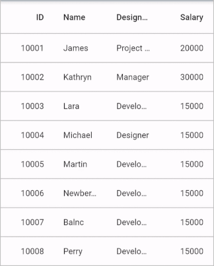
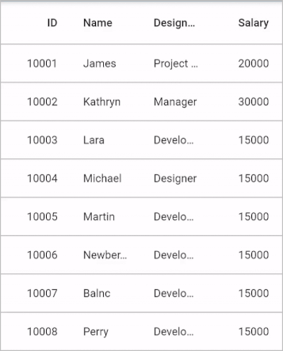
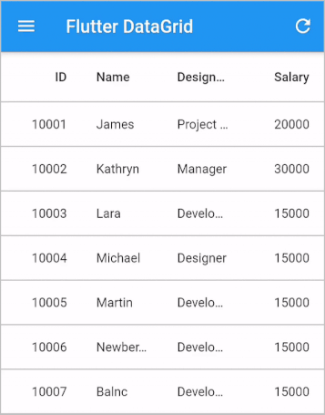

# Pull to Refresh in Flutter DataGrid (SfDataGrid)

The SfDataGrid provides support to add more data at runtime by using the pull-to-refresh feature. You can enable the pull-to-refresh option by setting the [SfDataGrid.allowPullToRefresh](https://pub.dev/documentation/syncfusion_flutter_datagrid/latest/datagrid/SfDataGrid/allowPullToRefresh.html) property to `true` and overriding the [DataGridSource.handleRefresh](https://pub.dev/documentation/syncfusion_flutter_datagrid/latest/datagrid/DataGridSource/handleRefresh.html) method to add new data to the data source at runtime, then notify the data grid about the changes.

> **Note:** This feature requires the `syncfusion_flutter_datagrid` package. Ensure you have added it to your `pubspec.yaml` file. Pull-to-refresh is supported on Flutter 2.0 and above.


 

import 'dart:math';
import 'package:flutter/material.dart';
import 'package:syncfusion_flutter_datagrid/datagrid.dart';

class Employee {
  final int id;
  final String name;
  final String designation;
  final int salary;

  Employee(
    this.id,
    this.name,
    this.designation,
    this.salary,
  );
}

class PullToRefreshDemo extends StatefulWidget {
  @override
  State<PullToRefreshDemo> createState() => _PullToRefreshDemoState();
}

class _PullToRefreshDemoState extends State<PullToRefreshDemo> {
  late EmployeeDataSource _employeeDataSource;

  @override
  void initState() {
    super.initState();
    _employeeDataSource = EmployeeDataSource();
  }

  @override
  Widget build(BuildContext context) {
    return SfDataGrid(
      allowPullToRefresh: true,
      source: _employeeDataSource,
      columns: <GridColumn>[
        GridColumn(
            columnName: 'id',
            label: Container(
                padding: EdgeInsets.symmetric(horizontal: 16.0),
                alignment: Alignment.centerRight,
                child: Text(
                  'ID',
                  overflow: TextOverflow.ellipsis,
                ))),
        GridColumn(
            columnName: 'name',
            label: Container(
                padding: EdgeInsets.symmetric(horizontal: 16.0),
                alignment: Alignment.centerLeft,
                child: Text(
                  'Name',
                  overflow: TextOverflow.ellipsis,
                ))),
        GridColumn(
            columnName: 'designation',
            label: Container(
                padding: EdgeInsets.symmetric(horizontal: 16.0),
                alignment: Alignment.centerLeft,
                child: Text(
                  'Designation',
                  overflow: TextOverflow.ellipsis,
                ))),
        GridColumn(
            columnName: 'salary',
            label: Container(
                padding: EdgeInsets.symmetric(horizontal: 16.0),
                alignment: Alignment.centerRight,
                child: Text(
                  'Salary',
                  overflow: TextOverflow.ellipsis,
                ))),
      ],
    );
  }
}

class EmployeeDataSource extends DataGridSource {
  late List<Employee> _employees = [];

  EmployeeDataSource() {
    _initializeEmployees();
    buildDataGridRows();
  }

  void _initializeEmployees() {
    _employees = [
      Employee(1001, 'Welli', 'Project Lead', 20000),
      Employee(1002, 'Blonp', 'Developer', 18000),
      Employee(1003, 'Folko', 'Manager', 22000),
      Employee(1004, 'Furip', 'Designer', 17000),
      Employee(1005, 'Folig', 'System Analyst', 19000),
      Employee(1006, 'Picco', 'CEO', 30000),
    ];
  }

  List<DataGridRow> dataGridRows = [];

  @override
  List<DataGridRow> get rows => dataGridRows;

  @override
  DataGridRowAdapter? buildRow(DataGridRow row) {
    return DataGridRowAdapter(
        cells: row.getCells().map<Widget>((dataGridCell) {
      return Container(
          alignment: (dataGridCell.columnName == 'id' ||
                  dataGridCell.columnName == 'salary')
              ? Alignment.centerRight
              : Alignment.centerLeft,
          padding: EdgeInsets.symmetric(horizontal: 16.0),
          child: Text(
            dataGridCell.value.toString(),
            overflow: TextOverflow.ellipsis,
          ));
    }).toList());
  }

  @override
  Future<void> handleRefresh() async {
    // Simulate network delay for fetching new data from server
    await Future.delayed(Duration(seconds: 2));
    _addMoreRows(_employees, 15);
    buildDataGridRows();
    notifyListeners();
  }

  void buildDataGridRows() {
    dataGridRows = _employees
        .map<DataGridRow>((dataGridRow) => DataGridRow(cells: [
              DataGridCell<int>(columnName: 'id', value: dataGridRow.id),
              DataGridCell<String>(columnName: 'name', value: dataGridRow.name),
              DataGridCell<String>(
                  columnName: 'designation', value: dataGridRow.designation),
              DataGridCell<int>(
                  columnName: 'salary', value: dataGridRow.salary),
            ]))
        .toList();
  }

  void _addMoreRows(List<Employee> employees, int count) {
    final Random random = Random();
    final startIndex = employees.isNotEmpty ? employees.length : 0;
    final endIndex = startIndex + count;
    for (int i = startIndex; i < endIndex; i++) {
      employees.add(Employee(
        1000 + i,
        _names[random.nextInt(_names.length)],
        _designation[random.nextInt(_designation.length)],
        10000 + random.nextInt(10000),
      ));
    }
  }

  final List<String> _names = <String>[
    'Welli',
    'Blonp',
    'Folko',
    'Furip',
    'Folig',
    'Picco',
    'Frans',
    'Warth',
    'Linod',
    'Simop',
    'Merep',
    'Riscu',
    'Seves',
    'Vaffe',
    'Alfki'
  ];

  final List<String> _designation = <String>[
    'Project Lead',
    'Developer',
    'Manager',
    'Designer',
    'System Analyst',
    'CEO'
  ];
}




Download the demo application from [GitHub](https://github.com/SyncfusionExamples/pull-to-refresh-support-in-flutter-datatable-sfdatagrid).

## Customizing the refresh indicator

SfDataGrid displays Flutter's [RefreshIndicator](https://api.flutter.dev/flutter/material/RefreshIndicator-class.html) during pull-to-refresh actions. You can customize the refresh indicator by using the [SfDataGrid.refreshIndicatorStrokeWidth](https://pub.dev/documentation/syncfusion_flutter_datagrid/latest/datagrid/SfDataGrid/refreshIndicatorStrokeWidth.html) and [SfDataGrid.refreshIndicatorDisplacement](https://pub.dev/documentation/syncfusion_flutter_datagrid/latest/datagrid/SfDataGrid/refreshIndicatorDisplacement.html) properties.

To set the indicator's color and background color, use the [ColorScheme](https://api.flutter.dev/flutter/material/ColorScheme-class.html) properties within [ThemeData](https://api.flutter.dev/flutter/material/ThemeData-class.html). The `primary` color in ColorScheme controls the indicator's color.

> **Note:** The deprecated `ThemeData.accentColor` property has been replaced with `ColorScheme.primary` in Flutter 3.0+. Use ColorScheme for modern Flutter applications.


 

import 'package:flutter/material.dart';
import 'package:syncfusion_flutter_datagrid/datagrid.dart';

class CustomRefreshIndicatorDemo extends StatefulWidget {
  @override
  State<CustomRefreshIndicatorDemo> createState() => _CustomRefreshIndicatorDemoState();
}

class _CustomRefreshIndicatorDemoState extends State<CustomRefreshIndicatorDemo> {
  late EmployeeDataSource _employeeDataSource;

  @override
  void initState() {
    super.initState();
    _employeeDataSource = EmployeeDataSource();
  }

  @override
  Widget build(BuildContext context) {
    return Theme(
        data: ThemeData(
              brightness: Brightness.light,
              scaffoldBackgroundColor: Colors.white,
              colorScheme: const ColorScheme.light(
                  primary: Colors.blue,
                  surface: Colors.lightBlue)),
        child: SfDataGrid(
            allowPullToRefresh: true,
            source: _employeeDataSource,
            refreshIndicatorStrokeWidth: 3.0,
            refreshIndicatorDisplacement: 60.0,
            columns: <GridColumn>[
              GridColumn(
                  columnName: 'id',
                  label: Container(
                      padding: EdgeInsets.symmetric(horizontal: 16.0),
                      alignment: Alignment.centerRight,
                      child: Text(
                        'ID',
                        overflow: TextOverflow.ellipsis,
                      ))),
              GridColumn(
                  columnName: 'name',
                  label: Container(
                      padding: EdgeInsets.symmetric(horizontal: 16.0),
                      alignment: Alignment.centerLeft,
                      child: Text(
                        'Name',
                        overflow: TextOverflow.ellipsis,
                      ))),
              GridColumn(
                  columnName: 'designation',
                  label: Container(
                      padding: EdgeInsets.symmetric(horizontal: 16.0),
                      alignment: Alignment.centerLeft,
                      child: Text(
                        'Designation',
                        overflow: TextOverflow.ellipsis,
                      ))),
              GridColumn(
                  columnName: 'salary',
                  label: Container(
                      padding: EdgeInsets.symmetric(horizontal: 16.0),
                      alignment: Alignment.centerRight,
                      child: Text(
                        'Salary',
                        overflow: TextOverflow.ellipsis,
                      ))),
            ]));
  }
}




Download the demo application from [GitHub](https://github.com/SyncfusionExamples/how-to-customize-the-refresh-indicator-appearance-in-flutter-datatable-sfdatagrid).

## Programmatic Pull to Refresh

You can trigger data refresh programmatically using the [SfDataGridState.refresh()](https://pub.dev/documentation/syncfusion_flutter_datagrid/latest/datagrid/SfDataGridState/refresh.html) method. By default, the refresh indicator is displayed during the refresh operation. To refresh data without showing the refresh indicator, pass `false` to the `showRefreshIndicator` parameter.

The `refresh()` method calls the [DataGridSource.handleRefresh()](https://pub.dev/documentation/syncfusion_flutter_datagrid/latest/datagrid/DataGridSource/handleRefresh.html) method, which is a `Future<void>` that returns when the refresh operation completes. If an exception occurs during `handleRefresh()`, the data grid will handle it gracefully and the refresh state will be reset.

> **Note:** Use a `GlobalKey<SfDataGridState>` to access the refresh method from outside the SfDataGrid widget.


 

import 'package:flutter/material.dart';
import 'package:syncfusion_flutter_datagrid/datagrid.dart';

class ProgrammaticRefreshDemo extends StatefulWidget {
  @override
  State<ProgrammaticRefreshDemo> createState() => _ProgrammaticRefreshDemoState();
}

class _ProgrammaticRefreshDemoState extends State<ProgrammaticRefreshDemo> {
  late EmployeeDataSource _employeeDataSource;
  final GlobalKey<SfDataGridState> _dataGridKey = GlobalKey<SfDataGridState>();

  @override
  void initState() {
    super.initState();
    _employeeDataSource = EmployeeDataSource();
  }

  Future<void> _onRefreshPressed() async {
    try {
      // Refresh with indicator
      await _dataGridKey.currentState!.refresh();
    } catch (e) {
      ScaffoldMessenger.of(context).showSnackBar(
        SnackBar(content: Text('Error refreshing data: $e')),
      );
    }
  }

  Future<void> _onSilentRefreshPressed() async {
    try {
      // Refresh without showing indicator
      await _dataGridKey.currentState!.refresh(showRefreshIndicator: false);
    } catch (e) {
      ScaffoldMessenger.of(context).showSnackBar(
        SnackBar(content: Text('Error refreshing data: $e')),
      );
    }
  }

  @override
  Widget build(BuildContext context) {
    return Scaffold(
        body: SfDataGrid(
          key: _dataGridKey,
          allowPullToRefresh: true,
          source: _employeeDataSource,
          columns: <GridColumn>[
            GridColumn(
                columnName: 'id',
                label: Container(
                    padding: EdgeInsets.symmetric(horizontal: 16.0),
                    alignment: Alignment.centerRight,
                    child: Text(
                      'ID',
                      overflow: TextOverflow.ellipsis,
                    ))),
            GridColumn(
                columnName: 'name',
                label: Container(
                    padding: EdgeInsets.symmetric(horizontal: 16.0),
                    alignment: Alignment.centerLeft,
                    child: Text(
                      'Name',
                      overflow: TextOverflow.ellipsis,
                    ))),
            GridColumn(
                columnName: 'designation',
                label: Container(
                    padding: EdgeInsets.symmetric(horizontal: 16.0),
                    alignment: Alignment.centerLeft,
                    child: Text(
                      'Designation',
                      overflow: TextOverflow.ellipsis,
                    ))),
            GridColumn(
                columnName: 'salary',
                label: Container(
                    padding: EdgeInsets.symmetric(horizontal: 16.0),
                    alignment: Alignment.centerRight,
                    child: Text(
                      'Salary',
                      overflow: TextOverflow.ellipsis,
                    ))),
          ],
        ),
        floatingActionButton: Column(
          mainAxisAlignment: MainAxisAlignment.end,
          children: [
            FloatingActionButton(
                heroTag: 'refresh_with_indicator',
                child: Icon(Icons.refresh),
                onPressed: _onRefreshPressed),
            SizedBox(height: 10),
            FloatingActionButton(
                heroTag: 'refresh_without_indicator',
                child: Icon(Icons.cloud_download),
                onPressed: _onSilentRefreshPressed),
          ],
        ));
  }
}




Download the demo application from [GitHub](https://github.com/SyncfusionExamples/how-to-perform-pull-to-refresh-programmatically-in-flutter-datatable-sfdatagrid).

