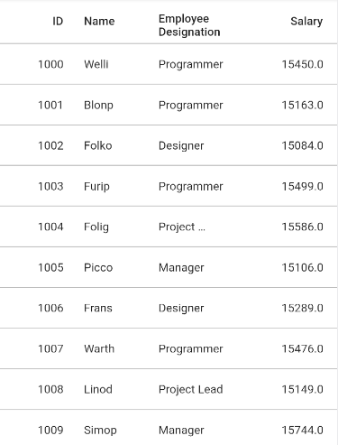

# Row Height Customization in Flutter DataGrid (SfDataGrid)

This section explains about options to customize the header row height and the row height of all the grid rows or particular row based on your requirements.

## Set height for header row

[SfDataGrid](https://pub.dev/documentation/syncfusion_flutter_datagrid/latest/datagrid/SfDataGrid-class.html) allows you to customize the height of the header row by using the [headerRowHeight](https://pub.dev/documentation/syncfusion_flutter_datagrid/latest/datagrid/SfDataGrid/headerRowHeight.html) property.


 

@override
Widget build(BuildContext context) {
  return Scaffold(
      body: SfDataGrid(
    source: _employeeDatasource,
    headerRowHeight: 70,
    columns: <GridColumn>[
      GridNumericColumn(mappingName: 'id')..headerText = 'ID',
      GridTextColumn(mappingName: 'name')..headerText = 'Name',
      GridTextColumn(mappingName: 'designation')..headerText = 'Designation',
      GridNumericColumn(mappingName: 'salary')..headerText = 'Salary',
    ],
  ));
}




## Set height for rows except header row

You can customize the height of the grid rows in `SfDataGrid` by using the [rowHeight](https://pub.dev/documentation/syncfusion_flutter_datagrid/latest/datagrid/SfDataGrid/rowHeight.html) property.


 
        
@override
Widget build(BuildContext context) {
  return Scaffold(
      body: SfDataGrid(
    source: _employeeDatasource,
    rowHeight: 60,
    columns: <GridColumn>[
      GridNumericColumn(mappingName: 'id')..headerText = 'ID',
      GridTextColumn(mappingName: 'name')..headerText = 'Name',
      GridTextColumn(mappingName: 'designation')..headerText = 'Designation',
      GridNumericColumn(mappingName: 'salary')..headerText = 'Salary',
    ],
  ));
}




## Fit row height based on its content

The row height can be fitted based on its content in [onQueryRowHeight](https://pub.dev/documentation/syncfusion_flutter_datagrid/latest/datagrid/SfDataGrid/onQueryRowHeight.html) callback using [getAutoRowHeight](https://pub.dev/documentation/syncfusion_flutter_datagrid/latest/datagrid/ColumnSizer/getAutoRowHeight.html) method which is available in [ColumnSizer](https://pub.dev/documentation/syncfusion_flutter_datagrid/latest/datagrid/ColumnSizer-class.html).

To access the `getAutoRowHeight` method, create an instance of `ColumnSizer`, set this instance in `columnSizer` property and use it in `onQueryRowHeight` callback. 

`ColumnSizer` objects are expected to be long-lived, not recreated with each build. 
 
>**NOTE**
    By default, the display text’s overflow behavior is ellipsis. So, to enable the wrap for the display text, set the `softWrap` property as `true` and `overflow` property as clip.


 

final ColumnSizer _columnSizer = ColumnSizer();

@override
Widget build(BuildContext context) {
  return Scaffold(
      body: SfDataGrid(
          source: _employeeDatasource,
          columnSizer: _columnSizer,
          onQueryRowHeight: (RowHeightDetails details) {
            double height = _columnSizer.getAutoRowHeight(details.rowIndex);
            return height;
          },
          columns: <GridColumn>[
        GridTextColumn(mappingName: 'id')
          ..softWrap = true
          ..overflow = TextOverflow.clip
          ..headerText = 'ID',
        GridTextColumn(mappingName: 'contactName')
          ..softWrap = true
          ..overflow = TextOverflow.clip
          ..headerText = 'Contact Name',
        GridTextColumn(mappingName: 'companyName')
          ..softWrap = true
          ..overflow = TextOverflow.clip
          ..headerText = 'Company Name',
        GridTextColumn(mappingName: 'city')
          ..softWrap = true
          ..overflow = TextOverflow.clip
          ..headerText = 'City',
        GridTextColumn(mappingName: 'address')
          ..softWrap = true
          ..overflow = TextOverflow.clip
          ..headerText = 'Address',
        GridTextColumn(mappingName: 'designation')
          ..softWrap = true
          ..overflow = TextOverflow.clip
          ..headerText = 'Designation',
        GridTextColumn(mappingName: 'country')
          ..softWrap = true
          ..overflow = TextOverflow.clip
          ..headerText = 'Country',
      ]));
}




### Auto fit row height options

#### Exclude the certain columns from auto-fit row calculation
                
By default, `getAutoRowHeight` method calculates the row height based on all columns. To skip the specific columns from the row height calculation, add that columns to the `excludeColumns` parameter in `getAutoRowHeight` method.


 

final List<String> _excludeColumns = [
  'designation',
  'address',
  'city',
];

final ColumnSizer _columnSizer = ColumnSizer();

@override
Widget build(BuildContext context) {
  return Scaffold(
      body: SfDataGrid(
          source: _autoRowHeightDataGridSource,
          columnSizer: _columnSizer,
          onQueryRowHeight: (RowHeightDetails details) {
            final double height = _columnSizer.getAutoRowHeight(details.rowIndex,
                excludedColumns: _excludeColumns);
            return height;
          },
          columns: <GridColumn>[
        GridTextColumn(mappingName: 'id')
          ..softWrap = true
          ..overflow = TextOverflow.clip
          ..headerText = 'ID',
        GridTextColumn(mappingName: 'contactName')
          ..softWrap = true
          ..overflow = TextOverflow.clip
          ..headerText = 'Contact Name',
        GridTextColumn(mappingName: 'companyName')
          ..softWrap = true
          ..overflow = TextOverflow.clip
          ..headerText = 'Company Name',
        GridTextColumn(mappingName: 'address')
          ..softWrap = true
          ..overflow = TextOverflow.clip
          ..headerText = 'Address',
        GridTextColumn(mappingName: 'city')
          ..softWrap = true
          ..overflow = TextOverflow.clip
          ..headerText = 'City',
        GridTextColumn(mappingName: 'designation')
          ..softWrap = true
          ..overflow = TextOverflow.clip
          ..headerText = 'Designation',
        GridTextColumn(mappingName: 'country')
          ..softWrap = true
          ..overflow = TextOverflow.clip
          ..headerText = 'Country',
      ]));
}




#### Include the hidden columns in auto-fit row calculation

The hidden columns can also be considered for the row height calculation by using the `canIncludeHiddenColumns` parameter in 
`getAutoRowHeight` method.


 

final ColumnSizer _columnSizer = ColumnSizer();

@override
Widget build(BuildContext context) {
  return Scaffold(
      body: SfDataGrid(
          source: _autoRowHeightDataGridSource,
          columnSizer: _columnSizer,
          onQueryRowHeight: (RowHeightDetails details) {
            final double height = _columnSizer.getAutoRowHeight(details.rowIndex,
                canIncludeHiddenColumns: true);
            return height;
          },
          columns: <GridColumn>[
        GridTextColumn(mappingName: 'id')
          ..softWrap = true
          ..overflow = TextOverflow.clip
          ..headerText = 'ID',
        GridTextColumn(mappingName: 'contactName')
          ..softWrap = true
          ..overflow = TextOverflow.clip
          ..headerText = 'Contact Name',
        GridTextColumn(mappingName: 'companyName')
          ..softWrap = true
          ..overflow = TextOverflow.clip
          ..headerText = 'Company Name',
        GridTextColumn(mappingName: 'country')
          ..softWrap = true
          ..overflow = TextOverflow.clip
          ..headerText = 'Country',
        GridTextColumn(mappingName: 'address')
          ..softWrap = true
          ..visible = false
          ..overflow = TextOverflow.clip
          ..headerText = 'Address',
        GridTextColumn(mappingName: 'city')
          ..softWrap = true
          ..visible = false
          ..overflow = TextOverflow.clip
          ..headerText = 'City',
        GridTextColumn(mappingName: 'designation')
          ..softWrap = true
          ..visible = false
          ..overflow = TextOverflow.clip
          ..headerText = 'Designation',
      ]));
}




## Fit header row height based on its content

The datagrid allows you to customize the height of the header row based on its content using the `onQueryRowHeight` callback and  getAutoRowHeight method which is available in ColumnSizer.

>**NOTE**
   By default, the header text’s overflow behavior is ellipsis. So, to enable the wrap for the display text, set the [headerTextSoftWrap](https://pub.dev/documentation/syncfusion_flutter_datagrid/latest/datagrid/GridColumn/headerTextSoftWrap.html) property as true and [headerTextOverflow](https://pub.dev/documentation/syncfusion_flutter_datagrid/latest/datagrid/GridColumn/headerTextOverflow.html) property as clip.


 

final ColumnSizer _columnSizer = ColumnSizer();
        
@override
Widget build(BuildContext context) {
  return Scaffold(
      body: SfDataGrid(
    source: _employeeDatasource,
    columnSizer: _columnSizer,
    onQueryRowHeight: (RowHeightDetails details) {
      final double height = _columnSizer.getAutoRowHeight(details.rowIndex);
      // The header row index.
      if(details.rowIndex == 0) {
        return height;
      }
      return 49.0;
    },
    columns: <GridColumn>[
      GridNumericColumn(mappingName: 'id')..headerText = 'ID',
      GridTextColumn(mappingName: 'name')..headerText = 'Name',
      GridTextColumn(mappingName: 'designation')
        ..headerTextSoftWrap = true,
        ..headerTextOverflow = TextOverflow.clip
        ..headerText = 'Employee Designation',
      GridNumericColumn(mappingName: 'salary')..headerText = 'Salary',
    ],
  ));
}




## Refresh row height for specific row

The `SfDataGrid` allows you to update or refresh specific row and it's height when 
an underlying data is updated.

You can refresh a specific row and its height by using the [DataGridController.refreshRow](https://pub.dev/documentation/syncfusion_flutter_datagrid/latest/datagrid/DataGridController/refreshRow.html) method. This method has following two arguments,

* **rowIndex**- Specify the required row index which is required to refresh. If you specify this, the data alone will be refreshed for a row.

* **recalculateRowHeight** - Decides whether a height of a row should be refreshed along with the data.

If you call `refreshRow` method, `onQueryRowHeight` callback will called for that specific row. So, auto-calculation of height can be recalculated for that row.

In the below example, row data is updated when the `refreshRow` is called in `onPressed` callback of the `FlatButton`.


 

final List<Employee> _employees = <Employee>[];

final EmployeeDataSource _employeeDataSource = EmployeeDataSource();

final DataGridController _controller = DataGridController();

final ColumnSizer _columnSizer = ColumnSizer();

@override
Widget build(BuildContext context) {
  return Scaffold(
    appBar: AppBar(
      title: const Text('Syncfusion Flutter DataGrid'),
    ),
    body: Column(
      children: [
        FlatButton(
          child: const Text('Update cell value),
              onPressed: () {
                _employees[0].id=1010;
                _employeeData[0].name = 'Maria Anders';
                _employeeData[0].designation = 'Sales Representative';
                _employees[0].salary = 25000;
                _controller.refreshRow(0);
              }),
          SfDataGrid(
            source: _employeeDataSource,
            controller: _controller,
            columnSizer: _columnSizer,
            onQueryRowHeight: (RowHeightDetails details) {
                    return _columnSizer.getAutoRowHeight(details.rowIndex);
              },
            columns: <GridColumn>[
              GridNumericColumn(mappingName: 'id', headerText: 'ID'),
              GridTextColumn(mappingName: 'name', headerText: 'Name'),
              GridTextColumn(
                  mappingName: 'designation', headerText: 'Designation'),
              GridNumericColumn(mappingName: 'salary', headerText: 'Salary'),
            ],
          ),
        ],
      ),
    );
  }




In the below example, row data is refreshed along with its row height when the `refreshRow` is called in `onPressed` callback of the `FlatButton`.


 

final List<Employee> _employees = <Employee>[];

final EmployeeDataSource _employeeDataSource = EmployeeDataSource();

final DataGridController _controller = DataGridController();

final ColumnSizer _columnSizer = ColumnSizer();

@override
Widget build(BuildContext context) {
  return Scaffold(
    appBar: AppBar(
      title: const Text('Syncfusion Flutter DataGrid'),
    ),
    body: Column(
      children: [
        FlatButton(
          child: const Text('Update cell value),
              onPressed: () {
                _employees[0].id=1010;
                _employeeData[0].name = 'Maria Anders';
                _employeeData[0].designation = 'Sales Representative';
                _employees[0].salary = 25000;
                _controller.refreshRow(0, recalculateRowHeight: true);
              }),
          SfDataGrid(
            source: _employeeDataSource,
            controller: _controller,
            columnSizer: _columnSizer,
            onQueryRowHeight: (RowHeightDetails details) {
                    return _columnSizer.getAutoRowHeight(details.rowIndex);
              },
            columns: <GridColumn>[
              GridNumericColumn(mappingName: 'id', headerText: 'ID'),
              GridTextColumn(mappingName: 'name', headerText: 'Name'),
              GridTextColumn(
                  mappingName: 'designation', headerText: 'Designation'),
              GridNumericColumn(mappingName: 'salary', headerText: 'Salary'),
            ],
          ),
        ],
      ),
    );
  }




   