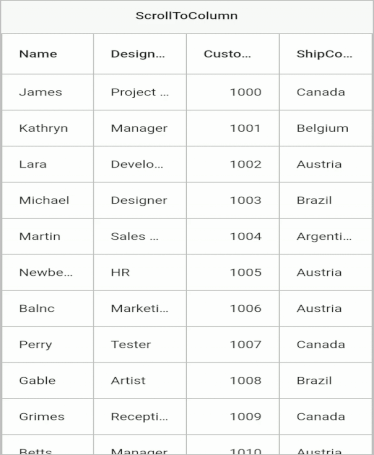
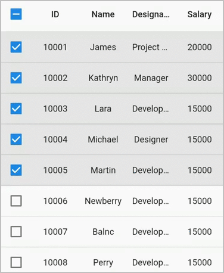

# Scrolling in Flutter DataGrid (SfDataGrid)

SfDataGrid provides support to scroll the content in both horizontal and vertical directions. 

## Show Scrollbars always

You can show horizontal and vertical scrollbars always by using the [SfDataGrid.isScrollbarAlwaysShown](https://pub.dev/documentation/syncfusion_flutter_datagrid/latest/datagrid/SfDataGrid/isScrollbarAlwaysShown.html) property. When the `isScrollbarAlwaysShown` is set to false, the scrollbar will be shown during scrolling and will fade out otherwise. When it is true, the scrollbar will always be visible and never fade out even after the scrolling.

N> The default value of `isScrollbarAlwaysShown` is false.




@override
Widget build(BuildContext context) {
  return Scaffold(
      body: SfDataGrid(
          source: _employeeDataSource,
          isScrollbarAlwaysShown: true,
          columns: [
        GridColumn(
            columnName: 'id',
            label: Container(
                padding: EdgeInsets.symmetric(horizontal: 16.0),
                alignment: Alignment.centerRight,
                child: Text(
                  'ID',
                  overflow: TextOverflow.ellipsis,
                ))),
        GridColumn(
            columnName: 'name',
            label: Container(
                padding: EdgeInsets.symmetric(horizontal: 16.0),
                alignment: Alignment.centerLeft,
                child: Text(
                  'Name',
                  overflow: TextOverflow.ellipsis,
                ))),
        GridColumn(
            columnName: 'designation',
            label: Container(
                padding: EdgeInsets.symmetric(horizontal: 16.0),
                alignment: Alignment.centerLeft,
                child: Text(
                  'Designation',
                  overflow: TextOverflow.ellipsis,
                ))),
        GridColumn(
            columnName: 'salary',
            label: Container(
                padding: EdgeInsets.symmetric(horizontal: 16.0),
                alignment: Alignment.centerRight,
                child: Text(
                  'Salary',
                  overflow: TextOverflow.ellipsis,
                ))),
      ]));
}




## Change scrollbars visibility

You can control the visibility of horizontal and vertical scrollbars in the DataGrid by setting the [SfDataGrid.showVerticalScrollbar](https://pub.dev/documentation/syncfusion_flutter_datagrid/latest/datagrid/SfDataGrid/showVerticalScrollbar.html) and [SfDataGrid.showHorizontalScrollbar](https://pub.dev/documentation/syncfusion_flutter_datagrid/latest/datagrid/SfDataGrid/showHorizontalScrollbar.html) properties. To disable the default scrollbar of the `SingleChildScrollView`, wrap the `ScrollConfiguration` as the parent for the `SfDataGrid` and set the scrollbars to false.

N> The default value of `showVerticalScrollbar` and `showHorizontalScrollbar` is true.

The following code snippets demonstrate how to hide the scrollbars in the DataGrid:




@override
Widget build(BuildContext context) {
  return Scaffold(
    appBar: AppBar(
      title: const Text('Syncfusion Flutter DataGrid'),
    ),
    body: ScrollConfiguration(
      behavior: const ScrollBehavior().copyWith(scrollbars: false),
      child: SfDataGrid(
        source: employeeDataSource,
        showVerticalScrollbar: false,
        showHorizontalScrollbar: false,
        isScrollbarAlwaysShown: true,
        columns: <GridColumn>[
          GridColumn(
              columnName: 'id',
              label: Container(
                  padding: EdgeInsets.all(16.0),
                  alignment: Alignment.centerRight,
                  child: Text(
                    'ID',
                  ))),
          GridColumn(
              columnName: 'name',
              label: Container(
                  padding: EdgeInsets.all(8.0),
                  alignment: Alignment.centerLeft,
                  child: Text('Name'))),
          GridColumn(
              columnName: 'designation',
              label: Container(
                  padding: EdgeInsets.all(8.0),
                  alignment: Alignment.centerLeft,
                  child: Text(
                    'Designation',
                    overflow: TextOverflow.ellipsis,
                  ))),
          GridColumn(
              columnName: 'salary',
              label: Container(
                  padding: EdgeInsets.all(8.0),
                  alignment: Alignment.centerRight,
                  child: Text('Salary'))),
        ],
      ),
    ),
  );
}




## Setting scroll physics for scroll bars

SfDataGrid allows you to set the [ScrollPhysics](https://api.flutter.dev/flutter/widgets/ScrollPhysics-class.html) for horizontal and vertical scrollbars to control how the scroll view should respond to user input by using [horizontalScrollPhysics](https://pub.dev/documentation/syncfusion_flutter_datagrid/latest/datagrid/SfDataGrid/horizontalScrollPhysics.html) and [verticalScrollPhysics](https://pub.dev/documentation/syncfusion_flutter_datagrid/latest/datagrid/SfDataGrid/verticalScrollPhysics.html) properties respectively.

N> The default values of `horizontalScrollPhysics` and `verticalScrollPhysics` properties are `AlwaysScrollableScrollPhysics()`.

The following example shows how to disable the horizontal and vertical scrolling by setting `NeverScrollableScrollPhysics()`.




@override
Widget build(BuildContext context) {
  return Scaffold(
      body: SfDataGrid(
          source: _employeeDataSource,
          horizontalScrollPhysics: NeverScrollableScrollPhysics(),
          verticalScrollPhysics: NeverScrollableScrollPhysics(),
          columns: [
        GridColumn(
            columnName: 'id',
            label: Container(
                padding: EdgeInsets.symmetric(horizontal: 16.0),
                alignment: Alignment.centerRight,
                child: Text(
                  'ID',
                  overflow: TextOverflow.ellipsis,
                ))),
        GridColumn(
            columnName: 'name',
            label: Container(
                padding: EdgeInsets.symmetric(horizontal: 16.0),
                alignment: Alignment.centerLeft,
                child: Text(
                  'Name',
                  overflow: TextOverflow.ellipsis,
                ))),
        GridColumn(
            columnName: 'designation',
            label: Container(
                padding: EdgeInsets.symmetric(horizontal: 16.0),
                alignment: Alignment.centerLeft,
                child: Text(
                  'Designation',
                  overflow: TextOverflow.ellipsis,
                ))),
        GridColumn(
            columnName: 'salary',
            label: Container(
                padding: EdgeInsets.symmetric(horizontal: 16.0),
                alignment: Alignment.centerRight,
                child: Text(
                  'Salary',
                  overflow: TextOverflow.ellipsis,
                ))),
      ]));
}




## Programmatic scrolling

The Flutter DataTable provides support to scroll to a particular row and column index programmatically.

### Scroll to cell

Scroll programmatically to a particular cell can be achieved by passing the row and column index in the `scrollToCell` method. SfDataGrid allows to enable or disable the scrolling animation by passing `true` to the `canAnimate` parameter in the `scrollToCell` method. 

N> The default value of `canAnimate` is `false`.




final DataGridController _controller = DataGridController();

@override
Widget build(BuildContext context) {
  return Scaffold(
      body: Column(children: [
    TextButton(
        child: Text('ScrollToCell'),
        onPressed: () {
          _controller.scrollToCell(10, 1);
        }),
    Expanded(
        child: SfDataGrid(
            source: _employeeDataSource,
            defaultColumnWidth: 150,
            gridLinesVisibility: GridLinesVisibility.both,
            headerGridLinesVisibility: GridLinesVisibility.both,
            controller: _controller,
            columns: [
          GridColumn(
              columnName: 'id',
              label: Container(
                  padding: EdgeInsets.symmetric(horizontal: 16.0),
                  alignment: Alignment.centerRight,
                  child: Text(
                    'ID',
                    overflow: TextOverflow.ellipsis,
                  ))),
          GridColumn(
              columnName: 'name',
              label: Container(
                  padding: EdgeInsets.symmetric(horizontal: 16.0),
                  alignment: Alignment.centerLeft,
                  child: Text(
                    'Name',
                    overflow: TextOverflow.ellipsis,
                  ))),
          GridColumn(
              columnName: 'designation',
              label: Container(
                  padding: EdgeInsets.symmetric(horizontal: 16.0),
                  alignment: Alignment.centerLeft,
                  child: Text(
                    'Designation',
                    overflow: TextOverflow.ellipsis,
                  ))),
          GridColumn(
              columnName: 'salary',
              label: Container(
                  padding: EdgeInsets.symmetric(horizontal: 16.0),
                  alignment: Alignment.centerRight,
                  child: Text(
                    'Salary',
                    overflow: TextOverflow.ellipsis,
                  ))),
        ]))
  ]));
}




### Scroll to row

Scroll programmatically to a particular row by passing the row index in the `scrollToRow` method. SfDataGrid allows to enable or disable the scrolling animation by passing `true` to the `canAnimate` parameter in the `scrollToRow` method. 

N> The default value of `canAnimate` is `false`.




final DataGridController _controller = DataGridController();

@override
Widget build(BuildContext context) {
  return Scaffold(
      body: Column(children: [
    TextButton(
        child: Text('ScrollToRow'),
        onPressed: () {
           _controller.scrollToRow(10);
        }),
    Expanded(
        child: SfDataGrid(
            source: _employeeDataSource,
            defaultColumnWidth: 150,
            gridLinesVisibility: GridLinesVisibility.both,
            headerGridLinesVisibility: GridLinesVisibility.both,
            controller: _controller,
            columns: [
          GridColumn(
              columnName: 'id',
              label: Container(
                  padding: EdgeInsets.symmetric(horizontal: 16.0),
                  alignment: Alignment.centerRight,
                  child: Text(
                    'ID',
                    overflow: TextOverflow.ellipsis,
                  ))),
          GridColumn(
              columnName: 'name',
              label: Container(
                  padding: EdgeInsets.symmetric(horizontal: 16.0),
                  alignment: Alignment.centerLeft,
                  child: Text(
                    'Name',
                    overflow: TextOverflow.ellipsis,
                  ))),
          GridColumn(
              columnName: 'designation',
              label: Container(
                  padding: EdgeInsets.symmetric(horizontal: 16.0),
                  alignment: Alignment.centerLeft,
                  child: Text(
                    'Designation',
                    overflow: TextOverflow.ellipsis,
                  ))),
          GridColumn(
              columnName: 'salary',
              label: Container(
                  padding: EdgeInsets.symmetric(horizontal: 16.0),
                  alignment: Alignment.centerRight,
                  child: Text(
                    'Salary',
                    overflow: TextOverflow.ellipsis,
                  ))),
        ]))
  ]));
}




### Scroll to column

Scroll programmatically to a particular column by passing the column index in the `scrollToColumn` method. SfDataGrid allows to enable or disable the scrolling animation by passing `true` to the `canAnimate` parameter in the `scrollToColumn` method. 

N> The default value of `canAnimate` is `false`.




final DataGridController _controller = DataGridController();

@override
Widget build(BuildContext context) {
  return Scaffold(
      body: Column(children: [
    TextButton(
        child: Text('ScrollToColumn'),
        onPressed: () {
          _controller.scrollToColumn(1);
        }),
    Expanded(
        child: SfDataGrid(
            source: _employeeDataSource,
            defaultColumnWidth: 150,
            gridLinesVisibility: GridLinesVisibility.both,
            headerGridLinesVisibility: GridLinesVisibility.both,
            controller: _controller,
            columns: [
          GridColumn(
              columnName: 'id',
              label: Container(
                  padding: EdgeInsets.symmetric(horizontal: 16.0),
                  alignment: Alignment.centerRight,
                  child: Text(
                    'ID',
                    overflow: TextOverflow.ellipsis,
                  ))),
          GridColumn(
              columnName: 'name',
              label: Container(
                  padding: EdgeInsets.symmetric(horizontal: 16.0),
                  alignment: Alignment.centerLeft,
                  child: Text(
                    'Name',
                    overflow: TextOverflow.ellipsis,
                  ))),
          GridColumn(
              columnName: 'designation',
              label: Container(
                  padding: EdgeInsets.symmetric(horizontal: 16.0),
                  alignment: Alignment.centerLeft,
                  child: Text(
                    'Designation',
                    overflow: TextOverflow.ellipsis,
                  ))),
          GridColumn(
              columnName: 'salary',
              label: Container(
                  padding: EdgeInsets.symmetric(horizontal: 16.0),
                  alignment: Alignment.centerRight,
                  child: Text(
                    'Salary',
                    overflow: TextOverflow.ellipsis,
                  ))),
        ]))
  ]));
}




### Scroll to the specific position

The `SfDataGrid` allows positioning of the scrolled row or column in view programmatically by passing the `DataGridScrollPosition` to `rowPosition` and `columnPosition` arguments respectively in `scrollToCell` and `position` argument of the `scrollToRow` and `scrollToColumn` methods. The following are the four types of positions available.

`makeVisible`: Scroll to make a specified row/column visible in Datagrid. If the specified row/column is already in view, scrolling will not occur.
`start`: Scroll to make the row/column positioned at the start of the Datagrid.
`center`: Scroll to make the row/column positioned at the center of the Datagrid.
`end`: Scroll to make the row/column positioned at the end of the Datagrid.

N> The default value of `DataGridScrollPosition` is `Start`.




final DataGridController _controller = DataGridController();

@override
Widget build(BuildContext context) {
  return Scaffold(
      body: Column(children: [
    TextButton(
        child: Text('ScrollToCell'),
        onPressed: () {
          _controller.scrollToCell(10, 1,
              canAnimate: true,
              rowPosition: DataGridScrollPosition.start,
              columnPosition: DataGridScrollPosition.start);
        }),
    Expanded(
        child: SfDataGrid(
            source: _employeeDataSource,
            defaultColumnWidth: 150,
            gridLinesVisibility: GridLinesVisibility.both,
            headerGridLinesVisibility: GridLinesVisibility.both,
            controller: _controller,
            columns: [
          GridColumn(
              columnName: 'id',
              label: Container(
                  padding: EdgeInsets.symmetric(horizontal: 16.0),
                  alignment: Alignment.centerRight,
                  child: Text(
                    'ID',
                    overflow: TextOverflow.ellipsis,
                  ))),
          GridColumn(
              columnName: 'name',
              label: Container(
                  padding: EdgeInsets.symmetric(horizontal: 16.0),
                  alignment: Alignment.centerLeft,
                  child: Text(
                    'Name',
                    overflow: TextOverflow.ellipsis,
                  ))),
          GridColumn(
              columnName: 'designation',
              label: Container(
                  padding: EdgeInsets.symmetric(horizontal: 16.0),
                  alignment: Alignment.centerLeft,
                  child: Text(
                    'Designation',
                    overflow: TextOverflow.ellipsis,
                  ))),
          GridColumn(
              columnName: 'salary',
              label: Container(
                  padding: EdgeInsets.symmetric(horizontal: 16.0),
                  alignment: Alignment.centerRight,
                  child: Text(
                    'Salary',
                    overflow: TextOverflow.ellipsis,
                  ))),
        ]))
  ]));
}




### Scroll to the vertical offset

The Flutter DataTable supports scrolling programmatically to a particular vertical offset by passing the offset value to the `scrollToVerticalOffset` method. Also, it allows enabling the scrolling animation by passing `true` to the `canAnimate` parameter in the `scrollToVerticalOffset` method. 

N> The default value of `canAnimate` is `false`.




final DataGridController _controller = DataGridController();

@override
Widget build(BuildContext context) {
  return Scaffold(
      body: Column(children: [
    TextButton(
        child: Text('ScrollToVerticalOffset'),
        onPressed: () {
          _controller.scrollToVerticalOffset(500);
        }),
    Expanded(
        child: SfDataGrid(
            source: _employeeDataSource,
            defaultColumnWidth: 150,
            gridLinesVisibility: GridLinesVisibility.both,
            headerGridLinesVisibility: GridLinesVisibility.both,
            controller: _controller,
            columns: [
          GridColumn(
              columnName: 'id',
              label: Container(
                  padding: EdgeInsets.symmetric(horizontal: 16.0),
                  alignment: Alignment.centerRight,
                  child: Text(
                    'ID',
                    overflow: TextOverflow.ellipsis,
                  ))),
          GridColumn(
              columnName: 'name',
              label: Container(
                  padding: EdgeInsets.symmetric(horizontal: 16.0),
                  alignment: Alignment.centerLeft,
                  child: Text(
                    'Name',
                    overflow: TextOverflow.ellipsis,
                  ))),
          GridColumn(
              columnName: 'designation',
              label: Container(
                  padding: EdgeInsets.symmetric(horizontal: 16.0),
                  alignment: Alignment.centerLeft,
                  child: Text(
                    'Designation',
                    overflow: TextOverflow.ellipsis,
                  ))),
          GridColumn(
              columnName: 'salary',
              label: Container(
                  padding: EdgeInsets.symmetric(horizontal: 16.0),
                  alignment: Alignment.centerRight,
                  child: Text(
                    'Salary',
                    overflow: TextOverflow.ellipsis,
                  ))),
        ]))
  ]));
}




### Scroll to the horizontal offset

The Flutter DataTable supports scrolling programmatically to a particular horizontal offset by passing the offset value to the `scrollToHorizontalOffset` method. Also, it allows enabling the scrolling animation by passing `true` to the `canAnimate` parameter in the `scrollToHorizontalOffset` method. 

N> The default value of `canAnimate` is `false`.




final DataGridController _controller = DataGridController();

@override
Widget build(BuildContext context) {
  return Scaffold(
      body: Column(children: [
    TextButton(
        child: Text('ScrollToHorizontalOffset'),
        onPressed: () {
          _controller.scrollToHorizontalOffset(400);
        }),
    Expanded(
        child: SfDataGrid(
            source: _employeeDataSource,
            defaultColumnWidth: 150,
            gridLinesVisibility: GridLinesVisibility.both,
            headerGridLinesVisibility: GridLinesVisibility.both,
            controller: _controller,
            columns: [
          GridColumn(
              columnName: 'id',
              label: Container(
                  padding: EdgeInsets.symmetric(horizontal: 16.0),
                  alignment: Alignment.centerRight,
                  child: Text(
                    'ID',
                    overflow: TextOverflow.ellipsis,
                  ))),
          GridColumn(
              columnName: 'name',
              label: Container(
                  padding: EdgeInsets.symmetric(horizontal: 16.0),
                  alignment: Alignment.centerLeft,
                  child: Text(
                    'Name',
                    overflow: TextOverflow.ellipsis,
                  ))),
          GridColumn(
              columnName: 'designation',
              label: Container(
                  padding: EdgeInsets.symmetric(horizontal: 16.0),
                  alignment: Alignment.centerLeft,
                  child: Text(
                    'Designation',
                    overflow: TextOverflow.ellipsis,
                  ))),
          GridColumn(
              columnName: 'salary',
              label: Container(
                  padding: EdgeInsets.symmetric(horizontal: 16.0),
                  alignment: Alignment.centerRight,
                  child: Text(
                    'Salary',
                    overflow: TextOverflow.ellipsis,
                  ))),
        ]))
  ]));
}




N> The vertical and horizontal scrolled offset can be retrieved by using `DataGridController.verticalOffset` and `DataGridController.horizontalOffset` properties.

## Listen the scroll changes

Listen to the vertical and horizontal scroll changes by using the [verticalScrollController](https://pub.dev/documentation/syncfusion_flutter_datagrid/latest/datagrid/SfDataGrid/verticalScrollController.html) and the [horizontalScrollController](https://pub.dev/documentation/syncfusion_flutter_datagrid/latest/datagrid/SfDataGrid/horizontalScrollController.html) properties respectively. Set the listener in the `verticalScrollController` and the `horizontalScrollController` using the `addListener` method. By subscribing to this listener, the subscribed method in the sample level will be called on vertical or horizontal scrolling.

The following example demonstrates how to load more rows when vertical scrolling reaches 70% of the vertical maxScrollExtent,




import 'package:intl/intl.dart';

late EmployeeDataSource _employeeDataSource;
late ScrollController verticalScrollController;

void verticalListener() {
  if (_verticalScrollController.position.pixels >=
      _verticalScrollController.position.maxScrollExtent * (70 / 100)) {
    _employeeDataSource.loadMoreRows();
  }
}

@override
void initState() {
  super.initState();
  _employeeDataSource = _EmployeeDataSource();
  _verticalScrollController = ScrollController()..addListener(verticalListener);
}

@override
Widget build(BuildContext context) {
  return Scaffold(
    appBar: AppBar(
      title: Text('Flutter DataGrid Sample'),
    ),
    body: SfDataGrid(
        source: _employeeDataSource,
        verticalScrollController: _verticalScrollController,
        columnWidthMode: ColumnWidthMode.fill,
        columns: _getColumns()),
  );
}

class _EmployeeDataSource extends DataGridSource {
  _EmployeeDataSource() {
    loadEmployees(25);
  }

  List<Employee> employees = [];

  List<DataGridRow> dataGridRows = [];

  @override
  List<DataGridRow> get rows => dataGridRows;

  @override
  DataGridRowAdapter buildRow(DataGridRow row) {
    return DataGridRowAdapter(cells: [
      Container(
          padding: EdgeInsets.all(8),
          alignment: Alignment.centerRight,
          child: Text(row.getCells()[0].value.toString(),
              overflow: TextOverflow.ellipsis)),
      Container(
          padding: EdgeInsets.all(8),
          alignment: Alignment.centerRight,
          child: Text(row.getCells()[1].value.toString(),
              overflow: TextOverflow.ellipsis)),
      Container(
          padding: EdgeInsets.all(8),
          alignment: Alignment.centerLeft,
          child: Text(row.getCells()[2].value.toString(),
              overflow: TextOverflow.ellipsis)),
      Container(
          padding: EdgeInsets.all(8),
          alignment: Alignment.centerRight,
          child: Text(
              NumberFormat.currency(locale: 'en_US', symbol: '\$')
                  .format(row.getCells()[3].value)
                  .toString(),
              overflow: TextOverflow.ellipsis))
    ]);
  }

  void loadEmployees(int count) {
    final Random random = Random();
    final int startIndex = employees.isNotEmpty ? employees.length : 0,
        endIndex = startIndex + count;

    for (int i = startIndex; i < endIndex; i++) {
      var employee = Employee(
        1000 + i,
        1700 + i,
        names[i < names.length ? i : random.nextInt(names.length - 1)],
        random.nextInt(1000) + random.nextDouble(),
        cities[random.nextInt(cities.length - 1)],
        1500.0 + random.nextInt(100),
      );
      employees.add(employee);
      dataGridRows.add(employee.getDataGridRow);
    }
  }

  void loadMoreRows() {
    loadEmployees(15);
    notifyListeners();
  }
}




**NOTE**  
  Download the demo application from [GitHub](https://github.com/SyncfusionExamples/how-to-load-data-lazily-when-scrolling-reaches-70-in-flutter-datatable-sfdatagrid).

## Increase row cache limit

By default, rows are generated based on the viewport size, and these rows are reused while scrolling. Set the [SfDataGrid.rowsCacheExtent](https://pub.dev/documentation/syncfusion_flutter_datagrid/latest/datagrid/SfDataGrid/rowsCacheExtent.html) property to avoid the visible changes caused by re-using. For example, if you show the checkbox in a column without setting the rows using this property, checkbox state changes with animation can be seen when vertical scrolling is performed.

The `rowsCacheExtent` property will create the additional rows internally with the existing visible rows, which are already allocated based on viewport size. So, the number of rows that will be reused will increase.




  List<Employee> employees = <Employee>[];
  late EmployeeDataSource employeeDataSource;

  @override
  void initState() {
    super.initState();
    employees = getEmployeeData();
    employeeDataSource = EmployeeDataSource(employeeData: employees);
  }

  @override
  Widget build(BuildContext context) {
    return Scaffold(
      appBar: AppBar(
        title: const Text('Syncfusion Flutter DataGrid'),
      ),
      body: SfDataGrid(
        source: employeeDataSource,
        columnWidthMode: ColumnWidthMode.fill,
        showCheckboxColumn: true,
        selectionMode: SelectionMode.multiple,
        rowsCacheExtent: 10,
        columns: <GridColumn>[
          GridColumn(
              columnName: 'id',
              label: Container(
                  padding: EdgeInsets.all(16.0),
                  alignment: Alignment.center,
                  child: Text('ID'))),
          GridColumn(
              columnName: 'name',
              label: Container(
                  padding: EdgeInsets.all(8.0),
                  alignment: Alignment.center,
                  child: Text('Name'))),
          GridColumn(
              columnName: 'designation',
              label: Container(
                  padding: EdgeInsets.all(8.0),
                  alignment: Alignment.center,
                  child: Text('Designation', overflow: TextOverflow.ellipsis))),
          GridColumn(
              columnName: 'salary',
              label: Container(
                  padding: EdgeInsets.all(8.0),
                  alignment: Alignment.center,
                  child: Text('Salary'))),
        ],
      ),
    );
  }




## Set the height and width of DataGrid based on rows and columns available

If the height or width of the DataGrid is infinity, then DataGrid sets its height or width to 300 by default. Users can set the height or width based on the number of rows or columns available in DataGrid by using the [shrinkWrapRows](https://pub.dev/documentation/syncfusion_flutter_datagrid/latest/datagrid/SfDataGrid/shrinkWrapRows.html) or [shrinkWrapColumns](https://pub.dev/documentation/syncfusion_flutter_datagrid/latest/datagrid/SfDataGrid/shrinkWrapColumns.html) property, respectively.

>**NOTE**
       Shrink wrapping is significantly more expensive than setting the height and width manually.


 

import 'package:syncfusion_flutter_datagrid/datagrid.dart';

late EmployeeDataSource _employeeDataSource;

 @override
  Widget build(BuildContext context) {
    return LayoutBuilder(builder: (context, constraints) {
      return SingleChildScrollView(
        child: SfDataGrid(
          shrinkWrapColumns: true,
          shrinkWrapRows: true,
          source: _employeeDataSource,
          columns: <GridColumn>[
            GridColumn(
                columnName: 'id',
                label: Container(
                    padding: EdgeInsets.symmetric(horizontal: 16.0),
                    alignment: Alignment.centerRight,
                    child: Text(
                      'ID',
                      overflow: TextOverflow.ellipsis,
                    ))),
            GridColumn(
                columnName: 'name',
                label: Container(
                    padding: EdgeInsets.symmetric(horizontal: 16.0),
                    alignment: Alignment.centerLeft,
                    child: Text(
                      'Name',
                      overflow: TextOverflow.ellipsis,
                    ))),
            GridColumn(
                columnName: 'designation',
                label: Container(
                    padding: EdgeInsets.symmetric(horizontal: 16.0),
                    alignment: Alignment.centerLeft,
                    child: Text(
                      'Designation',
                      overflow: TextOverflow.ellipsis,
                    ))),
            GridColumn(
                columnName: 'salary',
                label: Container(
                    padding: EdgeInsets.symmetric(horizontal: 16.0),
                    alignment: Alignment.centerRight,
                    child: Text(
                      'Salary',
                      overflow: TextOverflow.ellipsis,
                    ))),
          ],
        ),
      );
    });
  }




## Retrieve the indices of visible rows and columns

In the SfDataGrid, you can obtain the starting and ending indices of the visible rows using the [DataGridController.getVisibleRowStartIndex](https://pub.dev/documentation/syncfusion_flutter_datagrid/latest/datagrid/DataGridController/getVisibleRowStartIndex.html) and [DataGridController.getVisibleRowEndIndex](https://pub.dev/documentation/syncfusion_flutter_datagrid/latest/datagrid/DataGridController/getVisibleRowEndIndex.html) methods, respectively, by specifying the needed `RowRegion`. Similarly, for the visible columns, you can retrieve the starting and ending indices using the [DataGridController.getVisibleColumnStartIndex](https://pub.dev/documentation/syncfusion_flutter_datagrid/latest/datagrid/DataGridController/getVisibleColumnStartIndex.html) and [DataGridController.getVisibleColumnEndIndex](https://pub.dev/documentation/syncfusion_flutter_datagrid/latest/datagrid/DataGridController/getVisibleColumnEndIndex.html) methods, respectively.




  DataGridController dataGridController = DataGridController();

  @override
  Widget build(BuildContext context) {
    return Scaffold(
      appBar: AppBar(title: const Text('Syncfusion Flutter DataGrid')),
      body: Column(children: [
        ElevatedButton(
            onPressed: () {
              int? startRowIndex =
                  dataGridController.getVisibleRowStartIndex(RowRegion.body);
              int? endRowIndex =
                  dataGridController.getVisibleRowEndIndex(RowRegion.body);
              int? startColumnIndex =
                  dataGridController.getVisibleColumnStartIndex(RowRegion.body);
              int? endColumnIndex =
                  dataGridController.getVisibleColumnEndIndex(RowRegion.body);
                  
              print('Start Row Index ${startRowIndex}');
              print('End Row Index ${endRowIndex}');
              print('Start Column Index ${startColumnIndex}');
              print('End Column Index ${endColumnIndex}');
            },
            child: Text('Get Visible Row and Column Index')),
        Expanded(
          child: SfDataGrid(
              source: employeeDataSource,
              controller: dataGridController,
              columns: <GridColumn>[
                GridColumn(
                    columnName: 'ID',
                    label: Container(
                        padding: EdgeInsets.all(8),
                        alignment: Alignment.center,
                        child: Text('ID'))),
                GridColumn(
                    columnName: 'Name',
                    label: Container(
                        padding: EdgeInsets.all(8),
                        alignment: Alignment.center,
                        child: Text('Name'))),
                GridColumn(
                    columnName: 'Designation',
                    label: Container(
                        padding: EdgeInsets.all(8),
                        alignment: Alignment.center,
                        child: Text('Designation',
                            overflow: TextOverflow.ellipsis))),
                GridColumn(
                    columnName: 'Salary',
                    label: Container(
                        padding: EdgeInsets.all(8),
                        alignment: Alignment.center,
                        child: Text('Salary'))),
              ]),
        ),
      ]),
    );
  }


