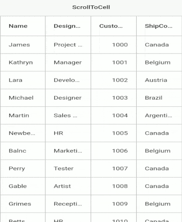
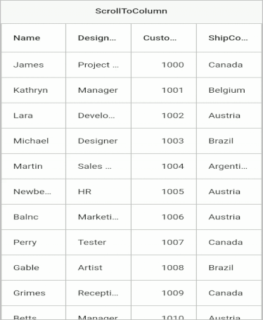
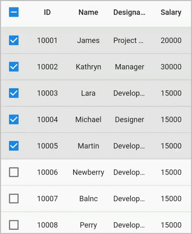

# Scrolling in Flutter DataGrid (SfDataGrid)

SfDataGrid provides support to scroll the content in both horizontal and vertical directions. 

## Show Scrollbars always

You can show horizontal and vertical scrollbars always by using the [SfDataGrid.isScrollbarAlwaysShown](https://pub.dev/documentation/syncfusion_flutter_datagrid/latest/datagrid/SfDataGrid/isScrollbarAlwaysShown.html) property. When the `isScrollbarAlwaysShown` is set to `false`, the scrollbar will be shown during scrolling and will fade out otherwise. When it is `true`, the scrollbar will always be visible and never fade out even after scrolling.

> **NOTE:** The default value of `isScrollbarAlwaysShown` is `false`. This ensures scrollbars appear only during active scrolling for a cleaner UI.




  @override
  Widget build(BuildContext context) {
    return Scaffold(
        body: SfDataGrid(
            source: _employeeDataSource,
            isScrollbarAlwaysShown: true,
            columns: [
          GridColumn(
              columnName: 'id',
              label: Container(
                  padding: EdgeInsets.symmetric(horizontal: 16.0),
                  alignment: Alignment.centerRight,
                  child: Text(
                    'ID',
                    overflow: TextOverflow.ellipsis,
                  ))),
          GridColumn(
              columnName: 'name',
              label: Container(
                  padding: EdgeInsets.symmetric(horizontal: 16.0),
                  alignment: Alignment.centerLeft,
                  child: Text(
                    'Name',
                    overflow: TextOverflow.ellipsis,
                  ))),
          GridColumn(
              columnName: 'designation',
              label: Container(
                  padding: EdgeInsets.symmetric(horizontal: 16.0),
                  alignment: Alignment.centerLeft,
                  child: Text(
                    'Designation',
                    overflow: TextOverflow.ellipsis,
                  ))),
          GridColumn(
              columnName: 'salary',
              label: Container(
                  padding: EdgeInsets.symmetric(horizontal: 16.0),
                  alignment: Alignment.centerRight,
                  child: Text(
                    'Salary',
                    overflow: TextOverflow.ellipsis,
                  ))),
        ]));
  }




## Change scrollbars visibility

You can control the visibility of horizontal and vertical scrollbars in the DataGrid by setting the [SfDataGrid.showVerticalScrollbar](https://pub.dev/documentation/syncfusion_flutter_datagrid/latest/datagrid/SfDataGrid/showVerticalScrollbar.html) and [SfDataGrid.showHorizontalScrollbar](https://pub.dev/documentation/syncfusion_flutter_datagrid/latest/datagrid/SfDataGrid/showHorizontalScrollbar.html) properties. To disable the default scrollbar of the `SingleChildScrollView`, wrap the `ScrollConfiguration` as the parent for the `SfDataGrid` and set the scrollbars to `false`. This prevents duplicate scrollbars from appearing.

> **NOTE:** The default value of `showVerticalScrollbar` and `showHorizontalScrollbar` is `true`. Setting these to `false` disables only the DataGrid's internal scrollbars.

The following code snippets demonstrate how to hide the scrollbars in the DataGrid:




  @override
  Widget build(BuildContext context) {
    return Scaffold(
      appBar: AppBar(
        title: const Text('Syncfusion Flutter DataGrid'),
      ),
      body: ScrollConfiguration(
        behavior: const ScrollBehavior().copyWith(scrollbars: false),
        child: SfDataGrid(
          source: employeeDataSource,
          showVerticalScrollbar: false,
          showHorizontalScrollbar: false,
          isScrollbarAlwaysShown: true,
          columns: <GridColumn>[
            GridColumn(
                columnName: 'id',
                label: Container(
                    padding: EdgeInsets.all(16.0),
                    alignment: Alignment.centerRight,
                    child: Text(
                      'ID',
                    ))),
            GridColumn(
                columnName: 'name',
                label: Container(
                    padding: EdgeInsets.all(8.0),
                    alignment: Alignment.centerLeft,
                    child: Text('Name'))),
            GridColumn(
                columnName: 'designation',
                label: Container(
                    padding: EdgeInsets.all(8.0),
                    alignment: Alignment.centerLeft,
                    child: Text(
                      'Designation',
                      overflow: TextOverflow.ellipsis,
                    ))),
            GridColumn(
                columnName: 'salary',
                label: Container(
                    padding: EdgeInsets.all(8.0),
                    alignment: Alignment.centerRight,
                    child: Text('Salary'))),
          ],
        ),
      ),
    );
  }




## Setting scroll physics for scroll bars

SfDataGrid allows you to set the [ScrollPhysics](https://api.flutter.dev/flutter/widgets/ScrollPhysics-class.html) for horizontal and vertical scrollbars to control how the scroll view should respond to user input by using [horizontalScrollPhysics](https://pub.dev/documentation/syncfusion_flutter_datagrid/latest/datagrid/SfDataGrid/horizontalScrollPhysics.html) and [verticalScrollPhysics](https://pub.dev/documentation/syncfusion_flutter_datagrid/latest/datagrid/SfDataGrid/verticalScrollPhysics.html) properties respectively.

> **NOTE:** The default values of `horizontalScrollPhysics` and `verticalScrollPhysics` properties are `AlwaysScrollableScrollPhysics()`.

The following example shows how to disable the horizontal and vertical scrolling by setting `NeverScrollableScrollPhysics()`.




  @override
  Widget build(BuildContext context) {
    return Scaffold(
        body: SfDataGrid(
            source: _employeeDataSource,
            horizontalScrollPhysics: NeverScrollableScrollPhysics(),
            verticalScrollPhysics: NeverScrollableScrollPhysics(),
            columns: [
          GridColumn(
              columnName: 'id',
              label: Container(
                  padding: EdgeInsets.symmetric(horizontal: 16.0),
                  alignment: Alignment.centerRight,
                  child: Text(
                    'ID',
                    overflow: TextOverflow.ellipsis,
                  ))),
          GridColumn(
              columnName: 'name',
              label: Container(
                  padding: EdgeInsets.symmetric(horizontal: 16.0),
                  alignment: Alignment.centerLeft,
                  child: Text(
                    'Name',
                    overflow: TextOverflow.ellipsis,
                  ))),
          GridColumn(
              columnName: 'designation',
              label: Container(
                  padding: EdgeInsets.symmetric(horizontal: 16.0),
                  alignment: Alignment.centerLeft,
                  child: Text(
                    'Designation',
                    overflow: TextOverflow.ellipsis,
                  ))),
          GridColumn(
              columnName: 'salary',
              label: Container(
                  padding: EdgeInsets.symmetric(horizontal: 16.0),
                  alignment: Alignment.centerRight,
                  child: Text(
                    'Salary',
                    overflow: TextOverflow.ellipsis,
                  ))),
        ]));
  }




## Programmatic scrolling

The Flutter DataTable provides support to scroll to a particular row and column index programmatically.

### Scroll to cell

Scroll programmatically to a particular cell by passing the row and column index to the [DataGridController.scrollToCell](https://pub.dev/documentation/syncfusion_flutter_datagrid/latest/datagrid/DataGridController/scrollToCell.html) method. SfDataGrid allows you to enable or disable the scrolling animation by passing `true` to the `canAnimate` parameter. 

> **NOTE:** The default value of `canAnimate` is `false`. If you specify a rowIndex or columnIndex that exceeds the valid range, the scrolling will not occur.

> **NOTE:** Ensure you have imported the required package: `import 'package:syncfusion_flutter_datagrid/datagrid.dart';`




  final DataGridController _controller = DataGridController();

  @override
  Widget build(BuildContext context) {
    return Scaffold(
        body: Column(children: [
      TextButton(
          child: Text('ScrollToCell'),
          onPressed: () {
            _controller.scrollToCell(10, 1);
          }),
      Expanded(
          child: SfDataGrid(
              source: _employeeDataSource,
              defaultColumnWidth: 150,
              gridLinesVisibility: GridLinesVisibility.both,
              headerGridLinesVisibility: GridLinesVisibility.both,
              controller: _controller,
              columns: [
            GridColumn(
                columnName: 'id',
                label: Container(
                    padding: EdgeInsets.symmetric(horizontal: 16.0),
                    alignment: Alignment.centerRight,
                    child: Text(
                      'ID',
                      overflow: TextOverflow.ellipsis,
                    ))),
            GridColumn(
                columnName: 'name',
                label: Container(
                    padding: EdgeInsets.symmetric(horizontal: 16.0),
                    alignment: Alignment.centerLeft,
                    child: Text(
                      'Name',
                      overflow: TextOverflow.ellipsis,
                    ))),
            GridColumn(
                columnName: 'designation',
                label: Container(
                    padding: EdgeInsets.symmetric(horizontal: 16.0),
                    alignment: Alignment.centerLeft,
                    child: Text(
                      'Designation',
                      overflow: TextOverflow.ellipsis,
                    ))),
            GridColumn(
                columnName: 'salary',
                label: Container(
                    padding: EdgeInsets.symmetric(horizontal: 16.0),
                    alignment: Alignment.centerRight,
                    child: Text(
                      'Salary',
                      overflow: TextOverflow.ellipsis,
                    ))),
          ]))
    ]));
  }




### Scroll to row

Scroll programmatically to a particular row by passing the row index to the [DataGridController.scrollToRow](https://pub.dev/documentation/syncfusion_flutter_datagrid/latest/datagrid/DataGridController/scrollToRow.html) method. SfDataGrid allows you to enable or disable the scrolling animation by passing `true` to the `canAnimate` parameter.

> **NOTE:** The default value of `canAnimate` is `false`. If the specified rowIndex exceeds the total number of rows, the scrolling will not occur.




  final DataGridController _controller = DataGridController();

  @override
  Widget build(BuildContext context) {
    return Scaffold(
        body: Column(children: [
      TextButton(
          child: Text('ScrollToRow'),
          onPressed: () {
            _controller.scrollToRow(10);
          }),
      Expanded(
          child: SfDataGrid(
              source: _employeeDataSource,
              defaultColumnWidth: 150,
              gridLinesVisibility: GridLinesVisibility.both,
              headerGridLinesVisibility: GridLinesVisibility.both,
              controller: _controller,
              columns: [
            GridColumn(
                columnName: 'id',
                label: Container(
                    padding: EdgeInsets.symmetric(horizontal: 16.0),
                    alignment: Alignment.centerRight,
                    child: Text(
                      'ID',
                      overflow: TextOverflow.ellipsis,
                    ))),
            GridColumn(
                columnName: 'name',
                label: Container(
                    padding: EdgeInsets.symmetric(horizontal: 16.0),
                    alignment: Alignment.centerLeft,
                    child: Text(
                      'Name',
                      overflow: TextOverflow.ellipsis,
                    ))),
            GridColumn(
                columnName: 'designation',
                label: Container(
                    padding: EdgeInsets.symmetric(horizontal: 16.0),
                    alignment: Alignment.centerLeft,
                    child: Text(
                      'Designation',
                      overflow: TextOverflow.ellipsis,
                    ))),
            GridColumn(
                columnName: 'salary',
                label: Container(
                    padding: EdgeInsets.symmetric(horizontal: 16.0),
                    alignment: Alignment.centerRight,
                    child: Text(
                      'Salary',
                      overflow: TextOverflow.ellipsis,
                    ))),
          ]))
    ]));
  }




### Scroll to column

Scroll programmatically to a particular column by passing the column index to the [DataGridController.scrollToColumn](https://pub.dev/documentation/syncfusion_flutter_datagrid/latest/datagrid/DataGridController/scrollToColumn.html) method. SfDataGrid allows you to enable or disable the scrolling animation by passing `true` to the `canAnimate` parameter.

> **NOTE:** The default value of `canAnimate` is `false`. If the specified columnIndex exceeds the total number of columns, the scrolling will not occur.




  final DataGridController _controller = DataGridController();

  @override
  Widget build(BuildContext context) {
    return Scaffold(
        body: Column(children: [
      TextButton(
          child: Text('ScrollToColumn'),
          onPressed: () {
            _controller.scrollToColumn(1);
          }),
      Expanded(
          child: SfDataGrid(
              source: _employeeDataSource,
              defaultColumnWidth: 150,
              gridLinesVisibility: GridLinesVisibility.both,
              headerGridLinesVisibility: GridLinesVisibility.both,
              controller: _controller,
              columns: [
            GridColumn(
                columnName: 'id',
                label: Container(
                    padding: EdgeInsets.symmetric(horizontal: 16.0),
                    alignment: Alignment.centerRight,
                    child: Text(
                      'ID',
                      overflow: TextOverflow.ellipsis,
                    ))),
            GridColumn(
                columnName: 'name',
                label: Container(
                    padding: EdgeInsets.symmetric(horizontal: 16.0),
                    alignment: Alignment.centerLeft,
                    child: Text(
                      'Name',
                      overflow: TextOverflow.ellipsis,
                    ))),
            GridColumn(
                columnName: 'designation',
                label: Container(
                    padding: EdgeInsets.symmetric(horizontal: 16.0),
                    alignment: Alignment.centerLeft,
                    child: Text(
                      'Designation',
                      overflow: TextOverflow.ellipsis,
                    ))),
            GridColumn(
                columnName: 'salary',
                label: Container(
                    padding: EdgeInsets.symmetric(horizontal: 16.0),
                    alignment: Alignment.centerRight,
                    child: Text(
                      'Salary',
                      overflow: TextOverflow.ellipsis,
                    ))),
          ]))
    ]));
  }




### Scroll to the specific position

The `SfDataGrid` allows positioning of the scrolled row or column in view programmatically by passing the [DataGridScrollPosition](https://pub.dev/documentation/syncfusion_flutter_datagrid/latest/datagrid/DataGridScrollPosition.html) to `rowPosition` and `columnPosition` arguments respectively in `scrollToCell` and `position` argument of the `scrollToRow` and `scrollToColumn` methods. The following are the four types of positions available:

* `makeVisible` - Display the specified row/column if it is not already visible. If already in view, no scrolling occurs.
* `start` - Position the row/column at the start of the DataGrid.
* `center` - Position the row/column at the center of the DataGrid.
* `end` - Position the row/column at the end of the DataGrid.

> **NOTE:** The default value of `DataGridScrollPosition` is `start`.




  final DataGridController _controller = DataGridController();

  @override
  Widget build(BuildContext context) {
    return Scaffold(
        body: Column(children: [
      TextButton(
          child: Text('ScrollToCell'),
          onPressed: () {
            _controller.scrollToCell(10, 1,
                canAnimate: true,
                rowPosition: DataGridScrollPosition.start,
                columnPosition: DataGridScrollPosition.start);
          }),
      Expanded(
          child: SfDataGrid(
              source: _employeeDataSource,
              defaultColumnWidth: 150,
              gridLinesVisibility: GridLinesVisibility.both,
              headerGridLinesVisibility: GridLinesVisibility.both,
              controller: _controller,
              columns: [
            GridColumn(
                columnName: 'id',
                label: Container(
                    padding: EdgeInsets.symmetric(horizontal: 16.0),
                    alignment: Alignment.centerRight,
                    child: Text(
                      'ID',
                      overflow: TextOverflow.ellipsis,
                    ))),
            GridColumn(
                columnName: 'name',
                label: Container(
                    padding: EdgeInsets.symmetric(horizontal: 16.0),
                    alignment: Alignment.centerLeft,
                    child: Text(
                      'Name',
                      overflow: TextOverflow.ellipsis,
                    ))),
            GridColumn(
                columnName: 'designation',
                label: Container(
                    padding: EdgeInsets.symmetric(horizontal: 16.0),
                    alignment: Alignment.centerLeft,
                    child: Text(
                      'Designation',
                      overflow: TextOverflow.ellipsis,
                    ))),
            GridColumn(
                columnName: 'salary',
                label: Container(
                    padding: EdgeInsets.symmetric(horizontal: 16.0),
                    alignment: Alignment.centerRight,
                    child: Text(
                      'Salary',
                      overflow: TextOverflow.ellipsis,
                    ))),
          ]))
    ]));
  }




### Scroll to the vertical offset

The Flutter DataTable supports scrolling programmatically to a particular vertical offset by passing the offset value to the [DataGridController.scrollToVerticalOffset](https://pub.dev/documentation/syncfusion_flutter_datagrid/latest/datagrid/DataGridController/scrollToVerticalOffset.html) method. You can enable the scrolling animation by passing `true` to the `canAnimate` parameter.

> **NOTE:** The default value of `canAnimate` is `false`. The offset value should be non-negative and not exceed the maximum scrollable extent.




  final DataGridController _controller = DataGridController();

  @override
  Widget build(BuildContext context) {
    return Scaffold(
        body: Column(children: [
      TextButton(
          child: Text('ScrollToVerticalOffset'),
          onPressed: () {
            _controller.scrollToVerticalOffset(500);
          }),
      Expanded(
          child: SfDataGrid(
              source: _employeeDataSource,
              defaultColumnWidth: 150,
              gridLinesVisibility: GridLinesVisibility.both,
              headerGridLinesVisibility: GridLinesVisibility.both,
              controller: _controller,
              columns: [
            GridColumn(
                columnName: 'id',
                label: Container(
                    padding: EdgeInsets.symmetric(horizontal: 16.0),
                    alignment: Alignment.centerRight,
                    child: Text(
                      'ID',
                      overflow: TextOverflow.ellipsis,
                    ))),
            GridColumn(
                columnName: 'name',
                label: Container(
                    padding: EdgeInsets.symmetric(horizontal: 16.0),
                    alignment: Alignment.centerLeft,
                    child: Text(
                      'Name',
                      overflow: TextOverflow.ellipsis,
                    ))),
            GridColumn(
                columnName: 'designation',
                label: Container(
                    padding: EdgeInsets.symmetric(horizontal: 16.0),
                    alignment: Alignment.centerLeft,
                    child: Text(
                      'Designation',
                      overflow: TextOverflow.ellipsis,
                    ))),
            GridColumn(
                columnName: 'salary',
                label: Container(
                    padding: EdgeInsets.symmetric(horizontal: 16.0),
                    alignment: Alignment.centerRight,
                    child: Text(
                      'Salary',
                      overflow: TextOverflow.ellipsis,
                    ))),
          ]))
    ]));
  }




### Scroll to the horizontal offset

The Flutter DataTable supports scrolling programmatically to a particular horizontal offset by passing the offset value to the [DataGridController.scrollToHorizontalOffset](https://pub.dev/documentation/syncfusion_flutter_datagrid/latest/datagrid/DataGridController/scrollToHorizontalOffset.html) method. You can enable the scrolling animation by passing `true` to the `canAnimate` parameter.

> **NOTE:** The default value of `canAnimate` is `false`. The offset value should be non-negative and not exceed the maximum scrollable extent.




  final DataGridController _controller = DataGridController();

  @override
  Widget build(BuildContext context) {
    return Scaffold(
        body: Column(children: [
      TextButton(
          child: Text('ScrollToHorizontalOffset'),
          onPressed: () {
            _controller.scrollToHorizontalOffset(400);
          }),
      Expanded(
          child: SfDataGrid(
              source: _employeeDataSource,
              defaultColumnWidth: 150,
              gridLinesVisibility: GridLinesVisibility.both,
              headerGridLinesVisibility: GridLinesVisibility.both,
              controller: _controller,
              columns: [
            GridColumn(
                columnName: 'id',
                label: Container(
                    padding: EdgeInsets.symmetric(horizontal: 16.0),
                    alignment: Alignment.centerRight,
                    child: Text(
                      'ID',
                      overflow: TextOverflow.ellipsis,
                    ))),
            GridColumn(
                columnName: 'name',
                label: Container(
                    padding: EdgeInsets.symmetric(horizontal: 16.0),
                    alignment: Alignment.centerLeft,
                    child: Text(
                      'Name',
                      overflow: TextOverflow.ellipsis,
                    ))),
            GridColumn(
                columnName: 'designation',
                label: Container(
                    padding: EdgeInsets.symmetric(horizontal: 16.0),
                    alignment: Alignment.centerLeft,
                    child: Text(
                      'Designation',
                      overflow: TextOverflow.ellipsis,
                    ))),
            GridColumn(
                columnName: 'salary',
                label: Container(
                    padding: EdgeInsets.symmetric(horizontal: 16.0),
                    alignment: Alignment.centerRight,
                    child: Text(
                      'Salary',
                      overflow: TextOverflow.ellipsis,
                    ))),
          ]))
    ]));
  }




> **NOTE:** The vertical and horizontal scroll offsets can be retrieved using the [DataGridController.verticalOffset](https://pub.dev/documentation/syncfusion_flutter_datagrid/latest/datagrid/DataGridController/verticalOffset.html) and [DataGridController.horizontalOffset](https://pub.dev/documentation/syncfusion_flutter_datagrid/latest/datagrid/DataGridController/horizontalOffset.html) properties respectively.

## Listen to scroll changes

Listen to the vertical and horizontal scroll changes by using the [verticalScrollController](https://pub.dev/documentation/syncfusion_flutter_datagrid/latest/datagrid/SfDataGrid/verticalScrollController.html) and [horizontalScrollController](https://pub.dev/documentation/syncfusion_flutter_datagrid/latest/datagrid/SfDataGrid/horizontalScrollController.html) properties respectively. Set listeners on these controllers using the `addListener` method to receive notifications when scrolling occurs.

> **NOTE:** The `intl` package is required for number formatting. Add `intl: ^0.19.0` to your `pubspec.yaml` dependencies.

The following example demonstrates how to load more rows when vertical scrolling reaches 70% of the maximum scroll extent:




import 'dart:math';
import 'package:intl/intl.dart';
import 'package:syncfusion_flutter_datagrid/datagrid.dart';

  late EmployeeDataSource _employeeDataSource;
  late ScrollController _verticalScrollController;

  void verticalListener() {
    if (_verticalScrollController.position.pixels >=
        _verticalScrollController.position.maxScrollExtent * (70 / 100)) {
      _employeeDataSource.loadMoreRows();
    }
  }

  @override
  void initState() {
    super.initState();
    _employeeDataSource = _EmployeeDataSource();
    _verticalScrollController = ScrollController()..addListener(verticalListener);
  }

  @override
  Widget build(BuildContext context) {
    return Scaffold(
      appBar: AppBar(
        title: Text('Flutter DataGrid Sample'),
      ),
      body: SfDataGrid(
          source: _employeeDataSource,
          verticalScrollController: _verticalScrollController,
          columnWidthMode: ColumnWidthMode.fill,
          columns: _getColumns()),
    );
  }

class _EmployeeDataSource extends DataGridSource {
  _EmployeeDataSource() {
    loadEmployees(25);
  }

  List<Employee> employees = [];

  List<DataGridRow> dataGridRows = [];

  @override
  List<DataGridRow> get rows => dataGridRows;

  @override
  DataGridRowAdapter buildRow(DataGridRow row) {
    return DataGridRowAdapter(cells: [
      Container(
          padding: EdgeInsets.all(8),
          alignment: Alignment.centerRight,
          child: Text(row.getCells()[0].value.toString(),
              overflow: TextOverflow.ellipsis)),
      Container(
          padding: EdgeInsets.all(8),
          alignment: Alignment.centerRight,
          child: Text(row.getCells()[1].value.toString(),
              overflow: TextOverflow.ellipsis)),
      Container(
          padding: EdgeInsets.all(8),
          alignment: Alignment.centerLeft,
          child: Text(row.getCells()[2].value.toString(),
              overflow: TextOverflow.ellipsis)),
      Container(
          padding: EdgeInsets.all(8),
          alignment: Alignment.centerRight,
          child: Text(
              NumberFormat.currency(locale: 'en_US', symbol: '\$')
                  .format(row.getCells()[3].value)
                  .toString(),
              overflow: TextOverflow.ellipsis))
    ]);
  }

  final List<String> names = [
    'Maria Anders', 'Francisco Chang', 'Roland Mendel', 'Yvonne Moncada',
    'Dominique Perrier', 'Fran Wilson', 'Giovanni Rovelli', 'Catherine Dewey'
  ];

  final List<String> cities = [
    'New York', 'Los Angeles', 'Chicago', 'Houston', 'Phoenix',
    'Philadelphia', 'San Antonio', 'San Diego', 'Dallas', 'San Jose'
  ];

  void loadEmployees(int count) {
    final Random random = Random();
    final int startIndex = employees.isNotEmpty ? employees.length : 0,
        endIndex = startIndex + count;

    for (int i = startIndex; i < endIndex; i++) {
      var employee = Employee(
        1000 + i,
        1700 + i,
        names[i < names.length ? i : random.nextInt(names.length - 1)],
        random.nextInt(1000) + random.nextDouble(),
        cities[random.nextInt(cities.length - 1)],
        1500.0 + random.nextInt(100),
      );
      employees.add(employee);
      dataGridRows.add(employee.getDataGridRow);
    }
  }

  void loadMoreRows() {
    loadEmployees(15);
    notifyListeners();
  }
}




> **NOTE:** Download the complete demo application from [GitHub](https://github.com/SyncfusionExamples/how-to-load-data-lazily-when-scrolling-reaches-70-in-flutter-datatable-sfdatagrid).

## Increase row cache limit

By default, rows are generated based on the viewport size, and these rows are reused while scrolling. Set the [SfDataGrid.rowsCacheExtent](https://pub.dev/documentation/syncfusion_flutter_datagrid/latest/datagrid/SfDataGrid/rowsCacheExtent.html) property to avoid visual artifacts caused by row reuse. For example, if you display a checkbox in a column, without setting this property, you may see checkbox state animation changes during vertical scrolling.

The `rowsCacheExtent` property creates additional rows internally alongside the visible rows allocated based on viewport size, increasing the number of rows available for reuse.

> **NOTE:** Increasing `rowsCacheExtent` improves visual consistency but may impact performance with large datasets. Use this property judiciously based on your application's performance requirements.




  List<Employee> employees = <Employee>[];
  late EmployeeDataSource employeeDataSource;

  @override
  void initState() {
    super.initState();
    employees = getEmployeeData();
    employeeDataSource = EmployeeDataSource(employeeData: employees);
  }

  @override
  Widget build(BuildContext context) {
    return Scaffold(
      appBar: AppBar(
        title: const Text('Syncfusion Flutter DataGrid'),
      ),
      body: SfDataGrid(
        source: employeeDataSource,
        columnWidthMode: ColumnWidthMode.fill,
        showCheckboxColumn: true,
        selectionMode: SelectionMode.multiple,
        rowsCacheExtent: 10,
        columns: <GridColumn>[
          GridColumn(
              columnName: 'id',
              label: Container(
                  padding: EdgeInsets.all(16.0),
                  alignment: Alignment.center,
                  child: Text('ID'))),
          GridColumn(
              columnName: 'name',
              label: Container(
                  padding: EdgeInsets.all(8.0),
                  alignment: Alignment.center,
                  child: Text('Name'))),
          GridColumn(
              columnName: 'designation',
              label: Container(
                  padding: EdgeInsets.all(8.0),
                  alignment: Alignment.center,
                  child: Text('Designation', overflow: TextOverflow.ellipsis))),
          GridColumn(
              columnName: 'salary',
              label: Container(
                  padding: EdgeInsets.all(8.0),
                  alignment: Alignment.center,
                  child: Text('Salary'))),
        ],
      ),
    );
  }




## Set the height and width of DataGrid based on rows and columns available

If the height or width of the DataGrid is infinity, then DataGrid sets its height or width to 300 by default. Users can set the height or width based on the number of rows or columns available in DataGrid by using the [shrinkWrapRows](https://pub.dev/documentation/syncfusion_flutter_datagrid/latest/datagrid/SfDataGrid/shrinkWrapRows.html) or [shrinkWrapColumns](https://pub.dev/documentation/syncfusion_flutter_datagrid/latest/datagrid/SfDataGrid/shrinkWrapColumns.html) property, respectively.

> **NOTE:** Shrink wrapping is significantly more expensive than setting the height and width manually. Use this property only when the number of rows and columns is small.


 

import 'package:syncfusion_flutter_datagrid/datagrid.dart';

late EmployeeDataSource _employeeDataSource;

 @override
  Widget build(BuildContext context) {
    return LayoutBuilder(builder: (context, constraints) {
      return SingleChildScrollView(
        child: SfDataGrid(
          shrinkWrapColumns: true,
          shrinkWrapRows: true,
          source: _employeeDataSource,
          columns: <GridColumn>[
            GridColumn(
                columnName: 'id',
                label: Container(
                    padding: EdgeInsets.symmetric(horizontal: 16.0),
                    alignment: Alignment.centerRight,
                    child: Text(
                      'ID',
                      overflow: TextOverflow.ellipsis,
                    ))),
            GridColumn(
                columnName: 'name',
                label: Container(
                    padding: EdgeInsets.symmetric(horizontal: 16.0),
                    alignment: Alignment.centerLeft,
                    child: Text(
                      'Name',
                      overflow: TextOverflow.ellipsis,
                    ))),
            GridColumn(
                columnName: 'designation',
                label: Container(
                    padding: EdgeInsets.symmetric(horizontal: 16.0),
                    alignment: Alignment.centerLeft,
                    child: Text(
                      'Designation',
                      overflow: TextOverflow.ellipsis,
                    ))),
            GridColumn(
                columnName: 'salary',
                label: Container(
                    padding: EdgeInsets.symmetric(horizontal: 16.0),
                    alignment: Alignment.centerRight,
                    child: Text(
                      'Salary',
                      overflow: TextOverflow.ellipsis,
                    ))),
          ],
        ),
      );
    });
  }




## Retrieve the indices of visible rows and columns

In the SfDataGrid, you can obtain the starting and ending indices of the visible rows using the [DataGridController.getVisibleRowStartIndex](https://pub.dev/documentation/syncfusion_flutter_datagrid/latest/datagrid/DataGridController/getVisibleRowStartIndex.html) and [DataGridController.getVisibleRowEndIndex](https://pub.dev/documentation/syncfusion_flutter_datagrid/latest/datagrid/DataGridController/getVisibleRowEndIndex.html) methods, respectively, by specifying the needed [RowRegion](https://pub.dev/documentation/syncfusion_flutter_datagrid/latest/datagrid/RowRegion.html). The possible values are `header`, `body`, and `footer`. Similarly, for the visible columns, you can retrieve the starting and ending indices using the [DataGridController.getVisibleColumnStartIndex](https://pub.dev/documentation/syncfusion_flutter_datagrid/latest/datagrid/DataGridController/getVisibleColumnStartIndex.html) and [DataGridController.getVisibleColumnEndIndex](https://pub.dev/documentation/syncfusion_flutter_datagrid/latest/datagrid/DataGridController/getVisibleColumnEndIndex.html) methods, respectively.




  DataGridController dataGridController = DataGridController();

  @override
  Widget build(BuildContext context) {
    return Scaffold(
      appBar: AppBar(title: const Text('Syncfusion Flutter DataGrid')),
      body: Column(children: [
        ElevatedButton(
            onPressed: () {
              int? startRowIndex =
                  dataGridController.getVisibleRowStartIndex(RowRegion.body);
              int? endRowIndex =
                  dataGridController.getVisibleRowEndIndex(RowRegion.body);
              int? startColumnIndex =
                  dataGridController.getVisibleColumnStartIndex(RowRegion.body);
              int? endColumnIndex =
                  dataGridController.getVisibleColumnEndIndex(RowRegion.body);
                  
              print('Start Row Index ${startRowIndex}');
              print('End Row Index ${endRowIndex}');
              print('Start Column Index ${startColumnIndex}');
              print('End Column Index ${endColumnIndex}');
            },
            child: Text('Get Visible Row and Column Index')),
        Expanded(
          child: SfDataGrid(
              source: employeeDataSource,
              controller: dataGridController,
              columns: <GridColumn>[
                GridColumn(
                    columnName: 'ID',
                    label: Container(
                        padding: EdgeInsets.all(8),
                        alignment: Alignment.center,
                        child: Text('ID'))),
                GridColumn(
                    columnName: 'Name',
                    label: Container(
                        padding: EdgeInsets.all(8),
                        alignment: Alignment.center,
                        child: Text('Name'))),
                GridColumn(
                    columnName: 'Designation',
                    label: Container(
                        padding: EdgeInsets.all(8),
                        alignment: Alignment.center,
                        child: Text('Designation',
                            overflow: TextOverflow.ellipsis))),
                GridColumn(
                    columnName: 'Salary',
                    label: Container(
                        padding: EdgeInsets.all(8),
                        alignment: Alignment.center,
                        child: Text('Salary'))),
              ]),
        ),
      ]),
    );
  }




## Set the scroll offset on initial loading

SfDataGrid allows you to set the scroll offset upon initial loading for both horizontal and vertical scrollbars. This is achieved by assigning the offset value to the [initialScrollOffset](https://api.flutter.dev/flutter/widgets/ScrollController/initialScrollOffset.html) property of the [ScrollController](https://api.flutter.dev/flutter/widgets/ScrollController-class.html) for the required vertical or horizontal controller.

> **NOTE:** Ensure you have imported the required package: `import 'package:syncfusion_flutter_datagrid/datagrid.dart';`


 

  late EmployeeDataSource _employeeDataSource;
  late ScrollController _verticalScrollController;
  late ScrollController _horizontalScrollController;
  late List<Employee> employees;

  @override
  void initState() {
    super.initState();
    employees = getEmployeeData();
    _employeeDataSource = EmployeeDataSource(employeeData: employees);
    _verticalScrollController = ScrollController(
      initialScrollOffset: 500,
    );
    _horizontalScrollController = ScrollController(
      initialScrollOffset: 600,
    );
  }

  @override
  Widget build(BuildContext context) {
    return SfDataGrid(
      verticalScrollController: _verticalScrollController,
      horizontalScrollController: _horizontalScrollController,
      source: _employeeDataSource,
      columns: <GridColumn>[
        GridColumn(
            columnName: 'id',
            label: Container(
                padding: EdgeInsets.symmetric(horizontal: 16.0),
                alignment: Alignment.centerRight,
                child: Text(
                  'ID',
                  overflow: TextOverflow.ellipsis,
                ))),
        GridColumn(
            columnName: 'name',
            label: Container(
                padding: EdgeInsets.symmetric(horizontal: 16.0),
                alignment: Alignment.centerLeft,
                child: Text(
                  'Name',
                  overflow: TextOverflow.ellipsis,
                ))),
        GridColumn(
            columnName: 'designation',
            label: Container(
                padding: EdgeInsets.symmetric(horizontal: 16.0),
                alignment: Alignment.centerLeft,
                child: Text(
                  'Designation',
                  overflow: TextOverflow.ellipsis,
                ))),
        GridColumn(
            columnName: 'salary',
            label: Container(
                padding: EdgeInsets.symmetric(horizontal: 16.0),
                alignment: Alignment.centerRight,
                child: Text(
                  'Salary',
                  overflow: TextOverflow.ellipsis,
                ))),
      ],
    );
  }


