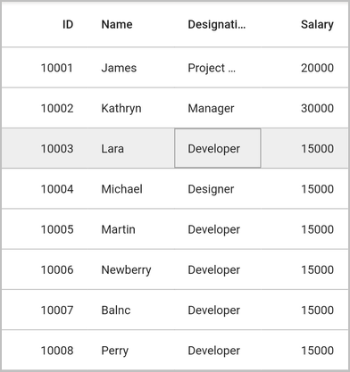
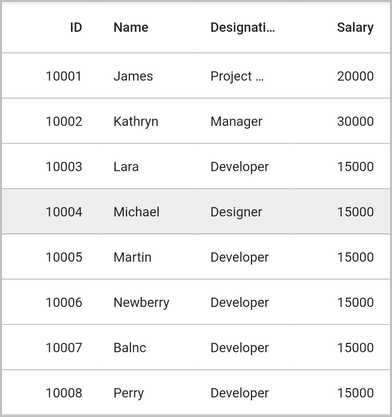
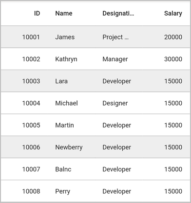
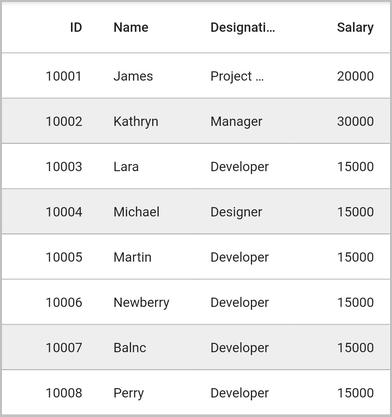
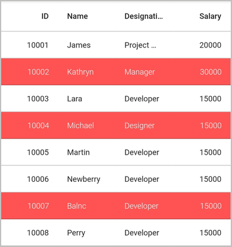
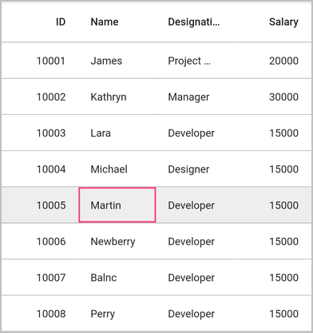

# Selection in Flutter (SfDataGrid)

This section explains how to enable selection in the datagrid; modes, properties, and callbacks involved in selection and customizations available for selection.

The datagrid allows you to select a specific row or group of rows either programmatically or by touch interactions. To enable selection, set the `selectionMode` property of SfDataGrid to a value other than `none`. SfDataGrid has different selection modes to perform the selection operation as follows.

## Selection modes 

<table>
<tr>
<th> Modes </th>
<th> Description </th>
</tr>
<tr>
<td> none </td>
<td> Disables selection, and no rows can be selected. This is the default value.</td>
</tr>
<tr>
<td> single </td>
<td> Allows selection of a single row only. Upon selecting the next row, the selection in the previous row is cleared. </td>
</tr>
<tr>
<td> multiple </td>
<td> Allows selection of more than one row. Selection is not cleared when selecting more than one row. When you click on a selected row for the second time, the selection is cleared. </td>
</tr>
<tr>
<td> singleDeselect </td>
<td> Allows selection of only a single row. However, upon tapping the row again, the selection is cleared. Similar to single mode, upon selecting the next row, the selection in the previous row is cleared. </td>
</tr>
</table>

### Current cell navigation

Keyboard navigation through the cells and rows is determined based on the `navigationMode` property. The `GridNavigationMode.cell` allows you to navigate between the cells in a row and between the rows. The `GridNavigationMode.row` allows you to navigate between the rows.




    final EmployeeDataSource _employeeDataSource = EmployeeDataSource();

    // NavigationMode cell
    @override
    Widget build(BuildContext context) {
      return Scaffold(
          body: SfDataGrid(
              source: _employeeDataSource,
              columns: [
                GridNumericColumn(mappingName: 'id', headerText: 'ID'),
                GridTextColumn(mappingName: 'name', headerText: 'Name'),
                GridTextColumn(mappingName: 'designation', headerText: 'Designation'),
                GridNumericColumn(mappingName: 'salary', headerText: 'Salary')
              ],
              selectionMode: SelectionMode.single
              navigationMode: GridNavigationMode.cell
          )
      );
    }




### Single row selection

It allows you to select only one row. For example, you have selected a row. Now if you select some other row, the previous row selection will be cleared. Hence it is a `single` row selection mode.



   
    final EmployeeDataSource _employeeDataSource = EmployeeDataSource();

    @override
    Widget build(BuildContext context){
      return Scaffold(
          body: SfDataGrid(
              source: _employeeDataSource,
              columns: [
                GridNumericColumn(mappingName: 'id', headerText: 'ID'),
                GridTextColumn(mappingName: 'name', headerText: 'Name'),
                GridTextColumn(mappingName: 'designation', headerText: 'Designation'),
                GridNumericColumn(mappingName: 'salary', headerText: 'Salary')
              ],
              selectionMode: SelectionMode.single
          )
      );
    }




### Multiple row selection

The SfDataGrid allows you to select multiple rows by setting `selectionMode` property as `multiple`,  where you can select multiple rows by click on SfDataGrid and also using the key modifiers.

While using `multiple`, you can select multiple rows by pressing the key modifiers <kbd>Shift</kbd> + <kbd>Down</kbd> and <kbd>Shift</kbd> + <kbd>Up</kbd>.




    final EmployeeDataSource _employeeDataSource = EmployeeDataSource();

    @override
    Widget build(BuildContext context){
      return Scaffold(
          body: SfDataGrid(
              source: _employeeDataSource,
              columns: [
                GridNumericColumn(mappingName: 'id', headerText: 'ID'),
                GridTextColumn(mappingName: 'name', headerText: 'Name'),
                GridTextColumn(mappingName: 'designation', headerText: 'Designation'),
                GridNumericColumn(mappingName: 'salary', headerText: 'Salary')
              ],
              selectionMode: SelectionMode.multiple
          )
      );
    }




N>  When the `selectionMode` is `multiple`, multiple rows can be selected or deselected by clicking the respective rows. In multiple selection, pressing navigation keys will move the current cell alone. The rows can be selected or deselected by pressing the <kbd>Space</kbd> key.

### Disable selection

The selection can be disabled by setting the `selectionMode` property as `none`.




    final EmployeeDataSource _employeeDataSource = EmployeeDataSource();

    @override
    Widget build(BuildContext context){
      return Scaffold(
          body: SfDataGrid(
              source: _employeeDataSource,
              columns: [
                GridNumericColumn(mappingName: 'id', headerText: 'ID'),
                GridTextColumn(mappingName: 'name', headerText: 'Name'),
                GridTextColumn(mappingName: 'designation', headerText: 'Designation'),
                GridNumericColumn(mappingName: 'salary', headerText: 'Salary')
              ],
              selectionMode: SelectionMode.none
          )
      );
    }




Selection on a particular row can be disabled by handling the `onCurrentCellActivating` callback.

 N> You cannot select the header row of SfDataGrid.

## Getting selected rows

You can get the information of selected rows by using `controller` property. Create an instance of `DataGridController` and set to controller property. The `selectedRow` property returns the data object of the selected row and the `selectedIndex` property returns the index of the `selectedRow` in SfDataGrid. `selectedRow` denotes the last selected row in multiple selection.



    
    final EmployeeDataSource _employeeDataSource = EmployeeDataSource();
  
    final DataGridController _dataGridController = DataGridController();
  
    @override
    Widget build(BuildContext context){
      return Scaffold(
          body: Column(
              children:[
                FlatButton(
                    child: Text('Get Selection Information'),
                    onPressed: () {
                      //SelectedIndex
                      var _selectedIndex = this._dataGridController.selectedIndex;

                      //SelectedRow    
                      var _selectedRow = this._dataGridController.selectedRow;

                      //SelectedRows
                      var _selectedRows = this._dataGridController.selectedRows;

                      print(_selectedIndex);
                      print(_selectedRow);
                      print(_selectedRows);
                    }),
                Expanded(
                    child: SfDataGrid(
                        source: _employeeDataSource,
                        columns: [
                          GridNumericColumn(mappingName: 'id', headerText: 'ID'),
                          GridTextColumn(mappingName: 'name', headerText: 'Name'),
                          GridTextColumn(mappingName: 'designation', headerText: 'Designation'),
                          GridNumericColumn(mappingName: 'salary', headerText: 'Salary')
                        ],
                        controller: this._dataGridController,
                        selectionMode: SelectionMode.multiple
                    ))
              ]
          )
      );
    }




N> DataGridController objects are expected to be long-lived, not re-created with each build.

## Programmatic selection

When `selectionMode` is set a value other than `none`, selected row/rows from the code by setting the `DataGridController.selectedIndex`, `DataGridController.selectedRow`, or `DataGridController.selectedRows` property based on the selection mode.  

When the selection mode is `single`, programmatically select a row in two ways either by setting the row index to the `DataGridController.selectedIndex` property, or by setting the underlying object to be selected to the `DataGridController.selectedRow` property

The following code example shows how to select a row using `selectedIndex`,



  
    final EmployeeDataSource _employeeDataSource = EmployeeDataSource();
    
    final DataGridController _dataGridController = DataGridController();

    @override
    Widget build(BuildContext context){
      return Scaffold(
          body: Column(
              children:[
                FlatButton(
                    child: Text('Set Selection'),
                    onPressed: () {
                       //SelectedIndex
                       _dataGridController.selectedIndex = 4
                    }),
                Expanded(
                    child: SfDataGrid(
                        source: _employeeDataSource,
                        columns: [
                          GridNumericColumn(mappingName: 'id', headerText: 'ID'),
                          GridTextColumn(mappingName: 'name', headerText: 'Name'),
                          GridTextColumn(mappingName: 'designation', headerText: 'Designation'),
                          GridNumericColumn(mappingName: 'salary', headerText: 'Salary')
                        ],
                        controller: this._dataGridController,
                        selectionMode: SelectionMode.single
                    ))
              ]
          )
      );
    }




The following code example shows how to select a row using `selectedRow`,




    final EmployeeDataSource _employeeDataSource = EmployeeDataSource();
    
    final DataGridController _dataGridController = DataGridController();

    @override
    Widget build(BuildContext context){
      return Scaffold(
          body: Column(
              children:[
                FlatButton(
                    child: Text('Set Selection'),
                    onPressed: () {
                       //SelectedRow 
                       _dataGridController.selectedRow = this.employees[3];
                    }),
                Expanded(
                    child: SfDataGrid(
                        source: _employeeDataSource,
                        columns: [
                          GridNumericColumn(mappingName: 'id', headerText: 'ID'),
                          GridTextColumn(mappingName: 'name', headerText: 'Name'),
                          GridTextColumn(mappingName: 'designation', headerText: 'Designation'),
                          GridNumericColumn(mappingName: 'salary', headerText: 'Salary')
                        ],
                        controller: this._dataGridController,
                        selectionMode: SelectionMode.single
                    ))
              ]
          )
      );
    }




Multiple rows can be selected by adding data objects to `selectedRows` property.




    final EmployeeDataSource _employeeDataSource = EmployeeDataSource();
    
    final DataGridController _dataGridController = DataGridController();

    @override
    Widget build(BuildContext context){
      return Scaffold(
          body: Column(
              children:[
                FlatButton(
                    child: Text('Set Selection'),
                    onPressed: () {
                       //SelectedRows 
                       _dataGridController.selectedRows = [
                                this.employees[1],
                                this.employees[3],
                                this.employees[6],
                              ]
                    }),
                Expanded(
                    child: SfDataGrid(
                        source: _employeeDataSource,
                        columns: [
                          GridNumericColumn(mappingName: 'id', headerText: 'ID'),
                          GridTextColumn(mappingName: 'name', headerText: 'Name'),
                          GridTextColumn(mappingName: 'designation', headerText: 'Designation'),
                          GridNumericColumn(mappingName: 'salary', headerText: 'Salary')
                        ],
                        controller: this._dataGridController,
                        selectionMode: SelectionMode.multiple
                    ))
              ]
          )
      );
    }




### Get the current cell

The current cell information such as row index, column index can be retrieved using the `currentCell` property of `DataGridController`. 




    final EmployeeDataSource _employeeDataSource = EmployeeDataSource();
  
    final DataGridController _dataGridController = DataGridController();
  
    @override
    Widget build(BuildContext context){
      return Scaffold(
          body: Column(
              children:[
                FlatButton(
                    child: Text('Get current cell'),
                    onPressed: () {
                      var _currentCell = this._dataGridController.currentCell;
                      print(_currentCell);
                    }),
                Expanded(
                    child: SfDataGrid(
                        source: _employeeDataSource,
                        columns: [
                          GridNumericColumn(mappingName: 'id', headerText: 'ID'),
                          GridTextColumn(mappingName: 'name', headerText: 'Name'),
                          GridTextColumn(mappingName: 'designation', headerText: 'Designation'),
                          GridNumericColumn(mappingName: 'salary', headerText: 'Salary')
                        ],
                        controller: this._dataGridController,
                        selectionMode: SelectionMode.single,
                        navigationMode: GridNavigationMode.cell
                    )
                )
              ]
          )
      );
    }




### Process current cell

The CurrentCell can be moved to a particular cell by using the `moveCurrentCellTo` method in `DataGridController`.




    final EmployeeDataSource _employeeDataSource = EmployeeDataSource();
  
    final DataGridController _dataGridController = DataGridController();
  
    @override
    Widget build(BuildContext context){
      return Scaffold(
          body: Column(
              children:[
                FlatButton(
                    child: Text('Move current cell'),
                    onPressed: () {
                      this._dataGridController.moveCurrentCellTo(RowColumnIndex(6,4))
                    }),
                Expanded(
                    child: SfDataGrid(
                        source: _employeeDataSource,
                        columns: [
                          GridNumericColumn(mappingName: 'id', headerText: 'ID'),
                          GridTextColumn(mappingName: 'name', headerText: 'Name'),
                          GridTextColumn(mappingName: 'designation', headerText: 'Designation'),
                          GridNumericColumn(mappingName: 'salary', headerText: 'Salary')
                        ],
                        controller: this._dataGridController,
                        selectionMode: SelectionMode.single,
                        navigationMode: GridNavigationMode.cell
                    )
                )
              ]
          )
      );
    }




### Clear selection

DataGrid allows you to clear the selection applied in the grid rows by setting the `DataGridController.selectedIndex` to `-1` or `DataGridController.selectedRow` to null when `selectionMode` property is in `single` or `singleDeselect`. On selectionMode property is in `multiple` you can clear the selection from grid rows by setting the `DataGridController.selectedRows` to `empty`.

The following code example shows how to clear selection when `selectionMode` property is in `single` or `singleDeselect`,




    final EmployeeDataSource _employeeDataSource = EmployeeDataSource();
  
    final DataGridController _dataGridController = DataGridController();
  
    @override
    Widget build(BuildContext context){
      return Scaffold(
          body: Column(
              children:[
                FlatButton(
                    child: Text('Get current cell'),
                    onPressed: () {
                      this._dataGridController.selectedIndex = -1;
                      //or
                      //this._dataGridController.selectedRow = null;
                    }),
                Expanded(
                    child: SfDataGrid(
                        source: _employeeDataSource,
                        columns: [
                          GridNumericColumn(mappingName: 'id', headerText: 'ID'),
                          GridTextColumn(mappingName: 'name', headerText: 'Name'),
                          GridTextColumn(mappingName: 'designation', headerText: 'Designation'),
                          GridNumericColumn(mappingName: 'salary', headerText: 'Salary')
                        ],
                        controller: this._dataGridController,
                        selectionMode: SelectionMode.single
                    )
                )
              ]
          )
      );
    }




The following code example shows how to clear selection when `selectionMode` property is in `multiple`,




    final EmployeeDataSource _employeeDataSource = EmployeeDataSource();
  
    final DataGridController _dataGridController = DataGridController();
  
    @override
    Widget build(BuildContext context){
      return Scaffold(
          body: Column(
              children:[
                FlatButton(
                    child: Text('Get current cell'),
                    onPressed: () {
                      this._dataGridController.selectedRows = [];
                    }),
                Expanded(
                    child: SfDataGrid(
                        source: _employeeDataSource,
                        columns: [
                          GridNumericColumn(mappingName: 'id', headerText: 'ID'),
                          GridTextColumn(mappingName: 'name', headerText: 'Name'),
                          GridTextColumn(mappingName: 'designation', headerText: 'Designation'),
                          GridNumericColumn(mappingName: 'salary', headerText: 'Salary')
                        ],
                        controller: this._dataGridController,
                        selectionMode: SelectionMode.multiple
                    )
                )
              ]
          )
      );
    }




N> Selected rows and selections will be cleared whenever the `dataSource` is changed at runtime.

## Keyboard behavior

<table>
<tr>
<th>
Key or KeyCombinations
</th>
<th>
Description
</th>
</tr>
<tr>
<td>
<kbd>DownArrow</kbd>
</td>
<td>
Moves CurrentCell directly below the active current cell. If the CurrentCell is in last row, pressing <kbd>DownArrow</kbd> does nothing.
</td>
</tr>
<tr>
<td>
<kbd>UpArrow</kbd>
</td>
<td>
Moves the CurrentCell directly above the active current cell. If the CurrentCell is in first row, pressing <kbd>UpArrow</kbd> does nothing.
</td>
</tr>
<tr>
<td>
<kbd>LeftArrow</kbd>
</td>
<td>
Moves the current cell to previous to the active current cell. If the CurrentCell is in first cell, pressing <kbd>LeftArrow</kbd> does nothing. If the focused row is group header, the group will be collapsed when it is in expanded state.
</td>
</tr>
<tr>
<td>
<kbd>RightArrow</kbd>
</td>
<td>
Moves the current cell to next to the active current cell. If the CurrentCell is in last cell, pressing <kbd>RightArrow</kbd> does nothing. If the focused row is group header, the group will expanded when it is in collapsed state.
</td>
</tr>
<tr>
<td>
<kbd>Home</kbd> / <kbd> Ctrl</kbd> + <kbd>LeftArrow</kbd>
</td>
<td>
Moves the current cell to the first cell of the current row.
</td>
</tr>
<tr>
<td>
<kbd>End</kbd> / <kbd>Ctrl</kbd> + <kbd>RightArrow</kbd>
</td>
<td>
Moves the current cell to the last cell of the current row.
</td>
</tr>
<tr>
<td>
<kbd>PageDown</kbd>
</td>
<td>
The SfDataGrid will be scrolled to next set of rows that are not displayed in view, including the row that are partially displayed and the current cell is set to last row.
</td>
</tr>
<tr>
<td>
<kbd>PageUp</kbd>
</td>
<td>
The SfDataGrid will be scrolled to previous set of rows that are not displayed in view, including the row that are partially displayed and the current cell is set to the first row.
</td>
</tr>
<tr>
<td>
<kbd>Tab</kbd>
</td>
<td>
Moves the current cell to next to the active current cell. If the active current cell is the last cell of the current row, the focus will moved to first cell of the row next to the current row.If the active current cell is the last cell of the last row, the focus will be moved to next widget in the tab order of the parent container.
</td>
</tr>
<tr>
<td>
<kbd>Shift</kbd> + <kbd>Tab</kbd>
</td>
<td>
Moves the current cell to previous to the active current cell. If the active current cell is the first cell of the current row, the current cell will moved to last cell of the row previous to the current row.If the active current cell is the first cell of the first row, the focus will be moved to previous widget in the tab order of the parent container.
</td>
</tr>
<tr>
<td>
<kbd>Ctrl</kbd> + <kbd>DownArrow</kbd>
</td>
<td>
Moves the current cell to the current column of the last row.
</td>
</tr>
<tr>
<td>
<kbd>Ctrl</kbd> + <kbd>UpArrow</kbd>
</td>
<td>
Moves the current cell to the current column of the first row.
</td>
</tr>
<tr>
<td>
<kbd>Ctrl</kbd> + <kbd>Home</kbd>
</td>
<td>
Moves the current cell to the first cell of the first row.
</td>
</tr>
<tr>
<td>
<kbd>Ctrl</kbd> + <kbd>End</kbd>
</td>
<td>
Moves the current cell to the last cell of the last row.
</td>
</tr>
<tr>
<td>
<kbd>Enter</kbd>
</td>
<td>
 The current cell will be moved to the next focused row of the same column.
</td>
</tr>
<tr>
<td>
<kbd>Ctrl</kbd> + <kbd>A</kbd>
</td>
<td>
All rows or cells will be selected.
</td>
</tr>
</table>

 N> When the `navigationMode` property is in `row`, the <kbd>UpArrow</kbd> and <kbd>DownArrow</kbd> only work.

## Callbacks

The datagrid provides the following callbacks for selection:

 * `onSelectionChanging` : This callback is raised while selecting a row at the execution time before the row is selected. So it allows canceling the selection action by return `false`.
 * `onSelectionChanged` : This callback is raised after the column is selected.

The followings are the parameters of the `onSelectionChanging` and `onSelectionChanged` callbacks,

 * newItems: Gets collection of the underlying data objects added for selection.
 * oldItems: Gets collection of the underlying data objects removed from selection.

The following example shows how to cancel the selection when select a row which contains the designation as Manager




    final EmployeeDataSource _employeeDataSource = EmployeeDataSource();

    @override
    Widget build(BuildContext context){
      return Scaffold(
          body: SfDataGrid(
            source: _employeeDataSource,
            columns: [
              GridNumericColumn(mappingName: 'id', headerText: 'ID'),
              GridTextColumn(mappingName: 'name', headerText: 'Name'),
              GridTextColumn(mappingName: 'designation', headerText: 'Designation'),
              GridNumericColumn(mappingName: 'salary', headerText: 'Salary')
            ],
            onSelectionChanging: (List<Object> addedRows, List<Object> removedRows){
                
                if(addedRows.isNotEmpty && (addedRows.last as employees).designation == 'Manager'){
                  return false;
                }
                
                return true;
            },
            onSelectionChanged: (List<Object> addedRows, List<Object> removedRows){
              // apply your logics
            },
          )
      );
    }




* `onCurrentCellActivating`: This callback is raised before the current cell applying to the corresponding grid cell of the selecting row. So it allows canceling the selection action by return `false`. If return false, the  selection will not apply and also `onSelectionChanging`, `onSelectionChanged` and `onCurrentCellActivated` are not called.
 * `onCurrentCellActivated`: This callback is raised after the current cell applied in grid cell on the selecting row.

 The followings are the parameters of the `onCurrentCellActivating` and `onCurrentCellActivated` callbacks,

 * newRowColumnIndex: Gets current RowColumnIndex of the current cell.
 * oldRowColumnIndex: Gets previous RowColumnIndex of the current cell.




    @override
    Widget build(BuildContext context) {
        return SfDataGrid(
            onCurrentCellActivating: (RowColumnIndex currentRowColumnIndex , RowColumnIndex previousRowColumnIndex){

                if(currentRowColumnIndex == RowColumnIndex(2,3)){
                    return false;
                }
               
                return true;
            },
            onCurrentCellActivated: (RowColumnIndex currentRowColumnIndex , RowColumnIndex previousRowColumnIndex){
               // apply your logics
            },
        );
    }




## Customizing selection behavior

To perform custom actions apart from the functionalities mentioned in the above tables for key press actions of the keyboard, implement your custom actions in the `handleKeyEvent()` override of the custom written selection manager class derived from `RowSelectionManager` and assign it to the `SfDataGrid.selectionManager` property.



  
    final EmployeeDataSource _employeeDataSource = EmployeeDataSource();

    @override
    Widget build(BuildContext context){
      return Scaffold(
          body: SfDataGrid(
            source: _employeeDataSource,
            columns: [
              GridNumericColumn(mappingName: 'id', headerText: 'ID'),
              GridTextColumn(mappingName: 'name', headerText: 'Name'),
              GridTextColumn(mappingName: 'designation', headerText: 'Designation'),
              GridNumericColumn(mappingName: 'salary', headerText: 'Salary')
            ],
            selectionMode: SelectionMode.multiple,
            selectionManager: CustomSelectionManager(),
          )
      );
    }

    class CustomSelectionManager extends RowSelectionManager{

        @override
        void handleKeyEvent(RawKeyEvent keyEvent) {
            if(keyEvent.logicalKey == LogicalKeyboardKey.keyA){
                if(keyEvent.isControlPressed){
                    //apply your logic
                    return;
                }
            }

            super.handleKeyEvent(keyEvent);
        }
    }


   

## Change Enter key behavior

When pressing the <kbd>Enter</kbd> key, the current cell will be moved to the next focused row of the same column, by default. The following code shows how to change the <kbd>Enter</kbd> key behavior by overriding the `handleKeyEvent()` method in `RowSelectionManager`.



   
    final EmployeeDataSource _employeeDataSource = EmployeeDataSource();
    
    @override
    Widget build(BuildContext context){
      return MaterialApp(
          home: Scaffold(
              body: SfDataGrid(
                source: _employeeDataSource,
                columns: [
                  GridNumericColumn(mappingName: 'id', headerText: 'ID'),
                  GridTextColumn(mappingName: 'name', headerText: 'Name'),
                  GridTextColumn(mappingName: 'designation', headerText: 'Designation'),
                  GridNumericColumn(mappingName: 'salary', headerText: 'Salary')
                ],
                selectionMode: SelectionMode.multiple,
                navigationMode: GridNavigationMode.cell,
                selectionManager: CustomSelectionManager(),
              ))
      );
    }

    class CustomSelectionManager extends RowSelectionManager{
        @override
        void handleKeyEvent(RawKeyEvent keyEvent) {
            if(keyEvent.logicalKey == LogicalKeyboardKey.enter){
                //apply your logic
                return;
            }

            super.handleKeyEvent(keyEvent);
        }
    }


   

## Appearance
 
SfDataGrid allows to customize the appearance of the selected rows and current cell through `SfDataGridTheme.SfDataGridThemeData` property.

### Selection
The selection background and foreground color can be changed by `selectionStyle` property of `SfDataGridThemeData` in `SfDataGridTheme`.




    final EmployeeDataSource _employeeDataSource = EmployeeDataSource();

    @override
    Widget build(BuildContext context) {
      return Scaffold(
          body: SfDataGridTheme(
              data: SfDataGridThemeData(
                  selectionStyle: DataGridCellStyle(
                      backgroundColor: Colors.red,
                      textStyle: TextStyle(
                        fontFamily: 'Raleway',
                        fontWeight: FontWeight.w300,
                        color: Colors.white,
                      )
                  )),
              child: SfDataGrid(
                source: _employeeDataSource,
                columns: [
                  GridNumericColumn(mappingName: 'id', headerText: 'ID'),
                  GridTextColumn(mappingName: 'name', headerText: 'Name'),
                  GridTextColumn(mappingName: 'designation', headerText: 'Designation'),
                  GridNumericColumn(mappingName: 'salary', headerText: 'Salary')
                ],
                selectionMode: SelectionMode.multiple,
              ))
      );
    }




### Current cell

The current cell border's color and thickness can be changed by `currentCellStyle` property of `SfDataGridThemeData` in `SfDataGridTheme`.




    final EmployeeDataSource _employeeDataSource = EmployeeDataSource();

    @override
    Widget build(BuildContext context){
      return Scaffold(
          body: SfDataGridTheme(
              data: SfDataGridThemeData(
                  currentCellStyle: DataGridCurrentCellStyle(
                      borderWidth: 2,
                      borderColor: Colors.pinkAccent
                  )
              ),
              child: SfDataGrid(
                source: _employeeDataSource,
                columns: [
                  GridNumericColumn(mappingName: 'id', headerText: 'ID'),
                  GridTextColumn(mappingName: 'name', headerText: 'Name'),
                  GridTextColumn(mappingName: 'designation', headerText: 'Designation'),
                  GridNumericColumn(mappingName: 'salary', headerText: 'Salary')
                ],
                selectionMode: SelectionMode.multiple,
              ))
      );
    }




