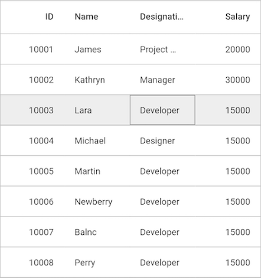
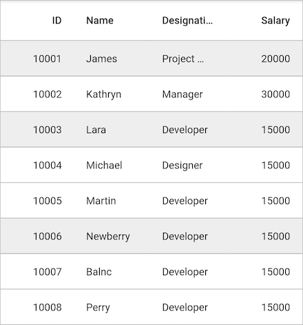
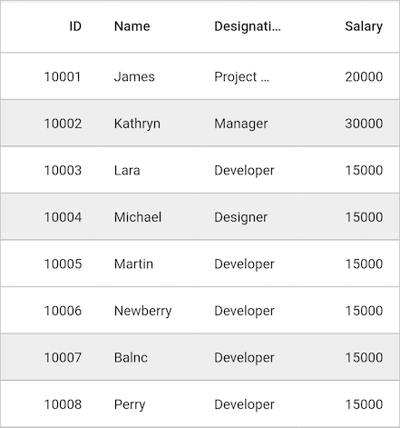
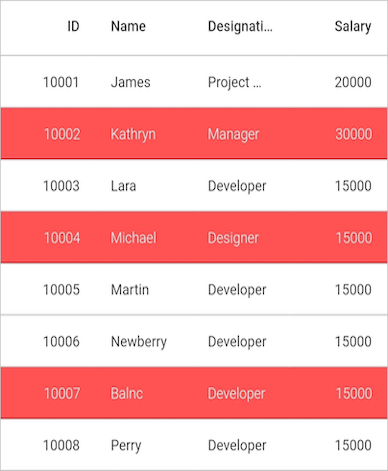
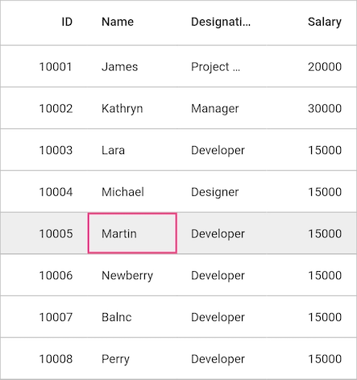

# Selection in Flutter (SfDataGrid)

This section explains how to enable selection in the data grid; modes, properties, and events involved in selection and customizations available for selection.

The data grid allows you to select a specific row or group of rows either programmatically or by touch interactions. To enable selection, set the `SfDataGrid.selectionMode` property to a value other than `none`. This control has different selection modes to perform the selection operation as follows.

## Selection modes 

<table>
<tr>
<th> Modes </th>
<th> Description </th>
</tr>
<tr>
<td> none </td>
<td>Disables selection, and no rows can be selected. This is the default value.</td>
</tr>
<tr>
<td> single </td>
<td> Allows selection of a single row only. Upon selecting the next row, the selection in the previous row is cleared. </td>
</tr>
<tr>
<td> multiple </td>
<td> Allows selection of more than one row. Selection is not cleared when selecting more than one record. When you click on a selected row for the second time, the selection is cleared. </td>
</tr>
<tr>
<td> singleDeselect </td>
<td> Allows selection of only a single row. However, upon tapping the row again, the selection is cleared. Similar to single mode, upon selecting the next row, the selection in the previous row is cleared. </td>
</tr>
</table>

### Current cell navigation

Keyboard navigation through the cells and rows is determined based on the `navigationMode` property. The `GridNavigationMode.cell` allows you to navigate between the cells in a row and between the rows. The `GridNavigationMode.row` allows you to navigate between the rows.




    @override
    Widget build(BuildContext context){
        return SfDataGrid(
            navigationMode: GridNavigationMode.cell
        );
    }




### Single row selection

It allows you to select only one item (record). For example, you have selected a record. Now if you select some other record, the previous record selection will be cleared. Hence it is a `single` record selection mode.




    @override
    Widget build(BuildContext context){
        return SfDataGrid(
            selectionMode: SelectionMode.single
        );
    }




### Multiple row selection

The SfDataGrid allows you to select multiple rows by setting SelectionMode property as `multiple`,  where you can select multiple rows by touch or mouse on SfDataGrid and also using the key modifiers.

While using `multiple`, you can select multiple rows by pressing the key modifiers <kbd>Shift</kbd> + <kbd>Down</kbd> and <kbd>Shift</kbd> + <kbd>Up</kbd>.




    @override
    Widget build(BuildContext context){
        return SfDataGrid(
            selectionMode: SelectionMode.multiple
        );
    }




The following image shows for multiple mode row selection.

>  When the SelectionMode is `multiple`, multiple rows can be selected or deselected by clicking the respective rows. In multiple selection, pressing navigation keys will move the current cell alone. The rows can be selected or deselected by pressing the <kbd>Space</kbd> key.

### Disable selection

The selection can be disabled by setting the SelectionMode property as `none`.




    @override
    Widget build(BuildContext context){
        return SfDataGrid(
            selectionMode: SelectionMode.none
        );
    }




Selection on a particular row can be disabled by handling the CurrentCellActivating event.

> You cannot select the header row of SfDataGrid.

## Getting selected rows

`DataGridController` is used to obtain the selection properties. The `selectedRow` property returns the data object of the selected row and the `selectedIndex` property returns the index of the `selectedRow` in SfDataGrid. SelectedRow denotes the last selected row in multiple selection.



    
    DataGridController _dataGridController;

    @override
    void initState() {
        this._dataGridController = DataGridController();
        super.initState();
    }

    @override
    Widget build(BuildContext context) {
        return SfDataGrid(
            controller: this._dataGridController
        );
    }







    //SelectedIndex
    var _selectedIndex = this._dataGridController.selectedIndex;

    //SelectedRow    
    var _selectedRow = this._dataGridController.selectedRow;

    //SelectedRows
    var _selectedRows = this._dataGridController.selectedRows;




> DataGridController objects are expected to be long-lived, not re-created with each build.

## Programmatic selection

When SfDataGrid.SelectionMode is set a value other than None, select row/rows from the code by setting the `DataGridController.SelectedIndex`, `DataGridController.SelectedRow`, or `DataGridController.SelectedRows` property based on the selection mode. To enable selection from code, follow the code example:

When the selection mode is Single, programmatically select a row in two ways either by setting the row index to the DataGridController.selectedIndex property, or by setting the underlying object to be selected to the DataGridController.selectedRow property

To programmatically select a row from the code, follow the code example:




    @override
    Widget build(BuildContext context) {
        //SelectedIndex
        return SfDataGrid(
            controller: DataGridController(
                selectedIndex : 4
            )
        );
        
        //SelectedRow
        return SfDataGrid(
            controller: DataGridController(
                selectedRow : this.employeeData[3]
            )
        );
    }




Multiple rows can be selected by adding data objects to SelectedRows property.



    
    @override
    Widget build(BuildContext context) {
        return SfDataGrid(
            controller: DataGridController(
                selectedRows = [
                    this.employeeData[1],
                    this.employeeData[3],
                    this.employeeData[6],
                ]
            )
        );
    }




### Get the currentcell

The current cell information such as row index, column index can be retrieved using the `DataGridController.currentCell` property. 




    var _currenCell = this._dataGridController.currentCell;




### Process currentcell

The CurrentCell can be moved to a particular RowColumnIndex by using the `moveCurrentCellTo` method.




    this._dataGridController.moveCurrentCellTo(RowColumnIndex(6,4);




### Clear selection

Data grid allows you to clear the selection applied in the grid rows either by setting the `SfDataGrid.SelectionMode` to `None`.




    //Clear selection using selection mode
    @override
    Widget build(BuildContext context) {
        return SfDataGrid(
            selectionMode : SelectionMode.none
        );
    }




N> Selected rows and selections will be cleared whenever the `dataSource` is changed at runtime.

## Keyboard behavior

<table>
<tr>
<th>
Key or KeyCombinations
</th>
<th>
Description
</th>
</tr>
<tr>
<td>
<kbd>DownArrow</kbd>
</td>
<td>
Moves CurrentCell directly below the active current cell. If the CurrentCell is in last row, pressing <kbd>DownArrow</kbd> does nothing.
</td>
</tr>
<tr>
<td>
<kbd>UpArrow</kbd>
</td>
<td>
Moves the CurrentCell directly above the active current cell. If the CurrentCell is in first row, pressing <kbd>UpArrow</kbd> does nothing.
</td>
</tr>
<tr>
<td>
<kbd>LeftArrow</kbd>
</td>
<td>
Moves the current cell to previous to the active current cell. If the CurrentCell is in first cell, pressing <kbd>LeftArrow</kbd> does nothing. If the focused row is group header, the group will be collapsed when it is in expanded state.
</td>
</tr>
<tr>
<td>
<kbd>RightArrow</kbd>
</td>
<td>
Moves the current cell to next to the active current cell. If the CurrentCell is in last cell, pressing <kbd>RightArrow</kbd> does nothing. If the focused row is group header, the group will expanded when it is in collapsed state.
</td>
</tr>
<tr>
<td>
<kbd>Home</kbd> / <kbd> Ctrl</kbd> + <kbd>LeftArrow</kbd>
</td>
<td>
Moves the current cell to the first cell of the current row.
</td>
</tr>
<tr>
<td>
<kbd>End</kbd> / <kbd>Ctrl</kbd> + <kbd>RightArrow</kbd>
</td>
<td>
Moves the current cell to the last cell of the current row.
</td>
</tr>
<tr>
<td>
<kbd>PageDown</kbd>
</td>
<td>
The SfDataGrid will be scrolled to next set of rows that are not displayed in view, including the row that are partially displayed and the current cell is set to last row.
</td>
</tr>
<tr>
<td>
<kbd>PageUp</kbd>
</td>
<td>
The SfDataGrid will be scrolled to previous set of rows that are not displayed in view, including the row that are partially displayed and the current cell is set to the first row.
</td>
</tr>
<tr>
<td>
<kbd>Tab</kbd>
</td>
<td>
Moves the current cell to next to the active current cell. If the active current cell is the last cell of the current row, the focus will moved to first cell of the row next to the current row.If the active current cell is the last cell of the last row, the focus will be moved to next control in the tab order of the parent container.
</td>
</tr>
<tr>
<td>
<kbd>Shift</kbd> + <kbd>Tab</kbd>
</td>
<td>
Moves the current cell to previous to the active current cell. If the active current cell is the first cell of the current row, the current cell will moved to last cell of the row previous to the current row.If the active current cell is the first cell of the first row, the focus will be moved to previous control in the tab order of the parent container.
</td>
</tr>
<tr>
<td>
<kbd>Ctrl</kbd> + <kbd>DownArrow</kbd>
</td>
<td>
Moves the current cell to the current column of the last row.
</td>
</tr>
<tr>
<td>
<kbd>Ctrl</kbd> + <kbd>UpArrow</kbd>
</td>
<td>
Moves the current cell to the current column of the first row.
</td>
</tr>
<tr>
<td>
<kbd>Ctrl</kbd> + <kbd>Home</kbd>
</td>
<td>
Moves the current cell to the first cell of the first row.
</td>
</tr>
<tr>
<td>
<kbd>Ctrl</kbd> + <kbd>End</kbd>
</td>
<td>
Moves the current cell to the last cell of the last row.
</td>
</tr>
<tr>
<td>
<kbd>Enter</kbd>
</td>
<td>
If the active current cell is in edit mode, the changes will committed and moves the current cell to below the active current cell. If the active current cell is in last row, commits changes only and retains in the same cell.
</td>
</tr>
<tr>
<td>
<kbd>Ctrl</kbd> + <kbd>A</kbd>
</td>
<td>
All rows or cells will be selected.
</td>
</tr>
</table>

 n> When the `NavigationMode` is in `row`, the <kbd>UpArrow</kbd> and <kbd>DownArrow</kbd> only work.

## Callbacks

The data grid provides the following events for selection:

 * `onSelectionChanging`: This event is raised while selecting a row at the execution time before the row is selected. So it allows canceling the selection action by return `false`.
 * `onSelectionChanged`: This event is raised after the column is selected.

These two events are triggered with following properties:

 * newItems: Gets collection of the underlying data objects added for selection.
 * oldItems: Gets collection of the underlying data objects removed from selection.

To hook the `onSelectionChanging` event and cancel the selection. follow the code example:




    @override
    Widget build(BuildContext context) {
        return SfDataGrid(
            onSelectionChanging: (List<Object> addedRows, List<Object> removedRows){
               // apply your logics
               return true;
            },
            onSelectionChanged: (List<Object> addedRows, List<Object> removedRows){
               // apply your logics
            },
        );
    }




* `onCurrentCellActivating`: This event is raised while selecting a cell at the execution time before the row is selected. So it allows canceling the selection action by return `false`.
 * `onCurrentCellActivated`: This event is raised after the cell is selected.




    @override
    Widget build(BuildContext context) {
        return SfDataGrid(
            onCurrentCellActivating: (RowColumnIndex currentRowColumnIndexm , RowColumnIndex previousRowColumnIndex){
               // apply your logics
               return true;
            },
            onCurrentCellActivated: (RowColumnIndex currentRowColumnIndexm , RowColumnIndex previousRowColumnIndex){
               // apply your logics
            },
        );
    }




## Customizing selection behavior

To perform custom actions apart from the functionalities mentioned in the above tables for key press actions of the keyboard, implement your custom actions in the handleKeyEvent() override of the custom written selection controller class derived from RowSelectionManager and assign it to the SfDataGrid.selectionManager property.




    @override
    Widget build(BuildContext context) {
        return SfDataGrid(
            selectionMode: SelectionMode.multiple,
            selectionManager: CustomSelectionManager(),
        );
    }


   




    class CustomSelectionManager extends RowSelectionManager{
        @override
        void handleKeyEvent(RawKeyEvent keyEvent) {
            if(keyEvent.logicalKey == LogicalKeyboardKey.keyA){
                if(keyEvent.isControlPressed){
                    //apply your logic
                    return;
                }
            }

            super.handleKeyEvent(keyEvent);
        }
    }



## Change Enter key behavior

When pressing the <kbd>Enter</kbd> key, the current cell will be moved to the next focused row of the same column, by default. The following code shows how to change the <kbd>Enter</kbd> key behavior by overriding the `handleKeyEvent` method in `RowSelectionManager`.




    @override
    Widget build(BuildContext context) {
        return SfDataGrid(
            selectionMode: SelectionMode.multiple,
            selectionManager: CustomSelectionManager(),
        );
    }


   




    class CustomSelectionManager extends RowSelectionManager{
        @override
        void handleKeyEvent(RawKeyEvent keyEvent) {
            if(keyEvent.logicalKey == LogicalKeyboardKey.arrowDown{
                if(keyEvent.isControlPressed){
                    //apply your logic
                    return;
                }
            }

            super.handleKeyEvent(keyEvent);
        }
    }



## Appearance
 
SfDataGrid allows to customize the appearance of the selected rows and current cell through `SfDataGridTheme.SfDataGridThemeData` property.

### Selection
The selection background and foreground color can be changed  of by `SfDataGridThemeData.selectionStyle` property from `SfDataGridTheme`.




    @override
    Widget build(BuildContext context) {
        return SfDataGridTheme(
          data: SfDataGridThemeData(
             selectionStyle: DataGridCellStyle(
               backgroundColor: Colors.red,
               textStyle: TextStyle(
                 fontFamily: 'Raleway',
                 fontWeight: FontWeight.w300,
                 color: Colors.white,
               )
             )
          ),
          child: SfDataGrid(
            selectionMode: SelectionMode.multiple,
          )
        );
    }




### CurrentCell

The BorderColor, and BorderThickness of the current cell can be changed by `SfDataGridThemeData.currentCellStyle` property from `SfDataGridTheme`.




    @override
    Widget build(BuildContext context) {
        return SfDataGridTheme(
        data: SfDataGridThemeData(
            currentCellStyle: DataGridCurrentCellStyle(
                borderWidth: 2,
                borderColor: Colors.pinkAccent
            )
        ),
        child: SfDataGrid(
            selectionMode: SelectionMode.single,
        );
    }




