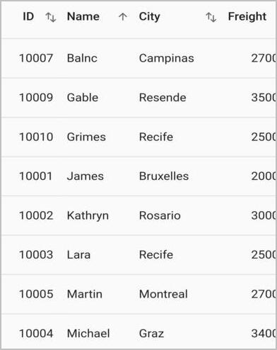
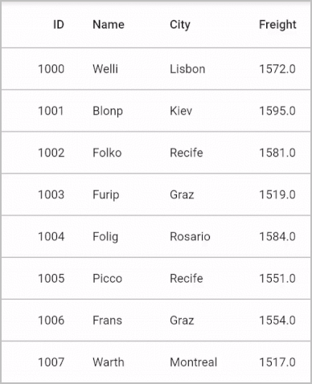
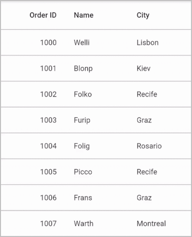
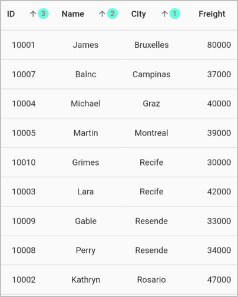
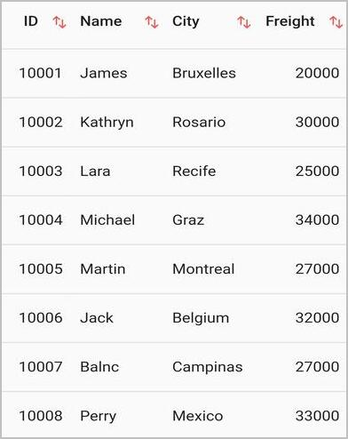
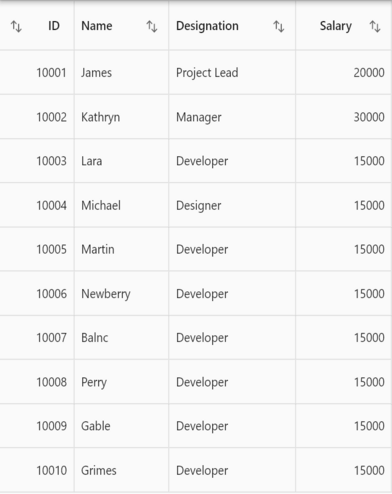
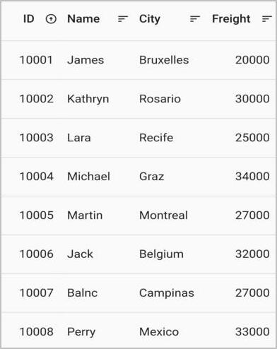
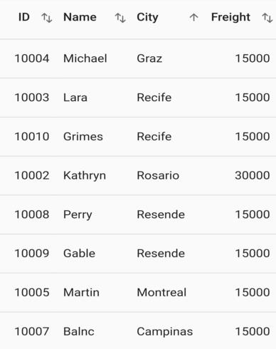
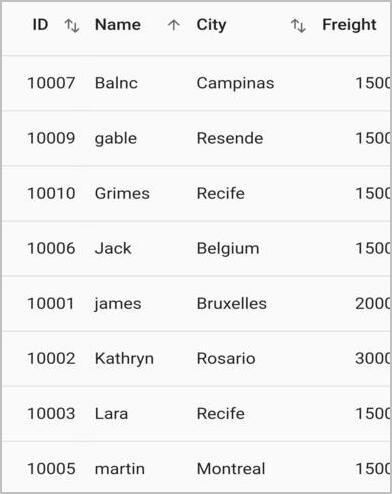

# Sorting in Flutter DataGrid (SfDataGrid)

The SfDataGrid provides built-in support to sort one or more columns by setting the [SfDataGrid.allowSorting](https://pub.dev/documentation/syncfusion_flutter_datagrid/latest/datagrid/SfDataGrid/allowSorting.html) property to true. When sorting is applied, the SfDataGrid automatically rearranges the data to match the current sort criteria. When `SfDataGrid.allowSorting` is true, sort the data by tapping the column header.

By default, the SfDataGrid shows an unsorted icon on every column header to indicate that sorting is enabled in the column. When sorting is applied, the SfDataGrid shows a sort icon in the column header to indicate the sort direction.

> **Note:** This feature requires `syncfusion_flutter_datagrid` package. Ensure the package is added to your `pubspec.yaml` file.

## Programmatic sorting

The SfDataGrid provides support to sort columns programmatically by creating [SortColumnDetails](https://pub.dev/documentation/syncfusion_flutter_datagrid/latest/datagrid/SortColumnDetails-class.html) objects and adding them to the [SfDataGrid.source.sortedColumns](https://pub.dev/documentation/syncfusion_flutter_datagrid/latest/datagrid/DataGridSource/sortedColumns.html) collection. After adding the sort details, call the [SfDataGrid.source.sort()](https://pub.dev/documentation/syncfusion_flutter_datagrid/latest/datagrid/DataGridSource/sort.html) method to apply the sort.

The `SortColumnDetails` object holds the following properties:

* [name](https://pub.dev/documentation/syncfusion_flutter_datagrid/latest/datagrid/SortColumnDetails/name.html) — Name of the column to be sorted.
* [sortDirection](https://pub.dev/documentation/syncfusion_flutter_datagrid/latest/datagrid/SortColumnDetails/sortDirection.html) — Specifies the sort direction. Use [DataGridSortDirection](https://pub.dev/documentation/syncfusion_flutter_datagrid/latest/datagrid/DataGridSortDirection.html) enum values: `ascending` or `descending`.

> **Note:** Ensure you have extended [DataGridSource](https://pub.dev/documentation/syncfusion_flutter_datagrid/latest/datagrid/DataGridSource-class.html) and implemented `buildRow()` method in your data source class before using programmatic sorting.


 

import 'package:syncfusion_flutter_datagrid/datagrid.dart';

  late EmployeeDataSource _employeeDataSource;
  List<Employee> _employees = <Employee>[];

  @override
  void initState() {
    super.initState();
    _employees = getEmployeeData();
    _employeeDataSource = EmployeeDataSource(employees: _employees);
  }

  @override
  Widget build(BuildContext context) {
    return Scaffold(
        body: Column(mainAxisAlignment: MainAxisAlignment.center, children: [
      SfDataGrid(source: _employeeDataSource, columns: [
        GridColumn(
            columnName: 'id',
            label: Container(
                padding: EdgeInsets.symmetric(horizontal: 16.0),
                alignment: Alignment.centerRight,
                child: Text(
                  'ID',
                  overflow: TextOverflow.ellipsis,
                ))),
        GridColumn(
            columnName: 'name',
            label: Container(
                padding: EdgeInsets.symmetric(horizontal: 16.0),
                alignment: Alignment.centerLeft,
                child: Text(
                  'Name',
                  overflow: TextOverflow.ellipsis,
                ))),
        GridColumn(
            columnName: 'city',
            label: Container(
                padding: EdgeInsets.symmetric(horizontal: 16.0),
                alignment: Alignment.centerLeft,
                child: Text(
                  'City',
                  overflow: TextOverflow.ellipsis,
                ))),
        GridColumn(
            columnName: 'freight',
            label: Container(
                padding: EdgeInsets.symmetric(horizontal: 16.0),
                alignment: Alignment.centerRight,
                child: Text(
                  'Freight',
                  overflow: TextOverflow.ellipsis,
                ))),
      ]),
      Padding(
        padding: EdgeInsets.symmetric(horizontal: 16.0),
        child: TextButton(
            onPressed: () {
              _employeeDataSource.sortedColumns.add(SortColumnDetails(
                  name: 'name', sortDirection: DataGridSortDirection.ascending));
              _employeeDataSource.sort();
            },
            child: Text('Apply sort')),
      )
    ]));
  }




## Multi-column sorting

The SfDataGrid can sort data across multiple columns by setting the [SfDataGrid.allowMultiColumnSorting](https://pub.dev/documentation/syncfusion_flutter_datagrid/latest/datagrid/SfDataGrid/allowMultiColumnSorting.html) property to true. You can sort an unlimited number of columns. To apply sorting for multiple columns, tap the desired column headers.

To apply sorting for multiple columns on the web and desktop, click the column header while pressing the <kbd>Ctrl</kbd> key.


 

import 'package:syncfusion_flutter_datagrid/datagrid.dart';

  @override
  Widget build(BuildContext context) {
    return Scaffold(
        body: SfDataGrid(
      source: _employeeDataSource,
      allowSorting: true,
      allowMultiColumnSorting: true,
      columns: [
        GridColumn(
            columnName: 'id',
            label: Container(
                padding: EdgeInsets.symmetric(horizontal: 16.0),
                alignment: Alignment.centerRight,
                child: Text(
                  'ID',
                  overflow: TextOverflow.ellipsis,
                ))),
        GridColumn(
            columnName: 'name',
            label: Container(
                padding: EdgeInsets.symmetric(horizontal: 16.0),
                alignment: Alignment.centerLeft,
                child: Text(
                  'Name',
                  overflow: TextOverflow.ellipsis,
                ))),
        GridColumn(
            columnName: 'city',
            label: Container(
                padding: EdgeInsets.symmetric(horizontal: 16.0),
                alignment: Alignment.centerLeft,
                child: Text(
                  'City',
                  overflow: TextOverflow.ellipsis,
                ))),
        GridColumn(
            columnName: 'freight',
            label: Container(
                padding: EdgeInsets.symmetric(horizontal: 16.0),
                alignment: Alignment.centerRight,
                child: Text(
                  'Freight',
                  overflow: TextOverflow.ellipsis,
                ))),
      ],
    ));
  }




## Tri-state sorting

The SfDataGrid supports tri-state sorting by setting the [SfDataGrid.allowTriStateSorting](https://pub.dev/documentation/syncfusion_flutter_datagrid/latest/datagrid/SfDataGrid/allowTriStateSorting.html) property to true. When enabled, clicking a column header cycles through three states: ascending, descending, and unsorted (original order).


 

import 'package:syncfusion_flutter_datagrid/datagrid.dart';

  @override
  Widget build(BuildContext context) {
    return Scaffold(
        body: SfDataGrid(
      source: _employeeDataSource,
      allowSorting: true,
      allowMultiColumnSorting: true,
      allowTriStateSorting: true,
      columns: [
        GridColumn(
            columnName: 'id',
            label: Container(
                padding: EdgeInsets.symmetric(horizontal: 16.0),
                alignment: Alignment.centerRight,
                child: Text(
                  'ID',
                  overflow: TextOverflow.ellipsis,
                ))),
        GridColumn(
            columnName: 'name',
            label: Container(
                padding: EdgeInsets.symmetric(horizontal: 16.0),
                alignment: Alignment.centerLeft,
                child: Text(
                  'Name',
                  overflow: TextOverflow.ellipsis,
                ))),
        GridColumn(
            columnName: 'city',
            label: Container(
                padding: EdgeInsets.symmetric(horizontal: 16.0),
                alignment: Alignment.centerLeft,
                child: Text(
                  'City',
                  overflow: TextOverflow.ellipsis,
                ))),
        GridColumn(
            columnName: 'freight',
            label: Container(
                padding: EdgeInsets.symmetric(horizontal: 16.0),
                alignment: Alignment.centerRight,
                child: Text(
                  'Freight',
                  overflow: TextOverflow.ellipsis,
                ))),
      ],
    ));
  }




## Sort column on double-tap

By default, the column is sorted on a single click. To require a double-tap to sort, set the [SfDataGrid.sortingGestureType](https://pub.dev/documentation/syncfusion_flutter_datagrid/latest/datagrid/SfDataGrid/sortingGestureType.html) property to `SortingGestureType.doubleTap`.


 

import 'package:syncfusion_flutter_datagrid/datagrid.dart';

  @override
  Widget build(BuildContext context) {
    return Scaffold(
        body: SfDataGrid(
      source: _employeeDataSource,
      allowSorting: true,
      sortingGestureType: SortingGestureType.doubleTap,
      columns: [
        GridColumn(
            columnName: 'id',
            label: Container(
                padding: EdgeInsets.symmetric(horizontal: 16.0),
                alignment: Alignment.centerRight,
                child: Text(
                  'ID',
                  overflow: TextOverflow.ellipsis,
                ))),
        GridColumn(
            columnName: 'name',
            label: Container(
                padding: EdgeInsets.symmetric(horizontal: 16.0),
                alignment: Alignment.centerLeft,
                child: Text(
                  'Name',
                  overflow: TextOverflow.ellipsis,
                ))),
        GridColumn(
            columnName: 'city',
            label: Container(
                padding: EdgeInsets.symmetric(horizontal: 16.0),
                alignment: Alignment.centerLeft,
                child: Text(
                  'City',
                  overflow: TextOverflow.ellipsis,
                ))),
        GridColumn(
            columnName: 'freight',
            label: Container(
                padding: EdgeInsets.symmetric(horizontal: 16.0),
                alignment: Alignment.centerRight,
                child: Text(
                  'Freight',
                  overflow: TextOverflow.ellipsis,
                ))),
      ],
    ));
  }




## Callbacks

The SfDataGrid provides the following callbacks for sorting:

* [onColumnSortChanging](https://pub.dev/documentation/syncfusion_flutter_datagrid/latest/datagrid/SfDataGrid/onColumnSortChanging.html) — Invoked before a column is sorted. Return `true` to allow sorting or `false` to cancel it.

* [onColumnSortChanged](https://pub.dev/documentation/syncfusion_flutter_datagrid/latest/datagrid/SfDataGrid/onColumnSortChanged.html) — Invoked after a column is sorted.

Both callbacks receive the following parameters:

* `newSortedColumn` — The [SortColumnDetails](https://pub.dev/documentation/syncfusion_flutter_datagrid/latest/datagrid/SortColumnDetails-class.html) being applied.

* `oldSortedColumn` — The previous [SortColumnDetails](https://pub.dev/documentation/syncfusion_flutter_datagrid/latest/datagrid/SortColumnDetails-class.html) that was removed.

The following example demonstrates how to use the `SfDataGrid.onColumnSortChanging` and `SfDataGrid.onColumnSortChanged` callbacks to sort a column and retrieve sorting details:


 

import 'package:syncfusion_flutter_datagrid/datagrid.dart';

  @override
  Widget build(BuildContext context) {
    return Scaffold(
      body: SfDataGrid(
        source: _employeeDataSource,
        allowSorting: true,
        onColumnSortChanging: (newSortedColumn, oldSortedColumn) {
          print(newSortedColumn);
          print(oldSortedColumn);
          return true;
        },
        onColumnSortChanged: (newSortedColumn, oldSortedColumn) {
          print(newSortedColumn);
          print(oldSortedColumn);
        },
        columns: [
          GridColumn(
            columnName: 'id',
            label: Container(
              padding: EdgeInsets.symmetric(horizontal: 16.0),
              alignment: Alignment.centerRight,
              child: Text(
                'ID',
                overflow: TextOverflow.ellipsis,
              ),
            ),
          ),
          GridColumn(
            columnName: 'name',
            label: Container(
              padding: EdgeInsets.symmetric(horizontal: 16.0),
              alignment: Alignment.centerLeft,
              child: Text(
                'Name',
                overflow: TextOverflow.ellipsis,
              ),
            ),
          ),
          GridColumn(
            columnName: 'city',
            label: Container(
              padding: EdgeInsets.symmetric(horizontal: 16.0),
              alignment: Alignment.centerLeft,
              child: Text(
                'City',
                overflow: TextOverflow.ellipsis,
              ),
            ),
          ),
          GridColumn(
            columnName: 'freight',
            label: Container(
              padding: EdgeInsets.symmetric(horizontal: 16.0),
              alignment: Alignment.centerRight,
              child: Text(
                'Freight',
                overflow: TextOverflow.ellipsis,
              ),
            ),
          ),
        ],
      ),
    );
  }




## Show sort numbers

Display the sort order sequence numbers for multiple sorted columns by setting [SfDataGrid.showSortNumbers](https://pub.dev/documentation/syncfusion_flutter_datagrid/latest/datagrid/SfDataGrid/showSortNumbers.html) to true. This is only applicable when [SfDataGrid.allowMultiColumnSorting](https://pub.dev/documentation/syncfusion_flutter_datagrid/latest/datagrid/SfDataGrid/allowMultiColumnSorting.html) is enabled.


 

import 'package:syncfusion_flutter_datagrid/datagrid.dart';

  @override
  Widget build(BuildContext context) {
    return Scaffold(
        body: SfDataGrid(
      source: _employeeDataSource,
      allowSorting: true,
      allowMultiColumnSorting: true,
      showSortNumbers: true,
      columns: [
        GridColumn(
            columnName: 'id',
            label: Container(
                padding: EdgeInsets.symmetric(horizontal: 16.0),
                alignment: Alignment.centerRight,
                child: Text(
                  'ID',
                  overflow: TextOverflow.ellipsis,
                ))),
        GridColumn(
            columnName: 'name',
            label: Container(
                padding: EdgeInsets.symmetric(horizontal: 16.0),
                alignment: Alignment.centerLeft,
                child: Text(
                  'Name',
                  overflow: TextOverflow.ellipsis,
                ))),
        GridColumn(
            columnName: 'city',
            label: Container(
                padding: EdgeInsets.symmetric(horizontal: 16.0),
                alignment: Alignment.centerLeft,
                child: Text(
                  'City',
                  overflow: TextOverflow.ellipsis,
                ))),
        GridColumn(
            columnName: 'freight',
            label: Container(
                padding: EdgeInsets.symmetric(horizontal: 16.0),
                alignment: Alignment.centerRight,
                child: Text(
                  'Freight',
                  overflow: TextOverflow.ellipsis,
                ))),
      ],
    ));
  }
  



## Customize sort number and background color

Customize the sort order number color and its background color using the [SfDataGridThemeData.sortOrderNumberColor](https://pub.dev/documentation/syncfusion_flutter_core/latest/theme/SfDataGridThemeData/sortOrderNumberColor.html) and [SfDataGridThemeData.sortOrderNumberBackgroundColor](https://pub.dev/documentation/syncfusion_flutter_core/latest/theme/SfDataGridThemeData/sortOrderNumberBackgroundColor.html) properties.

> **Note:** The default background color is inherited from the platform theme. If not set, it uses the app's primary color.


 

import 'package:syncfusion_flutter_core/theme.dart';
import 'package:syncfusion_flutter_datagrid/datagrid.dart';

  @override
  Widget build(BuildContext context) {
    return Scaffold(
      appBar: AppBar(title: const Text('Syncfusion Flutter DataGrid')),
      body: SfDataGridTheme(
        data: SfDataGridThemeData(
            sortOrderNumberBackgroundColor: Colors.tealAccent,
            sortOrderNumberColor: Colors.pink),
        child: SfDataGrid(
            source: employeeDataSource,
            columnWidthMode: ColumnWidthMode.auto,
            allowSorting: true,
            allowMultiColumnSorting: true,
            showSortNumbers: true,
            columns: <GridColumn>[
              GridColumn(
                  columnName: 'id',
                  label: Container(
                      padding: const EdgeInsets.symmetric(horizontal: 8.0),
                      alignment: Alignment.center,
                      child: const Text(
                        'ID'))),
              GridColumn(
                  columnName: 'name',
                  label: Container(
                      padding: const EdgeInsets.symmetric(horizontal: 8.0),
                      alignment: Alignment.center,
                      child: const Text('Name'))),
              GridColumn(
                  columnName: 'city',
                  label: Container(
                      padding: const EdgeInsets.symmetric(horizontal: 8.0),
                      alignment: Alignment.center,
                      child: const Text('City'))),
              GridColumn(
                  columnName: 'freight',
                  label: Container(
                      padding: const EdgeInsets.symmetric(horizontal: 8.0),
                      alignment: Alignment.center,
                      child: const Text('Freight'))),
            ]),
      ),
    );
  }
  



## Disable sorting for an individual column

Disable sorting for a specific column by setting the [GridColumn.allowSorting](https://pub.dev/documentation/syncfusion_flutter_datagrid/latest/datagrid/GridColumn/allowSorting.html) property to false. By default, all columns are sortable when [SfDataGrid.allowSorting](https://pub.dev/documentation/syncfusion_flutter_datagrid/latest/datagrid/SfDataGrid/allowSorting.html) is set to true.


 

import 'package:syncfusion_flutter_datagrid/datagrid.dart';

  @override
  Widget build(BuildContext context) {
    return Scaffold(
        body: SfDataGrid(
      source: _employeeDataSource,
      allowSorting: true,
      columns: [
        GridColumn(
            columnName: 'id',
            label: Container(
                padding: EdgeInsets.symmetric(horizontal: 16.0),
                alignment: Alignment.centerRight,
                child: Text(
                  'ID',
                  overflow: TextOverflow.ellipsis,
                ))),
        GridColumn(
            columnName: 'name',
            allowSorting: false,
            label: Container(
                padding: EdgeInsets.symmetric(horizontal: 16.0),
                alignment: Alignment.centerLeft,
                child: Text(
                  'Name',
                  overflow: TextOverflow.ellipsis,
                ))),
        GridColumn(
            columnName: 'city',
            label: Container(
                padding: EdgeInsets.symmetric(horizontal: 16.0),
                alignment: Alignment.centerLeft,
                child: Text(
                  'City',
                  overflow: TextOverflow.ellipsis,
                ))),
        GridColumn(
            columnName: 'freight',
            label: Container(
                padding: EdgeInsets.symmetric(horizontal: 16.0),
                alignment: Alignment.centerRight,
                child: Text(
                  'Freight',
                  overflow: TextOverflow.ellipsis,
                ))),
      ],
    ));
  }
  



## Customize the sort icon color

Customize the sort icon color using the [SfDataGridThemeData.sortIconColor](https://pub.dev/documentation/syncfusion_flutter_core/latest/theme/SfDataGridThemeData/sortIconColor.html) property. Wrap the SfDataGrid in [SfDataGridTheme](https://pub.dev/documentation/syncfusion_flutter_core/latest/theme/SfDataGridTheme-class.html) to apply the theme.


 

import 'package:syncfusion_flutter_datagrid/datagrid.dart';
import 'package:syncfusion_flutter_core/theme.dart';

  @override
  Widget build(BuildContext context) {
    return Scaffold(
        body: SfDataGridTheme(
      data: SfDataGridThemeData(sortIconColor: Colors.redAccent),
      child: SfDataGrid(
        source: _employeeDataSource,
        allowSorting: true,
        allowMultiColumnSorting: true,
        columns: [
          GridColumn(
              columnName: 'id',
              label: Container(
                  padding: EdgeInsets.symmetric(horizontal: 16.0),
                  alignment: Alignment.centerRight,
                  child: Text(
                    'ID',
                    overflow: TextOverflow.ellipsis,
                  ))),
          GridColumn(
              columnName: 'name',
              label: Container(
                  padding: EdgeInsets.symmetric(horizontal: 16.0),
                  alignment: Alignment.centerLeft,
                  child: Text(
                    'Name',
                    overflow: TextOverflow.ellipsis,
                  ))),
          GridColumn(
              columnName: 'city',
              label: Container(
                  padding: EdgeInsets.symmetric(horizontal: 16.0),
                  alignment: Alignment.centerLeft,
                  child: Text(
                    'City',
                    overflow: TextOverflow.ellipsis,
                  ))),
          GridColumn(
              columnName: 'freight',
              label: Container(
                  padding: EdgeInsets.symmetric(horizontal: 16.0),
                  alignment: Alignment.centerRight,
                  child: Text(
                    'Freight',
                    overflow: TextOverflow.ellipsis,
                  ))),
        ],
      ),
    ));
  }




## Customize the sort icon position

Change the sort icon position using the [GridColumn.sortIconPosition](https://pub.dev/documentation/syncfusion_flutter_datagrid/latest/datagrid/GridColumn/sortIconPosition.html) property. Supported positions are defined in [ColumnHeaderIconPosition](https://pub.dev/documentation/syncfusion_flutter_datagrid/latest/datagrid/ColumnHeaderIconPosition.html).


 

import 'package:syncfusion_flutter_datagrid/datagrid.dart';

  @override
  Widget build(BuildContext context) {
    return Scaffold(
        body: SfDataGrid(
        source: _employeeDataSource,
        allowSorting: true,
        allowMultiColumnSorting: true,
        gridLinesVisibility: GridLinesVisibility.both,
        headerGridLinesVisibility: GridLinesVisibility.both,
        columns: [
          GridColumn(
              sortIconPosition: ColumnHeaderIconPosition.start,
              columnName: 'id',
              label: Container(
                  padding: EdgeInsets.symmetric(horizontal: 8.0),
                  alignment: Alignment.centerRight,
                  child: Text(
                    'ID',
                    overflow: TextOverflow.ellipsis,
                  ))),
          GridColumn(
              columnName: 'name',
              label: Container(
                  padding: EdgeInsets.symmetric(horizontal: 8.0),
                  alignment: Alignment.centerLeft,
                  child: Text(
                    'Name',
                    overflow: TextOverflow.ellipsis,
                  ))),
          GridColumn(
              columnName: 'designation',
              label: Container(
                  padding: EdgeInsets.all(8.0),
                  alignment: Alignment.centerLeft,
                  child: Text(
                    'Designation',
                    overflow: TextOverflow.ellipsis,
                  ))),
          GridColumn(
              columnName: 'salary',
              label: Container(
                  padding: EdgeInsets.all(8.0),
                  alignment: Alignment.centerRight,
                  child: Text('Salary'
                  ))),
        ],
      ),
    );
  }




## Customize sort icons

Replace the default sort icons by setting the [SfDataGridThemeData.sortIcon](https://pub.dev/documentation/syncfusion_flutter_core/latest/theme/SfDataGridThemeData/sortIcon.html) property. Wrap the SfDataGrid in [SfDataGridTheme](https://pub.dev/documentation/syncfusion_flutter_core/latest/theme/SfDataGridTheme-class.html) from the [syncfusion_flutter_core](https://pub.dev/packages/syncfusion_flutter_core) package.

Use a [Builder](https://api.flutter.dev/flutter/widgets/Builder-class.html) widget to display different icons based on the current sort state. You must return icons for all three states: ascending, descending, and unsorted.




import 'package:syncfusion_flutter_core/theme.dart';
import 'package:syncfusion_flutter_datagrid/datagrid.dart';

  @override
  Widget build(BuildContext context) {
    return Scaffold(
      appBar: AppBar(title: const Text('Syncfusion Flutter DataGrid')),
      body: SfDataGridTheme(
        data: SfDataGridThemeData(
          sortIcon: Builder(
            builder: (context) {
              Widget? icon;
              String columnName = '';
              context.visitAncestorElements((element) {
                if (element.widget is GridHeaderCell) {
                  final headerCell = element.widget as GridHeaderCell;
                  columnName = headerCell.column.columnName;
                }
                return true;
              });
              final sortedColumn = _employeeDataSource.sortedColumns
                  .where((element) => element.name == columnName)
                  .firstOrNull;
              if (sortedColumn != null) {
                if (sortedColumn.sortDirection == DataGridSortDirection.ascending) {
                  icon = const Icon(Icons.arrow_circle_up_rounded, size: 16);
                } else if (sortedColumn.sortDirection == DataGridSortDirection.descending) {
                  icon = const Icon(Icons.arrow_circle_down_rounded, size: 16);
                }
              }
              return icon ?? const Icon(Icons.sort_outlined, size: 16);
            },
          ),
        ),
        child: SfDataGrid(
          source: _employeeDataSource,
          allowSorting: true,
          columns: <GridColumn>[
            GridColumn(
                columnName: 'id',
                label: Container(
                    padding: const EdgeInsets.symmetric(horizontal: 8.0),
                    alignment: Alignment.centerRight,
                    child: const Text(
                      'ID',
                    ))),
            GridColumn(
                columnName: 'name',
                label: Container(
                    padding: const EdgeInsets.symmetric(horizontal: 8.0),
                    alignment: Alignment.centerLeft,
                    child: const Text('Name'))),
            GridColumn(
                columnName: 'city',
                label: Container(
                    padding: const EdgeInsets.symmetric(horizontal: 8.0),
                    alignment: Alignment.centerLeft,
                    child: const Text('City'))),
            GridColumn(
                columnName: 'freight',
                label: Container(
                    padding: const EdgeInsets.symmetric(horizontal: 8.0),
                    alignment: Alignment.centerRight,
                    child: const Text('Freight'))),
          ],
        ),
      ),
    );
  }




## Custom sorting

Implement custom sorting logic by overriding methods in the [DataGridSource](https://pub.dev/documentation/syncfusion_flutter_datagrid/latest/datagrid/DataGridSource-class.html) class:

* [compare](https://pub.dev/documentation/syncfusion_flutter_datagrid/latest/datagrid/DataGridSource/compare.html) — Override to compare two rows and return: `-1` (first < second), `0` (equal), or `1` (first > second) based on your criteria.
* [performSorting](https://pub.dev/documentation/syncfusion_flutter_datagrid/latest/datagrid/DataGridSource/performSorting.html) — Override for complete control over the sorting process, useful for asynchronous or server-side sorting.

### Sort columns based on string length

Sort columns by string length instead of alphabetical order by overriding the `compare` method.


 

import 'package:syncfusion_flutter_datagrid/datagrid.dart';

class EmployeeDataSource extends DataGridSource {
  EmployeeDataSource({required List<Employee> employees}) {
    dataGridRows = employees
        .map<DataGridRow>((dataGridRow) => DataGridRow(cells: [
              DataGridCell<int>(columnName: 'id', value: dataGridRow.id),
              DataGridCell<String>(columnName: 'name', value: dataGridRow.name),
              DataGridCell<String>(
                  columnName: 'designation', value: dataGridRow.designation),
              DataGridCell<int>(columnName: 'salary', value: dataGridRow.salary)
            ]))
        .toList();
  }

  List<DataGridRow> dataGridRows = [];

  @override
  List<DataGridRow> get rows => dataGridRows;

  @override
  DataGridRowAdapter? buildRow(DataGridRow row) {
    return DataGridRowAdapter(
        cells: row.getCells().map<Widget>((dataGridCell) {
      return Container(
          alignment: (dataGridCell.columnName == 'id' ||
                  dataGridCell.columnName == 'salary')
              ? Alignment.centerRight
              : Alignment.centerLeft,
          padding: EdgeInsets.symmetric(horizontal: 16.0),
          child: Text(
            dataGridCell.value.toString(),
            overflow: TextOverflow.ellipsis,
          ));
    }).toList());
  }

  @override
  int compare(DataGridRow? a, DataGridRow? b, SortColumnDetails sortColumn) {
    final String? value1 = a
        ?.getCells()
        .firstWhereOrNull((element) => element.columnName == sortColumn.name)
        ?.value as String?;
    final String? value2 = b
        ?.getCells()
        .firstWhereOrNull((element) => element.columnName == sortColumn.name)
        ?.value as String?;

    if (value1 == null || value2 == null) {
      return 0;
    }

    final int lengthComparison = value1.length.compareTo(value2.length);
    
    if (sortColumn.sortDirection == DataGridSortDirection.ascending) {
      return lengthComparison;
    } else {
      return -lengthComparison;
    }
  }
}




> **Reference:** Download the complete sample from [GitHub](https://github.com/SyncfusionExamples/how-to-sort-the-columns-based-on-length-of-the-text-in-Flutter-datagrid).

### Case-insensitive sorting

Sort string columns in a case-insensitive manner by overriding the `compare` method.


 

import 'package:syncfusion_flutter_datagrid/datagrid.dart';

class EmployeeDataSource extends DataGridSource {
  EmployeeDataSource({required List<Employee> employees}) {
    dataGridRows = employees
        .map<DataGridRow>((dataGridRow) => DataGridRow(cells: [
              DataGridCell<int>(columnName: 'id', value: dataGridRow.id),
              DataGridCell<String>(columnName: 'name', value: dataGridRow.name),
              DataGridCell<String>(
                  columnName: 'designation', value: dataGridRow.designation),
              DataGridCell<int>(columnName: 'salary', value: dataGridRow.salary)
            ]))
        .toList();
  }

  List<DataGridRow> dataGridRows = [];

  @override
  List<DataGridRow> get rows => dataGridRows;

  @override
  DataGridRowAdapter? buildRow(DataGridRow row) {
    return DataGridRowAdapter(
        cells: row.getCells().map<Widget>((dataGridCell) {
      return Container(
          alignment: (dataGridCell.columnName == 'id' ||
                  dataGridCell.columnName == 'salary')
              ? Alignment.centerRight
              : Alignment.centerLeft,
          padding: EdgeInsets.symmetric(horizontal: 16.0),
          child: Text(
            dataGridCell.value.toString(),
            overflow: TextOverflow.ellipsis,
          ));
    }).toList());
  }

  @override
  int compare(DataGridRow? a, DataGridRow? b, SortColumnDetails sortColumn) {
    if (sortColumn.name == 'name') {
      final String? value1 = a
          ?.getCells()
          .firstWhereOrNull((element) => element.columnName == sortColumn.name)
          ?.value as String?;
      final String? value2 = b
          ?.getCells()
          .firstWhereOrNull((element) => element.columnName == sortColumn.name)
          ?.value as String?;

      if (value1 == null || value2 == null) {
        return 0;
      }

      final int comparisonResult = value1.toLowerCase().compareTo(value2.toLowerCase());
      
      if (sortColumn.sortDirection == DataGridSortDirection.ascending) {
        return comparisonResult;
      } else {
        return -comparisonResult;
      }
    }

    return 0;
  }
}




> **Reference:** Download the complete sample from [GitHub](https://github.com/SyncfusionExamples/how-to-perform-case-insensitive-sorting-in-flutter-datagrid).

## Perform sorting asynchronously

Use the [performSorting](https://pub.dev/documentation/syncfusion_flutter_datagrid/latest/datagrid/DataGridSource/performSorting.html) method to implement asynchronous sorting, such as server-side or database sorting. This method is called when sorting is applied to any column.

> **Note:** Use this approach when sorting large datasets or implementing server-side sorting to prevent UI freezing.


 

import 'package:syncfusion_flutter_datagrid/datagrid.dart';

final StreamController<bool> loadingController = StreamController<bool>();

class Employee {
  Employee({required this.id, required this.name, required this.designation, required this.salary});
  final int id;
  final String name;
  final String designation;
  final int salary;
}

class _MyHomePageState extends State<MyHomePage> {
  late EmployeeDataSource employeeDataSource;

  @override
  void initState() {
    super.initState();
    final employees = getEmployeeData();
    employeeDataSource = EmployeeDataSource(employeeData: employees);
  }

  @override
  Widget build(BuildContext context) {
    return Scaffold(
        appBar: AppBar(
          title: const Text('Syncfusion Flutter DataGrid'),
        ),
        body: StreamBuilder<bool>(
            stream: loadingController.stream,
            builder: (BuildContext context, AsyncSnapshot<bool> snapshot) {
              return Stack(children: [
                SfDataGrid(
                  source: employeeDataSource,
                  columnWidthMode: ColumnWidthMode.fill,
                  allowSorting: true,
                  allowMultiColumnSorting: true,
                  showSortNumbers: true,
                  gridLinesVisibility: GridLinesVisibility.both,
                  headerGridLinesVisibility: GridLinesVisibility.both,
                  columns: <GridColumn>[
                    GridColumn(
                        columnName: 'id',
                        label: Container(
                            padding: const EdgeInsets.all(16.0),
                            alignment: Alignment.centerRight,
                            child: const Text('ID'))),
                    GridColumn(
                        columnName: 'name',
                        label: Container(
                            padding: const EdgeInsets.all(8.0),
                            alignment: Alignment.centerLeft,
                            child: const Text('Name'))),
                    GridColumn(
                        columnName: 'designation',
                        label: Container(
                            padding: const EdgeInsets.all(8.0),
                            alignment: Alignment.centerLeft,
                            child: const Text('Designation', overflow: TextOverflow.ellipsis))),
                    GridColumn(
                        columnName: 'salary',
                        label: Container(
                            padding: const EdgeInsets.all(8.0),
                            alignment: Alignment.centerRight,
                            child: const Text('Salary'))),
                  ],
                ),
                if (snapshot.data == true)
                  const Center(
                    child: CircularProgressIndicator(),
                  ),
              ]);
            }));
  }

  @override
  void dispose() {
    loadingController.dispose();
    super.dispose();
  }
}

class EmployeeDataSource extends DataGridSource {
  EmployeeDataSource({required List<Employee> employeeData}) {
    _employeeData = employeeData
        .map<DataGridRow>((e) => DataGridRow(cells: [
              DataGridCell<int>(columnName: 'id', value: e.id),
              DataGridCell<String>(columnName: 'name', value: e.name),
              DataGridCell<String>(columnName: 'designation', value: e.designation),
              DataGridCell<int>(columnName: 'salary', value: e.salary),
            ]))
        .toList();
  }

  List<DataGridRow> _employeeData = [];

  @override
  List<DataGridRow> get rows => _employeeData;

  @override
  DataGridRowAdapter buildRow(DataGridRow row) {
    return DataGridRowAdapter(
        cells: row.getCells().map<Widget>((e) {
      return Container(
        alignment: e.columnName == 'id' || e.columnName == 'salary'
            ? Alignment.centerRight
            : Alignment.centerLeft,
        padding: const EdgeInsets.all(8.0),
        child: Text(e.value.toString()),
      );
    }).toList());
  }

  @override
  Future<void> performSorting(List<DataGridRow> rows) async {
    if (sortedColumns.isEmpty) {
      return;
    }
    
    try {
      loadingController.add(true);
      // Simulate server-side sorting delay
      await Future<void>.delayed(const Duration(seconds: 2));
      
      // Sort the data based on sortedColumns
      _employeeData.sort((DataGridRow a, DataGridRow b) {
        for (final SortColumnDetails sortColumn in sortedColumns) {
          final int result = compare(a, b, sortColumn);
          if (result != 0) {
            return result;
          }
        }
        return 0;
      });
      
      loadingController.add(false);
      notifyListeners();
    } catch (e) {
      loadingController.add(false);
      rethrow;
    }
  }

  @override
  int compare(DataGridRow? a, DataGridRow? b, SortColumnDetails sortColumn) {
    if (a == null || b == null) return 0;

    final value1 = a.getCells()
        .firstWhereOrNull((element) => element.columnName == sortColumn.name)
        ?.value;
    final value2 = b.getCells()
        .firstWhereOrNull((element) => element.columnName == sortColumn.name)
        ?.value;

    if (value1 == null || value2 == null) return 0;

    int result;
    if (value1 is int && value2 is int) {
      result = value1.compareTo(value2);
    } else {
      result = value1.toString().compareTo(value2.toString());
    }

    if (sortColumn.sortDirection == DataGridSortDirection.descending) {
      result = -result;
    }
    return result;
  }
}
  


