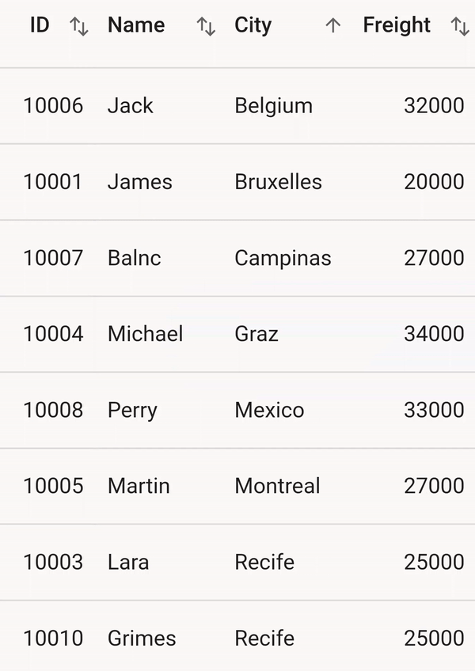
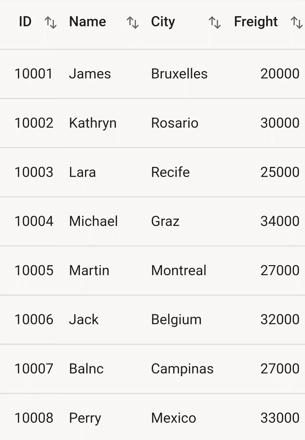

# Sorting in Flutter Datagrid

The datagrid provides the built-in support to sort one or more columns by setting the `SfDataGrid.allowSorting` property to true. When sorting is applied, the datagrid automatically rearranges the data to match with the current sort criteria. When `SfDataGrid.allowSorting` is true, you can sort the data simply by tapping the column header. Once sorting is applied, the datagrid shows a sort icon in the respective column header indicating the sort direction.

## Programmatic sorting

The datagrid provides support to sort the columns programmatically. You can manually define the `SortColumnDetails` objects, and add it in the `SfDataGrid.source.sortedColumns` collection. The datagrid sorts the data based on the `SortColumnDetails` objects added to this collection. If you want to perform sorting at run time, you should call `SfDataGrid.source.sort()` method after adding the `SortColumnDetails` to the `SfDataGrid.source.sortedColumns` collection. 

The `SortColumnDetails` object holds the following two properties:

* `name` : Name of the column to be sorted.
* `sortDirection` : Specifies the ascending or descending direction.


 

import 'package:syncfusion_flutter_datagrid/datagrid.dart';

@override
Widget build(BuildContext context) {
  return Scaffold(
    body: Column(
      mainAxisAlignment: MainAxisAlignment.center,
      children: [
        SfDataGrid(
          source: _employeeDataSource,
          columns: [
            GridNumericColumn(mappingName: 'id', headerText: 'ID'),
            GridTextColumn(mappingName: 'name', headerText: 'Name'),
            GridTextColumn(mappingName: 'city', headerText: 'City'),
            GridNumericColumn(mappingName: 'freight', headerText: 'Freight')
          ],
        ),
        Padding(
          padding: const EdgeInsets.all(8.0),
          child: FlatButton(
              onPressed: () {
                _employeeDataSource.sortedColumns.add(SortColumnDetails(
                    name: 'name',
                    sortDirection: DataGridSortDirection.ascending));
                _employeeDataSource.sort();
              },
              child: Text('Apply sort')),
        )
      ],
    ),
  );
}




## Multi-column sorting

The datagrid sorts the data against more than one columns by setting the `SfDataGrid.allowMultiColumnSorting` property to true. The number of columns by which the data can be sorted is unlimited. To apply sorting for multiple columns, tap the desired column headers after setting the `SfDataGrid.allowMultiColumnSorting` property.
To apply sorting for multiple columns in web, you can click the column header by pressing the <kbd>Ctrl</kbd> key.


 

import 'package:syncfusion_flutter_datagrid/datagrid.dart';

@override
Widget build(BuildContext context) {
  return Scaffold(
      body: SfDataGrid(
    source: _employeeDataSource,
    allowSorting: true,
    allowMultiColumnSorting: true,
    columns: [
      GridNumericColumn(mappingName: 'id', headerText: 'ID'),
      GridTextColumn(mappingName: 'name', headerText: 'Name'),
      GridTextColumn(mappingName: 'city', headerText: 'City'),
      GridNumericColumn(mappingName: 'freight', headerText: 'Freight')
    ],
  ));
}




## Tri-state sorting

In addition to sort the data in ascending/descending order, the SfDataGrid unsort the data in the original order by clicking the header again after sorting to descending order by setting the `SfDataGrid.allowTriStateSorting` property to true. When this property is set, sorting in each column iterates through three sort states: ascending, descending, and unsort.


 

import 'package:syncfusion_flutter_datagrid/datagrid.dart';

@override
Widget build(BuildContext context) {
  return Scaffold(
      body: SfDataGrid(
    source: _employeeDataSource,
    allowSorting: true,
    allowMultiColumnSorting: true,
    allowTriStateSorting: true,
    columns: [
      GridNumericColumn(mappingName: 'id', headerText: 'ID'),
      GridTextColumn(mappingName: 'name', headerText: 'Name'),
      GridTextColumn(mappingName: 'city', headerText: 'City'),
      GridNumericColumn(mappingName: 'freight', headerText: 'Freight')
    ],
  ));
}




## Sort column in double tap

By default, column gets sorted when column header clicked. This behavior can be changed to sort the column in double click action by setting `SfDataGrid.sortingGestureType` property to `doubleTap`.


 

import 'package:syncfusion_flutter_datagrid/datagrid.dart';

@override
Widget build(BuildContext context) {
  return Scaffold(
      body: SfDataGrid(
    source: _employeeDataSource,
    allowSorting: true,
    sortingGestureType: SortingGestureType.doubleTap,
    columns: [
      GridNumericColumn(mappingName: 'id', headerText: 'ID'),
      GridTextColumn(mappingName: 'name', headerText: 'Name'),
      GridTextColumn(mappingName: 'city', headerText: 'City'),
      GridNumericColumn(mappingName: 'freight', headerText: 'Freight')
    ],
  ));
}




## Show sort number

The datagrid provides support the sequence numbers to display the sorted columns during multi-column sorting by setting `SfDataGrid.showSortNumbers` is set to true. This is applicable when the `SfDataGrid.allowMultiColumnSorting` property is enabled.


 

import 'package:syncfusion_flutter_datagrid/datagrid.dart';

@override
Widget build(BuildContext context) {
  return Scaffold(
      body: SfDataGrid(
    source: _employeeDataSource,
    allowSorting: true,
    allowMultiColumnSorting: true,
    showSortNumbers: true,
    columns: [
      GridNumericColumn(mappingName: 'id', headerText: 'Order ID'),
      GridTextColumn(mappingName: 'name', headerText: 'Name'),
      GridTextColumn(mappingName: 'city', headerText: 'City'),
    ],
  ));
}
  



## Disable sorting for an individual column

The data grid disables sorting for an individual column by setting the `GridColumn.allowSorting` property to false. The default value of this property is true. So all the columns in the `SfDataGrid.columns` collection can be sorted when `SfDataGrid.allowSorting` is set to true.


 

import 'package:syncfusion_flutter_datagrid/datagrid.dart';

@override
Widget build(BuildContext context) {
  return Scaffold(
      body: SfDataGrid(
    source: _employeeDataSource,
    allowSorting: true,
    columns: [
      GridNumericColumn(mappingName: 'id', headerText: 'ID')
        ..allowSorting = false,
      GridTextColumn(mappingName: 'name', headerText: 'Name'),
      GridTextColumn(mappingName: 'city', headerText: 'City'),
      GridNumericColumn(mappingName: 'freight', headerText: 'Freight')
    ],
  ));
}
  



## Change the color of sort icon

The color of sort icon can be customized by using `SfDataGridThemeData.headerStyle.sortIconColor` and `GridColumn.headerStyle.sortIconColor`.

The following code describes how to change sort icon color by using `GridColumn`.


 

import 'package:syncfusion_flutter_datagrid/datagrid.dart';

@override
Widget build(BuildContext context) {
  return Scaffold(
      body: SfDataGrid(
    source: _employeeDataSource,
    allowSorting: true,
    columns: [
      GridNumericColumn(mappingName: 'id', headerText: 'ID')
        ..headerStyle = DataGridHeaderCellStyle(sortIconColor: Colors.redAccent),
      GridTextColumn(mappingName: 'name', headerText: 'Name'),
      GridTextColumn(mappingName: 'city', headerText: 'City'),
      GridNumericColumn(mappingName: 'freight', headerText: 'Freight')
    ],
  ));
}
  



The following code describes how to change sort icon color by using `SfDataGridTheme`.


 

import 'package:syncfusion_flutter_datagrid/datagrid.dart';
import 'package:syncfusion_flutter_core/theme.dart';

@override
Widget build(BuildContext context) {
  return Scaffold(
      body: SfDataGridTheme(
    data: SfDataGridThemeData(
        headerStyle: DataGridHeaderCellStyle(
            sortIconColor: Colors.redAccent,
            backgroundColor: SfDataGridThemeData(brightness: Brightness.light)
                .headerStyle
                .backgroundColor,
            textStyle: SfDataGridThemeData(brightness: Brightness.light)
                .headerStyle
                .textStyle)),
    child: SfDataGrid(
      source: _employeeDataSource,
      allowSorting: true,
      allowMultiColumnSorting: true,
      columns: [
        GridNumericColumn(mappingName: 'id', headerText: 'ID'),
        GridTextColumn(mappingName: 'name', headerText: 'Name'),
        GridTextColumn(mappingName: 'city', headerText: 'City'),
        GridNumericColumn(mappingName: 'freight', headerText: 'Freight')
      ],
    ),
  ));
}
  



## Custom sorting

The datagrid allows to sort columns based on custom logic. For each column, you can provide different sorting criteria by overriding `handleSort()` method from DataGridSource.handleSort. you can get the sort columns from `SfDataGrid.source.sortedColumns` collection. So you can apply different custom logics for ascending and descending.

The following code shows how to perform custom sorting for the columns based on the string length.


 

import 'package:syncfusion_flutter_datagrid/datagrid.dart';

class EmployeeDataSource extends DataGridSource<Employee> {
  @override
  Future<bool> handleSort() async {
    if (_employeeDataGridSource.sortedColumns.isNotEmpty) {
      var sortColumn = _employeeDataGridSource.sortedColumns.first;
      var isSortAscending = DataGridSortDirection.ascending;
      _employeeData.sort((Employee a, Employee b) {
        var x = getValue(a, sortColumn.name);
        var y = getValue(b, sortColumn.name);
        if (x == null || y == null) {
          if (sortColumn.sortDirection == isSortAscending) {
            return x == null ? -1 : 1;
          }
          if (sortColumn.sortDirection != isSortAscending) {
            return x == null ? 1 : -1;
          }
        }
        int xLength = x.toString().length;
        int yLength = y.toString().length;
        if (xLength.compareTo(yLength) > 0) {
          return sortColumn.sortDirection == isSortAscending ? 1 : -1;
        } else if (xLength.compareTo(yLength) == -1) {
          return sortColumn.sortDirection == isSortAscending ? -1 : 1;
        } else {
          return 0;
        }
      });
    }
    return true;
  }
}




